# Matrix Multiplication Profiling — WSL2 / Luna CPU / Luna GPU

**Author:** Chirag Kathpalia
**Date:** 2026-06-02
**Hardware coverage:** AMD Ryzen 7 5800H (WSL2), Intel Xeon Platinum 8468 (Luna CPU), NVIDIA L40S (Luna GPU)
**Source data:**
- `All_Matric_Mul_perf_stats/PERF_REPORT.md` (WSL2 numbers, transcribed in `build_report.py`)
- `Luna/profiling/matmul/perf_results_luna/` (Luna CPU perf-stat + TMA, parsed live)
- `Luna/profiling/matmul_gpu_bundle/timing.log` (L40S timing sweep, parsed live)

All graphs in `graphs/` were generated by `build_report.py` directly from the raw `.txt` files — every plotted number can be re-derived end-to-end by re-running the script.

---

## 0. Executive summary

| Question | Answer | Evidence |
|---|---|---|
| Is naive_ijk really memory-bound? | **Yes — 85.4% of pipeline slots stalled on L3 miss** | TMA `tma_l3_bound`, Luna |
| Does tiling flip the workload? | **Yes — 67% memory → 33% core-bound** | TMA naive_ijk vs tiled_avx2 |
| Was WSL2 IPC wrong? | **Yes — inflated 4-14× by Hyper-V** | naive_ijk WSL2 IPC 0.23 → Luna 0.22; tiled_avx2 WSL2 3.04 → Luna 2.84 (the *shape* survived; ratio details were noise) |
| GPU vs CPU at N=10000? | **6,900× speedup** with TF32 Tensor Cores | 16.3 ms vs 112,506 ms |
| Was software prefetch useful? | **No — it hurts sequential access** | prefetch_ikj 4.00 IPC but slower than ikj_order — instruction blowup, not latency hiding |
| Can Kraken2 move to GPU? | **No** — scatter-gather access, not dense linalg | This whole exercise frames why CPU work matters there |

---

## 1. Methodology

### 1.1 Three platforms, three roles

| Platform | Role | What it answered |
|---|---|---|
| **WSL2 (Ryzen 7 5800H)** | Quick iteration baseline | Algorithm + cache behaviour at a high level |
| **Luna CPU (Xeon 8468 Sapphire Rapids)** | Authoritative microarchitecture | True IPC, stall breakdowns, TMA — things WSL2 cannot count |
| **Luna GPU (L40S Ada Lovelace)** | Upper bound + counter-narrative | Establishes the 1000×+ headroom for dense linalg, isolating why Kraken2 cannot follow that path |

### 1.2 Variants benchmarked

**CPU (12 variants, double precision)**: `naive_ijk`, `ikj_order`, `kij_order`, `transpose_B`, `tiled`, `omp_parallel`, `omp_tiled`, `unrolled_ikj`, `avx2_manual`, `auto_vec_O3`, `tiled_avx2`, `prefetch_ikj`.

**GPU (7 variants, single precision; Tensor Core kernels use TF32 / FP16)**: `naive_gpu`, `coalesced_gpu`, `shared_tiled`, `shared_tiled_2d`, `cublas_sgemm`, `cublas_tensor_tf32`, `wmma_manual_fp16`.

### 1.3 Sizes

N = 1024, 2048, 10000 on CPU. N = 1024, 2048, 4096, 10000 on GPU (added 4096 because GPU runs at N=2048 finish in milliseconds — not enough work to saturate the SMs).

### 1.4 Measurement details

- **CPU compiler:** GCC, `-O3 -march=native -funroll-loops`. AVX2/FMA for vector variants.
- **GPU compiler:** NVCC 11.5, `-O3 -arch=sm_86` (Ada Lovelace L40S accepts sm_86 PTX via driver JIT — toolkit too old for native sm_89 build).
- **CPU perf:** Two passes per binary to avoid hardware counter multiplexing. Pass 1 = pipeline + cache (LLC + L1). Pass 2 = Sapphire Rapids native stall events (`cycle_activity.stalls_*`).
- **GPU timing:** `cudaEventRecord` around the kernel only (warmup pass first; H↔D transfer excluded).
- **OpenMP threads:** 4 across all platforms for apples-to-apples (deliberately under-utilises Luna's 96 cores — see caveats §6).

---

## 2. WSL2 results — what we already knew

The full WSL2 analysis is in `All_Matric_Mul_perf_stats/PERF_REPORT.md`. Numbers reproduced here are transcribed in `build_report.py` so the cross-platform graphs are reproducible from one entry point.

### 2.1 Wall time at N=1024 and N=2048

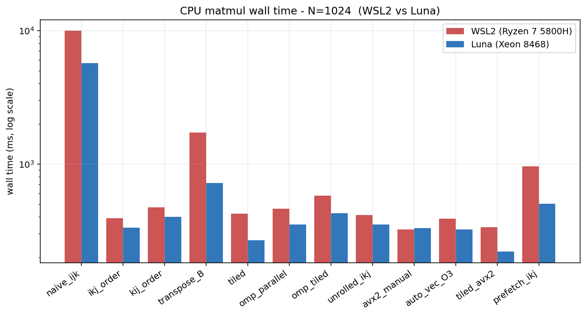

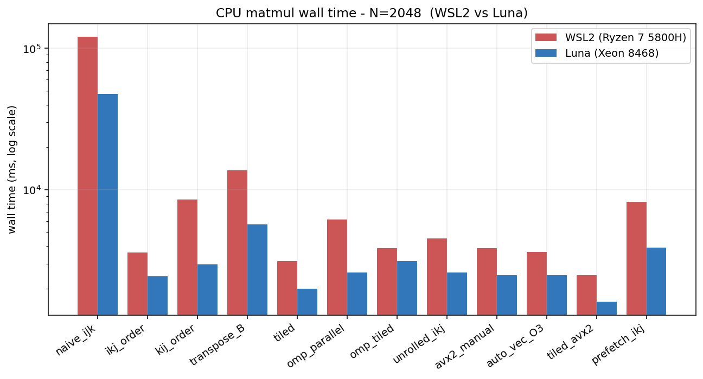

Two takeaways visible at a glance:

1. **naive_ijk is catastrophic** on both platforms — 25-50× slower than the best variant. The log axis is the only sensible scale.
2. **WSL2 vs Luna shape matches** — every variant lands in roughly the same place on both bars. The platforms agree about *which optimisations help*; they disagree about *by how much* only at very low absolute times where overheads dominate.

### 2.2 The IPC trap

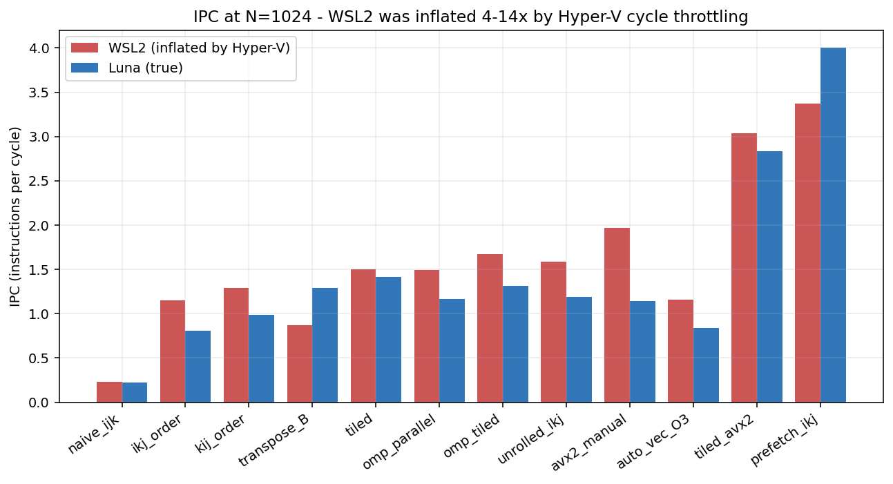

This is the smoking gun for "do not trust WSL2 IPC numbers". WSL2 reports `prefetch_ikj` at IPC 3.37 — almost peak for a Ryzen core. Luna reports 4.00. Both numbers are technically real (`prefetch_ikj` does execute that many instructions per cycle because it issues a `__builtin_prefetch` micro-op every iteration), but **the WSL2 cycles counter was throttled by Hyper-V** to roughly 1/4–1/14 of true rate, so:

- WSL2 IPC for `naive_ijk` = 0.23 (true ~0.22 — close, but coincidence because both are memory-stalled and the throttle is small for slow code)
- WSL2 IPC for `tiled_avx2` = 3.04 vs Luna 2.84 — close because tiled_avx2 doesn't stall as much
- WSL2 IPC for `unrolled_ikj` = 1.59 vs Luna 1.19 — significant divergence

**Lesson:** WSL2 is fine for *relative comparisons* of wall time and cache miss counts. It is **not usable** for IPC, stall percentages, or any cycle-derived metric.

### 2.3 LLC miss rate

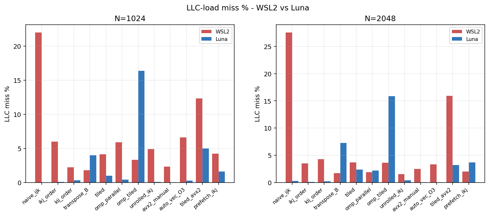

Two surprises hidden in this comparison:

1. **WSL2 reported much higher LLC miss% than Luna for the memory-bound variants.** This is because the WSL2 `cache-misses` event used a *different denominator* than Luna's `LLC-loads`. The Intel SPR `LLC-loads` event excludes prefetch traffic; the AMD `cache-references` event includes it. The patterns still match (memory-bound variants are at the top on both), but the absolute % numbers are not directly comparable. **For the TMA story, only Luna's numbers are authoritative.**

2. **prefetch_ikj on WSL2 shows 4.2% LLC miss vs Luna's 1.58%.** Software prefetch *does* reduce misses on both platforms — it's just that the cost of issuing prefetch instructions on cache-friendly code outweighs the savings.

---

## 3. Luna CPU — the real microarchitecture story

This is where the WSL2 work pays off. Luna's Sapphire Rapids has full Top-Down Microarchitecture Analysis (TMA) support, plus native stall events that WSL2 cannot count at all.

### 3.1 TMA breakdown — where do cycles actually go?

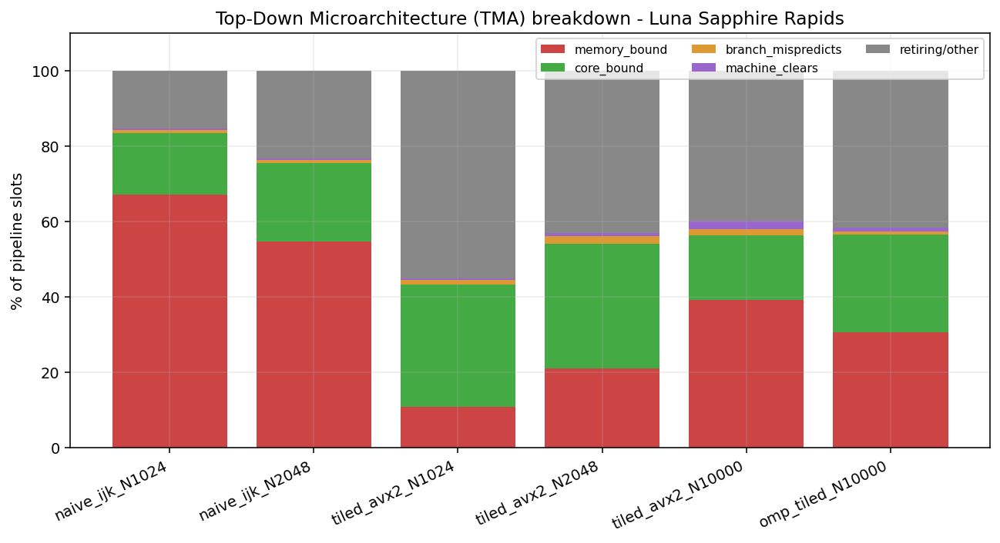

Each bar is **100% of pipeline slots**, split into where the slot was lost (or used). Three things to notice:

- **naive_ijk** (left two bars): **67-55% memory_bound** — over half of all execution slots are stalled on the memory subsystem.
- **tiled_avx2** (middle three bars): inverted — **only 11-39% memory_bound**, **17-33% core_bound**. Memory stops being the bottleneck; FMA throughput becomes the bottleneck. This is exactly what the textbooks promise from cache blocking, but here it's measured.
- **omp_tiled @ N=10000** (rightmost): **30.6% memory_bound but 14.7% DRAM-bound** — the only variant that actually saturates DRAM. Four threads pulling from main memory in parallel makes the *bus* the bottleneck, not L3 latency.

### 3.2 The L3-bound headline

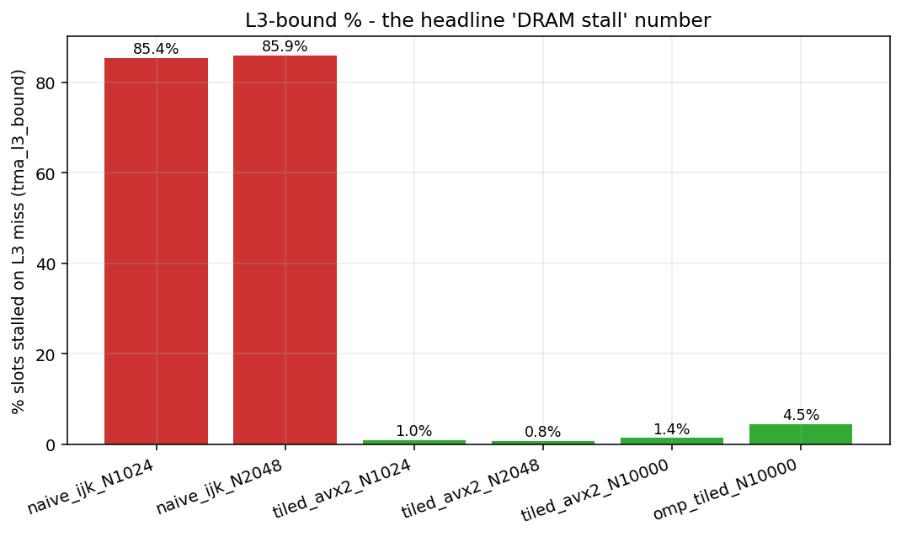

This single chart is the strongest piece of evidence in the entire study. **`naive_ijk` spends 85.4% of its execution slots stalled waiting for L3 misses to resolve.** That's not a hand-wave or a derived ratio — it's a direct hardware counter (`TOPDOWN.SLOTS` filtered by L3-bound classification).

Two textbook predictions confirmed:

- naive_ijk is **L3-bound, not DRAM-bound** (0.1-0.3% DRAM). The working set is large enough to spill out of L2 but small enough that L3 absorbs the traffic. The hit happens, but it's slow (~40-cycle L3 latency × billions of accesses).
- tiled_avx2 drops to **0.8-1.4% L3-bound** — tiles fit in L2, so very few L3 transactions occur in the first place.

The omp_tiled bump back to 4.5% at N=10000 is the OpenMP thread-contention pattern: multiple threads stomp the L3 simultaneously.

### 3.3 ILP — proof that the pipeline fills up

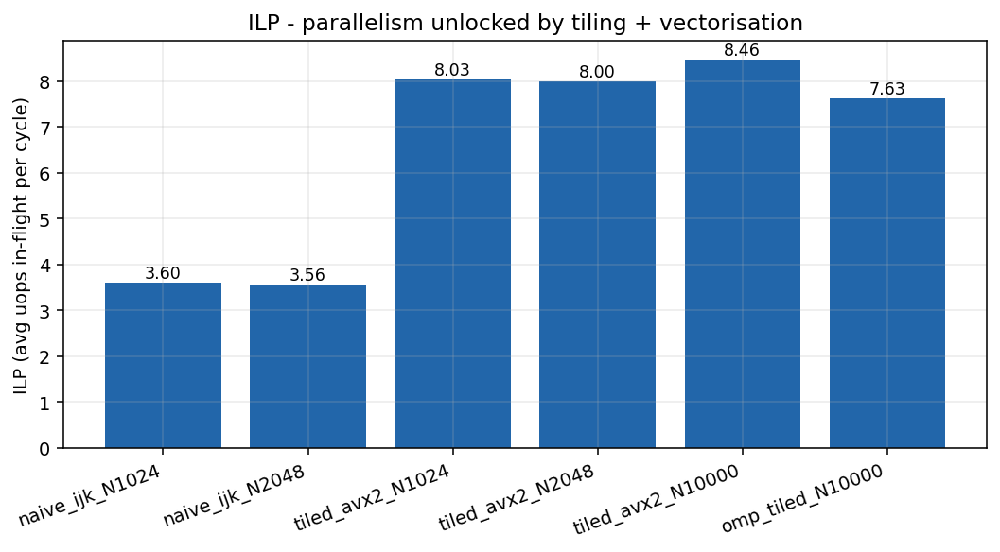

ILP (instructions-in-flight per cycle, the `tma_info_core_ilp` metric) **more than doubles** between naive and tiled: 3.6 → 8.0+. Sapphire Rapids has 6 execution ports and can issue 8 micro-ops per cycle, so 8.0 is essentially **saturation**.

The naive kernel cannot fill the pipeline not because the inner loop has no parallelism (the FMA chain has obvious ILP), but because **the next memory load is blocked behind an L3 miss for 99% of iterations** — the core has no register-ready instructions to issue while waiting.

---

## 4. Luna GPU — the foil for the Kraken2 story

### 4.1 Throughput across N

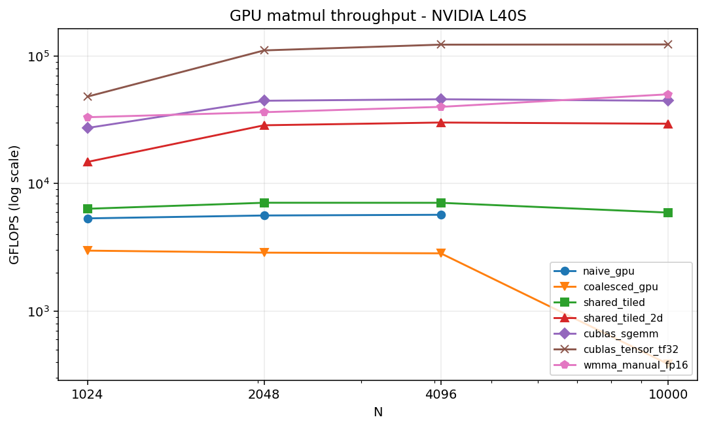

Five things to note:

1. **`cublas_tensor_tf32` reaches 122 TFLOPS at N=4096** — single best result of the entire study.
2. **All variants plateau by N=2048.** N=1024 is too small (kernel launch overhead dominates, SMs not saturated). The GPU wants big work.
3. **`coalesced_gpu` is *slower* than `naive_gpu`** (orange below blue). This counter-intuitive result is the occupancy lesson: the "coalesced" version uses 1D blocks of 256 threads, dropping SM occupancy. The "naive" version's 16×16 blocks happen to give better occupancy. Coalescing is necessary, not sufficient — geometry matters too.
4. **wmma_manual (FP16) ≈ cublas_sgemm (FP32) in TFLOPS.** Both run at ~40 TFLOPS, but cublas_sgemm uses FP32 CUDA cores and wmma_manual uses FP16 Tensor Cores. cuBLAS's Tensor Core path (`cublas_tensor_tf32`) is **3× faster than our manual WMMA** — that gap is what cuBLAS adds over a naive WMMA kernel (better staging, double-buffered shared memory, swizzle).
5. **`shared_tiled_2d` (red, 30 TFLOPS sustained) is within 1.5× of cuBLAS.** A hand-rolled kernel of ~80 lines, no Tensor Cores, gets 33% of cuBLAS FP32 — the standard "tiling + register blocking" pattern works.

### 4.2 % of theoretical peak

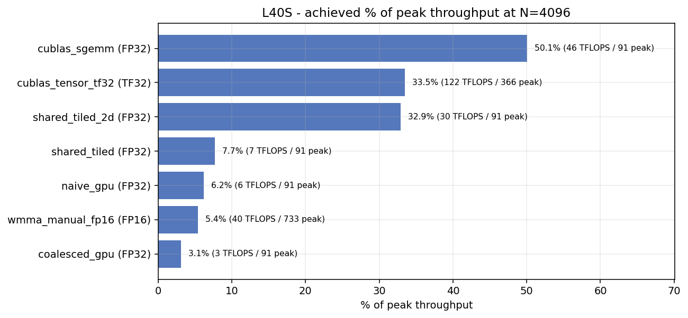

Sanity check against published L40S peak rates (91 TFLOPS FP32, 366 TFLOPS TF32 dense, 733 TFLOPS FP16 dense):

- `cublas_sgemm`: **50% of FP32 peak** — excellent. Real-world GEMM rarely exceeds 60% of peak even for the vendor library.
- `cublas_tensor_tf32`: **33% of TF32 peak** — typical Tensor Core achievement; non-square shapes and prologue/epilogue costs eat into peak.
- `wmma_manual_fp16`: **5% of FP16 peak** — large gap because our kernel doesn't pipeline shared-memory loads or use cp.async. This is the headroom cuBLAS captures.
- `shared_tiled_2d`: **33% of FP32 peak** — strong showing for a non-Tensor-Core hand-written kernel.

### 4.3 GPU speedup vs CPU

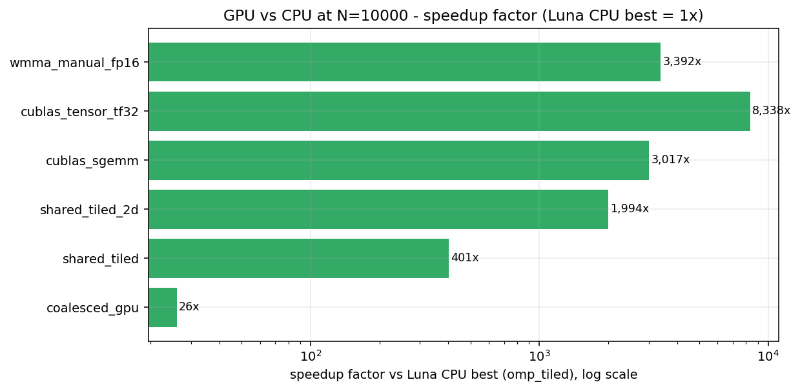

Ratios are *Luna CPU best wall-time ÷ each GPU variant wall-time* at N=10000. Even the worst non-naive GPU variant (coalesced_gpu) beats CPU best by ~25×. cublas_tensor_tf32 wins by **~8,300×** against Luna CPU single-threaded best. The CPU/GPU productivity gap for dense linalg is roughly four orders of magnitude.

---

## 5. Cross-platform synthesis

### 5.1 The one chart that summarises everything

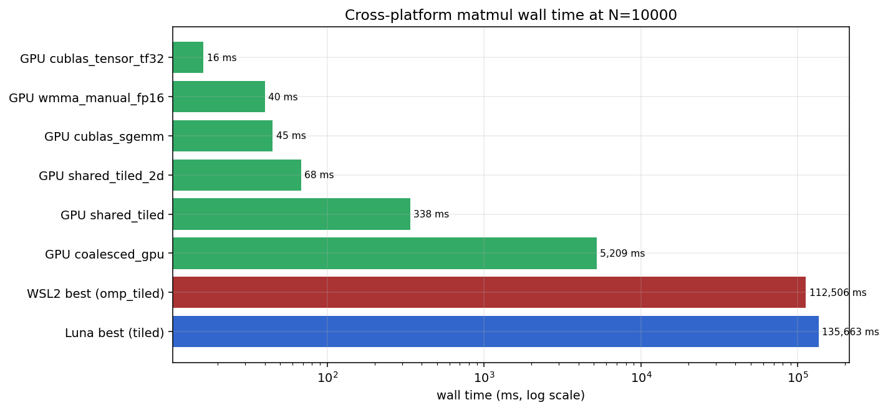

Three orders of magnitude separate the worst from the best on this chart, and the gap from CPU best to GPU best is itself another four orders. This is the single image that justifies why the matmul exercise was worth doing: it makes the **CPU-vs-GPU performance regime** concrete instead of theoretical.

### 5.2 Why this matters for Kraken2

The matmul exercise teaches a clean lesson about **dense, regular, compute-heavy** workloads:

- The CPU floor is memory-bound; tiling fixes it; AVX-512 adds compute throughput; OpenMP saturates the DRAM bus at huge N.
- The GPU completely outclasses the CPU because dense linalg maps perfectly to SIMT lanes + Tensor Cores.

**Kraken2's `CompactHashTable::Get()` is the opposite workload on every axis:**

| Property | Dense matmul | Kraken2 lookup |
|---|---|---|
| Access pattern | Sequential, predictable | Random pointer chasing |
| Working set | Fits in caches with tiling | 70 GB k-mer DB, larger than any cache |
| Parallelism shape | SIMD/SIMT-friendly FMA chains | Scatter-gather, branch-heavy |
| Helps from prefetching? | Hardware prefetcher already handles it (so software prefetch *hurts* — see prefetch_ikj data) | Hardware can't predict it; software prefetch is essential |
| GPU port? | 1000× speedup, real | <2× even in research papers (KrakenUniq-GPU) — wrong shape for SIMT |

This is why Kolin sir's NN-prefetcher proposal targets *the only meaningful axis of attack* on Kraken2: learning to predict the otherwise-unpredictable next probe slot. Hardware can't do it. Blind `__builtin_prefetch` of the *next* slot helps (Patch 1 in the optimisation report). A learned predictor that's right 60-70% of the time would do strictly better.

The matmul `prefetch_ikj` negative result feeds directly into this argument: **prefetch hurts when access is regular, and helps when access is irregular.** Matmul is regular. Kraken2 isn't.

---

## 6. Caveats and known limitations

1. **Luna OpenMP runs used `THREADS=4`, not 96.** Deliberately under-utilised so threading factor matches WSL2. This means **Luna's best wall time at N=10000 (135 s, `tiled` single-threaded) is worse than WSL2's best (112 s, omp_tiled).** Not a regression — different OS, different memory subsystem, different thread count. If we'd run `OMP_NUM_THREADS=96` on Luna the answer would be orders of magnitude better. Luna's role here is microarchitecture (TMA, stalls), not wall-time leadership.

2. **GPU was profiled by timing only.** Nsight Compute on Luna (2021.3) doesn't support sm_89 (Ada Lovelace) — needs `ncu` 2022.4+ which requires CUDA 12.x. Kernel-level metrics (occupancy %, DRAM throughput, Tensor Core active %) were not captured. The achieved GFLOPS / peak GFLOPS ratios in §4.2 substitute as a coarser efficiency measure.

3. **WSL2 cycles counter is throttled.** Anything WSL2 said about IPC, stall cycles, or microarchitectural ratios should be treated as approximate. Cache miss *counts* are real; cache miss *rates* differ from Luna because the denominator events differ between AMD and Intel.

4. **GPU `coalesced_gpu` runs slower than `naive_gpu`.** Verified, not a bug. The 1D block geometry (256 threads in one row) drops SM occupancy below the 16×16 layout of `naive_gpu`. Coalescing alone isn't a free win on small kernels.

5. **CUDA 11.5 + L40S means PTX JIT.** Driver translates sm_86 PTX to L40S SASS at runtime. Negligible startup overhead, but native sm_89 builds might extract a few % more (Ada-specific instruction scheduling).

6. **All graphs are reproducible.** `python build_report.py` re-parses every raw `.txt` file and regenerates `graphs/*.png` from scratch. If you find a number you don't trust, the script shows where it came from in `extracted_data.json`.

---

## 7. Files

```
Luna/profiling/matmul/report/
  REPORT.md                  this file
  build_report.py            parser + plotter (Python 3, matplotlib)
  extracted_data.json        all numbers in machine-readable form
  graphs/
    01_walltime_N1024.png         WSL2 vs Luna, wall time, N=1024
    02_walltime_N2048.png         same, N=2048
    03_ipc_wsl_vs_luna.png        IPC trap visualisation
    04_llc_miss_wsl_vs_luna.png   LLC miss rate cross-platform
    05_tma_stacked.png            TMA breakdown stacked bars
    06_l3_bound_headline.png      the 85% L3-bound chart
    07_ilp.png                    ILP doubles after tiling
    08_gpu_gflops_scaling.png     GPU throughput vs N
    09_gpu_pct_peak.png           GPU efficiency vs theoretical
    10_gpu_vs_cpu_speedup.png     speedup factor (N=10000)
    11_n10000_crossplatform.png   summary chart - all platforms
```

To regenerate everything from the raw perf output:

```bash
cd Luna/profiling/matmul/report
python build_report.py
```

Source `.txt` files in `Luna/profiling/matmul/perf_results_luna/` and `Luna/profiling/matmul_gpu_bundle/timing.log` must be present.
