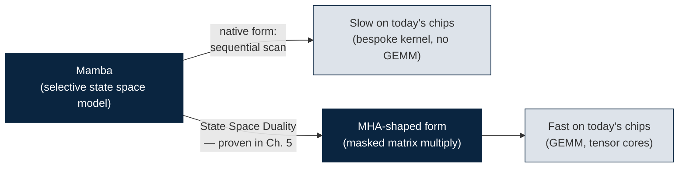
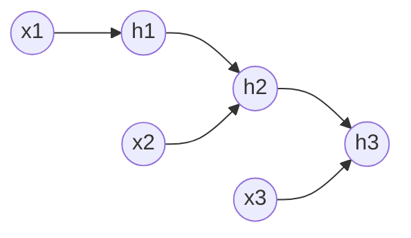
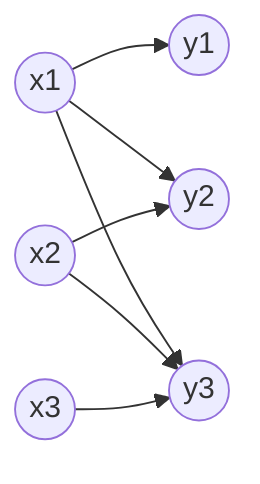
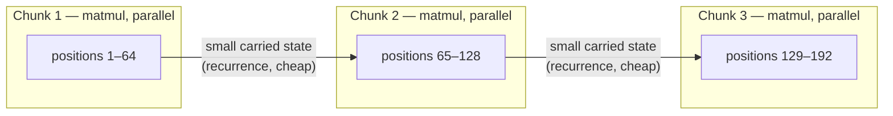

# Mamba as MHA

Making Mamba's math run on the same GEMM-shaped hardware path that chips already built for attention — explained from zero, proven with code you run yourself.

You have no ML background walking in, and that's fine — nothing here is assumed. By the end, you'll be able to explain, and *prove with running code*, why a sequence model called Mamba can be reformulated to compute on the exact same kind of hardware pathway that makes Transformers fast today. Here's why that's worth your time: chips have a decade of investment behind making one specific pattern of arithmetic — matrix multiplication — blisteringly fast. Mamba's native computation doesn't use that pattern. If you can reshape Mamba's math into that pattern *without changing what it computes*, you inherit that decade of hardware investment for free.



That's the whole idea in one picture. Everything below builds up, piece by piece, exactly what you need to understand why the middle arrow — "State Space Duality" — is real, checkable math and not a hand-wave. Chapter 5 is where you watch it happen.

> [!TIP]
> Every code block below is real Python. Copy it into a file, or into a fresh Google Colab cell (the same way the old project already runs kraken2/samtools in Colab), and actually run it:
> ```bash
> $ pip install numpy
> ```
> numpy is the only dependency through Chapter 5. Don't just read the code — the entire point of embedding it is to let you watch the concept work with real numbers instead of taking it on faith.

## The path through this document

Here's the route, and what you'll be able to say for yourself at each stop:

| # | Chapter | What you'll be able to say afterward |
|---|---|---|
| 1 | Foundations | "I know what a tensor, a layer, and a forward pass are." |
| 2 | RNN vs. Attention | "I know the two classic ways to process a sequence, and why one parallelizes and the other doesn't." |
| 3 | MHA in depth | "I know exactly what Q/K/V are, why chips are fast at attention, and what FlashAttention does about it." |
| 4 | State Space Models & Mamba | "I know what Mamba actually computes, and why it's fast in theory but not always in practice." |
| 5 | **The Duality Proof** | "I can show, with running code, that a Mamba-style recurrence and an attention-shaped matrix multiply produce *the exact same numbers*." |
| 6 | From proof to practice | "I know the concrete next steps, the open decisions, and what to read next." |

Read them in order — each chapter leans on the one before it. Chapter 5 is the centerpiece; Chapters 1–4 exist to earn it.

---

## Chapter 1 — Foundations: what is a neural network doing to a sequence?

### Vectors, matrices, and "shape"

A **vector** is just a list of numbers. A **matrix** is a grid of numbers — rows and columns. In ML code you'll see the word **tensor** used generically for "a grid of numbers with some number of dimensions": a vector is a 1-D tensor, a matrix is a 2-D tensor, and stacks of matrices are 3-D-and-up tensors. When you see a shape written as `(5, 4)`, that means 5 rows and 4 columns. Nothing more mystical than that.

### What "sequence" means here

Nanopore sequencing produces a long stream of electrical signal measurements over time. The basecaller's job is: given that stream, output a sequence of predicted bases (A/C/G/T). That's a **sequence-to-sequence** problem — the input is an ordered list, the output is an ordered list, and order matters. Shuffle the signal and you get garbage out.

The exact same shape shows up in text (a sentence is a sequence of words), video (a sequence of frames), and audio (a sequence of samples). This is why "how do you process a sequence efficiently and well" sits at the center of modern ML — and it's why the answer matters just as much for nanopore signal as it does for language models.

### A "layer" is just a function with learned numbers in it

The simplest possible layer is a **linear layer**: it takes an input vector and produces an output vector by multiplying by a matrix of learned numbers (the **weights**, `W`) and adding a vector of learned numbers (the **bias**, `b`). Training is what tunes those numbers — but you won't train anything in this document. You only need the *shape* of the computation (how many multiplications, in what pattern, on what hardware), because shape is what determines speed. So every example below only needs a **forward pass**: run the computation once with made-up numbers, and look at what comes out.

```python
import numpy as np
np.random.seed(0)

# A "token" here is just a vector of numbers (an embedding).
# Say each token is 4 numbers, and you have a sequence of 5 tokens.
seq_len, dim = 5, 4
x = np.random.randn(seq_len, dim)   # shape (5, 4): your toy input sequence

# A linear layer: output = x @ W + b   ("@" is matrix multiplication in numpy)
W = np.random.randn(dim, dim) * 0.1  # learned weights (random here — you're not training)
b = np.zeros(dim)                    # learned bias

def linear(x, W, b):
    return x @ W + b

y = linear(x, W, b)
print("input shape: ", x.shape)   # (5, 4)
print("output shape:", y.shape)   # (5, 4)
```

Run it. You now have the smallest possible neural-network layer, applied to a toy 5-token sequence.

**What this means for you:** everything from here on is really one question — *what do you do between layers to let information flow across positions?* That question is the entire subject of this document.

---

## Chapter 2 — Two classical answers: RNN and Attention

If every layer only looked at one position at a time, position 3 could never know anything about position 1. Something has to let information flow *across* positions. There have been two dominant answers.

### RNN — carry a running summary forward

An RNN keeps a **hidden state** (a running summary vector) and updates it one step at a time:

```python
def simple_rnn(x, Wx, Wh, h0=None):
    """
    x:  (T, dim_in)      input sequence
    Wx: (dim_in, dim_hidden)
    Wh: (dim_hidden, dim_hidden)
    Returns hs: (T, dim_hidden) — the hidden state at every time step
    """
    T = x.shape[0]
    dim_hidden = Wh.shape[0]
    h = np.zeros(dim_hidden) if h0 is None else h0
    hs = []
    for t in range(T):
        h = np.tanh(x[t] @ Wx + h @ Wh)   # needs the PREVIOUS h — cannot be skipped or reordered
        hs.append(h)
    return np.stack(hs)

T, dim_in, dim_hidden = 6, 4, 8
x = np.random.randn(T, dim_in)
Wx = np.random.randn(dim_in, dim_hidden) * 0.1
Wh = np.random.randn(dim_hidden, dim_hidden) * 0.1

hs = simple_rnn(x, Wx, Wh)
print(hs.shape)  # (6, 8)
```



Your first instinct might be: "fine, just make the loop faster." That's not where the problem is. No matter how fast each individual step runs, step `t` needs the *result* of step `t-1` — you cannot compute position 500 before position 499 finishes, on any amount of parallel hardware. The computation is sequential in time by construction, not by a slow implementation.

### Attention — every position looks at every other position, all at once

**Self-attention** takes the opposite approach: for each position, compute how much it should "pay attention to" every other position, and produce a weighted combination. Each token produces three vectors via three learned projections:

- **Query (Q)** — what am I looking for?
- **Key (K)** — what do I contain, for others to match against?
- **Value (V)** — what do I actually offer, if I get picked?

```python
def self_attention(x, Wq, Wk, Wv, causal=True):
    """
    x: (T, dim)
    Wq, Wk, Wv: (dim, dim) projection matrices
    """
    T, dim = x.shape
    Q = x @ Wq   # (T, dim) — what am I looking for
    K = x @ Wk   # (T, dim) — what do I contain
    V = x @ Wv   # (T, dim) — what do I offer if picked

    scores = Q @ K.T / np.sqrt(dim)   # (T, T): similarity between EVERY pair of positions, all at once

    if causal:
        # In autoregressive tasks, position t must never see the future (t+1, t+2, ...).
        # This mask forces those scores to -infinity so they vanish after softmax below.
        mask = np.triu(np.ones((T, T)), k=1).astype(bool)
        scores = np.where(mask, -np.inf, scores)

    # softmax: turn each row of raw scores into weights that are positive and sum to 1
    scores = scores - scores.max(axis=-1, keepdims=True)   # numerical stability only, doesn't change the result
    weights = np.exp(scores)
    weights = weights / weights.sum(axis=-1, keepdims=True)

    out = weights @ V   # (T, dim): each position's output is a weighted blend of ALL Values
    return out, weights

T, dim = 6, 8
x = np.random.randn(T, dim)
Wq = np.random.randn(dim, dim) * 0.1
Wk = np.random.randn(dim, dim) * 0.1
Wv = np.random.randn(dim, dim) * 0.1

out, weights = self_attention(x, Wq, Wk, Wv)
print(out.shape)      # (6, 8)
print(weights.shape)  # (6, 6) — weights[t, s] = how much position t attends to position s
```



Look closely: there is no `for t in range(T)` loop anywhere in the math (`Q @ K.T`, the mask, and `weights @ V` each run once, for every position at the same time). Compare the two diagrams above — the RNN is a chain where each step waits on the last; attention is every earlier position feeding the current one directly, with nothing waiting on anything else.

### The trade-off that drives everything else in this document

| | RNN | Attention |
|---|---|---|
| Cost per sequence | O(T) — linear in length | O(T²) — quadratic (the `(T,T)` scores matrix) |
| Sequential steps required | O(T) — one after another | O(1) — the whole thing is one parallel operation |
| Hardware fit | Poor — GPUs want thousands of parallel operations, not a loop of T dependent steps | Excellent — the whole thing is matrix multiplication |

Attention costs more raw arithmetic but that arithmetic is trivially parallel and hardware-friendly. RNNs cost less arithmetic but it's stubbornly sequential. Mamba (Chapter 4) is a modern attempt to get RNN-like O(T) cost with attention-like modeling quality — and Chapter 5 is a proof that, under the right conditions, you can compute *that same O(T) result* using the *O(T²) attention-shaped arithmetic* instead, trading extra arithmetic for a hardware-friendly shape exactly when that trade is worth it.

**What this means for you:** hang onto this table. Every later chapter is really asking "which side of this trade-off am I on, and can I move to the other side without changing the answer?"

---

## Chapter 3 — Multi-Head Attention (MHA) in depth, and why chips are built for it

### Why more than one attention pattern?

A single attention computation (Chapter 2) produces one weighting pattern per position. **Multi-head attention** splits the embedding dimension into several smaller chunks ("heads") and runs independent attention computations on each chunk in parallel, then stitches the results back together. Different heads can specialize — one might track "which earlier position had a similar signal shape," another "distance from the previous position" — all computed side by side, not in sequence.

```python
def multi_head_attention(x, num_heads, Wq, Wk, Wv, Wo, causal=True):
    T, dim = x.shape
    head_dim = dim // num_heads
    Q = (x @ Wq).reshape(T, num_heads, head_dim)
    K = (x @ Wk).reshape(T, num_heads, head_dim)
    V = (x @ Wv).reshape(T, num_heads, head_dim)

    outputs = []
    for h in range(num_heads):   # loop over a SMALL, FIXED number of heads — never over T
        scores = Q[:, h] @ K[:, h].T / np.sqrt(head_dim)
        if causal:
            mask = np.triu(np.ones((T, T)), k=1).astype(bool)
            scores = np.where(mask, -np.inf, scores)
        scores = scores - scores.max(axis=-1, keepdims=True)
        weights = np.exp(scores)
        weights = weights / weights.sum(axis=-1, keepdims=True)
        outputs.append(weights @ V[:, h])

    concat = np.concatenate(outputs, axis=-1)  # (T, dim) — heads stitched back together
    return concat @ Wo                          # learned mixing of the heads' outputs

T, dim, num_heads = 6, 8, 2
x = np.random.randn(T, dim)
Wq = np.random.randn(dim, dim) * 0.1
Wk = np.random.randn(dim, dim) * 0.1
Wv = np.random.randn(dim, dim) * 0.1
Wo = np.random.randn(dim, dim) * 0.1

out = multi_head_attention(x, num_heads, Wq, Wk, Wv, Wo)
print(out.shape)  # (6, 8)
```

> [!NOTE]
> The loop over heads runs a handful of times (8, 16, 32 — a design choice), never over the sequence length. So it doesn't reintroduce the "must wait for the previous step" problem from Chapter 2 — every head, and every position within a head, is independent and can run in parallel.

### Why chips are fast at this: it's all GEMM

Every expensive step above — `Q @ K.T`, `weights @ V`, the input projections — is a **GEMM** (General Matrix Multiply), the single most optimized operation in computing:

- GPUs contain dedicated **tensor cores** (since NVIDIA's Volta generation) whose entire job is the multiply-accumulate at the heart of GEMM.
- Decades of vendor libraries (cuBLAS, CUTLASS on NVIDIA, and equivalents elsewhere) exist purely to make GEMM as fast as physically possible on a given chip.
- Because MHA reduces to GEMM, it gets all of this for free — no custom kernel required, just calls into infrastructure that already exists and is already fast.

**FlashAttention** (Dao et al., 2022) is worth knowing by name here: naively, the `(T, T)` scores matrix has to be written to the GPU's slow main memory (VRAM) and read back for softmax and the next matmul — for long sequences, that memory traffic becomes the real bottleneck, not the arithmetic. FlashAttention restructures the computation to process small tiles of the sequence at a time, keeping everything inside the GPU's small but very fast on-chip memory (SRAM), and never writes the full `(T,T)` matrix to slow memory. Same math, same output — just organized to respect the chip's memory hierarchy. Keep that idea in your pocket: it's exactly the trick Chapter 6 shows Mamba-2 borrowing.

### Closing the loop on Kolin sir's original question

Remember the RNN-vs-Attention trade-off table from Chapter 2? An earlier meeting (`dorado-kraken-research/docs/meeting_minutes.md`, Meeting 5) assigned exactly this research question: *"is NVIDIA GPU hardware designed to accelerate MHA, or does MHA happen to map well to existing GEMM units?"*

> [!IMPORTANT]
> The honest answer: **mostly the latter, increasingly also the former.** Attention wasn't originally designed with dedicated hardware in mind — it happened to reduce to GEMM, and GEMM already had a decade of investment behind it from other domains (graphics, scientific computing). But the causality has started running the other way in the newest chips: NVIDIA's Hopper and Blackwell GPUs include "transformer engine" features and FP8 formats specifically tuned for Transformer-shaped workloads. Attention happened to be fast on existing hardware → attention proved dominant → vendors started co-designing hardware for it. This project is betting Mamba can ride that same wave, if its math can be reshaped into the same GEMM-friendly form.

---

## Chapter 4 — State Space Models (SSMs) and Mamba

### A 30-second detour into control theory

Long before neural networks, engineers modeling physical systems (circuits, mechanical systems) used **state space models**: a continuous equation describing how an internal "state" evolves over time and produces an output.

```
dx/dt = A x(t) + B u(t)      how the internal state x changes over time, given input u
y(t)  = C x(t)                how the state produces an observable output y
```

`A`, `B`, `C` are matrices. This has nothing to do with ML originally — it's classical control theory. The insight that revived it for ML (in a line of work called S4, then Mamba) is: **discretize** this continuous equation — turn it into steps, the way you'd numerically simulate any differential equation — and you get:

```
h_t = Ā h_{t-1} + B̄ x_t
y_t = C h_t
```

Look familiar? **This is exactly the RNN recurrence from Chapter 2** — same diagram, same chain, same sequential dependency — just arrived at from a control-theory starting point, with a particular, carefully-chosen structure for the matrices.

### Why bother: long-range memory

Plain RNNs suffer from the **vanishing gradient problem** — information from far in the past gets diluted as it's repeatedly multiplied through the recurrence, especially over long sequences (a 700 MB nanopore signal file, for instance). The S4 line of work found a specific initialization for the `A` matrix (based on **HiPPO** — a technique for compressing history into a fixed-size state while losing as little information as mathematically possible) that remembers far better than a naively-initialized RNN. But S4 has a real limitation: `A`, `B`, `C` are **fixed** — the same for every input, learned once and then frozen. It can't decide, on the fly, "this part is unimportant, forget it faster" or "this part matters, hold onto it."

### Mamba's move: make it selective

**Mamba** (Gu & Dao, 2023) is the S4 idea with one key change: it makes the "how much to forget" behavior (via a parameter usually called `Δ`, delta) — and `B`, `C` alongside it — **depend on the current input**, instead of staying fixed. This is called a "selective" SSM (sometimes "S6" in the literature). The model now behaves differently depending on content, the same way attention's Q/K/V comparisons are content-dependent, while keeping the O(T) linear-time recurrence. That's the promise: attention-like modeling quality, RNN-like linear cost.

```python
def selective_ssm_recurrence(x, a, b, c):
    """
    A minimal, single-channel (scalar-state) selective SSM, computed the native/sequential way.

    x: (T,) input sequence — one scalar channel, for simplicity (real Mamba runs many channels in parallel)
    a, b, c: (T,) TIME-VARYING parameters. In real Mamba these are themselves computed from x
             (that's what "selective" means) — here they're supplied directly to keep the demo simple.
        a_t in (0, 1): how much of the previous state to KEEP     ("forget gate"-like)
        b_t:           how much of the new input to WRITE into the state
        c_t:           how much of the state to READ OUT as output
    """
    T = x.shape[0]
    h = 0.0
    hs, ys = [], []
    for t in range(T):
        h = a[t] * h + b[t] * x[t]   # update the running summary — sequential, needs h from step t-1
        y = c[t] * h                  # produce this step's output from the current summary
        hs.append(h)
        ys.append(y)
    return np.array(ys), np.array(hs)

T = 8
x = np.random.randn(T)
a = np.random.uniform(0.5, 0.9, size=T)   # kept in (0,1) so the state doesn't blow up or vanish immediately
b = np.random.randn(T)
c = np.random.randn(T)

y, h = selective_ssm_recurrence(x, a, b, c)
print(y)
```

Real Mamba uses a *vector*-valued state per channel (typically 16–64 numbers, not one scalar) and dozens to thousands of channels running in parallel, each with its own `a, b, c`. This document uses a single scalar so the arithmetic stays visible — Chapter 6 has an exercise that extends it to a vector state.

### Why Mamba is still often not as fast as its O(T) suggests

You'd expect a model that costs O(T) instead of O(T²) to always win on speed. It often doesn't, and the reason is worth sitting with: look at the `for t in range(T)` loop above — it's the same sequential-dependency problem as the plain RNN in Chapter 2. Mamba's paper answers this with a clever trick called a **parallel scan** (or "associative scan"): because the recurrence has a specific mathematical structure, the sequential computation can be restructured into a tree of parallel operations, in the same spirit as parallel prefix-sum algorithms. It's a genuine speedup over the naive loop — but:

- It's a **bespoke, custom kernel** — it doesn't reduce to GEMM.
- It hasn't received anywhere near the decades of vendor tuning that GEMM has.
- Every new chip generation needs someone to re-tune or rewrite it; GEMM-based code inherits vendor library improvements automatically.

> [!WARNING]
> This is the entire motivation for the project: if you could compute the same result Mamba wants, expressed as GEMM the way attention already is, you'd inherit all of that hardware investment for free — no custom scan kernel needed. Chapter 5 shows this isn't wishful thinking. It's provably possible, under specific conditions.

---

## Chapter 5 — THE PROOF: Mamba and Attention are the same computation

This is the mathematical heart of "implement Mamba as MHA." The result is called **State Space Duality (SSD)**, from *"Transformers are SSMs"* (Dao & Gu, 2024 — the "Mamba-2" paper). You might assume "Mamba as MHA" means *approximating* Mamba with attention — trading some accuracy for speed. It doesn't. This is an exact mathematical identity, not an approximation, and this chapter derives it by hand, then verifies it with code.

### The restriction this needs

The exact duality proof applies to a **structured** SSM where the state-transition at each step is a scalar times the identity matrix (`A_t = a_t · I`), rather than the fully general per-channel matrix the original Mamba (S6) allows. This is a real trade-off — Mamba-2 gives up some per-channel expressiveness (in exchange it typically uses many more, smaller "heads," in a similar spirit to MHA's heads) so that this exact duality holds and is exploitable. The scalar-state toy SSM from Chapter 4 is already exactly this restricted form, which is why the duality can be derived directly from it.

### Unrolling the recurrence by hand

Recall the recurrence (0-indexed, `h` starts at 0 before the first step):

```
h_t = a_t h_{t-1} + b_t x_t
y_t = c_t h_t
```

Unroll the first few steps:

```
h_0 = b_0 x_0
h_1 = a_1 h_0 + b_1 x_1              = a_1 b_0 x_0 + b_1 x_1
h_2 = a_2 h_1 + b_2 x_2              = a_2 a_1 b_0 x_0 + a_2 b_1 x_1 + b_2 x_2
```

The pattern: `h_t = Σ_{s=0}^{t} (a_{s+1} a_{s+2} ... a_t) · b_s · x_s` (the product of `a`'s is empty — equal to 1 — when `s = t`). So:

```
y_t = c_t h_t = Σ_{s=0}^{t} [ c_t · (a_{s+1}...a_t) · b_s ] · x_s
```

Stop and look at this shape: `y_t` is a weighted sum over *all earlier positions* `s ≤ t`, where the weight depends on both `t` and `s`. That's exactly the shape of masked (causal) attention from Chapter 2 (`y = weights @ V`, with `weights[t,s] = 0` for `s > t`) — just with a different formula for the weights than "softmax of Q·K." Define a matrix `L`:

```
L[t, s] = c_t · (a_{s+1} · a_{s+2} · ... · a_t) · b_s     for s ≤ t
L[t, s] = 0                                                for s > t
```

Then `y = L @ x` — one matrix-vector multiply. The GEMM-shaped computation Chapter 3 built the case for.

### Computing the products efficiently

Computing `a_{s+1} · ... · a_t` freshly for every `(t, s)` pair would itself cost O(T²) work just for the products. The standard trick: define the **cumulative product** `P_t = a_0 · a_1 · ... · a_t`. Then:

```
a_{s+1} · a_{s+2} · ... · a_t = P_t / P_s
```

(Check it yourself: `P_t / P_s = (a_0...a_t) / (a_0...a_s) = a_{s+1}...a_t` — and it even works cleanly at `s = t`, giving `P_t/P_t = 1`, matching the "empty product" case.) So:

```
L[t, s] = c_t · b_s · (P_t / P_s)     for s ≤ t
```

### The code: three forms, one answer

Here's the complete, runnable demonstration — the actual numerical proof, not a description of one. Save it as `chapter5_duality_demo.py`:

```python
import numpy as np
np.random.seed(42)

T = 8
x = np.random.randn(T)
raw = np.random.randn(T)
a = 1 / (1 + np.exp(-raw)) * 0.5 + 0.4   # squash into roughly (0.4, 0.9): keeps 'a' away from 0 or 1
b = np.random.randn(T)
c = np.random.randn(T)

# ---- Form 1: sequential recurrence — what Mamba computes NATIVELY ----
def recurrence_form(x, a, b, c):
    T = len(x)
    h = 0.0
    y = np.zeros(T)
    for t in range(T):
        h = a[t] * h + b[t] * x[t]
        y[t] = c[t] * h
    return y

# ---- Form 2: cumulative-sum rearrangement — same math, still O(T), no explicit matrix ----
def cumsum_form(x, a, b, c):
    P = np.cumprod(a)          # P[t] = a[0] * a[1] * ... * a[t]
    w = b * x / P               # rescale each input by how much it will have "decayed" by the end
    running = np.cumsum(w)      # running total up to each position
    y = c * P * running
    return y

# ---- Form 3: explicit masked matrix — the MHA-SHAPED form ----
def attention_form(x, a, b, c):
    T = len(x)
    P = np.cumprod(a)
    L = np.zeros((T, T))
    for t in range(T):
        for s in range(t + 1):          # causal: only s <= t contributes
            L[t, s] = c[t] * b[s] * (P[t] / P[s])
    y = L @ x                            # ONE matrix-vector multiply — the GEMM-shaped computation
    return y, L

y_rec        = recurrence_form(x, a, b, c)
y_cum        = cumsum_form(x, a, b, c)
y_att, L     = attention_form(x, a, b, c)

print("recurrence == cumsum?      ", np.allclose(y_rec, y_cum))
print("recurrence == attention?   ", np.allclose(y_rec, y_att))
```

```bash
$ python chapter5_duality_demo.py
recurrence == cumsum?       True
recurrence == attention?    True
```

Both lines print `True`. That's the entire point, demonstrated rather than asserted: the same Mamba-style selective SSM can be computed as a sequential recurrence (what Mamba does today), or as one matrix multiply against an implicit causal attention-like matrix `L` — the MHA-shaped form this project wants to exploit.

> [!IMPORTANT]
> `L` is *not* the same kind of object as the softmax attention matrix from Chapter 2. Transformer attention weights are normalized — softmax makes each row sum to 1, and every weight is non-negative. `L` here has no such normalization; its entries can be any sign or magnitude, driven by the products of `a`, `b`, `c`. It is "attention-shaped" (causal, weighted sum over earlier positions, one matmul) but not "softmax attention." A separate, related paper — *"The Hidden Attention of Mamba Models"* (Ali et al., 2024) — does something similar for the fully general (non-restricted) original Mamba, but it's aimed at *interpretability* rather than the efficiency goal this project is chasing. Worth reading (Chapter 6 has the link), but Mamba-2's SSD is the right target here.

`L` has a special structure called **1-semiseparable**: every entry below the diagonal factors into a "row factor" (`c_t · P_t`) and a "column factor" (`b_s / P_s`), rather than being T² independent free numbers. This structure is exactly what Chapter 6's practical chunked algorithm exploits.

**What this means for you:** you've now watched, with running code, the exact claim the whole project rests on. Everything after this chapter is about what to do with that fact.

---

## Chapter 6 — From proof to practice

### Mamba-2's real algorithm: chunking, the best of both worlds

Chapter 5's Form 3 costs O(T²) — fine for a toy `T=8` example, bad for a real nanopore signal with hundreds of thousands of samples. Mamba-2's actual implementation doesn't pick purely Form 1 (cheap but sequential) or purely Form 3 (parallel but quadratic). It **chunks** the sequence into blocks (64–256 positions each):



- **Within a chunk:** use the attention-shaped matmul form (Form 3) — small enough that O(chunk²) is cheap, and it's pure GEMM, fast on tensor cores.
- **Between chunks:** carry forward a small summary state using the cheap recurrence (Form 1/2) — with only `T / chunk_size` chunks, this part stays linear in `T`.

This hybrid is why Mamba-2 runs meaningfully faster than the original Mamba on the same GPU. It's "mostly GEMM, with a thin recurrent connector between blocks" — the "implement Mamba as MHA" idea this document set out to explore, now made concrete.

> [!WARNING]
> Chunking isn't just a speed trick — it's also a numerical necessity. Look again at `w = b * x / P` in the cumsum/attention code above. `P` is a cumulative *product* of numbers less than 1 — it shrinks toward zero as `T` grows, and for `T` in the thousands it can underflow toward zero in floating point. Dividing by a near-zero `P` then blows the numbers back up: mathematically the huge multiply and huge divide cancel out, but floating-point arithmetic done in this order can lose precision or overflow before they get the chance to cancel. Chunking keeps each chunk short enough that `P` never gets too extreme within it, resetting the cumulative product at every chunk boundary.

### Where to find real code

The `mamba-ssm` reference implementation (the authors' own library) contains a file usually called something like `ssd_minimal.py` — the Mamba-2 paper states the minimal SSD algorithm fits in about 25 lines of code. Reading that file, now that you have the derivation in §5 under your belt, is the natural next step: a real-scale implementation, rather than the toy scalar example here.

### The open decisions — not yet made

- **Target chip for benchmarking:** Luna (L40S GPU — same machine used for the old Dorado profiling, has tensor cores, `nsys`/`perf` tooling already set up) vs. Orion (Jetson edge, ARM64 — matches the earlier "NanoMambaNet" edge-inference framing Kolin sir mentioned in `dorado-kraken-research/docs/knowledge_base.md`) vs. both. Still unexplored as of 2026-07-04.
- **Whether this connects to "NanoMambaNet"** (the edge inference pipeline Kolin sir separately mentioned) or is a standalone benchmarking exercise.
- **Whether/when the old `dorado-kraken-research/CLAUDE.md` work resumes** — paused, not abandoned.

### Suggested reading order

Roughly the order a researcher would tackle these:

1. **Original Mamba paper** — Gu & Dao, *"Mamba: Linear-Time Sequence Modeling with Selective State Spaces"* (2023). [arXiv:2312.00752](https://arxiv.org/abs/2312.00752)
2. **Mamba-2 / State Space Duality** — Dao & Gu, *"Transformers are SSMs"* (2024). [arXiv:2405.21060](https://arxiv.org/abs/2405.21060) — and [Tri Dao's own blog series](https://tridao.me/blog/2024/mamba2-part1-model/), which explains it more gently than the paper.
3. **The Hidden Attention of Mamba Models** — Ali et al. (2024). [arXiv:2403.01590](https://arxiv.org/abs/2403.01590) — the interpretability-flavored sibling result from Chapter 5.
4. **FlashAttention** — Dao et al. (2022) — for the "reorganize computation around the memory hierarchy, don't change the math" mindset that Mamba's own efficient kernels borrow directly from.

### Exercises — do these before moving to real implementation

They're the fastest way to confirm the concepts actually stuck.

1. **Vector state.** Modify Chapter 5's code so `h` is a small vector (say, 4 numbers) instead of a scalar, with `a` a vector of the same size (element-wise — this is still "scalar-times-identity" per channel, just several channels at once). Confirm the recurrence and attention forms still match, per channel.
2. **Add softmax.** Take the `L` matrix from Chapter 5, apply the causal-masked softmax from Chapter 2's `self_attention` to it instead of using its raw values, and compare the output to the un-normalized version. This makes the distinction from the `[!IMPORTANT]` note in Chapter 5 tangible: you'll be looking at both "Mamba's implicit attention" and "real Transformer attention" on the exact same numbers.
3. **Time it.** Increase `T` in Chapter 5's code (try 100, then 1,000, then 10,000) and time `recurrence_form` vs. `attention_form` in plain Python. Even on CPU, you should see the O(T) vs. O(T²) gap in Chapter 2's table start to show up as `T` grows — and you should also start to see the numerical stability issue from this chapter appear as `np.allclose` starts failing at large `T`, which is itself an instructive failure.

**What this means for you:** you now have everything needed to have an informed conversation with Kolin sir about this direction, run the exercises above to stress-test your own understanding, and start real implementation with a correct mental model instead of a hopeful one.

---

## Sources

- [Mamba: Linear-Time Sequence Modeling with Selective State Spaces](https://arxiv.org/abs/2312.00752) — Gu & Dao, 2023
- [Transformers are SSMs: Generalized Models and Efficient Algorithms Through Structured State Space Duality (Mamba-2)](https://arxiv.org/abs/2405.21060) — Dao & Gu, 2024
- [State Space Duality (Mamba-2) Part I — The Model](https://tridao.me/blog/2024/mamba2-part1-model/) — Tri Dao's plain-language blog writeup
- [The Hidden Attention of Mamba Models](https://arxiv.org/abs/2403.01590) — Ali et al., 2024
- FlashAttention: Fast and Memory-Efficient Exact Attention with IO-Awareness — Dao, Fu, Ermon, Rudra, Ré, 2022
