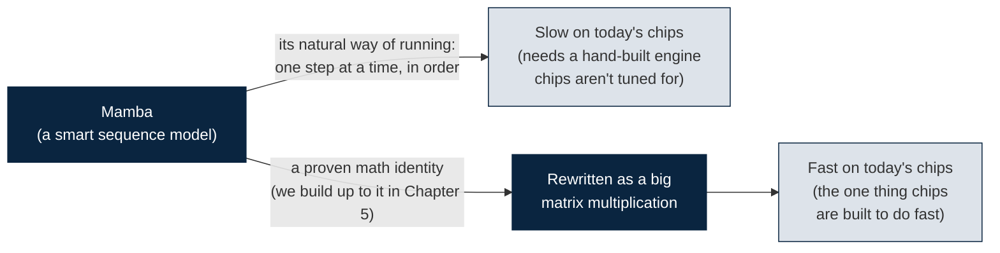
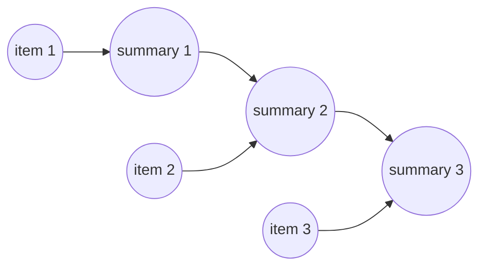
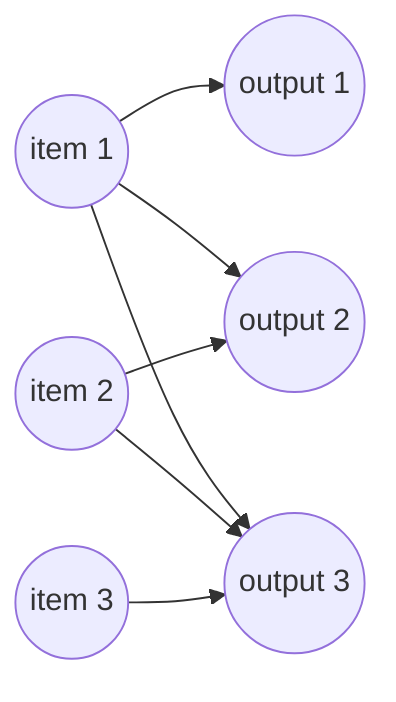
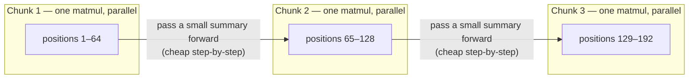

# Mamba as MHA — the friendly, no-background-required version

A sequence model called **Mamba** is fast in theory but awkward for today's chips to run fast in practice. This document walks you — slowly, from absolute zero — to the single beautiful fact that fixes that: Mamba's math can be rewritten into the *exact same shape* as the math inside a Transformer, which is the one shape every modern chip has been lovingly optimized to run. And you won't take that on faith. You'll run code that proves it with real numbers.

Here's the promise, and I mean it literally: **you do not need to know any machine learning, any AI, any "transformers," or any fancy math to read this.** If you can read a little Python and you remember what multiplication is, you have everything you need. Every term gets defined the first time it shows up. Every leap gets a real-world analogy before the notation. I'm going to talk to you the way I'd talk if I were sitting in the chair next to yours, pointing at the screen. When something is genuinely weird, I'll tell you it's weird. When something is genuinely cool, I'll make you stop and look at it.

Let's start with the one picture that the whole document is secretly about. Don't worry about understanding it yet — just glance at it, and know that by the end it'll feel obvious.



Two roads out of the same box on the left. The top road is how Mamba runs today, and it lands somewhere slow. The bottom road is a detour through a math trick — and it lands somewhere fast, *without changing the answer*. That middle arrow, the one labeled "a proven math identity," is the entire point of this project. Chapters 1 through 4 exist only to get you ready to appreciate it. Chapter 5 is where you watch it happen with your own eyes.

> [!TIP]
> **Every code block below is real, working Python.** Don't just read it — run it. Paste it into a file, or into a free [Google Colab](https://colab.research.google.com) cell (a webpage that runs Python for you, no install needed — the same way this project already runs its other tools in Colab), and watch the numbers come out.
> ```bash
> $ pip install numpy
> ```
> `numpy` is a Python library for doing arithmetic on grids of numbers quickly. It's the *only* thing you need to install, and it carries you all the way through the proof in Chapter 5. Watching the concept work with real numbers is worth ten times more than reading about it.

## What's the actual point of this document?

Let me answer the question you should be asking: *why should I care?*

Computer chips — specifically the graphics chips (GPUs) that run modern AI — have spent well over a decade being tuned to do **one kind of arithmetic** ridiculously fast: multiplying big grids of numbers together. We'll call that operation **matrix multiplication**, and I'll explain exactly what it is in Chapter 1. For now, just hold onto this: chips *love* matrix multiplication the way a race car loves a straight, flat track. It's the thing they were built for.

Transformers — the models behind ChatGPT and friends — are fast largely because their core math *is* matrix multiplication. They drive straight down the track the chip built for them.

Mamba is a newer, cleverer model that, on paper, should be even cheaper to run than a Transformer. But Mamba's natural math is **not** matrix multiplication. It's a step-by-step process, more like walking than driving. So Mamba often can't use that beautiful race track, and it needs a hand-built engine that far fewer people have tuned.

**The bet of this project:** if we can rewrite Mamba's step-by-step math so it becomes matrix multiplication — the same shape the chip already adores — Mamba gets to drive down the race track too. It inherits a decade of hardware tuning *for free*. And the amazing part, the part that makes this not just wishful thinking, is that a 2024 result proves this rewrite is *exact*. Not an approximation. Not "close enough." The same numbers, computed a different way.

That's it. That's the whole story. Everything below is the patient, enjoyable version of getting you to the point where that sentence lands with full force.

## The route we'll take

Here's the map. Read the chapters in order — each one is a stepping stone placed exactly where the next one needs your foot to land.

| # | Chapter | What you'll be able to say afterward |
|---|---------|--------------------------------------|
| 1 | The absolute basics | "I know what a list of numbers, a grid of numbers, and 'multiplying' them means — and what a neural network is really doing." |
| 2 | Two ways to read a sequence | "I get the two classic strategies — the 'running summary' and the 'look at everything at once' — and why one is slow on a chip and one is fast." |
| 3 | Attention, up close | "I know what Query/Key/Value actually are, why chips fly through attention, and what the famous 'FlashAttention' trick does." |
| 4 | Mamba | "I know what Mamba computes, why it *should* be fast, and the real reason it often isn't." |
| 5 | **The proof** | "I have run code, myself, showing that Mamba's step-by-step method and a single matrix multiplication give *the exact same numbers*." |
| 6 | What to do with the proof | "I know the practical algorithm, the open decisions, and exactly what to read and try next." |

Chapter 5 is the mountaintop. Chapters 1–4 are the trail up. Let's start walking.

---

## Chapter 1 — The absolute basics: numbers in a row, numbers in a grid

Before we can talk about anything clever, we need three plain ideas: a list of numbers, a grid of numbers, and what it means to "multiply" a list by a grid. That's genuinely all the math you need for the first four chapters. Let's build each one gently.

### A list of numbers is called a vector

Say you want to describe a single thing with a few measurements. A person might be `[height, weight, age]` — three numbers in a fixed order. That ordered little pack of numbers is called a **vector**. It's not scary; it's a row on a spreadsheet. `[1.8, 75, 34]` is a vector with three numbers in it.

In this document, a vector will usually stand for one "item" in a sequence — one moment of nanopore signal, or one word in a sentence — described by a bunch of numbers. When you see a vector with, say, 4 numbers in it, people say it has **4 dimensions**, which is a fancy way of saying "4 slots."

### A grid of numbers is called a matrix

Now stack several vectors on top of each other and you get a **matrix** — a rectangle of numbers, with rows and columns. If you have 5 items and each is described by 4 numbers, you get a matrix with **5 rows and 4 columns**. In code we write that size as `(5, 4)` and call it the **shape**. Shape is just "how many rows, how many columns." That's the whole definition. When you see `(5, 4)`, read it out loud as "five rows, four columns" and you'll never be confused.

> [!NOTE]
> You'll also hear the word **tensor** thrown around in AI. Don't let it intimidate you — it's just the general word for "a block of numbers with some number of dimensions." A single number is a 0-D tensor, a vector (a row) is a 1-D tensor, a matrix (a grid) is a 2-D tensor, and if you stack grids into a cube you get a 3-D tensor. Same idea, more dimensions. Whenever someone says "tensor," you can mentally translate it to "block of numbers."

### Multiplying a list by a grid — what it actually *does*

Here's the one piece of real math in the chapter, and I want to slow all the way down because *everything* later rides on it.

When you "multiply" a vector by a matrix, you are running the vector through a little machine that produces a **new** vector. Each number in the new vector is a **custom weighted blend** of all the numbers in the old vector. That's the entire idea. Let me make it concrete.

Suppose your input vector is `[x1, x2, x3]` — three numbers. And suppose the matrix (the machine) has three columns of "recipes." The first column might say "to make my first output, take 0.5 of x1, plus 0.2 of x2, minus 0.1 of x3." Do that arithmetic and you get one output number. The second column is a *different* recipe using the same three inputs, giving a second output number. And so on. Stack up all the outputs and you have your new vector.

So a matrix is really a **stack of recipes**, and multiplying by it means "apply every recipe to my input and collect the results." Different matrix, different recipes, different blend. That's it. In code, the "multiply the vector/matrix by a matrix" operation is written with the `@` symbol in numpy. Whenever you see `@`, read it as "run through the recipe machine."

Why do we care so much about this specific operation? Because — and this is the thread running through the entire document — **this exact operation is the one that computer chips do faster than anything else in the world.** Hold that thought; it becomes the whole plot.

### What is a sequence, and why does order matter?

Nanopore sequencing (the lab technique this whole research group works on) produces a long stream of electrical measurements over time — the signal you get as a strand of DNA is pulled through a tiny hole. The job of the software (the "basecaller") is: given that stream of measurements, figure out the sequence of DNA letters (A, C, G, T) that produced it.

Notice the shape of that problem: an **ordered** list goes in, an **ordered** list comes out, and the order is sacred. Shuffle the input signal and you get nonsense. This is called a **sequence-to-sequence** problem, and it's everywhere: a sentence is a sequence of words, a song is a sequence of sound samples, a video is a sequence of frames. Because this shape is everywhere, the question *"what's the best way to process a sequence?"* sits at the dead center of modern AI — and it matters just as much for DNA signal as it does for language. Every model we discuss is, at heart, an answer to that one question.

### A "layer" is just a function with adjustable knobs

Here's the last idea in the chapter. Modern AI models are built from stacked **layers**, and a layer sounds mysterious but isn't. A layer is a function — numbers go in, numbers come out — with a bunch of internal numbers called **weights** that can be adjusted. The simplest layer, a **linear layer**, does exactly the recipe-machine thing from a moment ago: it takes your input vector, runs it through a matrix of weights (`W`), and adds a little offset vector called a **bias** (`b`).

Where do the weights come from? A process called **training** slowly nudges them until the model does something useful — but here's a relief: **we are never going to train anything in this document.** Training is a whole separate adventure. All we care about is the *shape* of the computation: how many multiplications happen, in what pattern, and whether the chip likes that pattern. Shape determines speed, and speed is our whole story. So every example just does a **forward pass** — run the computation once, with made-up numbers, and look at what comes out.

Let's see the smallest possible layer, run on a toy sequence of 5 items:

```python
import numpy as np
np.random.seed(0)   # makes the "random" numbers the same every run, so you and I see identical output

# One "item" in our sequence is just a vector of numbers.
# Let's say each item is described by 4 numbers, and we have a sequence of 5 items.
seq_len, dim = 5, 4
x = np.random.randn(seq_len, dim)   # shape (5, 4): our toy input sequence — 5 items, 4 numbers each

# A linear layer:  output = x @ W + b
# "@" is "run through the recipe machine" (matrix multiplication).
W = np.random.randn(dim, dim) * 0.1  # the recipes (weights). Random here, because we're not training.
b = np.zeros(dim)                    # the offset (bias). All zeros here, for simplicity.

def linear(x, W, b):
    return x @ W + b

y = linear(x, W, b)
print("input shape: ", x.shape)   # (5, 4)
print("output shape:", y.shape)   # (5, 4)
```

Run it. Five items went in, five items came out, each output item a fresh blend of its input item's four numbers. Congratulations — you just ran a neural network layer. It really is that humble underneath.

**What this means for you:** here's the thing to carry forward. A single layer blends the numbers *within* one item, but it never lets item #3 learn anything from item #1. And for a sequence, that's a disaster — the meaning of a word depends on the words around it; the meaning of a signal blip depends on the blips before it. So the real question, the one the rest of this document is entirely about, is: **what do you put between the layers to let information flow from one position in the sequence to another?** Chapter 2 gives you the two classic answers.

---

## Chapter 2 — Two ways to read a sequence: the running summary vs. looking at everything at once

Okay. We've established the problem: information needs to flow *across* positions in a sequence. Position 500 in a DNA signal needs to be able to "know about" position 1. History has offered two great strategies for this, and the tension between them is the engine of this entire field. Let me introduce them as two different ways *you* might read a long book.

### Strategy one: the running summary (this is an RNN)

Imagine reading a novel and keeping a single running summary in your head. Each new page, you update the summary: "okay, given everything so far *plus* this page, here's the new gist." You never look back at earlier pages directly — you trust that everything important got folded into the summary you're carrying.

That's a **Recurrent Neural Network**, an **RNN**. The "running summary" is called the **hidden state** (usually written `h`). At each step, you combine the previous summary with the new input to make the next summary:

```python
def simple_rnn(x, Wx, Wh, h0=None):
    """
    x:  (T, dim_in)          the input sequence — T items, each a vector of size dim_in
    Wx: (dim_in, dim_hidden) recipe for mixing in the NEW item
    Wh: (dim_hidden, dim_hidden) recipe for carrying the OLD summary forward
    Returns hs: (T, dim_hidden) — the running summary AFTER each step
    """
    T = x.shape[0]
    dim_hidden = Wh.shape[0]
    h = np.zeros(dim_hidden) if h0 is None else h0   # start with a blank summary
    hs = []
    for t in range(T):
        # new summary = blend of (this item) and (previous summary), squashed by tanh.
        # tanh just gently squishes numbers into the range (-1, 1) so they don't blow up.
        h = np.tanh(x[t] @ Wx + h @ Wh)   # <-- NEEDS the previous h. Cannot skip ahead.
        hs.append(h)
    return np.stack(hs)

T, dim_in, dim_hidden = 6, 4, 8
x = np.random.randn(T, dim_in)
Wx = np.random.randn(dim_in, dim_hidden) * 0.1
Wh = np.random.randn(dim_hidden, dim_hidden) * 0.1

hs = simple_rnn(x, Wx, Wh)
print(hs.shape)  # (6, 8) — a summary vector after each of the 6 steps
```

Picture the flow like this — each summary feeds the next, in a chain:



Now, your very first instinct on seeing that `for` loop is probably: *"so just make the loop faster."* It's a reasonable thought, and it's exactly the wrong one — so let me stop you right there, because understanding *why* it's wrong is half of understanding this whole project.

The problem is not that each step is slow. The problem is that step 500 needs the *finished summary* from step 499, which needs step 498, all the way down. You physically **cannot** start computing position 500 until 499 is done — not with a faster loop, not with a bigger computer, not with a thousand computers. The steps are chained by their very nature. This is called a **sequential dependency**, and it's the villain of our story. Remember our chip that loves doing thousands of things at once? A chained loop hands it one thing at a time and makes it wait. Torture, for a chip.

### Strategy two: look at everything at once (this is attention)

Now imagine reading that same novel completely differently. Instead of a running summary, you spread **every page on a giant table** at the same time. To understand any one page, you glance across the whole table and decide, for each *other* page, "how relevant is this to the page I'm on right now?" Then you blend the relevant pages together into your understanding of the current one.

That's **self-attention**, the beating heart of the Transformer. The magic is that "glancing at every other page" isn't a chained loop — you can do all the glancing for all the pages *simultaneously*, because none of it waits on anything else. It costs you a big table (lots of memory), but it never makes the chip wait. This is the opposite trade-off from the RNN, and that opposition is the whole point.

How does a position decide how relevant every other position is? Each item produces **three** vectors, and the classic analogy is a library:

- **Query (Q)** — *"what am I looking for?"* The question the current item is asking.
- **Key (K)** — *"what do I contain, as a label others can match against?"* Like the label on a book's spine.
- **Value (V)** — *"what do I actually hand over if I get chosen?"* The book's actual contents.

To figure out how much position A should care about position B, you compare A's **Query** against B's **Key**. A good match means high relevance. Then you blend everyone's **Values** together, weighted by those relevance scores. Here it is in code — and I've commented every line, because this little function is the ancestor of everything in Chapters 3 and 5:

```python
def self_attention(x, Wq, Wk, Wv, causal=True):
    """
    x: (T, dim)                 the sequence — T items, each a vector of size dim
    Wq, Wk, Wv: (dim, dim)      recipes that turn each item into its Query, Key, and Value
    """
    T, dim = x.shape
    Q = x @ Wq   # (T, dim) — every item's "what am I looking for"
    K = x @ Wk   # (T, dim) — every item's "what do I contain"
    V = x @ Wv   # (T, dim) — every item's "what do I offer if picked"

    # Compare EVERY query against EVERY key, all pairs at once.
    # scores[t, s] = how well item t's question matches item s's label.
    # Dividing by sqrt(dim) just keeps the numbers from getting too large as dim grows.
    scores = Q @ K.T / np.sqrt(dim)   # (T, T): one number for every pair of positions

    if causal:
        # For tasks that generate output left-to-right (like predicting the next DNA base),
        # an item is NOT allowed to peek at items that come after it — that'd be cheating,
        # looking at the answer. We forbid it by setting "future" scores to -infinity,
        # which makes them vanish to zero in the softmax step just below.
        mask = np.triu(np.ones((T, T)), k=1).astype(bool)
        scores = np.where(mask, -np.inf, scores)

    # softmax: turn each row of raw scores into clean percentages
    # (all positive, and summing to 1). See the explanation right after this block.
    scores = scores - scores.max(axis=-1, keepdims=True)   # a stability trick; doesn't change the result
    weights = np.exp(scores)
    weights = weights / weights.sum(axis=-1, keepdims=True)

    out = weights @ V   # (T, dim): each item's output = a weighted blend of ALL the Values
    return out, weights

T, dim = 6, 8
x = np.random.randn(T, dim)
Wq = np.random.randn(dim, dim) * 0.1
Wk = np.random.randn(dim, dim) * 0.1
Wv = np.random.randn(dim, dim) * 0.1

out, weights = self_attention(x, Wq, Wk, Wv)
print(out.shape)      # (6, 8)
print(weights.shape)  # (6, 6) — weights[t, s] = how much item t paid attention to item s
```

Let me pay off that promise about **softmax**, because it sounds technical and it's actually friendly. Suppose you have raw enthusiasm scores for a few options — say `[2.0, 1.0, 0.1]`. Softmax turns them into percentages that add up to 100%: something like `[63%, 23%, 14%]`. It does this by making every number positive (via `exp`, the exponential function) and then dividing each by the total. The bigger the raw score, the bigger its slice of the pie — but every option gets *some* slice, and the slices always sum to a whole pie. So "softmax of the scores" just means "turn these relevance scores into a clean set of blending percentages." That's all `weights` is: for each item, the percentages saying how much of every other item to mix in.

Here's the flow — notice how each output pulls *directly* from multiple earlier items, with nothing waiting in a chain:



Now stare at the code for one more second, because here's the thing that matters: **there is no `for t in range(T)` loop over the sequence anywhere in the math.** `Q @ K.T`, the mask, and `weights @ V` each happen *once*, for all positions at the same time. Compare the two diagrams: the RNN is a chain where each link waits for the previous one; attention is a burst where every earlier item feeds the current one directly and nothing waits. That difference is everything.

### The trade-off that drives the entire rest of this document

Let me put the two strategies side by side. This is the single most important table in the document — if you photograph one thing, photograph this.

| | RNN (running summary) | Attention (everything at once) |
|---|---|---|
| Total arithmetic per sequence | **O(T)** — grows in step with length T | **O(T²)** — grows with length *squared* (that `(T,T)` scores grid) |
| Must-be-done-in-order steps | **O(T)** — one after another, chained | **O(1)** — it's basically one big parallel burst |
| How well a chip runs it | **Poorly** — a chip wants thousands of parallel jobs, not a waiting chain | **Wonderfully** — it's all matrix multiplication, the chip's favorite thing |

Two quick notes on reading this. "**O(T)**" is just shorthand for "the work grows in proportion to the length" — double the sequence, double the work. "**O(T²)**" means "grows with the square" — double the sequence, *quadruple* the work. So attention does a lot more raw arithmetic. But — and here's the twist that makes the whole field interesting — that extra arithmetic is the *cheap, parallel, chip-friendly* kind, while the RNN's smaller pile of arithmetic is the *expensive, chained, chip-hostile* kind. Less work done slowly can lose to more work done all at once. That's not intuitive, and it's the crux.

**What this means for you:** keep this table in your pocket for the rest of the document. Every model from here on is really trying to answer one question — *can I get the cheap O(T) arithmetic of an RNN, but arranged in the parallel, chip-friendly shape of attention?* Mamba (Chapter 4) is a brilliant attempt. And Chapter 5's proof shows that, under the right conditions, you can take the RNN-style answer and **recompute it using attention-shaped arithmetic** — deliberately paying more arithmetic to get the shape the chip loves. That trade, made on purpose, is the whole idea.

---

## Chapter 3 — Attention up close, and why chips were practically built for it

Chapter 2 gave you the essence of attention. Now let's zoom in on the real, grown-up version used in actual models — **Multi-Head Attention (MHA)** — and then get to the part that connects everything: *why chips run this so blazingly fast*. That "why" is the reason this whole project exists, so we'll take our time.

### Why run several attentions at once? (the "multi-head" part)

The plain attention from Chapter 2 produces **one** relevance pattern per position — one opinion about "what should I pay attention to." But one opinion is limiting. When you read a sentence, you might simultaneously track grammar ("what's the subject of this verb?"), topic ("what's this paragraph about?"), and tone ("is this sarcastic?") — several *different* kinds of relevance at the same time.

**Multi-head attention** does exactly that. It chops each item's vector into several smaller pieces called **heads**, and runs a completely separate, independent attention on each head — in parallel. One head might learn to track "which earlier signal blip looked like this one," another "how far back was the last big spike," and so on. Then it stitches all the heads' answers back together and blends them with one final recipe:

```python
def multi_head_attention(x, num_heads, Wq, Wk, Wv, Wo, causal=True):
    T, dim = x.shape
    head_dim = dim // num_heads   # each head works on a slice of the vector
    Q = (x @ Wq).reshape(T, num_heads, head_dim)
    K = (x @ Wk).reshape(T, num_heads, head_dim)
    V = (x @ Wv).reshape(T, num_heads, head_dim)

    outputs = []
    for h in range(num_heads):   # loop over a SMALL, FIXED number of heads — NEVER over the sequence T
        scores = Q[:, h] @ K[:, h].T / np.sqrt(head_dim)
        if causal:
            mask = np.triu(np.ones((T, T)), k=1).astype(bool)
            scores = np.where(mask, -np.inf, scores)
        scores = scores - scores.max(axis=-1, keepdims=True)
        weights = np.exp(scores)
        weights = weights / weights.sum(axis=-1, keepdims=True)
        outputs.append(weights @ V[:, h])

    concat = np.concatenate(outputs, axis=-1)  # (T, dim) — the heads stitched back side by side
    return concat @ Wo                          # one final recipe that blends the heads together

T, dim, num_heads = 6, 8, 2
x = np.random.randn(T, dim)
Wq = np.random.randn(dim, dim) * 0.1
Wk = np.random.randn(dim, dim) * 0.1
Wv = np.random.randn(dim, dim) * 0.1
Wo = np.random.randn(dim, dim) * 0.1

out = multi_head_attention(x, num_heads, Wq, Wk, Wv, Wo)
print(out.shape)  # (6, 8)
```

> [!NOTE]
> "Wait," you might say, "there's a `for` loop right there — didn't you just spend all of Chapter 2 telling me loops are the enemy?" Good catch, and here's the difference. This loop runs a **small, fixed** number of times — the number of heads (typically 8, 16, or 32), *chosen by the model's designer*. It does **not** grow with the length of the sequence, and no head waits for another head. The villain from Chapter 2 was a loop that grows with T and where each step waits on the last. This loop is neither. All good.

### The punchline: it's all one operation, and chips adore that operation

Look back at every expensive line in that code: `x @ Wq`, `Q @ K.T`, `weights @ V`, the final `@ Wo`. What do they have in common? **They're all the `@` operation — matrix multiplication.** Every heavy lifting step in attention is the exact recipe-machine operation from Chapter 1.

That single fact is why attention is fast, and it deserves a proper name and a proper explanation. This operation — multiply two grids of numbers together — is called **GEMM** (it stands for "General Matrix Multiply," but the name doesn't matter). Here's why GEMM is special:

- Modern GPUs contain little dedicated circuits called **tensor cores** whose *entire purpose in life* is to do the multiply-and-add at the center of GEMM, thousands of them at once. Think of a GPU as a stadium full of people, each able to do one tiny multiplication instantly — and GEMM is the one dance move they've all rehearsed a million times.
- There are entire software libraries (with names like cuBLAS and CUTLASS) that have been polished for over a decade with one goal: make GEMM as fast as physically possible on each chip.
- So because attention *reduces to GEMM*, it gets all of that — a stadium of tuned hardware and a decade of polished software — **for free**, no custom engineering required.

Now, one more idea that pays off big in Chapter 6. Even in this GEMM paradise, there's a subtle bottleneck. That `(T, T)` grid of scores can get enormous for a long sequence, and shuffling it back and forth between the chip's slow "big" memory and its fast "small" memory can cost more time than the actual math. A famous 2022 trick called **FlashAttention** fixes this — not by changing the math one bit, but by cleverly reorganizing *when* things get computed so the big grid never has to fully touch the slow memory. It works on small tiles at a time, keeping everything in the fast on-chip memory. **Same answer, just choreographed to respect the chip's memory.** Tuck that idea away — "reorganize the choreography, don't change the math" — because Mamba's own fast version borrows it directly.

### Closing the loop on the original research question

There's a nice piece of history here. An earlier meeting for this project (recorded in `dorado-kraken-research/docs/meeting_minutes.md`, Meeting 5) posed exactly the question we've been circling: *is NVIDIA's GPU hardware specifically designed to speed up attention — or does attention just happen to fit hardware that already existed for other reasons?*

> [!IMPORTANT]
> The honest answer is: **mostly the second, and increasingly the first.** Attention wasn't invented with special hardware in mind. It just happened to reduce to GEMM — and GEMM already had a decade of investment behind it from totally unrelated fields like video game graphics and scientific computing. So attention got a free ride on hardware built for other reasons. *But* the story has started running the other way: the newest chips (NVIDIA's Hopper and Blackwell generations) now include features tuned *specifically* for Transformer-shaped work. So the sequence was: attention happened to be fast on existing chips → attention became dominant → chip makers started designing new hardware around it. **This project is betting Mamba can ride that exact same wave** — *if* we can reshape its math into the same GEMM-friendly form the hardware is chasing. Chapters 4 and 5 are about whether we can.

---

## Chapter 4 — Mamba: an RNN that got clever

We've met the running-summary approach (RNN: cheap but chained) and the everything-at-once approach (attention: parallel but expensive). Mamba is a modern model that tries to grab the best of both. To understand it, we take a short and genuinely interesting detour through an old idea from engineering.

### Where Mamba comes from: a 30-second tour of control theory

Decades before neural networks, engineers who modeled physical systems — electrical circuits, moving machinery, cruise control in a car — used something called a **state space model**. The idea: track an internal "state" (the current condition of the system) that evolves over time as inputs push on it, and produces observable outputs. Written as continuous equations:

```
dx/dt = A x(t) + B u(t)     how the internal state x changes over time, given input u
y(t)  = C x(t)              how that state produces an output y you can actually observe
```

Here `A`, `B`, `C` are matrices — recipes, in our Chapter 1 language. This was pure engineering math, nothing to do with AI. The clever move that dragged it into modern machine learning (in a line of work called **S4**, and then Mamba) was to **discretize** it — chop continuous time into discrete steps, the way you'd simulate any physical equation on a computer. Do that, and the equations become:

```
h_t = Ā h_{t-1} + B̄ x_t     new state = (recipe on the old state) + (recipe on the new input)
y_t = C h_t                 output = recipe on the current state
```

Read that first line carefully and something should jump out at you. *We've seen this before.* "New summary = something about the old summary, plus something about the new input" — **this is exactly the RNN recurrence from Chapter 2.** Same chain, same "each step needs the last one," same sequential dependency. We arrived at it from a totally different starting point (physics, not language), but it's the same creature. The bar over `A` and `B` (`Ā`, `B̄`) just means "the discretized versions" — don't sweat the notation.

### Why bother, if it's just an RNN in a lab coat? Long-range memory.

Plain RNNs have a well-known weakness with a great name: the **vanishing gradient problem**. In plain English — as you fold information into that running summary step after step after step, stuff from long ago gets diluted, multiplied down toward nothing, until the summary basically forgets the distant past. For a short sentence, fine. For a 700-megabyte nanopore signal file with hundreds of thousands of steps, catastrophic.

The S4 line of work found a special way to set up the `A` matrix (based on a technique called **HiPPO** — the details don't matter, the intuition is "a mathematically optimal way to squeeze a long history into a fixed-size summary while losing as little as possible") so that the model remembers the distant past far, far better than a naive RNN. That was a real breakthrough. But S4 had a rigid limitation: its `A`, `B`, `C` recipes were **fixed** — learned once, then frozen, identical for every input. It couldn't look at what it was reading and decide "this part is boring, forget it fast" or "this part is crucial, hold on tight."

### Mamba's one big idea: make it *selective*

**Mamba** (Gu & Dao, 2023) takes S4 and makes one pivotal change: it lets the recipes **depend on what's currently being read**, instead of being frozen. Specifically, the "how much should I forget right now" behavior (controlled by a knob usually called `Δ`, "delta") — along with `B` and `C` — is *computed from the current input on the fly*. This is called a **selective** state space model. Now the model can dynamically decide what to remember and what to drop, based on content — the same way attention's Q/K/V comparisons depend on the actual content. And it keeps the cheap O(T) linear-time recurrence. That's the dream Mamba is chasing: **attention-quality selectivity, RNN-cheap cost.**

Here's a stripped-down Mamba-style recurrence you can run. I've shrunk the state down to a single number so you can watch every value; real Mamba uses a small vector per channel and runs many channels at once, but the logic is identical:

```python
def selective_ssm_recurrence(x, a, b, c):
    """
    A minimal, single-number-state selective SSM, computed the natural step-by-step way.

    x: (T,)        the input sequence — one number per step, for simplicity
    a, b, c: (T,)  TIME-VARYING knobs, one set per step. In real Mamba these are themselves
                   computed from x (that's what "selective" means); here we just hand them in
                   directly to keep the demo simple.
        a_t (between 0 and 1): how much of the previous state to KEEP  (like a "forget" dial)
        b_t:                   how much of the new input to WRITE into the state
        c_t:                   how much of the state to READ OUT as this step's output
    """
    T = x.shape[0]
    h = 0.0          # the running state (our "summary"), starts blank
    hs, ys = [], []
    for t in range(T):
        h = a[t] * h + b[t] * x[t]   # update the running state — needs h from the previous step
        y = c[t] * h                  # read out this step's output from the current state
        hs.append(h)
        ys.append(y)
    return np.array(ys), np.array(hs)

T = 8
x = np.random.randn(T)
a = np.random.uniform(0.5, 0.9, size=T)   # kept between 0 and 1 so the state neither explodes nor instantly dies
b = np.random.randn(T)
c = np.random.randn(T)

y, h = selective_ssm_recurrence(x, a, b, c)
print(y)
```

Notice how tiny and readable the core is: `h = a*h + b*x` to update, `y = c*h` to read out. Keep-forget-write with `a` and `b`; read out with `c`. That three-knob recurrence is *the* thing we're going to perform surgery on in Chapter 5, so get comfortable with it. (Real Mamba uses a small vector of, say, 16–64 numbers for the state instead of our single number, and runs dozens to thousands of channels in parallel, each with its own `a, b, c`. We use one number so the arithmetic stays visible. Chapter 6 has an exercise to grow it into a vector.)

### The catch: why Mamba is often *not* as fast as its O(T) promises

Here's where it gets interesting — and slightly heartbreaking. A model that costs O(T) instead of attention's O(T²) *should* always win the speed race. In practice, it frequently doesn't. Why? Look back at that `for t in range(T)` loop. It's the **exact same villain from Chapter 2** — a chain where step `t` waits for step `t-1`. Cheap arithmetic, yes, but stubbornly sequential, and our chip hates waiting.

Mamba's paper has a genuinely clever answer called a **parallel scan** (or "associative scan"). Because the recurrence has a special mathematical structure, that sequential chain can be reorganized into a *tree* of operations that run partly in parallel — the same trick used to add up a long list of numbers quickly by summing pairs, then pairs of pairs. It really does beat the naive loop. But it comes with three painful costs:

- It's a **bespoke, hand-built engine** — a custom kernel that does *not* reduce to GEMM. Our stadium of tensor cores mostly sits idle; a special-purpose crew has to do the work instead.
- It hasn't received anything close to the decade of tuning that GEMM has. Fewer people, less polish.
- Every new chip generation, someone has to re-tune or rewrite it by hand. GEMM-based code, by contrast, automatically inherits every improvement the vendor libraries make.

> [!WARNING]
> **This right here is the entire reason the project exists.** If you could compute the exact same result Mamba wants, but expressed as GEMM — the way attention already is — you'd inherit that whole stadium of tuned hardware for free, and never touch a custom scan kernel again. It sounds too good to be true. Chapter 5 shows it isn't. It's provably real, under one specific condition. Turn the page.

---

## Chapter 5 — The proof: Mamba's recurrence and a matrix multiply are the same thing

This is the mountaintop. Everything so far was the climb. The result we're about to prove has a name — **State Space Duality (SSD)** — and it comes from the 2024 paper *"Transformers are SSMs"* (Dao & Gu), which is why people call it the "Mamba-2" paper. "Duality" is just a fancy word for "the same thing seen two ways," like how a coin is one object with two faces.

Let me kill a misconception before it forms, because it's the natural thing to assume. You might expect "run Mamba as attention" to mean *approximating* Mamba with attention — getting close, trading a little accuracy for speed. **It is not that.** What we're about to show is an *exact* mathematical identity. The same numbers, to the last decimal, computed a completely different way. We'll derive it by hand — slowly — and then *run code that confirms it*.

### The one condition this needs

Fair warning, because honesty matters: the exact proof needs the state-update recipe to be a **single number times the identity** (in our toy code, `a_t` is just a scalar number). The fully general original Mamba allows a richer per-channel matrix there, and for *that* fully general version the exact duality doesn't hold. Mamba-2 deliberately gives up a little of that richness — in exchange it uses many more, smaller "heads," much like MHA does — precisely so this clean duality holds and can be exploited. And here's the lucky part: our scalar-state toy from Chapter 4 is **already** in exactly this simplified form. So we can derive the whole thing directly from the code you already understand. No new setup required.

### Step one: unroll the recurrence by hand

Let's take the recurrence and, instead of looping, *write out* what each step equals in terms of the original inputs. Here's the recurrence again (with `h` starting at 0 before step 0):

```
h_t = a_t · h_{t-1} + b_t · x_t
y_t = c_t · h_t
```

Now let's substitute, one step at a time, and *don't skip any algebra* — I want you to see the pattern form:

```
h_0 = b_0 x_0                               (no previous state; it started at 0)

h_1 = a_1 h_0 + b_1 x_1
    = a_1 (b_0 x_0) + b_1 x_1                (just plugged in h_0 from the line above)
    = a_1 b_0 x_0 + b_1 x_1

h_2 = a_2 h_1 + b_2 x_2
    = a_2 (a_1 b_0 x_0 + b_1 x_1) + b_2 x_2  (plugged in h_1)
    = a_2 a_1 b_0 x_0 + a_2 b_1 x_1 + b_2 x_2
```

Do you see the shape emerging? Look at `h_2`. It's a sum of contributions, one from each input so far. And each input `x_s` shows up multiplied by: its own write-knob `b_s`, times a *chain of forget-knobs* (`a`'s) for every step between when it was written and now. The older the input, the longer the chain of `a`'s decaying it. That matches your intuition perfectly — stuff from further back has been forgotten more.

Written as a general formula, the state at step `t` is:

```
h_t = Σ (from s=0 to t)  [ a_{s+1} · a_{s+2} · ... · a_t ] · b_s · x_s
```

(The `Σ` just means "add up all these pieces." And when `s = t`, that chain of `a`'s is empty — there are no steps in between — which counts as multiplying by 1.) Then the output is simply `c_t` times that:

```
y_t = c_t · h_t = Σ (from s=0 to t)  [ c_t · (a_{s+1}...a_t) · b_s ] · x_s
```

### Step two: notice that this is *exactly the shape of attention*

Stop and really look at that last formula. It says: **the output at position `t` is a weighted sum over all earlier positions `s`**, where the weight in front of each `x_s` is some number that depends on both `t` and `s`.

Now flip back in your memory to Chapter 2's attention: `out = weights @ V`, where each output was a weighted blend of earlier values, with `weights[t, s]` saying how much position `t` draws from position `s`. **It's the same shape.** A weighted sum over earlier positions, one weight per pair. The *only* difference is the formula that produces the weights — attention uses "softmax of Query·Key," and Mamba uses "this chain-of-`a`'s product." But structurally, they are twins.

So let's give those Mamba weights a name. Define a grid `L` where each entry is exactly the weight sitting in front of `x_s` in the output for position `t`:

```
L[t, s] = c_t · (a_{s+1} · a_{s+2} · ... · a_t) · b_s     when s ≤ t  (s is at or before t)
L[t, s] = 0                                                when s > t  (can't use the future)
```

That lower-triangle-only shape (zeros above the diagonal) is precisely the "no peeking at the future" causal mask from Chapter 2. And with `L` defined, the entire computation collapses to:

```
y = L @ x
```

**One matrix multiplication.** The whole step-by-step recurrence, rewritten as a single GEMM — the exact operation Chapter 3 taught you chips were built to devour. There it is. That's the duality, on paper. Now let's make it efficient, and then prove it in code.

### Step three: a slick trick for the chains of `a`'s

There's one efficiency wrinkle. Computing `a_{s+1} · ... · a_t` fresh for every single `(t, s)` pair would itself be a lot of repeated work. Luckily there's a classic trick, and it's the same idea as reading distance off a car's odometer.

Imagine an odometer that, at each step, multiplies in the next `a`. After step `t` it reads `P_t = a_0 · a_1 · ... · a_t` — the running product of all the `a`'s up to `t`. This is called a **cumulative product**. Now, how do you get the product of *just* the `a`'s between two points `s` and `t`? The same way you get the distance of a trip: **subtract the odometer readings** — except here, because it's products not sums, you *divide*:

```
a_{s+1} · a_{s+2} · ... · a_t  =  P_t / P_s
```

Why does that work? Because `P_t / P_s = (a_0·...·a_t) / (a_0·...·a_s)`, and everything up through `a_s` cancels top and bottom, leaving exactly `a_{s+1}·...·a_t`. Check the edge case too: when `s = t`, you get `P_t / P_t = 1`, matching our "empty chain equals 1" rule from earlier. Beautiful. So:

```
L[t, s] = c_t · b_s · (P_t / P_s)     for s ≤ t
```

Every entry of `L` is now just a couple of multiplications and one division off the precomputed odometer. Onward to the proof.

### Step four: run it. Three methods, one answer.

Here's the payoff — a complete, runnable program that computes the *same* Mamba output **three different ways** and checks they agree. Save it as `chapter5_duality_demo.py` and run it:

```python
import numpy as np
np.random.seed(42)

T = 8
x = np.random.randn(T)
raw = np.random.randn(T)
a = 1 / (1 + np.exp(-raw)) * 0.5 + 0.4   # squash into roughly (0.4, 0.9): keeps 'a' safely away from 0 and 1
b = np.random.randn(T)
c = np.random.randn(T)

# ---- Method 1: the step-by-step recurrence — what Mamba does NATURALLY ----
def recurrence_form(x, a, b, c):
    T = len(x)
    h = 0.0
    y = np.zeros(T)
    for t in range(T):
        h = a[t] * h + b[t] * x[t]
        y[t] = c[t] * h
    return y

# ---- Method 2: the odometer (cumulative product) rearrangement — same math, still cheap O(T) ----
def cumsum_form(x, a, b, c):
    P = np.cumprod(a)          # the odometer: P[t] = a[0]*a[1]*...*a[t]
    w = b * x / P               # rescale each input by how much it will have decayed by the end
    running = np.cumsum(w)      # a running total up to each position
    y = c * P * running
    return y

# ---- Method 3: build the L grid explicitly and do ONE matrix multiply — the ATTENTION-SHAPED form ----
def attention_form(x, a, b, c):
    T = len(x)
    P = np.cumprod(a)
    L = np.zeros((T, T))
    for t in range(T):
        for s in range(t + 1):          # causal: only positions s <= t are allowed to contribute
            L[t, s] = c[t] * b[s] * (P[t] / P[s])
    y = L @ x                            # ONE matrix multiplication — the GEMM the chip loves
    return y, L

y_rec        = recurrence_form(x, a, b, c)
y_cum        = cumsum_form(x, a, b, c)
y_att, L     = attention_form(x, a, b, c)

# np.allclose checks two arrays are equal up to tiny floating-point rounding.
print("recurrence == odometer?    ", np.allclose(y_rec, y_cum))
print("recurrence == attention?   ", np.allclose(y_rec, y_att))
```

And when you run it:

```bash
$ python chapter5_duality_demo.py
recurrence == odometer?     True
recurrence == attention?    True
```

**Both `True`.** Sit with that for a second, because you just did something real. The top method is Mamba walking step by step, the chained loop it uses today. The bottom method never loops over the sequence at all — it builds one grid `L` and does a single matrix multiply, the shape the chip runs fastest. And they produced *identical numbers*. Not similar. Not close. Identical, down to floating-point dust. You didn't read that a duality exists — you **watched it**.

> [!IMPORTANT]
> One honest caveat, so you don't oversell this to Kolin sir. The grid `L` here is **attention-shaped** but it is **not** the same object as a real Transformer's attention. Real attention weights are run through softmax — every weight is positive and each row sums to 1 (remember the "percentages that add to 100%" from Chapter 2). Our `L` has no such rule; its entries can be any size, positive or negative, driven by the products of `a`, `b`, `c`. So `L` is "attention-shaped" (causal, a weighted sum over earlier positions, one matmul) but it is *not* "softmax attention." A separate, related paper — *"The Hidden Attention of Mamba Models"* (Ali et al., 2024) — does something similar for the *fully general* original Mamba, but its goal is understanding what Mamba pays attention to (interpretability), not the speed goal we're chasing. Worth a read (link in Chapter 6), but Mamba-2's duality is the right tool for *our* job.

One last thing worth noticing about `L`. Every entry below the diagonal factors neatly into a "row part" (`c_t · P_t`) times a "column part" (`b_s / P_s`) — it is *not* a grid of `T²` free, unrelated numbers. This tidy structure has a name, **1-semiseparable**, and it's exactly the property that Chapter 6's real-world algorithm exploits to stay fast. You don't need the name; just notice that `L` is more organized than it looks.

**What this means for you:** you have now personally verified, with running code, the single claim this entire project rests on. Mamba's math *can* become a matrix multiplication with no change in the answer. Everything past this point is engineering: how to turn that fact into something that actually runs fast at real scale, and on which chip. Let's go there.

---

## Chapter 6 — From a toy proof to a real system

You've proven the idea works on `T=8`. But Chapter 5's Method 3 builds a full `T × T` grid, which is O(T²) — perfectly fine for eight positions, a disaster for a real nanopore signal with hundreds of thousands of them. So how does the real Mamba-2 turn the proof into something practical? With one elegant idea that grabs the best of both worlds.

### The real algorithm: chunking

Mamba-2 refuses to pick just one method. It doesn't go fully step-by-step (cheap but chained) *or* fully one-big-matrix (parallel but O(T²)). Instead it **chops the sequence into chunks** — blocks of, say, 64 to 256 positions — and uses the *right tool inside vs. between* the chunks:



- **Inside each chunk:** use the attention-shaped matrix method (Method 3). Each chunk is small, so the O(chunk²) cost is tiny — and it's pure GEMM, so it flies on the tensor cores.
- **Between the chunks:** pass a single small summary state from one chunk to the next using the cheap step-by-step method (Methods 1/2). Since there are only `T ÷ chunk_size` chunks, this part stays cheap and linear in T.

If Chapter 2's book analogy is still in your head: it's like reading the novel **chapter by chapter**. Within a chapter, spread all the pages on the table and cross-reference freely (attention, parallel, chip-friendly). Between chapters, just carry a one-paragraph summary forward (recurrence, cheap). Best of both worlds — and it's precisely the "attention inside, a thin recurrent thread between" structure that makes Mamba-2 meaningfully faster than the original Mamba. This *is* the "implement Mamba as MHA" idea from the very first diagram, now made concrete and practical.

> [!WARNING]
> Chunking isn't only about speed — it's also a *numerical survival* trick, and this is a subtle point worth understanding. Look again at `w = b * x / P` in the code. `P` is a cumulative *product* of numbers less than 1, so it shrinks toward zero as the sequence gets long — and for a sequence of thousands of steps, it can shrink so far it **underflows** to zero in the computer's limited-precision arithmetic. Then dividing by a near-zero `P` blows the numbers back up toward infinity. On paper the giant multiply and giant divide cancel perfectly; in real floating-point arithmetic, done in this order, they can lose precision or overflow *before* they get the chance to cancel. Chunking keeps each chunk short enough that `P` never gets extreme, resetting the odometer at every chunk boundary. (You can *watch* this break in Exercise 3 below — it's a great thing to see fail.)

### Where to find real, grown-up code

Now that you have the derivation from Chapter 5 in your bones, you're ready to read the real thing. The authors' own library, `mamba-ssm`, contains a file usually named something like `ssd_minimal.py`. The Mamba-2 paper proudly notes that the core of the SSD algorithm fits in about **25 lines of code** — because, as you now know, it's mostly just matrix multiplications. Reading that file is the natural next step from this document: same ideas you just proved, written at real scale.

### The decisions that are genuinely still open

To be straight with you about the state of the project as of 2026-07-04, a few big choices haven't been made yet — don't assume them:

- **Which chip do we benchmark on?** Two candidates. **Luna** (an L40S GPU — the same machine used for the old Dorado profiling work, already set up with the profiling tools and full of tensor cores) or **Orion** (a Jetson — a small ARM-based "edge" computer, which fits the earlier "NanoMambaNet" edge-inference idea Kolin sir raised). Or both. Undecided.
- **Does this connect to "NanoMambaNet"** (the edge-inference pipeline Kolin sir mentioned separately) or is it a standalone benchmarking exercise? Open.
- **When, if ever, does the paused Dorado/Kraken2 work resume?** Paused, deliberately, not abandoned.

### What to read, in the order a researcher would actually read it

1. **The original Mamba paper** — Gu & Dao, *"Mamba: Linear-Time Sequence Modeling with Selective State Spaces"* (2023). [arXiv:2312.00752](https://arxiv.org/abs/2312.00752). This is Chapter 4 in full depth.
2. **The Mamba-2 / State Space Duality paper** — Dao & Gu, *"Transformers are SSMs"* (2024). [arXiv:2405.21060](https://arxiv.org/abs/2405.21060). This is Chapter 5 and 6 in full depth. Read [Tri Dao's own blog series](https://tridao.me/blog/2024/mamba2-part1-model/) alongside it — it's far gentler than the paper.
3. **The Hidden Attention of Mamba Models** — Ali et al. (2024). [arXiv:2403.01590](https://arxiv.org/abs/2403.01590). The interpretability-flavored cousin of Chapter 5's result.
4. **FlashAttention** — Dao et al. (2022). For the "reorganize the choreography, don't change the math" mindset (remember it from Chapter 3?) that Mamba's fast kernels borrow directly.

### Exercises — the fastest way to make sure this actually stuck

Reading is not knowing. Do these — they're short, and each one hardens a concept you might currently only *think* you have.

1. **Grow the state into a vector.** Modify Chapter 5's code so `h` is a small vector (say 4 numbers) instead of a single number, with `a` a vector of the same size (multiplied element by element — this is still "one number times identity" *per channel*, just several channels running at once). Confirm the recurrence and attention forms still match, channel by channel. This bridges the toy to real Mamba's shape.
2. **Add a softmax and see the difference.** Take the `L` grid from Chapter 5 and run Chapter 2's causal-masked softmax on it, then compare that output to the raw-`L` version. This makes the `[!IMPORTANT]` caveat from Chapter 5 *tangible* — you'll be staring at "Mamba's implicit attention" and "real Transformer attention" computed on the very same numbers, and finally feel the difference in your hands.
3. **Time it, and watch it break.** Crank `T` up in Chapter 5's code — try 100, then 1,000, then 10,000 — and time `recurrence_form` against `attention_form`. Even on a plain CPU you'll watch the O(T) vs. O(T²) gap from Chapter 2's table come to life. And at large `T`, watch `np.allclose` eventually start printing `False` — that's the floating-point underflow from the chunking warning above, failing right in front of you. A failure you predicted is a concept you own.

**What this means for you:** that's the whole arc. You started with zero background and you can now, honestly, do three things: have a real, informed conversation with Kolin sir about this direction; run the exercises above to stress-test your own understanding; and start a real implementation with a correct mental model instead of a hopeful hand-wave. The middle arrow in that very first diagram — the one that looked like jargon on page one — should now read like a plain, proven fact. That was the entire goal.

---

## Sources

- [Mamba: Linear-Time Sequence Modeling with Selective State Spaces](https://arxiv.org/abs/2312.00752) — Gu & Dao, 2023
- [Transformers are SSMs: Generalized Models and Efficient Algorithms Through Structured State Space Duality (Mamba-2)](https://arxiv.org/abs/2405.21060) — Dao & Gu, 2024
- [State Space Duality (Mamba-2) Part I — The Model](https://tridao.me/blog/2024/mamba2-part1-model/) — Tri Dao's plain-language blog writeup
- [The Hidden Attention of Mamba Models](https://arxiv.org/abs/2403.01590) — Ali et al., 2024
- [FlashAttention: Fast and Memory-Efficient Exact Attention with IO-Awareness](https://arxiv.org/abs/2205.14135) — Dao, Fu, Ermon, Rudra, Ré, 2022
