# ESKAPE Pathogen Nanopore Pipeline - Profiling & Optimisation

**Chirag Kathpalia** | MTech CSE, IIT Delhi | Research under Prof. Kolin Paul

> Clinical nanopore sequencing → GPU basecalling → k-mer classification → ESKAPE pathogen ID  
> Primary goal: profile and optimise Kraken2's `CompactHashTable::Get()` - 0.65% of instructions, 96.24% of LLC misses.

---

## Table of Contents

1. [Project Overview](#1-project-overview)
2. [The 6 ESKAPE Pathogens](#2-the-6-eskape-pathogens)
3. [Hardware & Infrastructure](#3-hardware--infrastructure)
4. [Database Inventory](#4-database-inventory)
5. [Full Pipeline Run](#5-full-pipeline-run-aiims-data)
6. [Dorado GPU Basecalling Profile](#6-dorado-gpu-basecalling-profile)
7. [Matrix Multiply Benchmark Suite](#7-matrix-multiply-benchmark-suite)
8. [Kraken2 Core Profiling - Steps 1–51+](#8-kraken2-core-profiling--steps-112)
9. [AccuracyDrift Experiment](#9-accuracydrift-experiment)
10. [Cross-Machine Comparison - Luna vs Orion](#10-cross-machine-comparison--luna-vs-orion)
11. [Species Breakdown](#11-species-breakdown)
12. [Kraken2 Optimisation Design - 10 Patches](#12-kraken2-optimisation-design--10-patches)
13. [Neural Prefetcher Direction](#13-neural-prefetcher-direction)
14. [Pending Work & TODO](#14-pending-work--todo)
15. [Repository Structure](#15-repository-structure)

---

## 1. Project Overview

Making a clinical diagnostic pipeline faster and less memory-hungry. The pipeline identifies antibiotic-resistant ESKAPE pathogens from patient DNA samples using Oxford Nanopore sequencing.

```
patient sample (blood / swab)
        ↓  DNA extraction + adapter ligation (wet lab)
flow cell → POD-5 file (raw electrical signal, GBs)
        ↓  dorado (GPU, transformer neural network basecaller)
BAM files (one per patient barcode - ATGC reads)
        ↓  samtools (format conversion)
FASTQ files
        ↓  kraken-2 (CPU, k-mer hash lookup against prebuilt database)
species report → "patient has Pseudomonas aeruginosa"
```

**Two profiled bottlenecks:**

| Tool | Bottleneck | Root cause | Fix direction |
|------|-----------|-----------|---------------|
| **dorado** | GPU kernel mix shifts by model: fast 30.8% GEMM, hac 68.0% LSTM, sup 43.6% FP8 GEMM | `cudaStreamSynchronize` blocks the CPU 96 to 99% of CUDA API time on every model | S2B signal cache (GPU-side, ~25% savings at 30% hit rate); proposed, not yet built |
| **kraken2** | 96.24% of LLC misses in `CompactHashTable::Get()` | 8 GB DB much larger than the 210 MB L3; every lookup is DRAM | Prefetch + thread-local LRU cache (Kolin sir's design); patch written, not yet applied |

### Key Numbers at a Glance

| Metric | Value | Source |
|--------|-------|--------|
| `CompactHashTable::Get` - instructions% | **0.65%** | cachegrind, 1T |
| `CompactHashTable::Get` - LLC miss% | **96.24%** | cachegrind, 1T |
| NUMA free win (96T default to 32T node0) | **-21.8%** wall time | perf stat, Steps 7-9 |
| DRAM bandwidth utilisation (kraken2) | **5.9-10.7%** of DDR5 peak | uncore IMC, M4 |
| Retiring% of pipeline slots at baseline | **26.9%** | TMA, 96T |
| Peak thread scaling (pre-cliff 50 MB DB) | **21.26x** at 32T | AccuracyDrift |
| Peak thread scaling (Amdahl 8 GB DB) | **3.47x** at 32T | AccuracyDrift |
| Classification accuracy, pluspf ceiling | **98.86%** (hac) / **99.24%** (sup) | AccuracyChase |
| k-mer reuse rate (M5) | **90.7%** | Luna, 32.8M unique / 351.8M lookups |
| Dorado hac wall time, Luna L40S GPU vs CPU | **55.0s vs 43m 26s (107x)** | nsys, dorado_profiling.md |
| Dorado sup CPU penalty (FP8 to FP32 fallback) | **~9 days (est.), ~3,000x vs GPU** | dorado_profiling.md |
| Luna LLC vs Orion SLC | **210 MB vs 4 MB** (52x) | hardware |
| Kraken2 patch: measured vs projected wall time | M1-M7 done; patch **not yet applied or benchmarked** | see Section 12/14 |

---

## 2. The 6 ESKAPE Pathogens

| Pathogen | Taxon ID | Why it matters |
|----------|---------|---------------|
| *Enterococcus faecium* | 1352 | Vancomycin-resistant |
| *Staphylococcus aureus* | 1280 | MRSA - resists most antibiotics |
| *Klebsiella pneumoniae* | 573 | Carbapenem-resistant (last-resort drug) |
| *Acinetobacter baumannii* | 470 | Multi-drug resistant, common in ICUs |
| *Pseudomonas aeruginosa* | 287 | Found in our AIIMS data (barcode02); dominant pathogen (~35%) |
| *Enterobacter cloacae* | 550 | Broad resistance, gut infections |

AIIMS sample is a **polymicrobial ICU infection**: *P. aeruginosa* (35%) + *E. coli* (16%) + *K. pneumoniae* (5%) - classic nosocomial profile (ventilator-associated pneumonia / catheter UTI).

---

## 3. Hardware & Infrastructure

### Machine Comparison

| Component | Local (WSL2) | Luna | Orion | Minerva |
|-----------|-------------|------|-------|---------|
| **CPU** | AMD Ryzen 7 5800H | Intel Xeon Platinum 8468 (Sapphire Rapids) | ARM Cortex-A78AE | Intel Xeon Gold 6330 (Ice Lake) |
| **Cores / Threads** | 8c / 16t @ 3.2 GHz | **96c / 192t @ 3.8 GHz** | 12c, ~1.7 GHz | 56c / 112t @ 2.0 GHz |
| **L3 / LLC** | 16 MB | **210 MB** | **4 MB SLC** | 66 MB |
| **RAM** | 16 GB | **503 GB** | 64 GB LPDDR5 (CPU+GPU unified) | 251 GB |
| **GPU** | GTX 1650, 4 GB GDDR6 | **2× L40S, 46 GB each (Ada Lovelace, ~91.6 TFLOPS FP32)** | Ampere, 2048 CUDA cores (unified) | 2× A40, 45 GB (Ampere) |
| **SIMD** | AVX2 | AVX-512 + **AMX** (tile matrix multiply) | NEON / SVE | AVX-512 |
| **Storage** | - | 938 GB SSD, ~238 GB free | 57 GB eMMC, 8.5 GB free | **Disk 100% full** |
| **OS** | Windows 11 + WSL2 (Ubuntu 24.04) | Ubuntu 22.04 LTS (bare metal) | Ubuntu 20.04 + JetPack R35.4.1 | Ubuntu (inaccessible) |
| **SSH** | - | `student@luna.cse.iitd.ac.in` | `jetsonagx@10.154.233.173` (campus only) | CK account |
| **Role** | Dev / early profiling | **Primary - all authoritative numbers** | AccuracyDrift ARM cross-machine comparison | **Blocked - disk full** |

> **Key insight - the 52× LLC gap drives every cross-machine divergence.** Luna's **210 MB LLC** vs Orion's **4 MB SLC** is a **52× difference**. The `sample_targeted` 50 MB database fits inside Luna's LLC (producing near-linear scaling up to 22× - the "pre-cliff" class). That same database is 12.5× Orion's SLC, pushing Orion into the DRAM-dominated regime for every database it can run. Orion LLC miss rates cluster at **68–84%** regardless of database size - there is no pre-cliff operating point available.

### WSL2 Hardware Counter Limitations

> **WSL2 caveat:** Hyper-V virtualises the CPU performance monitoring unit (PMU). The cycle counter runs at ~7–23% of the real clock rate, inflating measured IPC by **4–14×**. Hardware events `LLC-loads` and `LLC-load-misses` are not exposed through the hypervisor - they return zero or fail silently. `stalled-cycles-backend` is similarly unavailable on WSL2 (and also broken on Sapphire Rapids bare-metal - use `cycle_activity.stalls_l3_miss` on Luna instead).
>
> All authoritative numbers come from **Luna bare-metal** (`perf_event_paranoid=0`, set 2026-05-29). Cachegrind (Valgrind simulation) was used on WSL2 as a substitute for per-function LLC miss attribution.

### Profiling Tool Inventory (Luna)

| Tool | Version / Path | Status | Purpose |
|------|---------------|--------|---------|
| **perf** | `/usr/bin/perf` v6.8.12 | Installed | Hardware counters, TMA, PEBS, uncore IMC events |
| **gprof** | `/usr/bin/gprof` (binutils) | Installed | Function-level CPU time (compile with `-pg -g`) |
| **cachegrind** | valgrind v3.18.1 | Installed | Per-function LLC miss rates - fills WSL2 LLC gap |
| **FlameGraph** | `~/tools/FlameGraph/flamegraph.pl` | Installed | Stack-collapse + SVG flame graphs from `perf record` |
| **numactl** | `/usr/bin/numactl` | Installed | NUMA pinning - `--cpunodebind=0 --membind=0` |
| **btop** | installed 2026-05-28 | Installed | Live CPU/GPU/RAM monitor - `btop --utf-force` |
| **kraken2** | `~/tools/kraken2/kraken2` v2.1.3 | Installed | Target binary under profile |
| **dorado** | `~/tools/dorado/bin/dorado` v1.4.0 | Installed | GPU basecaller under profile |
| **nsys** (Nsight Systems) | 2025.1.3 (`cuda-nsight-systems-12-9`) | Installed 2026-06-26 | GPU timeline + CUDA API trace; default apt package (2021.3.3.2) is broken on L40S sm_89, had to install separately |
| **ncu** (Nsight Compute) | 2021.3.1 | Installed | Per-kernel roofline + SM utilisation |
| **nvcc** | CUDA 12.9 | Not in PATH | CUDA compiler |
| **LIKWID** | - | Not installed | Hardware performance groups |

→ full hardware comparison: [docs/Luna_vs_Minerva.md](docs/Luna_vs_Minerva.md) | Orion notes: [AccuracyDrift/machines/Orion.md](AccuracyDrift/machines/Orion.md) | Luna inventory: [Luna/luna_stats.md](Luna/luna_stats.md)

---

## 4. Database Inventory

All databases on Luna at `~/AccuracyDrift/databases/`. Standard 8 GB DB at `~/data/kraken2_db/` (Steps 1–51 profiling).

| Database | Build cap | Actual hash.k2d | Contents | Classified% (hac, 32T) |
|----------|----------|----------------|----------|----------------------|
| `sample_targeted` | - | **50 MB** | 6 genomes: PAO1, E. coli K-12, K. pneumoniae HS11286, E. faecium, S. aureus, E. cloacae | 84.80% |
| `eskape_650mb` | 650 MB | **142 MB** | ESKAPE pathogens only | 65.28% |
| `eskape_human_4gb` | 4 GB | **3.8 GB** | ESKAPE + human genome | 66.13% |
| `standard_8gb` | 8 GB | **7.6 GB** | Standard bacteria/archaea/viral/human | 95.77% |
| `standard_16gb` | 16 GB | **15 GB** | Expanded standard | 97.77% |
| `pluspf_103gb` | - | **103.4 GB** | All domains: archaea/bacteria/viral/plasmid/human/protozoa/fungi | **98.86%** |

> The `eskape_650mb` name is the build size cap - the actual hash table is 142 MB.  
> `pluspf_103gb` cannot run on Orion (64 GB RAM).

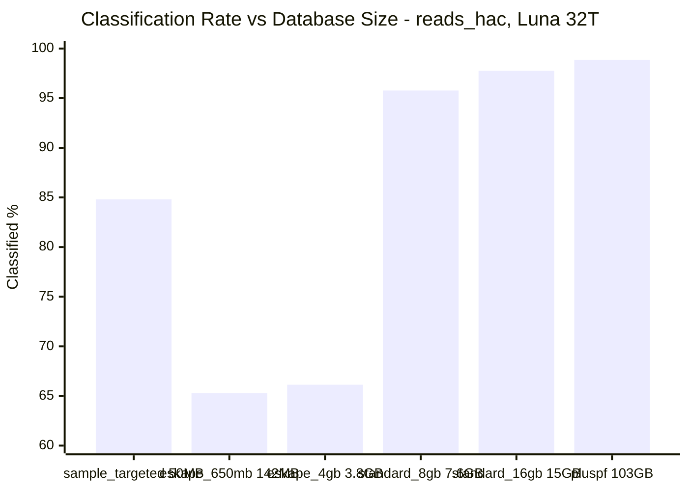
```mermaid
xychart-beta
    title "Classification Rate vs Database Size - reads_hac, Luna 32T"
    x-axis ["sample_targeted 50MB", "eskape_650mb 142MB", "eskape_4gb 3.8GB", "standard_8gb 7.6GB", "standard_16gb 15GB", "pluspf 103GB"]
    y-axis "Classified %" 60 --> 100
    bar [84.80, 65.28, 66.13, 95.77, 97.77, 98.86]
```

→ full database build procedure: [AccuracyDrift/README.md](AccuracyDrift/README.md)

---

## 5. Full Pipeline Run - AIIMS Data

Input: `FBE01990_24778b97_03e50f91_10.pod5` - 4 GB, 104,478+ reads from 12 barcodes (12 patient samples), real AIIMS clinical run.

### 5a. Basecalling (dorado, 3 models)

| Model | Reads | Total Bases | Time (Colab T4) | Time (GTX 1650) | Classification% |
|-------|-------|------------|-----------------|-----------------|----------------|
| `fast` | 104,832 | 357.62 Mbp | 3 min 58s | ~5 min | 82.66% |
| `hac` | 104,918 | 355.36 Mbp | 19 min 8s | ~71 min | 95.77% |
| `sup` | 104,980 | 365.84 Mbp | 2h 5min | OOM | 97.09% |

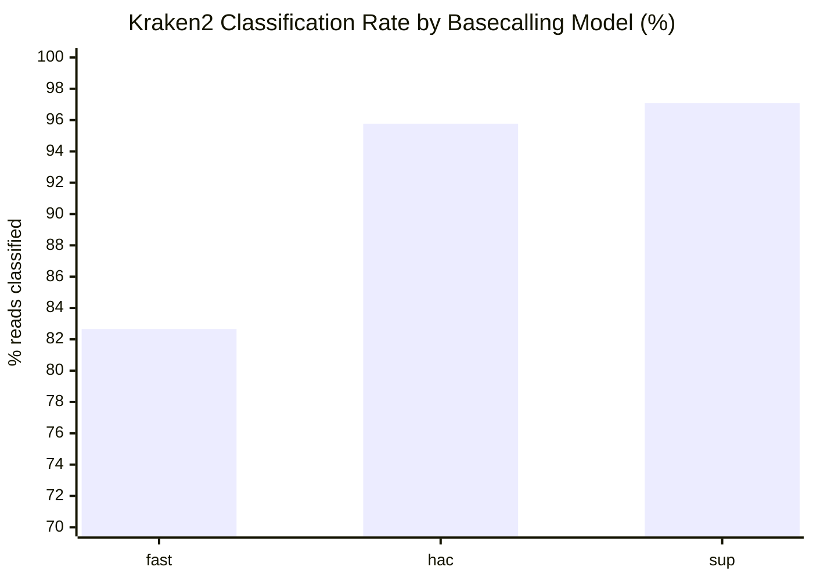
```mermaid
xychart-beta
    title "Kraken2 Classification Rate by Basecalling Model (%)"
    x-axis ["fast", "hac", "sup"]
    y-axis "% reads classified" 70 --> 100
    bar [82.66, 95.77, 97.09]
```

**fast→hac: +13 pp. hac→sup: +1.3 pp at 6× the compute cost. hac is the clinical sweet spot.**

### 5b. Species found (AIIMS sample)

- Barcodes 01–07: *Pseudomonas aeruginosa*
- Barcodes 09–12: *K. pneumoniae* + *E. faecium* (mixed)
- Barcode 13: *E. faecium*
- Barcode 14: mixed

→ colab notebook: https://colab.research.google.com/drive/1mj3lRxxIFS_qCeStrXszhIYHlJ2Z36bw?usp=sharing

---

## 6. Dorado GPU Basecalling Profile

**Status: complete (2026-06-26/27).**

Platforms profiled: Luna (2x NVIDIA L40S, Ada Lovelace, CUDA 12.9), Orion (Jetson AGX Orin, 2048-core Ampere iGPU), plus legacy Colab T4 and GTX 1650 (WSL2) runs kept for historical comparison. GPU kernel profiling via Nsight Systems (nsys) and Nsight Compute (ncu). Dorado v1.4.0+ba44a013 on Luna, v0.5.3 on Orion. Input: `FBE01990_24778b97_03e50f91_10.pod5` (104,478 reads).

> **Note:** the default nsys/nvprof packages on Luna are broken on the L40S (sm_89): nsys 2021.3.3.2 hits a `GLIBC_PRIVATE` symbol error, and nvprof 11.5 rejects compute capability 8.0 and above at runtime. Had to install `cuda-nsight-systems-12-9` (nsys 2025.1.3) separately to get kernel-level breakdowns; ncu 2021.3.1 worked throughout without changes.

### 6a. Nsight Systems: GPU Kernel Breakdown (Luna L40S)

`fast` and `hac` both run LSTM-based models; `sup` runs a Transformer with FP8 precision, an architecturally different workload. The kernel mix shifts sharply between them:

| Metric | fast | hac | sup |
|---|---|---|---|
| Model architecture | LSTM | LSTM (larger) | **Transformer** |
| Precision | FP16 | FP16 | **FP8 + FP16** |
| GEMM % of GPU time | 30.8% | 15.0% | 43.6% (FP8+FP16, incl. attention QKV) |
| LSTM % of GPU time | 27.5% | **68.0%** | **0%** |
| Attention % of GPU time | 0% | 0% | 10.4% |
| RMSNorm % of GPU time | 0% | 0% | 17.1% |
| Beam search % of GPU time | 14.8% | 2.1% | 8.5% |
| `cudaStreamSynchronize` % of CUDA API | 63.1% | 51.2% | 97.3% |
| Total blocking sync % of CUDA API | 96.5% | 96.1% | ~98.7% |

Dominant kernels:
- **fast:** `ampere_h16816gemm_128x64_ldg8_nn` (24.8%, cuBLAS FP16 GEMM), `lstm<int8,96,fwd>` (16.5%), `beam_search_step` (14.8%), `lstm<int8,96,bwd>` (11.0%).
- **hac:** `vcs_lstm<8>` (46.4%, custom vectorised LSTM), `vcs_lstm<4>` (15.9%), `cutlass::Kernel<LinearLayer MmaMultistage>` (11.2%, CUTLASS GEMM).
- **sup:** `tiled_residual_rmsnorm` (17.1%, runs between every Transformer layer), `mm_swiglu<fp8_e4m3>` (15.1%, fused FP8 FFN and SwiGLU), `attention<256>` (10.4%), `qkv_rotary<fp8_e4m3>` (9.4%), `mm_kernel<fp8_e4m3>` (8.9%, output projection).

> **Finding:** GEMM dominance collapses going from GTX 1650 (82% of GPU time) to L40S `fast` (30.8%), because the L40S finishes matrix multiplies fast enough to expose the LSTM and beam-search stages underneath. `hac` swings the other way: a larger LSTM (`vcs_lstm`) pushes LSTM to 68% of GPU time, almost entirely LSTM-bound. `sup` is a different workload altogether, no LSTM kernels at all, dominated by Transformer ops (RMSNorm + FP8 GEMM + attention, roughly 71% combined). Across all three models, `cudaStreamSynchronize` and related sync calls stay at 96 to 99% of CUDA API time: the CPU host is essentially always blocked waiting on the GPU, regardless of model complexity.

### 6b. Platform Timing Comparison

| Model | Colab T4 | GTX 1650 (4 GB) | Luna L40S | Accuracy (32T) |
|-------|---------|----------------|----------|---------------|
| `fast` | 3 min 58 s | ~5 min | **33.9s** | 82.66% |
| `hac` | 19 min 8 s | ~71 min (`--batchsize 16`) | **55.0s** | 95.77% |
| `sup` | 2 h 5 min | **OOM** (4 GB insufficient) | **4m 26s** | 97.09% |

Luna batch sizes (VRAM-limited): fast=320, hac=2,944, sup=96, split across 2x L40S (cuda:0 and cuda:1). The GTX 1650's 4 GB VRAM cannot fit `sup` at all; Luna's 46 GB per GPU runs it in under 5 minutes.

### 6c. CPU vs GPU vs Orion: Full Comparison

| Model | Luna L40S GPU | Luna CPU | Orion Ampere GPU | Luna GPU speedup vs CPU |
|---|---|---|---|---|
| fast | 33.9s (2.35 x 10⁸ samples/s) | 9m 40s (8.23 x 10⁶ samples/s) | 6m 44s (1.31 x 10⁷ samples/s) | **28.6x** |
| hac | 55.0s (2.03 x 10⁸ samples/s) | 43m 26s (1.88 x 10⁶ samples/s) | ~1 day (est., disconnected) | **107x** |
| sup | 4m 26s (1.98 x 10⁷ samples/s) | **~9 days (est.)** | not run | **~3,000x (est.)** |

Luna CPU: 650 threads, roughly 130 cores active, 96 GB RAM. Orion GPU: 2048-core Ampere iGPU, 64 GB unified memory, dorado v0.5.3, batch size capped at 64 (OOM at default). SUP CPU estimate is from a progress bar showing `9d:01h:14m:10s` remaining after 12 minutes elapsed (run cancelled). Orion `hac` estimate is a roughly 1 day ETA read off the progress bar before an SSH disconnect (run never completed).

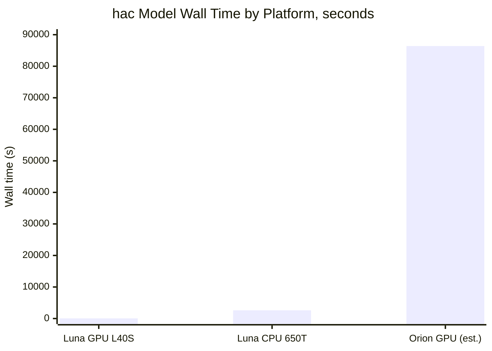
```mermaid
xychart-beta
    title "hac Model Wall Time by Platform, seconds"
    x-axis ["Luna GPU L40S", "Luna CPU 650T", "Orion GPU (est.)"]
    y-axis "Wall time (s)" 0 --> 90000
    bar [55.0, 2606, 86400]
```

The Orion bar is an estimate (run disconnected before completion); it is included to show the order of magnitude, not as a measured figure. Luna GPU finishes `hac` roughly 47x faster than Luna CPU and, on this estimate, roughly 1,570x faster than Orion's GPU.

> **Finding: why sup is roughly 9 days on CPU.** `sup` runs in FP8 (`fp8_e4m3`) precision, natively accelerated by Ada Lovelace tensor cores. No x86 CPU architecture supports native FP8 arithmetic today, not even the Intel Xeon Platinum 8468's AMX, which covers BF16 and INT8 but not FP8. On CPU, dorado silently falls back to FP32 for every FP8 op, which increases compute cost per operation and roughly doubles memory traffic. The GPU's fused kernels (for example `mm_swiglu<fp8>`, matmul plus SwiGLU in one pass) also decompose into separate, unfused CPU ops, adding further overhead. Net effect: the CPU penalty for `sup` (roughly 3,000x, estimated) is an order of magnitude worse than `fast` (28.6x) or `hac` (107x), because `sup` pays both the "no GPU" tax and the "no native FP8" tax at once.

### 6d. Model Selection: Clinical Sweet Spot

| Transition | Accuracy gain | Time cost (Colab T4) | Clinical verdict |
|------------|--------------|-----------|-----------------|
| fast to hac | **+13.1 pp** (82.66% to 95.77%) | **~5x** | Worth it, resolves mixed-species barcodes 09-12 |
| hac to sup | **+1.3 pp** (95.77% to 97.09%) | **~6x further** | Not justified in diagnostic context |

**hac is the clinical sweet spot.** The fast to hac transition delivers 13 percentage points of accuracy at only 5x the time cost, critical for correctly resolving *K. pneumoniae*/*E. faecium* mixtures. The hac to sup transition gains 1.3 pp at a 6x further time penalty; that improvement does not change species calls.

On Luna L40S the absolute gaps compress a great deal (33.9s to 55.0s to 4m 26s) but the relative shape holds: fast to hac is under 2x, hac to sup is close to 5x. The accuracy-per-second argument for stopping at `hac` in a clinical setting is unchanged; Luna GPU just makes every option in the table fast enough that the choice is now about accuracy, not about which run is even feasible.

### 6e. Proposed Optimisation: Signal-to-Base (S2B) Cache

| Parameter | Value |
|-----------|-------|
| Target hit rate | 30% |
| Projected GPU time saving | **~25%** |
| Cache location | CUDA shared memory (GPU-side, L1-speed) |
| Cache key | Signal window embedding / LSH hash |
| Lookup budget | Must beat avg GEMM call (~19.6 ms) |
| Mechanism | Eliminates GEMM dispatch, reduces `cudaStreamSynchronize` stalls |

This remains a proposed, forward-looking optimisation: it has not been implemented or measured. What changed since the original write-up is that the premise is now confirmed with real data instead of a projection. Luna L40S has ~91.6 TFLOPS FP32 vs Colab T4's ~8.1 TFLOPS, and the open question was whether `sup` would even run in reasonable time on Luna without hitting VRAM limits like it did on the GTX 1650. It does: `sup` completed in 4m 26s at batch size 96 with no OOM, roughly a 28x GPU-only speedup over T4's 2h 5min. The remaining bottleneck the S2B cache targets is unchanged: `cudaStreamSynchronize` still eats 96 to 99% of CUDA API time across all three models (Section 6a), meaning the CPU host is idle waiting on GPU compute regardless of model. An S2B cache that skips redundant GEMM dispatch for repeated or similar signal windows remains the most direct lever on that number.

→ source: [AccuracyDrift/dorado_profiling.md](AccuracyDrift/dorado_profiling.md) (Luna, 2026-06-26/27) | legacy baseline: [docs/updates.md](docs/updates.md) (Session 5, 2026-05-20/21)

---

## 7. Matrix Multiply Benchmark Suite

Built 12 CPU implementations and 7 GPU CUDA kernels to empirically study cache access patterns, vectorisation, and parallelism on real hardware. This is the empirical foundation for kraken2 optimisation decisions.

→ full CPU report: [Luna/profiling/matmul/report/REPORT.md](Luna/profiling/matmul/report/REPORT.md) | WSL2 data: [All_Matric_Mul_perf_stats/PERF_REPORT.md](All_Matric_Mul_perf_stats/PERF_REPORT.md)

### 7a. CPU variants - WSL2 wall time (N=1024, best to worst)

| Variant | Time (ms) | vs naive | Strategy |
|---------|----------|---------|---------|
| `naive_ijk` | 9,961 | 1× | Sequential column access - every load L3 miss |
| `tiled_avx2` | 335 | **29.7× faster** | Tiles in L2, AVX2 FMA - best single-thread at N=1024 |
| `avx2_manual` | 324 | 30.7× faster | - |
| `omp_tiled` | 579 | - | Best overall at N=10000 (2.4 GB working set) |
| `prefetch_ikj` | 961 | 9.3× more instructions than ikj_order, **2.2× slower** | Software prefetch hurts sequential access |

**Gap grows with N:** naive_ijk is **29.7× slower** at N=1024, **48.2× slower** at N=2048 vs tiled_avx2.

### 7b. Luna CPU - N=10000, single-thread (authoritative)

| Variant | Luna time (s) | IPC | L3 miss rate |
|---------|-------------|-----|-------------|
| `naive_ijk` | >4 hours (projected) | - | - |
| `tiled` | **135.7** | 2.22 | 32.3% |
| `tiled_avx2` | 168.4 | 3.20 | 14.4% |
| `ikj_order` | 552.1 | 0.36 | 92.3% |

### 7c. Luna TMA - microarchitecture analysis

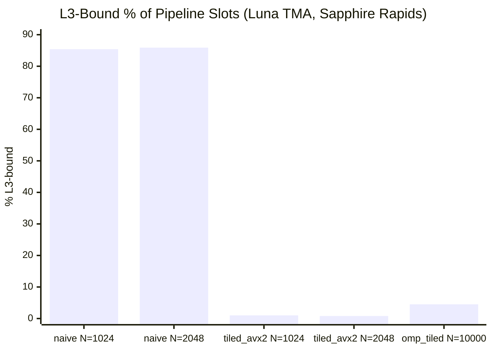
```mermaid
xychart-beta
    title "L3-Bound % of Pipeline Slots (Luna TMA, Sapphire Rapids)"
    x-axis ["naive N=1024", "naive N=2048", "tiled_avx2 N=1024", "tiled_avx2 N=2048", "omp_tiled N=10000"]
    y-axis "% L3-bound" 0 --> 90
    bar [85.4, 85.9, 1.0, 0.8, 4.5]
```

**85.4% of naive_ijk pipeline slots stall on L3 misses.** Tiling drops this to 0.8–1.0% - tiles fit in L2, L3 is almost never touched.

| Variant | L3-bound % | ILP | Verdict |
|---------|-----------|-----|--------|
| `naive_ijk` | **85.4%** | 3.6 | Memory-bound - L3 latency dominates |
| `tiled_avx2` | **0.8–1.0%** | 8.0+ | FMA-bound - pipeline fully saturated |
| `omp_tiled` N=10000 | 4.5% | - | DRAM-bound - 4 threads saturate the bus |

### 7d. GPU - NVIDIA L40S Ada Lovelace (N=10000)

7 CUDA variants at N = 1024, 2048, 4096, 10000. Single precision (FP32/TF32/FP16).

| Variant | N=10000 time (ms) | GFLOPS | % of peak | Notes |
|---------|-----------------|-------|----------|-------|
| `coalesced_gpu` | 5,209 | 384 | low | **Slower than naive** - 1D block kills SM occupancy |
| `shared_tiled` | 338 | 5,915 | 6.5% FP32 | Shared memory tiling |
| `shared_tiled_2d` | 68 | 29,399 | **32% FP32** | Register blocking + 2D tiles |
| `wmma_manual_fp16` | 40 | 50,001 | **14% FP16** | Manual Tensor Cores |
| `cublas_sgemm` | 45 | 44,475 | **49% FP32** | Vendor FP32 library |
| `cublas_tensor_tf32` | **16.27** | **122,923** | **67% TF32** | **Peak: 123 TFLOPS** |

L40S theoretical peaks: 91.6 TFLOPS FP32 · 183 TFLOPS TF32 · 362 TFLOPS FP16.

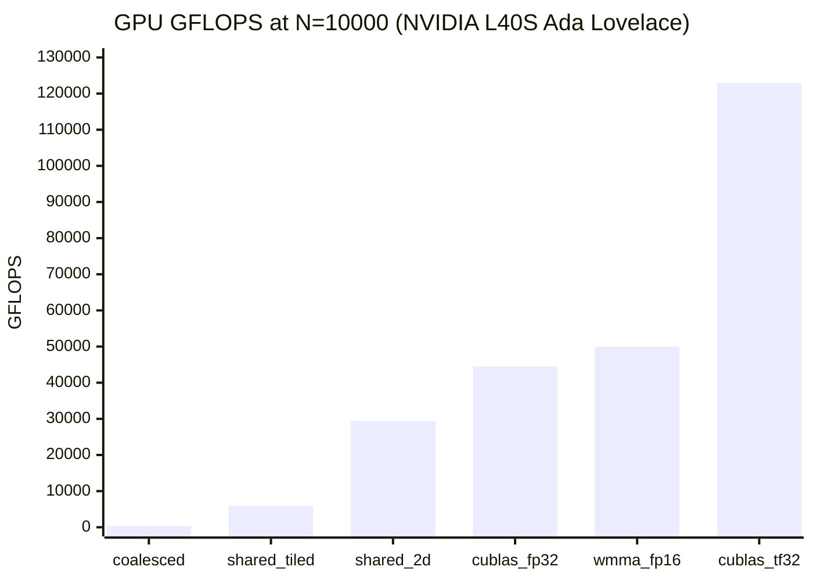
```mermaid
xychart-beta
    title "GPU GFLOPS at N=10000 (NVIDIA L40S Ada Lovelace)"
    x-axis ["coalesced", "shared_tiled", "shared_2d", "cublas_fp32", "wmma_fp16", "cublas_tf32"]
    y-axis "GFLOPS" 0 --> 130000
    bar [384, 5915, 29399, 44475, 50001, 122923]
```

### 7e. GPU vs CPU speedup (N=10000)

Baseline: Luna CPU best single-thread (tiled, 135.7 s):

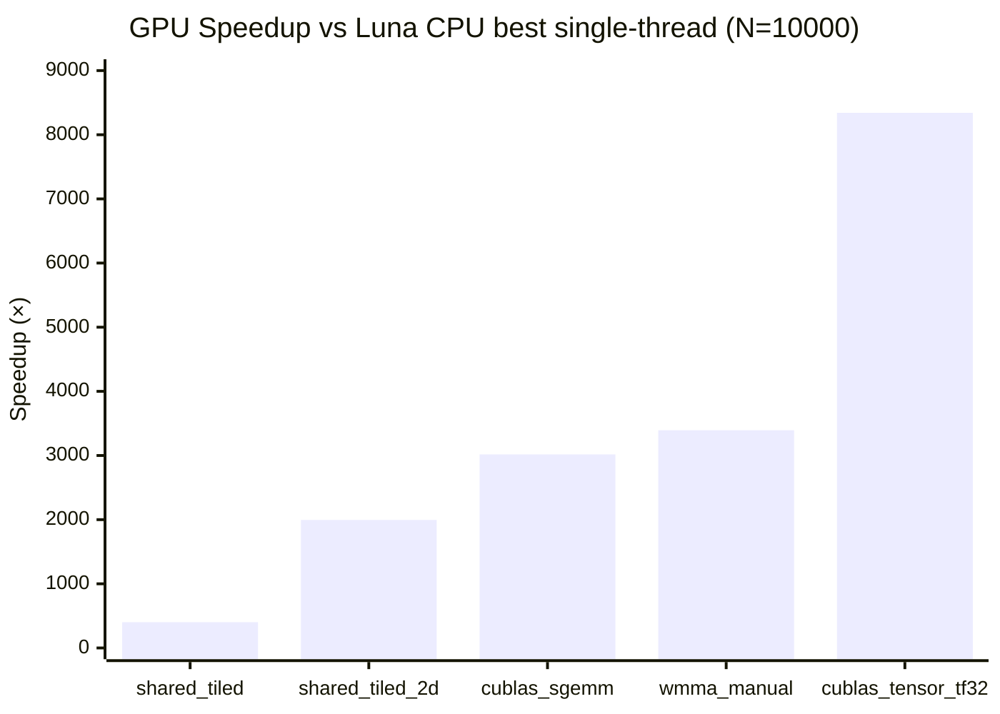
```mermaid
xychart-beta
    title "GPU Speedup vs Luna CPU best single-thread (N=10000)"
    x-axis ["shared_tiled", "shared_tiled_2d", "cublas_sgemm", "wmma_manual", "cublas_tensor_tf32"]
    y-axis "Speedup (×)" 0 --> 9000
    bar [401, 1995, 3017, 3393, 8342]
```

`cublas_tensor_tf32` is **~8,342× faster** than the best CPU single-thread implementation.

### 7f. Key lessons for kraken2

| Property | Dense matmul | Kraken2 lookup |
|----------|-------------|---------------|
| Access pattern | Sequential, predictable | Random pointer chasing |
| Working set | Fits in cache with tiling | 8 GB DB >> any cache |
| SIMD/GPU port? | **8,300× GPU speedup** | <2× even in research papers |
| Software prefetch | **Hurts** - HW already handles sequential | **Helps** - HW can't predict random |

`prefetch_ikj`'s negative result (9.3× more instructions, 2.2× slower) proves the argument: **prefetch hurts regular access, helps irregular access**. Kraken2's random hash table access is the case where prefetch wins.

→ GPU results: [Luna/profiling/matmul_gpu_bundle/README.md](Luna/profiling/matmul_gpu_bundle/README.md)

---

## 8. Kraken2 Core Profiling - Steps 1–51+

Input: `standard_8gb` (7.6 GB `hash.k2d`), 104,918 reads (hac FASTQ), Luna with `perf_event_paranoid=0`.

→ complete data: [Luna/profiling/results_kraken2.md](Luna/profiling/results_kraken2.md)

### 8a. Perf stat - all 3 models (96 threads)

| Metric | fast | hac | sup | Notes |
|--------|------|-----|-----|-------|
| IPC | 1.47 | **1.58** | **1.65** | Theoretical max ~6 - CPU at 24–27% efficiency |
| LLC miss rate | 82.0% | 81.9% | 82.0% | Structural - DB 38× larger than 210 MB L3 |
| Stall % | **51.8%** | 48.7% | 48.5% | Half the cycles are wasted |
| DRAM stalls (B cycles) | **11.3B** | 8.34B | 9.26B | |
| Wall time | 5.84s | 5.0s | 5.63s | hac fastest due to better IPC |
| User time | 19.0s | 19.3s | 19.2s | Consistent - same work |

### 8b. TMA breakdown - hac model (Luna, 96T)

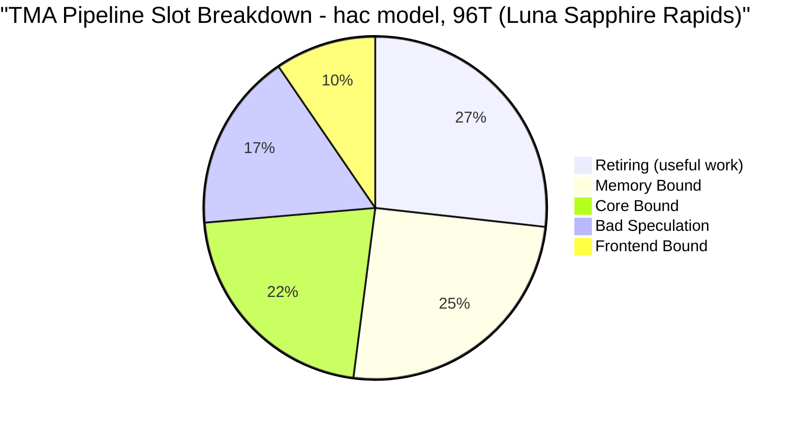
```mermaid
pie title "TMA Pipeline Slot Breakdown - hac model, 96T (Luna Sapphire Rapids)"
    "Retiring (useful work)" : 26.9
    "Memory Bound" : 25.4
    "Core Bound" : 21.7
    "Bad Speculation" : 16.9
    "Frontend Bound" : 9.6
```

Only **26.9%** of pipeline slots do real work. Memory + core bound = 47%. Bad speculation = 16.9% (1 in 6 slots squashed by branch misprediction). All 3 models have nearly identical TMA profiles - bottleneck is DB size, not read quality.

### 8c. Cachegrind - per-function DRAM attribution (Step 11, 1T)

Ran `valgrind --tool=cachegrind` at 1T. 362s wall (~20× overhead). Simulated 104 MB L3, 64B lines.

**Program-wide:** 99.96B instructions, 43.88B data refs, **9.58M last-level read misses** (~0.96s serialised DRAM latency at 1T).

| Function | Instructions % | LL read miss % | Meaning |
|----------|--------------|----------------|---------|
| `MinimizerScanner::NextMinimizer` | **48.23%** | **0%** | Pure compute - zero DRAM reads |
| `reverse_complement` | 11.63% | **0%** | Pure compute |
| **`CompactHashTable::Get`** | **0.65%** | **96.24%** | **Owns virtually all DRAM reads** |
| `ClassifySequence` | 11.51% | 0.00% | Orchestration |
| `AddHitlistString` | 4.28% | 0.08% | Output |

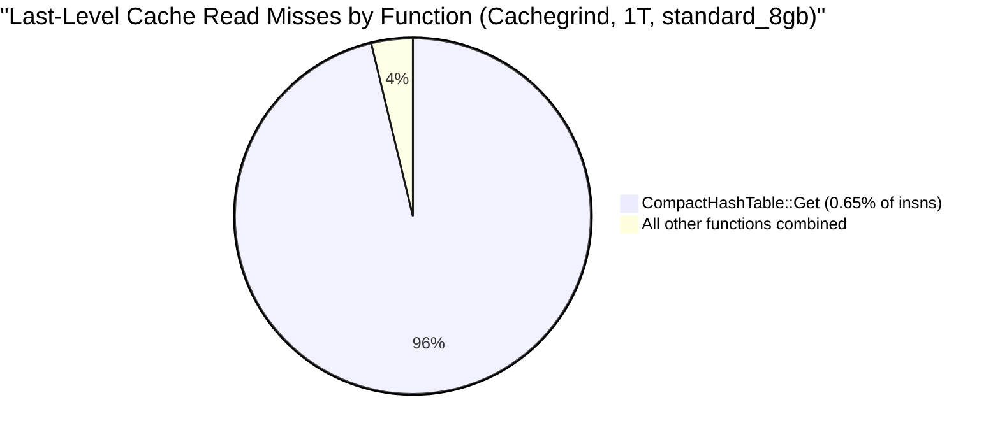
```mermaid
pie title "Last-Level Cache Read Misses by Function (Cachegrind, 1T, standard_8gb)"
    "CompactHashTable::Get (0.65% of insns)" : 96.24
    "All other functions combined" : 3.76
```

**`CompactHashTable::Get` executes 0.65% of all instructions but generates 96.24% of all last-level cache read misses.**

Why: hash table is 8 GB. L3 is 104 MB. Ratio = 77:1. 104,918 reads × ~11 minimizers each → virtually every probe is a cold DRAM access.

This cleanly splits the optimisation targets:
- **MinimizerScanner** (48% of instructions): CPU-bound, zero DRAM → target for SIMD
- **CompactHashTable::Get** (0.65% of instructions): memory-bound, 96% of DRAM → target for LRU cache + prefetch

→ full cachegrind analysis: [Luna/profiling/results_kraken2.md § Step 11](Luna/profiling/results_kraken2.md)

### 8d. Thread scaling - standard 8 GB DB (5-run avg, fast model)

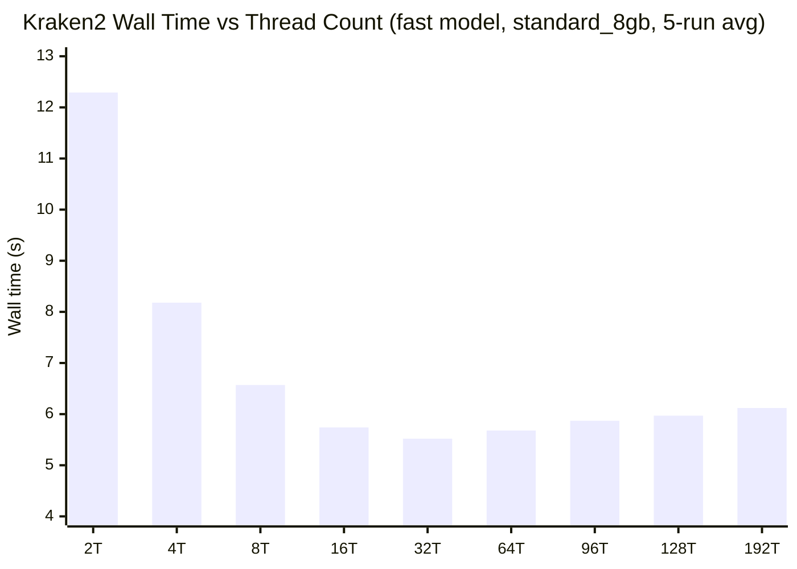
```mermaid
xychart-beta
    title "Kraken2 Wall Time vs Thread Count (fast model, standard_8gb, 5-run avg)"
    x-axis ["2T", "4T", "8T", "16T", "32T", "64T", "96T", "128T", "192T"]
    y-axis "Wall time (s)" 4 --> 13
    bar [12.29, 8.18, 6.57, 5.74, 5.52, 5.68, 5.87, 5.97, 6.12]
```

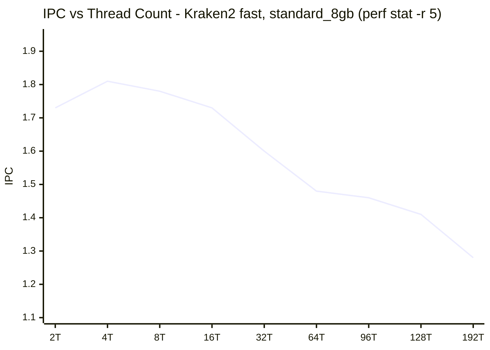
```mermaid
xychart-beta
    title "IPC vs Thread Count - Kraken2 fast, standard_8gb (perf stat -r 5)"
    x-axis ["2T", "4T", "8T", "16T", "32T", "64T", "96T", "128T", "192T"]
    y-axis "IPC" 1.1 --> 1.95
    line [1.73, 1.81, 1.78, 1.73, 1.60, 1.48, 1.46, 1.41, 1.28]
```

IPC peaks at 4T (1.81) then falls to 1.28 at 192T - a 29% drop. DRAM stall cycles plateau at ~11B from 8T - bandwidth is saturated by 8 threads. **Optimal: 32 threads for all 3 models.**

### 8e. Flamegraph (perf record -g -F 99, hac, 32T)

First full-stack profile; captures kernel + I/O. Corrects the gprof denominator error.

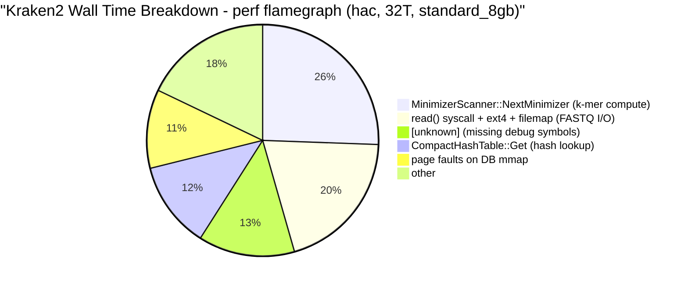
```mermaid
pie title "Kraken2 Wall Time Breakdown - perf flamegraph (hac, 32T, standard_8gb)"
    "MinimizerScanner::NextMinimizer (k-mer compute)" : 25.57
    "read() syscall + ext4 + filemap (FASTQ I/O)" : 20.0
    "[unknown] (missing debug symbols)" : 13.45
    "CompactHashTable::Get (hash lookup)" : 12.10
    "page faults on DB mmap" : 11.0
    "other" : 17.88
```

**gprof's 67% claim for CompactHashTable::Get was a denominator error** - gprof's denominator excludes all kernel/I/O time. The real #1 hotspot is `MinimizerScanner::NextMinimizer` at 25.57%.

| Tool | Platform | CompactHashTable | MinimizerScanner |
|------|---------|-----------------|-----------------|
| gprof (WSL2, ESKAPE DB) | user-space only | **67%** | not reported |
| gprof (Luna 1T, 8 GB DB) | user-space only | **23.23%** | **53.35%** |
| perf flamegraph (Luna 32T) | **full wall time** | **12.10%** | **25.57%** |

Cross-validation: gprof 23.23% × 18.6s user = 2.43s = **10.6% of 22.8s wall** - matches flamegraph. Tools agree once you account for the denominator.

→ flamegraph SVG: [Luna/profiling/flamegraph_hac_32t.svg](Luna/profiling/flamegraph_hac_32t.svg)

### 8f. NUMA analysis (Steps 7–9, hac, 32T, 5-run avg)

Luna has 2 physical CPU sockets. Local DRAM cost = distance 10, cross-socket = distance 21 (2.1× penalty). DB loads into node 0's RAM on first use.

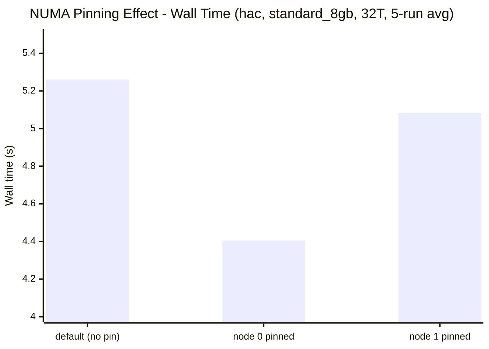
```mermaid
xychart-beta
    title "NUMA Pinning Effect - Wall Time (hac, standard_8gb, 32T, 5-run avg)"
    x-axis ["default (no pin)", "node 0 pinned", "node 1 pinned"]
    y-axis "Wall time (s)" 4.0 --> 5.5
    bar [5.261, 4.405, 5.083]
```

Node 0 pinning saves **16.3%** wall time with zero code changes.

| Metric | Cross-socket (default) | Node 0 local | Change |
|--------|----------------------|-------------|--------|
| IPC | 1.58–1.62 | **1.86** | +17.7% |
| DRAM stall cycles | ~12.2B | **6.44B** | −47% |
| `memory_bound %` | ~31.7% | **23.9%** | −7.8 pp |
| LLC miss rate | 82–83% | **83.1%** | unchanged |

LLC miss rate stays ~82% regardless of NUMA config - pinning reduces miss **latency**, not miss **count**.

### 8g. FASTQ on tmpfs - no benefit (Step 12)

Hypothesis: flamegraph's ~20% I/O tower is disk I/O. Copying FASTQ to `/dev/shm` would eliminate ext4 overhead.

| Config | Wall time |
|--------|----------|
| SSD warm (baseline) | 4.405s |
| tmpfs warm | 4.395s (−0.2%, noise) |
| Cold SSD (after drop_caches) | 10.894s (+6.49s) |

**Result: no benefit.** Luna has 503 GB RAM - the 703 MB FASTQ has been in OS page cache since the first run. The flamegraph's I/O tower is `copy_page_to_iter` - a memory-to-memory copy from page cache to process buffer. Eliminating it requires `mmap()` or `O_DIRECT` (both need Kraken2 source changes).

→ full write-up: [Luna/experiments/tmpfs_fastq/README.md](Luna/experiments/tmpfs_fastq/README.md)

### 8h. DRAM Bandwidth - Latency-Bound, Not Bandwidth-Bound (M4)

Measured via uncore IMC hardware counters: `perf stat -a -e uncore_imc_{0,2,4,6}/cas_count_{read,write}/`. Luna has 4 active DDR5 channels per socket (slots 0, 2, 4, 6 populated).

**M4 result - standard_8gb (32T, numactl node0, warm, wall 5.008s):**

| IMC Channel | Reads (MiB) | Writes (MiB) |
|-------------|------------|-------------|
| imc_0 | 6,870.7 | 3,940.8 |
| imc_2 | 6,871.6 | 3,940.5 |
| imc_4 | 6,873.4 | 3,943.1 |
| imc_6 | 6,874.0 | 3,943.1 |
| **Total** | **26,489.7 MiB reads** | **15,767.4 MiB writes** |

```
Read bandwidth  :  5.36 GiB/s
Write bandwidth :  3.08 GiB/s
Total bandwidth :  8.44 GiB/s  ≈  9.1 GB/s
Peak (4 active DDR5-4800 channels) : 143 GiB/s
Utilisation :  8.44 / 143  =  5.9%  of peak
```

All-database comparison (32T, numactl node0):

| Database | Total BW (GiB/s) | % of 143 GiB/s peak | Wall time |
|----------|:---------------:|:------------------:|-----------|
| sample_targeted 50 MB | **15.27** | **10.7%** | 0.97 s |
| standard_8gb 7.6 GB | 8.20 | 5.7% | 5.04 s |
| standard_16gb 15 GB | 8.31 | 5.8% | 8.54 s |
| pluspf_103gb 103 GB | 6.97 | 4.9% | 57.56 s |

> **Verdict: conclusively latency-bound.** All databases use **5–11%** of available DDR5 bandwidth. The DRAM highway is 94% empty. All 4 active IMC channels are **perfectly load-balanced** (within 3 MiB across ~6,870 MiB total) - the hash function uniformly distributes k-mers across the address space, distributing DRAM accesses uniformly across channels.
>
> `standard_8gb` and `standard_16gb` have nearly identical bandwidth (5.7% vs 5.8%) despite a 2× size difference. The bottleneck is latency, not volume: 32 threads × ~1 DRAM request in flight = ~32 concurrent requests; the request rate is fixed by stall latency, not DB size.
>
> **Implication:** DB compression is the wrong fix - bandwidth is not the constraint. Prefetch (`__builtin_prefetch`, Patch 3) issues the next DRAM request before the current one returns with no bandwidth cost since 94% headroom remains. Kolin sir's thread-local k-mer cache (Patch 4) eliminates DRAM accesses entirely for repeated minimizers.

### 8i. Cumulative optimisation ladder (zero code changes)

| Step | Change | Wall time | Cumulative saving |
|------|--------|----------|------------------|
| Baseline | 96T, no pinning | 5.635s | - |
| Thread scaling | 32 threads | 5.235s | −7.1% |
| NUMA pinning | + numactl node 0 | **4.405s** | **−21.8%** |

**Standard command for all future profiling:**
```bash
perf stat -e cache-misses,cache-references,LLC-loads,LLC-load-misses,instructions,cycles \
  numactl --cpunodebind=0 --membind=0 \
  kraken2 --db ~/AccuracyDrift/databases/<DB> --threads 32 \
  --output /dev/null --report /dev/null \
  /home/student/results/basecalling/reads_hac.fastq
```

### 8j. WSL2 vs Luna - what Luna corrected

| Metric | WSL2 | Luna | What it means |
|--------|------|------|--------------|
| IPC | 2.26 (wrong - Hyper-V) | **1.47–1.65** | CPU at 24–27% efficiency |
| LLC miss rate | not supported | **80–82%** | Every lookup goes to DRAM |
| Stall % | not available | **42–56%** | Half the cycles are wasted |
| TMA memory_bound | not available | **25–28%** | Memory is bottleneck #1 |
| Optimal threads | unknown | **32** (not 96) | 64 threads were wasted |
| DRAM saturation point | unknown | **8 threads** | Extra threads don't get more bandwidth |
| Top hotspot (gprof) | CompactHashTable::Get **67%** | MinimizerScanner **25.57%**, I/O ~20%, Get **12.10%** | gprof was blind to kernel |

---

## 9. AccuracyDrift Experiment

**Systematic sweep:** reads_hac + reads_sup + reads_fast × 6 databases × all thread counts (1T→96T on Luna, 1T→12T on Orion). Gold-standard ceiling via AccuracyChase (PlusPF 103 GB cold run on Luna, 2026-06-13).

→ all raw numbers: [AccuracyDrift/RESULTS.md](AccuracyDrift/RESULTS.md)  
→ observations and analysis: [AccuracyDrift/OBSERVATIONS.md](AccuracyDrift/OBSERVATIONS.md)  
→ exact commands: [AccuracyDrift/COMMANDS.md](AccuracyDrift/COMMANDS.md)

### 9a. Four Behavioral Classes

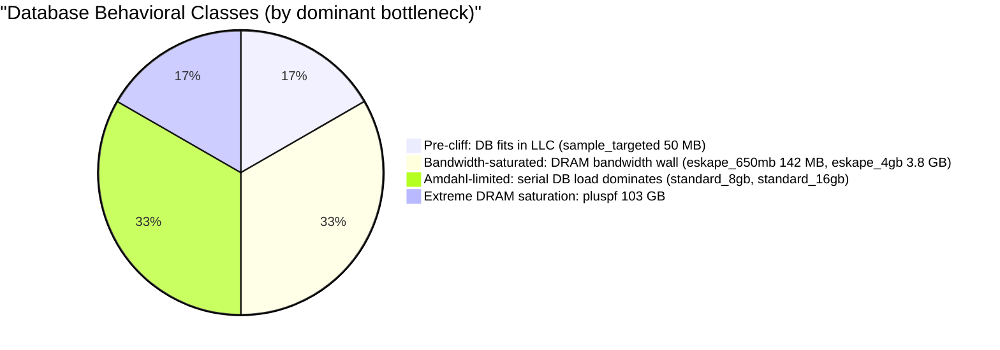
```mermaid
pie title "Database Behavioral Classes (by dominant bottleneck)"
    "Pre-cliff: DB fits in LLC (sample_targeted 50 MB)" : 1
    "Bandwidth-saturated: DRAM bandwidth wall (eskape_650mb 142 MB, eskape_4gb 3.8 GB)" : 2
    "Amdahl-limited: serial DB load dominates (standard_8gb, standard_16gb)" : 2
    "Extreme DRAM saturation: pluspf 103 GB" : 1
```

| Class | DBs | LLC miss rate | Peak thread speedup | Bottleneck |
|-------|-----|-------------|--------------------|-----------| 
| **Pre-cliff** | `sample_targeted` 50 MB | 10–16% | **~22× at 32–64T** | DRAM latency; near-linear scaling |
| **Bandwidth-saturated** | `eskape_650mb` 142 MB, `eskape_human_4gb` 3.8 GB | 31–59% | **10–22×** | DRAM bandwidth wall |
| **Amdahl-limited** | `standard_8gb`, `standard_16gb` | 76–85% | **3–4×** | Serial DB mmap load (4–8s) |
| **Extreme** | `pluspf_103gb` 103.4 GB | 90–91% | **~1.72×** | 103 GB >> 503 GB - no bandwidth ceiling reached |

**Cache cliff on Luna:** between 50 MB and 142 MB. The LLC is 210 MB but random hash access exhausts effective capacity well before that.

### 9b. LLC Miss Rate vs DB Size (cache cliff visualization)

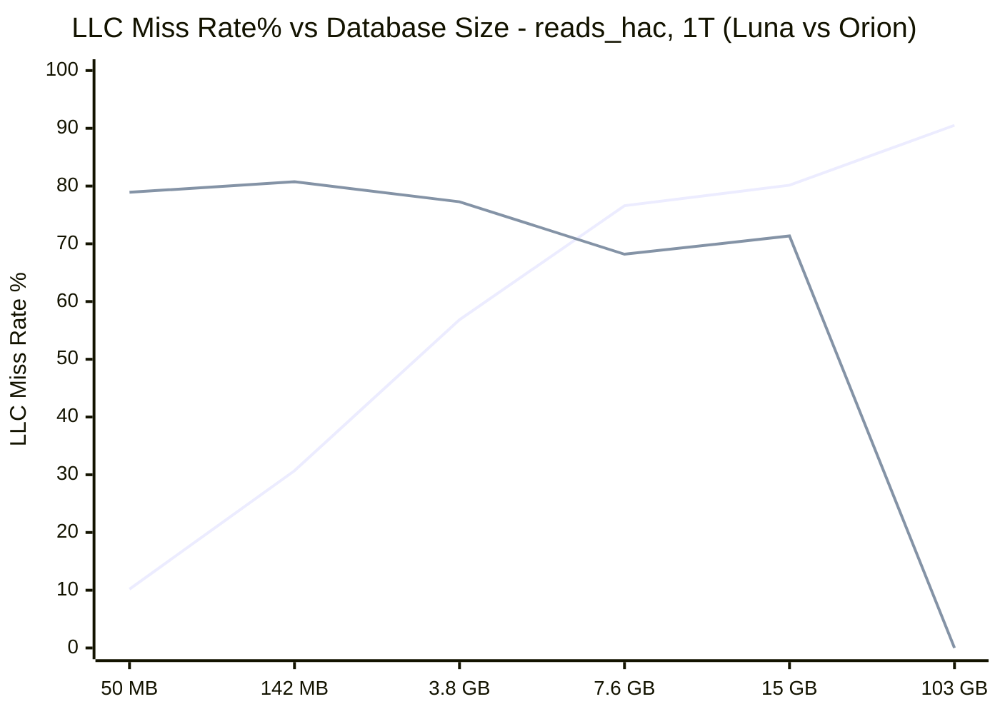
```mermaid
xychart-beta
    title "LLC Miss Rate% vs Database Size - reads_hac, 1T (Luna vs Orion)"
    x-axis ["50 MB", "142 MB", "3.8 GB", "7.6 GB", "15 GB", "103 GB"]
    y-axis "LLC Miss Rate %" 0 --> 100
    line [10.19, 30.70, 56.85, 76.59, 80.15, 90.52]
    line [78.92, 80.75, 77.28, 68.19, 71.36, 0]
```

*Top line = Orion (78–81% across all DBs - already past cliff everywhere). Bottom line = Luna (dramatic cliff jump between 50 MB and 142 MB).*

**Cache cliff on Orion:** below 4 MB (SLC size). Every DB in the experiment is post-cliff on Orion.

### 9c. Thread Scaling - Pre-cliff (sample_targeted, 50 MB)

Luna (reads_hac, numactl node 0, warm runs):

| Threads | Time (s) | Speedup | LLC Miss% | IPC |
|---------|---------|---------|----------|-----|
| 1 | 19.729 | 1.00× | 10.19 | 1.78 |
| 2 | 9.966 | 1.98× | 10.44 | 1.77 |
| 4 | 5.078 | 3.89× | 11.13 | 1.76 |
| 8 | 2.622 | 7.52× | 12.43 | 1.75 |
| 16 | 1.419 | 13.90× | 13.61 | 1.73 |
| 32 | 0.928 | **21.26×** | 14.64 | 1.65 |
| 64 | 0.947 | 20.83× | 15.23 | 1.39 |
| 96 | 1.105 | 17.85× | 15.72 | 1.34 |

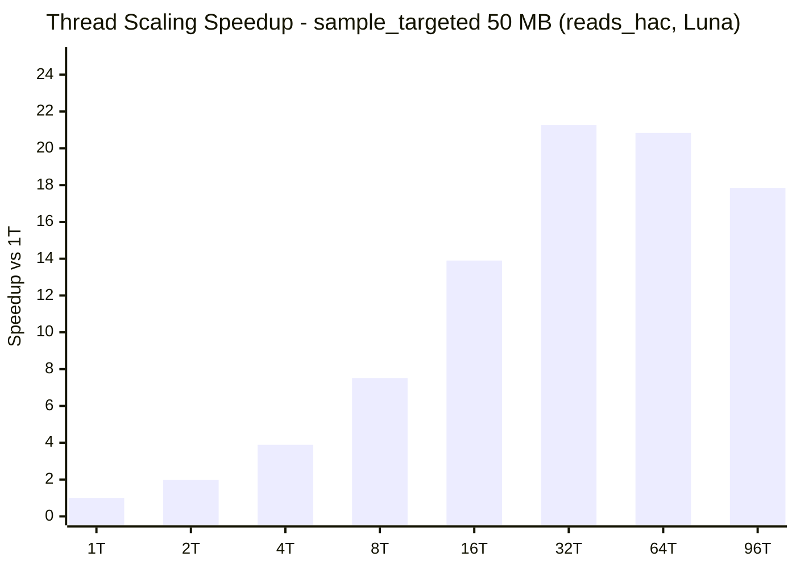
```mermaid
xychart-beta
    title "Thread Scaling Speedup - sample_targeted 50 MB (reads_hac, Luna)"
    x-axis ["1T", "2T", "4T", "8T", "16T", "32T", "64T", "96T"]
    y-axis "Speedup vs 1T" 0 --> 25
    bar [1.0, 1.98, 3.89, 7.52, 13.90, 21.26, 20.83, 17.85]
```

Near-linear to 32T. Sweet spot at **32T: 21.26× speedup**. DB fits in LLC → near-zero DRAM pressure.

### 9d. Thread Scaling - Bandwidth-saturated (eskape_650mb, 142 MB)

Luna (reads_hac, numactl node 0):

| Threads | Time (s) | Speedup | LLC Miss% | IPC |
|---------|---------|---------|----------|-----|
| 1 | 21.981 | 1.00× | 30.70 | 1.47 |
| 2 | 11.136 | 1.97× | 31.49 | 1.46 |
| 4 | 5.701 | 3.85× | 32.09 | 1.45 |
| 8 | 2.981 | 7.37× | 32.26 | 1.43 |
| 16 | 1.634 | 13.45× | 31.31 | 1.41 |
| 32 | 1.045 | 21.03× | 30.53 | 1.37 |
| 64 | 1.001 | **21.96×** | 31.35 | 1.18 |
| 96 | 1.164 | 18.88× | 32.56 | 1.13 |

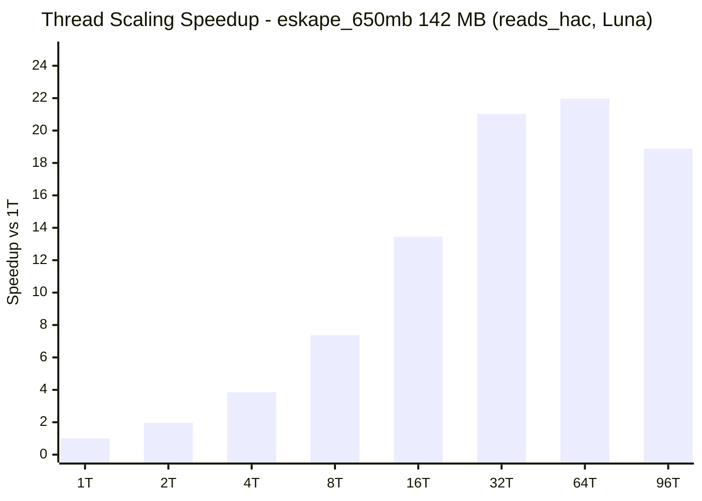
```mermaid
xychart-beta
    title "Thread Scaling Speedup - eskape_650mb 142 MB (reads_hac, Luna)"
    x-axis ["1T", "2T", "4T", "8T", "16T", "32T", "64T", "96T"]
    y-axis "Speedup vs 1T" 0 --> 25
    bar [1.0, 1.97, 3.85, 7.37, 13.45, 21.03, 21.96, 18.88]
```

Peak **21.96× at 64T**. DRAM bandwidth wall hit ~32T; 96T actually slower than 64T.

### 9e. Thread Scaling - Bandwidth-saturated (eskape_human_4gb, 3.8 GB)

Luna (reads_hac, numactl node 0):

| Threads | Time (s) | Speedup | LLC Miss% | IPC |
|---------|---------|---------|----------|-----|
| 1 | 29.818 | 1.00× | 56.85 | 1.25 |
| 2 | 15.949 | 1.87× | 57.44 | 1.25 |
| 4 | 8.966 | 3.33× | 58.41 | 1.24 |
| 8 | 5.490 | 5.43× | 59.27 | 1.22 |
| 16 | 3.761 | 7.93× | 59.34 | 1.21 |
| 32 | 2.976 | 10.02× | 59.03 | 1.16 |
| 64 | 2.823 | **10.57×** | 58.73 | 1.03 |
| 96 | 2.947 | 10.12× | 58.94 | 0.98 |

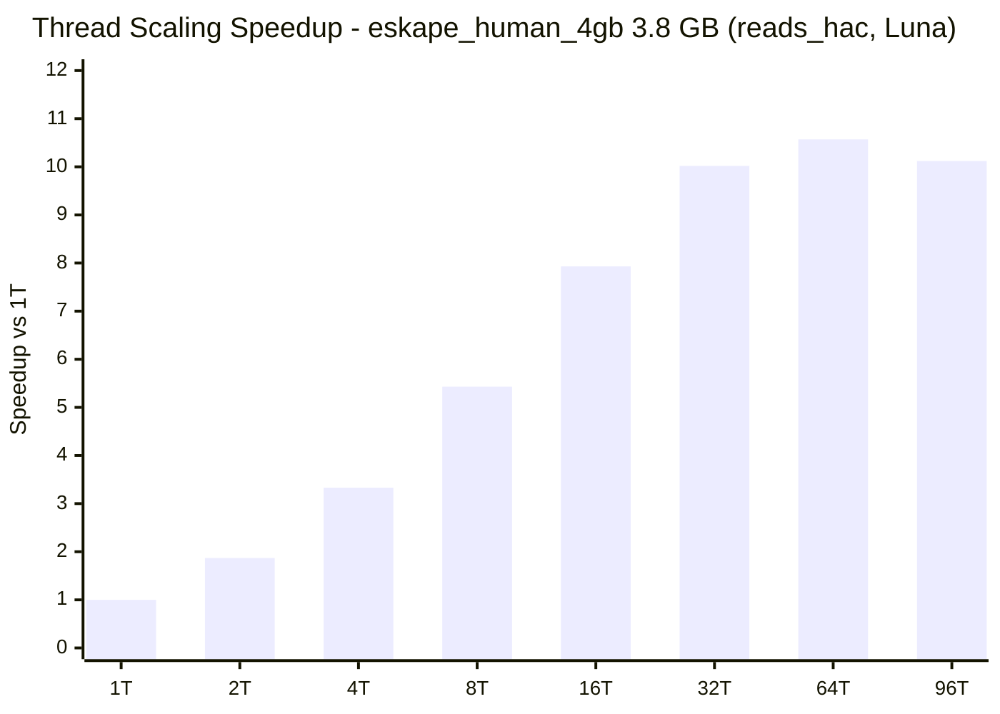
```mermaid
xychart-beta
    title "Thread Scaling Speedup - eskape_human_4gb 3.8 GB (reads_hac, Luna)"
    x-axis ["1T", "2T", "4T", "8T", "16T", "32T", "64T", "96T"]
    y-axis "Speedup vs 1T" 0 --> 12
    bar [1.0, 1.87, 3.33, 5.43, 7.93, 10.02, 10.57, 10.12]
```

Bandwidth wall hits at **~8T**. IPC drops below 1.0 at 96T - CPU almost entirely stalled on DRAM. Peak **10.57× at 64T**.

### 9f. Thread Scaling - Amdahl-limited (standard_8gb, 7.6 GB)

Luna (reads_hac, numactl node 0, 3-run avg warm):

| Threads | Time (s) | Speedup | LLC Miss% | IPC |
|---------|---------|---------|----------|-----|
| 1 | 16.778 | 1.00× | 76.59 | 2.11 |
| 2 | 10.571 | 1.59× | 77.78 | 2.08 |
| 4 | 7.419 | 2.26× | 79.60 | 2.06 |
| 8 | 5.836 | 2.87× | 82.32 | 2.02 |
| 16 | 5.096 | 3.29× | 83.34 | 1.95 |
| 32 | 4.830 | **3.47×** | 82.90 | 1.82 |
| 64 | 4.949 | 3.39× | 82.93 | 1.57 |
| 96 | 5.119 | 3.28× | 82.58 | 1.50 |

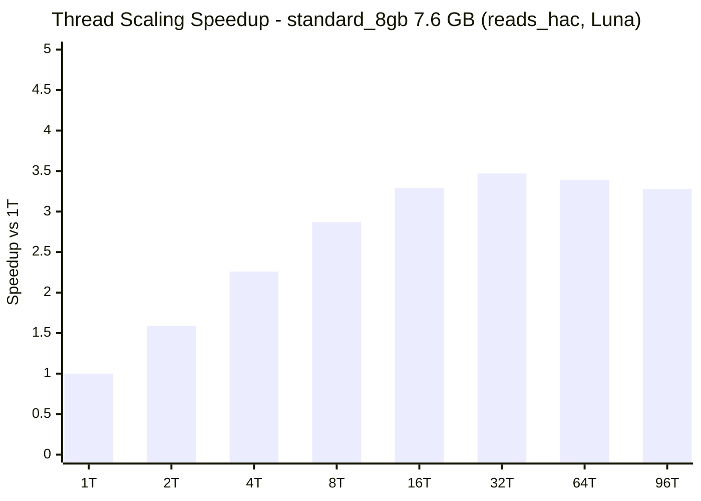
```mermaid
xychart-beta
    title "Thread Scaling Speedup - standard_8gb 7.6 GB (reads_hac, Luna)"
    x-axis ["1T", "2T", "4T", "8T", "16T", "32T", "64T", "96T"]
    y-axis "Speedup vs 1T" 0 --> 5
    bar [1.0, 1.59, 2.26, 2.87, 3.29, 3.47, 3.39, 3.28]
```

**Amdahl ceiling ~3.47× at 32T.** Serial DB mmap load = ~4.2s - regardless of thread count. Classification itself scales near-perfectly to 8T; wall-time ceiling is purely I/O.

### 9g. Thread Scaling - Amdahl-limited (standard_16gb, 15 GB)

Luna (reads_hac, numactl node 0, 3-run avg warm):

| Threads | Time (s) | Speedup | LLC Miss% | IPC |
|---------|---------|---------|----------|-----|
| 1 | 23.914 | 1.00× | 80.15 | 1.86 |
| 2 | 15.827 | 1.51× | 81.61 | 1.83 |
| 4 | 11.707 | 2.04× | 83.81 | 1.80 |
| 8 | 9.618 | 2.49× | 86.04 | 1.76 |
| 16 | 8.575 | 2.79× | 85.73 | 1.74 |
| 32 | 8.153 | **2.93×** | 85.03 | 1.67 |
| 64 | 8.253 | 2.90× | 85.04 | 1.43 |
| 96 | 8.385 | 2.85× | 84.93 | 1.37 |

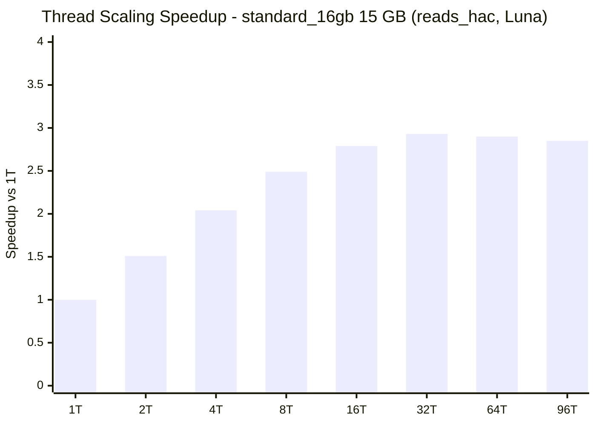
```mermaid
xychart-beta
    title "Thread Scaling Speedup - standard_16gb 15 GB (reads_hac, Luna)"
    x-axis ["1T", "2T", "4T", "8T", "16T", "32T", "64T", "96T"]
    y-axis "Speedup vs 1T" 0 --> 4
    bar [1.0, 1.51, 2.04, 2.49, 2.79, 2.93, 2.90, 2.85]
```

Amdahl ceiling **~2.93× at 32T**. Serial DB load = ~7.5s floor. OS thread-spawn sys time grows monotonically: **7.86s (32T) → 8.38s (64T) → 9.05s (96T)** - the Amdahl floor is not static; it rises with thread count, making 32T doubly optimal (serial floor is smallest AND classification speedup has plateaued).

### 9h. PlusPF 103 GB - Gold-Standard Ceiling (reads_hac, Luna warm)

| Threads | Time (s) | Speedup | LLC Miss% | IPC |
|---------|---------|---------|----------|-----|
| 1 | 96.887 | 1.00× | 90.52 | 1.00 |
| 2 | 75.739 | 1.28× | 91.10 | 1.00 |
| 4 | 65.856 | 1.47× | 91.65 | 0.99 |
| 8 | 60.692 | 1.60× | 91.64 | 0.99 |
| 16 | 57.945 | 1.67× | 91.30 | 0.99 |
| 32 | 56.759 | 1.71× | 91.13 | 0.97 |
| 64 | 56.579 | 1.71× | 90.80 | 0.93 |
| 96 | 56.417 | **1.72×** | 90.68 | 0.90 |

LLC miss rate >90% across all thread counts. 103 GB DB far exceeds LLC (210 MB) AND RAM overhead means non-trivial memory pressure. Peak **1.72× at 96T** - extreme DRAM saturation, almost no thread scaling.

**Accuracy ceiling:** 98.86% (hac), 99.24% (sup) - these are the maximum achievable classification rates.

→ detailed analysis: [AccuracyDrift/AccuracyChase.md](AccuracyDrift/AccuracyChase.md)

### 9i. All-DB Speedup Comparison (reads_hac, Luna, 32T)

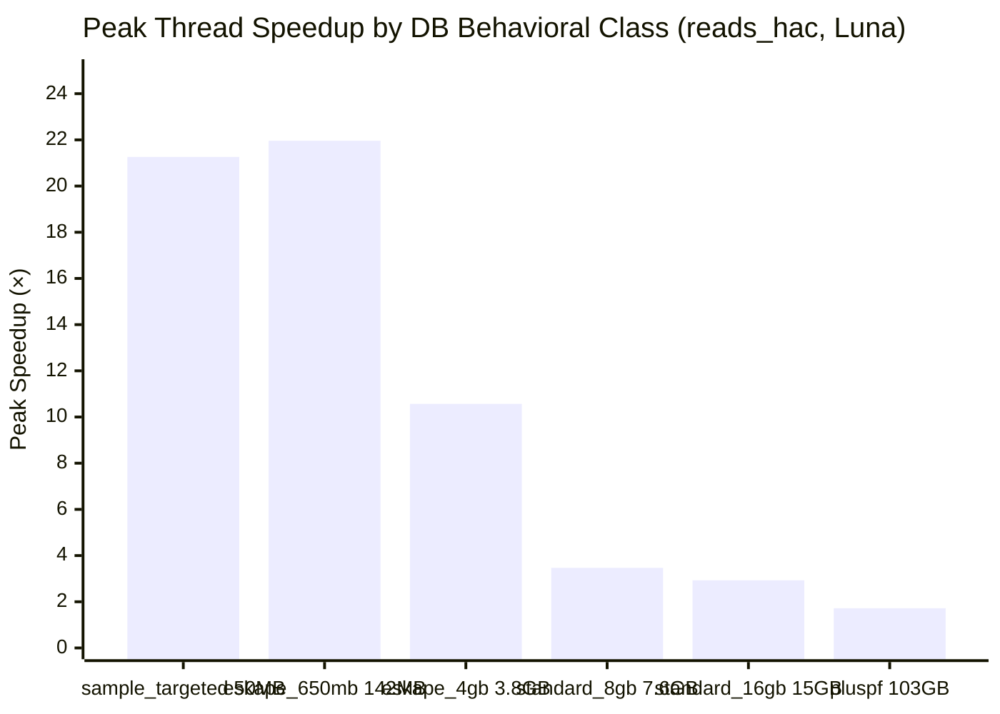
```mermaid
xychart-beta
    title "Peak Thread Speedup by DB Behavioral Class (reads_hac, Luna)"
    x-axis ["sample_targeted 50MB", "eskape_650mb 142MB", "eskape_4gb 3.8GB", "standard_8gb 7.6GB", "standard_16gb 15GB", "pluspf 103GB"]
    y-axis "Peak Speedup (×)" 0 --> 25
    bar [21.26, 21.96, 10.57, 3.47, 2.93, 1.72]
```

### 9i-b. IPC Decay vs Thread Count

IPC declines as threads increase due to growing DRAM queue contention. Most clearly tracked on `eskape_650mb` where classification dominates wall time (no Amdahl floor).

```mermaid
xychart-beta
    title "IPC Decay vs Thread Count - eskape_650mb 142 MB (reads_hac, Luna)"
    x-axis ["1T", "2T", "4T", "8T", "16T", "32T", "64T", "96T"]
    y-axis "IPC" 1.0 --> 1.6
    line [1.47, 1.46, 1.45, 1.43, 1.41, 1.37, 1.18, 1.13]
```

| Phase | Thread Range | IPC | Rate of Decline |
|-------|-------------|-----|----------------|
| Gradual | 1T → 16T | 1.47 → 1.41 | ROB (512 entries) hides most DRAM latency |
| Accelerating | 16T → 32T | 1.41 → 1.37 | DRAM bandwidth approaching saturation |
| **Collapse** | **32T → 64T** | **1.37 → 1.18** | **DRAM queue saturated; ROB fills with stalled loads** |
| Floor | 64T → 96T | 1.18 → 1.13 | Thread overhead dominates |

The IPC knee at **32T** coincides exactly with the wall-time speedup plateau - both signals share the same root cause: DRAM bandwidth saturation on a single NUMA socket.

### 9j. reads_sup vs reads_hac comparison (Luna, 1T, all DBs)

| DB | hac classified% | sup classified% | Δ | hac LLC miss% | sup LLC miss% | hac wall (s) | sup wall (s) |
|----|----------------|----------------|---|--------------|--------------|-------------|-------------|
| sample_targeted | 84.80% | 85.40% | +0.60 | 10.19 | 10.55 | 19.729 | 19.797 |
| eskape_650mb | 65.28% | 65.87% | +0.59 | 30.70 | 30.83 | 21.981 | 21.638 |
| eskape_human_4gb | 66.13% | 66.68% | +0.55 | 56.85 | 55.85 | 29.818 | 31.294† |
| standard_8gb | 95.77% | 97.09% | +1.32 | 76.59 | 75.24 | 16.778 | 16.982 |
| standard_16gb | 97.77% | 98.48% | +0.71 | 80.15 | 78.68 | 23.914 | 24.240 |

†Includes anomalous run 2 (34.471s) - system load spike. Clean avg (runs 1+3): 29.706s.

**Key findings:** LLC miss rates are nearly identical between models (< 1.5 pp difference). Wall times are indistinguishable (< 0.3s). The basecalling model is **irrelevant to cache behavior** - Kraken2's miss probability depends on DB size and k-mer distribution, not read quality.

### 9k. reads_fast vs reads_hac comparison (Luna, key DBs, 32T)

| DB | fast classified% | hac classified% | fast LLC miss% | hac LLC miss% |
|----|-----------------|----------------|---------------|--------------|
| sample_targeted | 80.94% | 84.80% | 13.82 | 14.64 |
| standard_8gb | 82.66% | 95.77% | 83.62 | 82.90 |
| standard_16gb | 90.44% | 97.77% | 86.28 | 85.03 |

reads_fast classified% = **82.66% vs 95.77% (hac)** on standard_8gb, a significant 13 pp accuracy drop. The fast model's lower-quality basecalling means more k-mer mismatches.

### 9l. Per-pod5 Classification (16 individual FBE files, reads_hac)

96-run experiment (16 pod5 files x 3 models x 2 DBs at 1T), run 2026-06-22 on Luna. This subsection covers the HAC model only, comparing `sample_targeted` (50 MB, 6 ESKAPE reference genomes) against `pluspf_103gb` (103.4 GB gold-standard ceiling). Basecalling context: re-basecalling all 16 pod5 files individually produced FAST 1,922,066 / HAC 1,906,966 / SUP 1,923,965 total reads; the classification runs below use the HAC set (1,872,777 reads after the per-pod5 Kraken2 pass).

**Aggregate, all 16 pod5 files combined:**

| Species | 50 MB DB | 103 GB DB |
|---------|----------|-----------|
| *Enterococcus faecium* | 0.00% (48) | 0.00% (2) |
| *Staphylococcus aureus* | 0.00% (86) | 0.00% (7) |
| *Klebsiella pneumoniae* | 9.73% (182,236) | 9.02% (168,902) |
| *Acinetobacter baumannii* | 0.00% (0, absent from DB) | 0.31% (5,717) |
| *Pseudomonas aeruginosa* | 52.62% (985,446) | 41.61% (779,200) |
| *Enterobacter cloacae* | 0.49% (9,269) | 0.08% (1,423) |
| Other classified | 21.87% (409,636) | 47.82% (895,608) |
| **Unclassified** | **15.28% (286,056)** | **1.17% (21,918)** |

"Other classified" in the 50 MB DB is almost entirely E. coli (about 22%, included in the sample_targeted reference set but not an ESKAPE pathogen). In the 103 GB DB it is E. coli (about 20%) plus human reads and environmental bacteria the small DB cannot see, most of which fall into Unclassified instead.

**Per-file stability, min-max range across all 16 pod5 files:**

| Species | 50 MB DB range | 103 GB DB range |
|---------|----------------|------------------|
| *Klebsiella pneumoniae* | 9.41% to 9.96% | 8.62% to 9.36% |
| *Pseudomonas aeruginosa* | 52.22% to 53.25% | 40.66% to 42.10% |
| *Enterobacter cloacae* | 0.45% to 0.56% | 0.07% to 0.09% |
| *Acinetobacter baumannii* | 0.00% (absent) | 0.28% to 0.34% |
| Other classified | 21.34% to 22.14% | 47.19% to 49.11% |
| **Unclassified** | **14.80% to 15.87%** | **0.87% to 1.42%** |

**Key finding:** species proportions are highly stable across all 16 pod5 files, no more than about 1 percentage point of drift on any major species in either DB. There is no temporal drift in sample composition across the sequencing run: *E. faecium* and *S. aureus* stay at single-digit read counts throughout (this AIIMS ICU sample is dominated by *P. aeruginosa*, *K. pneumoniae*, and E. coli), and *A. baumannii* is 0% in every single pod5 file for the 50 MB DB because its reference genome was suppressed on NCBI and could not be included at DB build time.

One data-quality anomaly worth flagging: pod5 10's totals (104,918 reads) exactly match the old single-file `reads_hac.fastq` reference run, suggesting that run was mistakenly re-run against the merged FASTQ instead of the per-pod5 file. Data is included as-is; flagged for re-run if a clean per-pod5 breakdown of file 10 is needed.

```mermaid
xychart-beta
    title "Unclassified% per Pod5 File, sample_targeted 50MB vs pluspf_103gb (HAC model)"
    x-axis ["0","1","2","3","4","5","6","7","8","9","10","11","12","13","14","15"]
    y-axis "Unclassified %" 0 --> 18
    line [15.12, 15.02, 14.80, 15.23, 15.14, 15.71, 15.47, 15.11, 14.94, 15.06, 15.20, 15.77, 15.61, 15.27, 15.87, 15.58]
    line [0.96, 0.96, 1.06, 1.16, 1.26, 1.42, 1.27, 1.20, 1.25, 1.18, 1.14, 1.42, 1.19, 0.87, 1.24, 1.20]
```

*Top line = 50 MB DB (Unclassified band 14.8 to 15.9%, flat). Bottom line = 103 GB DB (Unclassified band 0.87 to 1.42%, also flat). Both lines confirm the sample composition does not drift across the sequencing run; the only real variable is which DB Kraken2 is pointed at.*

→ source: [AccuracyDrift/pod5_classification_comparison.md](AccuracyDrift/pod5_classification_comparison.md)

### 9m. Merged-pod5 Full-Dataset Profiling (all 16 files combined, ~1.87M reads)

Run 2026-06-29/30 on Luna. Dorado reads the 16 pod5 files directly from a directory (no merge step: `pod5 merge` in the installed v0.3.39 corrupted zstd signal blocks, so per-file directory input was used instead). Kraken2 runs at 32T with `numactl --cpunodebind=0 --membind=0`, same as the standard profiling command.

| Model | DB | Classified% | LLC Miss% | IPC | Wall time (s) |
|-------|-----|-------------|-----------|-----|----------------|
| fast | sample_targeted 50 MB | 80.67% | 12.60% | 1.64 | 11.11 |
| hac | sample_targeted 50 MB | 84.73% | 13.11% | 1.74 | 11.10 |
| sup | sample_targeted 50 MB | 85.46% | 12.26% | 1.72 | 12.18 |
| fast | pluspf_103gb 103.4 GB | 96.53% | 75.44% | 0.79 | 89.24 (warm)† |
| hac | pluspf_103gb 103.4 GB | 98.83% | 73.73% | 0.94 | 79.97 |
| sup | pluspf_103gb 103.4 GB | 99.32% | 73.27% | 0.98 | 77.31 |

†fast x 103 GB ran twice: cold (168.08s, 61.96% LLC miss, reflects sequential disk prefetch during the page-fault DB load, not representative) and warm (89.24s, 75.44%, the authoritative random-access number). hac and sup ran warm because the fast run had already pulled the DB into the OS page cache.

**Key finding:** classification rate jumps sharply with the bigger DB at every model tier: fast 80.67% to 96.53% (+15.86 pp), hac 84.73% to 98.83% (+14.10 pp), sup 85.46% to 99.32% (+13.86 pp). The 50 MB DB's LLC miss rate stays flat at 12 to 13% across all three models (it fits in effective LLC), while the 103 GB DB's miss rate sits at 73 to 75% warm with IPC roughly halved (1.7 down to 0.8-0.98), the same DRAM-bandwidth-wall signature seen throughout this experiment, just at merged-dataset scale.

```mermaid
xychart-beta
    title "Classified% Across Merged Dataset, 3 models x 2 DBs (Luna, 32T)"
    x-axis ["fast 50MB", "hac 50MB", "sup 50MB", "fast 103GB", "hac 103GB", "sup 103GB"]
    y-axis "Classified %" 0 --> 100
    bar [80.67, 84.73, 85.46, 96.53, 98.83, 99.32]
```

**Key finding:** GPU basecalling throughput is identical whether Dorado processes the merged 16-file dataset or a single pod5 file. The GPU is already saturated at single-file scale, so batching more input does not change per-sample throughput. Fast model: 2.35x10⁸ samples/s single-file vs 2.345x10⁸ merged (about 1.0x). HAC: 2.03x10⁸ vs 2.114x10⁸ (about 1.04x). SUP: 1.98x10⁷ vs 1.979x10⁷ (about 1.0x). This is a useful confirming result: L40S throughput is a hardware ceiling, not an artifact of small test inputs. Wall time scales roughly with read count but not quite linearly: SUP took 67m 50.8s for the merged dataset vs 4m 26s for the single 104,918-read pod5, a 15.3x time increase against a 17.85x increase in read count (1,872,777 vs 104,918), so the merged run is somewhat more efficient per read, consistent with fixed per-run startup overhead being amortised across more reads.

The nsys/CUDA profiling subsection of the source file (fast/hac/sup CUDA API and GPU kernel breakdowns) is still an unfilled placeholder ("???" throughout) as of this writing; nsys was not re-run on the merged dataset since single-file profiles were already captured separately. No numbers are given here for that subsection pending that run.

→ source: [AccuracyDrift/merged_pod5_profiling.md](AccuracyDrift/merged_pod5_profiling.md)

---

## 10. Cross-Machine Comparison - Luna vs Orion

Luna: Xeon Platinum 8468 (Sapphire Rapids, 210 MB LLC, 503 GB DDR5 RAM). Orion: ARM Cortex-A78AE Jetson AGX Orin (4 MB SLC, 64 GB LPDDR5 unified memory). Classification accuracy is architecture-independent - the same database and reads produce identical classified percentages on both machines. Cache behavior and throughput are not.

### 10a. LLC Miss Rate at 1 Thread (reads_hac)

| Database | Luna LLC Miss% | Orion LLC Miss% | Orion/Luna |
|----------|--------------|-----------------|------------|
| sample_targeted (50 MB) | **10.19** | 78.92 | **7.7× higher** |
| eskape_650mb (142 MB) | **30.70** | 80.75 | **2.6× higher** |
| eskape_human_4gb (3.8 GB) | **56.85** | 77.28 | 1.4× higher |
| standard_8gb (7.6 GB) | 76.59 | **68.19** | **0.9× (reversed!)** |
| standard_16gb (15 GB) | 80.15 | **71.36** | 0.9× (reversed!) |

The counter-intuitive **reversal at standard_8gb** is a denominator effect: Orion's IPC on standard_8gb is 2.24, versus 0.93–1.08 for the ESKAPE databases. The standard database generates more compute-intensive lookup patterns, retiring more instructions between each LLC-load event. With more compute per LLC-load, the denominator of `LLC-load-misses / LLC-loads` grows - producing a structurally lower miss-rate ratio. Both machines are past their respective cache cliffs on every database ≥ 7.6 GB.

```mermaid
xychart-beta
    title "LLC Miss Rate (%) at 1 Thread - reads_hac (Luna vs Orion)"
    x-axis ["50 MB", "142 MB", "3.8 GB", "7.6 GB", "15 GB"]
    y-axis "LLC Miss Rate (%)" 0 --> 100
    bar [10.19, 30.70, 56.85, 76.59, 80.15]
    bar [78.92, 80.75, 77.28, 68.19, 71.36]
```

*First series: Luna. Second series: Orion.* Luna shows a dramatic cliff jump between 50 MB and 142 MB. Orion is flat at 68–81% - already past cliff at every DB size, including the 50 MB one.

### 10b. Orion Thread Scaling - sample_targeted (50 MB, reads_hac)

Orion: 12-core ARM Cortex-A78AE, 4 MB SLC, LPDDR5 68 GB/s. No numactl (single NUMA node).

| Threads | Time (s) | Speedup | LLC Miss% | IPC |
|---------|---------|---------|----------|-----|
| 1 | 47.53 | 1.00× | 78.92 | 1.00 |
| 2 | 23.44 | 2.03× | 78.97 | 1.02 |
| 4 | 11.81 | 4.02× | 79.87 | 1.02 |
| 6 | 7.96 | 5.97× | 80.78 | 1.02 |
| 8 | 6.01 | 7.91× | 81.60 | 1.02 |
| 10 | 4.93 | 9.64× | 82.28 | 1.02 |
| **12** | **4.15** | **11.44×** | **82.80** | 1.01 |

Near-perfect scaling at 95.4% efficiency at 12T. No bandwidth wall within 12-core range - 12 threads × ~624 MB/s DRAM = ~7.5 GB/s, well below the 68 GB/s LPDDR5 ceiling. LLC miss rate rises only 4 pp across all thread counts (78.92% → 82.80%), confirming no LLC competition between threads (every lookup was already a DRAM miss at 1T).

### 10c. Peak Speedup Comparison (reads_hac)

| Database | Luna peak | Luna optimal T | Orion peak | Orion optimal T |
|----------|---------|--------------|----------|----------------|
| sample_targeted (50 MB) | **21.26×** | 32T | 11.44× | 12T |
| eskape_650mb (142 MB) | **21.96×** | 64T | 11.34× | 12T |
| eskape_human_4gb (3.8 GB) | **10.57×** | 64T | 9.39× | 12T |
| standard_8gb (7.6 GB) | 3.47× | 32T | **5.54×** | 12T |
| standard_16gb (15 GB) | 2.93× | 32T | **4.50×** | 12T |

On standard_8gb and standard_16gb, **Orion outscales Luna** in relative terms. Luna's Amdahl floor (~4.2 s serial DB load) is a larger fraction of its wall time (standard_8gb 1T wall = 16.8 s → 4.8 s floor = 28% serial) than Orion's (standard_8gb 1T wall = ~21 s → smaller floor fraction). Orion's classification phase scales near-ideally with no bandwidth wall up to 12T.

### 10d. Key Insight: No Pre-Cliff Regime on Orion

> **On Orion, there is no pre-cliff operating point.** The 50 MB database that gives 10% LLC miss rate on Luna gives 79% on Orion - because that database is 12.5× Orion's 4 MB SLC. Luna's three behavioral classes (pre-cliff, bandwidth-saturated, Amdahl-limited) collapse to two on Orion: bandwidth-saturated and Amdahl-limited. There is no pre-cliff class at any practically-sized Kraken2 database.

| Factor | Luna (sample_targeted 1T) | Orion (sample_targeted 1T) |
|--------|--------------------------|--------------------------|
| LLC miss rate | **10.19%** | 78.92% |
| DRAM latency | ~80–100 ns (DDR5) | ~100–130 ns (LPDDR5) |
| Clock speed | ~3.0–3.5 GHz effective | ~1.7 GHz |
| ROB depth | 512 entries (Sapphire Rapids) | ~128 entries (A78) |
| IPC | **1.78** | 1.00 |
| 1T wall time | **19.73 s** | 47.53 s (2.41× slower) |

~70–80% of the 2.41× slowdown is LLC miss rate alone. As DB size increases, Luna's miss rate climbs toward Orion's flat 68–81% band, and the performance gap closes - at standard_16gb (80% miss on both), the machines are nearly equivalent and only clock speed matters.

### 10e. Basecalling Model vs Database Choice

Classification rate is determined far more by database than by basecalling model. Model range across all databases (reads_fast → reads_sup) is 0.6–14.4 pp; moving from eskape_650mb to pluspf_103gb with the same hac reads gains **33.58 pp** - a gain no basecalling upgrade can match.

| Database | reads_fast | reads_hac | reads_sup | Model range |
|----------|-----------|-----------|-----------|-------------|
| sample_targeted (50 MB) | 80.94% | 84.80% | 85.40% | 4.46 pp |
| eskape_650mb (142 MB) | ~65% | 65.28% | 65.87% | ~0.6 pp |
| eskape_human_4gb (3.8 GB) | - | 66.13% | 66.68% | 0.55 pp |
| standard_8gb (7.6 GB) | 82.66% | 95.77% | 97.09% | 14.43 pp |
| standard_16gb (15 GB) | 90.44% | 97.77% | 98.48% | 8.04 pp |
| **pluspf_103gb (103 GB)** | **96.79%** | **98.86%** | **99.24%** | **2.45 pp** |

On pluspf_103gb all three models classify within 2.45 pp - the full model range is smaller than run-to-run variation on a shared machine. Choosing hac vs sup gains at most 0.38 pp. The standard_8gb 14.43 pp range reflects fast-mode basecalling producing more k-mer mismatches, which only matters on diverse large references where every additional correct read has a viable classification path.

---

## 11. Species Breakdown

The same pool of ~105,000 reads appears to contain completely different organisms depending solely on which Kraken2 database is used. Percentages are of all reads, not just classified reads.

### 11a. Per-Species Count (Luna, reads_hac, 32T)

| Species | sample_targeted | eskape_650mb | eskape_human_4gb | standard_8gb | standard_16gb |
|---------|:--------------:|:-----------:|:---------------:|:------------:|:-------------:|
| *Pseudomonas aeruginosa* | 52.50% (55,077) | **65.28%**† (68,493) | **64.82%**† (68,008) | 31.41% (32,956) | 35.62% (37,373) |
| *Escherichia coli* | 21.79% (22,860) | - | - | 14.45% (15,159) | 16.54% (17,350) |
| *Klebsiella pneumoniae* | 9.92% (10,411) | - | - | 4.52% (4,739) | 5.50% (5,774) |
| *Pseudomonas* sp. p1(2021b) | - | - | - | 2.13% (2,237) | 2.21% (2,315) |
| *Homo sapiens* | - | - | 1.28% (1,344) | 0.66% (695) | 0.77% (803) |
| Other classified | 0.59% (625) | 0% (0) | ~0.03% (28) | 42.60% (44,695) | 37.14% (38,965) |
| **Unclassified** | **15.20%** (15,945) | **34.72%** (36,425) | **33.87%** (35,538) | **4.23%** (4,437) | **2.23%** (2,338) |

†eskape DBs inflate P. aeruginosa - E. coli/K. pneumoniae reads have no competing reference in these databases.

```mermaid
pie title "True Sample Composition - standard_16gb, reads_hac, 32T (best estimate)"
    "Pseudomonas aeruginosa (~35%)" : 35.62
    "Escherichia coli (~16%)" : 16.54
    "Klebsiella pneumoniae (~5%)" : 5.50
    "Pseudomonas sp. p1(2021b) (~2%)" : 2.21
    "Homo sapiens (~1%)" : 0.77
    "Other diverse bacteria (~37%)" : 37.14
    "Unclassified" : 2.22
```

### 11b. The P. aeruginosa Artefact - Clinical Danger

The eskape_650mb database assigns **100% of its classified reads to** ***P. aeruginosa*** - a reference database artefact.

The standard_8gb/16gb runs establish the true composition: P. aeruginosa ~35%, E. coli ~17%, K. pneumoniae ~5%. The eskape_650mb database contains P. aeruginosa references but **no E. coli or K. pneumoniae references**. When a K. pneumoniae read is processed, it either goes unclassified (forming the 34.72% unclassified fraction) or its conserved k-mers share enough overlap with P. aeruginosa to generate a false-positive assignment. ~33,000 E. coli and K. pneumoniae reads are either silently dropped or misattributed.

> **Clinical consequence:** A diagnostic report from eskape_650mb identifies a P. aeruginosa mono-infection. The correct diagnosis is a **polymicrobial infection**. P. aeruginosa requires anti-pseudomonal agents (ceftazidime, piperacillin-tazobactam). E. coli/K. pneumoniae co-infection may involve ESBL producers requiring carbapenems. The wrong database maps directly to the wrong antibiotic selection - a patient safety issue.

### 11c. *Acinetobacter baumannii* Gap

*A. baumannii* is detectable only with pluspf_103gb:

| Model | Reads assigned | % of all reads |
|-------|-------------|---------------|
| reads_fast | 165 | 0.16% |
| reads_hac | 341 | 0.33% |
| reads_sup | 382 | 0.36% |

Absent from all five smaller databases. During sample_targeted construction, the target genome (GCF_000012085.1) was **suppressed on NCBI** and could not be downloaded. In standard_8gb/16gb the reads exist but are distributed across the "other classified" long tail below the 1% threshold.

To restore *A. baumannii* detection in a custom database: use a non-suppressed strain accession with `ncbi-genome-download` (e.g., ATCC 17978, GCF_000015425.1). This is a 0.16–0.36% signal, but *A. baumannii* is a critical ESKAPE pathogen - missing it in a diagnostic report carries real treatment risk.

> **Note:** For low-abundance species (&lt;0.4%), basecalling model choice materially affects detection. *A. baumannii* drops from 0.33% (hac) to **0.16% (fast)** - a 2× difference. Using the `fast` model risks missing this pathogen entirely in a noisy sample. *S. aureus* and *E. faecium* are conclusively absent (0–1 reads across all models with pluspf_103gb), suggesting these are not present in this particular AIIMS sample.

### 11d. PlusPF 103 GB - Gold-Standard Accuracy Ceiling

| Metric | reads_fast | reads_hac | reads_sup |
|--------|-----------|-----------|-----------|
| Classified% | **96.79%** | **98.86%** | **99.24%** |
| Unclassified% | 3.21% | 1.14% | **0.76%** |
| LLC Miss Rate% (32T) | ~90% | ~91% | ~91% |
| IPC (32T) | ~0.90 | ~0.97 | ~1.01 |
| Peak speedup | 1.75× | **1.72×** at 96T | 1.69× |
| vs standard_16gb | +6.35 pp | +1.09 pp (+1,146 reads) | +0.76 pp |

**0.76% unclassified (reads_sup) is the hard floor** - reads with truly novel sequence not present in any RefSeq reference. This is irreducible regardless of database size or basecalling model.

Notable findings:
- **Sample is a polymicrobial ICU infection:** *P. aeruginosa* (35%) + *E. coli* (16%) + *K. pneumoniae* (5%) - classic nosocomial/CF profile
- **eskape_human_4gb adds only human reads** (+1,344 reads = 1.28%); E. coli/K. pneumoniae still absent
- **Phikmvvirus LKD16 present** (~0.08% in standard DBs) - phage predating on *P. aeruginosa*, confirms active infection
- **Classification is machine-independent** - Orion matches Luna (84.80% = 84.80%), confirming Kraken2 algorithm determinism
- **standard_16gb is recommended** for this sample type - 2.23% unclassified, stable across models, balanced coverage

→ [AccuracyDrift/RESULTS.md § Section 4](AccuracyDrift/RESULTS.md) | [AccuracyDrift/OBSERVATIONS.md](AccuracyDrift/OBSERVATIONS.md) | [AccuracyDrift/AccuracyChase.md](AccuracyDrift/AccuracyChase.md)

---

## 12. Kraken2 Optimisation Design - 10 Patches

Baseline: **4.405s** (32T, numactl node 0). Target: ≤ 2.6s (−41%).

### 12a-pre. The Diagnosis - Four Tools Agree

Before any patch, four independent measurements triangulate to the same root cause: `CompactHashTable::Get()` is stalling on DRAM because the CPU issues hash-table lookups one at a time at 100 ns latency.

| Tool | Finding | Conclusion |
|------|---------|-----------|
| **Cachegrind** (hac, 1T) | `Get()` = **96.24%** of all LL read misses, **0.65%** of instructions | Single dominant hotspot - not diffuse |
| **Uncore IMC** (DRAM BW, M4) | **5–11% of DDR5 peak** across all databases | Latency-bound, not bandwidth-bound |
| **NUMA pinning** (Step 8) | DRAM stall cycles: 12.19B → **6.44B** (−47%) from remote→local DRAM | Remote NUMA latency compounds the stall |
| **TMA** (96T, no pin) | Only **26.9%** of pipeline slots doing useful work | Stall amplification at high thread counts |

**Verdict:** the CPU is not running out of memory bandwidth - it is waiting on individual 100 ns DRAM round-trips for random hash-table probes. The DRAM highway is 94% unused. The correct fix is to *avoid* those reads (Patch 4 - LRU cache) or *hide* their latency (Patch 1 - prefetch).

| Patch | Mechanism | Independent Δ | Cumulative |
|-------|----------|:-------------:|:----------:|
| 3 - compile flags | `-march=sapphirerapids -flto -funroll-loops` | **−15–25%** ↑ | 3.74s |
| 2 - huge pages | `MADV_WILLNEED` pre-fault + `MADV_HUGEPAGE` on DB mmap | −5% | 3.55s |
| 1 - probe prefetch | `__builtin_prefetch` one cache line ahead in `Get()` loop | −10% | 3.20s |
| **4 - thread-local LRU** | 16K-entry direct-mapped cache (256 KB, fits L2), Fibonacci hash | **−40–50%** ↑ | 1.92s |
| 6 - devirtualise | `final` on `Get()` + concrete dispatch, drops vtable hop | −3% | 2.69s |
| 7 - single MurmurHash | `GetByHash` overload reuses hash between skip check + lookup | −2% | 2.66s |
| 8 - ResolveTree O(N²→N) | Precompute ancestor sets, drops quadratic walk per read | −4% | 2.55s |
| 9 - skip /dev/null output | No `ostringstream` work when output is suppressed | −1.5% | 2.51s |
| 10 - batched Get() | Gather N minimizers, issue all N prefetches then resolve all N | speculative | TBD |

```mermaid
xychart-beta
    title "Projected Wall Time After Each Patch (baseline 4.405s)"
    x-axis ["baseline", "+Patch3", "+Patch2", "+Patch1", "+Patch4", "+Patch6", "+Patch7", "+Patch8", "+Patch9"]
    y-axis "Wall time (s)" 2.0 --> 5.0
    line [4.405, 4.05, 3.85, 3.47, 2.77, 2.69, 2.66, 2.55, 2.51]
```

**Patch 4** (thread-local LRU cache) is **Kolin sir's design**: clinical samples have dominant species - same k-mers repeat heavily across reads. **M5 measured 90.7% reuse rate** (32.8M unique minimizers in 351.8M total lookups) - far exceeding the original 20% hit-rate estimate. At ≥50% effective cache hit rate on 32T: >175M fewer DRAM lookups per run. Each hit saves ~100 ns → **>17s of latency eliminated from the logical path** (amortised across threads). Cache (16K entries × 16 bytes = 256 KB) fits entirely in L2 per core on Sapphire Rapids - no DRAM pressure from the cache itself. Estimate revised from −20% to **−40–50%**.

**v1 target** (Patches 1–5): ≤ 3.0s (−32%). **v2 stretch** (+ Patches 6–9): ≤ 2.6s (−41%).

**Stop rule:** two consecutive patches each < 2% delta → diminishing returns, stop.

**Patch 1** (`__builtin_prefetch`) is implemented in `Luna/experiments/kraken2_opt_v1.patch`.

→ v1 patches (source-verified): [docs/reports/kraken2_get_optimizations.md](docs/reports/kraken2_get_optimizations.md)  
→ v2 patches: [docs/reports/kraken2_get_optimizations_v2.md](docs/reports/kraken2_get_optimizations_v2.md)  
→ patch file: [Luna/experiments/kraken2_opt_v1.patch](Luna/experiments/kraken2_opt_v1.patch)

### 12a. Pre-implementation measurements (M1–M7)

All measurements run on Luna (2026-06-15). Raw data in [Luna/profiling/pending/](Luna/profiling/pending/).

| ID | Measurement | Result | Impact on Patches |
|----|-------------|--------|------------------|
| M1 | CompactHashTable cell structure | **32-bit cells (4B), PF_STRIDE=16**, load_factor=0.70 across all 4 DBs | Patch 1 prefetch stride confirmed; patch uses `64/sizeof(Cell)` → auto-correct |
| M2 | dTLB miss rate | **0.05–0.32%** across all DBs - TLB is not the bottleneck | Patch 2 `MADV_HUGEPAGE` benefit reduced; `MADV_WILLNEED` pre-fault is the key mechanism |
| M3 | LLC-load-miss composition (`perf record`) | **67–75% kernel overhead** (mmap page-fault handler for cold DB load); `Get()` = 2–11% userspace share (grows with DB size). libc already uses AVX-512 (`__memmove_avx512`, `__memchr_evex`) | Confirms `MADV_WILLNEED` is high value; confirms hardware is AVX-512 capable |
| M4 | DRAM bandwidth vs IMC peak | **5–11% of DDR5 peak** across all DBs - latency-bound, not bandwidth-bound | Confirms Patch 1 (hide latency) + Patch 4 (avoid latency) are the right levers |
| M5 | k-mer reuse rate | **90.7% reuse** (32.8M unique / 351.8M total lookups) | Patch 4 (Kolin sir's LRU cache) estimate revised from −20% to **−40–50%** |
| M6 | `perf c2c` - cache-to-cache false sharing | Not yet run | Explains IPC drop past 32T |
| M7 | Instruction mix - is kraken2 vectorised? | **0 AVX-512, 0 AVX2, only 1308 SSE instructions** in classify binary | Patch 3 (`-march=sapphirerapids`) unlocks full AVX-512 for MinimizerScanner (48% of instructions); estimate revised from −8% to **−15–25%** |

→ raw data: [Luna/profiling/pending/](Luna/profiling/pending/)  
→ commands: [Luna/experiments/pending_measurements.md](Luna/experiments/pending_measurements.md)

---

## 13. Neural Prefetcher Direction

Kolin sir's broader proposal: replace the static `__builtin_prefetch` in Patch 1 with a mini neural network that learns to predict which hash bucket will be accessed next.

`CompactHashTable::Get` starts a probe at `MurmurHash3(k-mer) % capacity`. The probe position is determined by the k-mer value - not predictable by the hardware prefetcher. A learned model observing the sequence of k-mer hashes could predict the next starting slot.

| Aspect | Detail |
|--------|--------|
| Target accuracy | 60–70% correct prefetches |
| Expected benefit | At 60%: most of the 5.62M DRAM stalls on first probe of each `Get()` are eliminated |
| Constraint | Predictor must be cheaper than ~100 ns DRAM stall it is hiding |
| Current state | Patch 1 (`__builtin_prefetch`, prefetches next cache line in probe chain) is designed and ready |
| Next evolution | NN predictor predicts starting bucket rather than next probe step |

The matmul `prefetch_ikj` negative result validates the argument: **prefetch hurts regular access, helps irregular access**. Matmul B-row access is stride-1 (hardware handles it). Kraken2 hash table access is random (hardware can't predict it). NN-guided prefetch is the only lever left for the probe-start problem.

---

## 14. Pending Work & TODO

### Critical: Blocks Optimisation Results

- [ ] **Apply `kraken2_opt_v1.patch` and benchmark the real delta** (`bash ~/run_kraken2_opt_v1.sh`), top priority. The wall-time numbers in Section 12 (4.405s to 1.92s) are projections, not measurements; nobody has run the patched binary yet.
- [ ] Fill Section 6 of [docs/reports/kraken2_optimisation_report.md](docs/reports/kraken2_optimisation_report.md) (blocked by the patch benchmark above)
- [x] M1-M7 pre-patch measurements, done (M1-M5 and M7 complete; M6 skipped, low priority, only matters past 32T NUMA). Results in [Luna/profiling/pending/](Luna/profiling/pending/), decisions in [AccuracyDrift/patches.md](AccuracyDrift/patches.md).

### High Priority: Complete the Experiment

- [ ] `reads_fast` x `eskape_650mb` and `eskape_human_4gb` on Luna: full thread scaling (the other 3 DBs, `sample_targeted`, `standard_8gb`, `standard_16gb`, `pluspf_103gb`, are already done for `reads_fast`)
- [ ] `pluspf_103gb` warm runs + full thread scaling 1T-96T (warm cache baseline needed)
- [ ] Orion: `reads_fast` x all 5 DBs x all thread counts (not started; template commands in `AccuracyDrift/COMMANDS.md`)
- [ ] Fix *A. baumannii* gap in `sample_targeted`, replace suppressed GCF_000012085.1 with GCF_000015425.1 (ATCC 17978)
- [ ] `AccuracyDrift/machines/Luna.md`, hardware documentation file does not exist yet

### Medium Priority

- [ ] Fill `AccuracyDrift/merged_pod5_profiling.md` nsys/CUDA profiling sections (currently placeholder "???")
- [ ] Lab Desktop runs, transfer DBs and reads, run thread scaling (third x86 data point)
- [ ] Narrowing the cache cliff, build a roughly 90 MB database, bisect between 50 MB and 142 MB
- [ ] Minerva runs, blocked (disk 100% full)

### Proposed Experiments

- [ ] **16-bit hash table cells**: halve the table size on-disk; may move post-cliff DBs (142 MB, 3.8 GB) into pre-cliff regime
- [ ] **Dorado sup CPU baseline, let it run to completion**: fast and hac CPU baselines are measured (Section 6c); sup CPU is currently only a roughly 9-day estimate read off a cancelled progress bar, an actual completed run would confirm it
- [ ] **Large pod5 merge vs per-barcode**: test whether batching all barcodes into one run is faster
- [ ] **Neural prefetcher for kraken2**: no progress yet, listed for completeness
- [ ] AMX matmul on Luna (Xeon Platinum 8468 has Intel AMX tile hardware)

---

## 15. Repository Structure

```
Nanopore-project/
├── README.md                              <- this file (master summary)
├── CLAUDE.md                              <- Claude Code project instructions
├── CLAUDE_RECAP.md                        <- session recap file, updated via /recapupdate
│
├── .claude/
│   └── commands/
│       └── recapupdate.md                 <- /recapupdate slash command definition
│
├── docs/
│   ├── updates.md                         <- chronological session log (source of truth for timeline)
│   ├── meeting_minutes.md                 <- Kolin sir meeting notes
│   ├── Luna_vs_Minerva.md                 <- three-machine hardware comparison
│   ├── presentation_plan.md               <- 12-slide presentation plan (Kolin sir return)
│   └── reports/
│       ├── kraken2_optimisation_report.md <- consolidated report (Section 6 pending patch benchmark)
│       ├── kraken2_get_optimizations.md   <- v1 patches 1-5 (source-verified)
│       ├── kraken2_get_optimizations_v2.md <- v2 patches 6-10
│       └── kraken2_execution_checklist.md
│
├── AccuracyDrift/
│   ├── README.md                          <- database setup commands + machine list
│   ├── RESULTS.md                         <- ALL raw numbers (classified%, LLC miss, time, IPC)
│   ├── OBSERVATIONS.md                    <- analysis: four behavioral classes, cache cliff, Orion
│   ├── COMMANDS.md                        <- exact commands run (Luna fully logged; Orion template)
│   ├── AccuracyChase.md                   <- PlusPF 103 GB gold-standard ceiling results
│   ├── patches.md                         <- M1-M7 measurement decisions, gates which patches are worth applying
│   ├── dorado_profiling.md                <- Dorado GPU profiling on Luna L40S (complete, 2026-06-26/27)
│   ├── pod5_classification_comparison.md  <- per-pod5 classification comparison across barcodes
│   ├── merged_pod5_profiling.md           <- merged pod5 full-dataset profiling (nsys/CUDA sections still TBD)
│   ├── runs/
│   │   └── fbe_pod5_hac/                  <- per-pod5 (0-15) raw perf/report/output dumps, sample_targeted + pluspf_103gb
│   └── machines/
│       ├── Orion.md                       <- Orion hardware, perf event notes, tegrastats reference
│       └── perf_events_reference.md       <- cross-machine event mapping (x86 vs ARM64)
│
├── Luna/
│   ├── luna_stats.md                      <- hardware inventory (Xeon 8468, 96c/192t, 210 MB LLC)
│   ├── profiling/
│   │   ├── results_kraken2.md             <- full profiling data Steps 1-51+
│   │   ├── results_dorado.md              <- stale, superseded by AccuracyDrift/dorado_profiling.md, never filled
│   │   ├── events_reference.md            <- Sapphire Rapids perf events (stalled-cycles-backend broken)
│   │   ├── flamegraph_hac_32t.svg         <- perf flamegraph (hac, 32T)
│   │   ├── pending/                       <- M1-M7 pre-patch measurement outputs (all complete except M6)
│   │   └── matmul/                        <- matmul benchmark results + graphs
│   └── experiments/
│       ├── kraken2_opt_v1.patch           <- the 4-patch optimisation (flags + huge pages + prefetch + LRU), not yet applied
│       ├── run_kraken2_opt_v1.sh          <- apply + benchmark script
│       └── pending_measurements.md        <- M1-M7 commands (all run; results in profiling/pending/)
│
├── All_Matric_Mul_perf_stats/             <- matrix multiply benchmark (WSL2 perf stat)
│   ├── PERF_REPORT.md                     <- WSL2 results: N=1024/2048/10000
│   ├── Makefile                           <- 12 CPU + 7 GPU variants
│   └── perf_results/                      <- raw perf stat output files
│
├── scripts/                               <- original WSL2 ESKAPE DB build scripts (reference only)
│   ├── tag_genomes.py
│   ├── fix_seqid_map.py
│   └── fix_prelim_maps.py
│
├── Minerva/                                <- Minerva hardware inventory, install notes, access docs (runs blocked, disk full)
├── WSL2/
│   └── kraken2/                            <- WSL2-side kraken2 build artifacts
│
├── reports/
│   └── matrix_multiplication/              <- matmul benchmark report + graphs (parallel to Luna/profiling/matmul/)
│
├── presentation/                          <- singular directory, distinct from presentations/ below
│   └── flamegraph_hac_32t.svg             <- slide asset copy of the Luna/profiling/ flamegraph
│
└── presentations/                         <- presentation materials
    └── june.pptx                          <- 26-slide deck
```

Pipeline output data (BAM, FASTQ, nsight profiles) is gitignored and lives locally, not committed.

---

## Colab Notebook

Full pipeline run (dorado fast/hac/sup + kraken-2 classification for all barcodes):  
https://colab.research.google.com/drive/1mj3lRxxIFS_qCeStrXszhIYHlJ2Z36bw?usp=sharing
