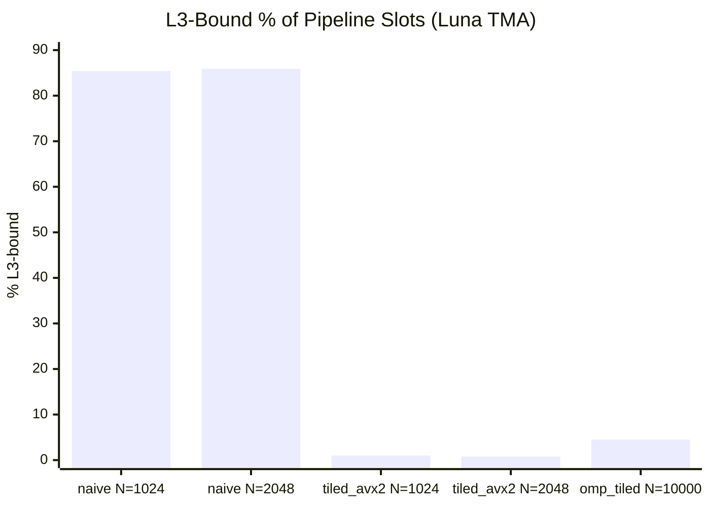
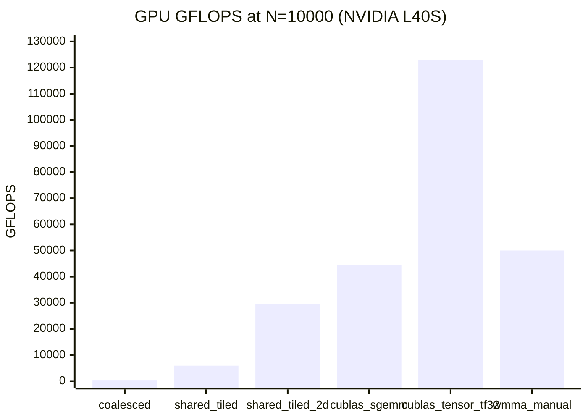
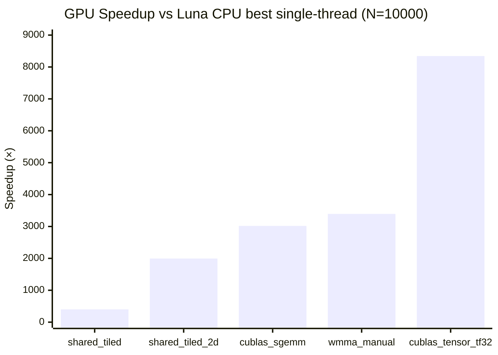
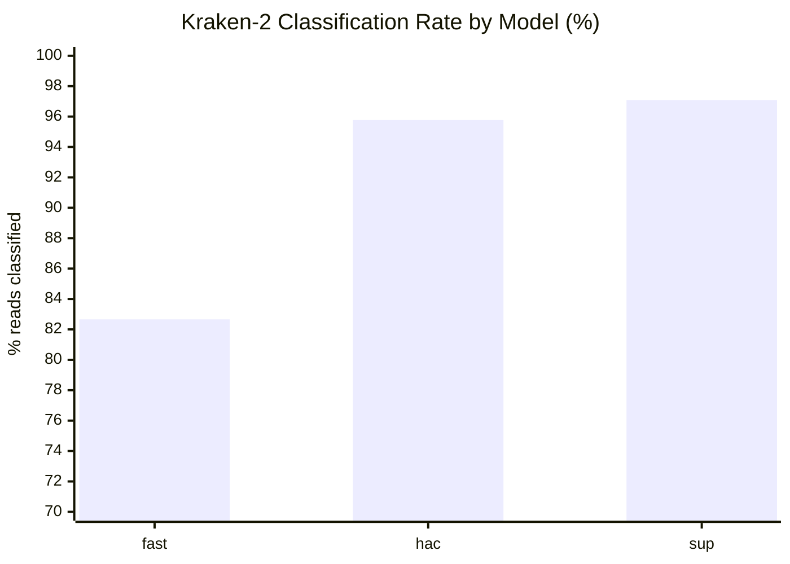
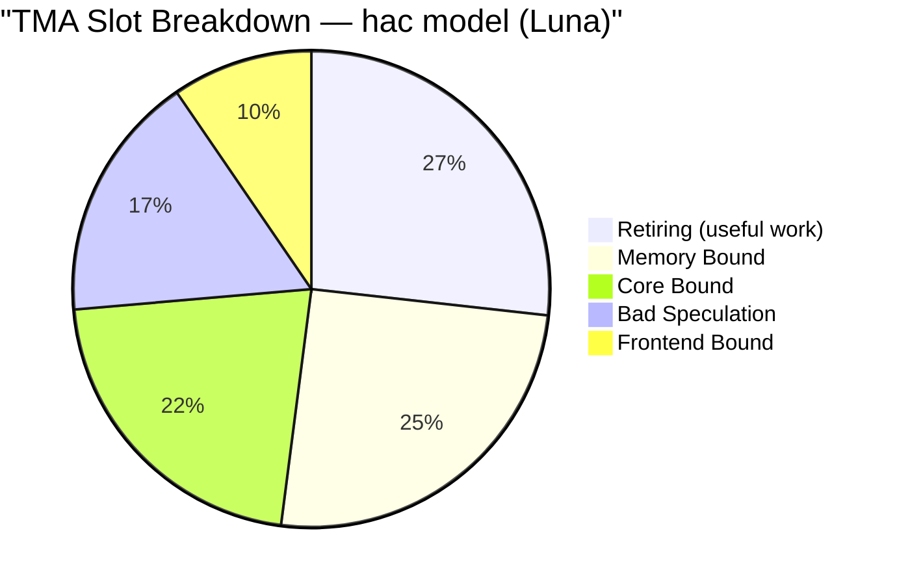
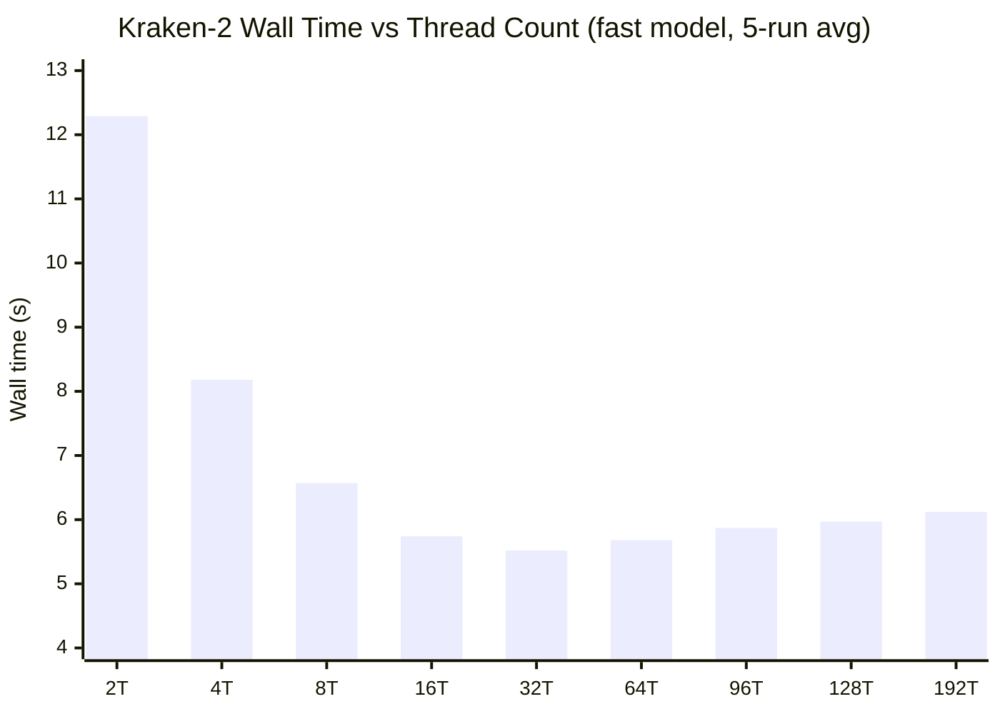
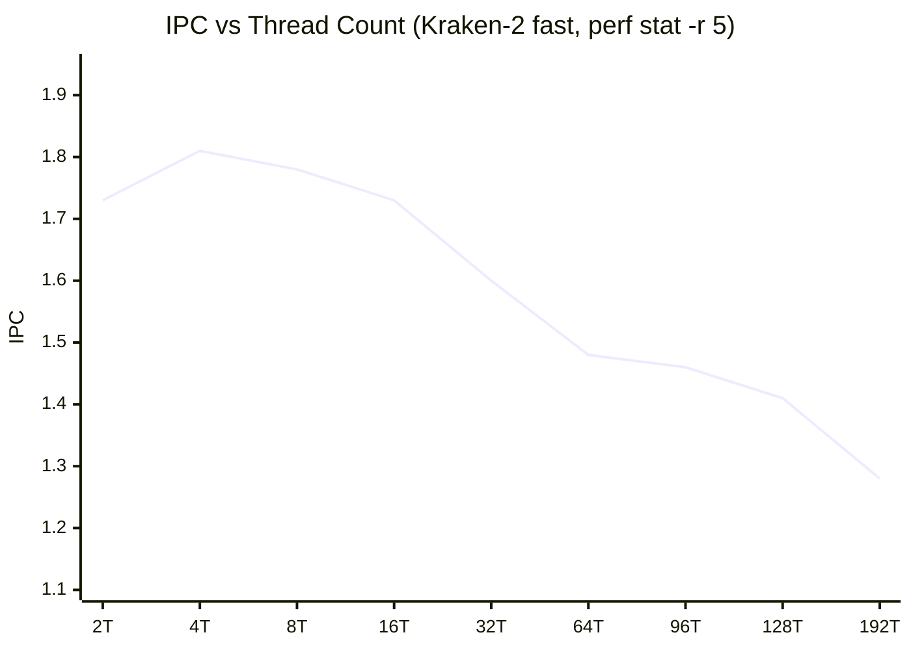
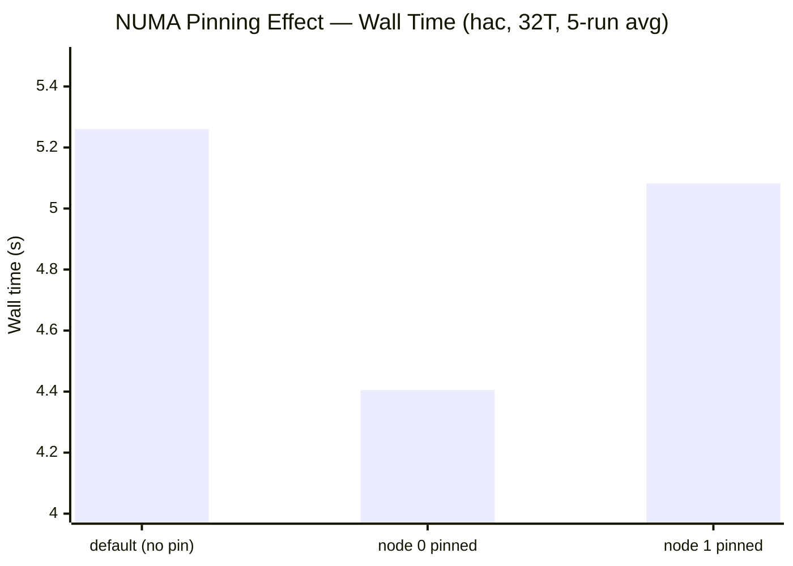

# nanopore pipeline — ESKAPE pathogen profiling

**chirag kathpalia** | MTech CSE, IIT Delhi | research project under Prof. Kolin Paul

---

## what this project is about

Making a clinical diagnostic pipeline faster and less memory-hungry. The pipeline identifies antibiotic-resistant ESKAPE pathogens from patient DNA samples. Two bottlenecks: GPU basecalling (dorado) and CPU classification (kraken2). The goal is to profile both deeply, find exactly where time goes, and build optimised caching layers targeting the bottlenecks.

```
patient sample (blood / swab)
        ↓  DNA extraction + adapter ligation (wet lab)
flow cell → POD-5 file (raw electrical signal, GBs)
        ↓  dorado (GPU, transformer neural network basecaller)
BAM files (one per patient barcode — ATGC reads)
        ↓  samtools (format conversion)
FASTQ files
        ↓  kraken-2 (CPU, k-mer hash lookup against 8 GB database)
species report → "patient has Pseudomonas aeruginosa"
```

- **dorado** decodes raw nanopore current signals into ATGC via a transformer neural network. 82% of GPU time is GEMM (Tensor Cores, FP16). Can't skip it.
- **kraken2** hashes 35-base sliding windows (k-mers) and looks them up in a prebuilt database. Fast but LLC miss rate is 80–82% on the 8 GB standard DB — structural DRAM-bound.

---

## the 6 ESKAPE pathogens

| pathogen | taxon ID | why it matters |
|---|---|---|
| Enterococcus faecium | 1352 | vancomycin-resistant |
| Staphylococcus aureus | 1280 | MRSA — resists most antibiotics |
| Klebsiella pneumoniae | 573 | carbapenem-resistant (last resort drug) |
| Acinetobacter baumannii | 470 | multi-drug resistant, common in ICUs |
| Pseudomonas aeruginosa | 287 | found in our AIIMS data (barcode02) |
| Enterobacter cloacae | 550 | broad resistance, gut infections |

---

## hardware

**local machine:**

| component | spec |
|---|---|
| CPU | AMD Ryzen 7 5800H |
| RAM | 14 GB |
| GPU | NVIDIA GTX 1650, 4 GB VRAM |
| OS | Windows 11 + WSL2 (Ubuntu 24.04) |

WSL2 caveat: Hyper-V throttles the CPU cycle counter to ~7–23% of real rate. IPC is inflated 4–14×. Cache miss counts are real; IPC and stall% are not. All authoritative numbers come from Luna native hardware counters.

**lab servers and experiment machines:**

| server | CPU | cores | LLC | RAM | GPU | disk | role |
|---|---|---|---|---|---|---|---|
| **Minerva** | Xeon Gold 6330 (Ice Lake) | 56c/112t @ 2 GHz | 66 MB | 251 GB | 2× A40 (45 GB) | **100% full** | blocked — no new data |
| **Luna** | Xeon Platinum 8468 (Sapphire Rapids) | 96c/192t @ 3.8 GHz | **210 MB** | **503 GB** | **2× L40S (46 GB)** | 74% (236 GB free) | **primary** |
| **Orion** | Cortex-A78AE (Jetson AGX Orin 64 GB) | 12 cores @ ~1.7 GHz | **4 MB** | 64 GB unified | Ampere GPU | — | AccuracyDrift ARM comparison |

Luna has `perf_event_paranoid=1` — full hardware counters, TMA, all available for all users. Minerva disk is full — cannot store new data. Orion is on campus network only (jetsonagx@10.154.233.173).

→ side-by-side comparison: [docs/Luna_vs_Minerva.md](docs/Luna_vs_Minerva.md)  
→ Orion machine notes: [AccuracyDrift/README.md](AccuracyDrift/README.md)

---

## 1. full pipeline run on real AIIMS data

input: `FBE01990_24778b97_03e50f91_10.pod5` — 4 GB, 104,478+ reads from 12 barcodes (12 patient samples), real AIIMS clinical run.

dorado benchmarked in all 3 modes:

| mode | time (Colab T4) | time (GTX 1650) | classification rate |
|---|---|---|---|
| fast | 3 min 58s | ~5 min | 82.66% |
| hac | 19 min 8s | ~71 min | 95.77% |
| sup | 2h 5min | OOM | 97.09% |

hac is the clinical sweet spot. fast→hac gains 13 pp classification; hac→sup gains only 1.3 pp at 6× the compute cost.

barcodes classified against custom ESKAPE DB:
- barcodes 01–07: Pseudomonas aeruginosa
- barcodes 09–12: Klebsiella pneumoniae + Enterococcus faecium (mixed)
- barcode 13: Enterococcus faecium
- barcode 14: mixed

---

## 2. custom ESKAPE kraken2 database

standard kraken2 DB = 180 GB. built a 650 MB custom DB with only the 6 ESKAPE reference genomes — 277× compression. runs on Colab free tier. builds in ~30 seconds. scripts in `scripts/`.

---

## 3. dorado GPU profile (GTX 1650, fast mode, Nsight Systems)

| metric | value |
|---|---|
| GEMM % of GPU time | **82%** (Tensor Cores, FP16 — 68.5% from 128×64 kernel + 13.5% from 128×128) |
| cudaStreamSynchronize % of CUDA API time | **98.9%** (27,283 calls, avg 56.6 ms — CPU idle while GPU works) |
| H2D transfer | minor — GPU is compute-bound, not memory-starved |
| verdict | compute-bound — the transformer neural network is the bottleneck |

a Signal-to-Base (S2B) cache skipping the NN forward pass for similar signal windows at 30% hit rate would save ~25% of total GPU time. cache lookup must happen GPU-side in CUDA shared memory and be faster than one GEMM call (~19.6 ms avg).

Dorado profiling on Luna L40S (nsys + ncu) is pending — Step 13.

→ full narrative: [docs/archive/report.md](docs/archive/report.md) | template: [Luna/profiling/results_dorado.md](Luna/profiling/results_dorado.md)

---

## 4. matrix multiply benchmark suite

built 12 CPU implementations and 7 GPU CUDA kernels to empirically study how cache access patterns, vectorisation, and parallelism interact on real hardware across 3 platforms.

→ full CPU report: [Luna/profiling/matmul/report/REPORT.md](Luna/profiling/matmul/report/REPORT.md) | WSL2 data: [All_Matric_Mul_perf_stats/PERF_REPORT.md](All_Matric_Mul_perf_stats/PERF_REPORT.md)

### 4a. CPU variants

12 double-precision implementations tested at N = 1024, 2048, 10000 on WSL2 and Luna.

**WSL2 wall time (N=1024, best to worst):**

| variant | time (ms) | vs naive | strategy |
|---|---|---|---|
| `naive_ijk` | 9,961 | 1× | worst — sequential column access, every load L3 miss |
| `tiled_avx2` | 335 | **29.7×** faster | tiles in L2, AVX2 FMA — best single-thread at N=1024 |
| `avx2_manual` | 324 | 30.7× faster | — |
| `omp_tiled` | 579 | — | best overall at N=10000 (2.4 GB set) |
| `prefetch_ikj` | 961 | **9.3× more insns** than ikj_order, 2.2× **slower** | software prefetch hurts sequential access |

**gap grows with N:** naive_ijk is **29.7× slower** at N=1024, **48.2× slower** at N=2048 vs tiled_avx2. The tiling advantage compounds as the working set grows.

**Luna CPU N=10000 (single-thread, authoritative):**

| variant | Luna time (s) | IPC | L3 miss rate |
|---|---|---|---|
| `naive_ijk` | >4 hours (projected) | — | — |
| `tiled` | **135.7** | 2.22 | 32.3% |
| `tiled_avx2` | 168.4 | 3.20 | 14.4% |
| `ikj_order` | 552.1 | 0.36 | 92.3% |

### 4b. Luna TMA — the real microarchitecture story



**85.4% of naive_ijk pipeline slots stall on L3 misses.** Tiling drops this to 0.8–1.0% — tiles fit in L2, L3 is almost never touched. ILP doubles from 3.6 → 8.0+ (Sapphire Rapids' 8 uop/cycle saturation).

| variant | L3-bound % | ILP | verdict |
|---|---|---|---|
| naive_ijk | **85.4%** | 3.6 | memory-bound — L3 latency dominates |
| tiled_avx2 | **0.8–1.0%** | 8.0+ | FMA-bound — pipeline fully saturated |
| omp_tiled N=10000 | 4.5% | — | DRAM-bound — 4 threads saturate the bus |

### 4c. Luna GPU — L40S Ada Lovelace

7 CUDA variants at N = 1024, 2048, 4096, 10000. Single precision (FP32/TF32/FP16).

| variant | N=10000 time (ms) | GFLOPS | % of dense peak | notes |
|---|---|---|---|---|
| `coalesced_gpu` | 5,209 | 384 | low | **slower than naive** — 1D block kills SM occupancy |
| `naive_gpu` | — (skipped) | ~5,600 | — | ~24s at N=4096 |
| `shared_tiled` | 338 | 5,915 | 6.5% FP32 | shared memory tiling |
| `shared_tiled_2d` | 68 | 29,399 | **32% FP32** | register blocking + 2D tiles |
| `wmma_manual_fp16` | 40 | 50,001 | **14% FP16** | manual Tensor Cores — cuBLAS 3× faster |
| `cublas_sgemm` | 45 | 44,475 | **49% FP32** | vendor FP32 library |
| `cublas_tensor_tf32` | **16.27** | **122,923** | **67% TF32** | **peak: 123 TFLOPS** |

L40S theoretical peaks (dense): 91.6 TFLOPS FP32 · 183 TFLOPS TF32 · 362 TFLOPS FP16.



### 4d. GPU vs CPU speedup (N=10000)

vs Luna CPU best single-thread (tiled, 135.7 s):



`cublas_tensor_tf32` is **~8,342×** faster than the best CPU single-thread implementation. Even the worst non-naive GPU variant (coalesced, 5,209 ms) beats CPU by ~26×. Dense linalg is four orders of magnitude better on GPU.

### 4e. key lessons for kraken2

| property | dense matmul | kraken2 lookup |
|---|---|---|
| access pattern | sequential, predictable | random pointer chasing |
| working set | fits in cache with tiling | 8 GB DB >> any cache |
| SIMD/GPU port? | **8,300× GPU speedup** | <2× even in research papers |
| software prefetch | **hurts** — HW already handles sequential | **helps** — HW can't predict random |

this is why the NN-prefetcher targets the only meaningful axis: learning to predict otherwise-unpredictable probe slots. `prefetch_ikj`'s negative result proves the argument — prefetch hurts when access is regular, and helps when it's irregular. matmul is regular. kraken2 isn't.

---

## 5. lab server access + documentation

both servers fully documented with user guides, install procedures, and profiling results.

→ Luna: [Luna/](Luna/) | Minerva: [Minerva/](Minerva/)

---

## 6. kraken2 profiling: Luna (Steps 1–51+)

input: standard 8 GB DB (`k2_standard_08gb_20240112`), 104,918 reads (hac FASTQ), Luna with `perf_event_paranoid=1`.

→ complete data tables: [Luna/profiling/results_kraken2.md](Luna/profiling/results_kraken2.md)

### 6a. classification rates



fast→hac: +13 pp. hac→sup: +1.3 pp at 6× the compute cost. hac is the clinical sweet spot.

### 6b. perf stat: all 3 models (96 threads)

| metric | fast | hac | sup |
|---|---|---|---|
| IPC | 1.47 | **1.58** | **1.65** |
| LLC miss rate | 82.0% | 81.9% | 82.0% |
| stall % | **51.8%** | 48.7% | 48.5% |
| DRAM stalls (B cycles) | **11.3B** | 8.34B | 9.26B |
| wall time | 5.84s | 5.0s | 5.63s |

LLC miss rate is 80–82% regardless of model — the 8 GB DB is 38× the 210 MB L3. structural. no thread count or NUMA fix will change the miss rate. IPC of 1.47–1.65 against theoretical max of ~6 = CPU at 24–27% efficiency.

### 6c. TMA breakdown (hac model)



only 26.9% of pipeline slots do real work. memory + core bound = 47%. bad speculation = 16.9% (1 in 6 slots squashed). all 3 models have nearly identical TMA profiles — bottleneck is the DB size, not read quality.

### 6d. thread scaling (fast model, 5-run avg)



floor is ~5.5s no matter how many threads. kraken2 classification time drops 7.4s→0.72s (10× speedup) from 2T→32T — the actual work parallelises well. but ~4.8s of DB mmap page-fault overhead is single-threaded and unavoidable. beyond 32T: contention and cache thrashing push time back up.



IPC peaks at 4T (1.81) then falls to 1.28 at 192T — a 29% drop. more threads = more lock contention + cache line thrashing. at 192T each thread does less useful work per cycle than at 4T despite using 48× more hardware.

stall % rises from 42% at 4T to 56% at 192T. DRAM stall cycles plateau at ~11B from 8T — bandwidth is saturated by 8 threads and extra threads can't get more of it.

**optimal: 32 threads for all 3 models.**

### 6e. flamegraph (perf, not gprof) — gprof was wrong

ran `perf record -g -F 99` on hac at 32T — first full-stack profile, captures kernel + I/O.


(I/O and page fault shares are approximate from flamegraph sampling; exact fractions vary run to run.)

**gprof's 67% claim for CompactHashTable::Get was a denominator error.** gprof only counts user-space time; its denominator excludes all kernel/I/O time. the real #1 hotspot is MinimizerScanner::NextMinimizer at 25.57%.

| tool | platform | CompactHashTable | MinimizerScanner |
|---|---|---|---|
| gprof (WSL2, ESKAPE DB) | user-space only | **67%** | not reported |
| gprof (Luna 1T, 8 GB DB) | user-space only | **23.23%** | **53.35%** |
| perf flamegraph (Luna 32T) | **full wall time** | **12.10%** | **25.57%** |

cross-validation: gprof 23.23% × 18.6s user = 2.43s = **10.6% of 22.8s wall** — matches flamegraph exactly. the tools agree once you account for the denominator.

→ flamegraph SVG: [Luna/profiling/flamegraph_hac_32t.svg](Luna/profiling/flamegraph_hac_32t.svg)

### 6f. NUMA analysis (Step 7–9)

luna has 2 physical CPU sockets. local DRAM cost = distance 10, cross-socket = distance 21 (2.1× penalty). DB loads into node 0's RAM on first use.



node 0 pinning saves **16.3%** wall time with zero code changes.

what changes at the hardware counter level:

| metric | cross-socket (default) | node 0 local | change |
|---|---|---|---|
| IPC | 1.58–1.62 | **1.86** | +17.7% |
| DRAM stall cycles | ~12.2B | **6.44B** | −47% |
| memory_bound % | ~31.7% | **23.9%** | −7.8 pp |
| LLC miss rate | 82–83% | **83.1%** | unchanged |

LLC miss rate stays ~82% regardless of NUMA config — pinning reduces miss **latency**, not miss **count**. the root cause (DB >> L3) is structural.

→ full NUMA data: [Luna/profiling/results_kraken2.md § Step 7–9](Luna/profiling/results_kraken2.md)

### 6g. gprof on Luna: 3-way comparison closes the loop (Step 10)

recompiled kraken2 with `-pg`, ran 1T (clean, comparable) and 32T (partial).

**gprof 1T flat profile (user-space only):**

| % time | calls | function |
|---|---|---|
| **53.35%** | 351,893,601 | MinimizerScanner::NextMinimizer |
| **23.23%** | 11,634,763 | CompactHashTable::Get |
| 7.27% | — | ClassifySequence |
| 6.69% | 352,208,243 | reverse_complement |

**why WSL2 gprof showed 67% but Luna gprof shows 23.23% for Get():**
- different database (650 MB ESKAPE vs 8 GB standard) — different proportion of work per read
- different CPU speed — Xeon 8468 runs MinimizerScanner faster in absolute terms, making it proportionally larger

**why gprof Luna (23.23%) differs from perf Luna (12.10%):**
different denominator — gprof uses user-space time (18.6s), perf uses wall time (22.8s). scaled: 23.23% × 18.6s = 2.43s = 10.6% of wall time. consistent.

### 6h. valgrind cachegrind: per-function DRAM attribution (Step 11)

ran `valgrind --tool=cachegrind --trace-children=yes` at 1T. 362s wall (~20× overhead). simulated 104 MB L3, 64B lines.

**program-wide:** 99.96B instructions, 43.88B data refs, **9.58M last-level read misses** (the 9.58M × ~100ns = ~0.96s serialised DRAM latency at 1T).

| function | instructions % | LL read miss % | meaning |
|---|---|---|---|
| MinimizerScanner::NextMinimizer | **48.23%** | **0%** | pure compute — zero DRAM reads |
| reverse_complement | 11.63% | **0%** | pure compute |
| **CompactHashTable::Get** | **0.65%** | **96.24%** | owns virtually all DRAM reads |
| ClassifySequence | 11.51% | 0.00% | orchestration |
| AddHitlistString | 4.28% | 0.08% | output |
| memset/memmove | ~5.6% | ~39-57% | buffer ops |

**CompactHashTable::Get executes 0.65% of all instructions but generates 96.24% of all last-level cache read misses.** every other function combined causes 3.76% of DRAM reads.

why: the hash table is 8 GB. L3 is 104 MB. ratio = 77:1. with 104,918 reads × ~11 minimizers each, and the DB 77× too large, virtually every lookup is a cold DRAM access.

this splits the picture cleanly:
- **MinimizerScanner** (48% of instructions): CPU-bound, compute-limited, zero DRAM. target for SIMD.
- **CompactHashTable::Get** (0.65% of instructions): memory-bound, 96% of DRAM. target for LRU cache.

→ full cachegrind analysis: [Luna/profiling/results_kraken2.md § Step 11](Luna/profiling/results_kraken2.md)

### 6i. FASTQ on tmpfs — no benefit (Step 12)

hypothesis: the flamegraph's ~20% I/O tower is disk I/O. copying FASTQ to `/dev/shm` would eliminate ext4 and save ~0.88s.

result: **no benefit** (−0.010s, noise).

| config | wall time |
|---|---|
| SSD warm (baseline) | 4.405s |
| tmpfs warm | 4.395s (−0.2%, noise) |
| cold SSD (after drop_caches) | 10.894s (+6.49s) |

why: luna has 503 GB RAM. the 703 MB FASTQ has been in the OS page cache since the first run and was never evicted. the SSD baseline was already reading from DRAM. the flamegraph's I/O tower is `copy_page_to_iter` — a memory-to-memory copy from page cache to process buffer that exists regardless of filesystem. eliminating it requires mmap() or O_DIRECT (both need Kraken2 source changes).

→ full write-up: [Luna/experiments/tmpfs_fastq/README.md](Luna/experiments/tmpfs_fastq/README.md)

### 6j. cumulative optimisation ladder (zero code changes)

| step | change | wall time | cumulative saving |
|---|---|---|---|
| baseline | 96T, no pinning | 5.635s | — |
| thread scaling | 32 threads | 5.235s | −7.1% |
| NUMA pinning | + numactl node 0 | **4.405s** | **−21.8%** |

best run command for all future profiling:
```bash
numactl --cpunodebind=0 --membind=0 \
  kraken2 --db ~/data/kraken2_db --threads 32 \
  --report report.txt --output /dev/null reads.fastq
```

---

## 7. WSL2 vs Luna — what Luna corrected

| metric | WSL2 | Luna | what it means |
|---|---|---|---|
| IPC | 2.26 (wrong, Hyper-V) | **1.47–1.65** | CPU at 24–27% efficiency |
| LLC miss rate | not supported | **80–82%** | every lookup goes to DRAM |
| stall % | not available | **42–56%** | half the cycles are wasted |
| TMA memory_bound | not available | **25–28%** | memory is bottleneck #1 |
| optimal threads | unknown | **32** (not 96) | 64 threads were wasted |
| DRAM saturation point | unknown | **8 threads** | extra threads don't get more bandwidth |
| top hotspot (gprof) | CompactHashTable::Get **67%** | MinimizerScanner **25.57%**, I/O **~20%**, Get **12.10%** | gprof was blind to kernel |

---

## 8. kraken2 optimisation design: 10 patches

baseline: **4.405s**. target: ≤ 2.6s (−41%).

| patch | mechanism | independent Δ | cumulative |
|---|---|---:|---:|
| 3 — compile flags | `-march=sapphirerapids -flto -funroll-loops` | −8% | 4.05s |
| 2 — huge pages | `MADV_HUGEPAGE` on DB mmap, reduces dTLB misses | −5% | 3.85s |
| 1 — probe prefetch | `__builtin_prefetch` one cache line ahead in Get() loop | −10% | 3.47s |
| 4 — thread-local LRU | 16K-entry direct-mapped cache (256 KB, fits L2), Fibonacci hash | −20% | 2.77s |
| 6 — devirtualise | `final` on Get() + concrete dispatch, drops vtable hop | −3% | 2.69s |
| 7 — single MurmurHash | `GetByHash` overload reuses hash between skip check + lookup | −2% | 2.66s |
| 8 — ResolveTree O(N²→N) | precompute ancestor sets, drops quadratic walk per read | −4% | 2.55s |
| 9 — skip /dev/null output | no ostringstream work when output is suppressed | −1.5% | 2.51s |
| 10 — batched Get() | gather N minimizers, issue all N prefetches then resolve all N | speculative | TBD |

**v1 target (Patches 1–5):** ≤ 3.0s (−32%). **v2 stretch (+ Patches 6–9):** ≤ 2.6s (−41%).

**Patch 4** (thread-local LRU cache) is Kolin sir's design: clinical samples have dominant species — the same k-mers repeat heavily across reads. cachegrind confirms 5.62M DRAM reads at 1T from CompactHashTable::Get. at 20% hit rate on 32T that's ~36M fewer DRAM lookups per run. each hit saves ~100 ns. the cache (16K entries × 16 bytes = 256 KB) fits entirely in L2 per core on Sapphire Rapids — no DRAM pressure from the cache itself.

patch 1 (`__builtin_prefetch`) is already implemented. see `Luna/experiments/kraken2_opt_v1.patch`.

stop rule: two consecutive patches each < 2% delta → diminishing returns, stop.

→ v1 patches (source-verified): [docs/reports/kraken2_get_optimizations.md](docs/reports/kraken2_get_optimizations.md)
→ v2 patches: [docs/reports/kraken2_get_optimizations_v2.md](docs/reports/kraken2_get_optimizations_v2.md)
→ optimisation report: [docs/reports/kraken2_optimisation_report.md](docs/reports/kraken2_optimisation_report.md)

---

## 9. neural prefetcher direction

Kolin sir's broader proposal: replace the static `__builtin_prefetch` in Patch 1 with a mini neural network that learns to predict which hash bucket will be accessed next.

CompactHashTable::Get starts a probe at `MurmurHash3(k-mer) % capacity`. the probe position is determined by the k-mer value — not predictable by the hardware prefetcher. a learned model observing the sequence of k-mer hashes could predict the next starting slot.

target accuracy: 60–70% correct prefetches. at 60%, most of the 5.62M DRAM stalls on the first probe of each Get() are eliminated. the predictor must be cheaper than the ~100 ns DRAM stall it's hiding.

current state: Patch 1 (`__builtin_prefetch`, prefetches the next cache line in the probe chain) is designed and patch-ready. the NN predictor is the next evolution — it predicts the starting bucket rather than just the next probe step.

the matmul `prefetch_ikj` negative result validates the argument: **prefetch hurts regular access, helps irregular access**. matmul B-row access is stride-1 (hardware handles it). kraken2 hash table access is random (hardware can't predict it). NN-guided prefetch is the only lever left.

---

## 10. AccuracyDrift experiment (2026-05-30 to 2026-06-13)

Systematic sweep: reads_hac + reads_sup × 5 databases × all thread counts (1T through 96T on Luna, 1T through 12T on Orion). Gold-standard ceiling established via AccuracyChase (PlusPF 103 GB cold run on Luna).

Three behavioral classes emerged:

| Class | DBs | Bottleneck | Peak thread speedup |
|---|---|---|---|
| Pre-cliff (DB fits in LLC) | sample_targeted 50 MB | DRAM latency, near-linear scaling | ~22× at 64T |
| Post-cliff (DB > LLC, < Amdahl wall) | eskape_650mb 142 MB, eskape_human_4gb 3.8 GB | DRAM bandwidth | 10–22× |
| Amdahl-limited (DB load serial) | standard_8gb, standard_16gb | Single-threaded DB mmap load | 3–4× |

Cache cliff on Luna: between 50 MB and 142 MB (LLC is 210 MB but hash table random-access pattern exceeds effective cache capacity in that range).

Orion (ARM64 Jetson AGX, 12 cores, 4 MB LLC): every DB in the experiment is post-cliff — even the 50 MB DB gives 78.92% LLC miss rate vs 10.19% on Luna. 2.41× slower than Luna at 1T; ~70–80% of that gap is explained by LLC miss rate difference alone.

AccuracyChase: PlusPF 103 GB DB cold run on Luna establishes the gold-standard accuracy ceiling. Fully documented in `AccuracyDrift/AccuracyChase.md`.

→ full results: [AccuracyDrift/RESULTS.md](AccuracyDrift/RESULTS.md)  
→ observations and analysis: [AccuracyDrift/OBSERVATIONS.md](AccuracyDrift/OBSERVATIONS.md)  
→ run commands: [AccuracyDrift/COMMANDS.md](AccuracyDrift/COMMANDS.md)  
→ AccuracyChase: [AccuracyDrift/AccuracyChase.md](AccuracyDrift/AccuracyChase.md)

---

## 11. what's next

**Summer 2026 direction (set Meeting 4, 2026-05-28): Kraken2 optimisation only. Dorado/GPU work deprioritised.**

Dorado GPU profiling on L40S (Step 13) is on hold. All effort goes to Kraken2 source patches.

**pre-implementation measurements (M1–M7) — gate which patches apply:**
- M1: CompactHashTable cell type (8-byte or 16-byte entries — affects prefetch stride)
- M2: load factor (hash table fill ratio — affects probe chain length)
- M3: dTLB miss rate (do huge pages help?)
- M4: DRAM bandwidth utilisation vs IMC peak
- M5: k-mer reuse rate (validate LRU cache ROI on reads_hac.fastq)
- M6: `perf c2c` — cache-to-cache false sharing (explains IPC drop past 32T)
- M7: instruction mix — is MinimizerScanner auto-vectorised? (`objdump`)

→ tracked in: [Luna/experiments/pending_measurements.md](Luna/experiments/pending_measurements.md)

**implementation order:**
- apply Patch 3 (compile flags) → measure → Patch 2 (huge pages) → measure → Patch 1 (prefetch) → measure → Patch 4 (LRU)
- always run at **32T + numactl node0** (21.8% already free — baseline is 4.405s)

**not yet started:** Minerva runs, Lab Desktop runs.

**AMX matmul (Luna-exclusive, lower priority):**
- Xeon Platinum 8468 has Intel AMX (Advanced Matrix Extensions) — hardware tile matrix multiply
- compare AMX vs tiled_avx2 vs cublas_tensor_tf32 on L40S

---

## repo structure

```
├── README.md                          ← this file
├── AccuracyDrift/                     ← accuracy vs DB size × threads × machines experiment
│   ├── README.md                      ← setup, databases, machine list
│   ├── RESULTS.md                     ← all measured data (classified%, LLC miss rate, time)
│   ├── OBSERVATIONS.md               ← analysis: 3 behavioral classes, cache cliff, Orion comparison
│   ├── COMMANDS.md                    ← exact commands run on each machine
│   └── AccuracyChase.md               ← PlusPF 103 GB gold-standard ceiling (Luna, cold runs)
├── docs/
│   ├── plan.md                        ← research plan
│   ├── updates.md                     ← chronological session log
│   ├── meeting_minutes.md             ← notes from meetings with Kolin sir
│   ├── knowledge_base.md              ← deep-dive notes on everything (§0–§21)
│   ├── Luna_vs_Minerva.md             ← side-by-side hardware comparison
│   └── reports/
│       ├── final_report.md            ← consolidated meeting-ready report (snapshot: 2026-05-28)
│       ├── summary.md                 ← quick reference
│       ├── tables_and_graphs.md       ← all stats with Mermaid charts
│       ├── tables_and_graphs_basic.md ← same, plain ASCII bars
│       ├── kraken2_optimisation_report.md
│       ├── kraken2_get_optimizations.md    ← v1 patches 1–5 (source-verified)
│       ├── kraken2_get_optimizations_v2.md ← v2 patches 6–10
│       └── kraken2_execution_checklist.md
├── All_Matric_Mul_perf_stats/         ← matrix multiply benchmark suite (WSL2 perf stat)
│   ├── PERF_REPORT.md                 ← WSL2 results: N=1024/2048/10000, 22 result files
│   ├── README.md
│   ├── Makefile
│   ├── *.c                            ← 12 CPU implementations
│   └── perf_results/N10000/           ← raw perf stat output
├── Luna/                              ← Luna server docs + profiling
│   ├── luna_stats.md                  ← CPU/RAM/GPU/disk/tool inventory
│   ├── install_tools.md
│   ├── user_guide.md
│   ├── bash_history.md
│   ├── experiments/
│   │   ├── kraken2_opt_v1.patch       ← Patches 1–4 implementation
│   │   ├── run_kraken2_opt_v1.sh
│   │   ├── pending_measurements.md
│   │   └── tmpfs_fastq/README.md      ← Step 12 experiment write-up
│   └── profiling/
│       ├── plan.md
│       ├── results_kraken2.md         ← full Luna profiling data (Steps 1–12)
│       ├── results_matmul_luna.md     ← Luna CPU matmul results
│       ├── results_dorado.md          ← blank — Step 13 pending
│       ├── flamegraph_hac_32t.svg     ← perf flamegraph (hac, 32T)
│       ├── amd_uprof/                 ← AMD uProf session outputs
│       ├── matmul/
│       │   ├── report/REPORT.md       ← full matmul CPU+GPU analysis with 11 graphs
│       │   ├── perf_results_luna/     ← raw perf stat (N=1024/2048/10000 + TMA + cache)
│       │   └── *.sh                   ← run scripts
│       └── matmul_gpu_bundle/
│           ├── README.md
│           ├── *.cu                   ← 7 CUDA kernels
│           ├── timing.log             ← all GPU timing results
│           └── gpu_results/ncu/       ← NCU profiling summaries
├── Minerva/                           ← Minerva server docs
│   ├── minerva_stats.md
│   ├── install_tools.md
│   └── profiling/
│       ├── plan.md
│       ├── results_kraken2.md         ← template (not yet run — disk full)
│       └── results_dorado.md
├── WSL2/kraken2/                      ← WSL2 baseline profiling data
│   ├── kraken2_report.txt
│   ├── kraken2_report_perf.txt
│   ├── kraken2_report_cg.txt
│   └── gprof_report.txt
├── scripts/                           ← ESKAPE DB build scripts
│   ├── tag_genomes.py
│   ├── fix_seqid_map.py
│   └── fix_prelim_maps.py
└── results/                           ← pipeline output data (BAM, nsys traces)
    ├── fast/                          ← BAM per barcode (fast model)
    ├── hac/                           ← BAM per barcode (hac model)
    └── nsight/                        ← Nsight Systems .nsys-rep + .sqlite
```

---

## colab notebook

full pipeline run (dorado fast/hac/sup + kraken-2 classification for all barcodes):  
https://colab.research.google.com/drive/1mj3lRxxIFS_qCeStrXszhIYHlJ2Z36bw?usp=sharing
