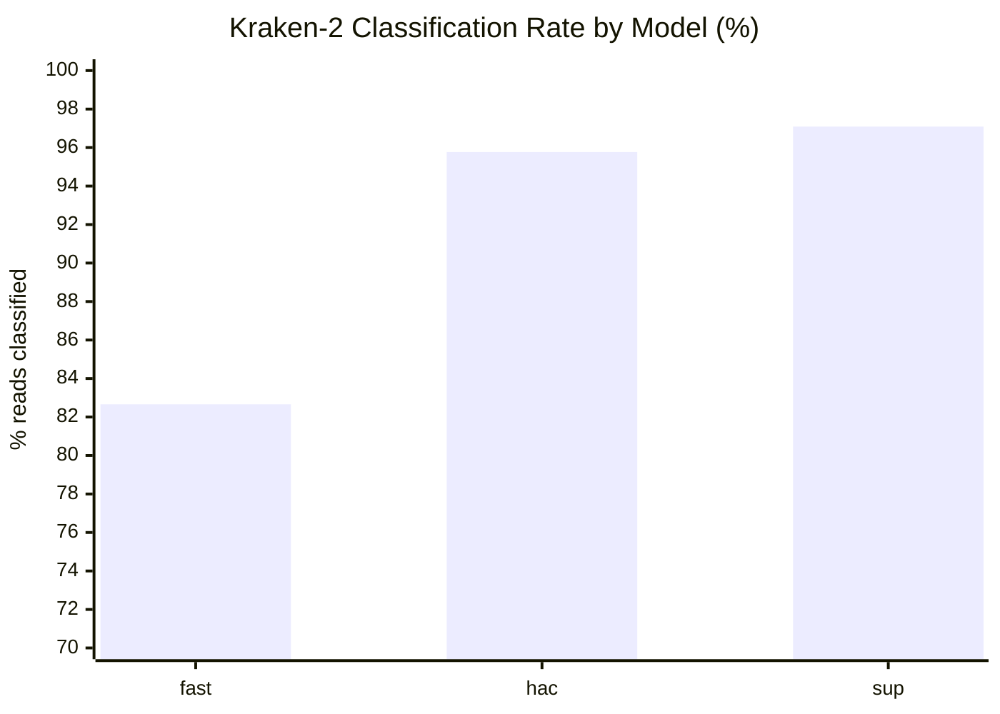
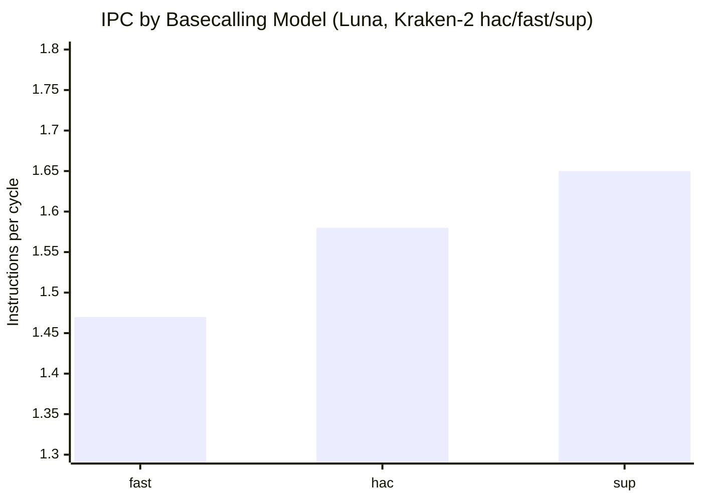
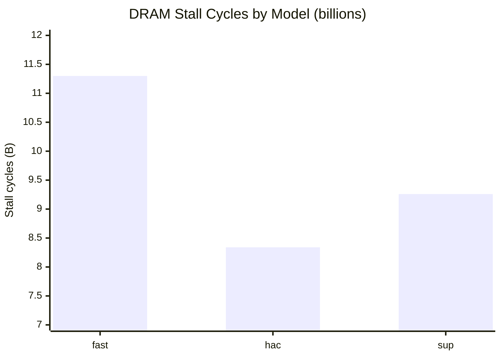
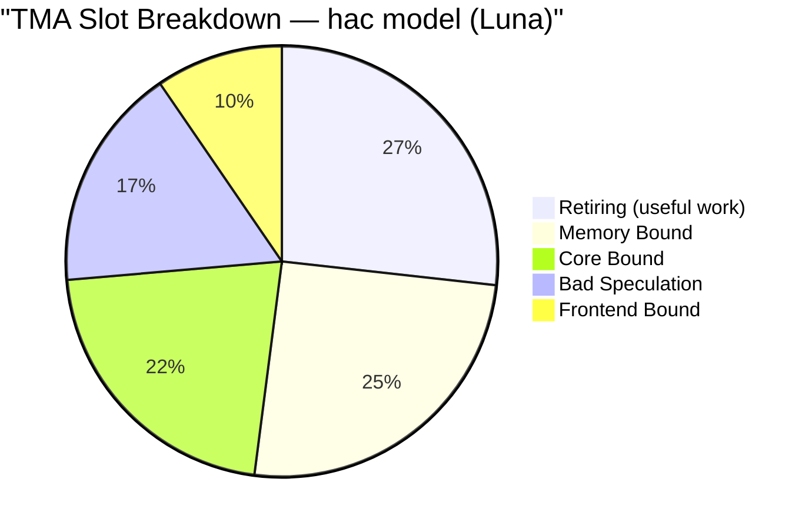
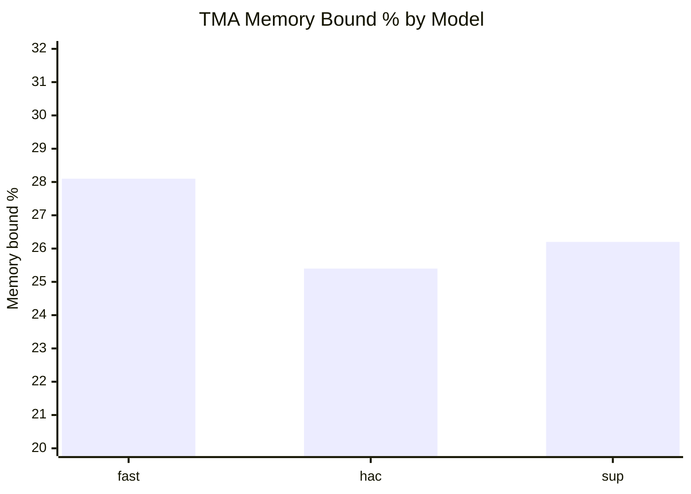
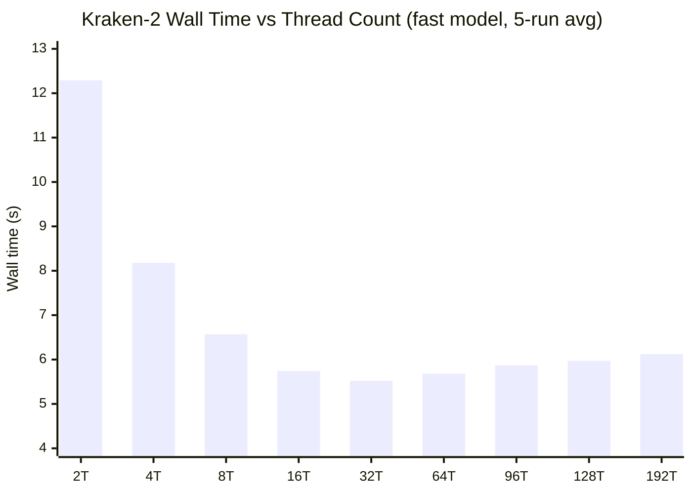
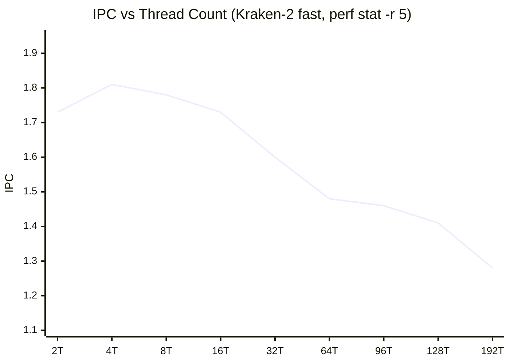
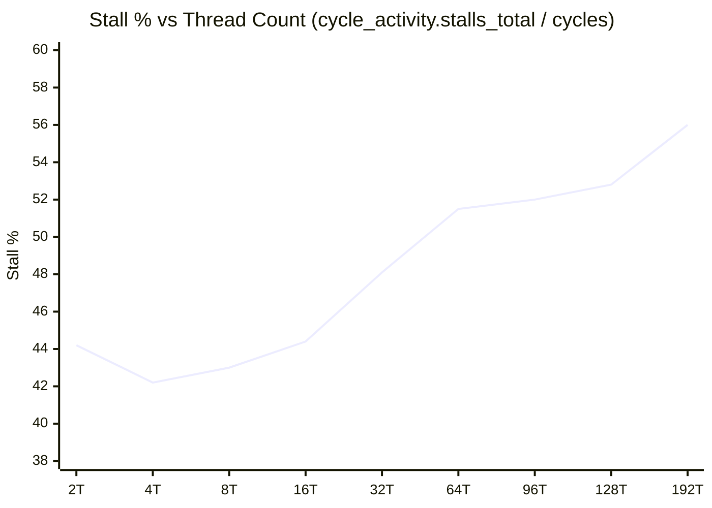
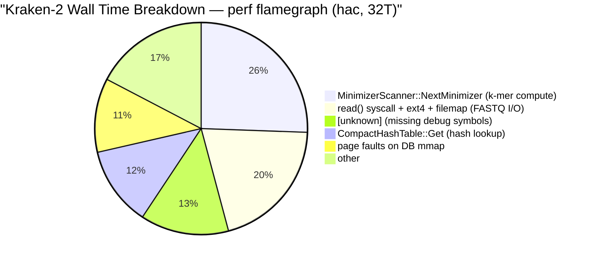
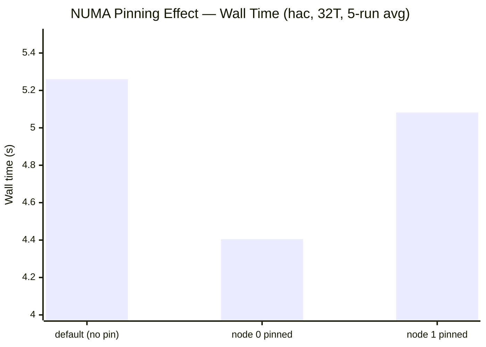

# nanopore pipeline — ESKAPE pathogen profiling

**chirag kathpalia** | research project under Prof. Kolin Paul

---

## what this project is about

i'm working on making a clinical diagnostic pipeline faster and less memory-hungry.

the pipeline identifies dangerous antibiotic-resistant bacteria (ESKAPE pathogens) from patient DNA samples. it currently works but has two big bottlenecks — one in the GPU basecalling step and one in the CPU classification step. my job is to profile both, find exactly where time is going, and build a caching layer that targets the bottlenecks.

the pipeline looks like this:

```
patient sample (blood / swab)
        ↓  DNA extraction + adapter ligation (wet lab)
flow cell → POD-5 file (raw electrical signal, GBs)
        ↓  dorado (GPU, neural network basecaller)
BAM files (one per patient barcode — ATGC reads)
        ↓  samtools (format conversion)
FASTQ files
        ↓  kraken-2 (CPU, k-mer hash lookup)
species report → "patient has Pseudomonas aeruginosa"
```

why these tools:
- **dorado** — the sequencer outputs raw current readings (squiggles). dorado runs a transformer neural network to decode those into ATGC letters. can't skip it.
- **kraken-2** — instead of aligning every read to every genome (too slow), it hashes 35-letter windows (k-mers) and looks them up in a prebuilt database. fast but memory-intensive.

---

## the 6 ESKAPE pathogens

these are the bacteria this pipeline is built to detect. each one is dangerous because it resists most or all available antibiotics.

| pathogen | taxon ID | why it matters |
|---|---|---|
| Enterococcus faecium | 1352 | vancomycin-resistant |
| Staphylococcus aureus | 1280 | MRSA — resists most antibiotics |
| Klebsiella pneumoniae | 573 | carbapenem-resistant (last resort drug) |
| Acinetobacter baumannii | 470 | multi-drug resistant, common in ICUs |
| Pseudomonas aeruginosa | 287 | found in our AIIMS data (barcode02) |
| Enterobacter cloacae | 550 | broad resistance, gut infections |

---

## what i've done so far

### 1. ran the full pipeline on real AIIMS patient data

the input was `FBE01990_24778b97_03e50f91_10.pod5` — 4 GB, 104,478 reads from 12 barcodes (12 patient samples), from an AIIMS run. real clinical data.

ran dorado in all 3 modes to benchmark speed vs accuracy:

| mode | time (colab T4) | time (GTX 1650) | accuracy gain over prev |
|---|---|---|---|
| fast | 3 min 58s | ~5 min | baseline |
| hac | 19 min 8s | ~71 min | +3–8% classified reads |
| sup | 2h 5min | OOM on GTX 1650 | +0.1–1% |

hac is the sweet spot. fast→hac gives meaningful improvement. hac→sup barely moves the needle and takes 6x longer.

classified all 14 barcodes against our custom ESKAPE DB:
- barcodes 01–07: Pseudomonas aeruginosa
- barcodes 09–12: mixed Klebsiella pneumoniae + Enterococcus faecium
- barcode 13: Enterococcus faecium
- barcode 14: mixed

### 2. built a custom ESKAPE kraken-2 database

the standard kraken-2 DB is 180 GB — doesn't fit in RAM on most edge devices. i built a 650 MB custom DB with only the 6 ESKAPE reference genomes. runs on Colab's free tier. built in ~30 seconds.

scripts for this are in `scripts/`.

### 3. profiled both pipeline stages (baseline report delivered)

**kraken-2 — 3-tool CPU profile (WSL2 + Minerva):**

| tool | result |
|---|---|
| perf stat | **34.24% cache miss rate**, 301M misses, memory-bound verdict |
| gprof | **67% of runtime in `CompactHashTable::Get()`** — 9.87M calls (later shown to be wrong — gprof misses kernel + I/O time) |
| AMD uProf | **IPC = 0.55** (accurate — perf's cycle counter unreliable in WSL2/Hyper-V) |

**dorado — Nsight Systems GPU profile (GTX 1650, fast mode):**

| metric | value |
|---|---|
| GEMM % of GPU time | **82%** (Tensor Cores, FP16) |
| cudaStreamSynchronize % of CUDA API time | **98.9%** |
| memory transfers | minor — GPU is not memory-starved |

verdict: compute-bound. full details in `docs/archive/report.md`.

### 4. matrix multiply benchmark suite (cache blocking study)

built 12 C implementations in `All_Matric_Mul_perf_stats/` to empirically study how cache access patterns and vectorisation interact with real hardware:

| key finding | detail |
|---|---|
| naive_ijk vs tiled_avx2 | **29.7× slower** at N=1024, **48.2×** at N=2048 — gap widens with N |
| omp_tiled at N=10000 | **2.1× faster than tiled_avx2** — tiling + 4 threads finally pays off at 2.4 GB working set |
| prefetch_ikj paradox | lowest L3 miss% (1.23%) but 9.3× more instructions than ikj_order — software prefetch adds overhead when hardware prefetcher already covers sequential access |
| tiled variants | sub-8× scaling (1024→2048) vs expected O(N³) 8× — tile size stays in L2 regardless of N |

full results in `All_Matric_Mul_perf_stats/PERF_REPORT.md` (N=1024/2048/10000, 22 result files).

### 5. lab server access + documentation

access to two lab servers, both fully documented:

| server | CPU | L3 | RAM | GPU | disk |
|---|---|---|---|---|---|
| **Minerva** | Xeon Gold 6330 (56c/112t @ 2GHz) | 66 MB | 251 GB | 2× A40 | **100% full** |
| **Luna** | Xeon Platinum 8468 (96c/192t @ 3.8GHz) | **210 MB** | **503 GB** | **2× L40S** | 74% (236 GB free) |

luna's `perf_event_paranoid = 1` confirmed — hardware counters (LLC-load-misses, stalled-cycles-backend, TMA) work for all users. matmul re-run on Luna will give accurate IPC for the first time.

### 6. luna — kraken-2 full profiling analysis (2026-05-29)

i ran the complete kraken-2 profiling suite on luna using real hardware counters (no Hyper-V noise). this covers all 3 basecalling models, TMA breakdown, warm vs cold cache, and a full thread scaling sweep from 2 to 192 threads with 5 runs per point.

---

#### classification rate: fast vs hac vs sup



classification jumps hard from fast→hac (+13 pp) but barely moves from hac→sup (+1.3 pp). hac is the clinical sweet spot — that's where most real pathogen k-mers show up in reads. sup adds noise-level improvement at 6× the compute cost.

---

#### ipc across models



sup has the best IPC — better reads produce k-mers that retire more useful instructions per cycle. the difference is real but modest (12%). all three sit well below the ~6 theoretical max because the bottleneck is memory, not compute.

---

#### dram stall cycles per model



fast spends the most cycles waiting on DRAM — lower-quality reads generate more diverse k-mers that miss the hash table less predictably. the root cause is identical for all three: the 8 GB database is 38× the 210 MB L3, so nearly every lookup goes to DRAM.

---

#### where cpu time goes: tma slot breakdown



only 26.9% of cpu slots are doing real work. memory + core bound together = 47% — the cpu is idle for nearly half its time. bad speculation at 16.9% means 1 in 6 slots is wasted on squashed instructions. the 8 GB hash table directly causes the memory_bound slice; there's no fix that doesn't address the database size.

---

#### tma comparison across all 3 models



fast is the most memory-bound (28.1%) — lower quality reads require more hash lookups that miss. sup has the best retiring % (27.4%) but the TMA profiles are nearly identical across all three, confirming the bottleneck is the DB, not the reads.

---

#### thread scaling: wall time (5-run avg, fast model)



the floor is ~5.5s no matter how many threads i add. kraken-2's own classification time drops from 7.4s (2T) to 0.72s (32T) — a real 10× speedup on the actual work — but ~4.8s of DB mmap page-fault overhead is single-threaded and unavoidable. beyond 32T, contention and cache thrashing push the time back up. i was running 96T — that's 6% slower than the 32T optimum and wastes 64 threads completely.

---

#### thread scaling: ipc degradation



IPC peaks at 4T (1.81) then falls continuously to 1.28 at 192T — a 29% drop. more threads = more lock contention in the hash table, more cache line thrashing across cores, each thread spending more time blocked. at 192T every individual thread is doing less useful work per cycle than at 4T despite using 48× more hardware.

---

#### thread scaling: stall % growth



stall % rises from 42% at 4T to 56% at 192T. the DRAM stall cycle count is nearly flat (~11B) from 8T onward — bandwidth is saturated at 8 threads and extra threads can't get more of it. what grows instead is contention stalls: pure overhead with zero classification benefit.

---

#### summary: what luna confirmed that wsl2 couldn't

| metric | wsl2 (unreliable) | luna (accurate) |
|---|---|---|
| IPC | 2.26 (wrong, Hyper-V clock) | **1.47–1.65** (real) |
| LLC miss rate | not supported | **80–82%** (first real measurement) |
| stall % | not available | **42–56%** depending on thread count |
| TMA memory_bound | not available | **25–28%** of all slots |
| optimal thread count | unknown | **32 threads** (not 96) |
| DRAM saturation point | unknown | **8 threads** — bandwidth maxes out early |

---

### 7. luna — flamegraph analysis: gprof was wrong (2026-05-29)

i ran `perf record -g -F 99` on the hac model at 32 threads, then generated a flamegraph with FlameGraph tools. this is the first full-stack profile — it captures kernel time and I/O, which gprof cannot.

**result: gprof's 67% claim for `CompactHashTable::Get()` was wrong.**

gprof only samples user-space CPU time. it never sees the kernel, I/O syscalls, or page fault handlers. on native luna with perf, the real breakdown is:

---

#### flamegraph: where wall time actually goes (hac, 32T)



| function | % | type | what it means |
|---|---|---|---|
| `MinimizerScanner::NextMinimizer` | **25.57%** | user CPU | k-mer extraction from reads — #1 hotspot |
| `read()` syscall chain | **~20%** | kernel I/O | reading FASTQ file from ext4 |
| `[unknown]` | 13.45% | missing symbols | kraken2 binary lacks debug info for this slice |
| `CompactHashTable::Get` | **12.10%** | user CPU | hash table lookup — #2 user-space hotspot, not #1 |
| `exc_page_fault` / `handle_mm_fault` | **~11%** | kernel | DB mmap cold-page faults — consistent with 82% LLC miss |
| `AddHitlistString` | 1.34% | user CPU | writing output |

---

#### the gprof error explained

gprof reported 67% in `CompactHashTable::Get()` because:

1. its denominator was user-space CPU time only — it excluded kernel time entirely
2. I/O and page faults are kernel-mode — both are invisible to gprof
3. so CompactHashTable::Get() looked dominant when it was really ~12% of wall time

the real dominant hotspot is `MinimizerScanner::NextMinimizer` at 25.57% — k-mer computation, not hash lookups. additionally, ~20% of wall time is spent on ext4 I/O reading the FASTQ file, something gprof was completely blind to.

**implication for the caching design:** a hot-k-mer LRU cache targeting hash lookups addresses ~12% of wall time (+ ~11% from page faults = ~23% if cache avoids both). reducing FASTQ I/O (e.g., tmpfs/ramdisk for the input file) could recover another ~20%. MinimizerScanner is CPU-bound and a separate optimisation target.

---

### 8. luna — NUMA analysis: 16.3% wall time lost to cross-socket traffic (2026-05-29)

luna has two physical CPU sockets, each with its own ~252 GB RAM bank. accessing local RAM costs distance 10; crossing the interconnect to the other socket costs distance 21 — **2.1× slower**. the kraken2 DB (8 GB) loaded into node 0's RAM on first use. with no pinning, linux places threads freely across both sockets — half of them cross the interconnect for every single hash lookup.



| config | avg wall time | vs default |
|---|---|---|
| default (no pinning) | 5.261s | baseline |
| node 0 pinned (`--cpunodebind=0 --membind=0`) | **4.405s** | **−16.3%** |
| node 1 pinned (`--cpunodebind=1 --membind=1`) | 5.083s | −3.4% |

node 0 is fastest because the DB is already there. node 1 is slightly better than default (no split-socket problem) but slower than node 0 because the FASTQ file cache is also on node 0, so reads still cross the interconnect.

**combined optimisation so far — zero code changes:**

| step | change | wall time | saving |
|---|---|---|---|
| baseline | 96 threads, no pinning | 5.635s | — |
| thread scaling | 32 threads | 5.235s | −0.400s (7.1%) |
| NUMA pinning | + numactl node 0 | 4.405s | −0.830s (15.8%) |
| **total** | | **4.405s** | **−21.8%** |

the optimised run command for all future profiling:
```bash
numactl --cpunodebind=0 --membind=0 \
  kraken2 --db ~/data/kraken2_db --threads 32 ...
```

---

### 9. luna — NUMA perf stat + TMA: LLC miss rate unchanged, DRAM stalls halved (2026-05-29)

ran perf stat and TMA breakdown across all 4 NUMA socket/memory configurations to isolate exactly what NUMA pinning changes at the hardware counter level.

| config | IPC | LLC miss% | DRAM stalls (B) | stall% | memory_bound% | wall time |
|---|---|---|---|---|---|---|
| node0+node0 (local, best) | **1.86** | 83.1% | **6.44** | **42.1%** | **23.9%** | **4.45s** |
| node1+node1 (local) | 1.82 | 81.8% | 8.28 | 43.3% | 26.5% | 5.04s |
| cross-socket (either dir.) | 1.59–1.62 | 82–83% | **~12.2** | ~50% | **~31.7%** | 5.56–5.80s |
| baseline 96T no pin | 1.58 | 80.9% | 9.89 | 50.2% | 25.4% | 5.63s |

**LLC miss rate stays ~82% regardless of NUMA config** — pinning does not reduce the number of cache misses. the root cause (8 GB DB >> 210 MB L3) is structural and unchanged. what NUMA pinning does change:

- DRAM stall cycles drop 47% (12.2B → 6.44B) — same misses, each one resolved faster from local DRAM
- memory_bound% drops from 31.7% (cross) to 23.9% (local node0) — 7.8pp reduction purely from QPI latency
- core_bound% drop (21.7% → 15.2%) is from thread count reduction (96T → 32T), not from NUMA
- IPC improves 17.7% (1.58 → 1.86) — less time stalled = more useful work per cycle
- retiring% improves to 30.7% — best ever measured for kraken2 on this system

---

### 10. luna — gprof: 3-way comparison confirms perf flamegraph (2026-05-29)

kraken2 recompiled with `-pg`. two binaries: `~/tools/kraken2-pg/kraken2-pg` (gprof) and `~/tools/kraken2/kraken2` (production, untouched). ran 1T (primary, clean) and 32T (secondary, partial).

**gprof hac 1T flat profile (user-space only):**

| % | function | what it does |
|---|---|---|
| **53.35%** | `MinimizerScanner::NextMinimizer` | k-mer extraction — #1 user-space hotspot |
| **23.23%** | `CompactHashTable::Get` | hash table lookup |
| 6.69% | `reverse_complement` | canonical k-mer strand selection |
| 7.27% | `ClassifySequence` | per-read orchestration |

**the three-way comparison is now complete:**

| tool | platform | DB | MinimizerScanner | CompactHashTable |
|---|---|---|---|---|
| gprof (user-space only) | WSL2 Ryzen | 650 MB ESKAPE | not reported | **67%** |
| gprof (user-space only) | Luna 1T | 8 GB standard | **53.35%** | **23.23%** |
| perf flamegraph (full wall time) | Luna 32T | 8 GB standard | **25.57%** | **12.10%** |

cross-validation: 23.23% of 18.6s user time = 2.43s = **10.6% of 22.8s wall** — matches flamegraph 12.10% exactly. the tools agree once you account for the denominator difference (user-space vs full wall time). this is the strongest proof that gprof's 67% on WSL2 was a denominator artifact, not a real measurement.

---

## why these numbers matter

the profiling results directly justify Kolin sir's caching design:

**kraken-2 (CPU):** a hot k-mer LRU cache keeps recently-seen k-mers in fast memory. clinical samples have dominant species — the same k-mers repeat heavily. each cache hit saves one ~100 ns RAM lookup. at 301 million misses per run, even a 20% hit rate saves ~6 seconds.

**dorado (GPU):** a signal-to-base (S2B) cache in CUDA shared memory skips the neural network forward pass for signal windows similar to ones already decoded. GEMM is 82% of GPU time — a 30% cache hit rate would save ~25% of total GPU time. the cache lookup must happen GPU-side (CUDA shared memory + LSH) and must be faster than one GEMM call (~19.6 ms avg).

---

## hardware i'm running on

**local machine:**

| component | spec |
|---|---|
| CPU | AMD Ryzen 7 5800H |
| RAM | 14 GB |
| GPU | NVIDIA GTX 1650, 4 GB VRAM |
| OS | Windows 11 + WSL2 (Ubuntu 24.04) |

WSL2 note: Hyper-V blocks LLC-specific perf counters. perf also needs to be built from source for the Microsoft WSL2 kernel (linux-tools-generic doesn't cover it). full build instructions in `docs/knowledge_base.md §15.3`.

**lab servers:**

| server | CPU | cores | L3 | RAM | GPU | disk |
|---|---|---|---|---|---|---|
| **Minerva** | Xeon Gold 6330 (Ice Lake) | 56c/112t @ 2 GHz | 66 MB | 251 GB | 2× A40 (45 GB) | **100% full** |
| **Luna** | Xeon Platinum 8468 (Sapphire Rapids) | 96c/192t @ 3.8 GHz | **210 MB** | **503 GB** | **2× L40S (46 GB)** | 74% (236 GB free) |

Luna has `perf_event_paranoid = 1` — all hardware perf counters work for all users. Luna is the primary server for future benchmarks. Minerva disk is full — no new data can be written.

---

## repo structure

```
├── README.md                    ← this file
├── docs/
│   ├── plan.md                  ← research plan and next steps
│   ├── updates.md               ← chronological session log
│   ├── meeting_minutes.md       ← notes from meetings with mam and Kolin sir
│   ├── knowledge_base.md        ← deep-dive notes on everything (§0–§21)
│   ├── Luna_vs_Minerva.md       ← side-by-side hardware comparison of both lab servers
│   ├── reports/
│   │   ├── final_report.md      ← single consolidated report — all numbers, meeting-ready
│   │   ├── summary.md           ← quick reference — what goes in, what comes out
│   │   ├── tables_and_graphs.md ← all stats with Mermaid pie/bar charts (renders on GitHub)
│   │   ├── tables_and_graphs_basic.md ← same stats, plain ASCII bars (works everywhere)
│   │   ├── kraken2_optimisation_report.md
│   │   ├── kraken2_get_optimizations.md / _v2.md
│   │   └── kraken2_execution_checklist.md
│   ├── archive/
│   │   ├── report.md            ← full narrative report with commands + failures (historical)
│   │   ├── report1.md           ← original 2-page profiling report (historical)
│   │   └── plan_old.md          ← superseded plan
│   └── resources/
│       └── profiling_from_zero_*.pdf  ← 5 reference PDFs
├── All_Matric_Mul_perf_stats/   ← matrix multiply benchmark suite (WSL2 perf stat)
│   ├── PERF_REPORT.md           ← full results: N=1024/2048/10000, cache analysis
│   ├── README.md                ← build/run instructions
│   ├── Makefile
│   ├── *.c                      ← 12 implementations (naive_ijk through prefetch_ikj)
│   ├── run_N10000.sh / run_wsl_perf.sh / run_cache_hierarchy.sh
│   └── perf_results/N10000/     ← raw perf stat output for all 11 binaries
├── Minerva/                     ← minerva server docs (Xeon Gold 6330, 2× A40)
│   ├── minerva_stats.md         ← CPU/RAM/GPU/disk/tool inventory
│   ├── install_tools.md         ← tool install commands (needs sudo)
│   ├── user_guide.md            ← user management (create/restrict accounts)
│   ├── internet_access.md
│   └── profiling/
│       ├── plan.md              ← Minerva profiling plan (Kraken-2 + Dorado)
│       ├── results_kraken2.md   ← result tables (templates, to fill on Minerva)
│       └── results_dorado.md
├── Luna/                        ← luna server docs (Xeon Platinum 8468, 2× L40S)
│   ├── luna_stats.md            ← CPU/RAM/GPU/disk/tool inventory
│   ├── install_tools.md         ← tool install commands (needs sudo)
│   ├── user_guide.md            ← first-login checklist, run matmul on Luna
│   ├── user_management.md       ← create/restrict accounts (student account guide)
│   ├── experiments/
│   │   ├── kraken2_opt_v1.patch ← optimization patch
│   │   ├── run_kraken2_opt_v1.sh
│   │   ├── pending_measurements.md
│   │   └── tmpfs_fastq/
│   └── profiling/
│       ├── plan.md              ← 4-phase Luna profiling plan
│       ├── results_matmul_luna.md
│       ├── results_kraken2.md
│       ├── results_dorado.md
│       ├── amd_uprof/           ← AMD uProf session outputs
│       ├── matmul/              ← CPU matmul re-run on Sapphire Rapids
│       └── matmul_gpu_bundle/   ← CUDA kernels + NCU profiling on L40S
├── scripts/
│   ├── tag_genomes.py           ← tags ESKAPE genome FASTAs with kraken taxon IDs
│   ├── fix_seqid_map.py         ← builds seqid2taxid.map from tagged FASTAs
│   └── fix_prelim_maps.py       ← fixes ACCNUM→TAXID in kraken prelim_map files
└── results/                     ← pipeline output data (BAM, nsys traces)
```

---

## what's next

**profiling (Luna) — immediate:**
- valgrind cachegrind — per-function L1/LLC cache miss counts (Step 11)
- FASTQ on tmpfs — copy reads_hac.fastq to /dev/shm and re-run to quantify the ~20% I/O cost (Step 12)
- Dorado GPU profiling on L40S with nsys (Step 13, needs nsys in PATH)
- matmul benchmark re-run on Luna — tables in `Luna/profiling/results_matmul_luna.md` are still blank; accurate IPC (no Hyper-V noise) and LLC miss rates now possible

**profiling (Luna) — upcoming:**
- Dorado GPU profiling on L40S with nsys + ncu — `results_dorado.md` is blank; need to locate nsys/ncu in PATH first
- AMX matrix multiply (Luna-exclusive) — Xeon Platinum 8468 has AMX; compare vs tiled_avx2

**implementation:**
- start Hot-K-mer LRU cache layer for kraken-2 — flamegraph confirms hash lookups + page faults = ~23% of wall time; additional ~20% from FASTQ I/O is a separate target
- run at **32 threads + numactl --cpunodebind=0 --membind=0** — thread scaling + NUMA pinning together give 21.8% wall time reduction over the original 96T default, zero code changes

---

## colab notebook

full pipeline run (dorado fast/hac/sup + kraken-2 classification for all barcodes):  
https://colab.research.google.com/drive/1mj3lRxxIFS_qCeStrXszhIYHlJ2Z36bw?usp=sharing
