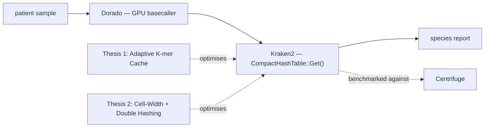

# Nanopore Project

Making a clinical nanopore sequencing pipeline for ESKAPE pathogen ID faster and smaller, under Prof. Kolin Paul.

```mermaid
flowchart LR
    P[patient sample] --> D["Dorado — GPU basecaller"]
    D --> K["Kraken2 — CompactHashTable::Get()"]
    K --> R[species report]
    T1["Thesis 1: Adaptive K-mer Cache"] -.optimises.-> K
    T2["Thesis 2: Cell-Width + Double Hashing"] -.optimises.-> K
    K -.benchmarked against.-> CF[Centrifuge]
```

Two Kraken2 lookups are on the critical path — `CompactHashTable::Get()` for the reference hash table, and everything sitting in front of it in the memory hierarchy. Both thesis pieces below attack that path from a different angle, and both need to beat Centrifuge, not just beat the unoptimised baseline.

## Status: back on kraken2/dorado, as of 2026-07-25

This project has pivoted twice. It started on Dorado/Kraken2 profiling, moved to a Mamba-as-MHA exploration on 2026-07-04, and moved back on 2026-07-25 after Prof. Kolin Paul emailed asking to continue the summer work toward two thesis pieces. Read that email as the reason everything below exists: he wants the summer's cache-miss diagnosis and the cell-width experiment turned into two complete, Centrifuge-benchmarked contributions.

**If you're picking this up cold**, the fastest path in is: read `reports/SUMMER_REPORT.md` for the profiling story (why Kraken2 is memory-bound, not compute-bound), then `dorado-kraken-research/docs/reports/kraken2opti_report.tex` for the cell-width-reduction result that grew out of it, then come back here for what's still open.

## The two thesis pieces

Both extend work that's already done — neither starts from zero.

### Thesis 1: Hardware-Aware Adaptive K-mer Cache

Extends **Patch 4**, the thread-local k-mer cache Kolin sir designed over the summer (`dorado-kraken-research/CLAUDE.md`, §"Kraken2 Optimisation Design"). The summer measurement that makes this worth doing: **90.7% of hash-table lookups in a run repeat a k-mer already seen** (32.8M unique of 351.8M total) — clinical samples have a dominant species, so a small cache in front of `Get()` catches almost all of the repeat traffic before it ever touches DRAM. Sir wants it built out properly, not just as a flat direct-mapped cache:

- baseline it as **4-way set-associative**
- add **LLC-topology-aware cache sizing** — Luna's 210MB shared L3 and Orion's 4MB SLC want very different cache footprints, so the cache shouldn't be one fixed size
- add a **biology-dependent adaptive eviction policy** — k-mer access isn't uniform, it's skewed toward whichever species dominates the sample, so eviction should learn that skew rather than assume it away

### Thesis 2: Cell-Width Reduction + Double Hashing

Extends the completed cell-width experiment: shrinking Kraken2's compact-hash cell from the stock 32 bits to 24 or 16 bits, which cuts an ESKAPE-panel database by 25% or 50% respectively. The joint report (`kraken2opti_report.tex`, with Chirag Suthar) formalises *why* this works — an exponential false-positive law, `FP ≈ p·2⁻ᵇ`, that predicts a sharp accuracy cliff at ≈13 check bits, confirmed on a 1,728-run cross-hardware sweep. **24-bit is a lossless drop-in; 16-bit needs a confidence threshold (`-T 0.05`) to stay accurate.**

Sir's email said "complete the three items of future work" for this piece. Those three items are §5 of `kraken2opti_report.tex`, and here's what each one means for this thesis:

| # | Future-work item | What it means here |
|---|---|---|
| 1 | Latency-hiding lookup cache | Shared with Thesis 1 — the summer's thread-local design and the report's 4-way LRU design were built independently and should merge into one implementation instead of two |
| 2 | Switch probing scheme (linear → double hashing) | Kraken2 defaults to linear probing, not double hashing (`kraken2_optimisation_report.md` §2.2). Double hashing cuts the expected probe length `p` from ≈6 to ≈2.5 at the same load factor, which shifts the false-positive cliff down by ≈1.3 bits — enough to make 16-bit safe *without* a threshold |
| 3 | Bitmask cell | A 6-bit-per-organism value packed into the cell, so one `Get()` call answers "which panel members does this k-mer belong to" for all six ESKAPE organisms at once, instead of one taxon ID |

> [!NOTE]
> A fourth report bullet — extending panel coverage and upstreaming the 16/24-bit cells to mainline Kraken2 — exists too, but it's housekeeping, not one of "the three."

### Both theses, one baseline: Centrifuge

Neither thesis has been benchmarked against Centrifuge yet — every number so far compares Kraken2 against itself. Centrifuge uses a compressed FM-index instead of a hash table (smaller, slower lookups — the opposite trade-off), which makes it the natural adversary for both "smaller database" and "smarter cache."

## What's done vs. what's open

**Done, measured, not projected:** the Dorado GPU profiling, the six-database accuracy/cache-cliff sweep across Luna and Orion, and the cell-width experiment itself (24-bit and 16-bit cells, 1,728-run cross-hardware validation). See `reports/SUMMER_REPORT.md` and `dorado-kraken-research/README.md` for the full data.

**Open:**
- Building the two theses above — neither has started
- Setting up Centrifuge as a comparison baseline
- Applying `kraken2_opt_v1.patch` and measuring the real delta — this was the top-priority item before the Mamba pivot and is still sitting there underneath the new thesis work
- Sir also suggested asking LLMs for more ideas on both pieces — worth doing before locking in scope

## Paused: Mamba as MHA

Can **Mamba** (a state-space sequence model) be reformulated to run as an **MHA (multi-head attention)**-shaped computation, so it rides the same hardware-optimised path (GEMM/tensor cores) that chips already build for attention, instead of Mamba's own slower custom scan kernel? That question is on hold, not dropped — it was the active focus from 2026-07-04 to 2026-07-25.

Start here when it picks back up: **[`MAMBA_MHA_EXPLAINER.md`](MAMBA_MHA_EXPLAINER.md)** — a long-form, code-embedded study document written for zero ML background, covering sequence models from first principles up through the Mamba-2 "State Space Duality" proof.

## Repository map

| Path | What's there |
|---|---|
| [`reports/SUMMER_REPORT.md`](reports/SUMMER_REPORT.md) | The profiling narrative: why Dorado is GPU-bound and Kraken2 is memory-bound, in prose |
| [`reports/`](reports/) | Weekly and summer status reports (`SUMMER_REPORT.md`, `WEEK1_REPORT.md`, `WEEK2_REPORT.md`) |
| [`planning/`](planning/) | Weekly plans, idea catalogs, and research notes (`mtpweek1plan.md`, `mtpweek2.md`, `week4plan.md`, etc.) |
| [`presentations/`](presentations/) | Slide decks and presentation source material |
| [`dorado-kraken-research/`](dorado-kraken-research/) | All Dorado/Kraken2 profiling data, patches, and reports — see its own `README.md` for the full 15-section writeup |
| [`dorado-kraken-research/docs/reports/kraken2opti_report.tex`](dorado-kraken-research/docs/reports/kraken2opti_report.tex) | The cell-width-reduction report (with Chirag Suthar) — the source for Thesis 2 and the "three items of future work" |
| [`MAMBA_MHA_EXPLAINER.md`](MAMBA_MHA_EXPLAINER.md) | The paused Mamba-as-attention direction |

---

Supervisor: **Kolin sir** (Prof. Kolin Paul).
