# Week 1 Report: Centrifuge, Kraken2, and the Flag Nobody Had Tried

*Two DNA classifiers went head-to-head on a 96-core server, one of them collapsed, and a single overlooked flag turned out to matter more than a whole optimization patch.*

This document is the single reference for two connected sessions of work: benchmarking Centrifuge against Kraken2 on Luna, and finally applying a long-overdue CPU optimization patch to Kraken2. It's written for Kolin sir and for CK, the two people who need to act on it next — one deciding what's meeting-worthy, the other deciding what to build next. It's worth reading end to end at least once because the two sessions turned up one deliberate, hard-won result (the 96-thread collapse) and one accidental, much bigger one (the memory-mapping flag) — and both change what the next thesis steps should look like. No background in bioinformatics or CPU performance is assumed anywhere below.

> [!TIP]
> **If you read nothing else, read this.**
> - **Centrifuge is 5-18x slower than Kraken2**, and it isn't close: at 32 threads it's about 5.5x slower, and past 32 threads it falls apart entirely, ending up 14-18x slower at 96 threads. The cause is thread contention — threads getting in each other's way — not a memory or cache problem, which was the opposite of what the theory predicted going in.
> - **A single flag change (`-M`, memory-mapping) that nobody in this project had ever used gives up to 12-14x speedup on Kraken2's large databases** — bigger than the entire hand-written CPU optimization patch this session set out to test.
> - Both findings are real, reproducible, and change priorities for the two thesis pieces this work is building toward.

## Why compare these two tools at all

Both thesis pieces need a fair opponent to measure against, and Centrifuge is that opponent. Kolin sir's two thesis directions both improve Kraken2 — an adaptive k-mer cache that resizes itself around each CPU's cache hardware, and a redesign of Kraken2's hash table (narrower cells, double hashing) to shrink both memory use and false positives. Neither improvement means anything in isolation; you need a second, independently-built classifier to show the gains are real and not just "Kraken2 got faster than its own earlier self." Centrifuge is that second tool: same job (identify which organism a DNA read came from), completely different internal design (Part A explains exactly how). That's why Week 1 exists at all, and why the patch session that follows it matters for the same two theses.

## Setting the timeline

Both sessions happened back to back, in the same week, feeding the same downstream work — the diagram below lays out what happened when, before any of the findings get explained in detail.

```mermaid
gantt
    title Week 1 timeline: Centrifuge baseline -> patch application session
    dateFormat YYYY-MM-DD
    axisFormat %b %d

    section Centrifuge baseline (Week 1 plan)
    Step 1: install + build FM-index (Luna)     :done, c1, 2026-08-01, 1d
    Step 3: run comparison benchmarks           :done, c2, 2026-08-01, 1d
    Step 4: analyze IPC collapse, write findings:done, c3, 2026-08-01, 2d
    Step 2: Orion ARM64 port (DROPPED)          :crit, c4, 2026-08-01, 1d
    Step 6: Fibonacci hashing reading (OPEN)    :active, c5, 2026-08-02, 3d

    section Patch application session
    Apply kraken2_opt_v1.patch by hand          :done, p1, 2026-08-03, 1d
    Discover structural deviations (5 items)    :done, p2, 2026-08-03, 1d
    Discover -M / memory-mapping finding        :done, p3, 2026-08-03, 1d
    Full 48-cell benchmark sweep                :done, p4, 2026-08-03, 1d

    section Reporting
    Fill Section 6 of optimisation report       :done, r1, 2026-08-03, 2d
```

Read left to right, it's really one investigation, not two: the Centrifuge session (Aug 1) established what "good" looks like on Luna, and the patch session (Aug 3) picked that baseline back up two days later, hand-applied a patch that had been sitting untouched for months, and stumbled onto a bigger finding than the patch itself while doing it.

## How to read this document

Jump straight to whichever part you need — each stands on its own, but they read best in order.

- **Part A — Centrifuge vs Kraken2 architecture.** What each tool actually does under the hood, and why comparing them is a fair fight rather than apples-to-oranges.
- **Part B — the genome-download saga & building the baseline.** How a missing genome library, an unset network proxy, and an NCBI download ceiling turned "download some genomes" into most of a session — and how the baseline got built anyway.
- **Part C — benchmark results & the 96-thread collapse.** The numbers behind the headline finding: where Centrifuge holds up, and exactly where and why it stops.
- **Part D — applying the Kraken2 optimization patch.** What the four-part patch was supposed to do, and every way the real source tree on Luna didn't match what the patch assumed.
- **Part E — the 48-cell benchmark sweep & the memory-mapping discovery.** The full results grid, and the accidental discovery that dwarfs everything else in this report.
- **Part F — what's next & appendix.** The open threads left on the table, plus reproducibility details (paths, commands, machine setup) for anyone rerunning this work.

Part A picks up right where the TL;DR left off: the actual mechanics of why Kraken2 and Centrifuge behave so differently under load.

---

## Part A: Kraken2 vs Centrifuge — the architecture difference

### The question everything else in this report answers

Say a nanopore sequencer hands you a fragment of DNA and nothing else. No label, no species name, no hint. Just a string of letters — A, C, G, T — a few hundred to a few thousand characters long. How do you figure out which organism it came from?

This is **taxonomic classification**: assigning each DNA fragment to a spot in the tree of life by comparing it against a database of known organisms' genomes. It's the same problem as matching a fingerprint at a crime scene against a database of known people — except the "fingerprint" is a chunk of DNA, and the "match" identifies a species instead of a suspect. Kraken2 and Centrifuge are two different tools built to answer exactly this question, fast, at the scale of hundreds of thousands of fragments per run.

### Where the fragments come from

A nanopore sequencer doesn't read a whole genome in one pass — genomes run to billions of letters, and the machine physically can't hold that much DNA still long enough. Instead it threads DNA strands through a microscopic pore one at a time and measures changes in electrical current as each base slides through. A separate step, basecalling, converts that raw electrical signal into A/C/G/T letters. The result is a pile of fragments called **reads** — like getting a shredded document back as a stack of paper strips, each strip a read, and you still have to work out where each strip belongs.

Those reads get stored in a **FASTQ file**: four lines per read — an identifier, the letter sequence, a separator, and a per-letter confidence score, because sequencers make mistakes and every downstream tool needs to know how much to trust each letter. FASTQ files are the raw input to both Kraken2 and Centrifuge. Neither tool cares how the reads were produced — this report just needs you to know that a "read" is a fragment of unlabeled DNA text, and classification is what puts a label on it.

### Kraken2: chop it up, hash it, look it up

Kraken2's strategy is blunt and effective. It slices every read into overlapping fixed-length chunks called **k-mers** (typically 31 letters each) — sliding a window one letter at a time so a single sequencing error only corrupts the few windows that touch it, not the whole read. To cut the work further, Kraken2 doesn't even keep every k-mer: it picks one representative **minimizer** per window of k-mers, the same way a news aggregator shows one headline per story cluster instead of every near-duplicate article.

Each minimizer then gets run through a hash function and looked up in a giant table built ahead of time from every reference genome Kraken2 knows about. A **hash table** is what makes this lookup fast in the first place — the hash function converts the minimizer into a numeric address, and the table returns whatever's stored there (here, a species ID, or **taxid**) in roughly constant time, the same way a coat-check ticket number tells the attendant which hook to check without searching every hook in the room.

This is why Kraken2 is fast: every minimizer's lookup is completely independent of every other minimizer's lookup. There's no step that has to wait for a previous step to finish. Hand different reads to different CPU cores and they classify in parallel with nothing to coordinate — an embarrassingly parallel workload, in the literal technical sense of that phrase.

It's also why Kraken2 is memory-hungry. A reference database covering thousands of species can hold billions of k-mers, and the hash table storing them runs to gigabytes, sometimes hundreds of gigabytes. That table does not fit in any on-chip CPU cache. So most lookups — one per minimizer, millions of times per run — pay the full cost of a trip out to main memory (DRAM), which is roughly two orders of magnitude slower than a cache hit. Kraken2 trades memory footprint for parallel, independent, cheap-per-lookup work. This is the design laid out in the original Kraken2 paper, [Wood, Lu & Langmead (2019), "Improved metagenomic analysis with Kraken 2," *Genome Biology*](https://doi.org/10.1186/s13059-019-1891-0).

### The wrong intuition about Centrifuge

Here's the natural assumption once you've understood Kraken2: "Centrifuge probably does the same thing, just implemented differently — same k-mer-hashing idea, different codebase, maybe a few tuning knobs moved around."

That assumption is wrong. Centrifuge doesn't hash k-mers into a table at all. It uses a fundamentally different data structure, built on a fundamentally different algorithm, with a trade-off that runs in the opposite direction from Kraken2's. These aren't two implementations of the same idea — they're two different bets on how to search DNA fast.

### Centrifuge: compress the whole reference, then search it one letter at a time

Instead of building a table of chunks, Centrifuge compresses each entire reference genome into a single structure called an **FM-index**. The FM-index is built on the **Burrows-Wheeler Transform (BWT)** — the same underlying idea that powers bzip2 compression. BWT rearranges a text's characters into an order that groups similar surrounding context together, which makes the result far more compressible than the original while still letting you reconstruct the original exactly. Stack an FM-index on top of that transform and you get something that can answer "does this substring exist in the genome, and where" almost instantly, without ever decompressing the genome back to plain text. The BWT itself comes from [Burrows & Wheeler's 1994 technical report, "A Block-sorting Lossless Data Compression Algorithm"](https://www.cs.jhu.edu/~langmea/resources/burrows_wheeler.pdf); the FM-index that makes it searchable comes from [Ferragina & Manzini's 2000 paper, "Opportunistic Data Structures with Applications" (FOCS 2000)](https://dl.acm.org/doi/10.5555/795666.796543).

Searching an FM-index uses an algorithm called **backward search**: you match a read against the index one character at a time, starting from the *end* of the read and working toward the start, narrowing down a range of candidate matching positions with every letter you add. Think of it like narrowing a dictionary search by prepending one letter at a time and re-checking which page range could still contain the word — each letter shrinks the plausible range further.

The catch: each backward-search step needs the result of the step before it. You can't compute step 5 until you know the outcome of step 4. That's a serial dependency chain, not a set of independent lookups. Where Kraken2 can throw a thousand unrelated minimizer lookups at a thousand cores with nothing to coordinate, Centrifuge's search for a single read is one long chain of steps that must happen in order.

This is Centrifuge's trade: compressing the reference into an FM-index gives it a dramatically smaller memory footprint than Kraken2's hash table, because BWT-based compression squeezes the reference genome itself, not just an index pointing at it. What it gives up is the embarrassingly parallel access pattern that makes Kraken2's per-lookup cost so cheap to hide. This is the design Centrifuge introduces in [Kim, Song, Breitwieser & Salzberg (2016), "Centrifuge: rapid and sensitive classification of metagenomic sequences," *Genome Research*](https://genome.cshlp.org/content/26/12/1721).

### The shape of the difference

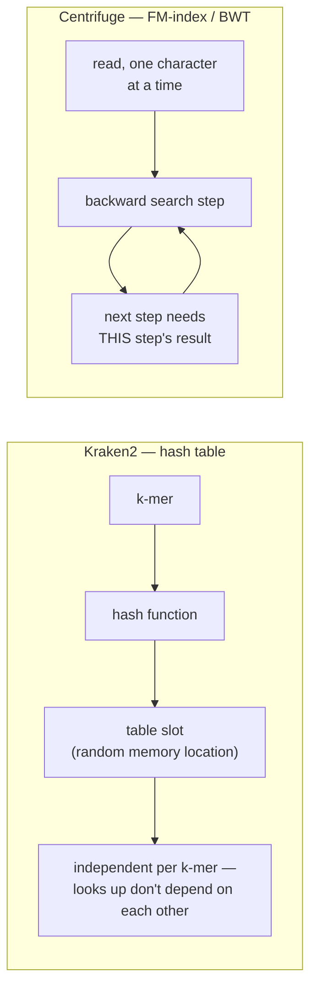

Kraken2's branch is wide and flat — many independent lookups fanning out with nothing waiting on anything else. Centrifuge's branch is a loop — each step feeding the next, one at a time. That shape difference is the whole story of why these two tools perform differently, and it's worth holding onto before the numbers show up later in this report.

A quick side-by-side of the properties this architecture difference implies:

| Property | Kraken2 (hash table) | Centrifuge (FM-index / BWT) |
|---|---|---|
| Core data structure | Hash table of k-mers/minimizers → taxid | Compressed full-text index of the reference |
| Per-lookup dependency | None — independent | Serial — each step needs the last |
| Memory footprint | Large (gigabytes to hundreds of GB) | Much smaller (same reference, compressed) |
| Natural parallelism | Embarrassingly parallel across reads/minimizers | Constrained by the per-read dependency chain |
| Expected bottleneck | Waiting on DRAM (cache misses) | Waiting on the next serial step (limited ILP) |

Read this table as two opposite bets, not a "better tool / worse tool" scorecard: Kraken2 bets that cheap, independent, parallel lookups outweigh a huge memory footprint; Centrifuge bets that a small, compressed structure is worth giving up parallel independence for.

### The prediction — and the tease

Put the two architectures side by side and the theoretical prediction writes itself: Kraken2 should be **fast but memory-hungry**, spending its time waiting on trips to DRAM. Centrifuge should be **memory-light but serial**, spending its time working through dependency chains rather than waiting on memory at all.

Hold onto that prediction. It's clean, it follows directly from the data structures, and it's the prediction this project actually went and measured against real hardware counters. What came back was a more interesting story than either tool "winning" outright — cache behavior that ran opposite to what the FM-index literature would suggest, and a bottleneck that showed up somewhere neither architecture's description points to directly. That result is coming later in this report; for now, just carry the prediction forward as the thing to check.

### Two more pieces of vocabulary worth planting here

Kraken2's hash table isn't a textbook hash table — it's squeezed to fit databases with billions of entries into a machine's available RAM. That squeeze matters again later in this report, when a patch-application session works directly inside this structure, so it's worth naming now.

Kraken2 uses a **compact hash table**: each entry gets packed into a small fixed-width "cell" (32, 24, or 16 bits) holding a truncated version of the k-mer's identity plus its taxid, instead of a full key and pointer. That's a direct trade of a little lookup precision for a lot of memory savings. When two different k-mers happen to hash to the same slot — a collision — Kraken2 resolves it with **linear probing**: check the next slot, then the next, in a straight line, until an empty one turns up. It's like parking in the next open spot down the row when yours is taken; under heavy traffic, taken spots cluster and searches get longer. How "full" the table is at any point is its **load factor** — the fraction of slots occupied. A parking garage at 70% full is quick to search; near 100%, you're circling.

And because those compact cells only store a truncated version of each k-mer's true identity, two genuinely different k-mers can occasionally collide onto the same cell and look like a match when they aren't one — a **false positive**. It's the same failure mode as a keycard reader that only checks the last four digits of your ID: occasionally someone else's last four digits match, and the door opens for the wrong person. Shrinking the cell width saves more memory but raises this false-positive rate — there's no free lunch here, only a curve to sit on deliberately, and that curve is exactly what one of this project's two thesis directions is built around.

With the two tools' architectures, their theoretical trade-off, and this vocabulary in hand, the rest of this report walks through what actually happened when both were built, indexed, and run head-to-head on real hardware — starting with a genome-download saga that had nothing to do with either tool's algorithm and everything to do with a deleted folder and a missing network proxy.

---

## Part B: The Genome-Download Saga, or How Step 3 Ate the Week

Week 1's plan had a short to-do list. Step 1: install Centrifuge, the second classification tool you'd need to compare against Kraken2. Step 3: build a reference index from that tool — the pre-processed pile of known genomes it searches against when it's handed an unknown DNA read (see Part A if you need a refresher on what a reference database actually is). Both steps sound routine. Install a tool, point it at some data you already have, wait. That's not what happened.

### Step 1: the part that actually went fine

You clone Centrifuge from GitHub, run `make`, and it builds cleanly on the first try — no missing dependencies, no patched-up Makefile, just some harmless warnings about old C++ style. All five binaries (`centrifuge`, `centrifuge-build`, `centrifuge-class`, `centrifuge-inspect`, `centrifuge-download`) show up where they should. You add them to your PATH, and Step 1 is done. This is not where the story is — it's worth one paragraph precisely because nothing went wrong.

### Step 3: the data you were counting on was just gone

Step 3 should have been just as boring: point Centrifuge at the genome library that earlier work in this project had already downloaded and used to build Kraken2 databases, and reuse it. You go looking for that library — and it isn't there. Not "moved," not "renamed." Gone.

A quick look at the project's own cleanup script explains part of it: the documented build process is *supposed* to delete a scratch folder called `eskape_genomes` once both databases are built, because that raw-genome data is only needed transiently for the build step. That part is working as designed.

But that same script only ever deletes the `taxonomy/` and `library/` subfolders *inside* each finished database folder — it never touches the top-level database folders themselves, or the actual `hash.k2d`/`taxo.k2d`/`opts.k2d` files that make a Kraken2 database usable. Those top-level folders and files are gone too. Nothing in the documented process explains that second loss. It isn't a bug in the cleanup script working slightly wrong — it's a separate disappearance the script was never responsible for in the first place.

> [!IMPORTANT]
> The finished Kraken2 databases (`eskape_650mb`, `eskape_human_4gb`) are missing, and it is not explained by any documented process. Only their build logs survive. This is a real, unresolved loss — not scratch-file cleanup working as intended — and any future Kraken2 rerun against those two specific databases will need a full rebuild from scratch, not just a Centrifuge-side fix.

With no local copy and no backup found anywhere on the machine, the only option left is to re-download the raw genomes and rebuild everything. That decision is where the real story starts.

### The re-download: three ways to fail before it works

The tool for the job is `ncbi-genome-download`, already installed and ready to pull genome files straight from NCBI (the US National Center for Biotechnology Information, the standard public repository for this kind of data) for the six ESKAPE taxids you need. The original download had pulled 1,149 complete bacterial assemblies, roughly 7GB uncompressed. You need that again.

**Attempt 1** does the obvious thing: download one genome at a time, in sequence. An hour in, only about 25MB of the ~7GB target has landed. At that rate, finishing would take days. You kill it.

**Attempt 2** fixes the obvious problem: run 25 downloads in parallel instead of one. More workers, more throughput, right? For a while, it looks like it's working — 25 real download processes, steady progress. Then the whole job quietly exits on its own, well short of done.

Here's where it gets interesting. Digging into the log turns up dozens of "checksum mismatch" errors — the downloaded file's checksum (a short fingerprint used to verify a file wasn't corrupted in transit) doesn't match what NCBI says it should be. That alone isn't surprising; network downloads occasionally get corrupted. What's surprising is that every single failed download reports the *exact same* wrong checksum, `14aa54cecceebc1536a4d1ee4a5c08ec`, regardless of which genome it was supposed to be. Random corruption doesn't produce identical garbage every time. Identical garbage means every one of those requests got back the same canned response — not scrambled data, but a real answer to a request that shouldn't have succeeded that way. Something was rejecting or throttling the requests and serving a stand-in response instead of the actual file. Out of the roughly 1,149 genomes targeted, only 200 had landed as real, checksum-valid files before the run gave up.

You'd assume the fix is dialing back the parallelism — 25 connections was clearly too aggressive, so try 8 instead. That's a reasonable next move, and it does help a little (more data moves, further into the download), but the job still exits early with the same identical-checksum failures. Lowering concurrency alone doesn't fix it, which tells you this isn't purely a "too many connections at once" problem.

The actual root cause takes some real diagnostic work to find: a pair of `curl` tests reveals that outbound HTTPS traffic to NCBI is either timing out entirely or routing strangely, and nothing has proxy environment variables set. It turns out Luna — the machine this all runs on — sits behind IIT Delhi's institutional network proxy, and that proxy had simply never been configured for this session. Once the four proxy environment variables are set (pointing at `proxy62.iitd.ac.in:3128`) and persisted, a request that previously hung for three and a half minutes returns correctly in about a second.

This is the kind of failure that's genuinely worth naming as a trap: a missing institutional proxy setting looks exactly like NCBI rate-limiting you, or like the download tool being flaky, or like a bad network day. It presents as intermittent, unpredictable, tool-shaped noise. It is none of those things — it's one missing configuration line, and until you find it, every symptom points somewhere else.

With the proxy fixed, you rerun the download. The corruption is completely gone — zero checksum mismatches this time, real data all the way through. Progress. Except the file count lands at exactly 200 genomes again. Same number as before the fix.

That's suspicious enough to chase properly. Three separate, independent changes get tried: lowering parallelism (already done), fixing the proxy (just done), and — suspecting a stale, possibly corrupted cache of NCBI's genome catalog left over from the earlier flaky-network attempts — wiping the download tool's cache entirely and adding automatic retries. Each of these is a plausible, distinct explanation for a hard ceiling. All three land on the identical 200-genome result. That rules out flakiness — this is deterministic, reproducible behavior, not bad luck. At that point, chasing it further stops being worth the time. The best working theory, never fully confirmed, is that the installed version of `ncbi-genome-download` (0.3.3) is too old to correctly parse how NCBI's current catalog structures its newer, higher-accession-number assemblies. The 200-genome ceiling gets accepted as a real wall, not a bug worth burning more of the week on.

Here's the whole chain in one picture:

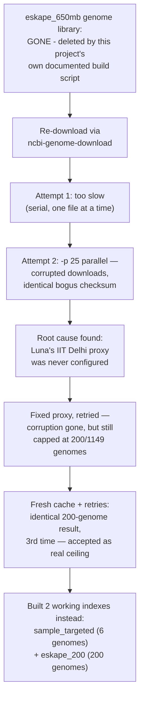

### Meanwhile: the fast path that didn't wait around

While the big download was busy failing in the background, a smaller, faster path was sitting in plain sight. Not everything had been lost — a folder called `sample_targeted` had survived intact, complete with its taxonomy files and 12 genome files inside it. Sorting out which of those were real and which were unrelated duplicates left exactly 6 usable genomes, covering 6 distinct ESKAPE-relevant organisms (including a bonus E. coli reference not in the strict ESKAPE list).

There was no reason to wait for 1,149 genomes to trickle in before doing anything. Those 6 genomes got concatenated into a single FASTA file and fed straight into `centrifuge-build` — with one small snag along the way (the build script's shebang line expected a `python` command, and Luna only ships `python3`, fixed with a one-line symlink). Once that was sorted, the build finished in 12 seconds. That's the first Centrifuge index this project ever produced, and it came from the small, already-available data — not the download that was still struggling. Not blocking on the slow path meant there was already something to run classification against long before the 200-genome question was settled.

### What actually got built

The 1,149-genome index from the original plan never happened this week, and per the reasoning above, it isn't clear it will without either a tool upgrade or a different download strategy. What did happen: two working Centrifuge indexes, built at two different scales. The small one — 6 genomes, `sample_targeted`, 12-second build — was ready almost immediately. The mid-scale one — 200 genomes, the real re-downloaded data, roughly 40x more sequence — took a lot longer to build, just over an hour, which tracks: more raw data in, more compute to index it. Neither matches the original ~1,149-genome plan. Both are real, usable, and gave the project something concrete to classify reads against instead of nothing.

So — two indexes, built the hard way. The next question is what actually happens when you run real sequencing reads through them, and how that compares to what Kraken2 already told you about the same data.

---

## Part C: Benchmark Results — and the 96-Thread Collapse

### What we measured

You now know how the two tools search (Part A) and what the measurement tools mean (Part B). Here's what actually happened when we ran them.

Both tools classified the exact same input: 104,918 real nanopore sequencing reads, the project's standard test set. Both ran against comparable reference data — a small 6-genome database (`sample_targeted`) and a larger, more realistic one (Kraken2's `eskape_650mb`, Centrifuge's independently-rebuilt 200-genome `eskape_200`, both built around the same six ESKAPE pathogen species). Both ran at three thread counts: 1, 32, and 96. Every run was instrumented with `perf stat`, capturing wall-clock time, cache/LLC-miss rates, and IPC for each configuration.

That gives you a like-for-like comparison at two database scales and three thread counts — six runs per tool, twelve runs total, all on the same machine (Luna).

### The headline number: Centrifuge is several times slower

| Threads | Kraken2 (`sample_targeted`) | Centrifuge (`sample_targeted`) | Kraken2 (`eskape_650mb`/`200`) | Centrifuge (`eskape_200`) |
|---|---|---|---|---|
| 1 | 19.729s | 48.461s | 21.981s | 134.460s |
| 32 | 0.928s | 5.115s | 1.045s | 5.653s |
| 96 | 1.105s | 19.682s | 1.164s | 16.355s |

At 32 threads — the best configuration for both tools — Centrifuge is **5.4-5.5x slower** than Kraken2, on both databases. That gap is already large. At 96 threads it gets much worse: Centrifuge falls to **14-18x slower**, while Kraken2 barely moves (0.928s → 1.105s, 1.045s → 1.164s). Whatever happens to Centrifuge past 32 threads, it doesn't happen to Kraken2.

### The twist: Centrifuge's cache behavior is actually better

Here's the intuition you'd bring in from Part A: Kraken2 does independent, scattered hash-table lookups — cache-unfriendly, but at least each lookup doesn't depend on the last. Centrifuge walks its FM-index one character at a time, each step waiting on the result of the step before it — a serial dependency chain. The literature on FM-index search predicts this chain hurts memory locality. Going in, the expectation was: Kraken2 has the cache problem, Centrifuge doesn't need to.

The measurements say the opposite.

| Threads | Kraken2 (`sample_targeted`) LLC-miss% | Centrifuge (`sample_targeted`) LLC-miss% | Kraken2 (`eskape_650mb`/`200`) LLC-miss% | Centrifuge (`eskape_200`) LLC-miss% |
|---|---|---|---|---|
| 1 | 10.19 | 0.71 | 30.70 | 25.21 |
| 32 | 14.64 | 1.21 | 30.53 | 23.82 |
| 96 | 15.72 | 0.73 | 32.56 | 22.93 |

Centrifuge's LLC-miss rate is lower than Kraken2's at every single measurement — at small scale, by as much as 12x (32T: 14.64% vs 1.21%). This holds at both database sizes and all three thread counts. It isn't a fluke.

So: the tool everyone expected to have the worse cache story has the better one, and it's still 5-18x slower. Something else is the bottleneck.

### So what is slowing it down? IPC tells the real story

If it isn't cache misses, the next question is whether the CPU is actually doing useful work while Centrifuge runs. That's what IPC (instructions completed per cycle) measures — high IPC means the CPU is busy computing, low IPC means it's stalled waiting on something.

| Threads | Kraken2 (`sample_targeted`) | Centrifuge (`sample_targeted`) | Centrifuge (`eskape_200`) |
|---|---|---|---|
| 1 | 1.78 | 2.63 | 1.57 |
| 32 | 1.65 | 1.03 | 1.46 |
| 96 | 1.34 | 0.22 | 0.31 |

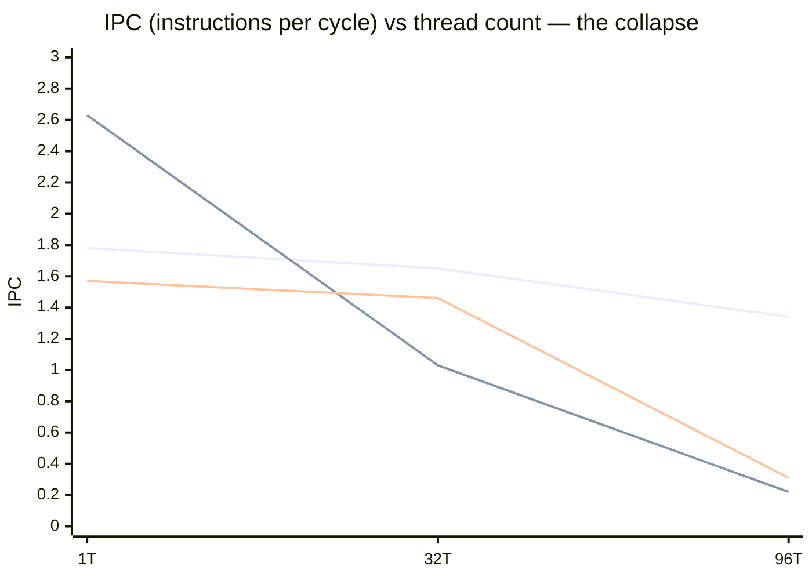

Read this left to right. At 1 thread, Centrifuge is actually more efficient than Kraken2 — 2.63 vs 1.78. At 32 threads it holds up reasonably: on the larger database it's still slightly ahead of Kraken2 (1.46 vs 1.37). Then at 96 threads, it falls off a cliff — IPC crashes to 0.22-0.31, less than a fifth of where it started.

Mechanically: from 32T to 96T, the number of CPU cycles burned roughly 10x'd, while the number of instructions actually completed only about doubled. That ratio — many more cycles spent per instruction finished — is the fingerprint of threads waiting on each other, not threads waiting on memory. If this were a memory-latency problem, you'd expect the LLC-miss rate to spike alongside it; it doesn't (96T LLC-miss% is flat or even slightly lower than 32T's, on both databases). This is thread contention or lock contention: threads queuing for something shared, burning cycles doing nothing useful, exactly like several cashiers all waiting on one shared till.

Here's how much that costs you in absolute terms:

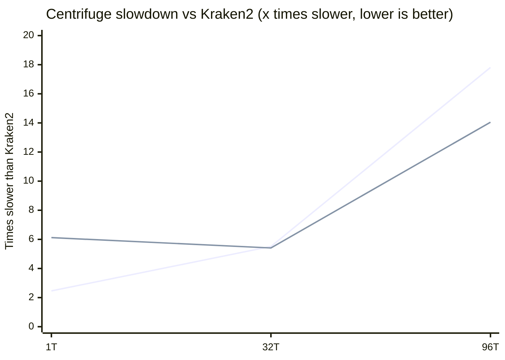

The IPC collapse isn't a rounding error in a chart — it roughly triples Centrifuge's already-large disadvantage against Kraken2, from ~5.4-5.5x slower at 32 threads to 14-18x slower at 96.

### A theory that didn't survive more data

Worth pausing on how this conclusion got revised mid-investigation, because it's a good example of not trusting the first small dataset.

The first pass used only `sample_targeted`, the tiny 6-genome database. There, Centrifuge's 1T→32T speedup was 9.47x, badly behind Kraken2's 21.26x. The natural read: "Centrifuge's FM-index threading model fundamentally scales worse than Kraken2's hash table, even at a moderate, non-oversubscribed thread count." That felt like a solid, general conclusion.

Then the larger `eskape_200` database was tested, and the pattern reversed:

| | Kraken2 | Centrifuge |
|---|---|---|
| `sample_targeted` 1T→32T speedup | 21.26x | 9.47x |
| `eskape_200`/`eskape_650mb` 1T→32T speedup | 21.03x | **23.79x** |

At realistic scale, Centrifuge's threading scaled at least as well as Kraken2's — the opposite of what the small database suggested. So "Centrifuge scales badly at 32 threads" wasn't a real, general property of the tool. It was an artifact of the test being too small: on a 6-genome database, the run finishes so quickly that fixed per-run overhead — loading the index, spinning up and tearing down 32 threads — eats a disproportionate share of total time. That overhead looks like poor scaling, but it isn't contention; it's a small workload not having enough real work to amortize its setup cost.

This is the kind of correction worth stating plainly rather than quietly fixing: the first theory was reasonable given the data available at the time, and more data showed it wrong in a specific, explainable way.

What did *not* get revised: the 96-thread collapse. That pattern reproduced identically on both the tiny and the realistic database — strong scaling to 32 threads, then a sharp regression at 96, regardless of scale. It's the one finding from this investigation that survives being tested twice, and it's treated accordingly, as the real, general result.

### What we still don't know — and what to do about it

We don't yet know which specific function or lock inside Centrifuge is responsible for the 96-thread collapse. Answering that needs a deeper profiling pass — `perf record --call-graph dwarf`, which captures full call stacks instead of just aggregate counters — and that hasn't been run yet.

Until it has, the concrete, actionable conclusion is simple: **don't run Centrifuge above roughly 32 threads on Luna.** Past that point you're not buying speed, you're buying contention.

### Accuracy: close agreement, but not yet a fair comparison

Setting performance aside — do the two tools even agree on what's in the sample? On `sample_targeted`, largely yes:

| Species | Kraken2 reads | Centrifuge reads | Kraken2 % | Centrifuge % |
|---|---|---|---|---|
| P. aeruginosa PAO1 | 55,077 | 55,338 | 52.50% | 52.75% |
| E. coli K-12 MG1655 | 22,860 | 22,946 | 21.79% | 21.87% |
| K. pneumoniae HS11286 | 10,411 | 10,796 | 9.92% | 10.29% |
| E. cloacae ATCC 13047 | 503 | 723 | 0.48% | 0.69% |
| S. aureus NCTC 8325 | 7 | 17 | 0.01% | 0.02% |
| E. faecium DO | 5 | 5 | 0.00% | 0.00% |
| Unclassified | 15,945 | 15,433 | 15.20% | 14.71% |

Both tools land on essentially the same species distribution, with Centrifuge classifying marginally more reads at every species and correspondingly fewer unclassified.

One finding here is worth calling out: on `eskape_200` — a 200-genome reference that, unlike `sample_targeted`, doesn't include E. coli at all — the ~23,000 reads that would have matched E. coli didn't turn up unclassified. Overall classified rate barely moved (85.97% vs 85.29%). Instead, those reads got reassigned to the next-best match, mostly P. aeruginosa and K. pneumoniae, whose broader strain diversity in the larger reference gave the classifier a "good enough" alternative. Reference *composition* — which organisms are and aren't in your database — turns out to matter as much as reference size for where reads end up.

> [!IMPORTANT]
> Treat every accuracy number in this section as **unvalidated**. Kraken2 and Centrifuge ship different default confidence/score thresholds for calling a read "classified." The comparison above uses each tool's defaults as-is, so any gap (or lack of one) could reflect a real sensitivity difference or could simply be a threshold artifact. This needs a matched-threshold rerun before it's trustworthy.

### Why Orion got skipped this round

The original plan for this week included porting Centrifuge to Orion, the project's ARM64 Jetson edge device, as a parallel track alongside the Luna benchmarking above. We dropped it, and it's worth explaining why rather than just noting it happened.

Centrifuge is already 5.5-18x slower than Kraken2 on Luna — a 96-core x86 server, about as favorable a machine as this project has. Orion is a much weaker, power-constrained 12-core ARM64 board, and the Centrifuge codebase (which descends from Bowtie2) carries a known x86-only CPUID bug that makes the ARM64 build itself a real risk, not just a recompile. Porting a tool that already struggles to use 96 fast cores efficiently to a machine with a fraction of the compute, with a documented build risk on top, isn't a good use of a week. The better use of the time was understanding why the threading collapses on hardware we already had working.

This is a deprioritization, not a cancellation. It's worth reopening if the 96-thread collapse turns out to be something Luna-specific — a NUMA or topology quirk rather than a general Centrifuge limitation — because Orion's very different architecture would be a useful data point for telling those two possibilities apart.

### What this means going forward

Put together: Centrifuge is a real, working alternative to Kraken2 with a smaller memory footprint and — surprisingly — better cache behavior, but a consistent 5-6x wall-time gap that cache misses don't explain, plus a hard ceiling somewhere around 32 threads that we can't yet name precisely. Neither of those two problems is fixed by throwing more hardware at it; both need more profiling before Centrifuge is a serious head-to-head contender rather than a curiosity. The next section picks up where that leaves the two thesis directions.

---

## Part D: Applying the Patch That Had Been Waiting for Months

### The setup: a patch designed carefully, then never actually run

Months before this session, four optimizations for Kraken2 had already been designed. Not guessed at — measured into existence. The team had checked how full the hash table actually gets. They had checked whether the CPU was genuinely computing or just sitting there waiting on memory. They had even checked whether the compiled binary was using the CPU's modern instruction set at all.

None of that measurement work translated into a benchmark you could point to. The patch had been written, saved as a single file (`kraken2_opt_v1.patch`), and left there. It had never been applied to the real source tree on Luna, and it had never been built or timed. Of every task hanging over this project, this was the single most overdue one.

This session finally applied it. What should have been a quick "run the script, get the numbers" turned into something closer to detective work, because the code on the server had quietly drifted away from what the patch assumed. Every one of those mismatches had to be found and worked around by hand before a single benchmark could run — that's most of what this section covers.

### What the four patches actually do

All four changes live in one patch file, gated by the earlier measurements. Here's each one, motivation first.

**Patch 1 — tell the compiler what CPU it's actually running on.**
A compiler that doesn't know your exact CPU model plays it safe: it only emits instructions guaranteed to work on almost any x86 chip. That's a real cost, and it wasn't hypothetical here — an earlier measurement had found the stock Kraken2 binary used **zero** AVX-512 instructions and **zero** AVX2 instructions, the CPU's modern wide-vector instruction sets. It ran on 1,308 old-style SSE instructions and nothing more, on a chip (Sapphire Rapids) that supports far more. Patch 1 adds compiler flags that name that exact chip, plus a flag called link-time optimization (LTO) that lets the compiler optimize across separate source files instead of one at a time — for example, turning a lookup that currently goes through a generic "virtual call" into a direct, inlined one. It also unrolls the loop that walks the hash table.

**Patch 2 — use bigger memory pages for a huge, randomly-accessed table.**
Computers manage memory in fixed-size chunks called pages, and the CPU keeps a small, fast lookup cache (the TLB) of "which page maps to which physical memory" so it doesn't have to work that out from scratch on every access. Standard pages are 4KB, which means an 8GB hash table needs roughly 2.1 million separate page entries — far more than the TLB can ever hold, so it's constantly missing and re-doing that translation work. Patch 2 asks the operating system to use 2MB pages instead, which shrinks the same 8GB table down to about 4,096 page entries — small enough to fit comfortably in the TLB. It also tells the OS not to bother with sequential readahead, since hash-table access is deliberately random, not sequential (see reference [6] on transparent huge pages). One catch, which matters a lot later in this section: this patch only does anything at all if the hash table is loaded through `mmap()` — a detail that turned out to be its own separate discovery.

**Patch 3 — start the next memory fetch before you're done waiting for this one.**
Every time Kraken2 looks up a k-mer in the hash table, it's a random memory access, and a random access that misses the CPU's cache costs somewhere around 100-300 nanoseconds — the CPU just sits there. An earlier measurement had confirmed this workload is "latency-bound," not "bandwidth-bound": only 4.9-10.7% of the available memory bandwidth was in use, meaning there was plenty of room to ask for more data without congesting anything. Patch 3 exploits that headroom with software prefetching: while waiting on the current lookup, it also issues a request for the next likely memory location, so that wait overlaps instead of stacking up one lookup at a time (see reference [7], the classic hash-join prefetching paper — this is the same idea applied to Kraken2's hash-table probes).

**Patch 4 — catch repeat lookups before they ever reach the slow table. Designed by Kolin sir.**
Kraken2 already had a trivial version of this idea: if the current k-mer is literally identical to the one immediately before it (which happens constantly, because of how the sliding window works), skip the lookup. But an earlier measurement found something bigger: 90.7% of minimizers get reused *somewhere* in a given read set — not just next-door, but scattered across different reads entirely. Patch 4, Kolin sir's design, gives each thread its own small private cache — 16,384 entries, 256KB total, sized to sit comfortably inside one CPU core's L2 cache — and checks it before ever touching the real hash table. A hit there means the slow, DRAM-touching lookup never has to happen at all.

### Applying it: five things the patch got wrong about its own target

The patch was correct about *what* to change. It was wrong, in several separate ways, about *where* and *how* the current code actually looked. Each mismatch had to be discovered by hand, one at a time, before it could be fixed.

**1. The apply script pointed at a folder that didn't exist.** The script assumed the Kraken2 source lived at `~/kraken2-src`. It doesn't. The real, correct location is `~/tools/kraken2-src/`. First attempt failed immediately with a "no such file or directory" error — a five-minute fix, but it set the tone: nothing about this patch's assumptions could be trusted without checking.

**2. There was no safety net to undo a bad change.** The patch's plan leaned on git — apply the patch, and if something goes wrong, instantly roll it back. The real source tree has no `.git` folder at all. So there was no free undo button. A manual backup-and-restore process had to be built from scratch before touching anything: copy every file that was about to be edited, under a clearly-named suffix, before making a single change.

**3. The patch assumed a flexible, "works for any data type" class that doesn't exist here.** The patch's prefetching code (Patch 3) was written assuming Kraken2's hash table class could hold any kind of entry, and calculated its stride using the generic size of "whatever type this table happens to hold." In reality, the class in this codebase is not written that way at all — it's built around one fixed, concrete entry type, with no generic version anywhere. The patch's code, as written, simply would not have compiled. The fix was to compute the same size a different way — using an expression that was already sitting a few lines away in the same file, doing exactly the same job for exactly this concrete type.

**4. The function the patch wanted to edit lived somewhere else entirely.** The patch's instructions pointed at one file for the hash-table lookup function. That file only contains a one-line declaration of the function — the actual working code is in a different file. This wasn't just a wrong line number; it also meant an earlier safety step (backing up files before editing them) had already missed this file, since the initial backup pass only covered the files the patch explicitly named. There is no backup of that file's original version. The fix itself was still fully recoverable, because every inserted line was documented step by step as it happened — but it's a gap worth naming honestly rather than glossing over.

**5. A compiler flag the patch wanted to add would have silently done nothing.** Part of Patch 1 tried to attach its link-time-optimization flags to a build variable that, on paper, should control how the final program gets linked. Looking closely at how the actual build file wires things together, that variable is never referenced by any of the six commands that do the actual linking. The flag would have sat there, doing nothing, and nobody would have noticed — the build would have looked normal and the optimization simply wouldn't have happened. Caught before it shipped, by folding those flags into the variable the build file actually uses.

Here's the whole chain, in order:

```mermaid
flowchart TD
    Start["Task: apply kraken2_opt_v1.patch"] --> A{"Assumed source path exists?"}
    A -->|"No — fatal error"| A2["Real path found under ~/tools/"]
    A2 --> B{"Assumed a git repo for safe apply/rollback?"}
    B -->|"No .git folder at all"| B2["Build manual backup process,<br/>apply all 4 edits by hand"]
    B2 --> C{"Assumed a generic, any-type table class?"}
    C -->|"Actual class is one fixed, concrete type"| C2["Substitute an expression<br/>already used elsewhere in the same file"]
    C2 --> D{"Assumed the lookup function<br/>lived in one file?"}
    D -->|"Only a declaration there —<br/>real code is in a different file"| D2["Edit the real file instead<br/>(also: missed by the initial backup pass)"]
    D2 --> E{"Assumed a build variable<br/>actually affects linking?"}
    E -->|"Never referenced by any link step —<br/>flag would silently do nothing"| E2["Fold flags into the<br/>variable that's actually used"]
    E2 --> F["Unrelated discovery while reading<br/>the exact edit site closely:<br/>a stray, unconditional debug print<br/>firing on every single lookup"]
    F --> F2["Disabled before any benchmark ran"]
    F2 --> G["All 4 patches hand-applied,<br/>clean build, zero errors —<br/>ready to benchmark"]
```

> [!IMPORTANT]
> This patch had been written against a version of the code that no longer existed. Every one of the five mismatches above traces back to that single fact.

There's a sixth item, and it's the one worth slowing down for.

While double-checking the exact lines Patch 4 was about to touch, an unrelated line turned up sitting right next to the edit site: a debug print statement, firing on every single non-ambiguous minimizer, with no guard around it at all. This wasn't part of the patch. It wasn't stock Kraken2 code either. It had clearly been added at some point and never removed.

Why did it matter so much? Because "print something to the screen" sounds harmless until you remember this runs once per minimizer, and a single read set produces millions of them. Left in place, it would have added millions of screen-writes to every run — and every timing number taken afterward would have been comparing "Kraken2 plus a hidden logging tax" against itself, not the real classification loop. It would have quietly corrupted every single benchmark in this section before they were even run.

The likely origin makes sense once you know it's there: this looks exactly like leftover instrumentation from measuring the 90.7% k-mer-reuse figure that justified Patch 4 in the first place — printing every minimizer to a log is precisely how you'd compute that statistic, and whoever added it for that one-off measurement simply never took it back out. It was confirmed to be the only instance of its kind, and disabled — commented out, not deleted, so the change stays reversible — before any benchmarking began.

### Making sure the comparison is actually fair

None of this matters if the eventual "before vs after" numbers aren't comparing like with like. The debug-print bug is exactly the kind of thing that could sneak in and make the patch look better than it really is, if it only got removed from one side of the comparison.

So the baseline wasn't built by simply restoring the old backup files and calling it done — that would have brought the debug-print bug back with it, since the bug predates the patch. Instead: the whole source tree was duplicated into a separate copy, the three backed-up files were restored inside that copy only (undoing three of the four patches), the fourth patch's edit — the one with no backup — was carefully reversed by hand and checked line-for-line against the original function, and then the exact same debug-print fix that had already gone into the patched tree was applied to this baseline copy too. Only then were both trees built.

The result: baseline = stock Kraken2 plus the debug-print fix, and nothing else. Patched = stock Kraken2 plus the same debug-print fix, plus all four real optimizations. The only difference left between the two is the thing actually being measured.

### Where this leaves things

None of these five mismatches, or the stray debug print, ever blocked the work. Every one got solved by hand once it was understood, and none needed anything more clever than careful reading and a working substitute already sitting nearby in the code. But taken together, they mean this patch had been sitting untested for months against a mental model of the codebase that had already moved on — a reminder that "designed and reviewed" is not the same thing as "applied and true."

With all four patches finally in place, both trees building cleanly, and the comparison isolated to just the patches themselves — the next question is simple: once you actually run it, what does it show?

---

## Part E: The 48-Cell Benchmark Sweep and the Memory-Mapping Discovery

### The obvious idea that turned out backwards

Picture a huge reference file — tens of gigabytes — that a program needs to search through. What's the safe move? Read the whole thing into memory first, get it over with, then start working. Loading everything up front feels careful. It feels like the fast option, because you're not leaving anything to chance mid-run.

That instinct is wrong, and finding out how wrong it is turned out to be the single biggest result of either session in this report. On the largest database tested, doing the opposite of "load it all first" made the program run **more than 12 times faster**. Not from a code change. From flipping one flag.

### Setting up the sweep

Once the four-part optimization patch was applied and building cleanly (Part D), it needed real testing. The plan: run the classifier across four reference databases of wildly different sizes, at three thread counts, on both the patched and unpatched (baseline) build. That's already a lot of combinations. Then one more dimension got added — a flag controlling *how* the reference database gets loaded into memory in the first place — and that's the dimension that produced the headline finding.

The four databases:

| Database | Size |
|---|---|
| `sample_targeted` | ~50MB |
| `standard_8gb` | ~8GB |
| `standard_16gb` | ~16GB |
| `pluspf_103gb` | ~111GB |

Cross that with 3 thread counts (1, 32, 96), 2 builds (baseline, patched), and 2 loading modes (default, and the `-M` flag) and you get 4 × 3 × 2 × 2 = 48 cells. Every cell was measured with a warm-up run plus three timed runs, on the same NUMA-pinned setup used for every measurement in this project, so the numbers are directly comparable to everything that came before.

### The flag, and what it actually changes

The flag in question is `-M` (memory-mapping mode). To see why it matters, you have to look at what happens without it.

By default, before classification can even start, the program reads the *entire* hash-table file into memory — cover to cover, sequentially, all of it, regardless of which parts classification is actually going to touch. Only once that whole read finishes does the real work begin.

With `-M`, the file isn't copied in at all. It's mapped directly into the program's address space instead — a lightweight, near-instant operation — and pieces of it get pulled in lazily, one small chunk at a time, only when classification actually reaches for them. There's no separate "loading phase." The cost of getting data off disk gets absorbed into work that was going to happen anyway.

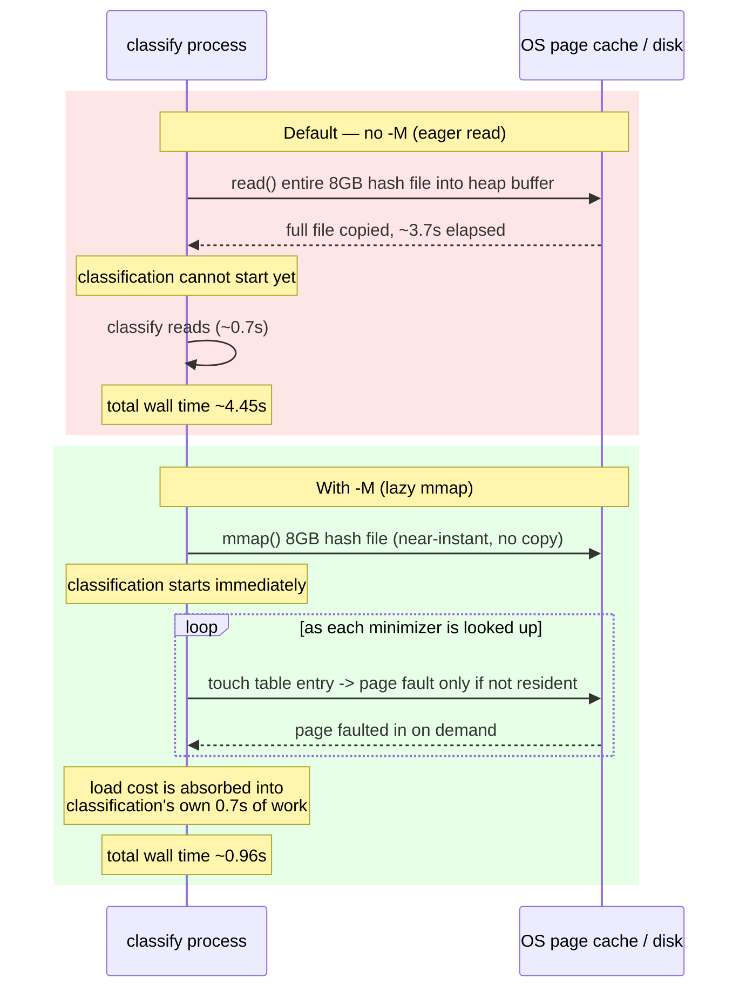

### Nobody had ever flipped this switch

Here's the part worth sitting with: `-M` had never been used, not once, anywhere in this project's history. Not in the M1 through M7 measurements. Not in any prior benchmark. Not even in the number this whole project had been quoting for months as "the baseline." Every single timing figure produced before this sweep was measured with the slow, eager-load path, without anyone knowing there was a faster one sitting behind a flag that was never passed.

### How much it's worth, by database size

Turning `-M` on had almost no effect on the smallest database and a transformative effect on the largest one. At 32 threads:

| Database | Size | Wall time, no `-M` | Wall time, `-M` | `-M` savings |
|---|---|---|---|---|
| `sample_targeted` | 50MB | 0.947s | 0.907s | ~4% |
| `standard_8gb` | 8GB | 4.446s | 0.96s | ~78% |
| `standard_16gb` | 16GB | 8.23s | 1.257s | ~85% |
| `pluspf_103gb` | 111GB | 53.47s | 4.173s | **~92%** |

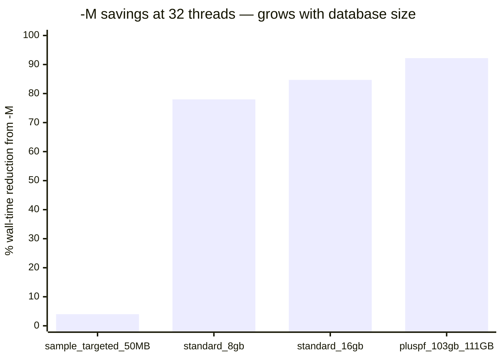

The smallest database barely moves because it's tiny enough that loading it — either way, eagerly or lazily — is over in a blink. There's no up-front cost worth eliminating. The largest database is the opposite story: 111GB is a lot to read cover to cover, and skipping that gives back most of the run's total time. At 96 threads the largest database goes from 53.24s down to 3.72s — a 93% reduction, more than 12x faster, from a single flag, with zero lines of code touched.

### Here's where it gets interesting: why the benefit grows with more threads

You'd expect a fixed optimization's benefit to stay roughly constant as you add threads, or maybe shrink, since threads are already doing the heavy lifting. Here it does the opposite — the more threads you throw at classification, the *bigger* `-M`'s payoff gets. That's worth explaining, because the mechanism is genuinely elegant.

Total wall time is made of two parts: the time spent loading the database, and the time spent classifying reads. Loading is mostly one big sequential read — throwing more threads at classification doesn't make that read finish any faster. So load time is roughly fixed, no matter what thread count you pick. Classification time, on the other hand, is exactly what parallelism is good at — it keeps shrinking as thread count rises.

Put those together: as thread count goes up, the total shrinks, but load time doesn't shrink with it. That means the fixed load cost becomes a *bigger slice* of a *smaller pie*. On `standard_8gb`, at 1 thread `-M` only saves about 20% (16.48s → 13.27s), because classification itself still takes over a minute and dwarfs the load cost. At 96 threads, classification has been squeezed down so far that the fixed load cost is most of what's left — and `-M` saves roughly 73% there instead.

So the second wrong intuition to name here: you'd think adding threads helps every part of the program proportionally. It doesn't. Adding threads made the *classification* problem smaller — and, as a side effect, made fixing the *loading* problem worth far more than it would have been at low thread counts. The two effects compound rather than compete.

### Putting the patch's own contribution in context

Now set `-M` aside and ask a separate question: how much did the four-part optimization patch itself help? The honest answer is — a lot less than this.

```mermaid
xychart-beta
    title "Wall time at 32 threads: -M vs no -M, across DB sizes (seconds)"
    x-axis [sample_targeted_50MB, standard_8gb, standard_16gb, pluspf_103gb_111GB]
    y-axis "Wall time (s)" 0 --> 55
    bar "no -M" [0.947, 4.446, 8.23, 53.47]
    bar "-M" [0.907, 0.96, 1.257, 4.173]
```

Look at the shape of that chart. The `-M` bar is dramatically shorter than the no-`-M` bar on every database above 50MB, and the gap between "baseline" and "patched" builds barely registers next to it. That's the point of this whole section: a one-flag change dwarfs a four-part, hand-applied source patch.

That doesn't mean the patch did nothing. At a single thread, isolated from `-M`'s effect, the patch has a real and sensible pattern:

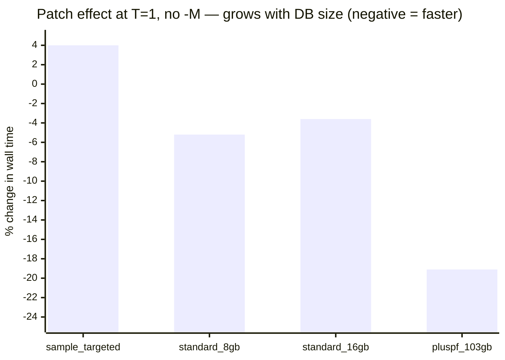

The patch's benefit grows as the database gets bigger — up to about 19% faster on the largest, 111GB database. That tracks directly with what Part D found about Patch 3 (the software-prefetching patch): bigger databases give the hash-table lookup function a growing share of the program's total cache misses, meaning there's more for prefetching to actually fix. A bigger database means more raw material for the patch to work with.

On the smallest database, the patch is a small net loss — wall time gets slightly *worse*, not better. That database already fits comfortably in cache. There's nothing to prefetch and nothing worth caching, so the extra bookkeeping the patch adds to every lookup is pure overhead with no payoff to offset it.

### The patch's benefit fades as thread count rises

There's a second real pattern, and it holds on every database tested:

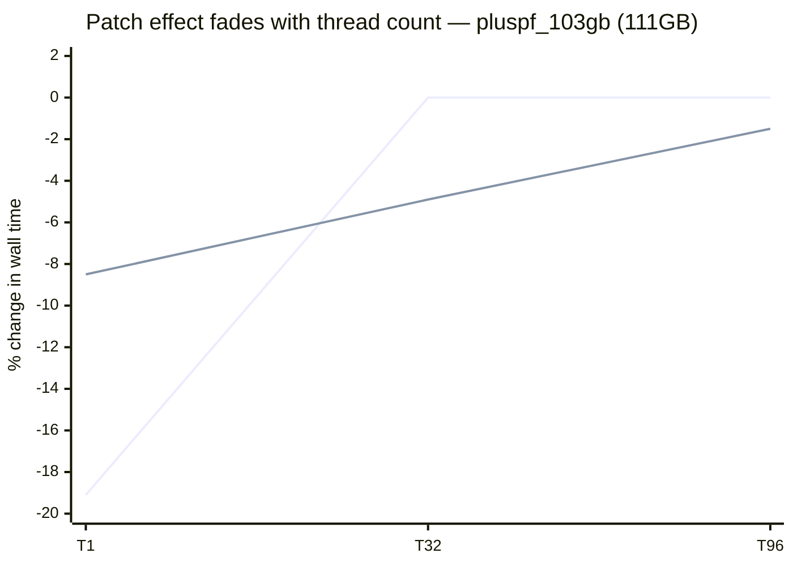

At 1 thread, the patch's ~19% gain is its best showing anywhere in the sweep. By 96 threads, that gain has faded to essentially nothing.

The leading theory ties directly back to how Patch 4 (the thread-local k-mer cache, Kolin sir's design) is built. Each thread gets its own small, private cache — no sharing, no contention, but also no visibility into what any other thread has seen. At 1 thread, there's only one cache, and it sees the *entire* stream of reads — every repeated k-mer anywhere in the whole workload passes in front of it, so it catches essentially all of the reuse there is to catch. At 96 threads, the same workload is split 96 ways. A k-mer that repeats between two reads assigned to two *different* threads is invisible to both of their private caches — neither one ever sees both occurrences. More threads means more ways to split the work, which means more reuse silently slipping between the cracks.

This matters beyond this one benchmark. It's exactly the kind of gap the planned hardware-aware adaptive cache thesis piece is meant to address — a fixed-size, purely thread-local cache design has a blind spot that gets worse precisely as you scale up hardware, which is backwards from what you'd want.

### The one loose end, honestly flagged

Part D's earlier measurements (M1/M3) showed that the hash-table lookup function's share of total cache misses grows steadily with database size, which predicts the prefetch patch should help more on bigger databases. That prediction held cleanly at 1 thread — the patch's benefit does climb from roughly 0% on the smallest database up to 19% on the largest.

At higher thread counts, the picture gets muddier. `standard_16gb`'s patch effect turned out smaller in magnitude than `standard_8gb`'s at nearly every matching cell, despite the 16GB database having a larger measured share of lookup-related cache misses — the opposite of what the size trend would predict. The likely explanation is that two effects are tangled together here: prefetching getting more useful as databases grow, and the thread-local cache getting less effective as thread count grows, pulling in opposite directions at once. Because all four patches were tested together as one bundle rather than switched on individually, these two effects were never cleanly separated. That's an honest open question for future work — testing the prefetch patch and the cache patch in isolation from each other — not a flaw in what was measured here.

### The takeaway

> [!TIP]
> Turn `-M` on for any run against a large database, starting now. It costs nothing — no code change, no rebuild — and on the databases this project actually cares about, it delivers a bigger win than the entire four-part optimization patch combined. There is no reason to run a large database without it.

With the sweep complete and both findings on the table — one flag worth more than a patch, and a patch whose own benefit depends on database size and shrinks with thread count — the next question is what all of this adds up to, and what's left to do.

---

## Part F: What's Next, the Fibonacci Hashing Homework, and How to Check Any of This Yourself

This closing section does three jobs. First, it collects everything left open from both sessions into one punch list — nothing here is a surprise, it's all flagged earlier in this report, just gathered in one place so it doesn't get lost. Second, it delivers a piece of reading that was assigned back in the Week 1 plan and never done: Fibonacci hashing. You'll actually understand the mechanism by the end of this section, not just know it exists. Third, it gives you a map — a glossary, a citation list, and pointers to every raw log — so that if you want to verify any number in this report yourself, you know exactly where to look.

### What's next

The open items fall into four groups: two are data/infrastructure problems that block future reruns, one is a profiling gap, one is a piece of session housekeeping, and one is a recommendation you can act on immediately.

**Group 1 — Missing data, worth flagging upward.**

- **The `eskape_650mb` and `eskape_human_4gb` Kraken2 databases are gone, and nobody knows why.** The build script that made them is supposed to delete only the `taxonomy/` and `library/` folders *inside* each database directory once the build finishes — that part is expected and documented. But the top-level database folders themselves, along with their finished `.k2d` index files, are also gone. Nothing in the documented process explains that second, bigger loss. Only the build `.log` files survived. This is worth a direct note to Kolin sir, because it means any future Kraken2 rerun against either of those two specific databases needs a full rebuild from scratch, not a quick re-point of a script.
- **The 200-genome download ceiling was never root-caused.** Three independent fixes — lower parallelism, a proxy fix, and a fresh cache with retries enabled — all landed on the exact same 200-out-of-1149 result. That rules out flakiness; something structural is capping the download. The leading theory is that `ncbi-genome-download` v0.3.3 is too old for how NCBI's current catalog structures newer, high-accession-number assemblies. Nobody has tried the obvious fix yet: `pip3 install --user --upgrade ncbi-genome-download`, then rerun. That's a five-minute experiment that hasn't happened.

**Group 2 — A profiling gap.**

- **The exact function or lock behind Centrifuge's 96-thread collapse is still unknown.** You know the shape of the problem — IPC drops from ~1.5 at 32 threads to ~0.2-0.3 at 96, cycles balloon roughly 10x while instructions only double, which is the textbook signature of threads waiting on each other rather than computing. You do not know *which* function or lock is responsible. That needs a `perf record --call-graph dwarf` pass followed by `perf report` — a deeper, slower profiling method than the `perf stat` summaries used everywhere else in this report. This was the Week 1 plan's own stretch goal and it never got run.

**Group 3 — Session housekeeping.**

- **One patch-application file has no backup.** When the optimization patch was hand-applied, three of the four touched files were backed up before editing. The fourth, `compact_hash.cc`, was not — it turned out to be the real home of `Get()`'s implementation, discovered only after backups had already been taken of the wrong file (`compact_hash.h`, which has just the declaration). This is small and low-risk: the exact insertions are fully reproducible from the command log, and the baseline reconstruction that undid them was verified byte-for-byte against stock Kraken2. But it's worth naming explicitly so nobody assumes a `.pre_opt_v1` file exists for that file when it doesn't.

**Group 4 — A recommendation you can act on now.**

- **Adopt `-M` (memory-mapping) as the default invocation for large-database runs, starting immediately.** This isn't speculative — it's the best-supported finding in the whole patch session, and it costs nothing to adopt. See Part D for the full mechanism and the 12-14x numbers.

Here's the same list as a map, tying each thread back to which thesis or follow-up it feeds:

```mermaid
flowchart TD
    Root["Open threads after Week 1 + patch session"] --> T1["Thesis 1: hardware-aware<br/>adaptive k-mer cache"]
    Root --> T2["Thesis 2: cell-width reduction<br/>+ double hashing"]
    Root --> CF["Centrifuge follow-ups"]
    Root --> PS["Patch-session follow-ups"]

    T1 --> T1a["Build on Patch 4 +<br/>thread-dilution finding"]
    T1 --> T1b["4-way set-associative baseline"]
    T1 --> T1c["LLC-topology-aware sizing"]

    T2 --> T2a["3 future-work items from<br/>kraken2opti_report.tex Sec 5"]
    T2 --> T2b["Merge with Thesis 1's cache"]
    T2 --> T2c["Linear probing -> double hashing"]

    CF --> CF1["perf record --call-graph dwarf:<br/>find the exact lock behind<br/>the 96T IPC collapse"]
    CF --> CF2["Fibonacci hashing reading<br/>(delivered below, this section)"]
    CF --> CF3["Missing eskape_650mb/eskape_human_4gb DBs —<br/>note to Kolin sir, full rebuild needed"]
    CF --> CF4["200-genome ceiling —<br/>try upgrading ncbi-genome-download"]

    PS --> PS1["No backup exists for<br/>compact_hash.cc edits (low risk)"]
    PS --> PS2["Adopt -M as default invocation<br/>for all large-DB runs, effective now"]

    Root --> LLM["Ask LLMs for additional ideas<br/>on both thesis pieces (Kolin sir's suggestion)"]
```

### The homework: Fibonacci hashing

This was assigned in the Week 1 plan as reading, before any Centrifuge work started. It never got done. Here it is, properly.

**Why you need this at all.** A hash table's whole job is to turn a key into a slot number, fast, so a lookup doesn't have to scan the table. The naive way to pick a slot is `key % table_size` — divide the key by the table size and keep the remainder. That works, but it has a real failure mode: it only looks at the *low* bits of the key. If your keys have any pattern in their low bits — and DNA k-mers, encoded as integers, often do, because biological sequences are full of repeats and non-random structure, not noise — those patterns pile keys into the same handful of slots while other slots sit empty. A hash table with uneven slot occupancy is slower everywhere it matters: more collisions, longer probe chains, worse cache behavior. You want a method that spreads keys out evenly no matter what patterns exist in the input.

**The mechanism.** Multiply the key by a large, odd 64-bit constant, and take the *top* bits of the product as the slot number:

`slot = (key * C) >> (64 - b)`

where `C` is close to `2^64 / φ` (φ being the golden ratio — this is where "Fibonacci" comes from; the standard constant is `0x9E3779B97F4A7C15`) and `b` is the number of bits needed to address the table (`log2(table size)`). That's it: one multiply, one shift. No division, no modulo operation — which also happens to be faster on real hardware, since integer division is one of the slower basic CPU operations and this replaces it entirely.

**Why the top bits specifically, not just any bits.** This is the part that actually explains why it works, not just how. When you multiply two 64-bit numbers, every bit of the input ripples upward and influences the high bits of the 64-bit product — the top bits of a multiplication result are a scrambled function of the *entire* key, not just part of it. The low bits of a product, by contrast, are much more directly tied to only the low bits of the inputs. That's exactly backwards from what `key % table_size` does: modulo (and the bitwise-AND shortcut used for power-of-two tables) keeps the *low* bits of the raw key — the exact region where real biological sequence data tends to have non-random, repetitive structure that would otherwise cluster into a handful of slots. Fibonacci hashing sidesteps that failure mode by construction: multiply first, so the whole key's information gets mixed into the high bits, then read the slot number off the top, where that mixing has actually happened.

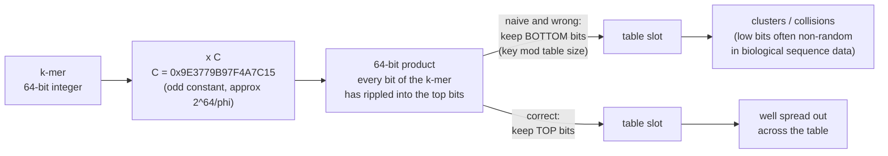

**Where this already lives in this project, unnamed.** Patch 4's thread-local k-mer cache (Part D) picks which of its 16,384 slots a lookup goes into by multiplying the k-mer by a fixed constant and taking the top bits. That is Fibonacci hashing. It was never named as such when the patch was written — it's just been sitting in the codebase doing this the whole time.

**Where it's headed next.** Thesis 2's planned move from linear probing to double hashing (Part E) needs two cheap, well-distributed hash functions, `h1` for the initial slot and `h2` for the probe step size. Fibonacci hashing is the leading candidate for building both: a single 64-bit product carries enough well-mixed bits that you can slice `h1` from the top and derive `h2` either from a different bit range or from a second, independent odd multiplier. This is explicitly planned future work, not yet implemented — and worth deciding deliberately rather than copying blindly, since slicing two hash functions out of correlated bits of the *same* product risks undermining exactly what double hashing needs (two probe sequences that don't track each other).

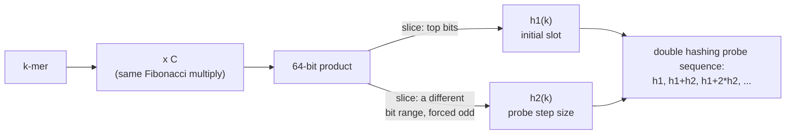

**One distinction worth holding onto.** Fibonacci hashing solves *where a key initially lands* — the mapping from key to first slot. It says nothing about *what happens when two different keys land on the same slot* — that's collision resolution, a separate layer of a hash table's design (linear probing vs. double hashing, covered in Part A's glossary). Conflating the two is an easy mistake to make and a costly one to unwind later in a design: fixing how keys are placed doesn't automatically fix what happens when two of them collide, and vice versa.

**The citation, honestly.** The standard academic source is Knuth, *The Art of Computer Programming, Volume 3: Sorting and Searching* (2nd edition, Addison-Wesley, 1998), Section 6.4, "Hashing," which introduces multiplicative hashing and the golden-ratio-derived multiplier specifically. A specific page range (508–513) shows up in secondary sources, but that range could not be independently verified against the book itself — treat it as unconfirmed and cite the section number (6.4) rather than a page range unless you get physical or library access to check. For the practical, worked-example version of the same idea — clearly secondary and further reading, not a substitute for the Knuth citation — see Malte Skarupke's 2018 blog post, ["Fibonacci Hashing: The Optimization that the World Forgot"](https://probablydance.com/2018/06/16/fibonacci-hashing-the-optimization-that-the-world-forgot-or-a-better-alternative-to-integer-modulo/). It's the easier entry point, and it's what the rest of this section's explanation leaned on for the mechanism.

### Glossary — quick reference

Full motivated explanations for these terms appear earlier in the report. This table is for looking one up fast.

| Term | One-line definition |
|---|---|
| k-mer | A fixed-length chunk of DNA (e.g. 31 letters) taken from a sliding window along a longer read. |
| minimizer | The one representative k-mer chosen from a window of k-mers, used to cut lookup work. |
| taxonomic classification | Assigning a DNA read to the species/organism it most likely came from. |
| reference genome / database | The known, pre-sequenced genome(s) a new read gets compared against. |
| FASTQ file | The standard file format for sequencer output: DNA letters plus a per-letter confidence score. |
| read | One fragment of DNA sequence output by a sequencing machine. |
| nanopore sequencing | A sequencing method that reads DNA by measuring electrical current changes as a strand passes through a pore. |
| ESKAPE pathogens | A standard six-genus benchmark set of antibiotic-resistant bacteria used to stress-test classifiers. |
| taxid | A unique numeric ID for a species/organism in a standard taxonomy, used instead of ambiguous names. |
| classified / unclassified read | Whether the tool found a confident database match for a read, or found none. |
| FM-index | A compressed, searchable index built from a genome that supports fast substring search without decompressing it. |
| Burrows-Wheeler Transform (BWT) | The reversible rearrangement trick that makes the FM-index both compressible and searchable. |
| backward search | The FM-index's search algorithm: matching a query one character at a time from its end, narrowing a range of candidate matches. |
| hash table | A structure that maps a key to a numeric address for near-instant lookup, used by Kraken2 to map k-mers to taxids. |
| compact hash table | Kraken2's space-squeezed hash table, packing each entry into a small fixed-width cell (e.g. 32/24/16 bits). |
| linear probing | Collision resolution by checking the next slot, then the next, until an empty one is found — Kraken2's current approach. |
| double hashing | Collision resolution using a second hash function to set the probe step size, spreading probes out more than linear probing. |
| load factor | The fraction of a hash table's slots currently occupied; higher means more memory-efficient but slower on average. |
| false positive (hashing context) | A lookup that wrongly reports a match because two different keys collided onto the same truncated cell. |
| CPU cache (L1/L2/L3/LLC) | Small, fast on-chip memory tiers that sit between the CPU and much-slower main memory (RAM). |
| cache hit / miss | Whether needed data was already in cache (fast) or had to be fetched from a slower tier (costly). |
| DRAM | The computer's main memory — much bigger than any cache, but far slower to reach. |
| LLC-load-miss rate | The percentage of memory reads that miss even the last-level cache and must go all the way to DRAM. |
| IPC (instructions per cycle) | The average number of CPU instructions completed per clock cycle; low IPC usually means the CPU is stalled waiting on memory. |
| thread / multithreading | An independent stream of instructions; multithreading runs several at once across CPU cores. |
| thread / lock contention | When threads compete for the same shared resource and end up waiting on each other instead of working. |
| NUMA | A multi-socket memory layout where each CPU has faster access to its own local RAM than to another socket's RAM. |
| TLB (translation lookaside buffer) | A small cache of virtual-to-physical memory address translations, separate from data caches. |
| huge pages | Larger memory pages (e.g. 2MB vs 4KB) that cut the number of TLB entries needed to cover a large region. |
| page fault | The event triggered when a program touches a memory-mapped page that isn't yet physically loaded, prompting the OS to fetch it. |
| mmap / memory-mapping | Making a file's contents appear in a program's address space without copying it all up front; pages load lazily on first touch. |
| software prefetching | Explicitly telling the CPU to start loading a predictable future memory address before it's actually needed. |
| thread-local storage | A variable for which each thread automatically gets its own private copy, avoiding shared-resource contention. |
| perf / perf stat | The Linux tool used throughout this project to read real CPU hardware counters (IPC, cache misses, etc.). |
| wall-clock time vs. CPU time | Real elapsed time a user experiences, versus total processor-seconds summed across all threads. |
| bandwidth-bound vs. latency-bound | Slow because too much data must move (bandwidth) vs. slow because each individual request takes too long (latency). |

### Sources and further reading

**Citations used in this report:**

| Citation | Link |
|---|---|
| Wood, D.E., Lu, J., & Langmead, B. (2019). "Improved metagenomic analysis with Kraken 2." *Genome Biology*, 20, 257. | https://doi.org/10.1186/s13059-019-1891-0 |
| Kim, D., Song, L., Breitwieser, F.P., & Salzberg, S.L. (2016). "Centrifuge: rapid and sensitive classification of metagenomic sequences." *Genome Research*, 26(12), 1721-1729. | https://genome.cshlp.org/content/26/12/1721 |
| Burrows, M., & Wheeler, D.J. (1994). "A Block-sorting Lossless Data Compression Algorithm." DEC SRC Research Report 124. | https://www.cs.jhu.edu/~langmea/resources/burrows_wheeler.pdf |
| Ferragina, P., & Manzini, G. (2000). "Opportunistic Data Structures with Applications." FOCS 2000, pp. 390-398. | https://people.unipmn.it/manzini/papers/focs00.html |
| Knuth, D.E. *The Art of Computer Programming, Vol. 3: Sorting and Searching* (2nd ed., 1998), Section 6.4, "Hashing." (Page range 508-513 seen in secondary sources — unconfirmed; cite the section, not the page range.) | No open-access link — library/physical copy |
| Skarupke, M. (2018). "Fibonacci Hashing: The Optimization that the World Forgot" — secondary/further-reading, not a substitute for the Knuth citation above. | https://probablydance.com/2018/06/16/fibonacci-hashing-the-optimization-that-the-world-forgot-or-a-better-alternative-to-integer-modulo/ |
| "Transparent Hugepage Support," The Linux Kernel Documentation. | https://docs.kernel.org/admin-guide/mm/transhuge.html |
| Chen, S., Ailamaki, A., Gibbons, P.B., & Mowry, T.C. (2004/2007). "Improving Hash Join Performance Through Prefetching." ICDE 2004 / ACM TODS 32(3). | https://www.pdl.cmu.edu/PDL-FTP/Database/icde04.pdf |

**Raw project logs — for command-by-command detail behind every number in this report:**

| File | What's in it |
|---|---|
| `dorado-kraken-research/centrifuge/WEEK1_FINDINGS.md` | The Centrifuge Week 1 write-up: install, index builds, benchmark results, IPC-collapse analysis, Orion decision. |
| `dorado-kraken-research/centrifuge/commands_log.md` | Every command run during the Centrifuge session, in order, with raw output. |
| `dorado-kraken-research/centrifuge/observations.md` | Side-by-side Kraken2 vs. Centrifuge species breakdowns and the genome-download saga's diagnostic detail. |
| `dorado-kraken-research/Luna/experiments/patch/commands_log.md` | The full patch-application session: every structural deviation found, the baseline-reconstruction steps, and the 48-cell benchmark sweep, command by command. |
| `dorado-kraken-research/docs/reports/kraken2_optimisation_report.md` | The formal optimization report: patch design (Sections 1-5) and filled-in real results (Section 6). |

### Reproducibility — the essentials

- **SSH:** `student@luna.cse.iitd.ac.in` (shared account).
- **Before any external download on Luna:** authenticate via `tmux` + `python3 ~/iitd-login.py -d`, then export the proxy: `HTTP_proxy`/`HTTPS_proxy`/`https_proxy`/`http_proxy` = `http://proxy62.iitd.ac.in:3128`. Missing this looks exactly like rate-limiting or a flaky tool — it isn't.
- **Centrifuge binaries:** `~/tools/centrifuge/` (on PATH).
- **Centrifuge indexes:** `~/AccuracyDrift/databases/centrifuge_sample_targeted/cf_base.*` and `~/AccuracyDrift/databases/centrifuge_eskape_200/cf_base.*`.
- **Kraken2 source (patch target):** `~/tools/kraken2-src/` (not `~/kraken2-src` — that path doesn't exist).
- **Standard test reads:** `~/results/basecalling/reads_hac.fastq` (104,918 reads), used for every baseline in this report.
- **Standard perf command pattern (Centrifuge, 32 threads):**
  ```
  perf stat -e cache-misses,cache-references,LLC-loads,LLC-load-misses,instructions,cycles \
    numactl --cpunodebind=0 --membind=0 \
    ~/tools/centrifuge/centrifuge -p 32 -x <index> \
    -U ~/results/basecalling/reads_hac.fastq \
    -S /dev/null --report-file /dev/null
  ```
  The Kraken2 equivalent follows the same shape — swap the binary, add `-M` to enable memory-mapping (see Part D).

### Why this week mattered

Two classifiers got put side by side, fairly, on the same hardware, the same reads, the same thread counts — and a specific, real bottleneck turned up in one of them. Not the bottleneck anyone expected going in, either: the FM-index literature predicts Centrifuge should struggle on cache misses, and instead its cache behavior beat Kraken2's at every single measurement. The actual problem was threading — something in Centrifuge's own implementation that falls apart past 32 threads — and that's a sharper, more useful thing to know than "it's slower" ever was.

Separately, an optimization patch that had existed only as a design document for months finally got applied, built, and benchmarked for real, cleanly separated from its own history of unverified estimates. The honest answer was modest: a few percent here, fading to nothing there, exactly the kind of unglamorous result that guesswork tends to round up.

And then, almost by accident, a bigger lever turned up than the whole patch effort combined — a flag that had simply never been tried, sitting unused since the project began, worth 12 to 14 times more than everything else in this report put together. Nobody found it by being clever. Somebody found it by asking why a default nobody had ever questioned was the default at all. That's the habit worth carrying into whatever comes next.
