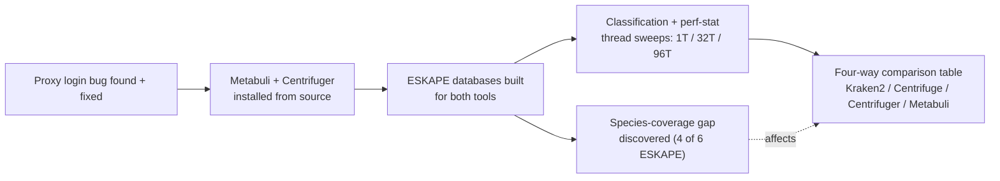
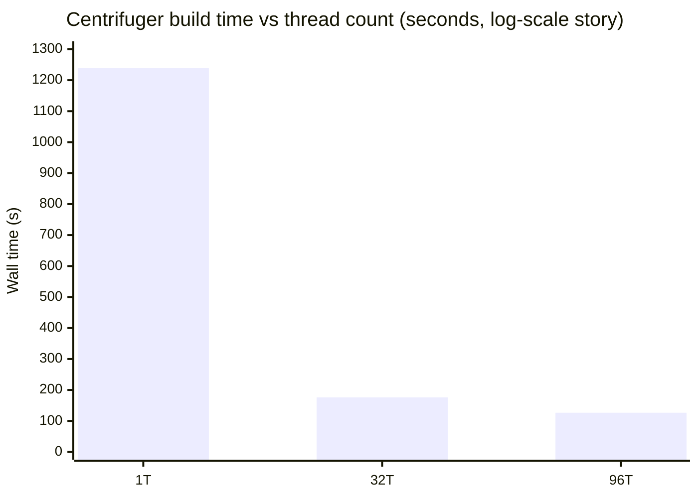
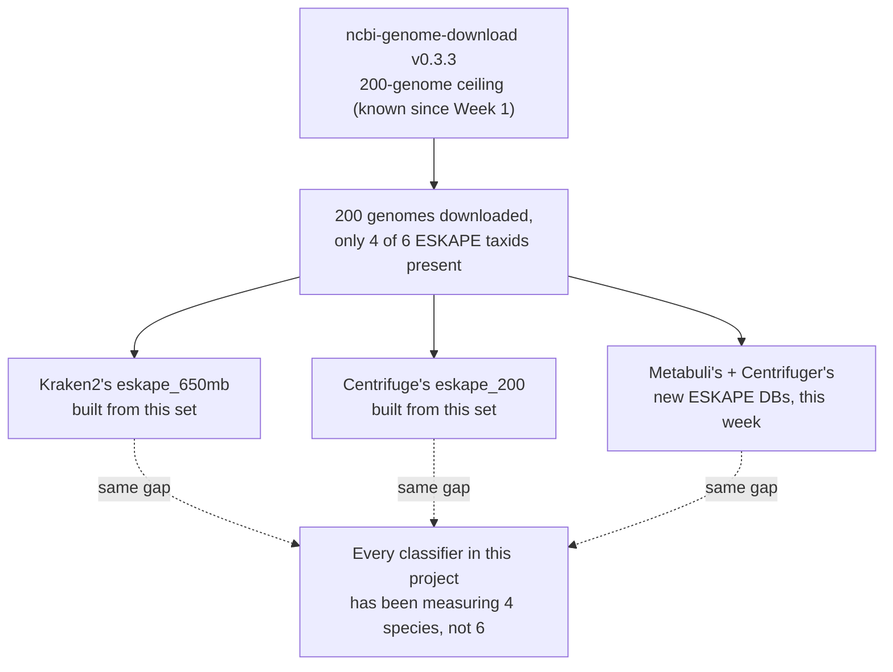
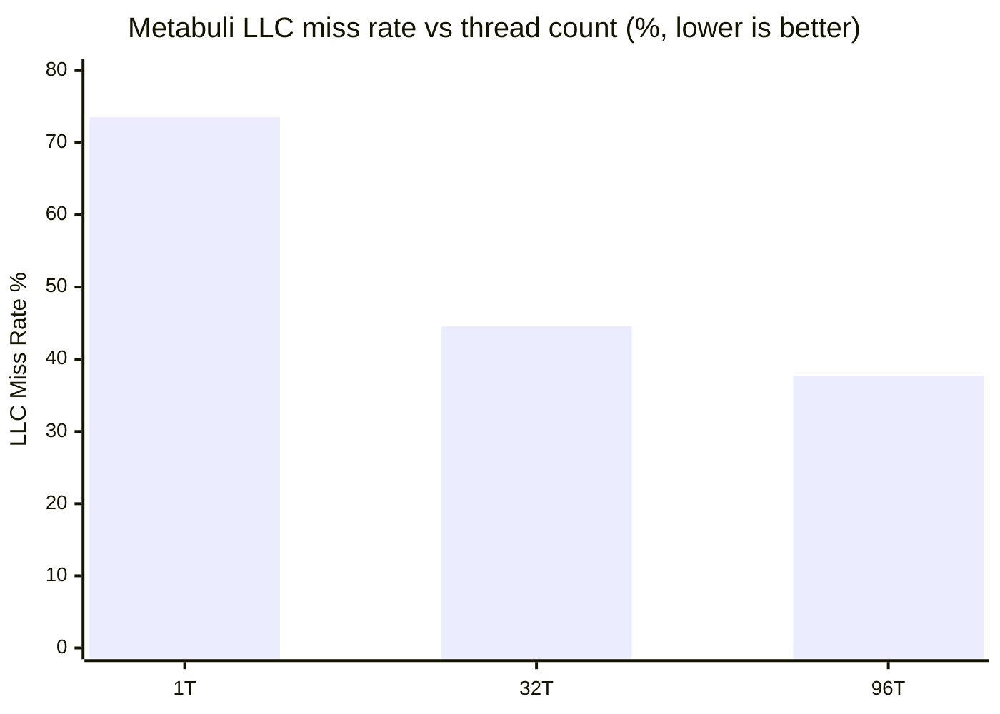
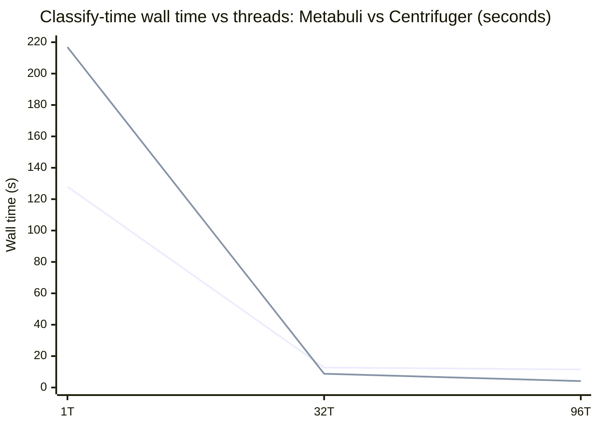
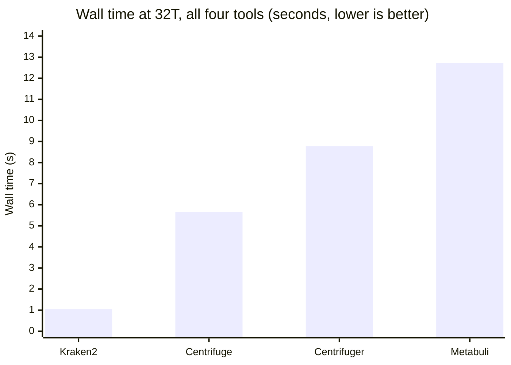
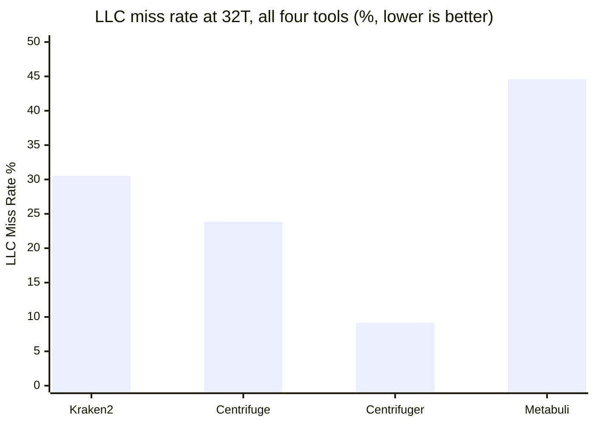
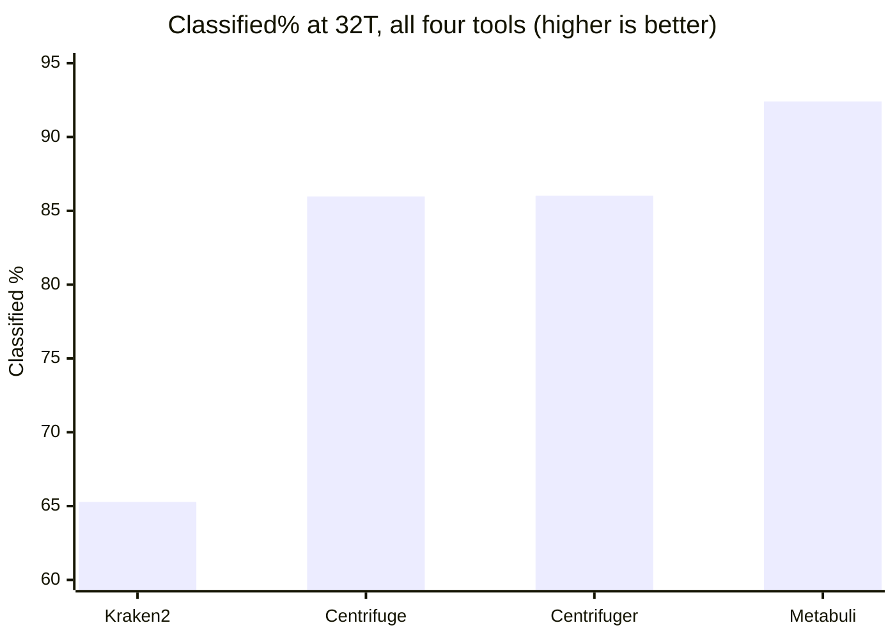
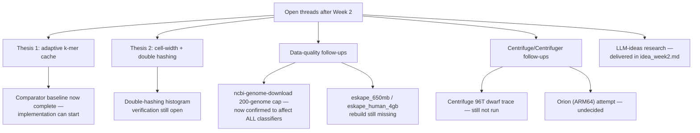

# Week 2 Report: Two New Classifiers, One Missing Pair of Species, and a Login Bug Hiding in Plain Sight

*Metabuli and Centrifuger joined the benchmark this week — and getting real numbers out of them surfaced a data gap that's been quietly sitting inside every classifier this project has ever run.*

This document is the single reference for Week 2: installing, building, and benchmarking two new metagenomic classifiers — Metabuli and Centrifuger — against the same ESKAPE data Kraken2 and Centrifuge already use, on the same machine (Luna), with the same `perf stat` methodology used everywhere else in this project. It's written for Kolin sir and for CK, and it assumes you've either read `WEEK1_REPORT.md` already or are willing to treat Kraken2 (hash table) and Centrifuge (FM-index) as given — Part A below explains the two *new* tools, not the two you already know. No background in bioinformatics or CPU performance is assumed beyond that.

> [!TIP]
> **If you read nothing else, read this.**
> - **A real, complete four-way comparison now exists** — Kraken2, Centrifuge, Centrifuger, and Metabuli, all measured with identical `perf stat` counters and `numactl` pinning, all against the same six-genome ESKAPE panel and the same 104,918 reads.
> - **The "six-genome ESKAPE panel" is actually a four-species panel**, and has been since before this week. Only 4 of the 6 named ESKAPE pathogens (missing *E. faecium* and *Enterobacter*) are actually present in the 200-genome set every classifier in this project — Kraken2 and Centrifuge included — has been built and measured against. This isn't a new bug; it's an old one, only now noticed.
> - **Centrifuger has the best cache locality of any tool tested** (9.15% LLC-miss at 32 threads, versus Kraken2's 30.53%) but is still ~8x slower than Kraken2 in wall time. **Metabuli is the opposite bet** — worst cache locality (44.57% LLC-miss) but the highest classified rate (92.41%). Neither beats Kraken2 outright; each trades away something Kraken2 doesn't have to.

## Why this week happened

Meeting 10 (2026-08-05) asked for a finalized benchmark shortlist beyond Centrifuge, framed explicitly as a time-vs-space tradeoff search rather than a hunt for one "best" tool — Kolin sir named Centrifuger directly and asked for ESKAPE-relevant tools with better cache-miss or GPU behavior. The full reasoning behind *why* Metabuli and Centrifuger were the two picked (and why Sylph was held and Bracken ruled out) already lives in `mtpweek2.md` — this report doesn't repeat that reasoning, it reports what happened once the picks were actually run.



All of it happened in one continuous Luna session on 2026-08-10 (day 1 of Week 2's schedule) — this report follows that session in order.

## How to read this document

- **Part A — what Metabuli and Centrifuger actually are.** The two new tools' mechanisms, briefly (Kraken2 and Centrifuge are assumed known from Week 1).
- **Part B — two bugs found before any real work could start.** A login bug that's been sitting in this project's own documented setup steps, and a data-format mismatch Metabuli's build step didn't tolerate.
- **Part C — building the ESKAPE databases.** Build times for both tools, and a real, counter-intuitive finding in how Centrifuger's build scales with threads.
- **Part D — the species-coverage gap.** The biggest cross-cutting finding this week: the ESKAPE panel every classifier in this project uses is missing two of its six named species.
- **Part E — classification results.** Thread sweeps for both new tools, and the completed four-way comparison.
- **Part F — what's next & appendix.** Open items, pointers to the LLM-idea research (`idea_week2.md`), glossary, citations, raw logs, and reproducibility.

---

## Part A: What Metabuli and Centrifuger Actually Are

### Metabuli: catching what exact k-mer matching misses

Kraken2 and Centrifuge both match DNA letter-for-letter. That works well until a nanopore read has an indel — an insertion or deletion introduced by the sequencer itself, not by biology — which shifts every k-mer downstream of it out of alignment with the reference, turning what should be a match into a mismatch. Portik et al. (2022) measured the real damage this does: on a PacBio HiFi mock community, Kraken2 correctly found all 20 true species but also called 96 false-positive species at default settings; Centrifuge did better but still called 16.

Metabuli's fix is to check two things at once instead of one: the raw DNA k-mer *and* its translated amino acid k-mer. DNA gets read out in triplets (codons) to produce amino acids, and there are three possible starting offsets on a strand, times two strands (forward and reverse complement) — six ways to group the same DNA into codons, six different "reading frames," each giving a different amino-acid sequence. Metabuli translates all six and keeps the DNA k-mer and its matching amino-acid k-mer paired together in one structure the paper calls a "metamer." An indel shifts the DNA reading frame at the exact point it occurs, which is why it wrecks a pure DNA match — but amino acids are more tolerant of small shifts (several different DNA triplets can code for the same amino acid), so the translated sequence often still lines up even when the raw DNA doesn't. That's the AA channel catching what the DNA channel alone would miss. The trade this makes: more compute per lookup (translating and hashing six frames instead of reading one k-mer), in exchange for surviving exactly the failure mode that hurts Kraken2 and Centrifuge on real nanopore data.

### Centrifuger: an FM-index rebuilt from scratch, not a patched Centrifuge

The name invites a lazy read — "Centrifuge with a version bump." It's the opposite: a from-scratch implementation, built independently of Centrifuge's Bowtie2-derived codebase. The core difference is in how the BWT itself gets compressed (see Week 1's Part A for what a BWT/FM-index is and why compressing it matters). Centrifuge compresses the whole rearranged text as one long run. Centrifuger instead breaks that same rearranged text into fixed-size blocks and compresses each block's *runs* (stretches of the same repeated letter) independently — a "run-block-compressed BWT." Working in smaller, independent blocks is what lets it support the fast lookups (rank queries) an FM-index needs without ever fully decompressing, while still shrinking the total size roughly in half versus Centrifuge's own approach at comparable scale. That independence matters mechanically, not just historically — Centrifuge's ARM64 build fails because of dead, x86-only CPUID-detection code it inherited from Bowtie2; Centrifuger doesn't carry that code, so it doesn't inherit that specific failure (this doesn't guarantee an ARM64 build succeeds, only that it isn't blocked by the same known cause — Orion testing is still open, see Part F).

Centrifuger's whole design point is memory: the published full-scale index (140-Gbp RefSeq prokaryotic) is 41GB on disk versus roughly double that for a comparable Centrifuge-scale index, a real memory win bought by giving up some speed (Song et al. 2024 report roughly half Centrifuge's throughput at matching thread counts) and by improving accuracy along the way (species-level sensitivity up 54.1% over Kraken2 on CAMI2).

### All four tools, side by side

| Tool | Core structure | What it's optimizing for | ARM64 story |
|---|---|---|---|
| Kraken2 | Hash table of k-mers/minimizers → taxid | Speed, at a large memory cost | Untested this project, presumed fine (pure C++, no x86-only asm) |
| Centrifuge | FM-index / BWT (Bowtie2-derived) | Small memory footprint | Broken — dead x86 CPUID asm inherited from Bowtie2 |
| Centrifuger | FM-index / RBBWT (from scratch) | Smaller memory + better accuracy than Centrifuge | Unknown — no known blocker, never confirmed working (Part F) |
| Metabuli | Joint DNA + amino-acid k-mer ("metamer") | Sensitivity on indel-heavy long reads | Untested this project; prebuilt ARM64 binaries exist upstream |

With the two new tools' mechanisms in hand, the rest of this report follows what happened when they actually got installed, built, and run.

---

## Part B: Two Bugs Found Before Any Real Work Could Start

Before either bug below, there was a smaller, unresolved anomaly worth naming honestly rather than glossing over: the very first `tmux` attach attempt this session exited immediately instead of opening an interactive session. A follow-up check (disk space, `$TERM`, and a detached-session create/kill test) ruled out the obvious causes — disk wasn't full, the terminal type was normal, and the tmux server itself created and killed a detached session fine. The next attach attempt, a few steps later, worked normally and the glitch never recurred. It's treated here as resolved-by-not-recurring, not root-caused — worth a line so it isn't mistaken for something that was fully explained.

### B1 — a login bug that's been sitting in this project's own setup docs

Before any install or download, Luna needs two things: a `tmux`-resident login session (`iitd-login.py`) authenticated *without* a proxy, and — once logged in — the institutional proxy (`proxy62.iitd.ac.in:3128`) set for everything after. This project's own `CLAUDE.md` documents the exact unset-then-login command. It failed, five times in a row, with `You can't login from a proxy server`.

The proxy variables were supposedly unset first (`env -u http_proxy -u https_proxy -u HTTP_PROXY -u HTTPS_PROXY python3 iitd-login.py -d`). Checking the actual environment turned up the real problem: the variables that were *actually set* were `HTTP_proxy` / `HTTPS_proxy` — mixed case — not the all-caps `HTTP_PROXY` / `HTTPS_PROXY` the unset command targeted. Environment variable names are case-sensitive on Linux, so those two were never unset at all. Python's `urllib` lowercases variable names when checking for a proxy, so the leftover mixed-case variables alone were enough to keep routing the login request through the proxy the portal was rejecting it for.

> [!IMPORTANT]
> This was a real bug in this project's own documented login snippet (`dorado-kraken-research/CLAUDE.md`, previously line 33), not a one-off typo in a single session — anyone following that doc's exact unset command would hit the same five failures. Fixed in commit `1635e48`.

Once the command targeted the correct case (`HTTP_proxy`/`HTTPS_proxy`/`https_proxy`/`http_proxy`), login succeeded on the first try, and a follow-up `curl` check against `https://github.com` returned `200` — real outbound access confirmed, not just "no error."

### B2 — Metabuli wanted a file format that didn't exist yet

Metabuli's `build` command takes three inputs: a FASTA list, a taxonomy directory, and an `accession2taxid` file. This project already had an accession→taxid map from Centrifuge's Week 1 build (`eskape_genomes_seqid2taxid.map`) — a simple 2-column file, versioned accession plus taxid, no header. The plan document assumed this would work directly.

It didn't, and rather than guess at a fix, the actual parser got read: `fillAcc2TaxIdMap` in Metabuli's `common.cpp` (line 264) explicitly skips the first line as a header, then parses every remaining line with `sscanf(line, "%s\t%*s\t%d\t%*d")` — i.e. it expects NCBI's real 4-column `accession2taxid` format (bare accession, versioned accession, taxid, GI number), using the *bare, version-stripped* accession as the lookup key. The existing 2-column file matched none of that shape.

Rather than download NCBI's full official `accession2taxid` mapping (multi-gigabyte, covers all of GenBank, to look up taxids for 200 genomes already mapped locally), a minimal, correctly-shaped file was synthesized directly from the existing map with one `awk` command — strip the version suffix for column 1, keep the original accession in column 2, add a header row and a dummy GI column. Confirmed working on the first real build attempt afterward.

Two smaller, non-blocking decisions rounded out this phase: **conda was absent** on the Luna account entirely (no `conda`, no `miniconda3`/`anaconda3`/`miniforge3` anywhere on the search path), so both tools were built from source via `git clone` + `make`/`cmake` instead of the plan's conda-first path — consistent with how every other tool in this project (Kraken2, Centrifuge) was already built. **cmake was also missing** (needed for Metabuli, not Centrifuger) and installed via `apt` after confirming with CK, since it changes shared-account system state.

---

## Part C: Building the ESKAPE Databases

Both tools reused the same 200-genome ESKAPE reference data and taxonomy already on disk from Week 1's Centrifuge build — no new downloads.

### Metabuli's build

One run, 32 threads, default 400GB RAM cap:

| Metric | Value |
|---|---|
| Wall time | 2m35.570s |
| k-mers extracted | 478,999,005 |
| Unique k-mers written | 24,977,880 |
| Accession mapping | 693 observed accessions, all mapped — zero skipped |
| Taxonomy loaded | 2,840,139 nodes, 99,346 merged nodes |

### Centrifuger's build — and a real thread-scaling surprise

Centrifuger's build was run at three thread counts to complete a full sweep, matching how every other benchmark in this project is measured:

| Threads | Wall time | Speedup vs 1T |
|---|---|---|
| 1 | 1239.1s (20m39s) | 1.00x |
| 32 | 176.0s (2m56s) | 7.04x |
| 96 | 126.6s (2m07s) | 9.79x |



Every classify-time thread sweep measured anywhere in this project so far — Kraken2, and (see Part E) both Metabuli and Centrifuger's own classify step — either peaks around 32 threads and degrades, or shows diminishing returns past it. Centrifuger's **build** step doesn't: it keeps improving all the way to 96 threads, a further 1.39x gain on top of the 32-thread number, no degradation. The likely mechanistic reason, inferred from the build's own log output rather than independently confirmed with a call-graph trace: index construction is suffix-array sorting split into independent chunks (17 chunks at 32 threads, 66 chunks at 96 threads) — far more embarrassingly parallel than the memory-bound hash/k-mer lookups that dominate every classify-time workload in this report. That's a claim about *wall-time scaling behavior*, not about cache-miss magnitude — the perf-stat table below actually shows a higher LLC-miss rate at build time (42-44%) than Kraken2's own classify-time number (30.53%, Part E), so "more parallel" here means "wall time keeps improving despite the misses," not "there are fewer misses to begin with." The 1T→32T speedup (7.04x for 32x the threads) is still well sub-linear, reflecting real coordination/merge overhead across chunks even in this favorable case.

A `perf stat` capture at 32T and 96T on the build step (a first for this project — build has never been profiled before, only classify) confirms the same story mechanically:

| Threads | Wall time | Cache Miss Rate% | LLC Miss Rate% | IPC |
|---|---|---|---|---|
| 32 | 167.568s | 52.83% | 42.44% | 1.66 |
| 96 | 132.584s | 51.24% | 44.02% | 1.74 |

A small uptick in LLC miss rate at 96T (more threads sharing LLC bandwidth during parallel chunk-sorting) shows up here, but unlike classify-time workloads, wall time still improves and IPC still rises — the added parallelism wins outright at build time, in a way it doesn't during classification.

---

## Part D: The Species-Coverage Gap — a Quiet Problem Affecting Every Number in This Project

### What was found

Metabuli's build reported only 4 unique taxIDs across all 200 genome files — surprising for a "6-species ESKAPE panel." Checking the source data directly (`eskape_genomes_seqid2taxid.map`) confirms it: only 4 distinct taxIDs exist in the file at all — 287 (*Pseudomonas aeruginosa*), 470 (*Acinetobacter baumannii*), 573 (*Klebsiella pneumoniae*), 1280 (*Staphylococcus aureus*). **_Enterococcus faecium_ and *Enterobacter* species are completely absent** — not filtered out somewhere downstream, never present in the reference set to begin with.

### Why, and how far it reaches

This traces back to the already-known `ncbi-genome-download` v0.3.3 200-genome ceiling (documented since Week 1, still not root-caused — see Part F). The download that built this reference set simply stopped at 200 genomes before it reached every named ESKAPE species.

> [!IMPORTANT]
> This isn't a new bug introduced this week — it's an old one nobody had checked for until Metabuli's build made it visible. Kraken2's `eskape_650mb` and Centrifuge's `eskape_200` were both built from the same underlying genome set. **Every ESKAPE-panel number this project has ever reported — across all four classifiers now benchmarked, across every prior session — has actually been measuring a 4-species panel, not 6.** This doesn't invalidate any of those numbers (the tools were correctly classifying against the data they were actually given), but it does mean "ESKAPE panel" in every table so far, including the ones later in this report, should be read as "the 4 ESKAPE species this project's download happened to capture," not the full canonical six.



Fixing this needs the same 200-genome-ceiling investigation Week 1 already flagged and deferred (try `pip3 install --user --upgrade ncbi-genome-download` first, per Week 1's own recommendation) — it's now a materially higher-priority item than it was last week, since it's confirmed to affect every tool, not a hypothetical gap (see Part F).

---

## Part E: Classification Results

### E1 — Metabuli thread sweep: cache locality improves as threads increase

| Threads | Wall time | Cache Miss Rate% | LLC Miss Rate% | IPC |
|---|---|---|---|---|
| 1 | 127.977s | 83.10% | 73.55% | 2.43 |
| 32 | 12.731s | 78.97% | 44.57% | 2.07 |
| 96 | 11.491s | 71.39% | 37.74% | 1.16 |

LLC miss rate falls monotonically as thread count rises (73.55% → 44.57% → 37.74%) — the opposite of the naive "more threads sharing one cache means more contention" expectation. The likely mechanism: at 1 thread, a single thread sorts/searches the full 705-million-k-mer query buffer serially over one large, diffuse working set; at higher thread counts, that same work is partitioned into smaller per-thread chunks with better individual locality, and that locality win outweighs the added LLC-sharing pressure. IPC still drops from 32T to 96T (2.07 → 1.16), matching the same "past the sweet spot, contention costs more than it gives back" pattern already documented for Kraken2's own 32T/96T numbers.



At 1 thread, Metabuli's wall time (128.0s) lands close to Centrifuge's own 1T number on `eskape_200` (134.46s, from Week 1) — both far slower than Kraken2's 1T number (21.98s).

### E2 — Centrifuger thread sweep: cache locality barely moves at all

| Threads | Wall time | Cache Miss Rate% | LLC Miss Rate% | IPC | Classified% |
|---|---|---|---|---|---|
| 1 | 216.881s | 10.45% | 10.07% | 1.13 | 86.02% |
| 32 | 8.777s | 9.60% | 9.15% | 1.11 | 86.02% |
| 96 | 4.087s | 9.34% | 8.73% | 0.88 | 86.02% |

Centrifuger's LLC miss rate stays remarkably flat across the whole thread range (10.07% → 9.15% → 8.73%) — far less thread-sensitive than either Kraken2 or Metabuli. Wall time keeps improving all the way to 96T (216.9s → 8.8s → 4.1s), even as IPC drops (1.11 → 0.88) — unlike Kraken2, which can get *worse* at 96T on wall-clock, Centrifuger's raw parallelism win outweighs the per-cycle efficiency loss all the way through classify-time too, not just at build-time (Part C).



### E3 — The completed four-way comparison, 32 threads

All four tools, identical `perf stat` event list, identical `numactl --cpunodebind=0 --membind=0` pinning, same 104,918-read `reads_hac.fastq`, same underlying 4-species ESKAPE reference (Part D). Centrifuge's classified% — left blank in this week's working log — is filled in here from its own Week 1 record (`centrifuge/commands_log.md` §4.4/§4.5), completing the table for the first time:

| Tool | Wall time | Cache Miss Rate% | LLC Miss Rate% | IPC | Classified% |
|---|---|---|---|---|---|
| Kraken2 (`eskape_650mb`) | 1.045s | 36.23% | 30.53% | 1.37 | 65.28% |
| Centrifuge (`eskape_200`) | 5.653s | 21.90% | 23.82% | 1.46 | 85.97% |
| Centrifuger (`cg_base`) | 8.777s | 9.60% | 9.15% | 1.11 | 86.02% |
| Metabuli (`metabuli_eskape`) | 12.731s | 78.97% | 44.57% | 2.07 | 92.41% |







> [!IMPORTANT]
> Carrying forward Week 1's own caveat, now sharper with four tools instead of two: **treat Classified% as informative, not a clean ranking axis.** Each tool ships its own default confidence/score threshold for calling a read "classified," and none of the four have been rerun with matched thresholds. A tool that classifies more reads at a looser threshold isn't necessarily more accurate — it may just be more permissive. This table uses each tool's out-of-the-box defaults, the same way Week 1 did for Kraken2 vs. Centrifuge, and the same fix applies: a matched-threshold rerun before any classified% gap gets treated as a real sensitivity finding rather than a threshold artifact.

### E4 — What the four-way comparison actually says

No tool wins on every axis, and the pattern is consistent, not noisy:

- **Kraken2** is fastest by a wide margin (1.045s) and has the best cache locality *relative to its own historical numbers*, but the worst LLC-miss rate of the four in this specific table (30.53%) and the lowest classified rate (65.28%) — consistent with the 4-species-panel gap from Part D hitting a pure-DNA exact-match classifier hardest, since it has no fallback channel when a k-mer doesn't hash-match cleanly.
- **Centrifuge** sits in the middle on every axis — a real, working alternative with a smaller memory footprint than Kraken2, but no longer holding the best cache-locality position it held in Week 1's two-tool comparison, now that Centrifuger is in the picture.
- **Centrifuger** has the best cache locality of all four (9.15% LLC-miss, roughly a third of Centrifuge's own 23.82%) — its whole design point (a leaner, more compressed FM-index than Centrifuge) shows up directly in this number — while still being 8.4x slower than Kraken2 in wall time. Leanest memory-access pattern does not translate into fastest tool.
- **Metabuli** is both slowest and has by far the worst cache locality (44.57% LLC-miss, worse than Kraken2's own worst number here), but classifies the highest proportion of reads (92.41%) and has the highest IPC (2.07) of the four — its accuracy-first, dual-channel design shows up clearly as *more real compute per lookup*, not just more waiting.

This is the same time/space/accuracy tradeoff curve `mtpweek2.md` already lays out from the literature — the difference is that every number in this section's table is now a real, matched-methodology measurement on this project's own data, not a citation pulled from four different papers on four different reference databases. Both thesis directions (the adaptive cache and the cell-width/double-hashing work) are explicitly bets on holding Kraken2's current position on this curve — fastest, cheapest, worst cache locality — while narrowing the memory and accuracy gap without giving the speed up. This week's numbers are the first time that curve has been drawn from this project's own matched measurements instead of borrowed ones.

---

## Part F: What's Next & Appendix

### Open items, updated

| Item | Status after this week |
|---|---|
| **`ncbi-genome-download` 200-genome ceiling** | Unchanged in cause, but now confirmed to affect every classifier's ESKAPE numbers (Part D) — higher priority than before. Untried fix: `pip3 install --user --upgrade ncbi-genome-download`. |
| **`eskape_650mb` / `eskape_human_4gb` Kraken2 DBs still missing** | Unchanged, still deferred — a full rebuild would also need to fix the species-coverage gap above, not just restore what was lost. |
| **Centrifuge 96T IPC collapse — `perf record --call-graph dwarf` trace** | Not run. No similar collapse observed in Metabuli or Centrifuger's own thread sweeps this week (both keep improving or hold flat to 96T) — worth noting as a Centrifuge-specific pattern, not a general one across FM-index tools, since Centrifuger is also FM-index-based and doesn't show it. |
| **`compact_hash.cc.pre_opt_v1` backup missing** | Unchanged, low priority, deferred. |
| **Orion (ARM64) attempt for Metabuli/Centrifuger** | Undecided as of this session — Metabuli's ARM64 path is near-zero-cost (prebuilt binary), Centrifuger's is the genuine unknown (never confirmed building on ARM64 anywhere). Speed on Luna doesn't predict ARM64 build/run compatibility, so this stays open rather than skipped outright. |
| **Double-hashing starter study** | Formula written down and checked against sources (`mtpweek2.md`); the histogram-based "verify h1/h2 are really decorrelated on real k-mer data" check has not been run yet. |
| **MetaCache-GPU stretch goal** | Not attempted this week; correctly gated behind both comparators landing first. |
| **Metabuli `--max-ram 400` classify run ran ~2x slower than default RAM** | Single-run result (27.366s vs. 13.438s at 32T, near-identical user CPU time), flagged in the raw log as possible noise, not a confirmed finding. Needs repeat runs before citing either direction — not otherwise discussed in this report. |
| **Thesis 1 / Thesis 2 implementation** | Still not started — correctly sequenced behind comparator lock-in, which this report's Part E now completes. |
| **LLM ideas for both theses (Kolin sir's ask)** | Delivered separately, in full, in `idea_week2.md` — a 7-agent, 2-round research and verification pass covering both theses plus a new comparator candidate (Kun-peng). Not reproduced in this report; see that file directly. |



### Glossary — new terms this week

Full definitions for Kraken2/Centrifuge-era terms (k-mer, hash table, FM-index, BWT, LLC, IPC, etc.) are in `WEEK1_REPORT.md`'s glossary — not repeated here.

| Term | One-line definition |
|---|---|
| Metamer | Metabuli's combined structure pairing a DNA k-mer with its translated amino-acid k-mer in one lookup. |
| RBBWT (run-block-compressed BWT) | Centrifuger's own compressed-index variant, built independently of Centrifuge's Bowtie2-derived FM-index. |
| `accession2taxid` | NCBI's standard 4-column format mapping a genome accession to its taxonomic ID — the format Metabuli's build step requires. |
| taxdump | NCBI's full taxonomy archive (`nodes.dmp`, `names.dmp`, `merged.dmp`) — the real, ~2.5-million-taxon tree, as opposed to small toy fixtures that can look superficially similar. |
| Classified% | The percentage of input reads a classifier assigned to any taxon, as opposed to leaving unclassified. |

### Citations

| Citation | Link |
|---|---|
| Kim, J. & Steinegger, M. (2024). "Metabuli: sensitive and specific metagenomic classification via joint analysis of amino acid and DNA." *Nature Methods*, 21, 971-973. | https://www.nature.com/articles/s41592-024-02273-y |
| Song, L. & Langmead, B. (2024). "Centrifuger: lossless compression of microbial genomes for efficient and accurate metagenomic sequence classification." *Genome Biology*, 25, 106. | https://link.springer.com/article/10.1186/s13059-024-03244-4 |
| Portik, D.M., Brown, C.T. & Pierce-Ward, N.T. (2022). "Evaluation of taxonomic classification and profiling methods for long-read shotgun metagenomic sequencing datasets." *BMC Bioinformatics*, 23, 541. | https://link.springer.com/article/10.1186/s12859-022-05103-0 |
| Tan, S., Majidian, S., Langmead, B. & Zakeri, M. (2025). "Movi Color: fast and accurate long-read classification with the move structure." bioRxiv preprint. | https://pmc.ncbi.nlm.nih.gov/articles/PMC12154825/ |

### Raw logs — for command-by-command detail behind every number in this report

| File | What's in it |
|---|---|
| `dorado-kraken-research/Luna/experiments/mtpweek2/commands_log.md` | Every command run this week, in order, with raw output — the primary source for this entire report. |
| `mtpweek2.md` | The full week plan: tool-shortlist reasoning, literature-sourced tradeoff table, double-hashing starter formula, GPU stretch-goal build path, full citation list. |
| `dorado-kraken-research/centrifuge/commands_log.md` | Source of the Centrifuge `eskape_200` classified% (85.97%) used in Part E's four-way table. |
| `dorado-kraken-research/AccuracyDrift/RESULTS.md` | Source of the Kraken2 `eskape_650mb` 32T row (65.28% classified) used in Part E's four-way table. |
| `idea_week2.md` | The LLM-sourced idea catalog for Thesis 1 and Thesis 2, point-wise, with novelty assessments. |

### Reproducibility — the essentials

- **Metabuli binary:** `~/tools/Metabuli/build/src/metabuli`
- **Centrifuger binaries:** `~/tools/centrifuger/{centrifuger,centrifuger-build,centrifuger-quant}`
- **Metabuli ESKAPE DB:** `~/AccuracyDrift/databases/metabuli_eskape/`
- **Centrifuger ESKAPE index:** `~/AccuracyDrift/databases/centrifuger_eskape/cg_base` (plus `cg_base_1t`/`cg_base_96t` for the thread sweep)
- **Synthesized accession2taxid file:** `~/AccuracyDrift/databases/eskape_accession2taxid.tsv` (see Part B2 for the `awk` command that built it)
- **Standard perf command pattern (Metabuli, 32 threads):**
  ```bash
  perf stat -e cache-misses,cache-references,LLC-loads,LLC-load-misses,instructions,cycles \
    numactl --cpunodebind=0 --membind=0 \
    src/metabuli classify --seq-mode 3 \
    ~/results/basecalling/reads_hac.fastq \
    ~/AccuracyDrift/databases/metabuli_eskape \
    ~/AccuracyDrift/results/metabuli eskape_run_perf \
    --threads 32
  ```
- **Standard perf command pattern (Centrifuger, 32 threads):**
  ```bash
  perf stat -e cache-misses,cache-references,LLC-loads,LLC-load-misses,instructions,cycles \
    numactl --cpunodebind=0 --membind=0 \
    ./centrifuger -t 32 \
    -x ~/AccuracyDrift/databases/centrifuger_eskape/cg_base \
    -u ~/results/basecalling/reads_hac.fastq > output.tsv
  ```
  Note: Centrifuger's thread flag is `-t`, not `-p` (Centrifuge's own flag) — an easy mistake, made once this week (see raw log, command 48).

### Why this week mattered

Two new classifiers went from "never installed" to "fully profiled against the same data as everything else in this project" in one session, and the comparison that came out the other end is real — matched methodology, matched hardware, matched reference data — for the first time in this project's history. Neither new tool beats Kraken2 outright, and neither was expected to: Centrifuger trades speed for the best cache locality of the four, Metabuli trades both speed and cache locality for the highest classification rate. That's exactly the tradeoff-curve story both thesis directions are betting on protecting Kraken2's position against.

The bigger finding wasn't planned. A number that looked slightly odd in Metabuli's build log — "4 unique taxIDs" on a "6-species panel" — turned out to be a real, project-wide data gap that's been silently present since Week 1, affecting Kraken2 and Centrifuge's own numbers as much as this week's new ones. Nobody was looking for it. It showed up because a new tool's build log happened to print a count that didn't match expectations, and someone checked instead of assuming it was a tooling quirk. That's the same habit Week 1 closed on, and it paid off again.

Both theses were waiting on exactly this: a real, complete, matched-methodology comparator baseline before either one writes a line of implementation code. That baseline now exists — with one honest asterisk attached (the 4-species gap) that should get fixed before it hardens into the reference numbers either thesis gets measured against.
