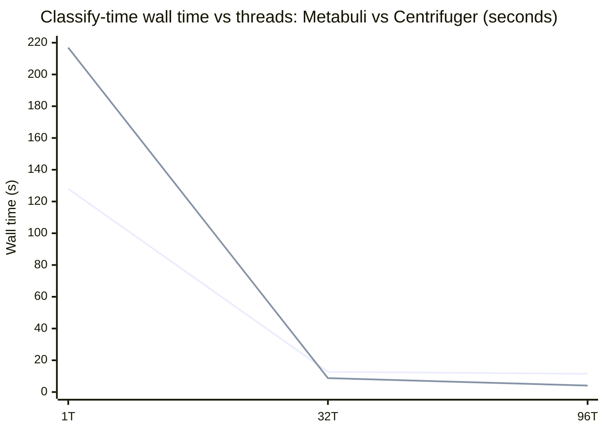
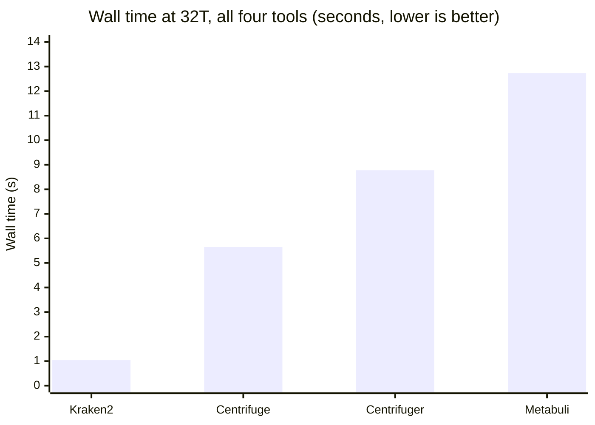

# Week 2 Report: Metabuli, Centrifuger, and a Four-Way Classifier Comparison

*Two new metagenomic classifiers — Metabuli and Centrifuger — were benchmarked against the same ESKAPE data as Kraken2 and Centrifuge, on the same machine, with the same methodology, producing the first complete four-way comparison in this project. Along the way, a data-quality gap was found that affects every tool's numbers, not just this week's. This document covers how the two new tools work, what came out of running them, and what the numbers mean for the two thesis directions.*

> [!TIP]
> **If you read nothing else, read this.**
> - **A real, complete four-way comparison now exists** — Kraken2, Centrifuge, Centrifuger, and Metabuli, all measured with identical counters and hardware pinning, against the same reads and reference data.
> - **The "six-species ESKAPE panel" is actually a four-species panel.** Only 4 of the 6 named ESKAPE pathogens (missing *E. faecium* and *Enterobacter*) are present in the reference data that every classifier in this project — Kraken2 and Centrifuge included — has ever been built and measured against.
> - **Centrifuger has the best cache locality of any tool tested** but is ~8x slower than Kraken2. **Metabuli trades the opposite way** — worst cache locality, but the highest classification rate. Neither beats Kraken2 outright; each gives up something Kraken2 doesn't have to.

**Quick definitions**, so the rest of this report makes sense without a bioinformatics or systems-performance background:
- **k-mer** — a short, fixed-length chunk of DNA letters. The basic unit all four tools compare against their reference database.
- **Index** — a preprocessed, compressed version of the reference genome data, built once and then reused for every read a tool classifies. All four tools' "database" is really one of these.
- **taxid / accession** — a taxid is a numeric ID for a species in NCBI's taxonomy; an accession is the unique ID for one specific genome record. Genome files get mapped accession → taxid so a tool knows which species a matched sequence belongs to.
- **Cache Miss Rate% vs. LLC Miss Rate%** — a CPU has several layers of cache before it falls back to slow RAM; Cache Miss Rate% is the overall miss rate across all of them, LLC Miss Rate% narrows to just the last, largest, slowest layer. The tables below show both, but the discussion focuses on LLC-miss rate — it's the more diagnostic number for "how cache-friendly is this tool's memory access pattern." Lower is better for both.
- **IPC (instructions per cycle)** — how much work the CPU gets done per clock tick. Higher usually means less time stalled waiting on memory.
- **Classified%** — the share of reads a tool assigned to *any* species rather than leaving unclassified. Each tool uses its own default confidence threshold for this, so a higher number isn't automatically "more accurate" (see the caveat in Part C).

---

## Part A: What Metabuli and Centrifuger Actually Are

### Metabuli — catching what exact k-mer matching misses

Kraken2 and Centrifuge both match DNA letter-for-letter. That breaks down on nanopore reads — a long-read DNA sequencing technology prone to indels (insertions or deletions introduced by the sequencer itself, rather than biology). An indel shifts every downstream k-mer out of alignment. Portik et al. (2022) measured the real damage: on a mock community (a lab-made mix of known species, used to test a classifier against a known ground truth), Kraken2 correctly found all 20 true species but also called 96 false positives (species reported that weren't actually there) at default settings; Centrifuge did better but still called 16.

Metabuli's fix (Kim & Steinegger 2024): check the raw DNA k-mer *and* its translated amino-acid k-mer at once. DNA can be read out in six different ways ("reading frames": 3 possible starting points x 2 strands), each producing a different amino-acid sequence. Metabuli translates all six and keeps the DNA k-mer paired with its amino-acid counterpart in one structure it calls a "metamer." An indel shifts the DNA reading frame right where it occurs, wrecking a pure DNA match. Amino acids tolerate small shifts better, since several different DNA triplets can code for the same amino acid — so the translated sequence can often still line up even when the raw DNA doesn't. That's the design intent behind the metamer, not something independently re-measured against the Portik false-positive numbers in this report. The trade: more compute per lookup, in exchange for a shot at surviving the failure mode that hurts Kraken2 and Centrifuge on real nanopore data.

### Centrifuger — an index rebuilt from scratch, not a patched Centrifuge

Not "Centrifuge with a version bump" — an independent implementation (Song & Langmead 2024) with a different compression scheme for the index it searches. Centrifuge compresses its whole index as one long run. Centrifuger instead breaks it into fixed-size blocks and compresses each block independently — that's what lets it answer lookups without ever fully decompressing, and it roughly halves the index size versus Centrifuge at comparable scale.

Centrifuger's whole design point is memory: its published full-scale index is 41GB on disk, versus roughly double that for comparable Centrifuge scale. That's bought by giving up some speed — Song & Langmead report roughly half Centrifuge's throughput at matching thread counts — while classifying more accurately: species-level sensitivity (how often it correctly identifies the true species) is up 54.1% over Kraken2 in their published benchmarks.

### All four tools, side by side

| Tool | Core structure | What it's optimizing for |
|---|---|---|
| Kraken2 | Hash table of k-mers → taxid | Speed, at a large memory cost |
| Centrifuge | Compressed index over the genome sequence | Small memory footprint |
| Centrifuger | Compressed index, independent implementation | Smaller memory + better accuracy than Centrifuge |
| Metabuli | Joint DNA + amino-acid k-mer ("metamer") | Sensitivity on indel-heavy long reads |

---

## Part B: A Caveat on the Reference Data — the Species-Coverage Gap

Before the results: everything below was measured against the same reference genome set, and that set turns out to be smaller than its name implies.

Metabuli's build reported only 4 unique taxIDs across the whole reference set — surprising for a "6-species ESKAPE panel." Checking the underlying accession→taxid map confirms it: only 4 distinct taxIDs exist in the data at all — *Pseudomonas aeruginosa*, *Acinetobacter baumannii*, *Klebsiella pneumoniae*, *Staphylococcus aureus*. **_Enterococcus faecium_ and *Enterobacter* species are completely absent** — never downloaded in the first place, due to a known genome-download tool ceiling hit during the original data pull.

> [!IMPORTANT]
> This isn't a new bug introduced this week — it's an old one nobody had checked for until Metabuli's build made it visible. Kraken2, Centrifuge, Centrifuger, and Metabuli were all built from the same underlying genome set, so **every ESKAPE-panel number this project has ever reported has actually been measuring 4 species, not 6.** This doesn't invalidate any of those numbers (the tools were correctly classifying against the data they were given), but "ESKAPE panel" everywhere in this report means those 4 species.

---

## Part C: Classification Results

### C1 — Metabuli thread sweep (same job, rerun at 1/32/96 threads): cache locality improves as threads increase

| Threads | Wall time | Cache Miss Rate% | LLC Miss Rate% | IPC |
|---|---|---|---|---|
| 1 | 127.977s | 83.10% | 73.55% | 2.43 |
| 32 | 12.731s | 78.97% | 44.57% | 2.07 |
| 96 | 11.491s | 71.39% | 37.74% | 1.16 |

LLC-miss rate falls as thread count rises — the opposite of the naive "more threads sharing one cache means more contention" expectation. Likely mechanism (inferred from the shape of the data, not independently traced): at 1 thread, the whole set of input reads is searched serially over one large, diffuse working set; at higher thread counts, that work is partitioned into smaller per-thread chunks with better individual locality, and that locality win outweighs the added cache-sharing pressure. IPC still drops from 32T to 96T — past some sweet spot, added contention costs more than the extra parallelism gives back.

### C2 — Centrifuger thread sweep: cache locality barely moves at all

| Threads | Wall time | Cache Miss Rate% | LLC Miss Rate% | IPC | Classified% |
|---|---|---|---|---|---|
| 1 | 216.881s | 10.45% | 10.07% | 1.13 | 86.02% |
| 32 | 8.777s | 9.60% | 9.15% | 1.11 | 86.02% |
| 96 | 4.087s | 9.34% | 8.73% | 0.88 | 86.02% |

Centrifuger's LLC-miss rate stays remarkably flat across the whole range — far less thread-sensitive than Kraken2 or Metabuli. Wall time keeps improving all the way to 96T even as IPC drops: the raw parallelism gain evidently outweighs the per-cycle efficiency loss here.

### C3 — The four-way comparison, 32 threads

All four tools, identical profiling methodology and hardware pinning, same reads, same underlying 4-species ESKAPE reference (Part B).

| Tool | Wall time | Cache Miss Rate% | LLC Miss Rate% | IPC | Classified% |
|---|---|---|---|---|---|
| Kraken2 (`eskape_650mb`) | 1.045s | 36.23% | 30.53% | 1.37 | 65.28% |
| Centrifuge (`eskape_200`) | 5.653s | 21.90% | 23.82% | 1.46 | 85.97% |
| Centrifuger (`cg_base`) | 8.777s | 9.60% | 9.15% | 1.11 | 86.02% |
| Metabuli (`metabuli_eskape`) | 12.731s | 78.97% | 44.57% | 2.07 | 92.41% |

> [!IMPORTANT]
> **Treat Classified% as informative, not a clean ranking axis.** Each tool ships its own default confidence threshold for calling a read "classified," and none of the four have been rerun with matched thresholds. A tool that classifies more reads at a looser threshold isn't necessarily more accurate — it may just be more permissive.

---

## Part D: Key Observations — No Tool Wins on Every Axis

The pattern across all four tools is consistent, not noisy:

- **Kraken2** is fastest by a wide margin but has the second-worst LLC-miss rate of the four (30.53%) and the lowest classified rate (65.28%). Kraken2 matches DNA letter-for-letter with no fallback when a k-mer doesn't hash-match cleanly (Part A), so it's plausible that the missing-species gap (Part B) hurts it more than the other tools — but that's an unconfirmed reading; proving it would need a per-species classified-rate breakdown, not done this week.
- **Centrifuge** takes second place on wall time, LLC-miss rate, and IPC — a real, working alternative with a smaller memory footprint than Kraken2, but no longer the best cache-locality option now that Centrifuger is in the picture. On classified rate it actually comes in third, a hair behind Centrifuger (85.97% vs. 86.02%).
- **Centrifuger** has the best cache locality of all four (lowest LLC-miss rate, under half Centrifuge's own) — the payoff of its block-independent index design (Part A) — while still being 8.4x slower than Kraken2 in wall time. The most cache-friendly memory-access pattern does not translate into the fastest tool.
- **Metabuli** is both slowest and has the worst cache locality of all four (44.57% LLC-miss), but classifies the highest proportion of reads and has the highest IPC. One plausible read: its joint DNA + amino-acid comparison (the "metamer," Part A) spends those extra CPU cycles on real, useful work rather than sitting stalled waiting on memory — consistent with the IPC number, but inferred, not independently confirmed.

Kraken2 is the project's existing base tool, not something re-derived here, so both thesis directions are bets on holding its current position on this curve — fastest, cheapest, second-worst cache locality — while narrowing the memory and accuracy gap without giving up the speed advantage:
- **Adaptive k-mer cache** — make Kraken2's own lookup cache size and evict itself based on the hardware's cache topology and the access pattern of the actual biological data, instead of using a fixed policy.
- **Cell-width reduction + double hashing** — Kraken2 stores its k-mer-to-species lookups in a hash table (an array where each entry, or "cell," holds one k-mer's data; two k-mers that land on the same array slot are a "collision," resolved by probing for another open slot). This thesis shrinks each cell and switches to double hashing (a smarter probing strategy for finding that next open slot) to close Kraken2's memory gap with Centrifuger without giving up speed.

This week's numbers are the first time that curve has been drawn from this project's own matched measurements instead of numbers borrowed from four different papers on four different reference databases.

**Not a blocker, but not free to ignore either:** neither thesis needs to wait on the species-coverage gap (Part B) to start implementation. But it should get fixed before either thesis's final numbers get reported, since it's the one open question that could shift which tool "wins" the classified-rate comparison.

### Citations

| Citation | Link |
|---|---|
| Kim, J. & Steinegger, M. (2024). "Metabuli: sensitive and specific metagenomic classification via joint analysis of amino acid and DNA." *Nature Methods*, 21, 971-973. | https://www.nature.com/articles/s41592-024-02273-y |
| Song, L. & Langmead, B. (2024). "Centrifuger: lossless compression of microbial genomes for efficient and accurate metagenomic sequence classification." *Genome Biology*, 25, 106. | https://link.springer.com/article/10.1186/s13059-024-03244-4 |
| Portik, D.M., Brown, C.T. & Pierce-Ward, N.T. (2022). "Evaluation of taxonomic classification and profiling methods for long-read shotgun metagenomic sequencing datasets." *BMC Bioinformatics*, 23, 541. | https://link.springer.com/article/10.1186/s12859-022-05103-0 |
