# Nanopore Pipeline — All Stats, Tables & Graphs
**Chirag Kathpalia · IIT Delhi · Prof. Kolin Paul · 2026-05-28**

> Mermaid charts render on GitHub. Colour heatmaps (🟦🟩🟨🟧🟥) work everywhere.
> Every number is real measured data — no estimates unless labelled.

---

## Contents
1. [Kraken-2 CPU Profile](#1-kraken-2-cpu-profile)
2. [Dorado GPU Profile](#2-dorado-gpu-profile)
3. [Matrix Multiply Benchmarks](#3-matrix-multiply-benchmarks)
4. [Luna vs Minerva vs Local](#4-luna-vs-minerva-vs-local)
5. [Dorado Mode Comparison](#5-dorado-mode-comparison)
6. [Cache ROI Projections](#6-cache-roi-projections)
7. [Heatmaps — Miss Rates Across All N](#7-heatmaps--miss-rates-across-all-n)
8. [Master Reference Table](#8-master-reference-table)

---

## 1. Kraken-2 CPU Profile

### 1.1 Where Runtime Goes — gprof Function Breakdown

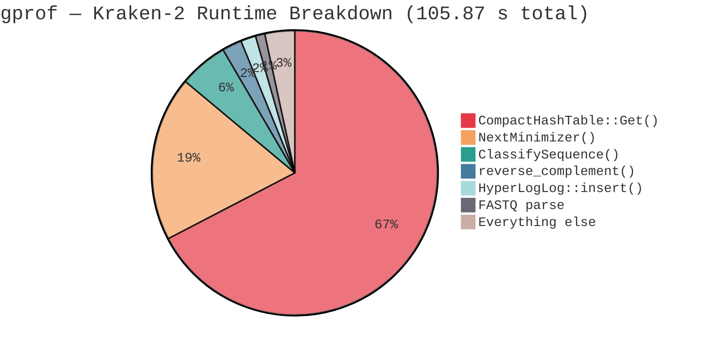
```mermaid
%%{init: {'theme': 'base', 'themeVariables': {'pie1': '#e63946','pie2': '#f4a261','pie3': '#2a9d8f','pie4': '#457b9d','pie5': '#a8dadc','pie6': '#6d6875','pie7': '#c9ada7', 'pieOuterStrokeWidth': '2px', 'fontFamily': 'monospace'}}}%%
pie title gprof — Kraken-2 Runtime Breakdown (105.87 s total)
    "CompactHashTable::Get()" : 67.35
    "NextMinimizer()" : 18.74
    "ClassifySequence()" : 5.53
    "reverse_complement()" : 2.23
    "HyperLogLog::insert()" : 1.71
    "FASTQ parse" : 1.06
    "Everything else" : 3.38
```

| Rank | Function | % Time | Self (s) | Calls | ms/call |
|:---:|---|:---:|:---:|:---:|:---:|
| 1 | `CompactHashTable::Get()` | **67.35%** | 71.30 | 9,871,933 | 0.0072 |
| 2 | `MinimizerScanner::NextMinimizer()` | 18.74% | 19.84 | 354,164,193 | 0.000056 |
| 3 | `ClassifySequence()` | 5.53% | 5.85 | — | — |
| 4 | `MinimizerScanner::reverse_complement()` | 2.23% | 2.36 | 354,478,588 | 0.0000067 |
| 5 | `HyperLogLogPlusMinus::insert()` | 1.71% | 1.81 | 3,220,914 | 0.00056 |
| 6 | `ks_getuntil2()` FASTQ parsing | 1.06% | 1.12 | 209,658 | 0.0053 |
| 7+ | Everything else | 3.38% | 3.59 | — | — |

---

### 1.2 perf stat — CPU Time Breakdown

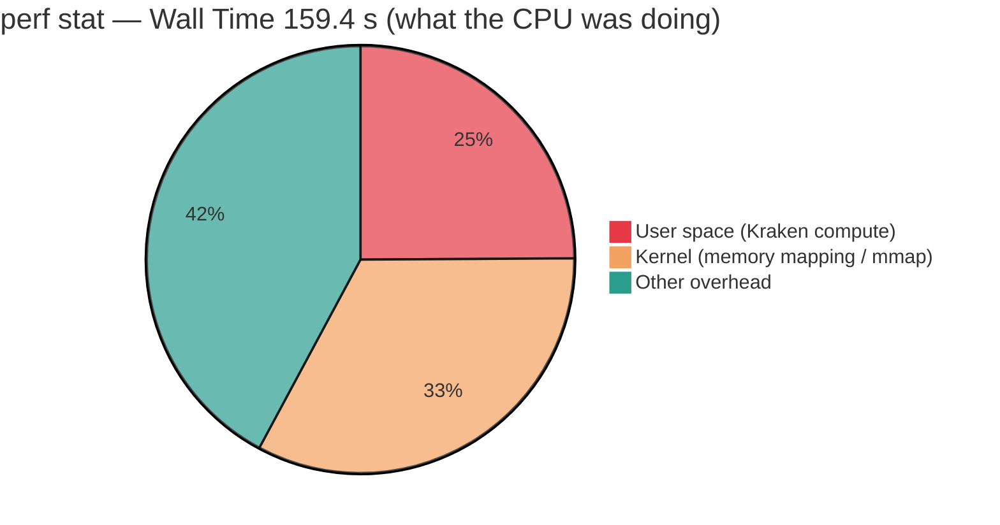
```mermaid
%%{init: {'theme': 'base', 'themeVariables': {'pie1': '#e63946','pie2': '#f4a261','pie3': '#2a9d8f', 'pieOuterStrokeWidth': '2px'}}}%%
pie title perf stat — Wall Time 159.4 s (what the CPU was doing)
    "User space (Kraken compute)" : 39.7
    "Kernel (memory mapping / mmap)" : 52.5
    "Other overhead" : 67.2
```

### 1.3 Three-Tool Profiling Numbers

| Tool | Metric | Value | What It Proves |
|---|---|:---:|---|
| **perf stat** | Cache miss rate | **34.24%** | 1 in 3 memory accesses → RAM |
| **perf stat** | Total L3 misses | **301,288,020** | 301M × ~100 ns stall |
| **perf stat** | Wall time | 159.4 s | |
| **perf stat** | IPC (reported) | 2.26  | Hyper-V throttles clock — invalid |
| **AMD uProf** | IPC (accurate) | **0.55 ** | CPU stalls — memory-bound confirmed |
| **gprof** | Hotspot function | `CompactHashTable::Get()` | 67% of all runtime |
| **gprof** | Hotspot calls | 9,871,933 | 9.87M lookups per run |
| **Derived** | Misses per call | **~30.5** | 301M ÷ 9.87M |

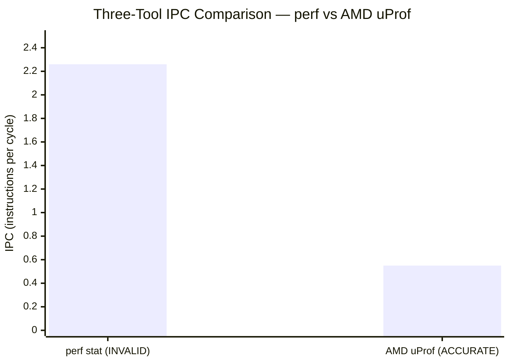
```mermaid
xychart-beta
    title "Three-Tool IPC Comparison — perf vs AMD uProf"
    x-axis ["perf stat (INVALID)", "AMD uProf (ACCURATE)"]
    y-axis "IPC (instructions per cycle)" 0 --> 2.5
    bar [2.26, 0.55]
```

> IPC < 1.0 = memory-bound. The real value is **0.55** — the CPU executes less than one instruction per clock tick because it's stalled waiting for RAM on every `CompactHashTable::Get()` call.

### 1.4 Cache Miss Rate in Context

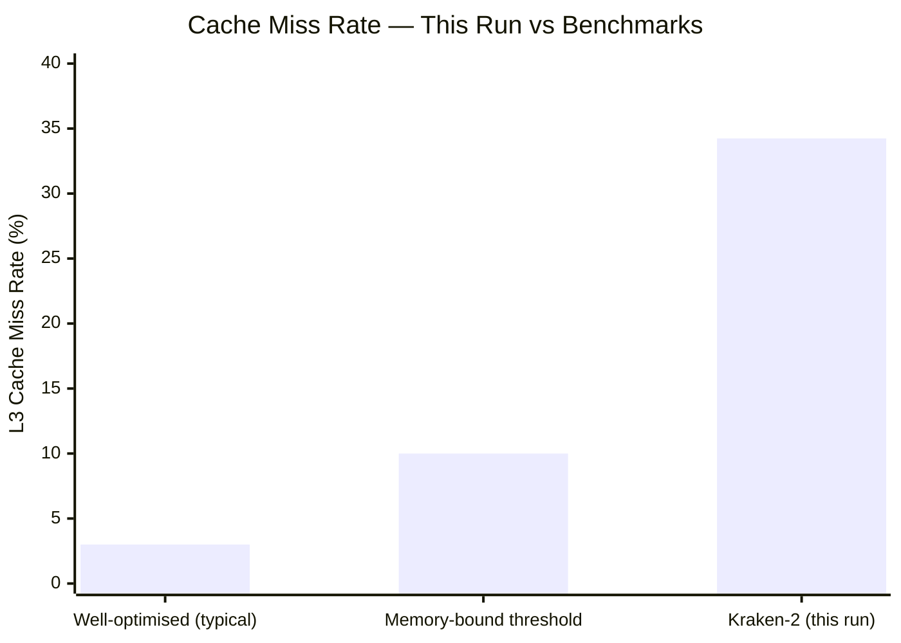
```mermaid
xychart-beta
    title "Cache Miss Rate — This Run vs Benchmarks"
    x-axis ["Well-optimised (typical)", "Memory-bound threshold", "Kraken-2 (this run)"]
    y-axis "L3 Cache Miss Rate (%)" 0 --> 40
    bar [3, 10, 34.24]
```

---

## 2. Dorado GPU Profile

### 2.1 Where GPU Time Goes — CUDA Kernels

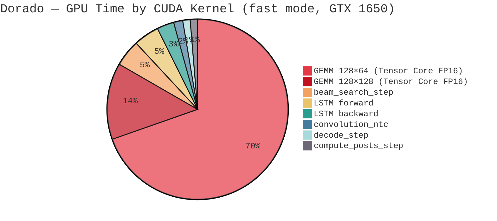
```mermaid
%%{init: {'theme': 'base', 'themeVariables': {'pie1': '#e63946','pie2': '#c1121f','pie3': '#f4a261','pie4': '#e9c46a','pie5': '#2a9d8f','pie6': '#457b9d','pie7': '#a8dadc','pie8': '#6d6875', 'pieOuterStrokeWidth': '2px', 'fontFamily': 'monospace'}}}%%
pie title Dorado — GPU Time by CUDA Kernel (fast mode, GTX 1650)
    "GEMM 128×64 (Tensor Core FP16)" : 68.5
    "GEMM 128×128 (Tensor Core FP16)" : 13.5
    "beam_search_step" : 4.7
    "LSTM forward" : 4.5
    "LSTM backward" : 3.0
    "convolution_ntc" : 1.6
    "decode_step" : 1.3
    "compute_posts_step" : 1.3
```

| Kernel | % GPU Time | Total Time | Instances | Avg/call |
|---|:---:|:---:|:---:|:---:|
| cutlass GEMM 128×64 (Tensor Core FP16) | **68.5%** | 1,069 s | 54,522 | **19.6 ms** |
| cutlass GEMM 128×128 (Tensor Core FP16) | **13.5%** | 211 s | 9,087 | 23.3 ms |
| beam_search_step | 4.7% | 73.8 s | 9,087 | 8.1 ms |
| LSTM forward (96 ch) | 4.5% | 71.0 s | 27,261 | 2.6 ms |
| LSTM backward (96 ch) | 3.0% | 47.3 s | 18,174 | 2.6 ms |
| convolution_ntc | 1.6% | 24.3 s | 9,087 | 2.7 ms |
| decode_step | 1.3% | 20.7 s | 9,087 | 2.3 ms |
| compute_posts_step | 1.3% | 20.2 s | 9,087 | 2.2 ms |
| **GEMM Total** | **82.0%** | **1,280 s** | **63,609** | |

---

### 2.2 CUDA API Time — What the CPU Does

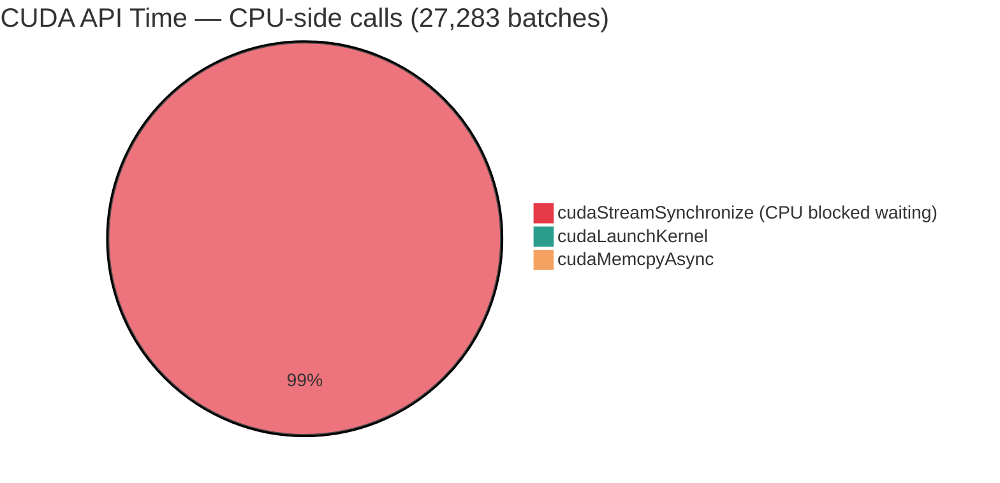
```mermaid
%%{init: {'theme': 'base', 'themeVariables': {'pie1': '#e63946','pie2': '#2a9d8f','pie3': '#f4a261', 'pieOuterStrokeWidth': '2px'}}}%%
pie title CUDA API Time — CPU-side calls (27,283 batches)
    "cudaStreamSynchronize (CPU blocked waiting)" : 98.9
    "cudaLaunchKernel" : 0.5
    "cudaMemcpyAsync" : 0.3
```

| API Call | % of CUDA API Time | Calls | Avg/call | Meaning |
|---|:---:|:---:|:---:|---|
| `cudaStreamSynchronize` | **98.9%** | 27,283 | 56.6 ms | CPU blocked — waiting on GPU |
| `cudaLaunchKernel` | 0.5% | 190,891 | 43.5 µs | Kernel dispatch |
| `cudaMemcpyAsync` | 0.3% | 27,304 | 186 µs | Data movement |

> 27,283 × 56.6 ms = **~1,544 s** of CPU doing nothing. GPU is the bottleneck, not CPU.

---

### 2.3 Memory Transfers

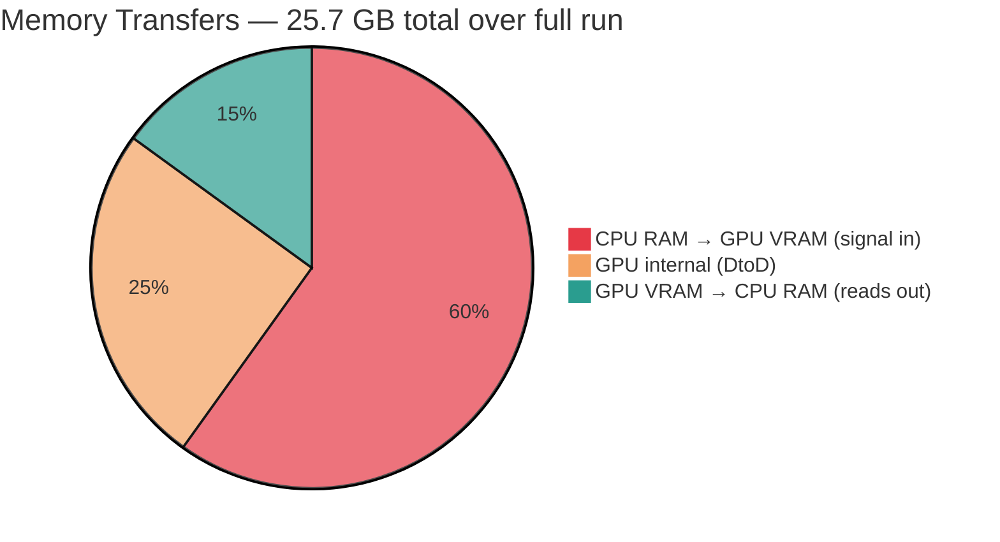
```mermaid
%%{init: {'theme': 'base', 'themeVariables': {'pie1': '#e63946','pie2': '#f4a261','pie3': '#2a9d8f', 'pieOuterStrokeWidth': '2px'}}}%%
pie title Memory Transfers — 25.7 GB total over full run
    "CPU RAM → GPU VRAM (signal in)" : 59.9
    "GPU internal (DtoD)" : 25.1
    "GPU VRAM → CPU RAM (reads out)" : 15.0
```

| Direction | % Transfer Time | Total Data | Count | Per Batch |
|---|:---:|:---:|:---:|:---:|
| CPU RAM → GPU VRAM | 59.9% | 11,427 MB | 9,112 | ~1.25 MB |
| GPU internal | 25.1% | 11,427 MB | 9,107 | ~1.25 MB |
| GPU VRAM → CPU RAM | 15.0% | 2,856 MB | 9,085 | ~0.31 MB |

> Transfers are a **minor fraction** of total runtime. GPU is not data-starved — it's compute-bound.

---

### 2.4 NVTX Stage Breakdown

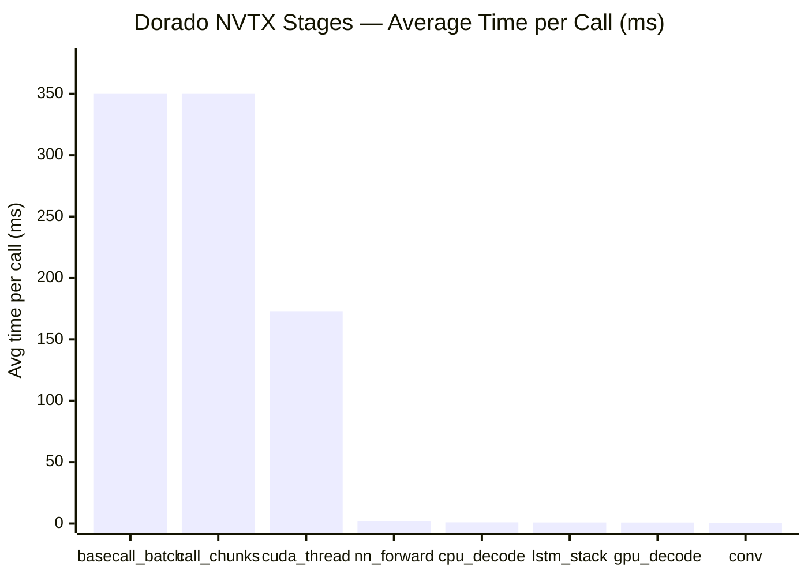
```mermaid
xychart-beta
    title "Dorado NVTX Stages — Average Time per Call (ms)"
    x-axis ["basecall_batch", "call_chunks", "cuda_thread", "nn_forward", "cpu_decode", "lstm_stack", "gpu_decode", "conv"]
    y-axis "Avg time per call (ms)" 0 --> 380
    bar [350, 350, 173, 2.1, 0.98, 0.89, 0.83, 0.22]
```

---

## 3. Matrix Multiply Benchmarks

**Machine:** AMD Ryzen 7 5800H · 14 GB RAM · GCC 15.1 -O3 -march=native · dtype: double

### 3.1 Wall Time — N = 10000 (seconds)

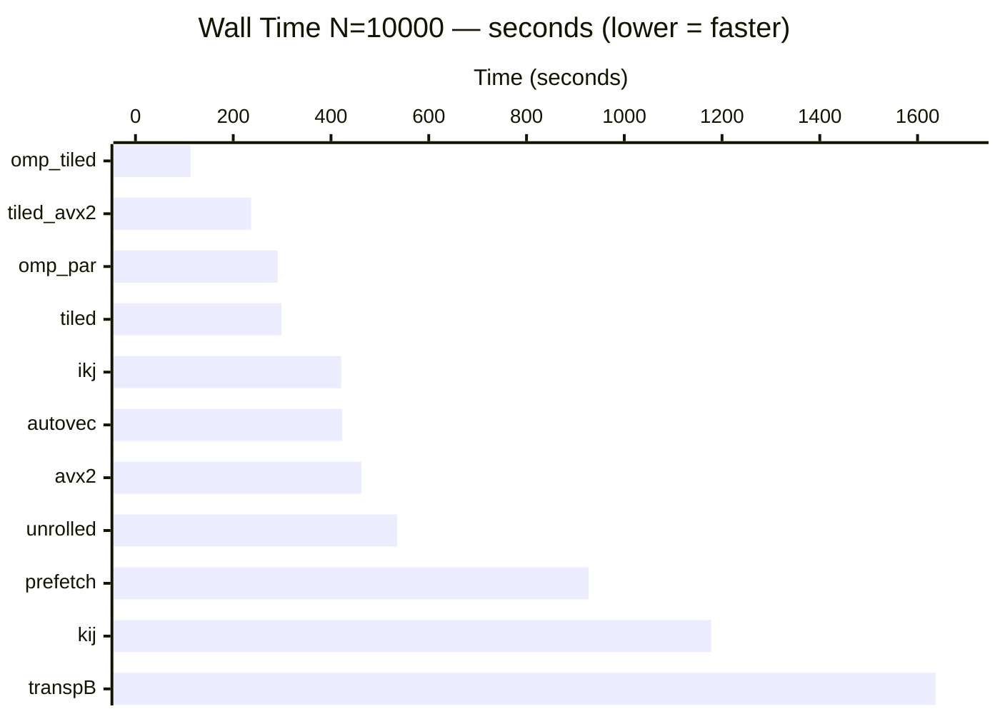
```mermaid
xychart-beta horizontal
    title "Wall Time N=10000 — seconds (lower = faster)"
    x-axis ["omp_tiled", "tiled_avx2", "omp_par", "tiled", "ikj", "autovec", "avx2", "unrolled", "prefetch", "kij", "transpB"]
    y-axis "Time (seconds)" 0 --> 1700
    bar [112.5, 236.5, 290.7, 298.8, 420.8, 423.1, 462.4, 535.3, 927.1, 1177.6, 1636.6]
```

| Binary | Time (s) | vs Winner | L3 miss% |
|---|:---:|:---:|:---:|
| **omp_tiled**  | **112.5** | **1.0×** | 3.70% |
| tiled_avx2 | 236.5 | 2.1× | 18.53%  |
| omp_parallel | 290.7 | 2.6× | 2.26% |
| tiled | 298.8 | 2.7× | 2.92% |
| ikj_order | 420.8 | 3.7× | 2.12% |
| auto_vec_O3 | 423.1 | 3.8× | 2.24% |
| avx2_manual | 462.4 | 4.1× | 1.64% |
| unrolled_ikj | 535.3 | 4.8× | 1.97% |
| prefetch_ikj | 927.1 | 8.2× | 1.23% |
| kij_order | 1177.6 | 10.5× | 3.04% |
| transpose_B | 1636.6 | 14.5× | 1.94% |

---

### 3.2 Wall Time — N = 2048 (seconds)

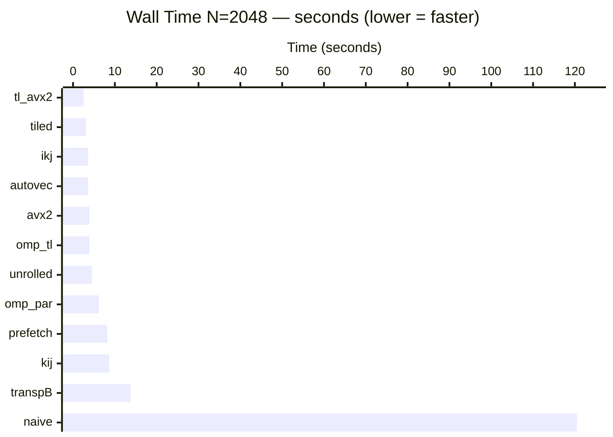
```mermaid
xychart-beta horizontal
    title "Wall Time N=2048 — seconds (lower = faster)"
    x-axis ["tl_avx2", "tiled", "ikj", "autovec", "avx2", "omp_tl", "unrolled", "omp_par", "prefetch", "kij", "transpB", "naive"]
    y-axis "Time (seconds)" 0 --> 125
    bar [2.5, 3.1, 3.6, 3.6, 3.9, 3.9, 4.5, 6.2, 8.2, 8.6, 13.8, 120.5]
```

---

### 3.3 Wall Time — N = 1024 (ms, naive excluded from scale)

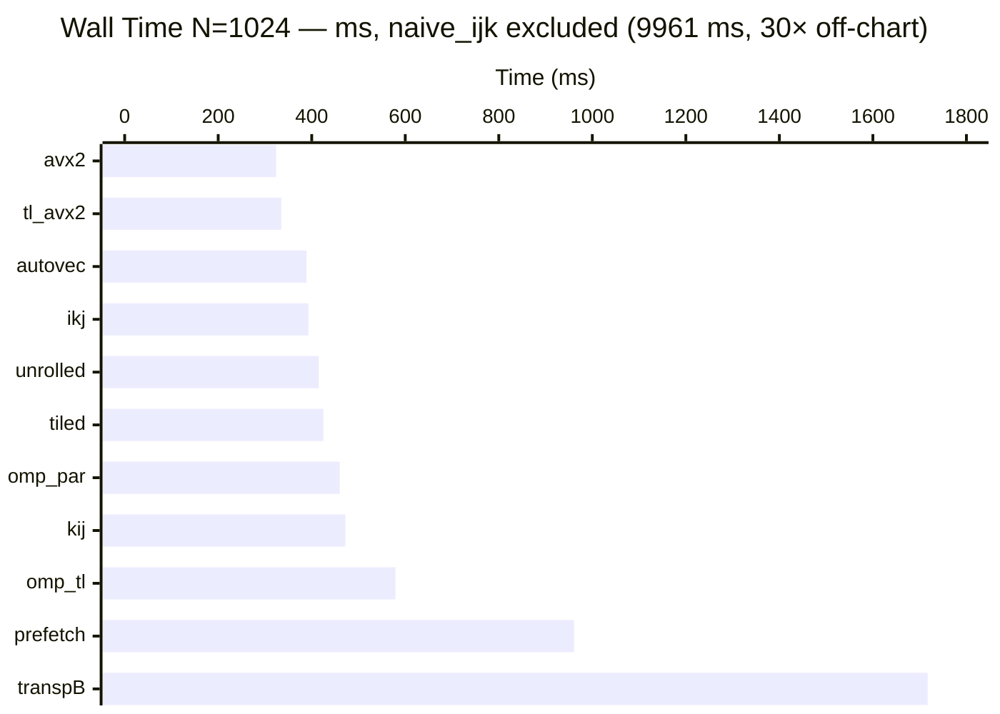
```mermaid
xychart-beta horizontal
    title "Wall Time N=1024 — ms, naive_ijk excluded (9961 ms, 30× off-chart)"
    x-axis ["avx2", "tl_avx2", "autovec", "ikj", "unrolled", "tiled", "omp_par", "kij", "omp_tl", "prefetch", "transpB"]
    y-axis "Time (ms)" 0 --> 1800
    bar [324, 335, 389, 393, 415, 425, 460, 472, 579, 961, 1717]
```

---

### 3.4 L3 Cache Miss Rate at N=10000 (%)

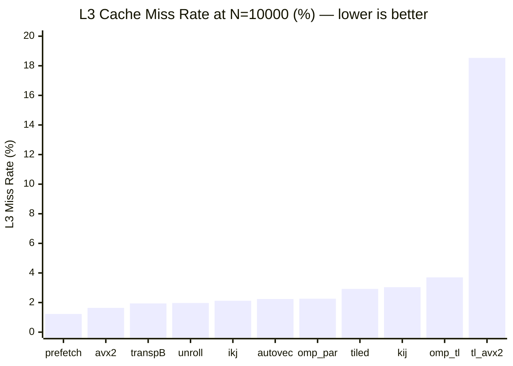
```mermaid
xychart-beta
    title "L3 Cache Miss Rate at N=10000 (%) — lower is better"
    x-axis ["prefetch", "avx2", "transpB", "unroll", "ikj", "autovec", "omp_par", "tiled", "kij", "omp_tl", "tl_avx2"]
    y-axis "L3 Miss Rate (%)" 0 --> 20
    bar [1.23, 1.64, 1.94, 1.97, 2.12, 2.24, 2.26, 2.92, 3.04, 3.70, 18.53]
```

> **tiled_avx2 outlier:** 18.53% L3 miss rate despite being the 2nd fastest. TILE=64 footprint (3 tiles × 64² × 8B = 98 KB) overflows L1 cache (48 KB) at large N. Fix: use TILE=32 (3 × 32² × 8B = 24 KB — fits L1).

---

### 3.5 L2 Cache Miss Rate at N=10000 (%)

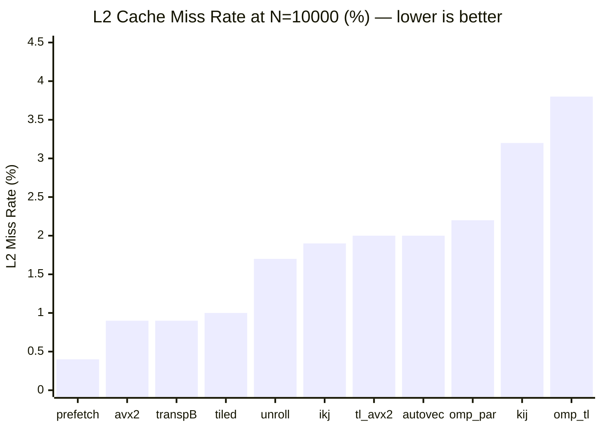
```mermaid
xychart-beta
    title "L2 Cache Miss Rate at N=10000 (%) — lower is better"
    x-axis ["prefetch", "avx2", "transpB", "tiled", "unroll", "ikj", "tl_avx2", "autovec", "omp_par", "kij", "omp_tl"]
    y-axis "L2 Miss Rate (%)" 0 --> 4.5
    bar [0.4, 0.9, 0.9, 1.0, 1.7, 1.9, 2.0, 2.0, 2.2, 3.2, 3.8]
```

---

### 3.6 Scaling Ratio N=1024→N=2048 (expected O(N³) = 8×)

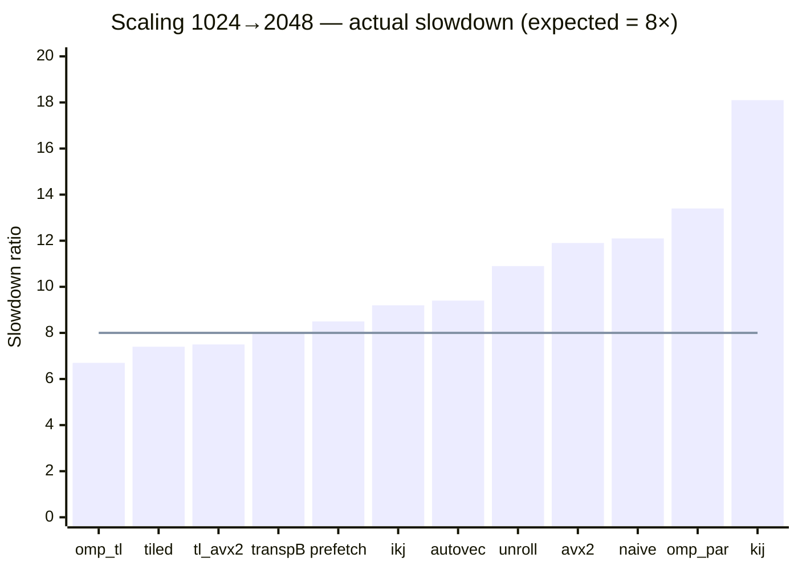
```mermaid
xychart-beta
    title "Scaling 1024→2048 — actual slowdown (expected = 8×)"
    x-axis ["omp_tl", "tiled", "tl_avx2", "transpB", "prefetch", "ikj", "autovec", "unroll", "avx2", "naive", "omp_par", "kij"]
    y-axis "Slowdown ratio" 0 --> 20
    bar [6.7, 7.4, 7.5, 8.0, 8.5, 9.2, 9.4, 10.9, 11.9, 12.1, 13.4, 18.1]
    line [8, 8, 8, 8, 8, 8, 8, 8, 8, 8, 8, 8]
```

> **Line = expected 8× (O(N³)).** Below line = cache-friendly (tile stays in L2 regardless of N). Above line = access pattern degrades super-linearly.

| Binary | Ratio | vs O(N³) |
|---|:---:|---|
| omp_tiled | 6.7× | sub-linear ↓ — tiles pay off |
| tiled | 7.4× | sub-linear ↓ |
| tiled_avx2 | 7.5× | sub-linear ↓ |
| transpose_B | 8.0× | matches O(N³)  |
| prefetch_ikj | 8.5× | near O(N³) |
| ikj_order | 9.2× | slightly above |
| kij_order | **18.1×** | severely super-linear ↑ |

---

### 3.7 Scaling Ratio N=2048→N=10000 (expected O(N³) = 116.4×)

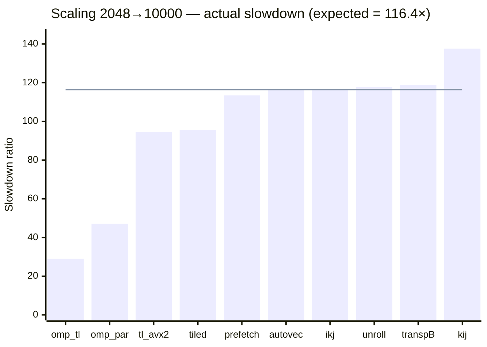
```mermaid
xychart-beta
    title "Scaling 2048→10000 — actual slowdown (expected = 116.4×)"
    x-axis ["omp_tl", "omp_par", "tl_avx2", "tiled", "prefetch", "autovec", "ikj", "unroll", "transpB", "kij"]
    y-axis "Slowdown ratio" 0 --> 145
    bar [29.0, 47.1, 94.6, 95.6, 113.4, 116.1, 116.2, 117.9, 118.8, 137.6]
    line [116.4, 116.4, 116.4, 116.4, 116.4, 116.4, 116.4, 116.4, 116.4, 116.4]
```

> **omp_tiled = 29× (vs expected 116×)** — 4× better than theory. At 2.4 GB working set, 4 threads pipeline DRAM requests independently. This is where OpenMP finally earns its keep.

---

### 3.8 Speedup vs naive_ijk at N=2048

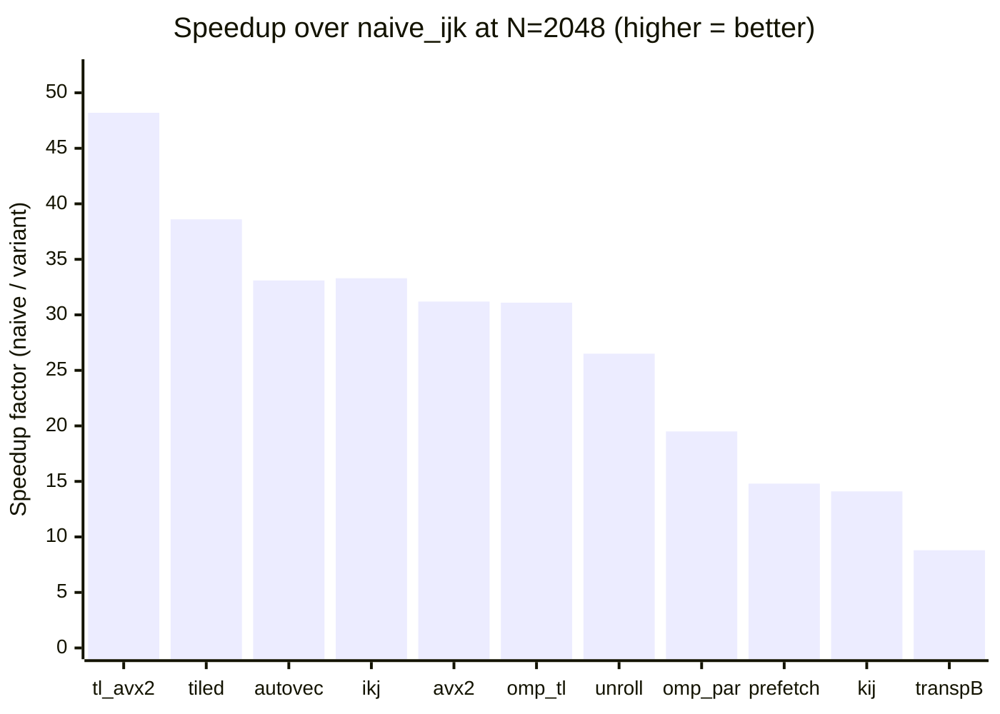
```mermaid
xychart-beta
    title "Speedup over naive_ijk at N=2048 (higher = better)"
    x-axis ["tl_avx2", "tiled", "autovec", "ikj", "avx2", "omp_tl", "unroll", "omp_par", "prefetch", "kij", "transpB"]
    y-axis "Speedup factor (naive / variant)" 0 --> 52
    bar [48.2, 38.6, 33.1, 33.3, 31.2, 31.1, 26.5, 19.5, 14.8, 14.1, 8.8]
```

---

### 3.9 The Prefetch Paradox — Instructions vs Time at N=10000

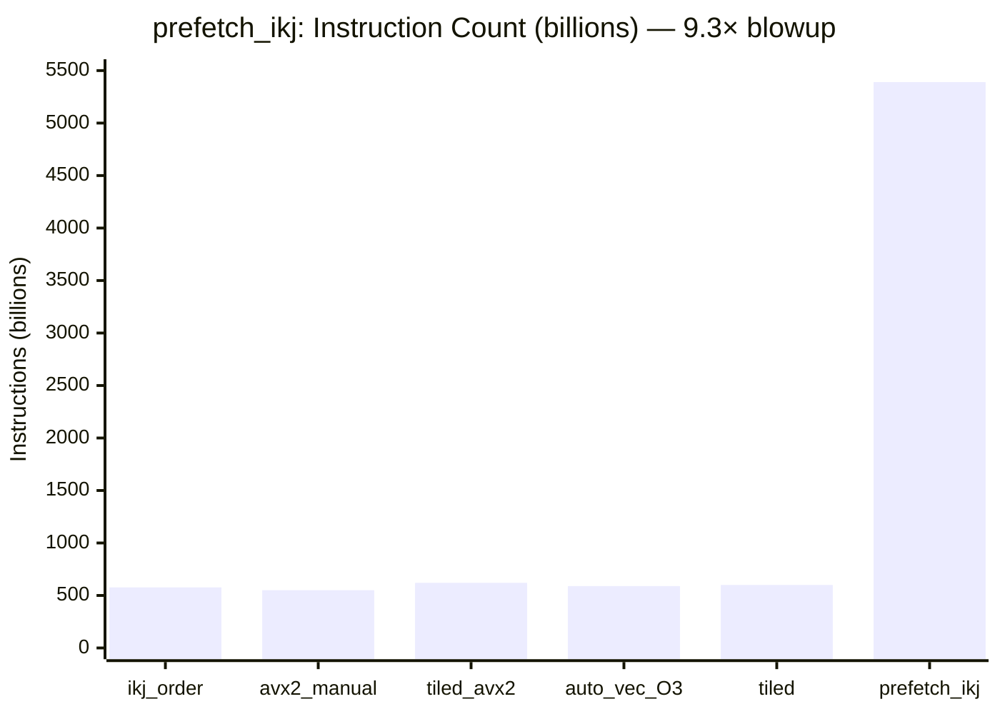
```mermaid
xychart-beta
    title "prefetch_ikj: Instruction Count (billions) — 9.3× blowup"
    x-axis ["ikj_order", "avx2_manual", "tiled_avx2", "auto_vec_O3", "tiled", "prefetch_ikj"]
    y-axis "Instructions (billions)" 0 --> 5500
    bar [577, 550, 620, 589, 600, 5390]
```

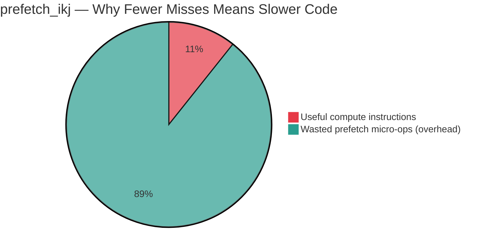
```mermaid
%%{init: {'theme': 'base', 'themeVariables': {'pie1': '#e63946','pie2': '#2a9d8f', 'pieOuterStrokeWidth': '2px'}}}%%
pie title prefetch_ikj — Why Fewer Misses Means Slower Code
    "Useful compute instructions" : 577
    "Wasted prefetch micro-ops (overhead)" : 4813
```

| Metric | ikj_order | prefetch_ikj | Ratio |
|---|:---:|:---:|:---:|
| Wall time (s) | 420.8 | 927.1 | **2.2× slower** |
| Instructions (B) | 577 | 5,390 | **9.3× more** |
| L3 miss % | 2.12% | **1.23%** | 1.7× better |
| L2 miss % | 1.9% | **0.4%** | 4.8× better |
| Branch miss % | 0.27% | **0.08%** | 3.4× better |

> Lesson: reducing miss rates ≠ going faster when instruction overhead exceeds the latency savings. Hardware prefetcher already handles sequential B-row access perfectly — `__builtin_prefetch()` is redundant here. It IS useful for random access patterns like `CompactHashTable::Get()`.

---

### 3.10 Raw Cache Miss Counts — All N

| Binary | N=1024 | N=2048 | N=10000 | Growth 1024→2048 |
|---|:---:|:---:|:---:|:---:|
| naive_ijk | 591,217,868 | 10,179,585,610 | (est ~1.3T) | **17.2×** |
| ikj_order | 19,202,426 | 94,725,695 | 6,895,824,215 | 4.9× |
| kij_order | 6,714,240 | 118,030,859 | 11,652,559,317 | **17.6×** |
| transpose_B | 5,126,005 | 39,637,997 | 7,526,577,591 | 7.7× |
| tiled | 13,390,340 | 96,958,637 | 8,036,089,969 | 7.2× |
| omp_parallel | 18,965,504 | 58,248,158 | 9,250,759,044 | 3.1× |
| omp_tiled | 11,297,298 | 90,697,533 | 10,318,370,903 | 8.0× |
| unrolled_ikj | 14,889,059 | 47,359,373 | 8,144,164,015 | 3.2× |
| avx2_manual | 6,528,249 | 32,269,648 | 6,422,414,789 | 4.9× |
| auto_vec_O3 | 18,699,452 | 97,473,564 | 7,288,182,166 | 5.2× |
| tiled_avx2 | 38,740,316 | 394,164,831 | 24,321,593,389 | **10.2×** |
| prefetch_ikj | 11,871,223 | 64,532,420 | 5,532,581,043 | 5.4× |

---

### 3.11 Branch Miss Rate (%) — All N

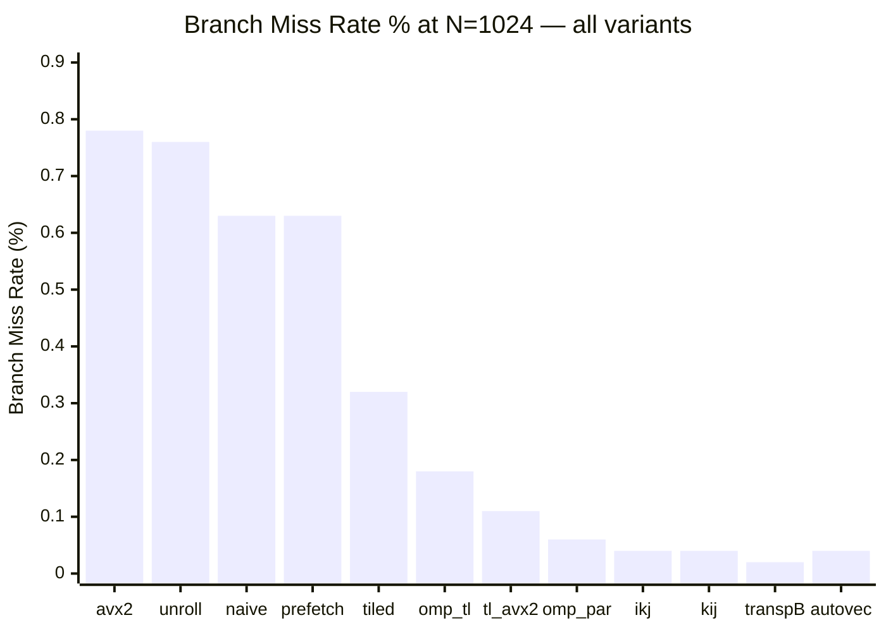
```mermaid
xychart-beta
    title "Branch Miss Rate % at N=1024 — all variants"
    x-axis ["avx2", "unroll", "naive", "prefetch", "tiled", "omp_tl", "tl_avx2", "omp_par", "ikj", "kij", "transpB", "autovec"]
    y-axis "Branch Miss Rate (%)" 0 --> 0.9
    bar [0.78, 0.76, 0.63, 0.63, 0.32, 0.18, 0.11, 0.06, 0.04, 0.04, 0.02, 0.04]
```

> `avx2_manual` and `unrolled_ikj` have high branch miss at N=1024 due to tail-loop (N % 4 remainder). At N=2048 (divisible by 8), both drop to ~0.02% — confirming this is tail-loop artefact only.

---

### 3.12 Working Set by Matrix Size

| N | Per Matrix | 3 Matrices | Fits In |
|:---:|:---:|:---:|---|
| 256 | 512 KB | 1.5 MB | L3 (16 MB) |
| 512 | 2 MB | 6 MB | L3 (16 MB) — barely |
| **730** | **4 MB** | **12 MB** | **L3 threshold — above this = RAM-bound** |
| 1,024 | 8 MB | 24 MB | RAM (L3 overflows) |
| 2,048 | 32 MB | 96 MB | RAM |
| 10,000 | 800 MB | 2,400 MB | RAM |
| 25,000 | 5 GB | 15 GB | Near machine limit (14 GB) |

> Every benchmark in this report (N ≥ 1024) is **RAM-bound from the start**. Tiling helps because the tile (64×64×8B = 32 KB) fits in L2 (512 KB) — the *tile* is cache-resident, even though the full matrix is not.

---

## 4. Luna vs Minerva vs Local

### 4.1 Full Specification Table

| Spec | Local Machine | Minerva | Luna |
|---|:---:|:---:|:---:|
| CPU | Ryzen 7 5800H | Xeon Gold 6330 | **Xeon Plat. 8468** |
| Microarch | Zen 3 | Ice Lake | **Sapphire Rapids** |
| Sockets | 1 | 2 | 2 |
| Physical cores | 8 | 56 | **96** |
| Logical CPUs | 16 | 112 | **192** |
| Base clock | 3.2 GHz | 2.0 GHz | **3.8 GHz** |
| L2 per core | 512 KB | 1 MB | **2 MB** |
| **L3 total** | **16 MB** | **66 MB** | **210 MB** |
| **RAM** | **14 GB** | **251 GB** | **503 GB** |
| GPU | GTX 1650 | 2× A40 | **2× L40S** |
| GPU VRAM | 4 GB | 45 GB ea. | **46 GB ea.** |
| **GPU FP32** | **2.9 TFLOPS** | **37.4 TFLOPS** | **91.6 TFLOPS** |
| Disk free | ~50 GB | **0 GB ** | 236 GB |
| ISA extras | AVX2 | AVX-512 | AVX-512 + **AMX** |
| perf counters | WSL2 limited |  native |  native |
| TMA support |  | partial | ** full** |
| NUMA nodes | 1 | 2 | 2 |

---

### 4.2 L3 Cache Comparison

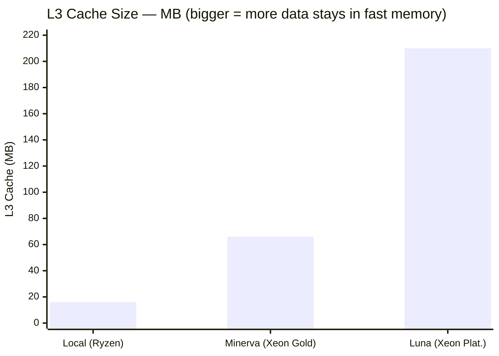
```mermaid
xychart-beta
    title "L3 Cache Size — MB (bigger = more data stays in fast memory)"
    x-axis ["Local (Ryzen)", "Minerva (Xeon Gold)", "Luna (Xeon Plat.)"]
    y-axis "L3 Cache (MB)" 0 --> 220
    bar [16, 66, 210]
```

---

### 4.3 RAM Comparison

```mermaid
xychart-beta
    title "RAM — GB"
    x-axis ["Local", "Minerva", "Luna"]
    y-axis "RAM (GB)" 0 --> 520
    bar [14, 251, 503]
```

---

### 4.4 GPU Compute (FP32 TFLOPS)

```mermaid
xychart-beta
    title "GPU FP32 Throughput — TFLOPS (higher = faster inference)"
    x-axis ["GTX 1650 (Local)", "A40 x2 (Minerva)", "L40S x2 (Luna)"]
    y-axis "FP32 TFLOPS" 0 --> 100
    bar [2.9, 37.4, 91.6]
```

---

### 4.5 Logical CPU Count

```mermaid
xychart-beta
    title "Logical CPU Threads"
    x-axis ["Local (Ryzen)", "Minerva (Xeon Gold)", "Luna (Xeon Plat.)"]
    y-axis "Logical CPUs" 0 --> 200
    bar [16, 112, 192]
```

---

### 4.6 Luna ÷ Minerva Advantage Ratios

```mermaid
xychart-beta
    title "Luna ÷ Minerva ratio (how much better Luna is)"
    x-axis ["L3 Cache", "RAM", "GPU TFLOPS", "CPU Threads", "Clock Speed"]
    y-axis "Luna / Minerva ratio" 0 --> 3.5
    bar [3.18, 2.0, 2.45, 1.71, 1.9]
    line [1, 1, 1, 1, 1]
```

> Line = 1× (equal). Every bar above the line = Luna advantage. Luna wins **every dimension**. Minerva disk is 100% full — no new profiling data can be written there.

---

### 4.7 Profiling Tool Readiness

| Tool | Local (WSL2) | Minerva | Luna |
|---|:---:|:---:|:---:|
| `perf stat` — basic |  |  |  |
| `perf` — `LLC-load-misses` |  Hyper-V blocked |  |  |
| `perf` — `stalled-cycles-backend` |  |  |  |
| Accurate IPC |  (clock distorted) |  |  |
| **TMA (Top-down Analysis)** |  | partial | ** full** |
| `gprof` |  |  |  |
| `valgrind / cachegrind` |  |  |  |
| `nsys` (Nsight Systems) |  |  (fixed PATH) |  needs PATH fix |
| `ncu` (Nsight Compute) |  |  |  needs PATH fix |
| AMD uProf |  (native AMD) |  (Intel) |  (Intel) |
| Intel VTune |  |  (installed) |  (available) |
| DCGM (GPU metrics) |  |  |  |
| Write new data to disk |  | ** FULL** |  |

---

## 5. Dorado Mode Comparison

### 5.1 Runtime by Mode

```mermaid
xychart-beta
    title "Dorado Runtime — GTX 1650 vs Colab T4 (minutes, 104,478 reads)"
    x-axis ["fast (GTX 1650)", "fast (T4)", "hac (T4)", "hac (GTX 1650)", "sup (T4)"]
    y-axis "Runtime (minutes)" 0 --> 130
    bar [5, 3.97, 19.13, 71, 125]
```

| Mode | Time (T4) | Time (GTX 1650) | Classified reads gain | Verdict |
|---|:---:|:---:|:---:|---|
| fast | 3m 58s | ~5 min | baseline | Quick test only |
| **hac** | **19m 8s** | **~71 min** | **+3–8%** | **Sweet spot** |
| sup | 2h 5min | OOM  | +0.1–1% | Marginal gain, not worth it |

```mermaid
%%{init: {'theme': 'base', 'themeVariables': {'pie1': '#2a9d8f','pie2': '#e63946', 'pieOuterStrokeWidth': '2px'}}}%%
pie title Accuracy gain: fast→hac vs hac→sup
    "fast → hac gain (+3 to 8%)" : 5.5
    "hac → sup gain (+0.1 to 1%)" : 0.55
```

> `hac` is the clear sweet spot. The jump from fast→hac gives 3–8% more classified reads. The jump from hac→sup gives only 0.1–1% and is 6× slower (T4) — or OOM on a 4 GB GPU.

---

### 5.2 AIIMS Barcode Classification Results

```mermaid
%%{init: {'theme': 'base', 'themeVariables': {'pie1': '#e63946','pie2': '#457b9d','pie3': '#2a9d8f','pie4': '#f4a261', 'pieOuterStrokeWidth': '2px'}}}%%
pie title AIIMS Run — Pathogen Distribution (14 barcodes)
    "Pseudomonas aeruginosa (barcodes 01-07)" : 7
    "Klebsiella + E. faecium mix (09-12)" : 4
    "Enterococcus faecium (13)" : 1
    "Mixed / unclassified (14)" : 1
```

| Barcode(s) | Species | Taxon ID | Classification |
|---|---|:---:|:---:|
| 01–07 | *Pseudomonas aeruginosa* | 287 | >90% |
| **02** | *Pseudomonas aeruginosa* | 287 | **100%** (44 reads, 0.6s) |
| 09–12 | *K. pneumoniae* + *E. faecium* | 573 + 1352 | mixed |
| 13 | *Enterococcus faecium* | 1352 | >90% |
| 14 | multiple | — | mixed |

---

### 5.3 Custom ESKAPE DB vs Standard DB

```mermaid
%%{init: {'theme': 'base', 'themeVariables': {'pie1': '#e63946','pie2': '#2a9d8f', 'pieOuterStrokeWidth': '2px'}}}%%
pie title Database Size — Standard 180 GB vs Custom ESKAPE 650 MB
    "Standard DB (180 GB)" : 180000
    "Custom ESKAPE DB (650 MB)" : 650
```

| Property | Standard DB | Custom ESKAPE DB |
|---|:---:|:---:|
| Size | 180 GB | **650 MB** |
| Species | All known | 6 ESKAPE only |
| Build time | ~hours | **30 seconds** |
| RAM needed | 180 GB | **< 1 GB** |
| Runs on Colab |  | **** |
| Ratio | — | **277× smaller** |

---

## 6. Cache ROI Projections

### 6.1 Kraken-2 — Hot-K-mer LRU Cache

**Basis:** 9.87M calls to `CompactHashTable::Get()` · ~30 L3 misses/call · ~100 ns/miss

```mermaid
xychart-beta
    title "Kraken-2 LRU Cache — Estimated Time Saved vs Hit Rate"
    x-axis ["5%", "10%", "15%", "20%", "25%", "30%", "40%", "50%"]
    y-axis "Seconds saved per run" 0 --> 16
    bar [1.48, 2.96, 4.44, 5.92, 7.41, 8.88, 11.84, 14.80]
```

| Hit Rate | Calls Skipped | RAM Accesses Saved | Est. Time Saved | % of Run |
|:---:|:---:|:---:|:---:|:---:|
| 5% | 494K | 15M | 1.5 s | 0.9% |
| 10% | 987K | 30M | 3.0 s | 1.9% |
| **20%** | **1.97M** | **60M** | **6.0 s** | **3.8%** |
| 30% | 2.96M | 89M | 8.9 s | 5.6% |
| 50% | 4.93M | 148M | 14.8 s | 9.3% |

> Assumes each LRU hit eliminates all ~30 L3 misses for that call. Total run = 159.4 s. Needs empirical validation via k-mer reuse measurement on actual FASTQ.

---

### 6.2 Dorado — Signal-to-Base (S2B) Cache

**Basis:** GEMM = 82% of GPU time · Avg GEMM call = 19.6 ms · Cache hit skips GEMM entirely

```mermaid
xychart-beta
    title "Dorado S2B Cache — % GPU Time Saved vs Hit Rate"
    x-axis ["5%", "10%", "20%", "30%", "40%", "50%"]
    y-axis "GPU time saved (%)" 0 --> 45
    bar [4.1, 8.2, 16.4, 24.6, 32.8, 41.0]
```

| Hit Rate | GPU Time Saved | Constraint |
|:---:|:---:|---|
| 10% | 8.2% | Cache lookup must be < 19.6 ms (avg GEMM) |
| **30%** | **24.6%** | **Target estimate** |
| 50% | 41.0% | Upper bound if cache perfectly accurate |

> Cache must run **GPU-side** (CUDA shared memory + LSH) — CPU is blocked on `cudaStreamSynchronize` and cannot do useful work during GPU execution.

---

## 7. Heatmaps — Miss Rates Across All N

**Colour key:** 🟦 < 2% · 🟩 2–5% · 🟨 5–10% · 🟧 10–20% · 🟥 > 20%

### 7.1 L3 Cache Miss Rate Heatmap (%)

| Binary | N=1024 | N=2048 | N=10000 | Trend |
|---|:---:|:---:|:---:|---|
| naive_ijk | 🟥 22.0% | 🟥 27.6% | 🟥 >50% est. | worsens severely |
| tiled_avx2 | 🟧 12.3% | 🟧 15.9% | 🟧 18.53% | worsens with N |
| omp_tiled | 🟩 3.3% | 🟩 3.6% | 🟩 3.70% | stable |
| kij_order | 🟦 2.2% | 🟩 4.3% | 🟩 3.04% | degrades at N=2048 |
| tiled | 🟩 4.1% | 🟩 3.7% | 🟩 2.92% | improves slightly |
| ikj_order | 🟨 6.0% | 🟩 3.5% | 🟦 2.12% | improves with N |
| omp_parallel | 🟨 5.9% | 🟦 1.9% | 🟦 2.26% | improves with N |
| auto_vec_O3 | 🟨 6.6% | 🟩 3.3% | 🟦 2.24% | improves with N |
| unrolled_ikj | 🟩 4.9% | 🟦 1.5% | 🟦 1.97% | improves with N |
| avx2_manual | 🟦 2.3% | 🟦 2.5% | 🟦 1.64% | stable / slight improve |
| transpose_B | 🟦 1.8% | 🟦 1.7% | 🟦 1.94% | flat — best single-thread |
| prefetch_ikj | 🟩 4.2% | 🟦 2.0% | 🟦 1.23% | best rate but slowest time |

---

### 7.2 L2 Cache Miss Rate Heatmap (%)

**Key:** 🟦 < 1% · 🟩 1–3% · 🟨 3–6% · 🟧 6–15% · 🟥 > 15%

| Binary | N=1024 | N=2048 | N=10000 | Trend |
|---|:---:|:---:|:---:|---|
| naive_ijk | 🟥 23.5% | 🟥 43.9% | 🟥 >60% est. | catastrophic |
| omp_parallel | 🟧 10.6% | 🟩 2.2% | 🟩 2.2% | improves a lot |
| unrolled_ikj | 🟧 8.2% | 🟦 1.5% | 🟩 1.7% | improves with N |
| auto_vec_O3 | 🟧 9.1% | 🟨 3.2% | 🟩 2.0% | improves with N |
| ikj_order | 🟧 7.7% | 🟨 3.5% | 🟩 1.9% | improves with N |
| omp_tiled | 🟩 2.9% | 🟨 3.7% | 🟨 3.8% | stable |
| avx2_manual | 🟨 3.0% | 🟨 3.5% | 🟦 0.9% | improves at large N |
| kij_order | 🟩 1.9% | 🟧 6.3% | 🟨 3.2% | degrades at N=2048 |
| tiled | 🟦 0.9% | 🟦 1.0% | 🟦 1.0% | flat — tiling works |
| tiled_avx2 | 🟦 0.7% | 🟦 0.9% | 🟩 2.0% | good but L3 suffers |
| transpose_B | 🟩 1.0% | 🟩 1.3% | 🟦 0.9% | stable — very low |
| prefetch_ikj | 🟨 5.7% | 🟩 1.6% | 🟦 0.4% | lowest L2 at large N |

---

### 7.3 Wall Time Heatmap — Relative (fastest in row = 🟦)

**Key:** 🟦 fastest · 🟩 < 2× · 🟨 2–5× · 🟧 5–15× · 🟥 > 15×

| Binary | N=1024 | N=2048 | N=10000 |
|---|:---:|:---:|:---:|
| omp_tiled | 🟩 1.79× | 🟩 1.55× | 🟦 1.0× |
| tiled_avx2 | 🟦 1.03× | 🟦 1.0× | 🟩 2.10× |
| avx2_manual | 🟦 1.0× | 🟩 1.54× | 🟨 4.11× |
| tiled | 🟩 1.31× | 🟩 1.25× | 🟩 2.66× |
| ikj_order | 🟩 1.21× | 🟩 1.45× | 🟨 3.74× |
| auto_vec_O3 | 🟩 1.20× | 🟩 1.46× | 🟨 3.76× |
| unrolled_ikj | 🟩 1.28× | 🟩 1.82× | 🟨 4.76× |
| omp_parallel | 🟩 1.42× | 🟨 2.47× | 🟩 2.58× |
| kij_order | 🟩 1.46× | 🟨 3.42× | 🟧 10.47× |
| prefetch_ikj | 🟨 2.97× | 🟨 3.27× | 🟧 8.24× |
| transpose_B | 🟧 5.30× | 🟧 5.51× | 🟧 14.55× |
| naive_ijk | 🟥 30.74× | 🟥 48.21× | — (skipped) |

---

## 8. Master Reference Table

All key numbers from every profiling run in one place.

### Kraken-2 CPU

| Metric | Value | Source |
|---|:---:|---|
| Wall time (8 GB DB, barcode02) | 159.4 s | perf stat |
| CPU time (task-clock) | 93,832 ms | perf stat |
| Kernel time (sys) | 52.5 s (33%) | perf stat |
| **Cache miss rate** | **34.24%** | perf stat |
| **Total L3 misses** | **301,288,020** | perf stat |
| Instructions | 155,949,518,373 | perf stat |
| IPC (reported — invalid) | 2.26  | perf stat |
| **IPC (accurate)** | **0.55** | AMD uProf |
| **Top function** | `CompactHashTable::Get()` | gprof |
| **Top function %** | **67.35%** | gprof |
| **Top function calls** | **9,871,933** | gprof |
| Misses per call (derived) | ~30.5 | 301M ÷ 9.87M |
| #2 function | `NextMinimizer()` | gprof |
| #2 function % | 18.74% | gprof |
| #2 call count | 354,164,193 | gprof |
| Total gprof runtime | 105.87 s | gprof |

### Dorado GPU

| Metric | Value | Source |
|---|:---:|---|
| Mode | fast | |
| Input | 104,478 reads, 4 GB | |
| Total batches | 9,085 | Nsight |
| **GEMM % of GPU time** | **82.0%** | Nsight |
| GEMM 128×64 % | 68.5% | Nsight |
| GEMM 128×128 % | 13.5% | Nsight |
| **Avg GEMM call time** | **19.6 ms** | Nsight |
| beam_search_step % | 4.7% | Nsight |
| **cudaStreamSync %** | **98.9%** | Nsight |
| cudaStreamSync calls | 27,283 | Nsight |
| CPU blocked per batch | 56.6 ms | Nsight |
| Total CPU blocked | ~1,544 s | Nsight |
| Total data transferred | 25.7 GB | Nsight |
| Per batch in | ~1.25 MB | Nsight |

### Matrix Multiply — N=10000 Champion

| Binary | Time (s) | L3 miss% | vs naive |
|---|:---:|:---:|:---:|
| **omp_tiled** | **112.5** | 3.70% | >3000× |
| tiled_avx2 | 236.5 | 18.53% | >1600× |
| Prefetch paradox: 9.3× more instructions | slower by 2.2× | best miss rate | worst time |

### Lab Servers

| Server | L3 | RAM | GPU | Disk | perf |
|---|:---:|:---:|:---:|:---:|:---:|
| Local | 16 MB | 14 GB | 2.9T | ~50 GB | limited |
| Minerva | 66 MB | 251 GB | 37.4T | **0 GB ** |  |
| **Luna** | **210 MB** | **503 GB** | **91.6T** | **236 GB** | ** full TMA** |
