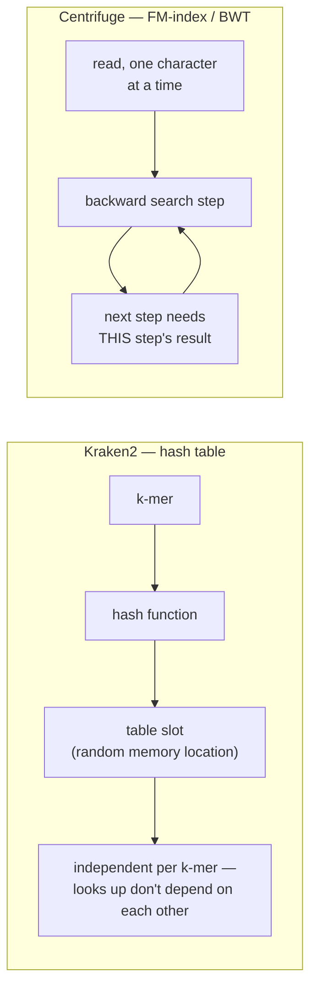
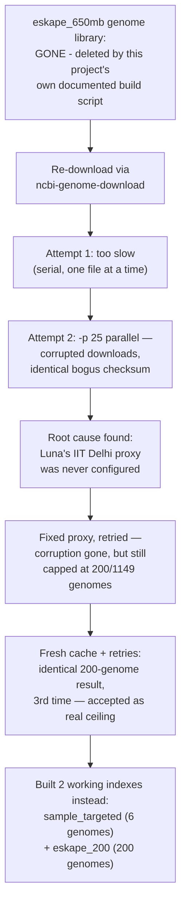
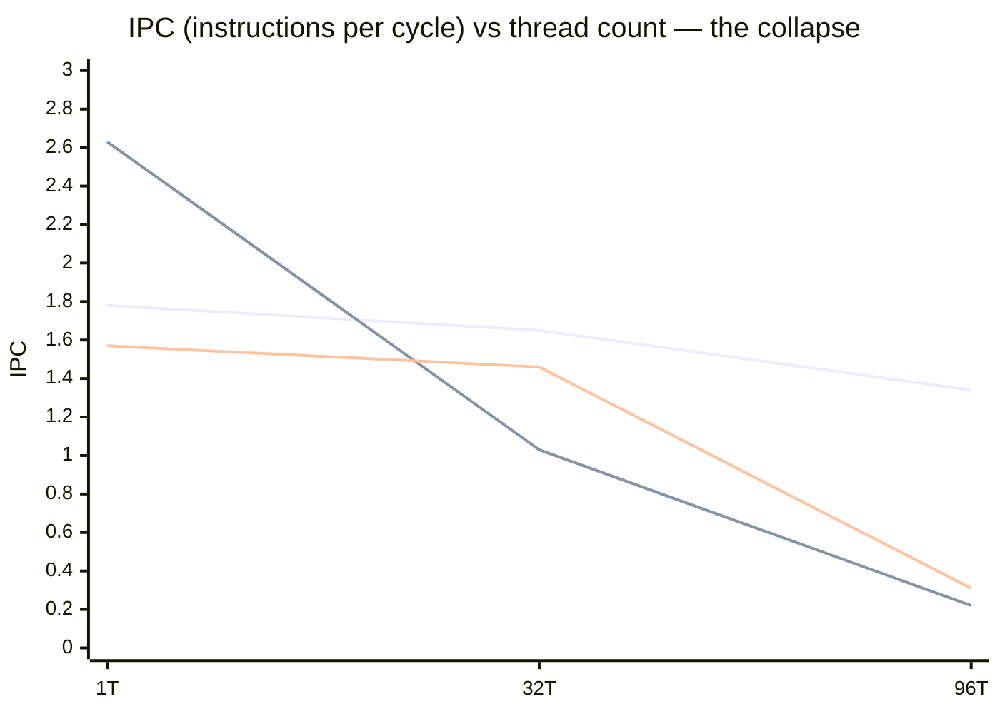
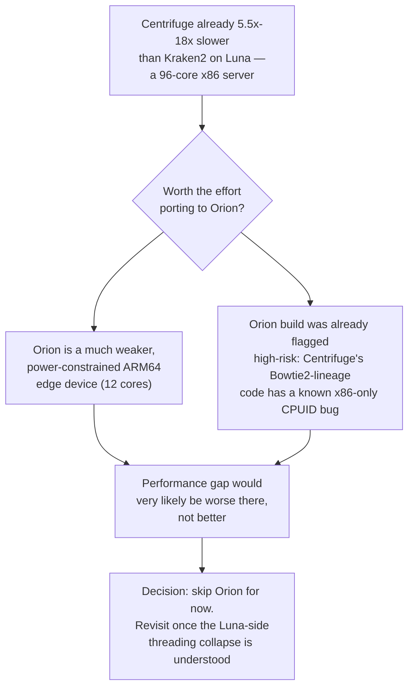

# Week 1 findings — Centrifuge vs Kraken2 on Luna

both thesis pieces (adaptive k-mer cache, cell-width + double hashing) need a real comparison point before either can claim an improvement. this document is that comparison, in one place: what Centrifuge actually is, why building its index took most of the week, and the numbers themselves.

the full step-by-step command history lives in `commands_log.md`. raw analysis and dead ends live in `observations.md`. this file is the readable summary of both.

## How Centrifuge actually works, and why it's a fair fight against Kraken2

the obvious guess is that Centrifuge is just "Kraken2 but different", same idea, different code. it isn't. the two tools solve the same problem (which organism did this DNA read come from?) with genuinely different data structures, and that difference is the whole reason this comparison is interesting.

Kraken2 hashes every k-mer (a short fixed-length chunk of DNA, typically ~31 bases) from a read into a giant lookup table, built from every reference genome it knows about. a lookup is a single hash computation plus a memory access, cheap per k-mer, but the table is huge (gigabytes to hundreds of gigabytes) and doesn't fit in cache, so most lookups pay the full cost of a trip out to main memory. this project already measured that cost precisely: 96.24% of Kraken2's cache misses concentrate in one function, `CompactHashTable::Get()`.

Centrifuge takes the opposite approach. instead of a hash table, it compresses every reference genome into a single structure called an **FM-index**, built on the Burrows-Wheeler Transform (BWT), the same underlying idea that powers `bzip2` compression. searching it means walking backward through a read one character at a time, and each step depends on the result of the step before it, a serial chain, not independent lookups. that gives Centrifuge a much smaller memory footprint than Kraken2's hash table, but it trades away the embarrassingly-parallel access pattern Kraken2 enjoys.

that's the theoretical prediction this week set out to test: Kraken2 should be fast-but-memory-hungry, Centrifuge should be memory-light-but-serial. what we actually measured told a different, more interesting story, see the results section below.

## Why we had to rebuild the genome database from scratch

the plan was simple on paper: reuse the exact same reference genomes Kraken2's `eskape_650mb` database was already built from, so both tools get compared on identical data. that genome library turned out to be gone.

two separate things had happened to it, and only one was expected:

1. **Expected:** this project's own build script deliberately deletes the downloaded genome files once a Kraken2 database finishes building, that's documented, on-purpose cleanup, not an accident.
2. **Not expected:** the finished Kraken2 databases themselves (`eskape_650mb`, `eskape_human_4gb`, the actual usable `.k2d` files) were *also* gone, which nothing in the documented process explains. that's a separate, unresolved loss worth flagging on its own.

so there was nothing to reuse. we re-downloaded the same six ESKAPE species by taxonomy ID, hit a chain of real infrastructure problems along the way (Luna's internet needing a campus proxy that had never been configured, then a stale cached genome catalog, then an apparently outdated download tool), full blow-by-blow in `observations.md`, and landed on two working reference sets instead of the original one:

| Index | Genomes | Source |
|---|---|---|
| `sample_targeted` | 6 (one representative strain per ESKAPE species, plus *E. coli*) | already sitting on disk, untouched, no download needed |
| `eskape_200` | 200 (many strains per species, strict ESKAPE only, no *E. coli*) | re-downloaded fresh this week |

neither is the original 1149-genome set the plan assumed existed. we stopped chasing the full set once three independent fixes (parallelism, proxy, fresh cache) all landed on the identical 200-genome ceiling, a real, reproducible limit worth documenting, not something to keep retrying indefinitely.

## Why `standard_8gb`, `standard_16gb`, and `pluspf_103gb` couldn't be used

these three databases were never built from raw genome files we have, they're **pre-built Kraken2 binary downloads**, fetched directly as compiled `.k2d` files from NCBI's own genome-idx mirror. there's no FASTA behind them on this machine to hand to `centrifuge-build`, because none was ever downloaded; Kraken2's own build process for these three skipped the "download raw genomes" step entirely in favor of grabbing an already-finished index.

building Centrifuge equivalents of these would mean downloading the actual raw sequence data they're built from, for `pluspf_103gb` specifically (bacteria + archaea + viral + human + protozoa + fungi), that's very likely several hundred gigabytes of raw FASTA, not the 103 GB the finished Kraken2 index takes up. Luna currently has 149 GB free. that's a week 2+ undertaking requiring real disk-space planning, not something to fit into this week.

## Results

### Wall time (seconds) — lower is better

| Threads | Kraken2 (`sample_targeted`) | Centrifuge (`sample_targeted`) | Kraken2 (`eskape_650mb`/`200`) | Centrifuge (`eskape_200`) |
|---|---|---|---|---|
| 1 | 19.729 | 48.461 | 21.981 | 134.460 |
| 32 | 0.928 | 5.115 | 1.045 | 5.653 |
| 96 | 1.105 | **19.682** | 1.164 | **16.355** |

at Kraken2's own best config (32 threads), Centrifuge is consistently **~5.4-5.5x slower** on both databases. push to 96 threads and Centrifuge falls apart, 14-18x slower than Kraken2 at that thread count, because Kraken2 barely changes from 32T to 96T while Centrifuge gets dramatically worse.

Kraken2's IPC drifts down gently as threads increase, normal, expected contention. Centrifuge's IPC *starts higher* than Kraken2's at 1 thread, stays reasonable at 32, then falls off a cliff at 96. that cliff, not cache behavior, is the real story of this week's profiling.

### Cache-miss and LLC-miss rate (%) — lower is better

| Threads | Kraken2 (`sample_targeted`) LLC% | Centrifuge (`sample_targeted`) LLC% | Kraken2 (`eskape_650mb`/`200`) LLC% | Centrifuge (`eskape_200`) LLC% |
|---|---|---|---|---|
| 1 | 10.19 | 0.71 | 30.70 | 25.21 |
| 32 | 14.64 | 1.21 | 30.53 | 23.82 |
| 96 | 15.72 | 0.73 | 32.56 | 22.93 |

this is the counter-intuitive result. Centrifuge's cache behavior is **better than Kraken2's at every single measurement**, sometimes dramatically so (12x lower at the small scale). the FM-index's theoretical cache-locality disadvantage never showed up. whatever makes Centrifuge slow, it isn't this.

### Classified% (species-level accuracy) — same reads, same 6 ESKAPE species

| Species | Kraken2 (`sample_targeted`) | Centrifuge (`sample_targeted`) | Centrifuge (`eskape_200`) |
|---|---|---|---|
| *P. aeruginosa* PAO1 | 52.50% | 52.75% | 96.71%* |
| *E. coli* K-12 | 21.79% | 21.87% | — (not in this reference) |
| *K. pneumoniae* HS11286 | 9.92% | 10.29% | 38.21%* |
| Overall classified% | 84.80% | 85.29% | 85.97% |

\* `eskape_200`'s per-species percentages aren't directly comparable to the other two columns, it has 200 strain-diverse genomes instead of 6, so reads that would've mapped to *E. coli* (absent from this reference) get reassigned to the closest available match instead of going unclassified. overall classified% stayed roughly stable (85.97% vs 85.29%) even without *E. coli* in the reference, a real finding about how sensitive these numbers are to *which* genomes are in the reference set, not just how many.

> [!IMPORTANT]
> per the week 1 plan's own caution: treat every accuracy number above as **"unvalidated, threshold/rank mismatch, not directly comparable."** Kraken2 and Centrifuge use different default confidence thresholds, so some of this gap could be a real sensitivity difference or just a threshold artifact.

## The actual conclusion

**How slow:** ~5.5x slower than Kraken2 at each tool's best thread count (32 threads on Luna). push past that to 96 threads and Centrifuge gets dramatically worse, 14-18x slower, while Kraken2 barely notices.

**Why:** not cache misses. Centrifuge's cache behavior is consistently *better* than Kraken2's, the opposite of what the FM-index literature predicted going in. the real cause is **thread scaling**: Centrifuge's IPC (instructions completed per CPU cycle) collapses from ~1.5 down to ~0.2-0.3 at 96 threads, a classic signature of lock contention or synchronization overhead between threads, not a memory-latency problem. it scales fine up to 32 threads, then something in its own threading implementation breaks down beyond that.

**What we don't know yet:** the exact function or lock responsible. that needs one more level of profiling (`perf record --call-graph dwarf`), the week 1 plan's own "go deeper" stretch goal, not done this session.

**What to actually do with this:** don't run Centrifuge above ~32 threads on Luna. that's a concrete, actionable recommendation worth taking to Kolin sir directly, and a real first data point for both thesis pieces' "how does Centrifuge compare" baseline.

## Decision: dropping the Orion port this week

the week 1 plan's step 2 was installing Centrifuge on Orion (the ARM64 Jetson edge device) as a parallel track. we're dropping it for now.

if Centrifuge already struggles to use Luna's cores efficiently, there's no reason to expect it'll do better on hardware with a fraction of the compute and a documented ARM64 build risk on top. better use of the remaining time: understand *why* the threading collapses on the machine we already have working, before spending a session fighting an ARM64 build for a tool that may not be competitive either way.

**Orion isn't abandoned, just deprioritized**, worth reopening once there's a concrete reason to (e.g. the threading bug turns out to be a Luna-specific NUMA/topology quirk rather than a general Centrifuge limitation, which the Orion data point would help settle).
