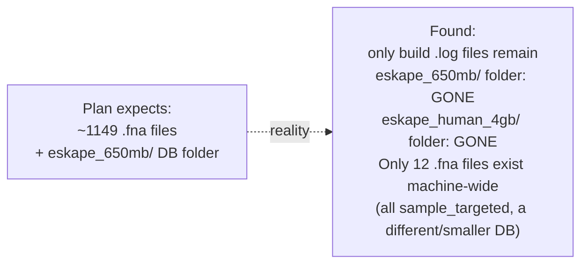
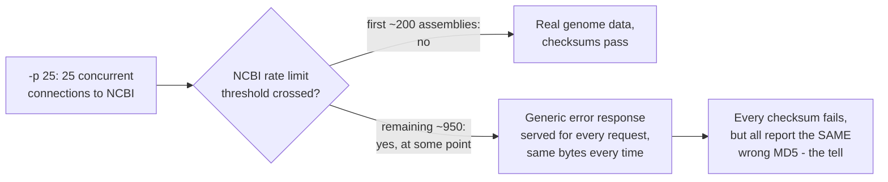

# Centrifuge — Observations & Findings

The "what did we learn" companion to `commands_log.md`. Anything worth remembering — a surprise, a gotcha, a decision made and why — goes here as it happens, not reconstructed at the end of the week.

---

## Luna storage baseline (2026-08-01)

| Mount | Size | Used | Avail | Use% |
|---|---|---|---|---|
| `/` (`/dev/sda3`) | 938 GB | 742 GB | 149 GB | 84% |

149 GB free is enough headroom for the Centrifuge build, index, and a re-fetched taxonomy folder (the Kraken2 build's own cleanup step deletes that ~14 GB taxonomy folder once its DB is built — see Week 1 plan Step 3 — so it may need re-downloading here too). Not tight yet, but worth tracking `student`'s home-folder usage specifically so we know how much of that 742 GB used is actually ours vs. other users/system.

`student`'s home folder alone is **315 GB** of the 742 GB used machine-wide — under half, meaning ~427 GB is other accounts/system, not ours to reclaim. Next: break down `~/` by subfolder to find what's actually worth cleaning inside our own 315 GB.

### Where student's 315 GB actually lives

| Folder | Size | Likely contents | Cleanup candidate? |
|---|---|---|---|
| `AccuracyDrift/` | 138G | Kraken2 databases (per CLAUDE.md, up to 103 GB for `pluspf_103gb` alone) | Need per-DB breakdown before touching — this is the project's core data |
| `data/` | 111G | Unclear — CLAUDE.md only documents `~/data/kraken2_db/` as an 8 GB standard DB, doesn't explain the other ~103 GB | Needs breakdown, biggest unknown |
| `results/` | 51G | Basecalling reads + profiling outputs | Probably load-bearing, check before touching |
| `snn/` | 6.1G | Unclear, not documented anywhere in project docs | Ask CK what this is before touching |
| `tools/` | 5.2G | Kraken2/Centrifuge source + binaries (documented in CLAUDE.md) | Needed, don't touch |
| `.cache/` | 3.2G | pip/conda/etc caches | Safe to clear if space gets tight (`conda clean`, `pip cache purge`) |
| loose tarballs (top level) | unknown, not in du output as dirs | `kraken_runs_small.tar.gz`, `runs_txt_only.tar.gz` — sound like already-extracted backups | Ask CK if these are still needed before deleting |
| `.tmp_pod5_v3_v4_migration_*` × 4 | ~44M total | Leftover temp folders from a pod5 format migration | Small, but likely safe to delete — leftover temp dirs, not a current dependency |

`data/` (111G) is the biggest open question — CLAUDE.md doesn't account for most of what's in there, so that's the next thing to look at.

### ~/data breakdown (111G)

| Folder | Size | What it is | Cleanup candidate? |
|---|---|---|---|
| `pod5/` | 66G | Raw nanopore signal data (input to Dorado) | No — this is raw input data, not reproducible |
| `basecalled/` | 36G | Dorado basecaller output | No — likely feeds Kraken2 runs, check before touching |
| `kraken_runs/` | 9.4G | Kraken2 run outputs | Probably not junk, but worth asking if old runs can be archived/removed |
| `.temp_dorado_model-*` × 10 folders | ≈740M | Leftover temp folders from Dorado model downloads (name pattern matches a known temp-file convention, not a real dependency) | **Yes** — these look like crash/interrupt leftovers, same pattern as the ones already seen in `~` |
| `.tmp_pod5_v3_v4_migration_*` × 2 | ≈26M | Leftover temp folders from a pod5 format migration | **Yes** — same as the 4 already seen in `~`, safe-looking junk |

Combined with the 4 `.tmp_pod5_v3_v4_migration_*` folders already found directly in `~` (≈44M), there's roughly **810 MB of leftover temp-folder junk** across `~` and `~/data` that looks safe to delete — small relative to 149 GB free, but a real, low-risk first win. The three big folders (`pod5`, `basecalled`, `kraken_runs`) and the still-unbroken-down `AccuracyDrift/` (138G) are where any *real* space would come from, but those need CK's confirmation before anything gets touched — they're data/results, not junk.

**Decision (2026-08-01):** leave the ~810 MB of temp-folder junk in place for now — 149 GB free is enough headroom to proceed with Centrifuge. Revisit deletion only if space actually gets tight later. `AccuracyDrift/` breakdown and the two loose tarballs were not investigated further — storage audit paused here, resuming the actual Step 1 build.

---

## ⚠️ eskape_650mb genome library is missing (found 2026-08-01, Step 3.1/3.2)

The Week 1 plan's Step 3 assumes the ~1149 `.fna` ESKAPE genome files used to build Kraken2's `eskape_650mb` database are still sitting on disk, ready to concatenate for Centrifuge. **They aren't.**

What's confirmed:
- `~/AccuracyDrift/databases/eskape_650mb/` and `.../eskape_human_4gb/` don't exist — only `eskape_650mb_build.log` and `eskape_human_4gb_build.log` remain as evidence they once did.
- The 4 databases that *do* still exist: `pluspf_103gb`, `sample_targeted`, `standard_16gb`, `standard_8gb`.
- No `eskape_genomes/` directory anywhere within 3 levels of home.
- Total `.fna` files on the entire machine: 12, all under `sample_targeted/library/added/` — not the ESKAPE set.

**Why this matters:** this isn't just a missing-taxonomy-folder situation the plan already anticipated (Step 3's known caveat about Kraken2's cleanup deleting `taxonomy/`) — the genome *library itself* is gone, not just its derived taxonomy scratch folder. Either it was cleaned up at some point after the original Kraken2 build (disk pressure was flagged as a recurring theme in this project — Orion's own docs mention it — plausible something similar happened here), or it lives somewhere not yet checked (a backup tarball, a different mount, Minerva, a colleague's account).

**Resolved (2026-08-01):** searched the entire machine (`find /`, both loose top-level tarballs) — no backup exists anywhere. Every "eskape" match on disk is a leftover *run-result* log (perf/report/output `.txt` files from when the databases were originally benchmarked), not genome or database data. **Decision: re-download the genomes fresh via `ncbi-genome-download`, following `AccuracyDrift/README.md`'s documented build procedure**, to regenerate the same ESKAPE species set.

### Root cause, from AccuracyDrift/README.md (read locally, not on Luna)

Two separate things are going on, one expected and one not:

1. **Expected — genome library deletion is by design.** The documented build script (`AccuracyDrift/README.md` line 114) ends with an unconditional `rm -rf eskape_genomes` after *both* `eskape_650mb` and `eskape_human_4gb` finish building. The Week 1 plan's own caveat about the taxonomy folder being deleted was right in spirit, but the actual script deletes the whole genome library too — this was always going to be gone, by design, once both builds finished.
2. **Not expected — the built databases themselves are gone too.** The documented script only ever deletes `taxonomy/` and `library/` *inside* each DB folder (README lines 100, 111) — it's never supposed to touch the top-level `eskape_650mb/`/`eskape_human_4gb/` folders or their `hash.k2d`/`taxo.k2d`/`opts.k2d` files. Those files are the actual usable Kraken2 databases. But per Step 3.2, those whole folders don't exist anymore either — only their build `.log` files survive. **This means the loss is bigger than "need genomes for Centrifuge": the built `eskape_650mb` and `eskape_human_4gb` Kraken2 databases no longer exist on Luna at all**, and nothing in the documented procedure explains why. Worth a separate note to Kolin sir / for the thesis writeup — any future Kraken2 rerun against those two specific DBs needs a full rebuild too, not just a Centrifuge-side fix.

**Species/taxid reference for the re-download** (from README): ESKAPE taxids `E.faecium=1352, S.aureus=1280, K.pneumoniae=573, A.baumannii=470, P.aeruginosa=287, Enterobacter=547`. Original command downloaded 1149 complete bacterial assemblies (~7 GB uncompressed) via `ncbi-genome-download --taxids 1352,1280,573,470,287,547 --formats fasta --assembly-levels complete bacteria`.

This time, the `eskape_genomes/` folder should be **kept**, not deleted afterward — Centrifuge's index build (Step 3 of the Week 1 plan) needs it, unlike the Kraken2-only script this README documents.

## Fast-path option: sample_targeted already has everything intact (2026-08-01)

Unlike `eskape_650mb`/`eskape_human_4gb`, `sample_targeted/` (the 50 MB demo DB) survived completely — `hash.k2d`/`taxo.k2d`/`opts.k2d`, `seqid2taxid.map`, and a full `taxonomy/` folder (`nodes.dmp`, `names.dmp`) are all still there. This lets us build a first, small Centrifuge comparison index **without waiting on the big eskape_genomes re-download**.

One wrinkle resolved: `library/added/` has 12 `.fna` files, not 6. `seqid2taxid.map` (17 sequences, 6 distinct taxids) plus file-size pairing confirms the **6 `GCF_`-named files are the real reference genomes** actually used to build this DB; the 6 randomly-named files (`0GY9zJXjkl.fna` etc., each near-identical in size to a `GCF_` file) are duplicate leftovers from something unrelated, not part of the real build.

| Taxid | Species | Sequences | File |
|---|---|---|---|
| 511145 | *E. coli* K-12 | NC_000913.3 | `GCF_000005845.2_ASM584v2_genomic.fna` |
| 208964 | *P. aeruginosa* PAO1 | NC_002516.2 | `GCF_000006765.1_ASM676v1_genomic.fna` |
| 93061 | *S. aureus* | NC_007795.1 | `GCF_000013425.1_ASM1342v1_genomic.fna` |
| 716541 | *A. baumannii* | NC_014107/108/121.1 | `GCF_000025565.1_ASM2556v1_genomic.fna` |
| 1125630 | *K. pneumoniae* HS11286 | NC_016838-847.1 (7 seqs) | `GCF_000240185.1_ASM24018v2_genomic.fna` |
| 333849 | *E. faecium* | NC_017960-963.1 | `GCF_000174395.2_ASM17439v2_genomic.fna` |

**Plan:** concatenate only these 6 `GCF_` files, reuse the existing `seqid2taxid.map` and `taxonomy/` (`nodes.dmp`/`names.dmp`) as-is — no `centrifuge-download` needed for this fast path — and run `centrifuge-build` straight away. Output goes to a new `centrifuge_sample_targeted/` folder, separate from the eventual full-scale `centrifuge_eskape/` build once the big download finishes.

---

## ⚠️ -p 25 triggered NCBI throttling — big download only got ~200/1149 genomes (2026-08-01)

The parallel restart (Step 3.6, `-p 25`) ran for a while, then silently exited on its own. Log analysis (Step 3.9) shows the real cause: every `Checksum mismatch` error reports the exact same received MD5 (`14aa54cecceebc1536a4d1ee4a5c08ec`) no matter which assembly was being fetched. Identical bytes across unrelated files means the same thing every time — NCBI stopped serving real file content and started returning a generic error/rate-limit response instead, and `-p 25` downloaded that error response 900+ times over, each one correctly flagged and rejected by the tool's own checksum check.

This validates the throttling risk flagged before picking `-p 25` over the suggested safer `10` — it didn't fail immediately, but it did fail partway through a long run. **Only ~200 of ~1149 target genomes actually downloaded successfully.** Not yet decided: whether to retry the remaining ~950 at a lower parallelism (e.g. `-p 8-10`) after giving NCBI's rate limiter time to reset, or accept the 200 as a smaller-but-real ESKAPE set for now. This doesn't block the `sample_targeted` fast-path build, which is independent and already has everything it needs.

### Update — theory revised, three attempts now, same accessions fail every time

Ran the retry twice more (`-p 8` twice). Both times: `.fna` count stuck at exactly 200, and — the key new detail — **the exact same accessions fail on every attempt** (`GCF_045690395.1`, `GCF_046531215.1`, `GCF_046531345.1`, etc. recur identically across all three independent runs), not a shifting random subset. That doesn't fit pure "too many concurrent/total requests" rate-limiting as cleanly as first thought — a request-budget limit would more likely affect whichever records happen to be in flight when the budget runs out, which should vary run to run. Consistently the same ~950 records failing suggests something specific to those particular records or their CDN path (a blocked edge node, a stale/regenerated file NCBI's catalog hasn't caught up to, or similar) rather than a simple global throttle.

**Diagnostic result:** two back-to-back `curl` tests to the same NCBI file behaved completely differently. First (with an incorrectly-built URL): went through what looks like a proxy CONNECT tunnel (`HTTP/1.0 200 Connection established`), then got a fast, real `404` from NCBI. Second (corrected URL, verbose): tried direct IPv4/IPv6 connections — IPv6 failed instantly ("Network is unreachable"), IPv4 hung for **3.5 minutes** before timing out. No proxy env vars set anywhere (`http_proxy`/`https_proxy`/`/etc/environment` all empty).

**Root cause: Luna's outbound HTTPS connectivity to NCBI is intermittent/unreliable at the network level** — not a `ncbi-genome-download` bug, not purely a parallelism/rate-limit issue. Diagnosing the exact mechanism (transparent proxy? campus firewall?) would need root-level network access (`iptables`, routing tables), out of scope here. This explains everything observed: some requests connect fine, some hang/fail, whatever leaks through on the failing path collapses to one recurring bogus checksum, and it's consistently the *same* accessions because whatever's flaky about the path is itself consistent per-destination.

**Decision (2026-08-01):** one more retry, fully serial (`-p 1`) with a long per-request timeout — the most conservative possible attempt, least likely to trip whatever's flaky, before accepting the ~200-genome partial set as this week's result if it still doesn't improve.

## First real Kraken2 vs Centrifuge comparison (2026-08-01)

Ran Centrifuge on `sample_targeted`'s index against `reads_hac.fastq` (the same reads Kraken2 was already benchmarked against — see `AccuracyDrift/RESULTS.md` line 229 and `AccuracyDrift/reports/hac_sample_targeted.txt`). First-ever head-to-head numbers for this project:

| Species | taxid | Kraken2 reads | Centrifuge reads | Kraken2 % | Centrifuge % |
|---|---|---|---|---|---|
| *P. aeruginosa* PAO1 | 208964 | 55,077 | 55,338 | 52.50% | 52.75% |
| *E. coli* K-12 MG1655 | 511145 | 22,860 | 22,946 | 21.79% | 21.87% |
| *K. pneumoniae* HS11286 | 1125630 | 10,411 | 10,796 | 9.92% | 10.29% |
| *E. cloacae* ATCC 13047 | 716541 | 503 | 723 | 0.48% | 0.69% |
| *S. aureus* NCTC 8325 | 93061 | 7 | 17 | 0.01% | 0.02% |
| *E. faecium* DO | 333849 | 5 | 5 | 0.00% | 0.00% |
| **Unclassified** | — | 15,945 | 15,433 | 15.20% | 14.71% |

Also from the same Kraken2 run (32T, Luna): Time 0.928s, Cache Miss Rate% 15.44%, LLC Miss Rate% 14.64%, IPC 1.65 — these are the numbers Centrifuge's own `perf stat` run (Step 4, not done yet) needs to be measured against once we add profiling on top of this same run.

**Pattern:** both tools agree on the overall species distribution, but Centrifuge classifies slightly more reads at every single species, with correspondingly fewer unclassified reads.

> [!WARNING]
> Per the Week 1 plan: label this **"unvalidated — threshold/rank mismatch, not directly comparable."** Kraken2 and Centrifuge use different default confidence/score thresholds, so this gap could reflect a real sensitivity difference or just be a threshold artifact — not yet something to draw a conclusion from.

### Actual fix found: IIT Delhi's proxy was never configured

CK independently knew the answer: Luna needs to route outbound traffic through IIT Delhi's institutional proxy, `proxy62.iitd.ac.in:3128`, which was never set in this shell. This exactly matches the diagnosis above — explains the proxy-tunnel-shaped success on one test and the direct-connection hangs on another (whichever path happened to route through vs. around the (unconfigured) proxy). Set via `export HTTP_proxy`/`HTTPS_proxy`/`http_proxy`/`https_proxy=http://proxy62.iitd.ac.in:3128`, persisted to `.bashrc`. `ncbi-genome-download` is Python, and Python's `requests`/`urllib` respect these env vars automatically — no code/flag changes needed on the tool's side. Verification: re-ran the exact request that hung 3.5 minutes earlier; result logged in commands_log.md.

---
