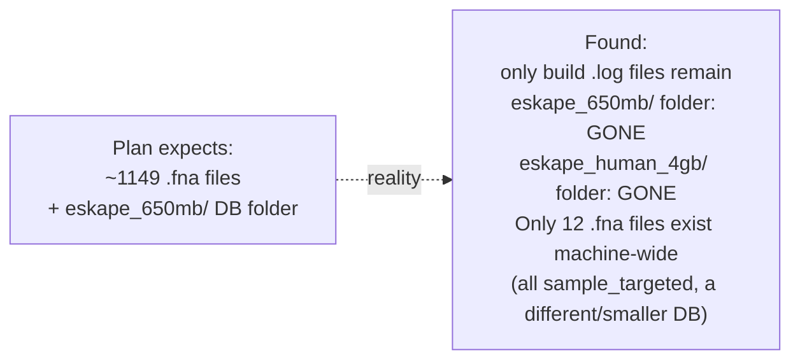

# Centrifuge — Observations & Findings

The "what did we learn" companion to `commands_log.md`. Anything worth remembering — a surprise, a gotcha, a decision made and why — goes here as it happens, not reconstructed at the end of the week.

---

## Luna storage baseline (2026-08-01)

| Mount | Size | Used | Avail | Use% |
|---|---|---|---|---|
| `/` (`/dev/sda3`) | 938 GB | 742 GB | 149 GB | 84% |

149 GB free is enough headroom for the Centrifuge build, index, and a re-fetched taxonomy folder (the Kraken2 build's own cleanup step deletes that ~14 GB taxonomy folder once its DB is built — see Week 1 plan Step 3 — so it may need re-downloading here too). Not tight yet, but worth tracking `student`'s home-folder usage specifically so we know how much of that 742 GB used is actually ours vs. other users/system.

`student`'s home folder alone is **315 GB** of the 742 GB used machine-wide — under half, meaning ~427 GB is other accounts/system, not ours to reclaim. Next: break down `~/` by subfolder to find what's actually worth cleaning inside our own 315 GB.

### Where student's 315 GB actually lives

| Folder | Size | Likely contents | Cleanup candidate? |
|---|---|---|---|
| `AccuracyDrift/` | 138G | Kraken2 databases (per CLAUDE.md, up to 103 GB for `pluspf_103gb` alone) | Need per-DB breakdown before touching — this is the project's core data |
| `data/` | 111G | Unclear — CLAUDE.md only documents `~/data/kraken2_db/` as an 8 GB standard DB, doesn't explain the other ~103 GB | Needs breakdown, biggest unknown |
| `results/` | 51G | Basecalling reads + profiling outputs | Probably load-bearing, check before touching |
| `snn/` | 6.1G | Unclear, not documented anywhere in project docs | Ask CK what this is before touching |
| `tools/` | 5.2G | Kraken2/Centrifuge source + binaries (documented in CLAUDE.md) | Needed, don't touch |
| `.cache/` | 3.2G | pip/conda/etc caches | Safe to clear if space gets tight (`conda clean`, `pip cache purge`) |
| loose tarballs (top level) | unknown, not in du output as dirs | `kraken_runs_small.tar.gz`, `runs_txt_only.tar.gz` — sound like already-extracted backups | Ask CK if these are still needed before deleting |
| `.tmp_pod5_v3_v4_migration_*` × 4 | ~44M total | Leftover temp folders from a pod5 format migration | Small, but likely safe to delete — leftover temp dirs, not a current dependency |

`data/` (111G) is the biggest open question — CLAUDE.md doesn't account for most of what's in there, so that's the next thing to look at.

### ~/data breakdown (111G)

| Folder | Size | What it is | Cleanup candidate? |
|---|---|---|---|
| `pod5/` | 66G | Raw nanopore signal data (input to Dorado) | No — this is raw input data, not reproducible |
| `basecalled/` | 36G | Dorado basecaller output | No — likely feeds Kraken2 runs, check before touching |
| `kraken_runs/` | 9.4G | Kraken2 run outputs | Probably not junk, but worth asking if old runs can be archived/removed |
| `.temp_dorado_model-*` × 10 folders | ≈740M | Leftover temp folders from Dorado model downloads (name pattern matches a known temp-file convention, not a real dependency) | **Yes** — these look like crash/interrupt leftovers, same pattern as the ones already seen in `~` |
| `.tmp_pod5_v3_v4_migration_*` × 2 | ≈26M | Leftover temp folders from a pod5 format migration | **Yes** — same as the 4 already seen in `~`, safe-looking junk |

Combined with the 4 `.tmp_pod5_v3_v4_migration_*` folders already found directly in `~` (≈44M), there's roughly **810 MB of leftover temp-folder junk** across `~` and `~/data` that looks safe to delete — small relative to 149 GB free, but a real, low-risk first win. The three big folders (`pod5`, `basecalled`, `kraken_runs`) and the still-unbroken-down `AccuracyDrift/` (138G) are where any *real* space would come from, but those need CK's confirmation before anything gets touched — they're data/results, not junk.

**Decision (2026-08-01):** leave the ~810 MB of temp-folder junk in place for now — 149 GB free is enough headroom to proceed with Centrifuge. Revisit deletion only if space actually gets tight later. `AccuracyDrift/` breakdown and the two loose tarballs were not investigated further — storage audit paused here, resuming the actual Step 1 build.

---

## ⚠️ eskape_650mb genome library is missing (found 2026-08-01, Step 3.1/3.2)

The Week 1 plan's Step 3 assumes the ~1149 `.fna` ESKAPE genome files used to build Kraken2's `eskape_650mb` database are still sitting on disk, ready to concatenate for Centrifuge. **They aren't.**

What's confirmed:
- `~/AccuracyDrift/databases/eskape_650mb/` and `.../eskape_human_4gb/` don't exist — only `eskape_650mb_build.log` and `eskape_human_4gb_build.log` remain as evidence they once did.
- The 4 databases that *do* still exist: `pluspf_103gb`, `sample_targeted`, `standard_16gb`, `standard_8gb`.
- No `eskape_genomes/` directory anywhere within 3 levels of home.
- Total `.fna` files on the entire machine: 12, all under `sample_targeted/library/added/` — not the ESKAPE set.

**Why this matters:** this isn't just a missing-taxonomy-folder situation the plan already anticipated (Step 3's known caveat about Kraken2's cleanup deleting `taxonomy/`) — the genome *library itself* is gone, not just its derived taxonomy scratch folder. Either it was cleaned up at some point after the original Kraken2 build (disk pressure was flagged as a recurring theme in this project — Orion's own docs mention it — plausible something similar happened here), or it lives somewhere not yet checked (a backup tarball, a different mount, Minerva, a colleague's account).

**Not yet decided:** whether to (a) search further for a backup/archive of the original genome download, or (b) re-run `ncbi-genome-download` from scratch per `AccuracyDrift/README.md`'s documented build procedure to regenerate the same ESKAPE genome set. Re-downloading is the documented, known-good path if no backup turns up — but it means Centrifuge's index won't be built from literally the same files Kraken2's `eskape_650mb` was built from, only the same *species selection*, unless the original accession list is recoverable too.

---
