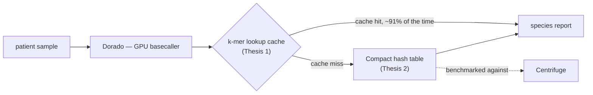
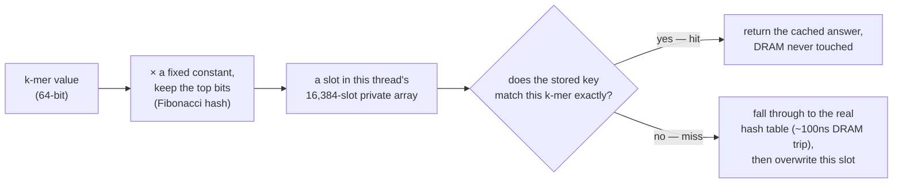
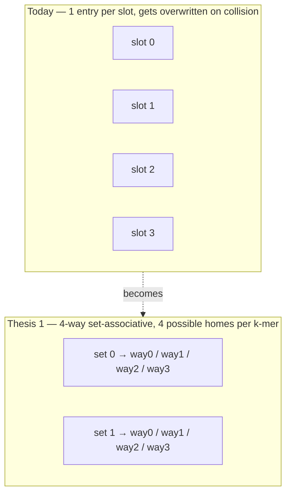
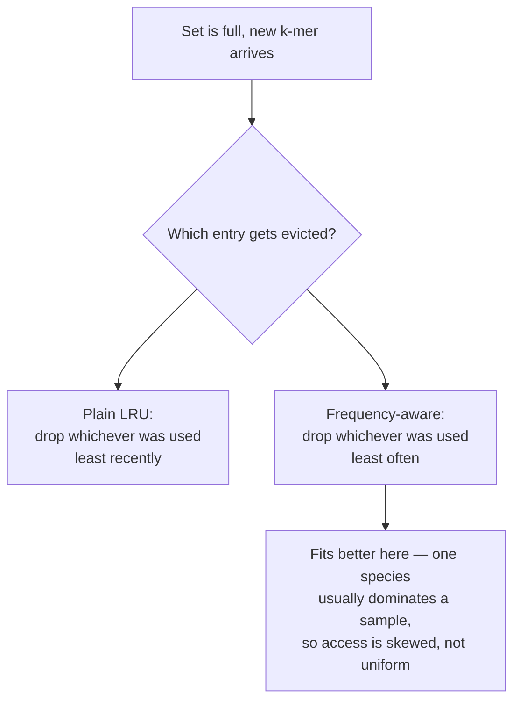
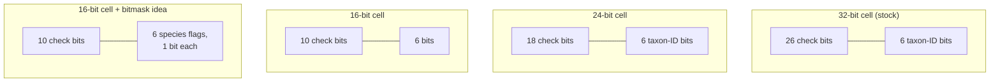
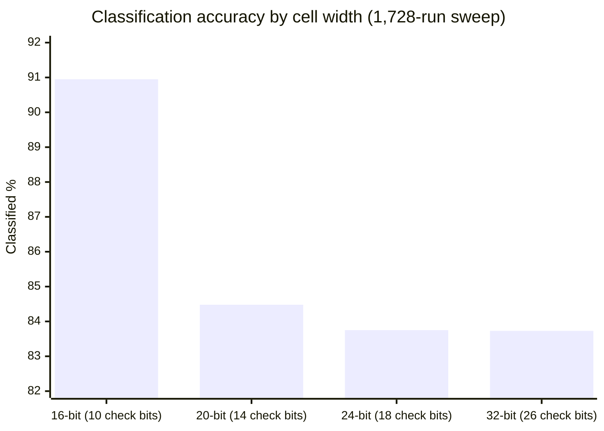
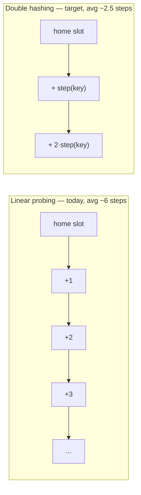
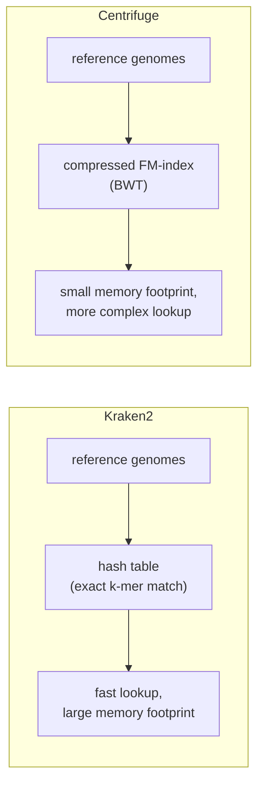
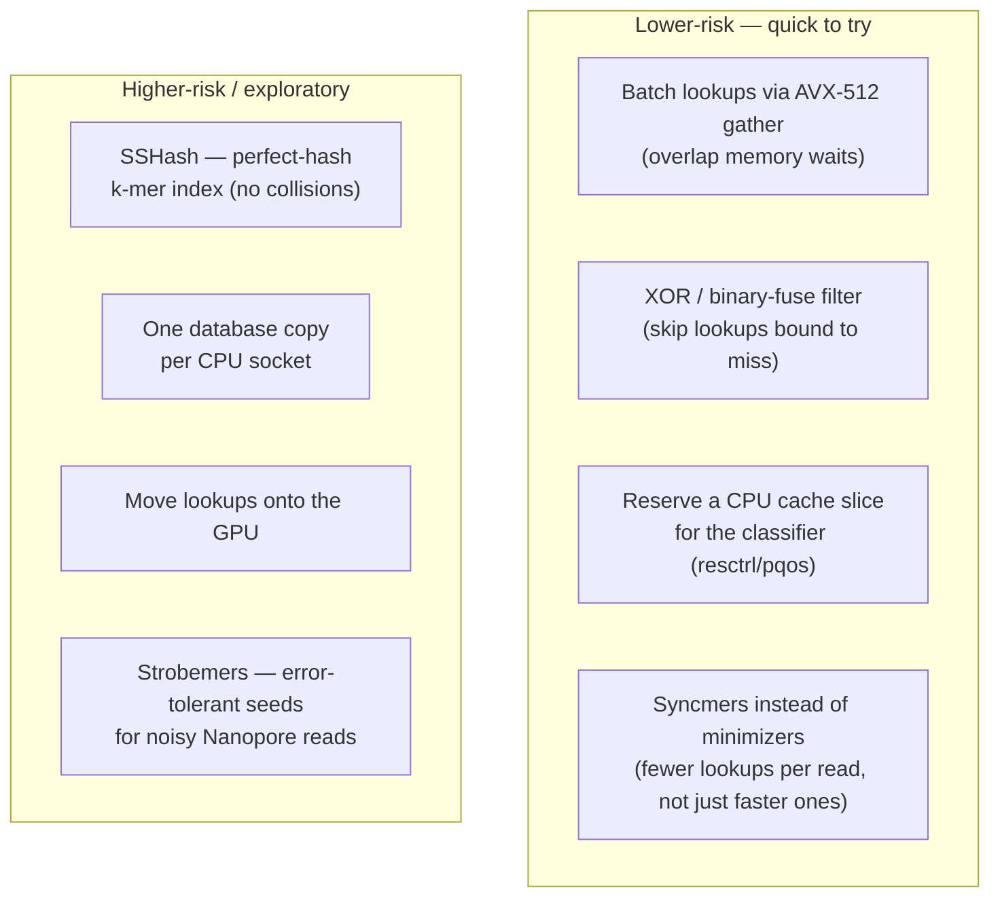
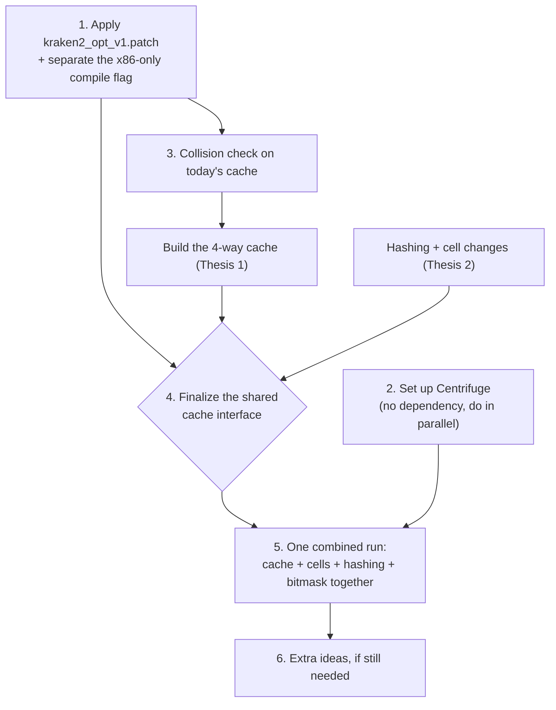

# Thesis Plan — 2026-07-25

Kolin sir asked to turn this summer's Kraken2 profiling work into two thesis pieces, both compared against Centrifuge. This is the build plan for both, plus a Centrifuge setup plan, plus some extra ideas from asking LLMs (per sir's suggestion).

Kraken2's proven bottleneck, underlying all of this: one function, `Get()`, does 0.65% of the work but causes 96.24% of the CPU's memory-cache misses, because every lookup is a random ~100ns trip to main memory. This is called being **memory-latency-bound**: speed is limited by how long each individual memory trip takes, not by how much data moves overall. Both theses attack that same problem from different angles.

**Jump to:** [Thesis 1](#thesis-1-hardware-aware-adaptive-k-mer-cache) · [Thesis 2](#thesis-2-cell-width-reduction--double-hashing) · [Centrifuge baseline](#both-theses-set-up-centrifuge-as-the-comparison-baseline) · [Prior art](#prior-art--tools-that-already-do-pieces-of-this) · [Extra ideas](#extra-ideas-optional--from-asking-llms-per-sirs-suggestion) · [Build order](#suggested-order-of-operations)

*Where both theses sit on the same lookup path: the cache (Thesis 1) is checked first, and only a miss falls through to the hash table (Thesis 2). Both get compared against Centrifuge.*

---

## Thesis 1: Hardware-Aware Adaptive K-mer Cache

**Starting point:** a cache already exists (Patch 4, designed by Kolin sir) — a simple 16,384-slot cache that catches repeat k-mers before they hit the slow hash table. It works because 90.7% of k-mer lookups in a run are repeats. It's not built out yet; it's a flat design with no real eviction logic. (Note: this cache and Thesis 2's hash-table/cell changes sit on the same lookup code path — a k-mer lookup hits this cache first, then falls through to the hash table Thesis 2 is changing — so the two theses touch shared code, not separate ones.)

> [!NOTE]
> **Quick reminder — what "Patch 4" actually is.** It's from the summer profiling work, before either thesis existed — one small block of code, designed and reviewed, but **never compiled or run**.
> - **Where it lives:** inside `ClassifySequence()` in `classify.cc`, sitting in front of the real hash-table lookup (`hash->Get()`) — it's checked first, and the hash table is only touched on a miss.
> - **How it works:** each CPU thread gets its own private array of 16,384 slots (256 KB total — sized to fit inside one CPU core's L2 cache, so it never itself causes a DRAM trip). To find a k-mer's slot: multiply the k-mer's 64-bit value by a fixed constant (a "Fibonacci hash" — a cheap trick for spreading values evenly across slots) and take the top bits as the slot number.
> - **Why it can't return a wrong answer:** a "hit" only counts if the full 64-bit k-mer stored in that slot matches the current one exactly. If it doesn't match, that's a miss, not a wrong answer — it just falls through to the real lookup.
> - **The limitation Thesis 1 fixes:** on a miss, the slot gets overwritten by whichever k-mer looked it up next — one slot, one occupant, no choice in who gets evicted. That's exactly what "4-way set-associative" (below) replaces.
> - **Why it's believed to work:** a real measurement (M5) found 90.7% of k-mer lookups in a run are repeats of one already seen — that's *why* a cache this simple is expected to pay off at all.
> - **Read the original source:** design + rationale in [`kraken2_optimisation_report.md`, §4.4](dorado-kraken-research/docs/reports/kraken2_optimisation_report.md) · full reviewed code diff in [`kraken2_get_optimizations.md`](dorado-kraken-research/docs/reports/kraken2_get_optimizations.md) · the actual (still unapplied) patch file at [`Luna/experiments/kraken2_opt_v1.patch`](dorado-kraken-research/Luna/experiments/kraken2_opt_v1.patch) · the 90.7% measurement in [`AccuracyDrift/patches.md`](dorado-kraken-research/AccuracyDrift/patches.md) (search "M5").
> - **The general technique behind the "Fibonacci hash," if you want to go deeper:** it's a variant of Donald Knuth's multiplicative hashing method (*The Art of Computer Programming*, Vol. 3, §6.4) — multiply by a fixed odd constant and keep the top bits, instead of `key % table_size`. The golden-ratio constant specifically is chosen because it's the "most irrational" number (its continued-fraction expansion is all 1s), so its multiples spread out evenly across the table instead of clustering — and it's faster than modulo since it's just a multiply-and-shift. Modern explainer: [Malte Skarupke, "Fibonacci Hashing: The Optimization that the World Forgot"](https://probablydance.com/2018/06/16/fibonacci-hashing-the-optimization-that-the-world-forgot-or-a-better-alternative-to-integer-modulo/) (2018).

*Patch 4's actual mechanism today — one slot per address, whoever looks it up last wins it.*

*A k-mer that collides today just overwrites whatever was there. Grouping slots into 4-way sets gives it 4 possible homes instead of 1.*

- [ ] **Make it 4-way set-associative.** Right now each cache slot holds one entry and just gets overwritten on collision. Group slots into sets of 4, so a k-mer has 4 possible homes instead of 1, cutting accidental overwrites. Measure: hit rate and CPU cache-miss rate, before vs. after.
- [ ] **Make the cache size itself to the machine.** The cache is currently a fixed size, hand-tuned for one machine. Read the machine's actual cache size at startup (Linux exposes this at `/sys/devices/system/cpu/cpu0/cache/`) and size the k-mer cache as a set fraction of it — start at half the per-socket cache (leaving the other half for the hash table itself and other per-thread memory that shares the same cache), then tune that fraction empirically if needed. This matters because our two machines are wildly different: every run pins to one CPU socket (`numactl --cpunodebind=0 --membind=0`), and Luna gives each socket 105MB of shared cache vs. Orion's 4MB on its single edge chip. Measure: hit rate and memory footprint on Luna and on Orion separately, to confirm the auto-sized cache works on both, not just one.
- [ ] **Make eviction biology-aware.** Clinical samples have one dominant species, so some k-mers get hit far more than others. Instead of evicting whichever entry was used least *recently* (plain LRU), evict whichever was used least *often* (frequency-based), which fits this skewed pattern better. Measure against a control run with random (non-skewed) data, to prove the gain is really coming from the skew and not just free everywhere.

*Why frequency-based eviction is the better fit for this specific workload.*

**Risks to watch:**
- Nobody has actually measured how often the *current* 1-slot design collides — worth checking first, since if collisions are already rare, the 4-way work buys less than expected.
- The patch containing Patch 4 (see the explainer above if you need a refresher on what that is) also bundles a Luna-specific x86 compile flag (`-march=sapphirerapids`), which won't build on Orion's ARM64 toolchain. The cache needs separating from that flag before this thesis's cross-machine sizing work can run on Orion at all.
- Quick check needed: confirm Orion's Jetson ARM64 kernel exposes cache size at the same `/sys/devices/system/cpu/cpu0/cache/` path Luna uses, before relying on one auto-sizing code path for both machines.
- Thesis 2's 16-bit cells need a confidence-threshold check (see Thesis 2) to stay accurate. Need to confirm a cache hit here either already passed that check or re-runs it — caching shouldn't become a way to skip it.

---

## Thesis 2: Cell-Width Reduction + Double Hashing

**Starting point:** already done and written up (the joint report, [`kraken2opti_report.tex`](dorado-kraken-research/docs/reports/kraken2opti_report.tex)) — shrinking each hash-table entry from 32 bits to 24 or 16 bits cuts the database size by 25% or 50%. 24-bit is free (no accuracy loss); 16-bit needs a small **confidence threshold** to stay accurate — an extra check that requires a couple of consistent hits before trusting a match, to filter out accidental collisions. There's a formula explaining exactly why: fewer bits means more accidental hash collisions, and the formula predicts exactly where that starts to matter. (One number worth keeping straight: the panel is **6 organisms**, but its taxonomy tree has **35 nodes** once strain-level entries below each organism are counted — that's why the value field only needs 6 bits, not because there are 6 taxa.)

*Every version keeps 6 value bits — what shrinks is the "check bits" used to confirm a match. Fewer check bits means more accidental matches.*

> [!NOTE]
> The 16-bit bar looks *higher*, not lower — but that's the problem, not a win. The true rate is ~83.7% (where 24-bit and 32-bit sit). 16-bit's extra "hits" are accidental hash collisions being counted as real matches, which is exactly what the confidence threshold exists to filter back out. (The 20-bit point isn't a fourth shipped option — only 32/24/16-bit cells were actually built — it's an extra measurement taken during the sweep to confirm the cliff sits close to where the formula predicts.)

- [ ] **Switch to double hashing.** Right now, when two k-mers collide, Kraken2 finds the next open slot by stepping forward one at a time (linear probing) — which averages about 6 steps. Double hashing picks the step size differently for each k-mer, cutting the average to about 2.5 steps. Fewer steps means fewer chances for an accidental match, which per the formula above should let the 16-bit version work accurately without needing the confidence threshold.
  - Caveat: this needs a genuinely independent second hash function. Reusing some of the bits from the first hash (a "bit-slice") doesn't count — it isn't actually independent, and won't behave like a second function. The current disabled code in Kraken2 does exactly that, so it can't just be re-enabled.
  - Measure: does the average collision-chain length actually drop from ~6 to ~2.5, and does 16-bit accuracy improve without the threshold? Run this on Luna and Orion both — a smaller database matters even more on Orion's constrained 4MB cache.

*A shorter, key-specific step sequence means fewer chances for two different k-mers to collide along the way.*

- [ ] **Add a bitmask cell.** Right now each hash-table entry stores one species ID, which needs enough bits to represent any species in the wider reference database. Since only 6 ESKAPE organisms are being tracked here, that same information could instead be stored as 6 yes/no bits — one per species, all answered in a single lookup rather than checking one species ID at a time. This fits comfortably inside the smaller 16-bit cell this thesis is already building, so no extra space is needed beyond that. This looks like a genuinely new idea, not something existing tools already do.
  - This is more than a storage change: Kraken2's classification step in `classify.cc` (which picks a read's best-supported taxon from its k-mer hits, and which `--report` output is built around) currently expects one taxon ID per hit. Consuming a bitmask hit instead needs its own logic, not just a reinterpreted cell — roughly, tally each of the 6 flags separately across all of a read's k-mer hits and call the read for whichever species (if any) crosses a support threshold, instead of picking a single best-supported ID. This logic doesn't exist yet and is the least-precedented part of this plan (see risk below).
  - The false-positive formula above (fewer bits → more accidental collisions) was derived for taxon-ID collisions. A bitmask cell fails differently: a collision flips one species flag on rather than corrupting an ID, so its accuracy needs its own check rather than assuming the taxon-ID result carries over.
  - Measure: does a bitmask-based classifier match (or beat) taxon-ID classification accuracy on the same reads, and how does its actual false-positive rate compare to the formula's prediction? Run on Luna and Orion both.

**Risks to watch:**
- Double hashing changes how the database is physically laid out on disk, so all databases need rebuilding, and old/new databases can't mix — the code needs to auto-detect which scheme a database was built with (the same way it already auto-detects cell width).
- The bitmask cell's classification logic (above) doesn't exist in Kraken2 or, as far as we know, any other classifier — it has to be designed and validated from scratch, not adapted from existing code. Treat it as the highest-uncertainty item in this plan and budget time accordingly.

---

## Both theses: set up Centrifuge as the comparison baseline

Centrifuge is a different classifier that stores its reference data as a compressed index instead of a hash table — smaller on disk, but a different and possibly slower lookup pattern. Never set up in this project before.

> [!NOTE]
> **Quick reminder — what Centrifuge actually is.** A metagenomic classifier (like Kraken2, it identifies which species a DNA read belongs to) but built on a completely different structure: an **FM-index**, based on the Burrows-Wheeler Transform (BWT). In plain terms — the BWT rearranges a genome's text so that similar surrounding context ends up grouped together, which makes it highly compressible. The FM-index then searches a read against that compressed text by walking backward through the read one character at a time, narrowing down the range of matching genome positions at each step — without ever having to decompress the reference. That's why it can be much smaller on disk than a hash table of fixed-length k-mers, at the cost of a lookup pattern that chases pointers through the compressed structure rather than one direct hash-table probe.
> - **Original paper:** Kim, Song, Breitwieser, Salzberg, ["Centrifuge: rapid and sensitive classification of metagenomic sequences,"](https://doi.org/10.1101/gr.210641.116) *Genome Research* 26(12):1721–1729 (2016).
> - **Code:** [github.com/DaehwanKimLab/centrifuge](https://github.com/DaehwanKimLab/centrifuge)

*The opposite systems trade-off — why Centrifuge is the natural comparison for both "smaller database" and "smarter cache."*

- [ ] Install Centrifuge on Luna (`github.com/DaehwanKimLab/centrifuge`, builds like Kraken2 does — no GPU needed, runs on the same CPU cores).
- [ ] Build a Centrifuge index from the same 6 ESKAPE reference genomes already used for the existing Kraken2 databases. Note: "same size" isn't a knob for Centrifuge the way it is for Kraken2 — its index size falls out of its own compression scheme, not a setting we choose. Fairness here comes from using the same reference genomes and the same reads, not from forcing a matching file size.
- [ ] Run it on the exact same reads, same machine, same thread counts, and same performance counters already used for every Kraken2 measurement in this project (see [`dorado-kraken-research/CLAUDE.md`](dorado-kraken-research/CLAUDE.md)'s "Standard Kraken2 Profiling Command" — mirror that exactly).
- [ ] Report the same four numbers already tracked for Kraken2: classification accuracy, wall time, memory footprint, cache-miss rate.
- [ ] Also install and run Centrifuge on Orion, since Thesis 1's cross-machine claim (Luna vs. Orion) needs a Centrifuge comparison on both machines, not just Luna. Check first that Centrifuge builds on Orion's ARM64 toolchain — if it doesn't, Orion results will need to stand without a Centrifuge baseline, and that should be called out explicitly rather than left implicit.

**Expect going in:** Centrifuge's lookups are likely to be memory-latency-bound too, but probably worse-behaved than Kraken2's (more scattered memory access pattern) — that's the systems story this comparison is expected to tell.

---

## Prior art — tools that already do pieces of this

Worth knowing before claiming any of this as new. None of the tools below combine everything this plan adds up to, but several already ship individual pieces of it:

- **Fulgor** — a taxonomic classifier already built on SSHash (the perfect-hash k-mer index in the "Extra ideas" list below) combined with a colored de Bruijn graph. It beats a prior state-of-the-art tool 2-4× on space and >2× on query/build speed at large scale. **Read more:** [paper](https://link.springer.com/article/10.1186/s13015-024-00251-9) · [code](https://github.com/jermp/fulgor).
- **Taxor** — already ships **syncmers combined with an XOR filter** for taxonomic classification specifically — the exact pairing two of the "Extra ideas" below (syncmers, the XOR/binary-fuse filter) independently arrived at. Its index is reported 65% smaller than Kraken2's at roughly half the memory. **Read more:** [paper](https://genome.cshlp.org/content/34/6/914) · [preprint](https://www.biorxiv.org/content/10.1101/2023.07.20.549822v1.full).
- **ganon2** — a directly competing, actively-maintained Kraken2-class classifier using interleaved Bloom filters instead of a hash table. Reports a median F1 of 0.77 vs. Kraken2's 0.61 on full RefSeq, and the smallest average database size among tools tested — worth tracking as a maintained competitor, not just an idea source. **Read more:** [paper](https://academic.oup.com/nargab/article/7/3/lqaf094/8204051) · [preprint](https://www.biorxiv.org/content/10.1101/2023.12.07.570547v2.full.pdf).

**Bottom line:** no tool found combines this project's exact stack — set-associative biology-aware caching, sub-byte bitmask cells for a fixed 6-organism panel, and double hashing inside a Kraken2-style probabilistic table — so the *combination* stays distinct. But the individual pieces aren't blank space: SSHash/Fulgor already solve collision-free k-mer indexing (competing with, not extending, Thesis 2's hash table), and Taxor already ships the XOR-filter idea below. The least-precedented single piece across everything in this plan remains Thesis 2's 6-bit bitmask classification logic.

---

## Extra ideas (optional — from asking LLMs, per sir's suggestion)

Options if either thesis needs a stronger result or a fallback direction.

**Lower-risk, worth a quick look:**
- **Batch multiple lookups together using AVX-512 gather.** Instead of resolving one k-mer's hash-table slot at a time, accumulate a small batch (8–16) of already-hashed k-mers, then issue their probe addresses together via one gather instruction (`_mm512_i64gather_epi64` or similar). This gives the CPU several ~100ns memory waits in flight at once instead of one at a time — it's a latency-hiding trick, not a "do more math faster" one, so it attacks the exact 96.24%-LLC-miss bottleneck directly. There's direct precedent for this on k-mer hashing specifically: a 2018 supercomputing paper vectorized k-mer hashing this way and measured a 6.6× speedup over scalar hashing. Caveat: gather throughput is capped by the CPU's per-core Line Fill Buffer (~10 concurrent misses), so the batch size needs tuning, not maximizing blindly. **Read more:** Pan, Misra, Aluru, ["Optimizing High Performance Distributed Memory Parallel Hash Tables for DNA k-mer Counting,"](https://ieeexplore.ieee.org/document/8665746/) SC18 · Böther et al., ["Analyzing Vectorized Hash Tables Across CPU Architectures,"](https://www.vldb.org/pvldb/vol16/p2755-bother.pdf) VLDB 2023 ([code](https://github.com/hpides/vectorized-hash-tables)).
- **A tiny "definitely not in the database" pre-check** before the real lookup, since most k-mers in a read belong to none of the 6 panel species — skips the expensive lookup entirely for those. A plain Bloom filter works, but for this exact case (built once, never modified, needs to be as small and fast as possible) an **XOR filter** — or its newer refinement, a **binary fuse filter** — is a better fit: same idea, but a lookup does exactly 3 fixed-offset reads instead of several scattered bit-probes, and it packs to roughly 8-9 bits/key at under 1% false-positive rate vs. a Bloom filter's ~9.6 bits/key for the same rate, with no need for the delete-support a Bloom filter's alternatives (like a plain Cuckoo filter) carry unnecessary cost for here. (Taxor, mentioned in "Prior art" above, already ships exactly this pairing — syncmers plus an XOR filter — for taxonomic classification, worth checking before building from scratch.) *Considered and set aside: a "learned Bloom filter" (a small trained model predicting membership instead of a hash-based filter) — worth naming since Thesis 1 already leans on biology-specific patterns elsewhere, but the honest fit here is weak. Learned filters pay off on large, messy key sets with exploitable structure (e.g., billions of URLs); this project's k-mer panel is small, fixed, and already near-uniformly hash-scattered by design, leaving little pattern for a model to exploit that a well-tuned XOR filter isn't already capturing. No k-mer/genomic application of this idea was found in the literature either. [Kraska et al.](https://arxiv.org/abs/1712.01208) · [Mitzenmacher's sandwiching model](https://arxiv.org/abs/1901.00902), if worth a second look later.* **Read more:** Graf & Lemire, ["Xor Filters: Faster and Smaller Than Bloom and Cuckoo Filters,"](https://arxiv.org/abs/1912.08258) plus the [binary fuse filter paper](https://arxiv.org/pdf/2201.01174), [Lemire's blog explainer](https://lemire.me/blog/2019/12/19/xor-filters-faster-and-smaller-than-bloom-filters/), and a [reference implementation](https://github.com/FastFilter/xor_singleheader).
- **Give the classifier's memory lookups their own reserved slice of CPU cache** (Intel's cache-partitioning feature, `resctrl`/`pqos`) to test whether other traffic is crowding it out. Config-only, no code changes, quick to try — but first confirm Luna's CPU and kernel actually support this (Intel RDT/CAT) and have `resctrl` mounted, since not all CPUs and kernels do.
- **Compile with profile-guided optimization (PGO), stacked on the flags already planned.** The already-planned `-march=sapphirerapids -flto` flags are static — the compiler guesses based on general heuristics. PGO instead compiles once with instrumentation, runs that binary on real ESKAPE FASTQ reads to record which branches actually get taken and which functions actually run hot, then recompiles using that real profile — letting the compiler lay out and predict the exact hit/miss branch inside `Get()`'s probe loop instead of guessing. The one caveat that matters here: the training run has to use real, representative ESKAPE reads, not arbitrary input — a real-world case study found LTO+PGO gave ~27-30% speedup when trained and tested on matching data, but the gain degraded when the training data didn't match. **Read more:** [GCC docs](https://gcc.gnu.org/onlinedocs/gcc/Instrumentation-Options.html) · [Clang/LLVM docs](https://clang.llvm.org/docs/UsersManual.html#profile-guided-optimization) · [a real LTO+PGO case study with numbers](https://github.com/linebender/resvg/issues/765) · [Google's AutoFDO paper, 10.5% geomean in production C++](https://research.google.com/pubs/pub45290.html).
- **Everything above speeds up or skips individual lookups — this one reduces how many lookups happen in the first place.** Kraken2 picks which k-mers to look up using minimizers (for each sliding window of neighboring k-mers, pick whichever hashes smallest) — which means whether a k-mer gets picked depends on its neighbors, so a single sequencing error nearby can knock it out of selection. **Syncmers** decide selection from a k-mer's own sequence alone (whether its smallest internal sub-substring sits at the very start or end), so the same k-mer gets picked consistently regardless of what's around it. The paper's own test, at Kraken2's own published parameters (k=31, w=16), found **29% fewer selected k-mers than minimizers with no loss in coverage** — fewer selections means fewer hash-table lookups per read, for free. Two existing long-read classifiers (Taxor, KMCP) have already swapped minimizers for syncmers; Kraken2 itself hasn't. **Read more:** Edgar, ["Syncmers are more sensitive than minimizers for selecting conserved k-mers in biological sequences,"](https://peerj.com/articles/10805/) *PeerJ* 9:e10805 (2021).

**Higher-risk / exploratory:**
- **Replace the hash table itself with SSHash, a k-mer-specific perfect-hash index.** All the ideas above sit in front of or alongside Kraken2's existing hash table; this one is a bigger swing — a different structure entirely. Instead of a table with empty slots and probabilistic collision-checking (which is what the whole cell-width formula in Thesis 2 is about managing), SSHash builds a **minimal perfect hash function**: a lookup function computed once, in advance, over the exact known k-mer set, that maps each k-mer to a unique slot with *zero* collisions — because it's derived from the fixed key set itself, not a probabilistic formula. It also exploits that consecutive k-mers from the same genome overlap, storing them as compact strings rather than separate entries, which is what makes it smaller than a generic perfect-hash structure. The cost is build time (must be recomputed if the panel's genomes change) and a fixed key set — both cheap trade-offs for a panel this small (6 organisms, 35 taxonomy nodes once strain-level entries are counted — see Thesis 2's starting point) that's rebuilt rarely. Worth noting: this would compete with, not add to, Thesis 2's cell-width work — it's an alternative foundation, not a patch on top of the current hash table. (Fulgor, mentioned in "Prior art" above, is already built on exactly this structure — worth reading before reimplementing it.) **Read more:** Pibiri, ["Sparse and Skew Hashing of K-mers,"](https://doi.org/10.1093/bioinformatics/btac245) *Bioinformatics* 38, 2022 · [code](https://github.com/jermp/sshash) · background on the underlying perfect-hash construction: [BBHash](https://github.com/rizkg/BBHash) ([paper](https://arxiv.org/abs/1702.03154)).
- **One database copy per CPU socket** once the shrunk database (from Thesis 2) makes that affordable — lets more threads use local memory instead of sharing one remote copy.
- **Move the k-mer lookup itself onto the GPU.** Not unproven — **MetaCache-GPU** (Kobus et al., ICPP 2021) already does exactly this: it replaces the CPU hash-table probe with a GPU hash table, cuts candidate k-mers per read via minhash fingerprinting, then issues lookups through warp-aggregated operations — threads within a CUDA warp coalesce their probes, and with thousands of warps resident the GPU overlaps one warp's memory stall with another's work. The paper reports classification up to ~410× faster than its own CPU version and ~450× faster than Kraken2, with index builds dropping from Kraken2's 1+ hour to seconds. **Why it fits this exact bottleneck:** CPUs sustain only a handful of outstanding memory requests at once; GPUs sustain thousands of concurrent requests and much higher aggregate bandwidth — even though each individual access is itself higher-latency, that's the whole reason this class of "millions of independent, ~100ns-latency, low-compute lookups" workload suits GPU batching. **Honest cost:** this is a rewrite, not a tuning knob — reads and results have to be staged to/from GPU memory, and Luna's GPU is idle only during the Kraken2 classification stage, not during Dorado basecalling, so "free idle GPU" only holds for part of the pipeline. **Read more:** [paper](https://arxiv.org/abs/2106.08150) · [code](https://github.com/muellan/metacache).
- **Strobemers, an error-tolerant alternative to k-mers, for Nanopore's specific noise profile.** Instead of one contiguous stretch of sequence, a strobemer links together 2-3 short pieces picked from separate windows further along the read — so one sequencing substitution or small insertion/deletion often just shifts which piece gets picked, rather than breaking the match outright. Flagging this one honestly: it's mainly an **accuracy play against Nanopore's real error rate, not a lookup-count play** — the original paper builds one seed per position, the same rate as k-mers, so it doesn't directly cut the number of hash-table lookups the way syncmers do. No prior use in any Kraken/Centrifuge-style classifier was found either — every application so far has been read alignment, not taxonomic classification — so this would be genuinely new ground, not an adopt-and-measure. **Read more:** Sahlin, ["Effective sequence similarity detection with strobemers,"](https://pmc.ncbi.nlm.nih.gov/articles/PMC8559714/) *Genome Research* 31 (2021) · [reference implementation](https://github.com/ksahlin/strobemers).

---

## Suggested order of operations

*What can run in parallel (the patch and Centrifuge setup; Thesis 1 and Thesis 2 once the patch is in) vs. what has to wait (the shared interface, the combined run).*

1. Apply and benchmark [`kraken2_opt_v1.patch`](dorado-kraken-research/Luna/experiments/kraken2_opt_v1.patch) (the original summer patch) first, if it hasn't been already. Thesis 1 builds directly on the cache inside this patch (Patch 4 — see the explainer under Thesis 1 above for what that is), so Thesis 1 cannot start without it, and both theses benefit from having a real measured baseline instead of a projected one before layering more changes on. Also separate the x86 compile flag now (see Thesis 1's risks).
2. Set up Centrifuge — it's needed for both theses and doesn't depend on the patch, so it can happen alongside step 1.
3. Once the patch is applied: do the collision check first (see Thesis 1's risks), then build the 4-way cache. Thesis 1 and Thesis 2 can then proceed in parallel.
4. They share the same lookup code path (see Thesis 1's starting point), so don't lock the shared cache interface until Thesis 2's hashing/cell changes are settled — those changes shape what the interface needs to support.
5. Once both theses have working first versions individually, build and benchmark one combined run — adaptive cache + shrunk cells + double hashing + bitmask, all active together — to confirm the gains stack and nothing regresses when both are on at once.
6. Extra ideas only after that combined run — they're upside, not required scope.
