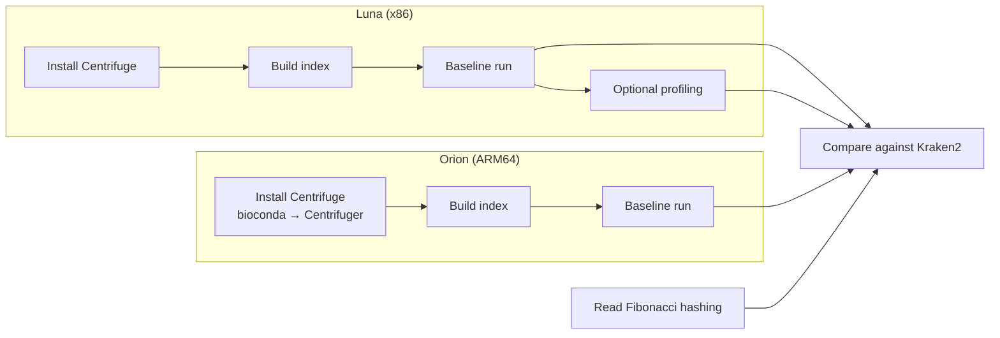
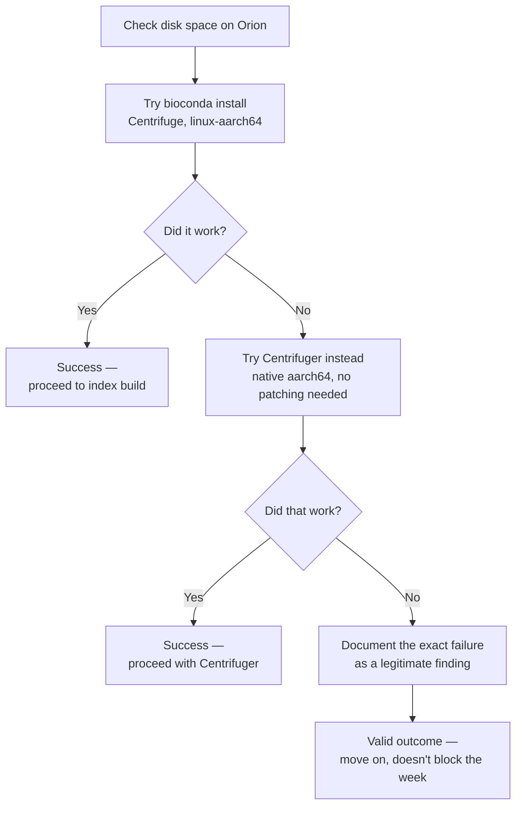
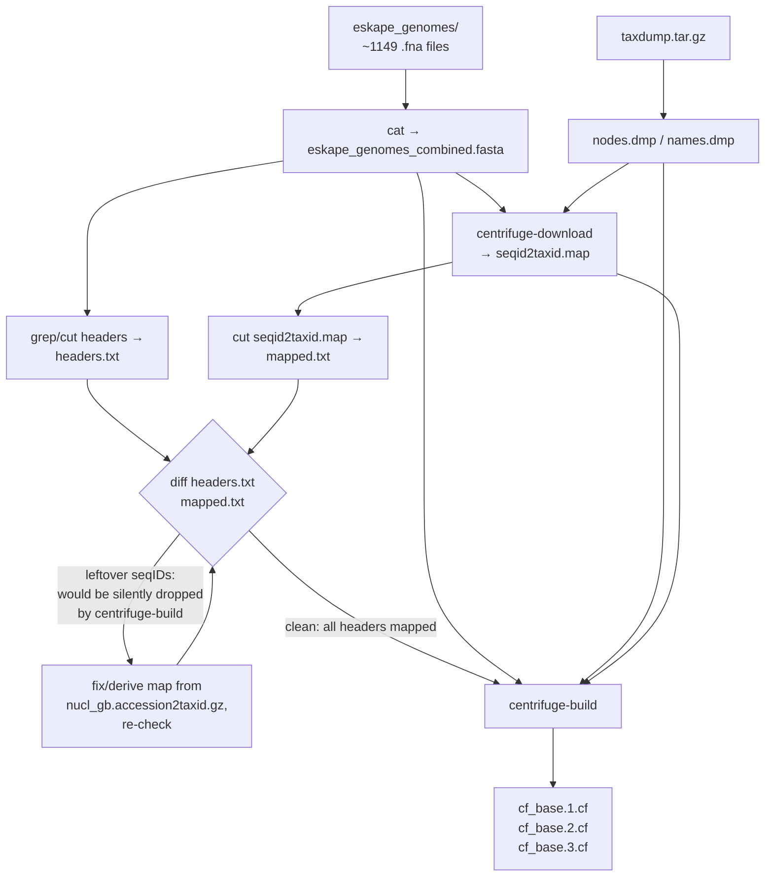
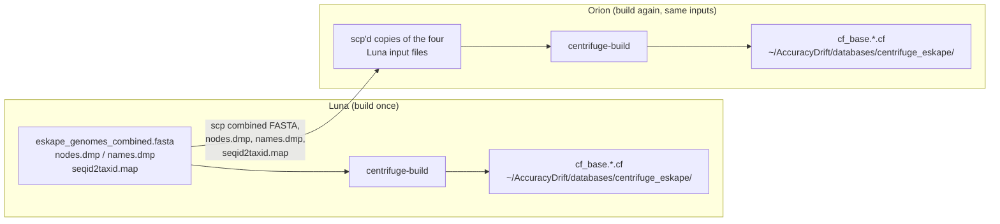
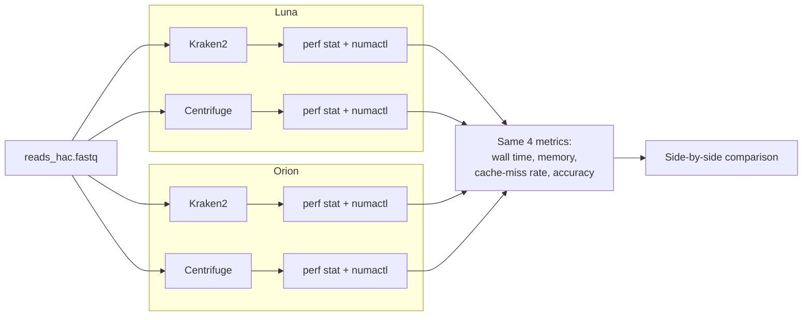
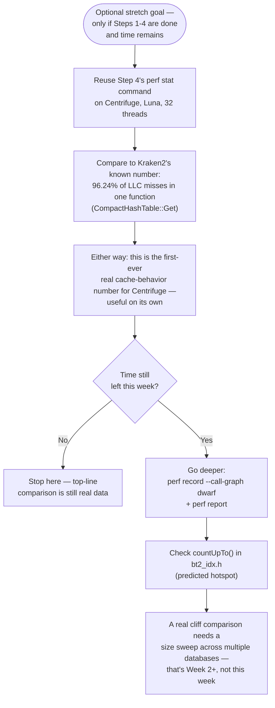
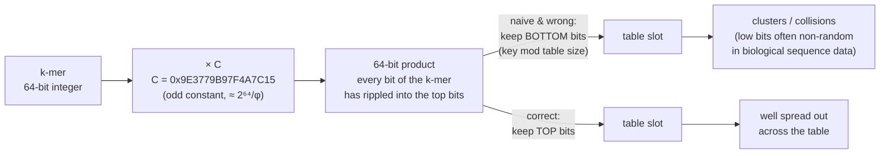
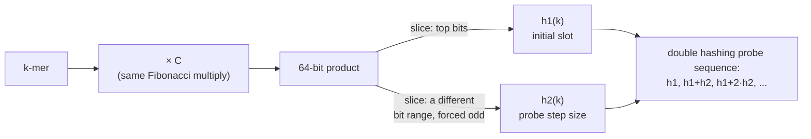
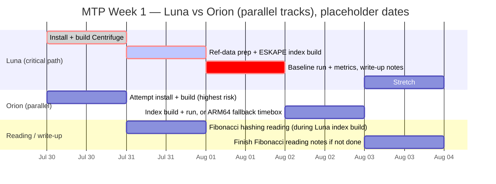

# MTP Week 1 Plan — Centrifuge Baseline Setup

**Week of 2026-07-29 (post Meeting 9). Standing meeting: every Wednesday, 4-5pm.**

## Why this week

Both theses need a Centrifuge baseline before you can claim any improvement over it. This week's job is to get that baseline running on both machines, and to start the reading you'll need for the hashing work ahead. It's the foundation week. Nothing in it is exciting, but skip it and every number you produce later has nothing to compare against.



Centrifuge matters because this project has never evaluated it before. Kraken2 works by hashing k-mers into a table, and its lookups are slow mainly because they have to wait on memory, not because the CPU runs out of work.

> [!NOTE]
> Reminder: this project already measured that cost precisely. In the earlier M1-M7 patch work, 96.24% of all Kraken2's cache misses were traced to a single function, `CompactHashTable::Get()`. That's the baseline "Centrifuge takes the opposite trade-off" below is being compared against.

Centrifuge takes the opposite approach: instead of a hash table, it compresses the reference genome into a structure called an FM-index and walks through it one character at a time. That gives it a smaller memory footprint, but a different access pattern and a different bottleneck. Until Centrifuge is actually running on Luna and Orion, you won't know whether your cache and hashing work beats a real alternative — only an old baseline.

You'll build and index Centrifuge this week, then run a first classification on both machines. Luna is your x86 server, and the build there should be straightforward. Orion is the ARM64 Jetson edge device, and the build there is more likely to fight you — budget extra time for it. Once both machines can run a baseline classification, you have your comparison point.

You'll also read about Fibonacci hashing. It matters directly for Thesis 2: cell-width reduction and double hashing both depend on how well your hash function spreads keys out, and Fibonacci hashing is the standard fix when a power-of-two table isn't spreading keys well. Read it now, so the concept is ready when you start implementing.

If Centrifuge is running with time left over, take a first perf pass on it. The goal is a rough sense of where its cache misses land, compared with Kraken2's one hot function. This isn't a full profiling study — just enough to see whether the FM-index walk behaves the way the theory predicts.

The rest of this doc walks through each piece in order: what others have already tried (worth reading first), Luna setup, Orion setup, index build, baseline run, the profiling stretch goal, the Fibonacci hashing reading, and a day-by-day schedule to fit it all in before Wednesday's meeting.

## What others have tried (worth reading before you start)

Before you start building, it helps to know what's already been tried and measured elsewhere. Some of this work already answers questions this project would otherwise have to answer from scratch. Some of it flags dead ends worth avoiding. Read it now so you don't duplicate someone else's benchmark, or worse, walk into a known gotcha nobody warned you about.

### Kraken2 vs Centrifuge, published

Three separate research efforts have already run Kraken2 and Centrifuge side by side, so you're not the first to ask which one wins. [Ye, Siddle, Park & Sabeti (2019), "Benchmarking Metagenomics Tools for Taxonomic Classification," Cell 178(4)](https://www.cell.com/cell/fulltext/S0092-8674(19)30775-5) is the standard reference benchmark across many classifiers, with both Kraken2 and Centrifuge included. [Song & Langmead (2024), "Centrifuger," Genome Biology](https://pmc.ncbi.nlm.nih.gov/articles/PMC11046777/) goes further and puts real numbers on it: on CAMI2 data, Centrifuger's sensitivity comes out 72.9% higher than Centrifuge's, and 54.1% higher than Kraken2's. Worth reading the original papers behind both tools too, since the benchmarks build on claims made there: [Kim, Song, Breitwieser & Salzberg (2016), "Centrifuge: rapid and sensitive classification of metagenomic sequences," Genome Research 26(12)](https://pmc.ncbi.nlm.nih.gov/articles/PMC5131823/), and [Wood, Lu & Langmead (2019), "Improved metagenomic analysis with Kraken 2," Genome Biology 20:257](https://pubmed.ncbi.nlm.nih.gov/31779668/).

### The closest existing work to Thesis 1

Before assuming Thesis 1's adaptive k-mer cache is unclaimed territory, read [kache-hash (bioRxiv, Feb 2026)](https://www.biorxiv.org/content/10.64898/2026.02.13.705625v1). It's the nearest thing to "someone already built this": a cache-efficient dynamic hash table that combines Iceberg hashing with minimizer-based bucketing, so consecutive k-mers land in the same bucket. It reports 7.4x fewer cache misses and 6.1x higher query throughput than IcebergHT. That's close enough to Thesis 1's territory that skipping it would be a real gap, not a minor oversight — the thesis needs to read it and explain how its own design differs, not pretend it doesn't exist. The good news: it doesn't target Kraken2's specific hash table format, so there's still room for Thesis 1's set-associative, LLC-topology-aware approach. Just don't write the thesis as if this paper doesn't exist.

### Fibonacci hashing in the wild

Skarupke's post explains the mechanism in worked-example form, which is the easier entry point before Knuth: [Skarupke, "Fibonacci Hashing: The Optimization that the World Forgot"](https://probablydance.com/2018/06/16/fibonacci-hashing-the-optimization-that-the-world-forgot-or-a-better-alternative-to-integer-modulo/). To see this isn't just theory, two real, heavily-used codebases hash with the same multiply-and-shift idea: [rustc-hash](https://github.com/rust-lang/rustc-hash/blob/master/src/lib.rs) (the Rust compiler's own internal hasher) and [Abseil's hash implementation](https://github.com/abseil/abseil-cpp/blob/master/absl/hash/internal/hash.h) (Google's C++ library). Both multiply by a fixed odd constant — the same shape of trick this project needs for Thesis 2's `h1`/`h2` pair.

### The honest gap

No paper turned up that combines double hashing specifically with k-mer or genomic hash tables. That's worth stating plainly rather than treating as a failed search: it means Thesis 2's double-hashing work has a real claim to novelty, not just an incremental tweak. This isn't "the search missed something" — the space genuinely looks open.

## Step 1 — Install and build Centrifuge on Luna

Kraken2 already has numbers on Luna. Before you can compare the two tools, Centrifuge needs to exist on the same machine, built the same no-root way Kraken2 was. Luna gives you 96 cores (192 threads) and 210 MB of shared CPU cache (LLC) — plenty of room. You won't need `sudo` (admin access) anywhere in this step.

Clone the repository and build it straight from source. The Makefile (the file that tells `make` what to do) handles everything itself, so there's nothing extra to configure:

```bash
$ git clone https://github.com/DaehwanKimLab/centrifuge
$ cd centrifuge
$ make          # no root needed — matches how you already built Kraken2
```

The build needs GCC, GNU Make, zlib, and pthreads. That's probably the same set of tools Kraken2's build already needed on this machine. One caveat: this project's docs never actually wrote down what Kraken2 needed to build, so treat "nothing new to install" as a likely outcome, not a guarantee.

Running `make` places five binaries — `centrifuge`, `centrifuge-build`, `centrifuge-class`, `centrifuge-inspect`, `centrifuge-download` — directly in the repo's root folder. There's no separate install step to run. You just need to add that folder to your `PATH` (the list of folders your shell searches for commands), the same way you already did for Kraken2, using the `~/tools/` folder:

```bash
$ mkdir -p ~/tools
$ mv ~/centrifuge ~/tools/centrifuge
$ export PATH=$PATH:~/tools/centrifuge
```

Add that `export` line to your shell's startup file (e.g. `~/.bashrc`) so it still takes effect after you close and reopen the terminal, not just in this session.

> [!WARNING]
> Nobody has confirmed this builds cleanly on Luna's GCC version. No known version incompatibilities are reported upstream, but don't assume — watch the `make` output for compiler errors before moving on.

One more thing worth flagging now: the Makefile's `RELEASE_FLAGS` setting includes `-g3` by default, so your binaries keep their debug symbols (extra information needed for profiling). You won't need that until profiling in Step 5/6 — just don't strip them in the meantime.

With `centrifuge` on your `PATH`, you're ready to get it running on Orion next, then build the comparison index in Step 3.

## Step 2 — Install and build Centrifuge on Orion (the risky one)

Kraken2 already builds and runs on Orion. Centrifuge is the unknown. Centrifuge shares code with Bowtie2, and Bowtie2's CPUID detection is x86-only — Orion is ARM64. That mismatch is why this step needs a real fallback plan, not just an attempt and a hope.



Check disk space before you install anything. Orion's own hardware notes have a documented history of running nearly full — a past check logged only ~8.5 GB free on the 57 GB eMMC (85% used) — and that number is stale, but the pattern of tight disk isn't. Miniforge, its conda envs, and a rebuilt Centrifuge index can eat several GB between them, easily enough to fill a device that's historically been this close to the edge.

```bash
$ ssh jetsonagx@10.154.233.173
$ df -h
```

If free space looks tight, clear room before you go further — chasing an install failure that's actually `ENOSPC` wastes the session.

Start with bioconda, not source. It ships a working `linux-aarch64` build with the ARM patch — [centrifuge-linux-aarch64.patch](https://github.com/bioconda/bioconda-recipes/blob/master/recipes/centrifuge/centrifuge-linux-aarch64.patch) — already applied. See the package itself on [bioconda](https://anaconda.org/bioconda/centrifuge).

```bash
$ conda install -c bioconda centrifuge
```

No conda on Orion yet? Install miniforge, not stock Anaconda — Anaconda's own aarch64 builds are unreliable on older Jetson OSes, while Miniforge3 is a genuine conda-forge aarch64 build:

```bash
$ wget https://github.com/conda-forge/miniforge/releases/latest/download/Miniforge3-Linux-aarch64.sh
$ bash Miniforge3-Linux-aarch64.sh
$ conda init
```

Restart your shell (or `source ~/.bashrc`) so `conda init` takes effect, then retry the bioconda install above.

> [!WARNING]
> Don't attempt a from-source build here, not even as a fallback. The failure is architectural, not a config problem a timeboxed session could plausibly fix. [Issue #183](https://github.com/DaehwanKimLab/centrifuge/issues/183) on the Centrifuge repo — open since 2019, last activity Dec 2019, still no upstream fix — reports `impossible constraint in 'asm'` in `third_party/cpuid.h`. That file does x86-only inline CPUID detection with no ARM64 path, and the Makefile hardcodes `SSE_FLAG=-msse2` regardless of architecture. A timebox makes sense for a wrong flag or a missing header — something a session of trial and error can plausibly solve. It doesn't make sense here: nobody has landed an ARM path upstream in six years, so betting a session on fixing it yourself in an afternoon is a bad trade. Skip straight to the next option instead.

If bioconda fails, go straight to Centrifuger — [mourisl/centrifuger](https://github.com/mourisl/centrifuger), a from-scratch reimplementation with the same output format. It has genuine native aarch64 bioconda support, so there's no patch to apply and no C code to fix:

```bash
$ conda install -c bioconda centrifuger
```

If that also fails, that's still a result. Record the exact error, the attempted fix, and move on. "Centrifuge doesn't run on ARM64" is a legitimate Week-1 finding for a thesis with a cross-hardware angle. It doesn't block the rest of the week's plan.

Once Centrifuge (or Centrifuger) runs on Orion, you're ready to build the comparison database in Step 3.

## Step 3 — Build a Centrifuge index from the same ESKAPE genomes

Centrifuge doesn't let you match Kraken2's database size directly — its own compression scheme decides index size, not you. Fairness here doesn't come from matching file sizes. It comes from using the same references and the same reads for both classifiers. That's why this step reuses the six ESKAPE genomes you already downloaded for Kraken2, unchanged. One caveat: same genomes and same reads make this fair for a memory-footprint comparison, but Kraken2 and Centrifuge use different default confidence/score thresholds — factor that in before treating a raw accuracy number as apples-to-apples.

You don't re-download genomes. You don't subset them. But `eskape_genomes/` on Luna isn't one FASTA — it's ~1149 separate `.fna` files, one per assembly, from the `ncbi-genome-download` run. `centrifuge-build` takes a single file or a comma-separated list, never a directory. Concatenate first:

```bash
$ cat eskape_genomes/*.fna > eskape_genomes_combined.fasta
```

Centrifuge needs three inputs beyond that FASTA: a seqID→taxID conversion table, `nodes.dmp`, and `names.dmp`. Don't assume these are still sitting on disk from the Kraken2 build — the Kraken2 build's own cleanup step deletes the taxonomy folder (~14 GB) once `hash.k2d`/`taxo.k2d`/`opts.k2d` exist. Check first:

```bash
$ ls ~/AccuracyDrift/databases/eskape_650mb/taxonomy
```

If it's gone, re-fetch it the same way you did the first time — `wget`, not rsync, since rsync is blocked on Luna:

```bash
$ wget https://ftp.ncbi.nlm.nih.gov/pub/taxonomy/taxdump.tar.gz
$ tar -xzf taxdump.tar.gz   # gives you nodes.dmp, names.dmp
```

There's no `seqid2taxid.map` to reuse, either. This project's own docs show that `kraken2-build` resolves taxids straight from NCBI-formatted headers plus `nucl_gb.accession2taxid.gz` internally — it never writes out a standalone flat file like that. Generate one fresh with `centrifuge-download`:



```bash
$ centrifuge-download -o taxonomy taxonomy
$ centrifuge-download -o library -m -d "archaea,bacteria,viral" refseq > seqid2taxid.map
```

Check the resulting file's size before trusting it — `centrifuge-download` has shipped empty, zero-byte `seqid2taxid.map` files for some genome types ([how to make seqid2taxid.map #259](https://github.com/DaehwanKimLab/centrifuge/issues/259)). If it's unusable, fall back to deriving the map yourself from `nucl_gb.accession2taxid.gz` (already on disk from the taxdump fetch) joined against your combined FASTA's headers.

Before you build, verify coverage. Centrifuge silently drops any sequence it can't match to a taxid instead of erroring — that would quietly shrink your reference set with no warning:

```bash
$ grep ">" eskape_genomes_combined.fasta | cut -d' ' -f1 | tr -d '>' | sort -u > headers.txt
$ cut -f1 seqid2taxid.map | sort -u > mapped.txt
$ diff headers.txt mapped.txt   # anything left over here gets dropped, not flagged
```

Then build, straight into the same `~/AccuracyDrift/databases/` directory the Kraken2 DBs live in, so Step 4 can find it at a predictable path:

```bash
$ mkdir -p ~/AccuracyDrift/databases/centrifuge_eskape
$ centrifuge-build --conversion-table seqid2taxid.map \
    --taxonomy-tree nodes.dmp --name-table names.dmp \
    eskape_genomes_combined.fasta ~/AccuracyDrift/databases/centrifuge_eskape/cf_base
```

If the build hangs instead of erroring, don't wait it out — check first whether any taxID in your conversion table is missing from `nodes.dmp`. That's the cause reported for this symptom in [centrifuge-build hanging up #199](https://github.com/DaehwanKimLab/centrifuge/issues/199) — the hang there is preceded by "taxonomy id doesn't exists" warnings, per the actual issue thread. Confirm that matches what you're seeing before ruling out a slow build instead.

Run this once on Luna now. For Orion, don't regenerate any of this from scratch once its Centrifuge install succeeds — `scp` the combined FASTA, `nodes.dmp`/`names.dmp`, and `seqid2taxid.map` over from Luna and build there instead, so both machines index the exact same reference data. Once `cf_base.{1,2,3}.cf` exist at `~/AccuracyDrift/databases/centrifuge_eskape/` on both machines, you have a real Centrifuge index to classify against — that full path is what Step 4 means by `<CF_DB>`, ready for the head-to-head with Kraken2.



## Step 4 — Run the baseline and collect the same four numbers

Centrifuge only counts for this project if you measure it exactly the way you measured Kraken2: same reads, same machine, same thread counts, same performance counters. Anything less and the comparison is noise. You already have the Kraken2 commands — reuse the wrapper, swap the binary.



On Luna, start at 32 threads — that's Kraken2's best-performing setup (32 threads + numactl node0, 4.405s baseline), and starting there keeps the two tools comparable on this first pass. Centrifuge's own best thread count isn't known yet; you may need to sweep for it separately later.

`-p` is Centrifuge's thread-count flag (Kraken2 used `--threads`). `-x` takes the index basename, not a directory path. `-S` and `--report-file` are thrown away here, the same way Kraken2's `--output` and `--report` were — on this pass you only care about the `perf stat` numbers.

```bash
$ perf stat -e cache-misses,cache-references,LLC-loads,LLC-load-misses,instructions,cycles \
  numactl --cpunodebind=0 --membind=0 \
  centrifuge -p 32 \
  -x ~/AccuracyDrift/databases/<CF_DB> \
  -U /home/student/results/basecalling/reads_hac.fastq \
  -S /dev/null \
  --report-file /dev/null
```

On Orion, sweep the same thread counts you used for Kraken2: 1, 2, 4, 6, 8, 10, 12. Skip `numactl` — Orion has only one NUMA node. Just run `centrifuge` directly and let conda's `PATH` (set up by `conda init` in Step 2) find it; that's the main bioconda install path. If you ended up on the Centrifuger fallback instead, use the `centrifuger` binary name — it has a similar CLI, but check the actual flag names before relying on them; don't assume they match exactly.

```bash
$ sudo /usr/lib/linux-tools-5.4.0-26/perf stat \
  -e cache-misses,cache-references,LLC-loads,LLC-load-misses,instructions,cycles \
  centrifuge -p <T> \
  -x ~/AccuracyDrift/databases/<CF_DB> \
  -U ~/reads/reads_hac.fastq \
  -S /dev/null \
  --report-file /dev/null
```

`<T>` sweeps 1, 2, 4, 6, 8, 10, 12.

On Orion, don't trust the raw cache-miss-rate column — `cache-references` there maps to L1D, not LLC. Compute `LLC Miss Rate% = LLC-load-misses / LLC-loads × 100` instead, for both tools, so the numbers stay comparable across machines.

One extraction step won't carry over as-is:

| | Kraken2 report | Centrifuge report |
|---|---|---|
| Columns | Kraken2's own format | name, taxID, taxRank, genomeSize, numReads, numUniqueReads, abundance (7 columns) |
| Accuracy script | works as-is | needs adapting to the new column layout |

> [!WARNING]
> Any accuracy number you produce this week — including in personal notes — should be written down explicitly labeled **"unvalidated — threshold/rank mismatch, not directly comparable."** Kraken2 and Centrifuge use different default confidence thresholds, and can resolve the same ambiguous read to different taxonomic ranks even on identical input. A raw accuracy number without that label looks like a clean, ready-to-use comparison, and risks being treated as one later once the context behind it is forgotten.

Adapting the accuracy-extraction script to Centrifuge's 7-column report is real work, not a trivial afterthought — budget actual time for it this week, don't leave it to whatever's left over. Do that before you trust any Centrifuge number next to a Kraken2 one. Once wall time, memory, cache-miss rate, and accuracy are all captured for both tools, you're ready to line them up side by side.

## Step 5 — Stretch goal: profile Centrifuge to see where it hurts

This step is optional. Skip it if Steps 1-4 eat your week — nothing downstream depends on it.

Kraken2's memory behavior is already characterized: 96.24% of all LLC misses concentrate in `CompactHashTable::Get()`, a function that's only 0.65% of instructions executed. Centrifuge has no equivalent number — no published paper has profiled its cache-miss behavior with perf. The goal this week is not to prove or disprove that Centrifuge has worse cache behavior than Kraken2. One run at one dataset size (~7GB, six genomes) can't settle that — a real answer needs a sweep across multiple dataset sizes to find where a cache-miss cliff appears, and that sweep is Week 2+ work. This week's goal is smaller and still worth doing: get the first-ever real cache-behavior number for Centrifuge. A single data point is useful new data on its own, not a verdict.

There's a reason to expect Centrifuge to look worse. FM-index/BWT backward-search (LF-mapping) is a serial dependency chain — each step needs the result of the step before it. Kraken2's per-k-mer probes, by contrast, are largely independent of each other. Two papers document poor spatial locality from this pattern: [Grabowski & Cisłak, "A bloated FM-index reducing the number of cache misses during the search"](https://arxiv.org/abs/1512.01996), and [FindeR (arXiv:1907.04965)](https://arxiv.org/abs/1907.04965), which states plainly that "the FM-Index is notorious for poor spatial locality and massive random memory accesses." That predicts more scattered memory jumps and a worse cache-miss profile than Kraken2. Treat this as a hypothesis to test, not a confirmed result for Centrifuge specifically.



Start cheap. Reuse the exact `perf stat` command from Step 4 — it already collects cache-misses, cache-references, LLC-loads, LLC-load-misses, instructions, and cycles, pinned and thread-matched the same way. Run it on Centrifuge on Luna, after your Step 4 baseline works:

```bash
$ perf stat -e cache-misses,cache-references,LLC-loads,LLC-load-misses,instructions,cycles \
  numactl --cpunodebind=0 --membind=0 \
  centrifuge -p 32 -x <index> -U <reads.fastq> -S /dev/null
```

That top-line comparison of miss rate and IPC tells you a lot before you touch call graphs.

If time remains this week, go one level deeper — the actual stretch-within-the-stretch:

```bash
$ perf record --call-graph dwarf -- ./centrifuge -x <index> -U <reads.fastq> -S /dev/null
$ perf report
```

Centrifuge's default build already compiles with `-g3`, so this should attribute cleanly to source lines without a special debug rebuild.

> [!TIP]
> Check `countUpTo()` in `bt2_idx.h` first — [the file itself](https://raw.githubusercontent.com/DaehwanKimLab/centrifuge/master/bt2_idx.h) says, directly above the function: *"This is a performance-critical function. This is the top search-related hit in the time profile. Function gets 11.09% in profile."* That's Centrifuge's own codebase naming its likely hotspot — the probable analog to Kraken2's `Get()`.

Don't attempt this on Orion this week — Step 2's build risk already eats the schedule slack there. Get through it, and you'll have the first real cache-behavior number for Centrifuge — new data for the project, not a final verdict on whether it beats Kraken2.

Profiling done, switch gears — the next thing you need is theory, not tooling.

## Step 6 — Reading: Fibonacci hashing

Fibonacci hashing is the standard way to turn a k-mer's 64-bit integer into a well-distributed table slot, and it shows up twice in this thesis already — you just haven't named it yet.

Patch 4's thread-local k-mer cache picks a slot by multiplying the k-mer by a fixed constant and taking the top bits. That's Fibonacci hashing. Thesis 2's move from linear to double hashing needs two well-distributed, cheap-to-compute functions, `h1` and `h2`. Fibonacci hashing is a strong candidate for building both.

**The mechanism.** `slot = (key * C) >> (64 - b)`, where `C` is an odd 64-bit constant near `2^64/φ` (the standard value is `0x9E3779B97F4A7C15`) and `b = log2(table size)`. One multiply, one shift. No division, no modulo.

**Why this constant, and why the top bits.** Knuth (TAOCP Vol. 3, §6.4) is the usual citation: for sequential integer keys, the fractional parts of `{k·φ⁻¹}` disperse well — this ties back to the three-distance theorem. It's a widely cited result, but it's explained best — and popularized — in Skarupke's post below, not in a Knuth passage you should quote from memory. Before leaning on it hard in the thesis itself, verify the exact Knuth section, and check whether "better than any other multiplier" is Knuth's actual claim or a stronger paraphrase that has built up around it since.

Taking the top bits of the full 64×64→64 product matters just as much. Every input bit influences the high bits of a multiply. `key % 2^b` or `key & (2^b - 1)` only look at the low bits — if those are non-random (common in biological sequence data), you get clustering. Fibonacci hashing avoids that failure mode by construction.



Read [Malte Skarupke's 2018 post, "Fibonacci Hashing: The Optimization that the World Forgot"](https://probablydance.com/2018/06/16/fibonacci-hashing-the-optimization-that-the-world-forgot-or-a-better-alternative-to-integer-modulo/) first — it's the practical, worked example. Knuth is the deeper reference once the mechanism clicks; [Wikipedia's Hash function article, §Multiplicative hashing](https://en.wikipedia.org/wiki/Hash_function#Multiplicative_hashing) is a shorter middle ground that also cites Knuth directly.

**One distinction to hold onto:** Fibonacci hashing solves slot *placement* — key to initial bucket. It says nothing about collision *resolution* — what happens when two keys land on the same slot. Those are different layers of a hash table, and conflating them will cost you in the double-hashing design.

That said, it's a direct building block for it. Double hashing needs `h1(k)` for the initial slot and `h2(k)` for the probe step, which must be nonzero and, for a power-of-two table, odd. A single Fibonacci multiply's 64-bit product carries enough decorrelated bits to slice `h1` from the top and `h2` from a different bit range — or you derive `h2` from a second odd multiplier. Either way, you get a cheap, well-distributed `h1`/`h2` pair, which is exactly what §5 of the cell-width report is asking you to build next.



That single-multiply-then-slice approach is one candidate for building `h1`/`h2`, not a settled answer — worth flagging before it goes into Thesis 2's actual code. Knuth's mixing guarantee is strongest for the *top* bits of the product specifically; slicing `h2` out of a different bit range of that *same* product risks correlating it with `h1`, which undermines exactly what double hashing needs — decorrelated probe sequences. A cheap, more defensible alternative exists: use a second, independent odd multiplier for `h2`, or run a splitmix64-style finalizer (multiply, xorshift, multiply, xorshift) and split its output in two. Either costs barely more than the single multiply and mixes both halves properly. Treat this as an open implementation question to decide deliberately when Thesis 2's code gets written, not something to copy blindly from this reading. For a sense of how production hash functions handle this kind of mixing, see [rustc-hash](https://github.com/rust-lang/rustc-hash/blob/master/src/lib.rs) and [abseil's hash mixer](https://github.com/abseil/abseil-cpp/blob/master/absl/hash/internal/hash.h) — both use a similar multiply-and-mix approach in real code.

## Day-by-day schedule, risk, and what "done" means this week

You have 2-4 focused hours a day, not full days, so this week only works if Luna and Orion run in parallel and write-up gets folded in as you go instead of dumped at the end. Day 1 is the one day likely to need the fuller end of that range — if it only yields ~2h, let the Orion attempt slip to Day 2 rather than rushing the Luna build to fit both in.

| Day | Focus | Hours | Depends on |
|---|---|---|---|
| Day 1 | Luna: install + build Centrifuge. Orion: attempt install + build (highest risk item, start early to leave room for the fallback plan) | 3-4h | None (both start fresh) |
| Day 2 | Luna: reference-data prep + custom ESKAPE index build (mostly background wall-clock). While it builds: Fibonacci hashing reading | 2-3h hands-on | Day 1 Luna install |
| Day 3 | Luna: baseline run + metrics, incl. adapting the accuracy-extraction script for Centrifuge's 7-column report. Write-up notes on Luna install/index/baseline so far | 2-3h | Day 2 Luna index build |
| Day 4 | If Orion install succeeded: Orion index build + run. If not: try the Centrifuger fallback (Step 2), else document the failure and pivot freed hours to Luna profiling stretch goal | 2-3h | Day 1 Orion install; Day 2 Luna index build |
| Day 5 | Stretch: Centrifuge profiling on Luna. Finish Fibonacci reading notes if not done. Consolidate write-up across the week | 2-4h | Day 3 Luna baseline; Day 2 reading |



The critical path is entirely on Luna: install → index build → baseline run is the one chain that can't slip, because it alone satisfies this week's definition of done. Orion runs in parallel on its own track, so a Day-4 fallback doesn't cost you a full session — it only costs the timebox you've already budgeted for it. Day 3 is the other pressure point to watch: the script adaptation folded into it is real work, and if it runs long, Day 5 has enough slack to absorb the overflow without threatening the definition of done. Day 5 is claimed three times over — stretch profiling, finishing the Fibonacci notes, and write-up consolidation, plus any Day-3 overflow — with no priority order among them. If Day 5 arrives with core-path work still open, profiling and the Fibonacci write-up are the first things cut, not left to silently compete for the same hours.

> [!IMPORTANT]
> Centrifuge is most likely to fail to build on Orion's ARM64 toolchain — its Bowtie2-lineage x86 SSE2/CPUID code hits an "impossible constraint in 'asm'" in cpuid.h ([issue #183](https://github.com/DaehwanKimLab/centrifuge/issues/183)). Try bioconda's pre-patched aarch64 build first; if that fails, go straight to the Centrifuger fallback (see Step 2 — there's no from-source attempt in between anymore, that path was cut as low-payoff). If Centrifuger also fails, document the exact failure precisely — that's a real deliverable for the thesis's cross-hardware story — and do not let it block the rest of the week. Reallocate the freed hours to the Luna profiling stretch goal and the Fibonacci reading. If Luna's own `make` fails instead, that's the actual emergency, not Orion's: check the GCC error immediately and resolve it before touching Orion at all, since Luna succeeding is what this week's definition of done actually requires.

**Definition of done this week:** Centrifuge builds and runs successfully on Luna with a custom ESKAPE index built from a verified-complete reference (the Step 3 header/mapped coverage diff has been run and checked, not skipped), producing wall-time, memory, and cache-miss-rate numbers in the same shape as the existing Kraken2 pipeline. Classification accuracy is best-effort this week — the report-format adaptation in Step 4 is real work, and it's fine if it slips to next week as long as the other three numbers land. Any accuracy number this week does produce must be labeled "unvalidated — threshold/rank mismatch, not comparable" everywhere it's written down, notes included — an unlabeled number tends to get used regardless of caveats once it exists. Carryover, not required this week: before any accuracy number from this week is used in the thesis itself (not just parsed out of a report), Kraken2's confidence threshold and Centrifuge's score cutoff need to be explicitly reconciled, and rank mismatches noted per read rather than lumped into one aggregate number. Fibonacci hashing reading notes exist somewhere. Orion success and the Luna profiling pass are stretch goals — good to have, not required for the week to count as a win.
