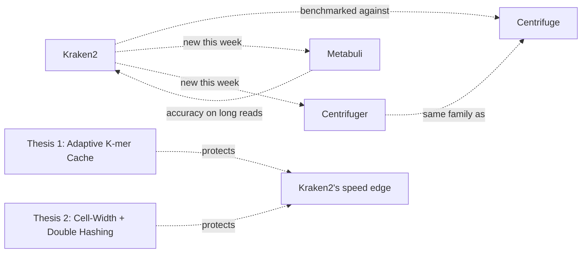
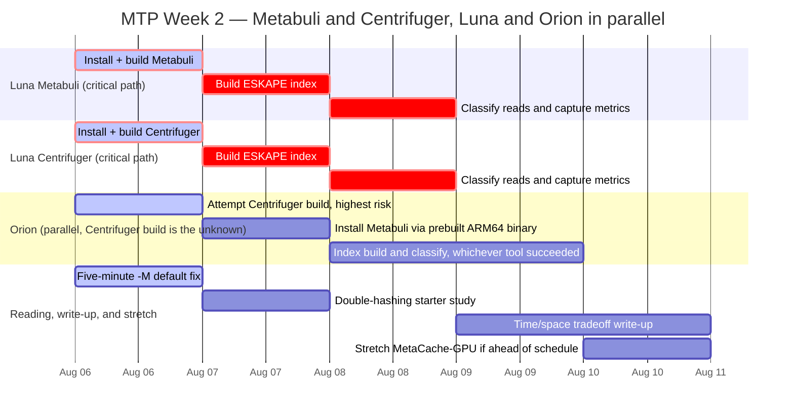

# MTP Week 2 Plan — Metabuli, Centrifuger, and the Time/Space Tradeoff

**Week of 2026-08-06 (post Meeting 10). Standing meeting: every Wednesday, 4-5pm — next one 2026-08-12.**



## Why this week

Meeting 10 landed on 2026-08-05, and it changed the shape of this week's job. Kolin sir asked you to finalize the benchmark tool shortlist beyond Centrifuge — he named Centrifuge and Centrifuger explicitly, asked for ESKAPE-relevant tools with better cache-miss or GPU performance, and framed the whole search as a time-vs-space tradeoff, not a hunt for a single "best" tool. He also ruled Bracken out: Chirag Suthar already reviewed it, and it's a post-hoc re-estimator that rescales someone else's classification output, not a standalone classifier. It never touches raw reads, so it can't sit in the same comparison as Kraken2 and Centrifuge.

The wrong instinct here is to treat "finalize the shortlist" as a reading assignment — pick some papers, write a paragraph, move on. It isn't. Sir's ask only pays off once the tools in it are actually running on your data, because a shortlist you haven't executed is just a list of names with no numbers attached. That reframes what "done" means this week.

Four things have to be true by Wednesday for this week to count as a win:

1. **A finalized, justified tool shortlist.** Not just names — for each tool, why it's in (or out), and what tradeoff it represents against Kraken2 and Centrifuge.
2. **Metabuli and Centrifuger actually running on the same ESKAPE data** Kraken2 and Centrifuge already use. Same six genomes, same reads — anything less isn't a fair comparison, it's a different experiment wearing this project's name.
3. **A written time/space tradeoff comparison.** Memory footprint, throughput, and accuracy, side by side, sourced — not a gut-feel ranking.
4. **Continued progress on Week 1's carried-over items** (below), because none of them evaporated just because a new ask arrived. Six things were still open as of Meeting 10, and this week has to move at least the cheap ones.

Here's where it gets interesting: item 2 isn't just "install two more tools." Metabuli's own independent benchmarks (see the tool-shortlist section below) show it can be slower and heavier than Kraken2 on large DBs — its case is accuracy, not efficiency. That means this week's tradeoff table isn't a search for a strict upgrade over Kraken2. It's a map of which axis each tool trades away, and that map is exactly what both theses need to justify themselves against real alternatives, not just against Centrifuge.

## Carried over from Week 1 — still open, confirmed 2026-08-06

Only one commit landed between `WEEK1_REPORT.md` and today — Meeting 10's minutes, docs only. No engineering happened in between, so five items from Week 1's Part F punch list, plus the fact that neither thesis has started, are exactly where they were two days ago.

| Item | Status | What Week 2 does about it |
|---|---|---|
| `eskape_650mb` / `eskape_human_4gb` Kraken2 DBs missing (need full rebuild) | Still missing, no progress | Deferred. Not this week's priority — the shortlist work above takes precedence, and neither new tool needs these DBs rebuilt to get a first run going. |
| `ncbi-genome-download` v0.3.3's 200-genome ceiling | Not upgraded, not investigated | Deferred. Same reasoning — it only matters once a bigger reference set is actually needed, and this week's comparisons reuse the existing six-genome ESKAPE set. |
| `perf record --call-graph dwarf` for Centrifuge's 96-thread IPC collapse | Never run, zero repo references | Deferred, but flagged: if Centrifuger or Metabuli show a similar collapse at high thread counts while you're benchmarking them, note it — don't chase it this week, just don't lose it either. |
| `compact_hash.cc.pre_opt_v1` backup missing | Documented gap, recovery path exists, no backup file created | Low priority, deferred. A real gap, but it doesn't block anything this week is doing. |
| `-M` (memory-mapping) not adopted as default anywhere | `run_kraken2_opt_v1.sh` still has zero `-M` flags | Fixed this week. This is a five-minute change with a 12-14x measured win sitting behind it — there's no excuse to keep leaving it off. Flip it and move on. |
| Thesis 1 (adaptive k-mer cache) and Thesis 2 (double hashing / cell-width) not started | Every task in `plan_2026-07-25.md` is still an unchecked box | Expected, not a problem. Sir's own ask this week is to lock in the comparator tools first — both theses need Metabuli and Centrifuger's numbers to argue against, so starting the implementation before this week's shortlist work lands would be building on a foundation that doesn't exist yet. |

Two of these are real gaps that will need attention eventually — the missing DB rebuild and the `compact_hash.cc` backup aren't going away, just waiting their turn. One is a trivial fix with no reason to still be pending. The rest are correctly sequenced behind this week's actual job: locking in what Kraken2 and Centrifuge get compared against, before either thesis writes a line of implementation code.

That job starts with the tool shortlist itself — which candidates made the cut, which didn't, and why.

## Finalising the tool shortlist

Meeting 10 asked for one thing: a benchmark shortlist beyond Centrifuge, with an ESKAPE-relevant cache-miss/GPU angle and an honest time/space tradeoff framing. Here's the decision. You add two tools outright — **Metabuli** and **Centrifuger**. You hold one tool — **Sylph** — pending a scope decision. You drop one tool that already got reviewed — **Bracken**. You cite four pieces of prior art without benchmarking them. And you keep one claim in your back pocket that no one else has made yet. The rest of this section justifies each call.

### Metabuli: added for accuracy, not for efficiency

Kraken2 and Centrifuge both stumble on long reads. Nanopore reads carry indels — insertions and deletions from the sequencer, not from biology — and both tools' exact k-mer matching treats an indel-shifted k-mer as a mismatch against every reference it should have hit. Portik et al. (2022) documented the damage directly: Kraken2, Centrifuge, Bracken, and MetaPhlAn3 all produce many spurious low-abundance species calls on long-read data from this exact failure mode, a problem abundance filtering only partially corrects. That's not noise you average away — it's a systematic accuracy gap in both tools you're already benchmarking.

Metabuli (Kim & Steinegger, *Nature Methods* 2024) targets that gap directly. It combines amino-acid-level and DNA-level k-mer matching, so an indel that breaks the DNA match can still be caught at the amino-acid level. That's why it earns a shortlist spot: it's the one tool here that can survive the exact failure mode Portik et al. documented.

Here's the wrong intuition to name before it costs you a benchmark run: you might assume the newer, accuracy-focused tool is also the leaner one. It isn't, necessarily. Metabuli's own docs describe "8 GiB sufficient" — but that's a tunable cap you set at classify time, not a measured peak. An independent third-party test (the Movi Color paper, PMC12154825, Table 3) ran Metabuli head-to-head against Kraken2 on a real 75,166-genome Pseudomonadota database, and the result cuts the other way: Kraken2 used **34 GB** against Metabuli's **54–56 GB**, and Kraken2 finished in **36.82s (16 threads) / 445.19s (1 thread)** against Metabuli's **932.00s / 9,868.75s** — roughly 22–25x slower.

> [!WARNING]
> Metabuli is an accuracy comparator, not an efficiency comparator. When you write up the time/space tradeoff section, do not present Metabuli as cheap or fast — the sourced, independent number says the opposite. Its case rests entirely on sensitivity for long-read, indel-heavy data.

### Centrifuger: the real FM-index successor, not a version bump

Centrifuge is your required baseline, so a genuine successor in the same algorithmic family — FM-index-based, not k-mer-based — is worth more to your space-tradeoff story than an unrelated tool would be. Centrifuger (Song et al., *Genome Biology* 2024) is that successor. It isn't Centrifuge with a new release number; it's a from-scratch implementation using a run-block-compressed Burrows-Wheeler transform, built specifically to shrink the memory footprint that made Centrifuge expensive to index at scale.

The two build-time footprints you already have (see the full sourced comparison later in this document) let you check that claim yourself: Centrifuge needs 69 GB for a 109-Gbp NCBI nt index, and Centrifuger needs 43 GB for a 140-Gbp RefSeq prokaryotic index. Normalised per gigabase of reference sequence, that's roughly 0.63 GB/Gbp for Centrifuge against roughly 0.31 GB/Gbp for Centrifuger — about half, on the same algorithm family. That's the "~2x more memory-efficient" claim, and it comes straight out of the numbers you already have, not a separate source.

Acknowledge the failure point here too: memory efficiency doesn't come free. At 8 threads, Centrifuger classifies roughly 1.2M reads/min against Centrifuge's 2.7M and Kraken2's 6.7M — Centrifuger is the slowest of the three, including slower than the tool it's meant to succeed. What it buys back is accuracy: on CAMI2, species-level sensitivity is up 72.9% over Centrifuge and 54.1% over Kraken2, with precision up 8.3% and 11.0% respectively; on real WGS data the gains are smaller but still positive (sensitivity +10.6%/+1.3%, precision +5.8%/+18.6%). Same family as your baseline, real memory win, real speed cost — that's a complete tradeoff story, and it's the reason Centrifuger belongs on the shortlist. The full sourced comparison — memory, speed, and accuracy for all five tools on the shortlist — lives in the dedicated time/space tradeoff section below; the short version: Kraken2 anchors cheap-and-fast, Metabuli anchors accurate-but-expensive, Centrifuger sits in between.

### Sylph: held, not added — it isn't answering the same question

Sylph (Shaw & Yu, *Nature Biotechnology* 2024) looks tempting on paper: under 4 GB for over 25,000 genomes against Bracken's 134 GB on a comparable index — roughly 30x less (yes, Bracken, the tool this doc rules out below — even the tool you're not benchmarking sets the memory bar Sylph beats) — and over 100x less CPU time, over 50x less wall time than the next-fastest tool. On CAMI2 Marine and Strain Madness it posts the highest F1 of any tool tested.

None of that makes it a drop-in comparator, and here's why: Sylph is an abundance profiler, not a per-read classifier. It tells you what fraction of a sample belongs to which genome — a single number per taxon — not which taxon each individual read came from. Kraken2, Centrifuge, Centrifuger, and Metabuli all answer the second question; Sylph answers the first. Benchmarking it against the other four on per-read accuracy would compare two different output types and produce a meaningless number.

It's worth adding under one condition: if the thesis evaluation gets reframed around sample-level abundance estimation rather than per-read classification — or if you want a fast pre-filter step ahead of the heavier per-read tools. Until that scope decision is made, Sylph stays off the primary shortlist.

### Ruled out: Bracken

Bracken doesn't classify reads on its own — it's a post-hoc re-estimator that sits downstream of Kraken2 or KrakenUniq output and corrects abundance estimates using their reports. It has no independent classification path to benchmark against Centrifuge, Metabuli, or Centrifuger. Chirag Suthar already reviewed it at Meeting 10, so re-evaluating it here would duplicate work that's done. It stays out.

### Prior art you must cite, but never benchmark

Four pieces of work belong in the literature review, not the benchmark table:

- **kache-hash** (Khan, Patro & Pandey, bioRxiv, Feb 2026) — a cache-conscious k-mer hash table. This is close enough to Thesis 1's design that the eventual write-up needs an explicit differentiation paragraph, not just a citation drop. Flag this now so it doesn't get missed later.
- **MegIS** (CMU SAFARI, ISCA 2024) — argues that table lookup, not compute, is the real bottleneck at the storage/processing-in-memory tier. That's the same core premise this whole project is built on, just at a different layer of the stack. Good motivating citation for your introduction.
- **MetaCache-GPU** and **GPMeta** — GPU hash-table redesigns for metagenomic classification. Both are relevant to the GPU stretch goal, not to this week's CPU shortlist — see the GPU stretch-goal section below for the build risk assessment on each.

### The one clean gap you can claim

Every genomics k-mer hash table surveyed so far — Jellyfish, KMC2/3, Gerbil, CHTKC, KCMBT — uses linear probing or cuckoo hashing to resolve collisions. None uses classic double hashing. Cuckoo hashing has prior art in this space; double hashing does not. That's a genuinely open contribution for Thesis 2, not a corner case to double-check against the literature before you implement it — see the double-hashing section for the formula and the reasoning behind it.

Shortlist proposal is ready for sir's sign-off: Metabuli and Centrifuger recommended as primary additions, Sylph held pending a scope call, Bracken out, four citations noted, one open gap claimed. Next question is mechanical — here's how you actually get Metabuli and Centrifuger running.

## Step — Install, build, and run Metabuli

Centrifuge gave you one alternative to Kraken2's hash table: an FM-index, walked one character at a time instead of hashed. Metabuli gives you a second, and it's a different kind of alternative — it adds an amino-acid-level classification layer on top of DNA k-mers, aiming to catch what Kraken2 and Centrifuge both miss on long, error-prone Nanopore reads. That's the case for adding it: sensitivity on the reads this project actually cares about, not a smaller or faster index.

Don't expect Metabuli to win on resource cost, though — the tool-shortlist section above already walked through the independent Movi Color benchmark showing Kraken2 beating it on both memory and speed (roughly 22-25x faster). Metabuli's pitch is accuracy, not speed or memory. Keep that in mind before writing up any Metabuli number next to a Kraken2 one — a fast, light number is not what you should expect to see.

The good news is on the Orion side, and it's a real reversal from Week 1. Centrifuge's ARM64 story was bad: a dead x86 SSE2/CPUID inline-asm bug inherited from Bowtie2, unfixed upstream for six years, bad enough that a from-source build wasn't even worth trying as a fallback. Metabuli's ARM64 story is the opposite. Real prebuilt ARM64 binaries exist, and Metabuli's own `mmseqs2` dependency has genuine NEON support — no known ARM64 build-failure issues at all. Orion is the easy machine this time.

### 1. Install on Luna

Bioconda first, same pattern as everything else on Luna so far:

```bash
$ conda install -c conda-forge -c bioconda metabuli
```

This installs v1.2.0. It ships both `linux-64` and `linux-aarch64` packages from the same recipe — worth remembering when you get to Orion in the next step.

If bioconda isn't available or the solve fails, build from source. Metabuli pulls in submodules, so don't `git clone` it plain:

```bash
$ git clone --recurse-submodules https://github.com/steineggerlab/Metabuli.git
$ cd Metabuli
$ mkdir build && cd build
$ cmake -DCMAKE_BUILD_TYPE=Release ..
$ make -j
```

`--recurse-submodules` matters here — Metabuli vendors `mmseqs2` as a submodule, and a plain clone leaves that directory empty, which breaks the CMake configure step before you even get to `make`.

### 2. Install on Orion — the easy one this time

Unlike Centrifuge, there's no fallback ladder to climb here. The primary path is the prebuilt ARM64 binary: official tarballs are hosted at mmseqs.com/metabuli, named `metabuli-linux-arm64.tar.gz`. Grab that file, extract it, and add the resulting folder to your `PATH` the same way you did for Centrifuge's `~/tools/` folder in Week 1 — no build tools, no compiler, no ARM patch to hunt down.

If you'd rather stay consistent with how you installed on Luna, bioconda works just as well — it's the same recipe, and it ships a real `linux-aarch64` package:

```bash
$ conda install -c conda-forge -c bioconda metabuli
```

Either path is fine. There's no known ARM64 build-failure history for Metabuli to route around, so this step shouldn't eat a session the way Centrifuge's did.

### 3. Build a custom ESKAPE database

Reuse what's already on disk. Don't re-download the ESKAPE genomes or the NCBI taxdump — both are already sitting on Luna from Week 1's Centrifuge build. Metabuli's `build` command wants a FASTA file list, an accession→taxid map, and a taxonomy directory:

```bash
$ ls eskape_genomes/*.fna > eskape_fasta_list.txt
```

The accession→taxid map is `nucl_gb.accession2taxid.gz`, already on disk from the taxdump fetch in Week 1 Step 3. If it's been cleaned up the way the Kraken2 build's taxonomy folder was, re-fetch it the same way — `wget`, not `rsync`. The taxonomy directory is the same `nodes.dmp`/`names.dmp` pair Centrifuge used, plus `merged.dmp` — all three come out of the same `taxdump.tar.gz` you already extracted, so check it's still unpacked before assuming you need to redo that too.

One requirement worth calling out explicitly: Metabuli needs FASTA headers in `>accession.version` format. This should already be true — that's the header format `ncbi-genome-download` writes by default, and it's the same format Kraken2 and Centrifuge have both been reading against all along. Don't reformat anything; just don't be surprised if it turns out to already match.

```bash
$ metabuli build ~/AccuracyDrift/databases/metabuli_eskape \
    eskape_fasta_list.txt \
    nucl_gb.accession2taxid.gz \
    --taxonomy-path taxonomy/ \
    --threads 32 \
    --max-ram 400g   # a cap, not a target — Luna has room to spare
```

### 4. Classify the basecalled Nanopore reads

Point it at the same reads Kraken2 and Centrifuge have both already classified — `~/results/basecalling/reads_hac.fastq`, unchanged:

```bash
$ metabuli classify --seq-mode 3 \
    ~/results/basecalling/reads_hac.fastq \
    ~/AccuracyDrift/databases/metabuli_eskape \
    ~/AccuracyDrift/results/metabuli \
    eskape_run \
    --threads 32
```

`--seq-mode 3` is the long-read mode — it's what tells Metabuli it's looking at Nanopore reads rather than short paired-end Illumina data, which changes how it scores matches internally. Don't run this without it; the default mode is tuned for short reads and isn't what you want here.

### 5. What the output looks like, and how it stacks up against Kraken2

Metabuli writes two files per run: `eskape_run_classifications.tsv` — 8 columns, one row per read (status, read ID, taxID, sequence length, DNA-identity score, E-value, rank, taxID:k-mer-match pairs) — and `eskape_run_report.tsv`.

That second file is the one that matters for reuse. It's a 6-column report — clade %, clade reads, direct reads, rank, taxID, name — and that's the same shape as Kraken2's own report format. Compare that to Centrifuge, whose 7-column report needed real script-adaptation work in Week 1. Here, the existing Kraken2 report-parsing script should need only minor adjustment to run against Metabuli's output, not a rewrite.

### 6. No GPU here

Luna's two L40S GPUs don't help with this one — Metabuli is confirmed CPU-only, same as Kraken2 and Centrifuge.

With Metabuli running on both machines, you'll have a third classifier in the head-to-head — one that's expected to lose on speed and memory but is worth having precisely because it might catch reads the other two get wrong.

## Step — Install, build, and run Centrifuger

The name invites a lazy assumption: "Centrifuger" sounds like Centrifuge with a bug fix bolted on. It isn't. It's a from-scratch FM-index implementation — a run-block-compressed BWT, built independently — not a fork of the Bowtie2/Centrifuge codebase. That distinction isn't trivia. Centrifuge's ARM64 build fails for a codebase-specific reason: Bowtie2's x86-only CPUID detection code, hardcoded `-msse2`, no ARM path, dead upstream since 2019. Centrifuger doesn't carry that code, so it doesn't inherit that specific failure. That's not the same as a guarantee it builds clean on Orion — more on that below.

### 1. Install on Luna

Bioconda first, same pattern as every other tool this project has installed:

```bash
$ conda install -c conda-forge -c bioconda centrifuger
```

If you'd rather build from source — or bioconda's Luna channel lags the release — the build is genuinely simple:

```bash
$ git clone https://github.com/mourisl/centrifuger.git
$ cd centrifuger
$ make          # no root needed, same pattern as Kraken2 and Centrifuge on Luna
```

Only dependency: pthreads. That's it. Compare that to Centrifuge's own build, which needed zlib and pthreads and still carried the unresolved risk of an untested GCC version on Luna. Centrifuger's build surface is smaller, so the risk here is lower going in.

### 2. Install on Orion

Be honest about what's actually known here, not what sounds reassuring. Outside of bioconda's x86-64 package (Step 1, Luna), there's no prebuilt Centrifuger binary anywhere — no standalone tarball for any architecture, and no ARM64 package at all. Unlike Metabuli, which ships an official `linux-aarch64` conda package and a prebuilt ARM64 tarball, Centrifuger gives you nothing to fall back on here except a from-source build.

The good news, per Step 2's naming correction above: no known SSE2/CPUID-style blocker exists, because Centrifuger doesn't share Centrifuge's codebase lineage. The honest caveat: "no known blocker" is not the same as "confirmed working on ARM." Nobody has published a report of Centrifuger building successfully on ARM64. Treat this as a real from-source build attempt worth making early in the week — specifically to find out, not something you assume will just work because the theory says it should:

```bash
$ git clone https://github.com/mourisl/centrifuger.git
$ cd centrifuger
$ make
```

> [!WARNING]
> If this fails, don't spend the whole week's Orion slack chasing it — document the exact error the same way Centrifuge's ARM64 failure got documented, and move on. That's a legitimate finding either way: "Centrifuger builds clean on ARM64" and "Centrifuger fails on ARM64, here's why" are both real data points for a thesis with a cross-hardware angle.

### 3. Build a custom index from the existing ESKAPE genomes

Centrifuger reuses the exact same taxonomy inputs already on hand for Kraken2 and Centrifuge — `nodes.dmp`, `names.dmp`, `seqid2taxid.map`. No new downloads, no new format to reconcile. If you already built `eskape_genomes_combined.fasta` for Centrifuge in Week 1, that same file goes straight in here too:

```bash
$ mkdir -p ~/AccuracyDrift/databases/centrifuger_eskape
$ ./centrifuger-build -r eskape_genomes_combined.fasta \
    --taxonomy-tree nodes.dmp --name-table names.dmp \
    --conversion-table seqid2taxid.map \
    -o ~/AccuracyDrift/databases/centrifuger_eskape/cg_base \
    -t 32 \
    --build-mem 400G   # caps peak build RAM, doesn't set final index size
```

### 4. Classify reads against the index

Point it at the same `reads_hac.fastq` used for every other classifier this project has run:

```bash
$ ./centrifuger -x ~/AccuracyDrift/databases/centrifuger_eskape/cg_base \
    -u ~/results/basecalling/reads_hac.fastq > centrifuger_output.tsv
```

`-u` takes unpaired reads, same convention as Centrifuge's `-U`. The output TSV has eight columns: `readID, seqID, taxID, score, secondBestScore, hitLength, queryLength, numMatches`. That's a different shape from both Kraken2's report and Centrifuge's 7-column abundance report — budget real time for adapting the accuracy-extraction script again, the same way Week 1 had to for Centrifuge. An abundance-style summary is available separately via `centrifuger-quant`, if you want a report shaped closer to Centrifuge's.

### 5. Memory: watch the right number

Centrifuger's whole design point is memory frugality — the paper reports 43GB for a 140-Gbp full RefSeq-scale prokaryotic build, roughly half what comparable FM-index tools need at that scale. Your ESKAPE-only index is nowhere near that scale, so don't expect or chase the paper's headline number — the number worth watching this week is how Centrifuger's footprint compares to Kraken2's on the same six genomes, not to Centrifuger's own full-scale build.

### 6. GPU

None. Centrifuger is CPU-only, confirmed — same as every other tool in this comparison so far.

Once Centrifuger runs cleanly on Luna, you've got a second FM-index data point next to Centrifuge's — one built from scratch, one inherited from Bowtie2. Whether that from-scratch design also means a different cache-miss profile, or whether FM-index backward-search dominates regardless of implementation, is a genuinely interesting question — just not one this week's numbers can answer. That needs actual profiling (perf, cache-miss counters), not a build-and-run pass, so it's a note for later rather than something the next section resolves.

## The time/space tradeoff, with real numbers

Sir asked for this framing directly at Meeting 10: "we sorta have to lookup a tool with tradeoff of time and space." That's the right question to ask before you pick a comparator, because no tool in this space wins on every axis. Every classifier here trades memory for speed, or speed for accuracy, somewhere. So the useful question isn't "which tool is best" — it's "where does each one sit on the curve, and which tradeoff does this thesis actually want to make." Thesis 1 and Thesis 2 are both, at bottom, bets on a specific point on that curve. You need the numbers in front of you before you can say whether that bet makes sense.

Here's the sourced comparison, pulled straight from the round-1 research pass. Nothing here is invented or rounded beyond what the source reports.

| Tool | Memory (GB) | Speed | Accuracy note | Source / dataset |
|---|---|---|---|---|
| Kraken2 | 10.6 GB (9.1-Gbp bacteria+archaea+viral RefSeq index; Kraken1 on the same refs = 72.4 GB) | 93M paired-end reads/min @ 16 threads | Sensitivity/PPV/F1 reported per-genus, no single headline number | Wood, Lu & Langmead, *Genome Biology* 2019 |
| Centrifuge | 4.2 GB (4,278 genomes); 69 GB (full NCBI nt, 109 Gbp) | 10M reads/20min @ 1 core; ~563K reads/min @ 8 cores (Kim et al. 2016, simulated — a different, older benchmark; see the Centrifuger row below for the same-study, Song et al. 2024, 8-thread number: Centrifuge 2.7M reads/min) | Species: 76.9% sens / 98.4% prec; Genus: 93.1% sens / 99.6% prec (simulated) | Kim et al., *Genome Research* 2016 |
| Centrifuger | 43 GB (140-Gbp RefSeq prokaryotic DB: 23GB RBBWT + 17GB seq IDs + overhead) | ~163K reads/min/thread; @8 threads: Centrifuger 1.2M, Centrifuge 2.7M, **Kraken2 6.7M reads/min (fastest of the three)** | CAMI2: species sensitivity +72.9%/+54.1% vs Centrifuge/Kraken2, precision +8.3%/+11.0%. Real WGS: sens +10.6%/+1.3%, prec +5.8%/+18.6% | Song et al., *Genome Biology* 2024 |
| Metabuli | "8 GiB sufficient" is a tunable cap, not a fixed peak — independent test showed 54-56GB vs Kraken2's 34GB on a 75K-genome DB | Independent test (Movi Color, PMC12154825, Table 3): 16T — Kraken2 36.82s vs Metabuli 932.00s (~25.3x); 1T — Kraken2 445.19s vs Metabuli 9,868.75s (~22.2x) (see finding below) | CAMI2 plant-associated: covers 99%/98% of best DNA-/AA-only classifiers' calls jointly | Kim & Steinegger, *Nat. Methods* 2024; independent numbers from Movi Color, PMC12154825 |
| Sylph (not per-read, abundance profiler) | <4 GB for >25K genomes vs Bracken's 134 GB (30x less); 16 GB for 85,205 prokaryote + 2.9M viral DB | >100x less CPU time, >50x less wall time than next-fastest tool | Highest F1 on CAMI2 Marine & Strain Madness; 92% precision/82% F1 on synthetic undercharacterized metagenome (others <50%/<60%) | Shaw & Yu, *Nature Biotechnology* 2024 |

A word of caution before you read anything into these side by side: these numbers come from different papers, different reference databases, and different hardware. A GB figure from one row and a reads/min figure from another aren't measured on the same yardstick. Treat this table as a map of where each tool roughly sits, not a leaderboard you can rank by column.

That caution matters even more for which rows belong next to each other at all. Kraken2, Centrifuge, Centrifuger, and Metabuli are apples-to-apples — all four are per-read classifiers, all four answer "what taxon does this individual read come from." Sylph is not in that group. Sylph is an abundance profiler: it estimates what fraction of a sample each organism makes up, not what each individual read is. Different output granularity, different question. Its memory and speed numbers look spectacular next to Kraken2's, but that's not a fair fight — it's not doing the same job. Sylph stays in this table as a stretch-goal reference point, not a real competitor to the other four.

Now the finding worth sitting with. Metabuli's own paper reports it running comfortably in "8 GiB" — that reads like a clear memory win over Kraken2's 10.6GB. But that figure is a tunable cap, not what Metabuli actually uses at realistic scale. The one independent head-to-head test in this research — the Movi Color paper, run on a real 75,166-genome Pseudomonadota database — found the opposite of what Metabuli's own numbers suggest: **Kraken2 used less memory (34GB vs Metabuli's 54-56GB) and was roughly 22-25x faster — 36.82s (16 threads) / 445.19s (1 thread) vs Metabuli's 932.00s (16 threads) / 9,868.75s (1 thread)**. That's not a close call on either axis. Metabuli isn't a free lunch. Its real case is classification sensitivity and accuracy on long, indel-heavy reads — catching what Kraken2 and Centrifuge miss, per Portik et al. 2022's false-positive findings — not resource efficiency. If Metabuli shows up in this thesis's benchmark suite, it belongs there as an accuracy comparator, full stop, not a "smaller and faster too" one.

Centrifuger is the honest contrast case. It trades away speed for memory in the way you'd expect from any classic tradeoff: at 8 threads it manages 1.2M reads/min against Kraken2's 6.7M — genuinely slower, no surprise there. But it's the leanest of the FM-index-family tools relative to what it buys, and it closes most of the accuracy gap that plagued Centrifuge (species sensitivity up 54.1% over Kraken2 on CAMI2). No hidden reversal, no asterisk — Centrifuger sits where its design says it should sit.

So here's what the table actually tells you about this thesis. Kraken2's speed advantage over everything else in this table is real and shows up two ways: the table's own headline figure, 93M paired-end reads/min at 16 threads (Wood et al. 2019, its own benchmark hardware), and — the number that actually matters for a same-study comparison — 6.7M reads/min at 8 threads against Centrifuger's 1.2M and Centrifuge's 2.7M, all three from Song et al. 2024. Those two Kraken2 numbers aren't the same measurement (different thread count, different paper, different hardware), so don't quote 93M as if it's directly beating Centrifuger's 1.2M — the fair, same-study comparison is 6.7M vs 1.2M vs 2.7M, and Kraken2 still wins that one clean. Add the roughly 22-25x margin over Metabuli on real data (Movi Color, PMC12154825), and every same-study comparison in this table points the same direction. Thesis 1 (the adaptive k-mer cache) and Thesis 2 (cell-width reduction + double hashing) are both, explicitly, attempts to make Kraken2 itself cheaper on memory without giving up that speed. That's the opposite move from what Metabuli and Centrifuger make — they buy something (accuracy, memory) by spending speed. This thesis is betting it doesn't have to make that trade at all. Neither thesis has started implementation yet — both are still fully open per the carried-over Week 1 punch list — but this table is the argument for why they're worth doing: Kraken2's speed is the one asset on this whole curve that nothing else here matches, and it's the one thing a naive memory-shrinking approach could easily throw away by accident. Protecting it, not trading it, is the actual design constraint for both theses going into Week 2.

## Starter study: getting double hashing right

Thesis 2 needs to move Kraken2 off linear probing and onto double hashing. That's the goal in one line: shorten expected probe length, push the false-positive cliff further down. Double hashing needs two hash functions, `h1` for the initial slot and `h2` for the probe step. Where do you get a second hash function without paying for a second expensive mixing pass?

### The trap

You already have one Fibonacci-multiply product sitting around — Patch 4's cache uses it, Part F of last week's report walked through why the multiply-then-take-top-bits trick works. The obvious move is to slice that one product in two: top bits become `h1`, some other bits become `h2`. Free reuse, no extra multiply. It's wrong, and it's wrong for the exact reason Fibonacci hashing works in the first place.

Only the *top* bits of a multiplicative hash are well-mixed. The whole point of multiplying by a large odd constant is that every bit of the key ripples upward into the high bits of the product. The low bits don't get that treatment — they stay much more directly tied to the low bits of the input, i.e. correlated with it. So slicing one product into "top half" and "bottom half" doesn't give you two good hashes. It gives you one good hash and one weak, correlated one. And a probe step derived from a weak, input-correlated hash defeats the entire reason you moved to double hashing: you wanted `h1` and `h2` to disagree with each other often enough that collisions on `h1` don't also cluster on the probe sequence. A correlated `h2` re-creates exactly the clustering you were trying to escape, just one layer down.

### The real recommendation

Two independent Fibonacci-style multiplies, two different odd 64-bit constants, each one only ever contributing its own top bits:

```c
// C1 = existing golden-ratio Fibonacci constant (already in Patch 4's cache).
// C2 = splitmix64's first constant — independent, well-vetted, also odd.
#define C1 0x9E3779B97F4A7C15ULL
#define C2 0xBF58476D1CE4E5B9ULL

uint64_t h1 = (key * C1) >> (64 - table_bits);        // initial slot
uint64_t h2 = ((key * C2) >> (64 - table_bits)) | 1;   // probe step, forced odd

slot[i] = (h1 + i * h2) & (table_size - 1);
```

Two multiplies, not one sliced product. `C1` stays the constant already living in Patch 4, so `h1` costs nothing new. `C2` is a second, independently well-vetted odd constant — it doesn't need to be exotic, splitmix64's is a standard, battle-tested choice. The `| 1` on `h2` forces it odd, which makes it coprime to Kraken2's power-of-2 table size, which is what guarantees the probe sequence `h1, h1+h2, h1+2h2, ...` eventually visits every slot instead of cycling through a subset and false-declaring the table full.

Worth saying plainly: no existing genomics or k-mer hash table checked so far — Jellyfish, KMC2/3, Gerbil, CHTKC, KCMBT — already does this. This isn't a case of going and reading how someone else solved it first. Thesis 2's double-hashing move is genuinely open ground for the field.

### What Week 2 needs out of this

Not an implementation — Thesis 2 hasn't started, that's still the open item carried over from last week. What Week 2 needs is smaller and concrete: this formula written down where the thesis draft can cite it, checked against the sources it came from (double-hashing literature, Fibonacci hashing background, the splitmix64 constant's provenance), and a plan for what "verify it's really decorrelated" means before any of this touches Kraken2's source. In practice that's a small standalone check, not a Kraken2 build: run real k-mer data through both `h1` and `h2`, histogram the resulting slot occupancy for each, and confirm neither shows the clustering pattern Part F's Fibonacci-hashing section described for naive modulo. If that histogram comes back clean, the formula above is ready to hand to the actual Thesis 2 implementation. If it doesn't, that's the point to catch it — before it's wired into a hash table anyone benchmarks against Centrifuge.

## Stretch goal: a GPU comparator

Meeting 10 asked you directly about GPU performance. You don't have a good answer yet — every comparator in this plan (Metabuli, Centrifuger, Kraken2, Centrifuge) is CPU-only. Luna sits right next to you with 2x L40S GPUs, mostly idle for this thesis's purposes — the lab already uses them for Dorado's GPU basecalling work, so the hardware and the CUDA toolchain are proven on this machine. That's the pull.

Here's the honest counter-pull: Thesis 1 and Thesis 2 are both CPU-hardware-efficiency work — cache topology, hashing schemes, memory bandwidth. A GPU classifier doesn't test either thesis. It's context for the "what about GPU performance" question, not a result either thesis needs. Treat it that way: a stretch goal, not the critical path. If it slips, nothing else in this plan slips with it.

### Pick MetaCache-GPU, not GPMeta

Two GPU-capable k-mer classifiers exist. Only one is worth your time this week.

#### GPMeta — do not attempt

It ships as a binary-only release: no source, no Makefile, nothing to fix if it breaks. There's no documented CUDA version or compute-capability requirement anywhere in the repo. The binaries are ~2022-2023 vintage, built for whatever GPU generation existed then — Luna's L40S is Ada Lovelace (compute capability sm_89), and running an old binary against a newer architecture risks a bare "no kernel image available for this device" error with no source to diagnose it from. The project has been dormant since June 2024, and there's an open crash-on-build issue that's sat unanswered for over a year. This isn't "a few hours of setup and see." It may simply not work, and if it doesn't, you won't know why. Skip it.

#### MetaCache-GPU — recommended

It's actively maintained: real commits landing into 2026, live responses on open issues. That's the opposite of GPMeta's situation, and it's the deciding factor.

### Build path (from the research pass, not invented)

```bash
$ git submodule update --init --recursive   # pulls warpcore hashtable + bb_segsort
$ make gpu CUDA_ARCH=sm_89                  # sm_89 = Ada / L40S compute capability
```

Needs CUDA >=11.8 for sm_89 support. Confirm Luna's CUDA version before you start — if it's older, that's a blocker to resolve first, not mid-build.

Index build reuses the same taxonomy-file shape you're already using for Metabuli and Centrifuger — no new data-prep path to invent:

```bash
$ metacache build mydatabase genome1.fna ... -taxonomy ncbi_taxonomy
```

### The caveat that matters before you assume this scales

MetaCache-GPU's default RefSeq-scale database wants roughly 120GB of GPU memory spread across multiple GPUs. Luna's 2xL40S gives you 96GB total — under that. So don't plan around a full-RefSeq GPU index; it won't fit on this box. What does fit is ESKAPE-panel scale, which is exactly the scale this project already runs everything else at. That's a real match, not a coincidence you need to engineer. Just don't extrapolate from an ESKAPE-scale success to "this will scale to RefSeq later" without revisiting the memory math.

### When to actually attempt this

Only pick this up if Metabuli and Centrifuger are both running by roughly midweek. This is real week-scale build effort — CUDA compilation, a submodule pull, a from-scratch GPU index build — not a same-day add-on you slot in after lunch. It's a live, maintained project, which makes the effort worth spending if you have it. If the core comparator work is still open midweek, let this one go this week and revisit it next week instead. Better to land Thesis 1/2's actual CPU comparators clean than to chase a GPU number nobody asked you to prioritize over them.

## Day-by-day schedule, risk, and what "done" means this week

Same budget as Week 1: 2-4 focused hours a day, not full days. This week is nominally bigger than Week 1 — two comparators (Metabuli and Centrifuger) instead of one — but the definition of done below only requires both on Luna, not Orion; Week 1 actually finished its Luna work in about 2 of its 5 days and treated Orion as optional, so "2 tools, Luna-required" and "1 tool, both machines nominally planned" land at roughly the same real workload. That's what makes this week's scope defensible rather than doubled. It only fits if the two tools run as separate parallel tracks on Luna, Orion runs alongside rather than after, and the write-up gets folded in as numbers land instead of dumped at the end. The week runs Thursday 2026-08-06 through Monday 2026-08-10, leaving Tuesday and Wednesday morning as unscheduled buffer before the Wednesday 4-5pm meeting — same shape as Week 1's gap before its own Wednesday meeting.

| Day | Focus | Hours | Depends on |
|---|---|---|---|
| Day 1 | Luna: install + build Metabuli (conda first) and Centrifuger (`make`, one dependency). Orion: attempt the Centrifuger build — the highest-risk item, start it now so there's room for a fallback. Also: land the 5-minute `-M` default fix in `run_kraken2_opt_v1.sh` first thing, it's unrelated to anything else and shouldn't wait | 3-4h | None (all tracks start fresh) |
| Day 2 | Luna: kick off ESKAPE index builds for both tools (mostly background wall-clock). While they build: double-hashing starter study — read and verify the two-independent-multiplies formula, no implementation. Orion: install Metabuli via the prebuilt ARM64 binary or conda (low risk); keep debugging Centrifuger if Day 1 didn't resolve it | 2-3h hands-on | Day 1 Luna installs |
| Day 3 | Luna: classify reads on Metabuli, capture wall-time/memory, adapt the report-parsing script for its output (should be minor — same 6-column shape as Kraken2). Orion: build the ESKAPE index for whichever tool(s) actually installed | 2-3h | Day 2 Luna index builds; Day 1/2 Orion installs |
| Day 4 | Luna: classify reads on Centrifuger, capture wall-time/memory, adapt the report-parsing script for its output (real work — different 8-column shape, same kind of lift Centrifuge's own report needed in Week 1). Start writing the time/space tradeoff comparison with real numbers — Metabuli, Centrifuger, plus the existing Kraken2/Centrifuge baseline. Orion: classify reads if its index is ready; if nothing installed, document the failure precisely and stop there | 2-3h | Day 3 Luna baseline; Day 3 Orion index |
| Day 5 | Consolidate the write-up across the whole week. Stretch, only if you're ahead of schedule: attempt MetaCache-GPU on Luna's two L40S GPUs | 2-4h | Day 4 write-up draft |

The gantt chart below lays out that same table as parallel tracks — Luna Metabuli, Luna Centrifuger, Orion, and reading/write-up all running side by side across the five days, rather than one after another.



The critical path is Luna, twice over: install → index → classify has to complete for Metabuli, and separately for Centrifuger, because the definition of done needs real numbers from both. Those two Luna chains run side by side, not one after the other — that's the only way this fits in five days at 2-4h/day. Orion sits outside the critical path this week; a Day-1/2 Centrifuger failure there costs nothing beyond the timebox already budgeted for it, and Metabuli's Orion path is lower-risk because a prebuilt ARM64 binary exists. If time runs short, cut in this order: the MetaCache-GPU stretch goal goes first, then Orion (both tools) drops to "attempted and documented" rather than "working," then the write-up compresses to numbers-plus-bullets instead of full prose — reserve Day 5's slack for a Luna install snag on either tool before spending any of it on the GPU stretch goal, since a Luna failure is the one thing that actually threatens the definition of done and neither tool's build has a fallback the way Orion's does. The double-hashing study is cheap enough — reading only, slotted into an index-build wait — that it shouldn't need cutting, but if Day 2 has no slack, push it to Day 5 rather than skip it outright. Explicitly out of scope this week, so nobody expects it: rebuilding the missing `eskape_650mb`/`eskape_human_4gb` Kraken2 DBs, the `perf record --call-graph dwarf` trace for Centrifuge's 96-thread IPC collapse, starting Thesis 1 or Thesis 2 implementation, recreating the missing `compact_hash.cc.pre_opt_v1` backup, and the `ncbi-genome-download` 200-genome ceiling. All five stay on the punch list, none of them get touched this week.

> [!IMPORTANT]
> Do not let an Orion Centrifuger failure touch the Luna critical path; Luna's two tracks are what the week actually stands or falls on. Budget the full 3-4h for Day 1's Orion attempt and start it first thing, so a real build failure surfaces early enough to timebox a fallback instead of eating into Day 4-5.

### Definition of done this week

You've proposed the tool shortlist and written it down — Metabuli and Centrifuger as primary additions, Sylph held pending a scope call — ready for sir's sign-off, not locked in unilaterally. You've got Metabuli and Centrifuger both producing real wall-time and memory numbers on Luna, each against a custom-built ESKAPE index, and you've written those numbers into the time/space tradeoff comparison alongside the existing Kraken2/Centrifuge baseline. You've made `-M` the default in `run_kraken2_opt_v1.sh` — no more zero-`-M` runs. You've got the double-hashing starter study as reading and formula-verification notes; you don't need an implementation yet, and none is expected this week. Orion success — on either tool — and the MetaCache-GPU stretch goal are both nice-to-have, not required; a documented Orion failure counts as a fine outcome as long as it's precise. Still not required, still open: the missing eskape DB rebuilds, the Centrifuge 96T dwarf trace, any Thesis 1/2 implementation work, the `compact_hash.cc` backup, and the `ncbi-genome-download` 200-genome ceiling — none of that is this week's job, and none of it should quietly slip into it.

