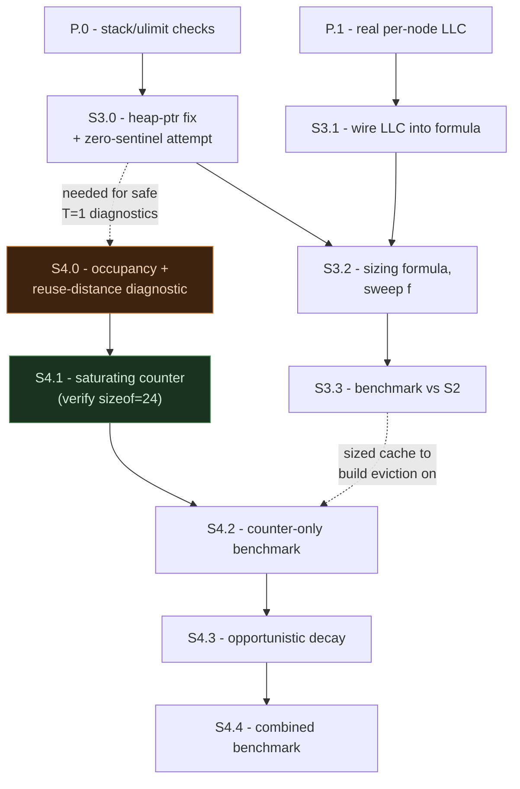

# S3/S4 Design Debate Report — 5-Agent, 3-Round Independent Research and Consensus (2026-08-27)

**Process:** 5-agent, 3-round independent-research-then-debate exercise, run against [`plan_paper/research_brief_s3_s4_2026-08-26.md`](https://github.com/KathpaliaChirag/Nanopore-project/blob/main/plan_paper/research_brief_s3_s4_2026-08-26.md) — the same audit format this project already used for [`verification_report_2026-08-26.md`](https://github.com/KathpaliaChirag/Nanopore-project/blob/main/plan_paper/verification_report_2026-08-26.md). Round 1: five agents (A–E) independently researched all five of the brief's questions against the primary sources plus fresh web research, with zero cross-visibility. Round 2: each agent read all five Round 1 papers and explicitly challenged, defended, or revised its own conclusions. Round 3 (this report): consensus synthesis, written by the coordinating session from all ten position papers.

> [!IMPORTANT]
> This report **supersedes part of [`planning/week6plan.md`](https://github.com/KathpaliaChirag/Nanopore-project/blob/main/planning/week6plan.md)**, a single-pass answer to the same brief written earlier and without this debate's cross-verification. Specifically, week6plan.md's claim that `S2Entry` has "3 unused padding bytes" for a free eviction counter rests on an unverified assumption (`taxid_t` = `uint32_t`) that this exercise found and corrected — see Q3 below. week6plan.md's other conclusions (heap-pointer fix, S4-over-S3 prioritization, the reuse-distance-histogram idea) all survive and are reinforced here with deeper, independently-verified support.

**A genuine live disagreement, caught and resolved mid-exercise:** in Round 1, three agents (A, B, E) assumed `taxid_t` is a 4-byte `uint32_t`; two agents (C, D) independently checked Kraken2's actual upstream header and found it's an 8-byte `uint64_t`. Round 2 forced every agent to re-verify directly against the primary source rather than defer to a co-agent's confidence — all five ended up fetching Kraken2's real GitHub source themselves, and all five converged on the same corrected answer. This is exactly the kind of error the process is designed to catch, and it materially changes the S4 eviction-counter design (see Q3).

---

## Q1 — The heap-allocated `thread_local` fix

**Verdict: fix pattern CONFIRMED, correct and low-risk. Precise crash mechanism CONFIRMED as leading hypothesis, not yet directly verified on Luna. Crash-fix ≠ slowdown-fix CONFIRMED — full 5/5 consensus, independently derived.**

**The fix.** Replace the static array with a lazily-allocated smart pointer:

```cpp
static thread_local std::unique_ptr<S2Entry[]> s2_cache;
static thread_local std::unique_ptr<uint8_t[]> s2_next_way;

static inline void S2EnsureInit(size_t num_sets, size_t ways) {
  if (!s2_cache) {
    s2_cache.reset(new S2Entry[num_sets * ways]);
    s2_next_way.reset(new uint8_t[num_sets]());
  }
}
```

All five agents independently confirmed this is race-free by construction, not merely "safe in practice": the pointer variable itself is `thread_local`, so no two threads ever observe or write the same memory — this is categorically different from the classic double-checked-locking hazard, which only exists when multiple threads share one lazily-initialized object. No lock, no atomic, no `call_once` is needed. `unique_ptr` (not a raw pointer) closes the one remaining risk (leak on thread exit) for free, at zero extra hot-path cost — and even a raw-pointer leak would be bounded and practically harmless here, since OpenMP's worker-thread pool is created once and lives for the whole classification run.

**The precise mechanism — sharper than the original diagnosis, still not fully nailed down.** The project's working theory ("glibc's static TLS allocation limit") named the right *class* of bug but the wrong specific mechanism. The textbook "static TLS surplus" (~1.7KB) is a `dlopen`-specific budget for shared objects loaded *after* a process's TLS layout is already fixed — it doesn't apply to `S2Entry`'s array, which is compiled directly into the executable. Three agents independently converged on a more precise, better-cited mechanism: NPTL's `allocate_stack()` computes a new thread's usable stack as roughly `requested_stack_size − guard_page − static_tls_size`, so a large file-scope `thread_local` array competes directly with every new thread's stack budget — real, named precedent exists for exactly this bug class (an OpenJDK issue, a Seastar patch titled "Adjust stack size with account of static tls size," a libc-alpha thread on the identical interaction). This precisely predicts the observed signature: fine at 1 thread (the main thread's TLS is set up by the dynamic linker before `main()`, not through this per-`pthread_create` arithmetic), fails only once OpenMP spawns worker threads, and the bare segfault (exit 139, not a clean `ENOMEM`/`bad_alloc`) is more consistent with a thread running out of real stack and faulting into its guard page than with a generic allocator refusal.

One agent (D) proposed an alternative: a `ulimit`/cgroup memory cap on the shared `student` account. The group's rebuttal: a process-wide memory cap doesn't naturally explain why the *identical total footprint* (16MB) is safe at 1 thread but crashes at 16+ threads — a per-thread stack-budget mechanism does, without requiring a coincidental cap value. The alternative is nonetheless cheap to rule out and should be checked anyway.

**Recommended pre-check, before any paper text asserts a mechanism as fact (near-zero cost, do this first):**
1. `ulimit -s` on Luna — if the default stack size, minus a guard page, is smaller than the crashing configuration's per-thread static-TLS size, that's the arithmetic directly confirming the mechanism, in one command.
2. `ulimit -a` and `cat /proc/self/limits` on the `student` account — rules out D's alternative cheaply, regardless of which mechanism turns out to dominate.
3. Capture the literal stderr from one crashing run (262,144 sets, 16+ threads) — confirms it's a bare SIGSEGV rather than a distinguishable glibc fatal-error message.

None of these change the recommended fix — every candidate mechanism (stack-budget competition, an internal TLS-bookkeeping limit, or a ulimit/cgroup cap) is fixed identically by moving the array off `thread_local` storage. They only matter for how confidently a paper can name the specific cause.

**The most important finding in this section: the heap-pointer fix removes the crash but almost certainly does *not* fix the separate slowdown cliff (≥1,048,576 sets, up to 22× slower).** Four of five agents independently converged on the identical, specific reason, from the same six lines of code:

```cpp
struct S2Entry {
  uint64_t tag = S2_EMPTY_TAG;   // = UINT64_MAX, not 0
  taxid_t taxon = TAXID_MAX;     // not 0
  bool was_hit = false;
};
```

Every non-`bool` field defaults to a non-zero sentinel. A zero-initialized array can be satisfied almost for free by the kernel's copy-on-write zero-page mechanism (a page isn't physically materialized until first write, and an all-zero page can be backed by one shared read-only zero page). An array whose constructor must write `0xFFFFFFFFFFFFFFFF` into every entry cannot use that shortcut — every byte is eagerly, physically dirtied at allocation time, regardless of whether the backing memory is a static `thread_local` array or a `new`-allocated heap array. **Moving the array to the heap changes where it lives, not whether this eager-write cost is paid.**

The real fix for the slowdown cliff needs two changes together, not one:
1. **Redefine "empty" as all-zero-bits** — `S2_EMPTY_TAG = 0` (with a one-line special case for the vanishingly rare real minimizer value of exactly 0, if it matters), so a page the OS lazily zero-fills is already a valid, correct "empty" state.
2. **Allocate via a primitive that actually gets OS lazy zero-paging** — `calloc` or `mmap(MAP_ANONYMOUS)`, not `new S2Entry[N]`. A type with any non-trivial default-member-initializer is not trivially constructible, so `new[]` still runs a real constructor loop over every element regardless of what value it happens to write — a zero-valued sentinel alone, paired with `new[]`, would *not* fix this.

This is the previously-unrun "pre-touch experiment" that `verification_report_2026-08-26.md`'s Q4 already recommended and flagged as still outstanding — this exercise sharpens exactly what that experiment should test.

**Cross-cutting warning for whoever builds Q4's diagnostics below:** any new `thread_local` array sized anywhere near the crash-risk range (≥262,144 elements) needs the same heap-pointer treatment, or must stay scoped to already-confirmed-safe sizes (≤65,536) — otherwise a diagnostic built to investigate one problem walks directly into this one.

---

## Q2 — S3's sizing formula

**Verdict: CONFIRMED — Luna's real per-workload LLC is ~105MB, not 210MB. Formula structure CONFIRMED. Exact safety fraction OPEN, deliberately not resolved by this debate.**

**The single most load-bearing correction in this whole exercise, independently found and cross-validated five separate times.** `dorado-kraken-research/CLAUDE.md` records Luna as "Xeon Platinum 8468, 96c/192t, 210 MB LLC." Intel's own spec sheet for the Platinum 8468 lists it as a **48-core/96-thread, 105MB-L3 part** — 2 × 48 = 96 and 2 × 105 = 210 match the doc's whole-machine figures exactly, confirming Luna is a **2-socket** machine and 210MB is the sum across both sockets. Every benchmark this project has ever run uses `numactl --cpunodebind=0 --membind=0`, which confines both compute and memory to **one socket**. **The real, workload-visible LLC has been half of the figure implicitly used throughout every planning document to date, including the original research brief.** One open caveat nobody could close from this sandbox: if Luna's BIOS has Sub-NUMA Clustering enabled, node 0 could be *half* a socket (~52.5MB), not the full 105MB — the size sweep's own 96-thread ceiling is weak evidence against this (consistent with one full socket), but S3.1 needs a real `numactl --hardware`/`lscpu -e` check on Luna, not an assumption either way.

**The formula, converged on by all five agents:**

```
N_sets(T) = floor( f × LLC_per_socket_bytes / (ways × sizeof(S2Entry) × T) )
```

`T` (thread count) and `sizeof(S2Entry)` must both be read live, not hardcoded — because the cache is `thread_local`, every concurrent thread's private copy competes for the same physical shared LLC, and (per Q3) the entry size changes as S4's design evolves. Using a stale hardcoded byte count would silently mis-budget the formula the next time the struct changes, exactly as already happened once this week (see Q3).

**A genuinely useful reframing, not just a restatement:** a *properly thread-count-scaled* formula is largely self-limiting at the thread counts that actually matter. At this project's documented 32–96T sweet spot, even a generously loose safety fraction keeps the formula's output well under both the crash ceiling (262,144 sets) and the slowdown cliff (1,048,576 sets) automatically. The two "hard ceilings" found in the size sweep are partly an artifact of testing one *fixed, thread-count-independent* size across a thread sweep — which is exactly what the size-sweep and pinning experiments both did — not necessarily a binding constraint on a correctly-designed formula. This doesn't make the Q1 heap-pointer fix unnecessary (it's still cheap, still worth doing, and still matters for safe single-threaded diagnostic work — including Q4's own instrumentation below, which needs to test near those ceilings), but it changes the framing from "the formula must work around these ceilings" to "a correct formula mostly avoids them by construction, and the fix is good hygiene regardless."

**Does the pinning experiment argue for or against growing cache size? Against, confirmed from two independent directions.** The measured trend (pinning's relative hit-rate gain: +25% at 4,096 sets → +9% at 65,536 → +4% at 262,144) already shows diminishing returns from raw capacity. The corrected LLC/thread-count arithmetic independently shows a properly-scaled formula lands in that same small-capacity regime at realistic thread counts. These are two separate lines of evidence pointing the same way, not one restated as two.

**Skip the full Bandana-style trace-driven simulator this week — confirmed, for a sharper reason than "we're short on time."** Bandana's actual technique (Facebook, MLSys 2019) simulates "miniature caches" against 5-billion-request production traces to solve a *combinatorial multi-table DRAM-budget-allocation* problem across many distinct embedding tables. S3's problem — one cache structure, one tunable size parameter, on one machine's static LLC topology — doesn't have that combinatorial shape. This project also already has real, measured, end-to-end hit-rate-vs-size data across two eviction policies and three sizes — stronger evidence than a *sampled* simulation was ever designed to produce for a problem this small. Use the fixed-fraction-of-LLC heuristic already pre-sanctioned as a fallback in `week4plan.md`/`week5plan.md`; defer the simulator to the week-10 buffer.

**What's genuinely still open, not papered over as agreement:** the exact safety fraction `f`. Across the five independent Round 1 passes, illustrative values ranged from `f=0.1` to `f=1.0` (a roughly 12× spread in the resulting `num_sets` at the same thread count), each a reasonable-sounding but ungrounded guess. **This should be resolved empirically** — a small sweep of `f` against real benchmark data (S3.2 below), the same methodology the pinning experiment already used, not further argument. Stating this honestly as open, rather than converging the group's five guesses toward a false-consensus number, is itself part of this report's finding.

---

## Q3 — S4's eviction policy: the next-cheapest increment

**Verdict: the "free padding" claim in the original brief (and in `week6plan.md`) is WRONG for the *original* `S2Entry` — CORRECTED here with a verified byte-accounting. The practical recommendation (a cheap saturating counter is the right next increment) SURVIVES, on corrected grounds. Prior-art gap CONFIRMED, 5/5 independently verified.**

**The correction, verified three separate times against Kraken2's actual upstream source (`src/kraken2_data.h`, both `master` and the exact `v2.17.1` tag this project builds from):**

```cpp
typedef uint64_t taxid_t;                    // NOT uint32_t
const taxid_t TAXID_MAX = (taxid_t) -1;
```

`taxid_t` is `uint64_t` (8 bytes), not `uint32_t` (4 bytes) as three of the five agents (and this report's own earlier `week6plan.md`) assumed. The likely source of the wrong assumption: conflating Kraken2's on-disk `CompactHashCell` (a packed 32-bit word holding a truncated hash tag plus a compressed value, the actual subject of Thesis 2's cell-width work) with the separate, decoded, in-memory `taxid_t` type that `S2Entry.taxon` actually stores. These are two different things by design — that distinction *is* the whole premise of treating cell-width reduction as a separate thesis from the adaptive cache.

**Corrected accounting:**

| Struct | Fields | Real size | Notes |
|---|---|---|---|
| Original `S2Entry` (round-robin/standalone, pre-`was_hit`) | `tag`(8) + `taxon`(8) | **16 bytes, zero padding** | Matches the log's own confirmed 16-bytes/entry arithmetic (`4,194,304×4×16=268,435,456`) — that number was always right, just for a different reason (8+8, not 8+4-padded) than assumed. 4 ways × 16B = **64 bytes/set = exactly one x86-64 cache line** — a genuinely clean, previously-uncalled-out property of the original design. |
| Pinned `S2Entry` (today's actual eviction-policy variant, `s2_pinned_patch.py`) | `tag`(8) + `taxon`(8) + `was_hit`(1) | **24 bytes**, not 16 | 17 logical bytes, rounded up to the next 8-byte boundary. Adding `was_hit` was **not free** — it silently grew the entry by 50% (64B/set → 96B/set = 1.5 cache lines), unmeasured and unflagged in today's real experiment. |

**This is a real, previously-invisible confound in today's pinning result, not just a bookkeeping correction.** The round-robin and pinned binaries compared at "the same capacity" were not actually touching the same footprint per set — the pinned variant reads/writes 50% more memory per set and crosses a cache-line boundary the round-robin variant doesn't. This does not undermine the +25%/+9%/+4% result — if anything, winning despite a real, unaccounted-for memory handicap is *stronger* evidence eviction policy matters, not weaker — but it should be stated explicitly in any write-up rather than left as an implicit "same capacity" assumption.

**What survives, precisely restated:** there genuinely is free slack for a saturating counter — **7 bytes (24 − 17), in the struct as it already exists today**, not "3 bytes in the original 16-byte design" as the brief and `week6plan.md` claimed. Widening `was_hit` from `bool` to a small saturating counter (e.g. `uint8_t`, 2–3 bits used, capped at 3 or 7) costs **zero further growth** beyond what today's already-committed, already-measured pinned binary spends. The honest framing: *the struct already grew once, silently; the next increment doesn't grow it again.*

**Design, converged on by four of five agents independently:** increment (saturating) on hit; on a full-set eviction pass, evict the way with the lowest counter (round-robin tiebreak, same safety-net as today's variant); apply decay **opportunistically during the eviction scan** — halve every way's counter in a set the moment a victim must actually be chosen — rather than on a fixed timer or a per-N-insertions schedule. This needs no background thread and no extra bookkeeping, reuses the exact code path already built, and only decays a set when eviction pressure on it is real.

**Guard against this happening again, silently, a second time:** add `static_assert(sizeof(S2Entry) == 24)` (or whatever the confirmed live size is) to the source, and make `sizeof(S2Entry)` a permanent field in every future binary's self-reported `atexit()` output — alongside the `size=`/`ways=` fields the project already added after an earlier mislabeling risk. This closes the exact class of confound that just occurred, for free, going forward.

**Prior-art check — full 5/5 independent confirmation, safe to state plainly in a paper.** None of the four cited comparators propose an eviction mechanism for a k-mer lookup cache:
- **kache-hash** (bioRxiv 2026) — hash-table *placement*: minimizer-based bucketing so consecutive k-mers land in the same bucket, exploiting streaming locality so the table itself stays cache-resident. No eviction concept at all — it isn't a bounded cache.
- **MegIS** (ISCA 2024, CMU-SAFARI) — in-storage processing, a different memory tier (SSD) entirely, not a DRAM/LLC cache-eviction policy.
- **MetaCache-GPU** / **GPMeta** — GPU-resident hash-table/index redesigns for throughput, not eviction policy.

This is a genuine, multiply-independently-verified gap — S4's eviction mechanism is real contribution, not adaptation.

**TinyLFU, evaluated precisely:** its core *insight* — frequency beats pure recency under skewed access, matching this project's own "clinical samples have a dominant species" framing — is worth citing. Its actual *machinery* (a Count-Min Sketch, a Bloom-filter "doorkeeper," periodic sketch-wide aging) exists to approximate frequency over a *huge* key universe when you can't afford a real per-item counter. S2's problem is the opposite: only ≤4 resident candidates per set ever need ranking, so an exact per-entry counter is strictly simpler, cheaper, and more precise than an approximate sketch. Cite TinyLFU as the inspiration for the decay idea; do not import its sketch/doorkeeper machinery.

**A flagged-but-deferred idea, not this week's work:** restoring single-cache-line-per-set alignment (e.g., truncating `tag` to a smaller hash to fit back into 16 bytes) is possible but reintroduces a real false-hit/aliasing risk the original verification audit already flagged as unverified for the compact hash table's own cells — worth naming as a future option, not attempting under this week's pacing pressure.

---

## Q4 — The M5-reuse-rate vs. low-hit-rate tension

**Verdict: substantially a metric-definition mismatch, not a mystery — CONFIRMED, with a reasonable dissent on how much this alone resolves. Experiment design CONFIRMED, 5/5 independent convergence.**

**The reframe.** This project's own source (`dorado-kraken-research/README.md`) defines M5 precisely: 90.7% = 32.8M unique minimizers out of 351.8M total lookups — the fraction of lookups whose minimizer has appeared **somewhere earlier in the entire ~350M-lookup run, with no bound on how far back.** That is a global, unbounded-distance reuse rate. A finite cache (at most ~1M live entries per thread at the largest safely-tested size) can only ever realize hits within a bounded recent window of that stream. High global reuse and a low realized hit rate are only in tension if you additionally assume repeat distances are typically small — and nothing in M5 measures or claims that. Read this way, ~1.5% hit rate at the best-tested configuration isn't evidence of a bug or a surprising contradiction; it's the expected outcome of feeding an unbounded-distance-reuse stream through a comparatively tiny window, absent any information about the actual distance distribution.

**A fair, adopted pushback:** this reframe correctly de-escalates "alarming paradox" to "open quantitative question" — it does not, by itself, establish the *magnitude* of the reuse-distance distribution, which still matters for whether some intermediate, safely-testable cache size would meaningfully help. The experiment below is still doing real, undetermined work; the reframe changes how confidently either outcome should be narrated afterward, not whether it's worth running.

**The experiment — full 5/5 independent convergence on the same two-part design, reusing infrastructure already proven safe this week:**

1. **Per-set occupancy histogram (near-free, do first).** `S2SetIndex` is currently `minimizer & (S2_NUM_SETS - 1)` — a raw low-bit mask, no mixing. Add one `thread_local` counter array (`S2_NUM_SETS` entries, same shape as the existing `s2_next_way` array), incremented on every lookup regardless of hit/miss, reported via the already-proven `atexit()` pattern. A markedly uneven distribution is direct, decisive evidence of a real, independently-fixable hashing bug (mix bits before masking, or use the high bits instead of the low bits) — a materially different and higher-priority finding than anything about eviction policy.
2. **Reuse-distance histogram (the brief's own suggested approach, more informative).** A `thread_local unordered_map<uint64_t, uint64_t>` (minimizer → last-seen lookup index) plus a monotonic per-thread lookup counter; on each repeat, bucket the distance into a log-scale histogram, reported the same way. **Must run single-threaded (T=1) only** — at M5's own scale (32.8M unique minimizers), the map costs roughly 1.3–1.6GB for one thread (a careful estimate, not "tens of MB" as first guessed), which is fine once but infeasible replicated across 96 threads. **Must be built as a separate, non-timed instrumentation binary**, not folded into any binary used for real wall-clock/LLC comparisons — an `unordered_map` lookup on every call is real per-call overhead that would visibly skew timing numbers, repeating the exact global-atomic-counter contention mistake this project already made and fixed once this week (the `sample_targeted` 3× slowdown artifact from shared atomics).

**How to read the result:** distances concentrated mostly *beyond* every tested capacity confirms the locality theory directly (expected, per the reframe above) and — usefully — tells S3/S4 what capacity would actually be needed to close the gap, which may simply be infeasible given the two hard ceilings; that's a decisive, actionable answer either way. Distances concentrated *within* the tested capacity range despite a still-low hit rate would instead point at a real `S2SetIndex` clustering bug (check #1 above would likely also flag it) — a higher-priority fix than any further eviction-policy tuning, since a badly distributed hash undermines any eviction refinement built on top of it. Sequence this diagnostic before further eviction-mechanism design work, not after — three of five agents independently ordered it first for exactly this reason.

---

## Q5 — Concrete week-ahead plan, and where engineering effort goes

**Verdict: S4 gets more engineering effort than S3 this week. Full, unanimous 5/5 consensus, independently triangulated via at least four separate argument chains — the strongest, most robustly-corroborated conclusion this exercise produced.**

The convergent grounds: (1) the pinning experiment's own empirical trend — eviction's relative benefit is largest exactly where capacity is smallest; (2) the corrected LLC/thread-count arithmetic (Q2) — a properly-scaled formula lands in that same small-capacity regime at realistic thread counts, so there was never much room to grow into; (3) S4's next increment is genuinely cheap (Q3, on corrected grounds) and sits in a real, multiply-verified literature gap; (4) this project has already missed its own explicit weekly target twice (`verification_report_2026-08-26.md`'s Q7) — the cheaper, higher-signal path is the fiscally responsible one against the Sept 13 deadline, not just the technically-preferred one.

### Pre-work — shared, cheap, do first (blocks nothing, costs under a day)

| Step | Type | What it does | If it fails |
|---|---|---|---|
| P.0 | Measured | `ulimit -s` on Luna (cheapest possible test of the Q1 stack-budget arithmetic); `ulimit -a` + `/proc/self/limits`; capture literal stderr from one crashing 262,144-set/16T+ run | If no distinguishing signal, proceed with the heap-pointer fix regardless — it's the right fix under every candidate mechanism — and describe the cause as "leading hypothesis, not directly confirmed on Luna" rather than fact |
| P.1 | Measured | `numactl --hardware` / `lscpu -e` on Luna — confirm per-node L3 is 105MB (not split further by Sub-NUMA Clustering) | If SNC is enabled, use the smaller confirmed per-node figure in S3's formula — the formula's shape doesn't change, only the constant |

### S3 — LLC-topology-aware sizing

| Sub-step | Type | What it does | If it fails |
|---|---|---|---|
| S3.0 | Measured | Land the `thread_local unique_ptr<S2Entry[]>` heap fix (Q1); **separately**, attempt the zero-sentinel + `calloc`/`mmap` fix for the slowdown cliff, tracked as a distinct change. Confirm the 262,144-set crash is gone at 16–96T; re-run the size sweep to see whether the slowdown cliff independently shrinks | If the crash persists, the mechanism isn't what's hypothesized — cap tested sizes below 262,144 and flag the root cause as still open. If the slowdown cliff doesn't shrink, treat it as a separate still-open item — don't imply one fix closed both |
| S3.1 | Design | Wire P.1's confirmed per-node LLC bytes into the formula | If per-node topology can't be cleanly queried, use the well-evidenced 105MB/socket default |
| S3.2 | Design | Formula: `N_sets(T) = floor(f × LLC_per_socket / (T × ways × sizeof(S2Entry)))`, reading `T` and `sizeof(S2Entry)` live at runtime, not hardcoded. Sweep `f` empirically (e.g. 0.05–0.5) against real benchmark data — this is the open parameter from Q2, resolve it by measurement, not by picking one agent's guess | If no `f` clearly wins on data, default to a conservative value (e.g. 0.1–0.25) and move on — a tuning knob, not a structural risk |
| S3.3 | Measured | Benchmark the formula's output at 32T and 96T against S2's existing baseline; confirm zero crashes at every tested thread count post-S3.0 | If it measures worse than S2, log it anyway — S4 needs *a* sized, crash-free cache to build on regardless of which number wins on wall-clock |
| *(deferred)* | — | Full Bandana-style trace-driven simulator | Explicitly deferred to the week-10 buffer — justified now by 5/5 independent convergence (Q2) plus the pacing evidence, not just time pressure |

### S4 — biology-dependent adaptive eviction

| Sub-step | Type | What it does | If it fails |
|---|---|---|---|
| S4.0 | Measured | Land the Q4 diagnostic (per-set occupancy histogram + reuse-distance histogram), as a separate non-timed T=1 binary, on `standard_8gb` first | If the occupancy check reveals real clustering, redirect effort to fixing `S2SetIndex`'s bit-mixing before any further eviction-mechanism work — a real, higher-priority pivot, not a footnote |
| S4.1 | Design | Print/assert `sizeof(S2Entry)` live on Luna (expect 24, per Q3's corrected accounting); widen `was_hit` to a small saturating counter in the confirmed 7-byte slack; add `static_assert(sizeof(S2Entry) == 24)` | If the real `sizeof` disagrees, treat it as a build-time-caught surprise and fix before benchmarking — not a silent one |
| S4.2 | Measured | Benchmark the counter-only variant (no decay yet) against today's binary-pinned and round-robin baselines, same validated methodology, **logging `sizeof(S2Entry)` per binary this time** | If it doesn't beat the existing binary pin, ship the binary pin — already a real, proven +25%/+9%/+4% win |
| S4.3 | Design | Add opportunistic decay-on-eviction-scan: halve every way's counter in a set the moment a full-set eviction actually needs a victim | If unstable, ship counter-without-decay as interim S4 — matches `week4plan.md`'s own existing named fallback for exactly this situation |
| S4.4 | Measured | Full benchmark of counter+decay — the number that fills S4's ledger row. Compare specifically against S4.2's isolated number, not just S2/round-robin | If it regresses vs. S4.2, keep S4.2 as the safe zone, log the regression honestly |
| S4.5 | Design (stretch) | Revisit the literal "biology-dependent" framing (permanent protection for k-mers seen in *every* read of a run, vs. merely-frequent-so-far ones) once S4.0–S4.4 land | If no clean biological signal distinguishes itself from plain frequency, ship the frequency-counter version honestly described as access-pattern-adaptive, and flag the gap |



---

## Summary table

| Q | Verdict | Consensus strength | Key correction from Round 1 → Round 2 |
|---|---|---|---|
| 1 | Fix CONFIRMED; mechanism CONFIRMED as leading hypothesis, not verified; crash≠slowdown CONFIRMED | 5/5 on fix/race/leak and crash≠slowdown; mechanism precision converged from 3 competing framings to 1 leading + 1 cheap-to-rule-out alternative | Sharpened from "glibc static TLS limit" to "static-TLS-competes-with-thread-stack-budget"; slowdown-cliff fix sharpened to "zero sentinel + calloc/mmap, not just heap pointer" |
| 2 | 105MB/socket (not 210MB) CONFIRMED; formula structure CONFIRMED; exact `f` OPEN | 5/5 on the LLC correction and formula shape — the strongest single finding in the exercise | `bytes_per_entry` corrected 16→24 for anything built on the pinned struct; safety fraction explicitly left open rather than false-converged |
| 3 | "Free padding" claim CORRECTED (was wrong); saturating-counter recommendation SURVIVES on corrected grounds; prior-art gap CONFIRMED | 5/5 once `taxid_t` was independently re-verified by all five agents | `taxid_t` resolved from disputed (3 vs. 2) to unanimous `uint64_t`; struct size corrected 16→24 bytes for the pinned variant; decay mechanism sharpened to opportunistic-on-eviction-scan |
| 4 | "Tension" reframed as substantially a metric-definition mismatch; experiment design CONFIRMED | 5/5 on experiment design; reframe adopted with one fair, recorded dissent on how much it alone resolves | Memory-cost estimate corrected from "tens of MB" to ~1.3–1.6GB/thread; instrumentation scoped explicitly to a separate non-timed T=1 binary |
| 5 | S4 over S3 this week — CONFIRMED | 5/5, independently triangulated via 4+ separate argument chains — the strongest consensus of the whole exercise | None — this conclusion was directionally right from Round 1 and only gained supporting evidence, not correction |

---

## What this changes about `week6plan.md`

- **Q3/S4.1's "free padding" claim is wrong as written** — `S2Entry` did not have 3 free bytes in its original 16-byte form; it grew to 24 bytes when `was_hit` was added, and the 7 bytes of real slack exist only in that already-grown struct. Fix before anyone implements against the old document's specific byte claim.
- **S3's sizing formula should use `sizeof(S2Entry)` read live, not a hardcoded 16**, for anything sized against the pinned struct S4 actually builds on.
- Everything else in `week6plan.md` — the heap-pointer fix's design, the S4-over-S3 prioritization, the reuse-distance-histogram idea for the M5 tension — is reinforced and sharpened by this exercise, not contradicted.

This document is research and design only — nothing here has touched Luna. The next session picking this up starts at Pre-work (P.0/P.1), the two cheapest, highest-leverage checks that resolve Q1's remaining mechanism uncertainty and Q2's remaining hardware uncertainty before any code changes land.
