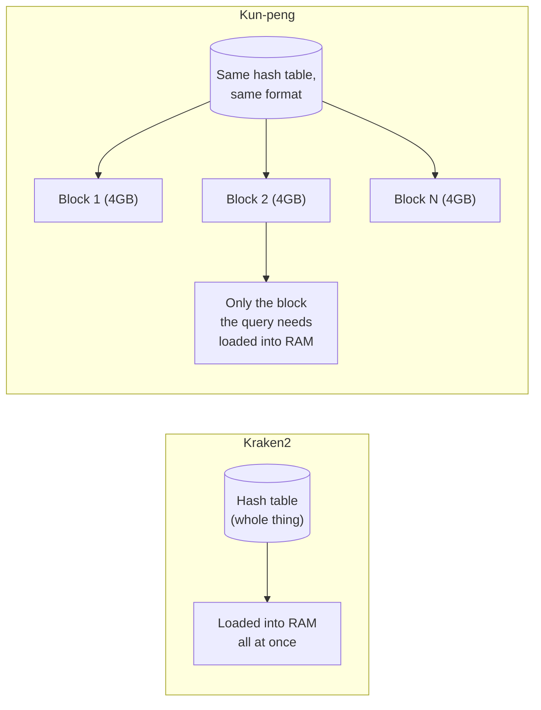

# Week 3 — Kun-peng, Explained

Pre-meeting study note, 2026-08-17. Meeting with sir is 2026-08-19. This is not the full `mtpweek3.md` planning doc — that gets built the usual way after the meeting. This is just so you walk in Wednesday already understanding what Kun-peng is.

## Is it a Kraken2 add-on, or its own tool?

**Its own tool.** Kun-peng is a separate Rust codebase with its own binary — you don't install it "on top of" Kraken2, and Kraken2 doesn't need to be present to run it. It reimplements Kraken2's classification algorithm from scratch in Rust.

The "add-on" intuition isn't crazy, though, because of how compatible it is:

- It uses the *exact same hash table design* as Kraken2 — same hash function, same cell width, same linear-probing collision handling. Algorithmically, it's Kraken2.
- It can take an existing Kraken2 database (`hash.k2d`, `opts.k2d`, `taxo.k2d`) and convert it into its own format with a `hashshard` command.
- Its classification reports come out Kraken-compatible, so any downstream tooling you already have pointed at Kraken2 output keeps working.

So: separate tool, separate binary, separate build — but deliberately wire-compatible with Kraken2's world so it's a drop-in replacement, not a rival ecosystem.

## The one trick it does

Kraken2 loads its entire hash table into RAM before it can classify anything. If your database is bigger than your RAM, you're stuck — that's the whole "smaller database" pain point this project is built around.

Kun-peng doesn't shrink the table. It cuts the *same* table into sequential ~4GB blocks on disk and only pulls in the block a query actually needs, on demand:

> [!IMPORTANT]
> The database on disk is the **same size** either way — Kun-peng's own paper reports it as identical to Kraken2's (~81GB for their test reference). Nothing about the stored structure got smaller. What got smaller is how much of it you have to hold in RAM at once.

## The numbers (from the paper)

| Metric | Kraken2 | Kun-peng | Gain |
|---|---|---|---|
| Build peak memory (75,796 genomes, ~81GB DB) | 100.2 GB | 4.1 GB | 24x |
| Build time | 20.6 h | 4.6 h | 4.5x |
| Query peak memory (per sample, hot-start) | 103.2 GB | as low as 9.1 GB, or 4.0–35.4 GB pan-domain | up to 473x |
| Classification speed (fast mode) | 7.1 min | 1.5 min | 4.73x |

Real-world stress test: a 4.3TB, 204,477-genome pan-domain database, built with only 4.1GB peak RAM. Hardware: AMD EPYC 7742, 128 cores, 512GB RAM, 10 threads used. Published: Chen, Zhang, Peng, Huang, Liu, Shen & Jiang, *Briefings in Bioinformatics* 27(2), March 2026 ([paper](https://academic.oup.com/bib/article/27/2/bbag119/8525000), [code](https://github.com/eric9n/Kun-peng)).

## Why it doesn't scoop either thesis

- **Thesis 2** (cell-width + double hashing) shrinks what's *stored* — fewer bits per hash cell, plus double hashing to hold off the false-positive cliff. Kun-peng touches none of that; it only changes how an unmodified table gets streamed off disk. The two combine: narrower cells → smaller blocks → an even lower RAM number than either technique alone gets you.
- **Thesis 1** (adaptive k-mer cache) lives at the CPU-cache tier — KB/MB-scale, LLC-topology-aware. Kun-peng lives at the RAM/disk tier — GB-scale block files, and the paper confirms zero cache-hierarchy awareness or eviction policy below the block level. Different layer of the machine entirely.

Full differentiation write-up with citations is in `idea_week2.md` under "Kun-peng — differentiation from the 'smaller database' pitch."

## Bring to sir on Wednesday

Kun-peng is live, maintained, peer-reviewed, and Kraken2-DB-compatible — stronger case for putting it in the actual comparator table next to Metabuli/Centrifuger than for cite-only treatment like kache-hash/MegIS get. If it goes in, it needs an ARM64/Orion buildability check first (Rust toolchain, likely fine but unverified).
