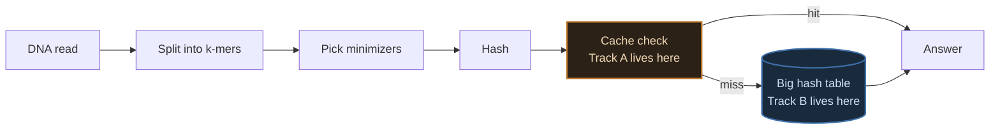
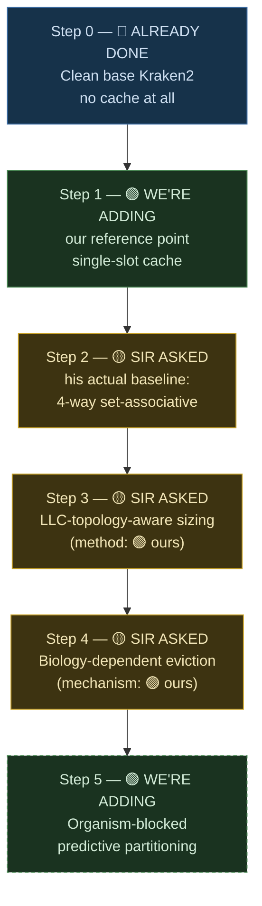
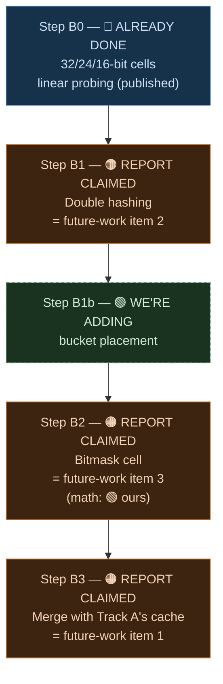

# Week 4 Plan — Building Both Theses From Scratch

Every piece of this gets built fresh, against real base Kraken2, one change at a time, benchmarked before the next change goes in. By the end of the week you should have a number for every single piece of both theses, not one combined "it's faster now" figure per thesis.

## Reading key — four tags, used on every step below

If you're reading this cold, this is the one thing to understand before anything else: every single step in this plan gets exactly one of these four tags, always in this order, no exceptions.

| Tag | Meaning |
|---|---|
| 🔵 **ALREADY DONE** | Work that's finished and measured before this week — a fact, not a plan |
| 🟡 **SIR ASKED** | Directly from his email, quoted below — his words, not ours |
| 🟠 **REPORT CLAIMED** | Already written in the existing report's §5 ("Future Work"), *designed but never run* — our own prior claim, quoted below |
| 🟢 **WE'RE ADDING** | New this week, not requested by sir or written in the report — our own contribution |

## Source of truth — the three inputs, quoted exactly

### 🟡 SIR ASKED — his email, verbatim

> I think you could continue on the work that you have done in the summer — the two distinct pieces can culminate in the two thesis [idea is: "smaller database + smarter cache".
>
> - Hardware aware Adaptive K-mer Cache
>   - Baseline 4-way set associative
>   - Implement LLC-topology-aware cache sizing
>   - [Biology dependent Access pattern] Adaptive eviction policy
> - Cell-Width Reduction + Double Hashing
>   - Complete the three items of future work
>
> For both, compare against Centrifuge.
>
> Ask LLMs for way forward — they may have some more ideas.
>
> This is provided you want to continue with kMers :)

> [!IMPORTANT]
> Two details in this email reshape the plan below. First: he names **"Baseline 4-way set associative"** as item one — the associative cache is the *starting point* he's asking for, not something to build up to across two steps. Second: for Thesis 2 he just says **"complete the three items of future work"** — pointing at the report's §5, quoted next, not issuing a fresh brief.

### 🟠 REPORT CLAIMED — the existing report's §5 ("Future Work"), verbatim

Written before this week, describing work that was *designed but never run*:

**Item 1 — a latency-hiding lookup cache** (designed, not yet run). A small per-thread lookup cache catching repeated k-mers before they reach the slow hash table — projected at a 9–12% cache-miss rate and IPC 1.8–2.3. The measured reuse rate behind this projection: **90.7% of lookups within a run repeat a k-mer already seen** (32.8M unique of 351.8M total lookups) — far above the 20% originally assumed, because clinical samples have a dominant species. Combined with three smaller patches (compiler vector flags, huge-page hints, a one-line prefetch), the projected wall-time path is **4.405s baseline → ~3.0s (32% cut) → ~2.6s (41% cut)** with further micro-patches. **Neither projection has actually been run.** This is the single highest-priority open item in the report — explicitly the same next step both the cache work and the cell-width work were independently heading toward, meant to merge into one implementation, not get built twice.

**Item 2 — change the probing scheme to shrink average probe length.** The report's own false-positive model makes both the false-positive rate and the lookup cost proportional to average probe length `p`. Replacing linear probing with double hashing (or Robin-Hood/cuckoo hashing) cuts `p` from ≈6 to ≈2.5 at the same 70% load factor, shifting the false-positive cliff down by ≈1.3 bits — making 16-bit cells safe without a threshold, and opening the door to a cell narrower than 16 bits. Needs only a change to the probe-generating function; the effect is already predicted by the existing model.

**Item 3 — the bitmask cell.** A 6-bit-per-organism value so one table lookup answers presence/absence for every panel member at once, instead of one lookup per organism.

A fourth item exists in the report too, separate from "the three" sir is pointing at: extending the panel to the missing ESKAPE member (*A. baumannii*), upstreaming the 16/24-bit cells to mainline Kraken2, and re-running the sweeps on a ≥200MB-L3 server. Worth keeping on the radar, not part of this week's core plan.

### 🟢 WE'RE ADDING — beyond both of the above

- The eviction algorithm's actual mechanism — sir asked for "adaptive eviction," the report doesn't specify one. Decayed-importance tracking plus permanent protection for universally-hot k-mers, grounded in four independent literatures (LLM inference caching, Mixture-of-Experts caching, recommendation-system caching, general skew-resistant indexing) that converged on this design without citing each other.
- A real method for the sizing step — trace-driven simulation against real read-access data (Bandana's method), not just reading LLC size and guessing a fraction of it.
- Organism-blocked predictive partitioning — translated from a competing tool's trick (Kun-peng) at a different memory tier.
- Bucket placement on top of double hashing — reusing the same hash pair to generate multiple candidate slots, not just a probe stride.
- The actual false-positive formula for the bitmask cell — the report names the cell but never derives its collision math (its existing model describes linear-probing/double-hashing cells, not a shared OR-collision bitmask). Derivation strategy adapted from Count-Min Sketch.

## Where each track sits in the system



Track A changes what happens before the big table is ever touched. Track B changes the table itself. The final step of both tracks — 🟠 report item 1 — is where they merge into one implementation.

## Track A — Thesis 1, the build order



Each arrow is one commit, one benchmark run, one number.

## Track A — per-step detail

| Step | Tag | Change | Exact source |
|---|---|---|---|
| 0 | 🔵 ALREADY DONE | Clean `kraken2-src`, unmodified | The true zero point |
| 1 | 🟢 WE'RE ADDING | Thread-local single-slot cache | Our own reference point — not sir's ask, not in the report |
| 2 | 🟡 SIR ASKED | 4-way set-associative | His email, "Baseline 4-way set associative" |
| 3 | 🟡 SIR ASKED + 🟢 WE'RE ADDING | LLC-topology-aware sizing, trace-driven size selection | Target from his email; the trace-driven *method* is ours |
| 4 | 🟡 SIR ASKED + 🟢 WE'RE ADDING | Biology-dependent adaptive eviction — decayed importance, protected conserved k-mers | Target from his email; the *mechanism* (4-literature convergence) is ours |
| 5 | 🟢 WE'RE ADDING | Organism-blocked predictive partitioning | Entirely ours — not in his email, not in the report |

Target to benchmark against: 🟠 the report's own projection, **4.405s → ~3.0s → ~2.6s**, never actually run. This week either confirms or corrects that number for real.

## Track B — Thesis 2, the build order



| Step | Tag | Change | Exact source |
|---|---|---|---|
| B0 | 🔵 ALREADY DONE | Existing 32/24/16-bit, linear-probing numbers — cited, not re-run | Already-published cell-width work |
| B1 | 🟠 REPORT CLAIMED | Linear probing replaced with double hashing | Report §5 item 2 — predicted to cut probe length `p` from ≈6 to ≈2.5, shift the cliff ≈1.3 bits, open a sub-16-bit cell |
| B1b | 🟢 WE'RE ADDING | Reuse the double-hash pair for 2-4 candidate slots, bucketed 4-way, greedy-packed at build time | Ours — not in the report or sir's email |
| B2 | 🟠 REPORT CLAIMED + 🟢 WE'RE ADDING | 6-bit-per-organism bitmask cell | Report §5 item 3; the false-positive derivation for it is ours |
| B3 | 🟠 REPORT CLAIMED | Merge with Track A's cache into one implementation | Report §5 item 1 — "the single highest-priority open item" in the whole report |

> [!IMPORTANT]
> Step B3 is not optional. The report calls the merge "the single highest-priority open item across both tracks" and says the two designs should merge into one implementation "rather than built twice." It only makes sense once Track A is far enough along to merge into — sequence it last, don't skip it.

## Action plan — how each step actually gets run

Same discipline as every hands-on session on this project: one command at a time, explained before it runs, result logged before moving to the next. Nothing gets batched.

**Before step 0 — confirm the ground is clean**
```bash
$ ssh student@luna.cse.iitd.ac.in
$ cd ~/tools/kraken2-src && git status   # confirm no leftover patch is already applied
```

**Step 0 — the baseline, no code touched yet**
```bash
$ perf stat -e cache-misses,cache-references,LLC-loads,LLC-load-misses,instructions,cycles \
  numactl --cpunodebind=0 --membind=0 \
  kraken2 --db ~/AccuracyDrift/databases/<DB> \
  --threads 32 \
  --output /dev/null --report /dev/null \
  /home/student/results/basecalling/reads_hac.fastq
```
Same command this project has used for every prior measurement — keeps step 0 directly comparable to the 4.405s baseline already on record.

**Every step after — the repeating loop, once per step**
1. Implement the one change for this step, against the clean (or previous-step) source — nothing else touched.
2. `make -s clean && make -s -j 96` — rebuild.
3. Run the exact same profiling command as step 0, same database, same thread count.
4. Log the result next to the previous step's number.
5. Commit and push before starting the next step.

## What Wednesday should walk away with

Two tables — six rows for Track A, five rows for Track B (B0 cited, B1/B1b/B2/B3 freshly measured) — each with a real measured number, not a projection, and each carrying one of the four tags above so it's immediately clear whose idea it was. The report's own 4.405s → 3.0s → 2.6s path has never been run end to end; this week either confirms it or replaces it with what actually happened.

## Comparator baseline — 🟡 SIR ASKED — Centrifuge

His email is explicit on this, both times: "for both, compare against Centrifuge." Neither track's numbers mean anything on their own without that comparison sitting next to them — set up alongside this week's steps, not deferred to later.
