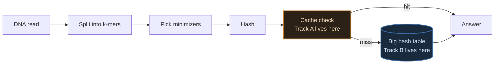
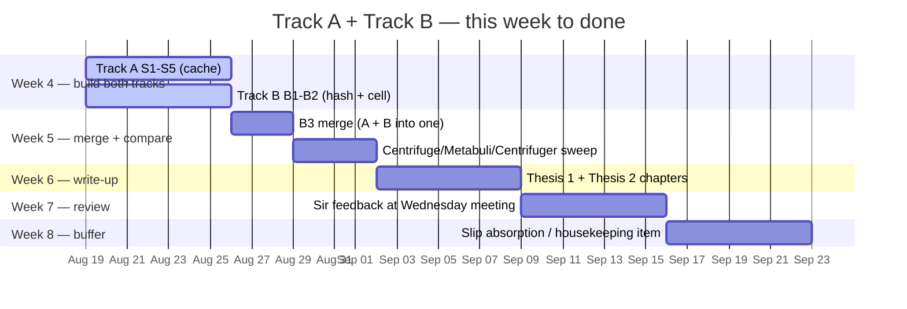
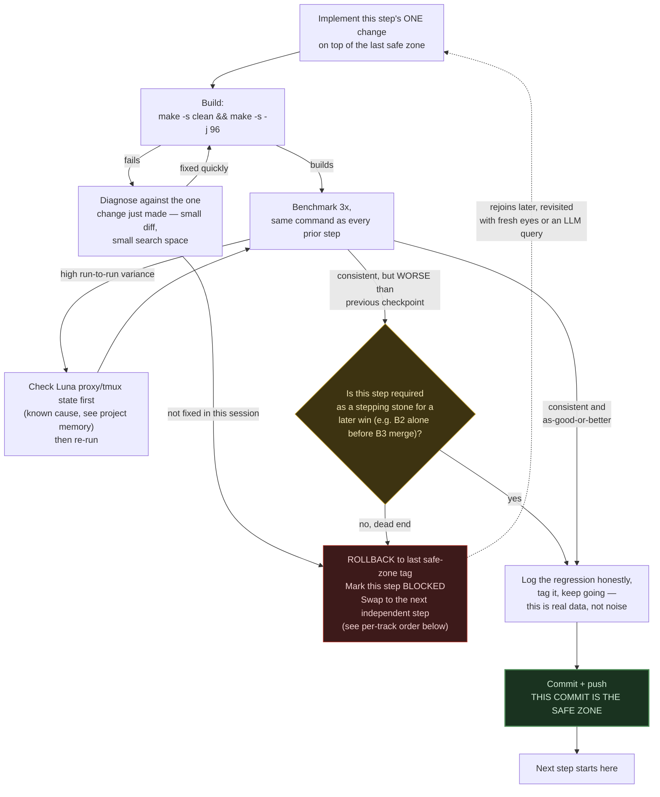
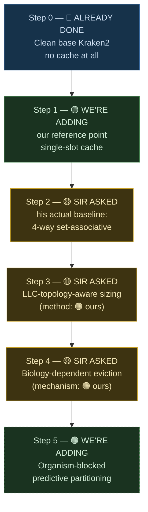
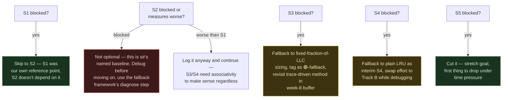
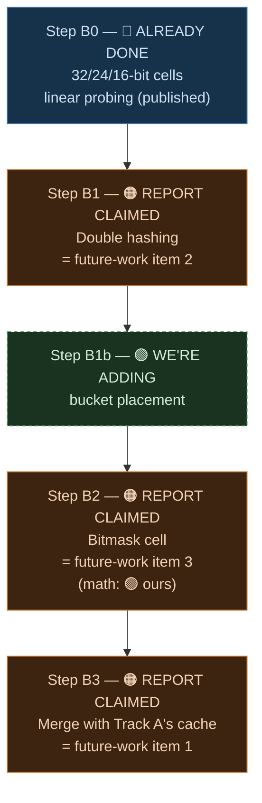

# Week 4 Plan — Building Both Theses From Scratch

Every piece of this gets built fresh, against real base Kraken2, one change at a time, benchmarked before the next change goes in. By the end of the week you should have a number for every single piece of both theses, not one combined "it's faster now" figure per thesis.

## Reading key — four tags, used on every step below

If you're reading this cold, this is the one thing to understand before anything else: every single step in this plan gets exactly one of these four tags, always in this order, no exceptions.

| Tag | Meaning |
|---|---|
| 🔵 **ALREADY DONE** | Work that's finished and measured before this week — a fact, not a plan |
| 🟡 **SIR ASKED** | Directly from his email, quoted below — his words, not ours |
| 🟠 **REPORT CLAIMED** | Already written in the existing report's §5 ("Future Work"), *designed but never run* — our own prior claim, quoted below |
| 🟢 **WE'RE ADDING** | New this week, not requested by sir or written in the report — our own contribution |

## Source of truth — the three inputs, quoted exactly

### 🟡 SIR ASKED — his email, verbatim

> I think you could continue on the work that you have done in the summer — the two distinct pieces can culminate in the two thesis [idea is: "smaller database + smarter cache".
>
> - Hardware aware Adaptive K-mer Cache
>   - Baseline 4-way set associative
>   - Implement LLC-topology-aware cache sizing
>   - [Biology dependent Access pattern] Adaptive eviction policy
> - Cell-Width Reduction + Double Hashing
>   - Complete the three items of future work
>
> For both, compare against Centrifuge.
>
> Ask LLMs for way forward — they may have some more ideas.
>
> This is provided you want to continue with kMers :)

> [!IMPORTANT]
> Two details in this email reshape the plan below. First: he names **"Baseline 4-way set associative"** as item one — the associative cache is the *starting point* he's asking for, not something to build up to across two steps. Second: for Thesis 2 he just says **"complete the three items of future work"** — pointing at the report's §5, quoted next, not issuing a fresh brief.

### 🟠 REPORT CLAIMED — the existing report's §5 ("Future Work"), verbatim

Written before this week, describing work that was *designed but never run*:

**Item 1 — a latency-hiding lookup cache** (designed, not yet run). A small per-thread lookup cache catching repeated k-mers before they reach the slow hash table — projected at a 9–12% cache-miss rate and IPC 1.8–2.3. The measured reuse rate behind this projection: **90.7% of lookups within a run repeat a k-mer already seen** (32.8M unique of 351.8M total lookups) — far above the 20% originally assumed, because clinical samples have a dominant species. Combined with three smaller patches (compiler vector flags, huge-page hints, a one-line prefetch), the projected wall-time path is **4.405s baseline → ~3.0s (32% cut) → ~2.6s (41% cut)** with further micro-patches. **Neither projection has actually been run.** This is the single highest-priority open item in the report — explicitly the same next step both the cache work and the cell-width work were independently heading toward, meant to merge into one implementation, not get built twice.

**Item 2 — change the probing scheme to shrink average probe length.** The report's own false-positive model makes both the false-positive rate and the lookup cost proportional to average probe length `p`. Replacing linear probing with double hashing (or Robin-Hood/cuckoo hashing) cuts `p` from ≈6 to ≈2.5 at the same 70% load factor, shifting the false-positive cliff down by ≈1.3 bits — making 16-bit cells safe without a threshold, and opening the door to a cell narrower than 16 bits. Needs only a change to the probe-generating function; the effect is already predicted by the existing model.

**Item 3 — the bitmask cell.** A 6-bit-per-organism value so one table lookup answers presence/absence for every panel member at once, instead of one lookup per organism.

A fourth item exists in the report too, separate from "the three" sir is pointing at: extending the panel to the missing ESKAPE member (*A. baumannii*), upstreaming the 16/24-bit cells to mainline Kraken2, and re-running the sweeps on a ≥200MB-L3 server. Worth keeping on the radar, not part of this week's core plan.

### 🟢 WE'RE ADDING — beyond both of the above

- The eviction algorithm's actual mechanism — sir asked for "adaptive eviction," the report doesn't specify one. Decayed-importance tracking plus permanent protection for universally-hot k-mers, grounded in four independent literatures (LLM inference caching, Mixture-of-Experts caching, recommendation-system caching, general skew-resistant indexing) that converged on this design without citing each other.
- A real method for the sizing step — trace-driven simulation against real read-access data (Bandana's method), not just reading LLC size and guessing a fraction of it.
- Organism-blocked predictive partitioning — translated from a competing tool's trick (Kun-peng) at a different memory tier.
- Bucket placement on top of double hashing — reusing the same hash pair to generate multiple candidate slots, not just a probe stride.
- The actual false-positive formula for the bitmask cell — the report names the cell but never derives its collision math (its existing model describes linear-probing/double-hashing cells, not a shared OR-collision bitmask). Derivation strategy adapted from Count-Min Sketch.

## Where each track sits in the system



Track A changes what happens before the big table is ever touched. Track B changes the table itself. The final step of both tracks — 🟠 report item 1 — is where they merge into one implementation.

## Multi-week roadmap — from this week to done

Nine measured steps stand between where the project is now and a Wednesday-ready pair of thesis results: five in Track A (S1–S5), four in Track B (B1–B3, since B0 is already published), plus the comparator sweep and the write-up itself. That's too much for one week to hide inside — laying it out across weeks up front is what makes "did we slip?" a one-glance question instead of a surprise in week 7.



> [!NOTE]
> Dates are a planning scaffold, not a promise — they start from today (2026-08-19) and assume nothing blocks. Every fallback in the next section names exactly where a blocked step's time comes from, so a slip in week 4 shows up as a smaller buffer in week 8, not a silently missed step.

**What each week is actually for:**

| Week | Goal | Depends on | If it slips |
|---|---|---|---|
| 4 (now) | Track A S1→S5 and Track B B1→B2 built and measured, one commit per step | Nothing — both tracks start from 🔵 already-done baselines and run independently | Absorbed by week 8; S5 and B1b are the two steps marked optional below and are the first to move, not S2-S4 or B1/B2 which sir or the report asked for directly |
| 5 | B3 merge (Track A's cache + Track B's hashing/cell into one implementation) and the full three-way comparator sweep (Centrifuge, Metabuli, Centrifuger) across every measured config | Track A reaching a mergeable state in week 4 | Merge slips to early week 6, write-up starts on whatever tracks *are* merged and gets amended once B3 lands |
| 6 | Turn the measured tables into the two thesis chapters | Week 5's numbers being real, not projected | Draft with whatever's measured so far, marked clearly as provisional, backfilled once week 5 finishes |
| 7 | Sir's review at the standing Wednesday meeting, revisions from his feedback | A draft existing to review | This is the one week that can't silently absorb a slip — if there's nothing to show, say so at the meeting instead of skipping it |
| 8 | Buffer — catches anything still open, or does the report's 4th "housekeeping" item (ESKAPE panel extension, upstreaming, ≥200MB-L3 re-run) if nothing slipped | Everything above | If week 8 isn't enough either, that's an explicit escalation at the next Wednesday meeting, not a quiet extension |

## How this plan survives failure — the fallback framework

Nine steps, each touching performance-sensitive C++ on a shared machine, is nine chances for a build to break, a number to look wrong, or Luna's network to be uncooperative. Rather than write a bespoke contingency for each of the nine, one decision tree covers all of them — every step in Track A and Track B below points back to this same tree.



Three rules make this tree do its job instead of just looking thorough:

1. **A safe zone is a pushed commit, nothing looser.** "It's working on my terminal" is not a safe zone — if Luna's session drops before the push, that step's work doesn't exist yet. The existing action-plan discipline below ("commit and push before starting the next step") already does this; this section just names why it matters.
2. **A bad number is data, not a failure, unless it's a genuine dead end.** Sir's own baseline (S2, 4-way set-associative) might measure worse than the simpler S1 reference point — that's expected and still gets logged and kept, because S3/S4 need associativity to make sense. Distinguish "worse but necessary" from "worse and going nowhere" using the question in the diagram, not gut feel.
3. **Blocked steps get swapped, not stalled on.** Track A and Track B run independently until B3 — if Track A's eviction step (S4) is stuck, jump to Track B's bitmask cell (B2) instead of losing a day. This is *why* the two tracks were designed to run in parallel in the first place.

## Track A — Thesis 1, the build order



Each arrow is one commit, one benchmark run, one number.

## Track A — per-step detail

| Step | Tag | Change | Exact source | If this step's number is bad |
|---|---|---|---|---|
| 0 | 🔵 ALREADY DONE | Clean `kraken2-src`, unmodified | The true zero point | N/A — nothing to fall back from |
| 1 | 🟢 WE'RE ADDING | Thread-local single-slot cache | Our own reference point — not sir's ask, not in the report | Optional step — if it's stuck, skip straight to S2 and note S1 as "not measured," since S2 doesn't depend on it |
| 2 | 🟡 SIR ASKED | 4-way set-associative | His email, "Baseline 4-way set associative" | Not skippable — sir named this the starting point. If it measures worse than S1, log it anyway (see rule 2 in the fallback framework) and keep going |
| 3 | 🟡 SIR ASKED + 🟢 WE'RE ADDING | LLC-topology-aware sizing, trace-driven size selection | Target from his email; the trace-driven *method* is ours | If the trace-driven simulation can't be built in time, fall back to a simpler heuristic (fixed fraction of detected LLC size), tag the result 🟢-fallback explicitly, and revisit the real method in the week-8 buffer |
| 4 | 🟡 SIR ASKED + 🟢 WE'RE ADDING | Biology-dependent adaptive eviction — decayed importance, protected conserved k-mers | Target from his email; the *mechanism* (4-literature convergence) is ours | If decayed-importance tracking is unstable, fall back to plain LRU as an interim S4 so S5 isn't blocked, and swap effort to Track B (B1/B2) while it's debugged |
| 5 | 🟢 WE'RE ADDING | Organism-blocked predictive partitioning | Entirely ours — not in his email, not in the report | First step to cut under time pressure — it's a stretch goal (already shown dashed in the diagram above), not something sir or the report asked for |

Target to benchmark against: 🟠 the report's own projection, **4.405s → ~3.0s → ~2.6s**, never actually run. This week either confirms or corrects that number for real.



## Track B — Thesis 2, the build order



| Step | Tag | Change | Exact source | If this step's number is bad |
|---|---|---|---|---|
| B0 | 🔵 ALREADY DONE | Existing 32/24/16-bit, linear-probing numbers — cited, not re-run | Already-published cell-width work | N/A — nothing to fall back from |
| B1 | 🟠 REPORT CLAIMED | Linear probing replaced with double hashing | Report §5 item 2 — predicted to cut probe length `p` from ≈6 to ≈2.5, shift the cliff ≈1.3 bits, open a sub-16-bit cell | If the measured cliff shift misses the ≈1.3-bit projection, don't discard it — re-derive the false-positive model empirically from what was actually measured. That correction *is* the finding, not a failure |
| B1b | 🟢 WE'RE ADDING | Reuse the double-hash pair for 2-4 candidate slots, bucketed 4-way, greedy-packed at build time | Ours — not in the report or sir's email | Second step to cut under time pressure (after S5) — stretch goal, dashed in the diagram above |
| B2 | 🟠 REPORT CLAIMED + 🟢 WE'RE ADDING | 6-bit-per-organism bitmask cell | Report §5 item 3; the false-positive derivation for it is ours | If the Count-Min-Sketch-adapted collision math doesn't hold up against measured false-positive rates, report the cell as a working design with an *empirically measured* (not fully theory-justified) collision rate, and flag the gap as an open question rather than blocking the step |
| B3 | 🟠 REPORT CLAIMED | Merge with Track A's cache into one implementation | Report §5 item 1 — "the single highest-priority open item" in the whole report | Not skippable — see callout below. If Track A isn't mergeable yet, this step's time moves to week 5, not off the plan |

> [!IMPORTANT]
> Step B3 is not optional. The report calls the merge "the single highest-priority open item across both tracks" and says the two designs should merge into one implementation "rather than built twice." It only makes sense once Track A is far enough along to merge into — sequence it last, don't skip it.


## Action plan — how each step actually gets run

Same discipline as every hands-on session on this project: one command at a time, explained before it runs, result logged before moving to the next. Nothing gets batched.

**Before step 0 — confirm the ground is clean**
```bash
$ ssh student@luna.cse.iitd.ac.in
$ cd ~/tools/kraken2-src && git status   # confirm no leftover patch is already applied
```

**Step 0 — the baseline, no code touched yet**
```bash
$ perf stat -e cache-misses,cache-references,LLC-loads,LLC-load-misses,instructions,cycles \
  numactl --cpunodebind=0 --membind=0 \
  kraken2 --db ~/AccuracyDrift/databases/<DB> \
  --threads 32 \
  --output /dev/null --report /dev/null \
  /home/student/results/basecalling/reads_hac.fastq
```
Same command this project has used for every prior measurement — keeps step 0 directly comparable to the 4.405s baseline already on record.

**Every step after — the repeating loop, once per step**
1. Implement the one change for this step, against the clean (or previous-step) source — nothing else touched.
2. `make -s clean && make -s -j 96` — rebuild. Build failure → the diagnose/rollback branch in the fallback framework above, not a reason to touch a second file while debugging.
3. Run the exact same profiling command as step 0, same database, same thread count — **three times**, not once, so a one-off noisy run can't masquerade as a real regression.
4. Log the result next to the previous step's number, worse or better either way.
5. Commit and push before starting the next step. **This push is the safe zone** — nothing about this step is "done" until this line has happened.

## Safe-zone checkpoint ledger

Every row below gets its commit hash filled in the moment that step's push happens — this table is the fast answer to "what's our last known-good state" if a later step goes sideways, without needing to dig through `git log`.

| Step | What it is | Safe-zone commit | Status |
|---|---|---|---|
| S0 | Clean baseline | *(already on record — 4.405s)* | 🔵 done |
| S1 | Single-slot cache | _fill in_ | ⬜ not started |
| S2 | 4-way set-associative | _fill in_ | ⬜ not started |
| S3 | LLC-topology sizing | _fill in_ | ⬜ not started |
| S4 | Biology-dependent eviction | _fill in_ | ⬜ not started |
| S5 | Organism-blocked partitioning (stretch) | _fill in_ | ⬜ not started |
| B0 | 32/24/16-bit, linear probing | *(already published)* | 🔵 done |
| B1 | Double hashing | _fill in_ | ⬜ not started |
| B1b | Bucket placement (stretch) | _fill in_ | ⬜ not started |
| B2 | Bitmask cell | _fill in_ | ⬜ not started |
| B3 | Merge A + B | _fill in_ | ⬜ not started |

## What Wednesday should walk away with

Two tables — six rows for Track A, five rows for Track B (B0 cited, B1/B1b/B2/B3 freshly measured) — each with a real measured number, not a projection, and each carrying one of the four tags above so it's immediately clear whose idea it was. The report's own 4.405s → 3.0s → 2.6s path has never been run end to end; this week either confirms it or replaces it with what actually happened. Any step marked BLOCKED in the safe-zone ledger above gets said out loud at the meeting — the fallback framework exists so a blocked step is a one-line status update, not a surprise.

## Comparator baseline — 🟡 SIR ASKED — Centrifuge

His email is explicit on this, both times: "for both, compare against Centrifuge." Neither track's numbers mean anything on their own without that comparison sitting next to them — set up alongside this week's steps, not deferred to later.

> [!WARNING]
> If Centrifuge/Metabuli/Centrifuger installs or runs start hanging or intermittently failing on Luna, check the proxy setup *before* assuming the tool is broken — Luna needs both a `tmux`-persisted `iitd-login.py` session and four `proxy62.iitd.ac.in:3128` environment variables for outbound internet, and missing either one looks exactly like a flaky download, not a config problem. This has cost real debugging time before.
