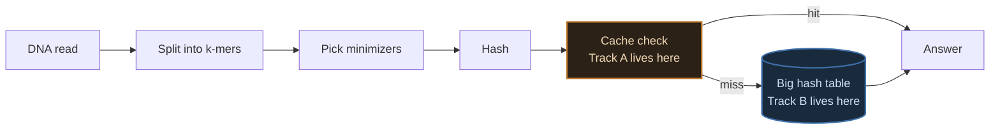
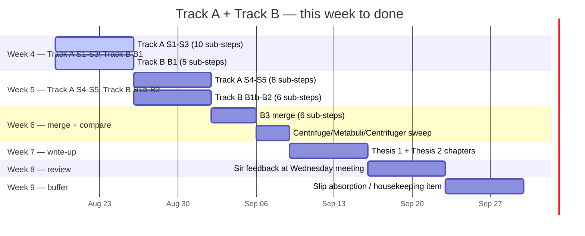
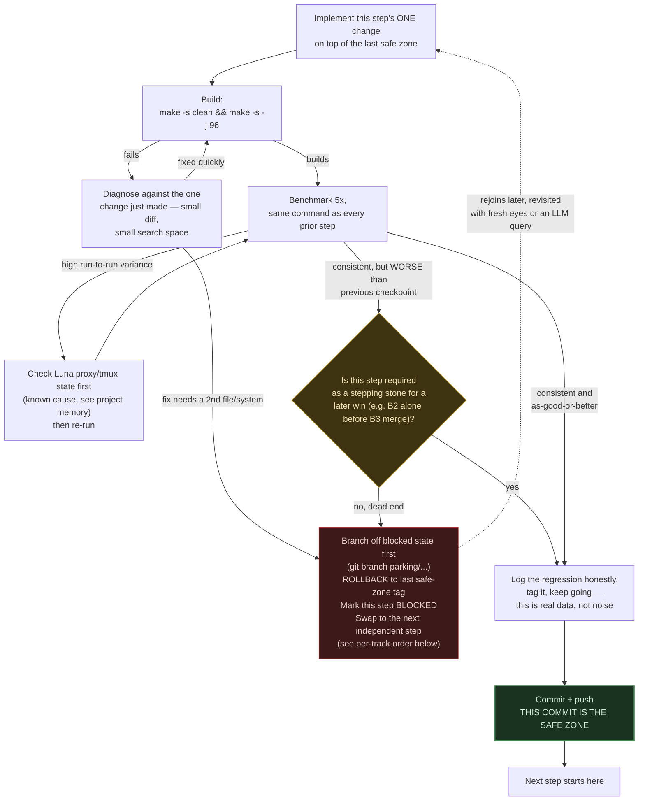
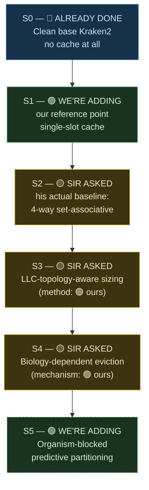
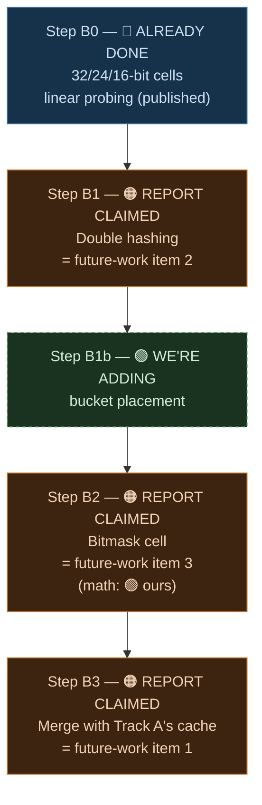
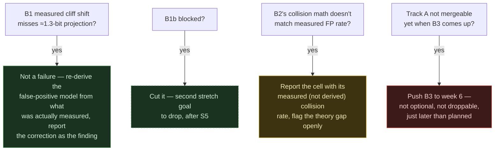

# Week 4 Plan — Building Both Theses From Scratch

Every piece of this gets built fresh, against real base Kraken2, one change at a time, benchmarked before the next change goes in. By the end of the week you should have a number for every single piece of both theses, not one combined "it's faster now" figure per thesis.

## Reading key — four tags, used on every step below

If you're reading this cold, this is the one thing to understand before anything else: every single step in this plan gets exactly one of these four tags, always in this order, no exceptions.

| Tag | Meaning |
|---|---|
| 🔵 **ALREADY DONE** | Work that's finished and measured before this week — a fact, not a plan |
| 🟡 **SIR ASKED** | Directly from his email, quoted below — his words, not ours |
| 🟠 **REPORT CLAIMED** | Already written in the existing report's §5 ("Future Work"), *designed but never run* — our own prior claim, quoted below |
| 🟢 **WE'RE ADDING** | New this week, not requested by sir or written in the report — our own contribution |

## Source of truth — the three inputs, quoted exactly

### 🟡 SIR ASKED — his email, verbatim

> I think you could continue on the work that you have done in the summer — the two distinct pieces can culminate in the two thesis [idea is: "smaller database + smarter cache".
>
> - Hardware aware Adaptive K-mer Cache
>   - Baseline 4-way set associative
>   - Implement LLC-topology-aware cache sizing
>   - [Biology dependent Access pattern] Adaptive eviction policy
> - Cell-Width Reduction + Double Hashing
>   - Complete the three items of future work
>
> For both, compare against Centrifuge.
>
> Ask LLMs for way forward — they may have some more ideas.
>
> This is provided you want to continue with kMers :)

> [!IMPORTANT]
> Two details in this email reshape the plan below. First: he names **"Baseline 4-way set associative"** as item one — the associative cache is the *starting point* he's asking for, not something to build up to across two steps. Second: for Thesis 2 he just says **"complete the three items of future work"** — pointing at the report's §5, quoted next, not issuing a fresh brief.

### 🟠 REPORT CLAIMED — the existing report's §5 ("Future Work"), verbatim

Written before this week, describing work that was *designed but never run*:

**Item 1 — a latency-hiding lookup cache** (designed, not yet run). A small per-thread lookup cache catching repeated k-mers before they reach the slow hash table — projected at a 9–12% cache-miss rate and IPC 1.8–2.3. The measured reuse rate behind this projection: **90.7% of lookups within a run repeat a k-mer already seen** (32.8M unique of 351.8M total lookups) — far above the 20% originally assumed, because clinical samples have a dominant species. Combined with three smaller patches (compiler vector flags, huge-page hints, a one-line prefetch), the projected wall-time path is **4.405s baseline → ~3.0s (32% cut) → ~2.6s (41% cut)** with further micro-patches. **Neither projection has actually been run.** This is the single highest-priority open item in the report — explicitly the same next step both the cache work and the cell-width work were independently heading toward, meant to merge into one implementation, not get built twice.

**Item 2 — change the probing scheme to shrink average probe length.** The report's own false-positive model makes both the false-positive rate and the lookup cost proportional to average probe length `p`. Replacing linear probing with double hashing (or Robin-Hood/cuckoo hashing) cuts `p` from ≈6 to ≈2.5 at the same 70% load factor, shifting the false-positive cliff down by ≈1.3 bits — making 16-bit cells safe without a threshold, and opening the door to a cell narrower than 16 bits. Needs only a change to the probe-generating function; the effect is already predicted by the existing model.

**Item 3 — the bitmask cell.** A 6-bit-per-organism value so one table lookup answers presence/absence for every panel member at once, instead of one lookup per organism.

A fourth item exists in the report too, separate from "the three" sir is pointing at: extending the panel to the missing ESKAPE member (*A. baumannii*), upstreaming the 16/24-bit cells to mainline Kraken2, and re-running the sweeps on a ≥200MB-L3 server. Worth keeping on the radar, not part of this week's core plan.

### 🟢 WE'RE ADDING — beyond both of the above

- The eviction algorithm's actual mechanism — sir asked for "adaptive eviction," the report doesn't specify one. Decayed-importance tracking, grounded in four independent literatures (LLM inference caching, Mixture-of-Experts caching, recommendation-system caching, general skew-resistant indexing) that converged on this design without citing each other, plus permanent protection for universally-hot k-mers — that second piece leans more on production practice (e.g. Redis's manual hot-key handling) than on an independent convergence in that literature.
- A real method for the sizing step — trace-driven simulation against real read-access data (Bandana's method), not just reading LLC size and guessing a fraction of it.
- Organism-blocked predictive partitioning — translated from a competing tool's trick (Kun-peng) at a different memory tier.
- Bucket placement on top of double hashing — reusing the same hash pair to generate multiple candidate slots, not just a probe stride.
- The actual false-positive formula for the bitmask cell — the report names the cell but never derives its collision math (its existing model describes linear-probing/double-hashing cells, not a shared OR-collision bitmask). Derivation strategy adapted from Count-Min Sketch.

## Where each track sits in the system



Track A changes what happens before the big table is ever touched. Track B changes the table itself. The final step of both tracks — 🟠 report item 1 — is where they merge into one implementation.

## Multi-week roadmap — from this week to done

Nine top-level steps stand between where the project is now and a Wednesday-ready pair of thesis results — five in Track A (S1–S5), four in Track B (B1–B3, since B0 is already published). Each one bundles multiple real sub-steps once every design decision and every benchmark gets its own line: 35 in total, 16 of them measurable. That number is what actually paces the calendar below, not the top-level count.

> [!NOTE]
> This roadmap originally fit both tracks into one week. Once the sub-steps below were made explicit, that estimate was obviously wrong — 35 real commits don't fit where 9 did, because the overhead per cycle (build, five benchmark runs, log, push) doesn't shrink just because a step got smaller. Five weeks became six. That's not scope creep — it's the fallback framework's own rule 2 applied to the plan itself: a bad number is data, not a failure, and this one got corrected before it cost a real week.



> [!NOTE]
> Dates are a planning scaffold, not a promise — they start from today (2026-08-19, a Wednesday) and assume nothing blocks. Every week boundary lands on a Wednesday to match the standing meeting, and every fallback below names exactly where a blocked sub-step's time comes from, so a slip in week 4 shows up as a smaller buffer in week 9, not a silently missed step.

**What each week is actually for:**

| Week | Goal | Depends on | If it slips |
|---|---|---|---|
| 4 (now) | Every Design/prep sub-step, plus whichever Measured sub-steps that unlocks, for Track A S1→S3 and Track B B1 | Nothing — both tracks start from 🔵 already-done baselines and run independently | Push incomplete sub-steps into week 5. S1's sub-steps are the first to cut if truly stuck, matching S1's existing optional status — S2's and S3's are not, sir and his email named both directly |
| 5 | The same, for Track A S4→S5 and Track B B1b→B2 | Week 4 leaving S1–S3 and B1 in a measured, mergeable state | Push into week 9's buffer. Cut S5's and B1b's sub-steps first — both are stretch goals — and keep S4's and B2's in place, since sir and the report asked for those directly |
| 6 | B3's full 6-sub-step merge (Track A's cache + Track B's hashing/cell into one implementation) and the three-way comparator sweep (Centrifuge, Metabuli, Centrifuger) | Track A and Track B both reaching a mergeable state by the end of week 5 | Push the merge into week 7. Start the write-up on whatever's merged by then, and amend it once B3 clears |
| 7 | Turn the measured tables into the two thesis chapters | Week 6's numbers being real, not projected | Draft with whatever's measured so far. Mark it clearly as provisional, and backfill it once week 6 finishes |
| 8 | Sir's review at the standing Wednesday meeting, revisions from his feedback | A draft existing to review | This is the one week that can't silently absorb a slip — if there's nothing to show, say so at the meeting instead of skipping it |
| 9 | Buffer — catches anything still open, or does the report's 4th "housekeeping" item (ESKAPE panel extension, upstreaming, ≥200MB-L3 re-run) if nothing slipped | Everything above | If week 9 isn't enough either, that's an explicit escalation at the next Wednesday meeting, not a quiet extension |

Read the Depends-on column as the real critical path: each week only has something real to work with once the row above it lands clean, so a slip's cost shows up immediately in the next week's row instead of hiding until the write-up in week 7.

**What "done" actually means.** This plan is done when four things are true, all already defined above: (1) Track A has real numbers through S4 — S2's baseline, S3's sizing, S4's eviction, the three pieces sir named; S1 and S5 are optional and don't gate this. (2) Track B has real numbers through B3 — B1's double hashing, B2's bitmask cell, B3's merge into Track A's cache, the report's top open item; B1b is optional. (3) The three-way comparator sweep (Centrifuge, Metabuli, Centrifuger) is complete, not just the Centrifuge comparison sir asked for directly. (4) Both thesis chapters are drafted and have had one round of sir's Wednesday review. None of this carries a calendar date, because sir gave none — his email is an open-ended "continue the work," not a deadline. What this document does commit to is narrower: it plans concretely through week 9. If week 9 absorbs everything above, the plan finishes on schedule. If it doesn't — or week 8's review opens new work instead of closing it — this document's job ends there too. The next step at that point is a conversation with sir about week 10, not a silent extension of a nine-week plan.

## How this plan survives failure — the fallback framework

Nine steps, each touching performance-sensitive C++ on a shared machine, is nine chances for a build to break, a number to look wrong, or Luna's network to be uncooperative. Rather than write a bespoke contingency for each of the nine, one decision tree covers all of them — every step in Track A and Track B below points back to this same tree.



Four rules make this tree do its job instead of just looking thorough:

1. **A safe zone is a pushed commit, tagged — not just pushed.** "It's working on my terminal" is not a safe zone — if Luna's session drops before the push, that step's work doesn't exist yet. The existing action-plan discipline below ("commit and push before starting the next step") already does the push; tag it too, right after — `git tag safe/S2` — so "roll back to the last safe zone" means one literal `git checkout safe/S2`, not a hunt through `git log` for the right hash.
2. **A bad number is data, not a failure, unless it's a genuine dead end.** Sir's own baseline (S2, 4-way set-associative) might measure worse than the simpler S1 reference point. That's expected, not a failure. Log it and keep it anyway — S3/S4 need associativity to make sense regardless. Distinguish "worse but necessary" from "worse and going nowhere" using the question in the diagram, not gut feel.
3. **Before rolling back a blocked step, branch off the blocked state first.** `git branch parking/S4-decayed-importance` (name it after whatever the step actually is) before touching anything else, so the abandoned attempt isn't lost — it's resumable later with `git checkout parking/S4-decayed-importance` instead of re-deriving whatever was half-working from memory.
4. **Blocked steps get swapped, not stalled on — and "blocked" is a scope trigger, not a clock.** Track A and Track B run independently until B3 — if Track A's eviction step (S4) is stuck, jump to Track B's bitmask cell (B2) instead of losing a day. What actually decides "stuck": if fixing the current step's build failure would mean touching a second file or system beyond the one change under test, that's the signal to roll back — not a fixed time-box. Real perf-engineering practice deliberately avoids hard deadlines here (Chromium's regression policy is the well-known example) because a clock either kills a legitimately-slow-to-diagnose bug early, or gets blown through anyway — neither version of a clock actually helps.

## Track A — Thesis 1, the build order



Each arrow is one commit, one benchmark run, one number.

## Track A — per-step detail

| Step | Tag | Change | Exact source | If this step's number is bad |
|---|---|---|---|---|
| S0 | 🔵 ALREADY DONE | Clean `kraken2-src`, unmodified | The true zero point | N/A — nothing to fall back from |
| S1 | 🟢 WE'RE ADDING | Thread-local single-slot cache | Our own reference point — not sir's ask, not in the report | Optional step — if it's stuck, skip straight to S2 and note S1 as "not measured," since S2 doesn't depend on it |
| S2 | 🟡 SIR ASKED | 4-way set-associative | His email, "Baseline 4-way set associative" | Not skippable — sir named this the starting point. If it measures worse than S1, log it anyway (see rule 2 in the fallback framework) and keep going |
| S3 | 🟡 SIR ASKED + 🟢 WE'RE ADDING | LLC-topology-aware sizing, trace-driven size selection | Target from his email; the trace-driven *method* is ours | If the trace-driven simulation can't be built in time, fall back to a simpler heuristic (fixed fraction of detected LLC size), tag the result 🟢-fallback explicitly, and revisit the real method in the week-9 buffer |
| S4 | 🟡 SIR ASKED + 🟢 WE'RE ADDING | Biology-dependent adaptive eviction — decayed importance, protected conserved k-mers | Target from his email; the *mechanism* (4-literature convergence) is ours | If decayed-importance tracking is unstable, fall back to plain LRU as an interim S4 so S5 isn't blocked, and swap effort to Track B (B1/B2) while it's debugged |
| S5 | 🟢 WE'RE ADDING | Organism-blocked predictive partitioning | Entirely ours — not in his email, not in the report | First step to cut under time pressure — it's a stretch goal (already shown dashed in the diagram above), not something sir or the report asked for |

Target to benchmark against: 🟠 the report's own projection, **4.405s → ~3.0s → ~2.6s**, never actually run. This week either confirms or corrects that number for real.

Same logic as the fallback framework above, fast-reference form for Track A's five steps:


Nothing new in this tree — it's the same five outcomes from the table above, just quicker to scan when a step is actually stuck.

### Track A — sub-step detail

Same five steps as above, broken into the granular sub-steps that actually get built and committed. **Design** sub-steps are derivations or decisions with no benchmark yet; **Measured** sub-steps are the ones that produce a real number and get their own line in the safe-zone ledger below.

**S1 — single-slot cache** (2 sub-steps — no replacement decision to make, so implement-then-benchmark is the whole step)

| Sub-step | Type | What it does | If it fails |
|---|---|---|---|
| S1.1 | Design | Add a thread-local key+result slot with check-then-overwrite logic ahead of the big table | If the slot isn't truly per-thread (race/stale hits), fix it before benchmarking |
| S1.2 | Measured | Run step 0's profiling command, log next to the 4.405s baseline | Skip to S2.1, log S1 "not measured" — S2 doesn't depend on it |

**S2 — 4-way set-associative** (4 sub-steps — three real design decisions before the benchmark)

| Sub-step | Type | What it does | If it fails |
|---|---|---|---|
| S2.1 | Design | Pick the hash bits that map a k-mer to a cache set | If the bits cluster k-mers unevenly, re-slice or mix the hash before benchmarking, not after |
| S2.2 | Design | Compare the incoming tag against all 4 ways in the set, return on match | If compare logic misreads a way (false hit/miss), fix via the fallback framework's diagnose step |
| S2.3 | Design | Pick a simple interim replacement rule (e.g. round-robin) for which way gets evicted — S4 replaces this later | If round-robin proves unstable, drop to random replacement to unblock the benchmark |
| S2.4 | Measured | Run the profiling command, log against S0/S1 | Not skippable — sir's named baseline. If blocked, diagnose per the fallback framework; if worse than S1, log it anyway (rule 2) |

**S3 — LLC-topology-aware sizing** (4 sub-steps — detect, collect, simulate, wire in)

| Sub-step | Type | What it does | If it fails |
|---|---|---|---|
| S3.1 | Design | Query Luna's real L3 size, associativity, and core-sharing layout, instead of the flat size the fallback heuristic uses | If fine-grained sharing/associativity info isn't available, fall back to just the flat L3 size the fixed-fraction fallback already relies on |
| S3.2 | Design | Capture a real k-mer lookup trace, or synthesize one from the report's own 90.7% reuse-rate and dominant-species-skew numbers | If a real trace can't be captured in time, synthesize one from those already-measured numbers instead |
| S3.3 | Design | Feed S3.1's topology and S3.2's trace through the Bandana-style simulator to pick a cache size and predict its hit rate | If the simulator can't be built/run in time, skip straight to the fixed-fraction-of-LLC heuristic, tag 🟢-fallback, revisit in the week-9 buffer |
| S3.4 | Measured | Parameterize the cache with S3.3's (or the fallback's) chosen size, build, and benchmark | If it measures worse than S2, log it anyway (rule 2) — S4 needs a sized cache to build on regardless of which number wins |

**S4 — biology-dependent adaptive eviction** (5 sub-steps — decay and protection get separated so each has its own checkpoint)

| Sub-step | Type | What it does | If it fails |
|---|---|---|---|
| S4.1 | Design | Design the decay function: a per-entry importance score that fades with time-since-access, replacing LRU's binary recent/not-recent bit | No stable decay shape on paper — borrow TinyLFU's counter-decay directly instead of inventing one |
| S4.2 | Measured | Wire the decay score into the eviction path (evict lowest score) and benchmark it alone, no protection yet | This is the case S4's existing fallback already names — fall back to plain LRU as interim S4, before protection is built on an unstable base |
| S4.3 | Design | Define what counts as "universally hot" (e.g. a cross-read frequency threshold) and flag qualifying k-mers for protection | No clean threshold separates hot from noise — ship S4 as decay-only for now, revisit pinning as a later add-on, not a blocker |
| S4.4 | Design | Make protection a hard skip in eviction candidate selection — pinned entries are excluded outright, not just given a high score that can still decay away | Pinned entries still get evicted under load — fix the skip logic before touching the benchmark |
| S4.5 | Measured | Benchmark decay + protection together — this is the number that fills S4's row in the ledger | Regresses vs. S4.2's decay-only number — keep S4.2 as the safe zone, log the regression honestly, don't quietly drop protection to hide it |

**S5 — organism-blocked predictive partitioning** (3 sub-steps — stretch goal, first cut under time pressure)

| Sub-step | Type | What it does | If it fails |
|---|---|---|---|
| S5.1 | Design | Derive a cheap per-read guess at the next organism block, adapting Kun-peng's trick across memory tiers | If no cheap predictor turns up in time, use round-robin block assignment; flag "predictive" unmeasured |
| S5.2 | Design | Reserve cache blocks per predicted organism so one organism can't evict another's block | If fixed blocks waste space on unseen organisms, use soft (preferred, not exclusive) partitioning instead |
| S5.3 | Measured | Benchmark against S4, Track A's last required step | First to cut under time pressure — if stuck, cut it, log "not attempted," move on |

Every sub-step still points back to the same fallback framework above — this section just gives each one its own line so "if it fails" means something specific instead of a generic shrug.

## Track B — Thesis 2, the build order



| Step | Tag | Change | Exact source | If this step's number is bad |
|---|---|---|---|---|
| B0 | 🔵 ALREADY DONE | Existing 32/24/16-bit, linear-probing numbers — cited, not re-run | Already-published cell-width work | N/A — nothing to fall back from |
| B1 | 🟠 REPORT CLAIMED | Linear probing replaced with double hashing | Report §5 item 2 — predicted to cut probe length `p` from ≈6 to ≈2.5, shift the cliff ≈1.3 bits, open the door to a sub-16-bit cell | If the measured cliff shift misses the ≈1.3-bit projection, don't discard it — re-derive the false-positive model empirically from what was actually measured. That correction *is* the finding, not a failure |
| B1b | 🟢 WE'RE ADDING | Reuse the double-hash pair for 2-4 candidate slots, bucketed 4-way, greedy-packed at build time | Ours — not in the report or sir's email | Second step to cut under time pressure (after S5) — stretch goal, dashed in the diagram above |
| B2 | 🟠 REPORT CLAIMED + 🟢 WE'RE ADDING | 6-bit-per-organism bitmask cell | Report §5 item 3; the false-positive derivation for it is ours | If the Count-Min-Sketch-adapted collision math doesn't hold up against measured false-positive rates, report the cell as a working design with an *empirically measured* (not fully theory-justified) collision rate, and flag the gap as an open question rather than blocking the step |
| B3 | 🟠 REPORT CLAIMED | Merge with Track A's cache into one implementation | Report §5 item 1 — "the single highest-priority open item" in the whole report | Not skippable — see callout below. If Track A isn't mergeable yet, this step's time moves to week 6, not off the plan |

> [!IMPORTANT]
> Step B3 is not optional. The report calls the merge the single highest-priority open item across both tracks and says the two designs should merge into one implementation rather than built twice. It only makes sense once Track A is far enough along to merge into — sequence it last, don't skip it.

Same fast-reference form for Track B's four steps:



B3 is the one branch here that never turns red — it just moves later, exactly as the callout above says.

### Track B — sub-step detail

Same shape as Track A above, applied to the four Track B steps. Sub-step IDs use dots (`B1.1`, not `B1a`) specifically because `B1b` already names a separate top-level step — a letter scheme would make one of B1's own sub-steps unreadable next to it.

**B1 — double hashing** (5 sub-steps — a second hash function, an independence check, the probe-generation rewrite, an infinite-loop check, and the benchmark)

| Sub-step | Type | What it does | If it fails |
|---|---|---|---|
| B1.1 | Design | Implement h2(key) from a hash family structurally unlike h1's (different multiplier/bit-mixing), forced odd/nonzero | If an original design stalls, borrow a hash pair from a known-good published double-hashing implementation rather than invent one |
| B1.2 | Measured | Correlation/chi-square test of h1(key) vs h2(key) over real k-mer keys, before wiring h2 in | If h2 correlates with h1, don't retune it — swap in an unrelated family (e.g. bit-mixing, not multiplicative) and re-test; correlation silently collapses it toward linear probing |
| B1.3 | Design | Replace the linear-probing stride with `slot = (h1(key) + i*h2(key)) % size` in the lookup/insert path | Gate the new path behind a compile-time flag so linear probing is one rebuild away, keeping the fallback framework's small-diff diagnose step intact |
| B1.4 | Measured | Fill the table to ~95%+ load, confirm every probe sequence terminates and reaches every open slot | Force table size to stay prime (or power-of-2 with h2 forced odd) so gcd(h2, size)=1 holds by construction, instead of patching runtime cases |
| B1.5 | Measured | Run the standard benchmark, measure actual probe length and cliff shift, compare against the ≈6→≈2.5 and ≈1.3-bit projections | Same as B1's own fallback — don't discard a miss, re-derive the false-positive model from what was actually measured; the correction is the finding |

**B1b — bucket placement** (3 sub-steps — stretch goal, second thing cut after S5)

| Sub-step | Type | What it does | If it fails |
|---|---|---|---|
| B1b.1 | Design | Decide the greedy build-time rule for picking among an entry's 2-4 double-hash candidate slots (e.g. least-loaded-first), and what happens when all are full | If no rule is clearly better on paper, default to least-loaded-first and let benchmarking settle it |
| B1b.2 | Measured | Build the 2-4-slot bucketed table at build time per the chosen policy | If entries get dropped or the load factor misses target, roll back to B1's table and cut B1b, per its stretch-goal status |
| B1b.3 | Measured | Run the standard benchmark on the packed table, logged against B1's number | A worse number doesn't block B2 (unlike S2 blocking S3/S4) — cut B1b under time pressure rather than log-and-continue |

**B2 — bitmask cell** (3 sub-steps — derive, implement, validate)

| Sub-step | Type | What it does | If it fails |
|---|---|---|---|
| B2.1 | Design | Adapt Count-Min Sketch's collision bound to a shared OR-collision cell, deriving the false-positive formula for 6 organism-bits sharing one cell | If the adaptation won't reduce to a clean closed form, carry a rough union-bound estimate forward and let benchmarking be the real answer |
| B2.2 | Measured | Implement the 6-bit-per-organism cell's bit layout and its set/query logic | If set/query doesn't round-trip, roll back to B1/B1b's cell, mark B2 BLOCKED, and swap to Track A while debugging — B2 isn't optional, don't cut it |
| B2.3 | Measured | Measure the real false-positive rate and compare it against B2.1's derivation | If the measured rate misses the derived formula, report the cell with its measured, not derived, collision rate and flag the gap openly — B2's existing fallback, unchanged |

**B3 — merge with Track A's cache** (6 sub-steps — the riskiest step in the plan, where a wrong answer or worse number is a real problem, not data to log and move past)

| Sub-step | Type | What it does | If it fails |
|---|---|---|---|
| B3.1 | Design | Diff Track A's cache-entry assumptions (cell width, hash scheme) against Track B's actual B2 output (bitmask cell, double hashing); list every mismatch | Takes longer, not less — the merge can't start on a partial mismatch list, so keep auditing |
| B3.2 | Design | Rewrite Track A's cache-entry struct and tag-compare logic to match whatever format B2 actually emits | Keep iterating as long as needed; skipping it risks silent miscompiles or misclassification downstream |
| B3.3 | Design | Point Track A's cache-miss handler at B1/B1b/B2's real lookup (not a stub), and get the combined tree building clean | Diagnose against this merge diff specifically — both patches build alone, so the bug is in the seam; take the extra time |
| B3.4 | Measured | Run the merged binary against known-answer accuracy fixtures; confirm output matches the pre-merge baseline before any speed number is trusted | Never benchmark speed on a wrong-answer build — keep debugging as long as it takes; a fast wrong number is worse than a late right one |
| B3.5 | Measured | Profile the merged system with the standard benchmark; compare against both tracks' best solo numbers | The one case where worse is a real warning, not data to log — return to B3.1/B3.2 and hunt the interaction bug; slower is fine, a regression is not |
| B3.6 | Measured | Once B3.5 clears both comparisons, run and record the single number both thesis chapters report | Treat as an ordinary noisy-run issue — check Luna proxy/tmux state, then re-run; this only runs after B3.5 passes, so failure here is operational, not structural |

B3 is the one place in this whole breakdown where "if it fails" never means cut or roll back — every fallback above says keep going, because the report calls this merge the single highest-priority open item in the whole project.

## Action plan — how each step actually gets run

Same discipline as every hands-on session on this project: one command at a time, explained before it runs, result logged before moving to the next. Nothing gets batched.

**Before step 0 — confirm the ground is clean**
```bash
$ ssh student@luna.cse.iitd.ac.in
$ cd ~/tools/kraken2-src && git status   # confirm no leftover patch is already applied
```

**Step 0 — the baseline, no code touched yet**
```bash
$ perf stat -e cache-misses,cache-references,LLC-loads,LLC-load-misses,instructions,cycles \
  numactl --cpunodebind=0 --membind=0 \
  kraken2 --db ~/AccuracyDrift/databases/<DB> \
  --threads 32 \
  --output /dev/null --report /dev/null \
  /home/student/results/basecalling/reads_hac.fastq
```
Same command this project has used for every prior measurement — keeps step 0 directly comparable to the 4.405s baseline already on record.

**Every step after — the repeating loop, once per sub-step**
1. Implement the one change for this sub-step, against the clean (or previous sub-step's) source — nothing else touched.
2. `make -s clean && make -s -j 96` — rebuild. Build failure → the diagnose/rollback branch in the fallback framework above, not a reason to touch a second file while debugging.
3. Run the exact same profiling command as step 0, same database, same thread count — **five times**, not once, so a one-off noisy run can't masquerade as a real regression. (Design sub-steps skip this — there's no binary to benchmark yet.)
4. Log the result next to the previous sub-step's number, worse or better either way.
5. Commit and push before starting the next sub-step. **This push is the safe zone** — nothing about this sub-step is "done" until this line has happened.

**Reading the 5 numbers, not just eyeballing them.** For each measured sub-step, compute the coefficient of variation (CV = stdev ÷ mean) across the 5 runs — for wall-clock time and for whatever perf counter this step is being judged on. CV ≤ 5%: trust the mean, log it, move on. CV > 5%: don't average through the noise — check for contention on the shared machine first (another job running, thermal throttling, same category as the existing Luna-proxy check), then re-run all 5. Once the numbers are trustworthy, deciding whether a delta between two steps is real takes the same rigor as computing it: build a 95% confidence interval per config (mean ± t-value × stdev/√5). Non-overlapping intervals confirm a real difference — but overlapping intervals do *not* prove there's no difference, that's a known false-negative trap, so for any delta that's small, borderline, or feeding a thesis claim, run a one-line Welch's t-test instead of trusting the eyeball check.

## Safe-zone checkpoint ledger

Every row below gets its commit hash filled in the moment that sub-step's push happens — this table is the fast answer to "what's our last known-good state" if a later step goes sideways, without needing to dig through `git log`. Top-level rows (bold, unindented) summarize their children — "(see sub-steps)" in the commit column means look one level down, not that nothing happened.

> [!NOTE]
> The Status column below is a separate done/not-started indicator (🔵 done, ⬜ not started), not the 🔵🟡🟠🟢 attribution-tag system from the top of this document — it just reuses the same 🔵 icon.

| Step | Type | What it is | Safe-zone commit | Status |
|---|---|---|---|---|
| **S0** | Top-level | Clean baseline | *(already on record — 4.405s)* | 🔵 done |
| **S1** | Top-level | Single-slot cache | *(see sub-steps)* | ⬜ not started |
| ↳ S1.1 | Design | Implement the slot | _fill in_ | ⬜ not started |
| ↳ S1.2 | Measured | Benchmark | _fill in_ | ⬜ not started |
| **S2** | Top-level | 4-way set-associative | *(see sub-steps)* | ⬜ not started |
| ↳ S2.1 | Design | Set-index function | _fill in_ | ⬜ not started |
| ↳ S2.2 | Design | 4-way compare-and-select | _fill in_ | ⬜ not started |
| ↳ S2.3 | Design | Per-set replacement rule | _fill in_ | ⬜ not started |
| ↳ S2.4 | Measured | Benchmark | _fill in_ | ⬜ not started |
| **S3** | Top-level | LLC-topology sizing | *(see sub-steps)* | ⬜ not started |
| ↳ S3.1 | Design | Detect LLC topology | _fill in_ | ⬜ not started |
| ↳ S3.2 | Design | Collect/synthesize access trace | _fill in_ | ⬜ not started |
| ↳ S3.3 | Design | Trace-driven simulation | _fill in_ | ⬜ not started |
| ↳ S3.4 | Measured | Wire size into cache, benchmark | _fill in_ | ⬜ not started |
| **S4** | Top-level | Biology-dependent eviction | *(see sub-steps)* | ⬜ not started |
| ↳ S4.1 | Design | Decay scoring design | _fill in_ | ⬜ not started |
| ↳ S4.2 | Measured | Decay-only benchmark | _fill in_ | ⬜ not started |
| ↳ S4.3 | Design | Pinning criterion | _fill in_ | ⬜ not started |
| ↳ S4.4 | Design | Protection enforcement | _fill in_ | ⬜ not started |
| ↳ S4.5 | Measured | Combined benchmark | _fill in_ | ⬜ not started |
| **S5** | Top-level | Organism-blocked partitioning (stretch) | *(see sub-steps)* | ⬜ not started |
| ↳ S5.1 | Design | Predictive signal | _fill in_ | ⬜ not started |
| ↳ S5.2 | Design | Organism-blocked partitioning | _fill in_ | ⬜ not started |
| ↳ S5.3 | Measured | Benchmark | _fill in_ | ⬜ not started |
| **B0** | Top-level | 32/24/16-bit, linear probing | *(already published)* | 🔵 done |
| **B1** | Top-level | Double hashing | *(see sub-steps)* | ⬜ not started |
| ↳ B1.1 | Design | Second hash function | _fill in_ | ⬜ not started |
| ↳ B1.2 | Measured | Independence check | _fill in_ | ⬜ not started |
| ↳ B1.3 | Design | Probe-generation swap | _fill in_ | ⬜ not started |
| ↳ B1.4 | Measured | Near-full-table stress test | _fill in_ | ⬜ not started |
| ↳ B1.5 | Measured | Benchmark + compare | _fill in_ | ⬜ not started |
| **B1b** | Top-level | Bucket placement (stretch) | *(see sub-steps)* | ⬜ not started |
| ↳ B1b.1 | Design | Slot-placement policy | _fill in_ | ⬜ not started |
| ↳ B1b.2 | Measured | Greedy packer implementation | _fill in_ | ⬜ not started |
| ↳ B1b.3 | Measured | Bucketed-table benchmark | _fill in_ | ⬜ not started |
| **B2** | Top-level | Bitmask cell | *(see sub-steps)* | ⬜ not started |
| ↳ B2.1 | Design | Collision-rate derivation | _fill in_ | ⬜ not started |
| ↳ B2.2 | Measured | Bit-layout + set/query implementation | _fill in_ | ⬜ not started |
| ↳ B2.3 | Measured | Benchmark vs. derived rate | _fill in_ | ⬜ not started |
| **B3** | Top-level | Merge A + B | *(see sub-steps)* | ⬜ not started |
| ↳ B3.1 | Design | Interface audit | _fill in_ | ⬜ not started |
| ↳ B3.2 | Design | Reconcile mismatches | _fill in_ | ⬜ not started |
| ↳ B3.3 | Design | Wire miss path + build | _fill in_ | ⬜ not started |
| ↳ B3.4 | Measured | Correctness check | _fill in_ | ⬜ not started |
| ↳ B3.5 | Measured | Regression check | _fill in_ | ⬜ not started |
| ↳ B3.6 | Measured | Final combined benchmark | _fill in_ | ⬜ not started |

By this week's Wednesday, every S1–S3 and B1 row (parent and sub-step) should carry a real commit hash. S4, S5, B1b, B2, and B3 belong to week 5 and week 6 per the re-paced roadmap above, so they're supposed to stay ⬜ not started until then.

## What Wednesday should walk away with

By the end of this week, Track A should have real, measured numbers through S3 (S0 cited, S1–S3 freshly measured across their 10 sub-steps) and Track B through B1 (B0 cited, B1 freshly measured across its 5 sub-steps) — not the full six-row/five-row picture, since S4, S5, B1b, B2, and B3 now land in weeks 5 and 6 per the re-paced roadmap above. Every number carries one of the four tags above so it's immediately clear whose idea it was. The report's own 4.405s → 3.0s → 2.6s path has never been run end to end; once S4 and B2 land in week 5, this plan either confirms that path or replaces it with what actually happened. Any sub-step marked BLOCKED in the safe-zone ledger above gets said out loud at the meeting — the fallback framework exists so a blocked step is a one-line status update, not a surprise.

## Comparator baseline — 🟡 SIR ASKED (Centrifuge) + 🟢 WE'RE ADDING (Metabuli, Centrifuger)

His email is explicit on this, both times: "for both, compare against Centrifuge." That's his literal instruction, and it names exactly one tool. Metabuli and Centrifuger sit alongside it as 🟢 our own addition. The comparator-tools shortlist decision settled on both as primary additions next to Centrifuge. Sylph stayed secondary — it's an abundance profiler, not a drop-in per-read classifier like the other three.

This baseline isn't a first-time setup. `WEEK2_REPORT.md` Part C3 already has a working four-way comparison — Kraken2, Centrifuge, Centrifuger, and Metabuli, all measured with identical counters and hardware pinning at 32 threads. Neither track's numbers mean anything on their own without that comparison sitting next to them — what's left is a re-run against Track A/B's new builds, not building the comparator harness from scratch.

> [!WARNING]
> If Centrifuge/Metabuli/Centrifuger installs or runs start hanging or intermittently failing on Luna, check the proxy setup before assuming the tool is broken. Luna needs both a `tmux`-persisted `iitd-login.py` session and four `proxy62.iitd.ac.in:3128` environment variables for outbound internet — missing either one looks exactly like a flaky download, not a config problem. This has cost real debugging time before.
