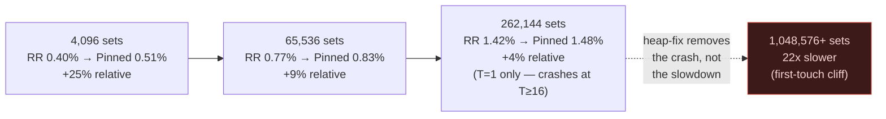
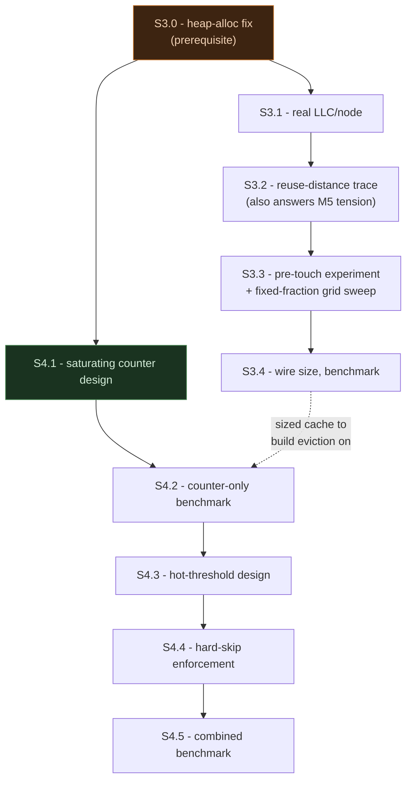

# Week 6 Plan — S3 (Sizing) and S4 (Eviction), Designed Against Today's Real Constraints

This is not a status catch-up like week5plan.md was — Track A finally has real data to build on. 2026-08-26 produced three hard findings that change how S3 and S4 should actually be designed, not just when they get built: a second crash mode distinct from the known memory-init cliff, proof that eviction policy is a real and independent lever, and confirmation that absolute hit rates stay under 2% even at the largest size tested. This plan takes those three findings as given and designs S3 and S4 around them, per [`plan_paper/research_brief_s3_s4_2026-08-26.md`](https://github.com/KathpaliaChirag/Nanopore-project/blob/main/plan_paper/research_brief_s3_s4_2026-08-26.md). No Luna work happens in this document — it's research and design, ready to execute the moment someone picks it up.

> [!NOTE]
> Track B (B1, double hashing) isn't covered here — it's still `⬜ not started` per week5plan.md and out of scope for this brief. Nothing below blocks it; the two tracks stay independent.

## Where things actually stand (2026-08-26, verified and committed)

S2 (4-way set-associative, 4,096 sets) is done, correctness-verified (byte-identical `--output`/`--report` vs. S0), and committed (`75f908e`, `safe/S2.4`). Past that baseline, three real constraints now bound everything S3 and S4 can do:

1. **Two independent hard ceilings on cache size**, not one. A *slowdown* cliff at ~1,048,576+ sets (≥64MB/thread) — first-touch/page-fault cost on a huge `thread_local` array, up to 22× slower. A separate *crash* ceiling at 262,144+ sets (16MB/thread) under multi-threading — segfault (exit 139), independent of total RAM free (16MB × 96 threads ≈ 1.5GB is nothing on a 503GB machine). Both trace back to the same root cause: the cache lives in `thread_local` **static arrays**, and glibc's static-TLS allocation budget is fixed at process start, unrelated to how much heap/RAM is actually available.
2. **Eviction policy is a real, independent lever, and it matters most exactly where capacity is smallest.** A trivial "protect anything hit once" rule lifted hit rate +25% at 4,096 sets but only +4% at 262,144 sets (`kraken2-fresh-bin-s2-pinned`, full data in `plan_paper/command_log.md`'s 2026-08-26 "capacity × eviction-policy experiment" entry). This is measured, not hypothesized — S4 has a validated starting point already.
3. **Absolute hit rates stay low everywhere tested** — 1.42% at 262,144 sets even with pinning, the best config measured. This sits in real tension with the project's own M5 finding (90.7% k-mer reuse) — reuse must be real, but repeats are apparently separated by more distinct intervening minimizers than any tested capacity bridges. Not yet confirmed directly.



Pinning's relative advantage shrinks as capacity grows — smart eviction earns the most exactly in the capacity-starved regime S3 is stuck operating in, given both ceilings above. That single trend line is the real argument for where this week's engineering effort goes (see "Why S4 over S3" below).

---

## Research — the heap-allocated `thread_local` fix

**The pattern.** Replace the static array with a lazily-allocated pointer, wrapped for automatic cleanup:

```cpp
static thread_local std::unique_ptr<S2Entry[]> s2_cache;
static thread_local std::unique_ptr<uint8_t[]> s2_next_way;

static inline void S2EnsureInit(size_t num_sets, size_t ways) {
  if (!s2_cache) {
    s2_cache.reset(new S2Entry[num_sets * ways]);       // value-initializes each entry
    s2_next_way.reset(new uint8_t[num_sets]());
  }
}
```

`S2EnsureInit` runs at the top of `S2Lookup` (or once per `ClassifySequence` call, whichever is cheaper to wire in) — one null-check branch per lookup, allocation only on the very first call per thread.

**Why this removes the crash, specifically.** The crash isn't a RAM problem — it's that a `thread_local` **array** declared at file scope is placed by the compiler/linker into the *static* TLS block, a fixed-size region glibc reserves per thread at process start (the initial-exec/local-exec TLS model, sized before any thread creation, historically small and never re-sized afterward, independent of free memory). A `thread_local` **pointer** is only 8 bytes — that's what goes in the static TLS block. The actual megabyte-scale array lives on the ordinary heap via `new`, which has no such fixed budget; per-thread multiplication there is bounded only by real RAM, which this project's own numbers show isn't remotely the constraint (16MB × 96 = 1.5GB vs. 503GB available). This is a complete explanation, not a guess — it's the same mechanism the audit flagged and command_log's crash entry independently converged on.

**Why no lazy-init race exists here, unlike the textbook version of this pattern.** The classic worry with lazy singleton init — two threads racing to allocate the same shared resource — needs a shared, cross-thread-visible pointer, which is exactly what `thread_local` is not. Each thread's copy of `s2_cache` is private storage; there is no other thread that can observe or write it. No double-checked locking, no atomics, no mutex — the race this pattern usually needs to guard against structurally cannot happen here.

**Why no leak risk that matters in practice.** `unique_ptr`'s destructor runs automatically when a thread's TLS storage is torn down (thread exit or process exit), so cleanup is correct by construction even if it were needed — but note Kraken2's OpenMP worker threads are created once per `#pragma omp parallel` region in `ProcessFiles` and live for the whole classification run, so in practice the allocation happens exactly once per thread per process, same as today's static array, just relocated off the TLS budget.

**What this fix does *not* do:** it removes the crash ceiling, not the slowdown cliff. The first-touch/page-fault cost of a huge array is the same whether that array is `thread_local` or heap-allocated — moving it off static TLS doesn't pre-fault its pages. This is worth being explicit about, because the research brief's framing ("both point at the same underlying fix") slightly overstates it: they're two different mechanisms that happen to share one part of the same fix. The slowdown cliff needs its own mitigation (pre-touching the array outside the timed region, or huge pages) — which is exactly the experiment `verification_report_2026-08-26.md`'s Q4 already recommended and which has **never actually been run** (still listed as outstanding in the 2026-08-26 command log entry). That gap becomes S3.3 below, not a footnote.

---

## Research — S3's sizing formula

**The footprint math, confirmed from real data.** Every measured size point is consistent with `bytes_per_thread = sets × 4 ways × 16 bytes/entry = sets × 64`. 4,096 sets → 256KB/thread; 65,536 → 4MB; 262,144 → 16MB; 4,194,304 → 256MB. This is linear and exact — no guessing needed for the size half of the formula.

**The topology half needs a real number from Luna, not an assumption.** Every benchmark run so far pins `numactl --cpunodebind=0 --membind=0` — a single NUMA node — and Luna is a 2-socket Xeon Platinum 8468 (96c/192t total, 210MB LLC total, per `dorado-kraken-research/CLAUDE.md`). The number that actually matters for sizing is the **per-node** L3 (likely ~105MB if the 210MB splits evenly across 2 sockets), not the whole-machine figure — nothing in this project has confirmed that split with a real topology query yet. **S3.1 is exactly that missing measurement**, not a formality: `lscpu -e`, `/sys/devices/system/cpu/cpu*/cache/index3/{size,shared_cpu_list}` on Luna, done once, before anything downstream trusts a specific LLC-per-node number.

**The formula itself, given both halves:**

```
sets_per_thread = clamp(
    floor_pow2( (fraction × LLC_per_node) / (ways × entry_bytes × thread_count) ),
    min = 4096,
    max = safe_ceiling   # from S3.3's pre-touch experiment, not assumed
)
```

`thread_count` divides in — this is the one piece of "topology-aware" sizing that's already unambiguous from today's data and doesn't need new measurement: the memory-init cliff and the crash both scale with thread count (worse at 96T than 16T, since every thread pays the footprint independently), so a size that's safe at 1 thread can be catastrophic at 96. Any formula that doesn't divide by expected thread count is just wrong, independent of what LLC_per_node or fraction end up being.

**What should `fraction` actually be?** This is the question the brief specifically asks: given the pinning data, should S3 chase maximum LLC-fill, or stay conservative? The data argues for conservative, directly:

- Hit rate is already sub-linear with size (4,096→65,536 roughly doubles it, 65,536→262,144 gives a smaller jump) — bigger sizes buy progressively less.
- The big hash table itself is the dominant LLC consumer at baseline (85–96% miss rate on the two DBs that matter) — every byte the small cache claims is a byte taken from the structure doing most of the real work, at a moment when the small cache's absolute hit rate is still under 2%.
- Eviction policy's relative gain is *largest* at the smallest capacity tested (+25% at 4,096 sets) and shrinks as capacity grows (+4% at 262,144) — so the same 65,536-vs-262,144 jump in raw capacity buys less than swapping round-robin for even the cheapest smarter policy already validated today.

**Recommendation: don't build the full Bandana-style trace-driven simulator this week.** Given the practical size range is now narrow and well-characterized (4,096 to somewhere short of ~1,048,576, bounded by a cliff whose exact location isn't even confirmed yet), a small empirical grid sweep over 6–8 candidate sizes — reusing the pinned/counter binaries S4 is about to build anyway — answers "what size should we pick" more cheaply and just as credibly as a full simulator would. This is the fixed-fraction-of-LLC fallback both week4plan.md and week5plan.md already sanctioned explicitly (not a corner cut) — today's data is the reason to take that fallback as the primary path, not a fallback of last resort.

---

## Research — S4's eviction policy, the next-cheapest increment

**Free bits are actually available, not just theoretically.** `S2Entry` (from `plan_paper/scripts/s2_pinned_patch.py`) is `{ uint64_t tag; taxid_t taxon; bool was_hit; }`. The confirmed 16-bytes/entry arithmetic (`4,194,304 × 4 × 16 = 268,435,456`) only works if `taxid_t` is 4 bytes — which means the struct already carries 3 padding bytes after `was_hit` that nothing uses. **A saturating counter fits in the space already being paid for.** Concretely: replace `bool was_hit` with `uint8_t freq` (0–3, 2 bits used, same 1 byte), so the entry stays exactly 16 bytes — S3's sizing math above doesn't change at all when S4 lands on top of it.

**The mechanism, building directly on today's validated result, not replacing it.** Today's "protect on first hit" rule is the degenerate case of a saturating counter — a 1-bit version that's permanent once set. The natural next increment:

- On hit: `if (freq[way] < 3) freq[way]++` (saturating, one well-predicted branch).
- On insert/eviction: prefer the way with the lowest `freq` (ties broken by the existing round-robin pointer, same fallback as today's pinned variant so it never gets stuck).
- Periodically (e.g. every K inserts per set): halve every `freq` in the set. This is TinyLFU's counter-decay — already named as S4.1's own designated fallback in `week4plan.md`, promoted here from fallback to primary because today's data validates the direction it's approximating.

This is a strictly cheaper design question than the report's original "decayed importance" framing suggested (no floating-point score, no per-entry timestamp) and costs nothing in memory beyond what today's already-shipped pinned variant costs.

**Prior art check, per the brief's ask.** None of this project's four must-cite comparators (`kache-hash`, `MegIS`, `MetaCache-GPU`, `GPMeta` — see project memory) propose an eviction policy for a k-mer cache; they're about bucket placement, memory-tier offload, or GPU hash redesign, not what to evict. That's consistent with `week4plan.md`'s existing framing that S4's *mechanism* is this project's own contribution, grounded in cross-domain literature (LLM inference caching, MoE caching, recommendation-system caching, skew-resistant indexing) rather than genomics-specific prior art — today's research didn't surface anything that changes that framing. The novelty claim holds.

**One thing to verify before relying on "free," not assume.** `sizeof(S2Entry)`/padding layout depends on the actual compiler and `taxid_t`'s real definition, which lives in Kraken2's own headers, not in the patch scripts this sandbox can read. Confirm with a one-line `printf("%zu\n", sizeof(S2Entry))` before building the counter variant — cheap, and removes any doubt about whether the struct silently grew.

---

## Research — resolving the M5-reuse-rate vs. low-hit-rate tension

**The cheap instrumentation the brief asks for is also literally S3.2's own sub-step**, not separate extra work. S3.2 already calls for "capture a real k-mer lookup trace, or synthesize one" — building that trace as a **reuse-distance histogram** answers both questions in one pass: add a thread-local `std::unordered_map<uint64_t, uint64_t>` (minimizer → last-seen lookup index) to a one-off instrumented binary, and on every lookup where the minimizer was seen before, bucket `current_index − last_index` into a log-scale histogram (1–10, 10–100, ..., 1e5+). Aggregate and print at exit, same pattern as today's atomic hit/miss counters.

If the resulting distribution shows most repeat-distances well beyond even 262,144 (the largest clean multi-threaded data point so far), that directly confirms "locality problem, not reuse absence" — repeats exist (matching M5's 90.7%) but arrive too far apart for any capacity in the tested-safe range to catch them. If a meaningful fraction of repeats fall inside the tested range and still aren't being caught, that would instead point at a bug in `S2SetIndex`'s hash-bit selection (uneven set clustering), which would be a materially different, cheaper problem to fix. Either outcome is actionable and cheap to get — this should run before S4's design is treated as settled, not after.

---

## Why S4 gets this week's engineering budget, not S3

The brief asks directly whether the pinning finding should change how aggressively S3 chases size. It should, and the answer is concrete, not a hedge:

1. Pinning's relative gain is largest exactly where capacity is smallest and shrinks as capacity grows — the same engineering hour spent on eviction is worth more at every capacity level than the equivalent hour spent chasing more sets, and worth *most* in the regime (4,096–65,536 sets) that both hard ceilings force this project into anyway.
2. S3's harder open question (the real per-node LLC number, the pre-touch mitigation, the practical safe ceiling) is a measurement problem, not a design problem — it needs one clean topology query and one warm-up experiment, not a new simulator built this week.
3. S4's next increment is free in memory (fits in existing padding) and cheap in compute (one saturating-add branch beyond what's already shipped and measured today).

So: **S3 gets exactly enough design work to pick a defensible, conservative size (S3.0–S3.3 below); S4 gets the deeper engineering investment (the counter, the decay, the pinning threshold).** This is a direct reversal of "grow S2 as far as it'll go" — the data from today argues against that path specifically.

---

## Concrete plan — S3 and S4 sub-steps

Same Design/Measured discipline, same fallback framework, same tag-every-Measured-commit rule as every prior week's plan. S3.0 is new — inserted ahead of S3.1 because today's crash finding makes it a real prerequisite, not because the earlier plan was wrong to omit it (the crash hadn't been found yet when week4/5plan.md were written).

### S3 — LLC-topology-aware sizing

| Sub-step | Type | What it does | If it fails |
|---|---|---|---|
| **S3.0** (new) | Design + Measured | Convert `s2_cache`/`s2_next_way` from static `thread_local` arrays to `thread_local unique_ptr`s, lazily heap-allocated on first use (pattern above). Re-run the 262,144-sets/multi-thread cell that crashed today — confirm it now completes instead of segfaulting. | If it still crashes, the static-TLS diagnosis is wrong — fall back to instrumenting with `pthread_getattr_np`/TLS-size introspection before assuming the fix itself is broken. This blocks S3.4 and any S4 work above 4,096 sets, so don't proceed past it silently. |
| S3.1 | Design | Query Luna's *real* per-node L3 size, associativity, and core-sharing layout (`lscpu -e`, `/sys/.../cache/index3/`) — confirm whether 210MB total actually splits ~105MB/node, don't assume it. | If fine-grained data isn't available, fall back to the flat per-node number `numactl --hardware`/`lscpu` reports directly — still better than the whole-machine 210MB figure, which the pinning invocation never actually exposes the workload to. |
| S3.2 | Design | Build the reuse-distance-histogram instrumented binary (see "Resolving the M5 tension" above) and run it once against `standard_8gb`/`pluspf_103gb` at 32T. This is simultaneously S3.2's own trace-capture requirement and the brief's item-4 ask — one build, two answers. | If a real trace is too slow/heavy to collect at full DB scale, synthesize a smaller one from the same instrumentation run against `sample_targeted` first, sanity-check the shape, then decide if the full-scale run is worth the wall-clock. |
| S3.3 | Design | Two things, not a simulator: (a) run the pre-touch experiment `verification_report_2026-08-26.md` Q4 already recommended and never ran — warm the array outside the timed region, re-run the worst-case cell, confirm whether the slowdown cliff shrinks; (b) grid-sweep 6–8 candidate sizes between 4,096 and wherever S3.3(a) finds the practical safe ceiling, using the already-built pinned/counter binaries, and pick `fraction` in the sizing formula from where the hit-rate-vs-footprint curve visibly knees over. | If the pre-touch experiment doesn't reduce the cliff meaningfully, that rules out first-touch as the sole cause and reopens Q4's steady-state-TLB-pressure alternative — don't force the fixed-fraction heuristic to pretend the cliff is understood; note it as still-open and pick a conservative ceiling well below where the cliff was ever observed. |
| S3.4 | Measured | Wire S3.0's heap fix + S3.1's real LLC number + S3.3's chosen fraction into the sizing formula above, parameterize the cache, benchmark against S2 across the standard DB/thread matrix. | If it measures worse than S2's fixed 4,096, log it anyway (same rule as every prior week) — S4 needs *a* sized cache to build eviction on top of regardless of which config wins on wall-clock alone. |

### S4 — biology-dependent adaptive eviction

| Sub-step | Type | What it does | If it fails |
|---|---|---|---|
| S4.1 | Design | Confirm `sizeof(S2Entry)` is still 16 bytes before touching anything (cheap sanity check, see "one thing to verify" above). Replace `bool was_hit` with `uint8_t freq` (0–3, saturating), add periodic per-set halving (TinyLFU-style decay) at a tunable interval. Sanity-check the decay shape against synthetic access patterns first, no build needed, same discipline as week4plan.md's original S4.1. | If `sizeof` came back larger than 16, the struct isn't what the patch script implies — stop and re-derive the real layout before assuming any bits are free. If no stable decay interval is obvious on paper, start from "halve every 1,000 inserts per set" as a first guess and let S4.2's benchmark be the real answer. |
| S4.2 | Measured | Benchmark the counter-only variant (no separate permanent-pin logic yet) across the same size/thread matrix used for the round-robin/pinned comparison today. Compare against both round-robin and today's binary-pinned baseline at each of the three already-tested sizes. | This is the step today's existing binary-pinned fallback already covers — if the counter variant underperforms plain pinning, that's a real, loggable result (a coarser policy sometimes wins at tiny capacity), not a dead end; keep the simpler pinned version as the interim S4 and revisit decay tuning. |
| S4.3 | Design | Define "universally hot" — a cross-read frequency threshold for *permanent* protection, layered on top of the decaying counter rather than replacing it. | If no clean threshold separates hot from noise in the histogram from S3.2, ship decay-only for now; permanent pinning becomes a later add-on, not a blocker. |
| S4.4 | Design | Make protection a hard skip in eviction candidate selection, same as today's pinned patch already does for the 1-bit case — extend the existing skip logic, don't rewrite it. | If pinned entries still get evicted under load, the skip logic has a bug — fix before touching the benchmark, same as today's diagnose-first discipline. |
| S4.5 | Measured | Benchmark decay + permanent protection together — the number that fills S4's row. Compare against S4.2's decay-only number specifically, not just against S2/round-robin, to catch any regression protection introduces on top of decay. | Regresses vs. S4.2 — keep S4.2 as the safe zone, log the regression honestly, don't quietly drop protection to hide it. Same rule as week4plan.md's original S4.5. |



S3.0 is the one dependency both tracks actually share this week — S4.1's design work doesn't need it (it's a struct change, no benchmark yet), but S4.2's benchmark and any S3.4 config above 4,096 sets both do.

---

## Risk and what stays open

- **S3.3(a)'s pre-touch experiment might not resolve the slowdown cliff cleanly** — Q4's own audit already flagged a plausible two-mechanism story (fixed init cost + a DB-size-dependent capacity effect on `sample_targeted` specifically). Budget for "still partially unexplained" as a real outcome, not a bug in the experiment.
- **The reuse-distance histogram (S3.2) could come back ambiguous** — if repeat distances are spread roughly evenly across many orders of magnitude rather than clustered clearly inside or outside the testable range, that doesn't cleanly confirm or refute the locality theory. Report the actual distribution either way rather than forcing a verdict.
- **`taxid_t`'s real size is currently inferred, not confirmed** — S4.1's `sizeof` check is cheap but necessary before claiming the counter is free.
- **Track B (B1) status is unchanged and out of scope here** — still `⬜ not started` per week5plan.md, independent of everything above.

This document is research and design only — nothing in it has touched Luna yet. The next session picking this up starts at S3.0, the one step that's pure prerequisite engineering with no open design question left to resolve.
