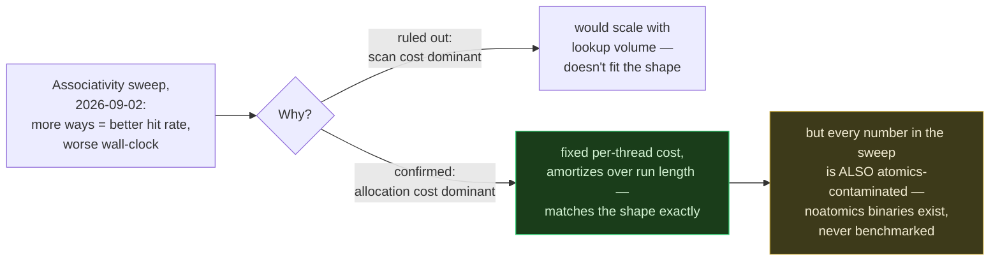
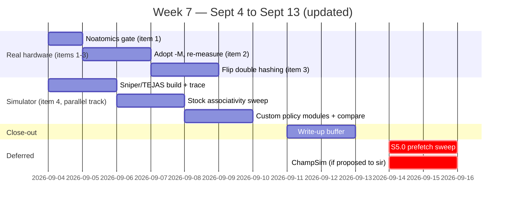

# Week 7 Plan — Close the Confounds, Adopt the Free Win, Bank a Second Number, and Simulate the Fourth

9 days out from the Sept 13 submission (updated 2026-09-04). This started as three items closing already-diagnosed gaps in the real-hardware measurements. It's now four: Kolin sir's 2026-09-04 update — real-hardware profiling has been fine, but go simulator-based going forward, naming Sniper, TEJAS, or ChampSim — directly reopens the associativity case study that was deliberately dropped two days ago. See "Item 4" below for why a simulator changes that calculus. Items 1-3 came out of the 2026-09-02 two-stage research pass (5-agent investigation + 5-agent/5-round debate); full detail in [`plan_paper/research_brief_associativity_case_study_2026-09-02.md`](https://github.com/KathpaliaChirag/Nanopore-project/blob/main/plan_paper/research_brief_associativity_case_study_2026-09-02.md). Item 4 comes out of the 2026-09-04 simulator-selection pass; full detail in [`plan_paper/research_brief_simulator_selection_2026-09-04.md`](https://github.com/KathpaliaChirag/Nanopore-project/blob/main/plan_paper/research_brief_simulator_selection_2026-09-04.md).

> [!NOTE]
> CK's original hypothesis — that a hardware-realistic set-associative cache redesign could vindicate 4-way associativity as a real win — was debated hard on 2026-09-02 and explicitly **not** pursued on real hardware, because the implementation risk (a multi-day C++ rewrite) wasn't worth it for a result likely swamped by the same confounds items 1-3 exist to remove. Sir's simulator directive removes that objection: a simulator has no real thread creation, no real atomics, no real first-touch cost — the confounds don't exist there by construction. Item 4 below is that case study, simulator-based instead of real-hardware-based.

> [!IMPORTANT]
> **Superseded, same day (2026-09-04):** CK reframed this away from the Sept 13 deadline — this is real research, publishable next semester too, optimize for the right answer, not the fastest one. This changes item 4's specifics: **TEJAS over Sniper** (not the reverse — contact Prof. Sarangi's group, no rush needed to skip it), **full hierarchy over single-level** (run single-level first only as a fast sanity check, then the real study), and a **realistically-sized simulation window**, not the tiny truncated proxy below. A new thread was also added: empirically reverse-engineering the real hardware replacement policy on Luna/Orion (currently only inferable from older-chip papers), via a tool like CacheQuery. Full detail in the "Addendum" section of `plan_paper/research_brief_simulator_selection_2026-09-04.md`. Everything below this note describes the *mechanics* (still correct) under the *original* 9-day framing (superseded) — read the addendum first for which knobs to actually turn.

## Where things actually stand (2026-09-02)

The 2026-09-02 associativity sweep (4-way through 64-way, same 4,096 sets, `standard_8gb`/`sample_targeted`/`pluspf_103gb` × T=1/32/96) found something that looked like it needed explaining: raising associativity monotonically improved hit rate (3.58%→27.75%) and cut LLC-miss% (85.9%→54.8%), but made wall-clock time monotonically **worse** — a real win at 4-way (−0.40%) collapsing to a real loss by 64-way (+3.86%, worst case +80% on `sample_targeted`/T=1). Two explanations were on the table and neither had been directly tested: linear tag-scan cost per lookup, or per-thread first-touch/allocation cost.

Today's debate (5 agents, 5 rounds, unanimous) settled the diagnosis: **it's allocation/first-touch cost, not scan cost.** The evidence is the shape itself — the penalty is worst on the shortest run (`sample_targeted`/T=1, nothing to amortize a fixed per-thread setup cost against) and vanishes on the longest run (`pluspf_103gb`/T=32-96, huge amortization denominator). A pure per-lookup scan cost would scale with lookup volume, which doesn't fit that shape at all. This matches this project's own precedent exactly — it's the same amortization mechanism S3.0/S3.3 already found and fixed once, at a different array-size scale.

One more thing surfaced along the way, independent of the associativity question: this project has **never used `--memory-mapping`** in a standard benchmark. It was measured once, in the 2026-08-03 patch session, at up to **12-14x speedup on large DBs** (`pluspf_103gb`: −92.2% at T=32, −93.0% at T=96) — an order of magnitude bigger than anything the cache/associativity work has produced, and it's just a flag. Every number this project has ever reported was measured without it.

---

## This week: four items, in order

### 1. Rebuild + run the noatomics binaries (half a day, no new code)

**Why.** Every cell in the 2026-09-02 associativity sweep used binaries with `std::atomic` hit/miss counters — a mechanism this project separately and independently confirmed causes a real ~2-3x contention artifact specifically on `sample_targeted`. That's the exact same DB showing the sweep's most dramatic number (+80% at 64-way, T=1). Before that number goes anywhere near a paper draft, we need to know how much of it is real allocation cost and how much is a self-inflicted measurement artifact. The fix already exists — `s2_lru_{4,8,16,32,64}way_noatomics_patch.py` and `s2_rr_noatomics_patch.py` are sitting in `plan_paper/scripts/`, written, never built.

**What we do.** Rebuild all six binaries from the noatomics patch scripts, same install pattern as every prior S2 variant (`python3 <patch>.py` → `install_kraken2.sh`). Run the same interleaved 3-round methodology already used for the atomics version, on `standard_8gb`/T=1 first (cheapest, and per the debate, T=1 is where any real change would show most clearly since it's contention-free by construction — comparing T=1 old vs. new tells us directly whether the T=1 baseline itself was ever contaminated). If that comes back clean (numbers close to the atomics version), extend to `sample_targeted`/T=1 and T=32/96 specifically, since that's the DB the debate flagged as most likely to have a real atomics contribution stacked on top of the allocation-cost effect.

**Decision this resolves.** Is the associativity sweep's headline number (the 80% cliff) real allocation cost, real allocation cost plus a real atomics tax, or partly a measurement artifact? Whatever the answer, it needs to be stated with evidence in the paper, not left as "not yet directly instrumented" (today's brief's own honest framing).

**Timebox.** Half a day. This is a gate, not a research project — per the debate, don't chase it into a full `perf record`/page-fault-counter campaign this week. If the noatomics rerun confirms the qualitative pattern (worse at more ways, worst on `sample_targeted`/T=1), that's enough to write up honestly and move on.

### 2. Adopt `--memory-mapping` as the standard baseline (1-2 days)

**Why.** This isn't an optimization opportunity sitting on the shelf — it's closer to a validity gap in the paper as currently scoped. Every benchmark this project has run, including the entire cache/associativity story from S1 through today's sweep, was measured without `-M`. A reviewer who knows kraken2 could reasonably ask why a paper about cache-aware optimization doesn't control for a documented 12-14x memory-mapping effect. Worse, `-M` changes *how the DB gets into memory* (eager mmap-load vs. Kraken2's default lazy load path) — exactly the kind of change that could plausibly interact with the first-touch/allocation-cost story item 1 above is trying to pin down. We need to know this before finalizing which cache numbers go in the paper, not after.

**What we do.** Decide `-M` on as the project's standard flag going forward. Re-run the headline S1/S3/S4 comparison cells (the ones already in `command_log.md`, not a fresh sweep) under `-M`, on all three DBs at T=1/32/96 — this reuses existing scripts, it's a re-run, not new engineering. Specifically check whether the cache's relative contribution (S1's `sample_targeted` speedup, S2/S3/S4's null result on the other two DBs) holds, shrinks, or changes direction once the DB is memory-mapped rather than lazily loaded.

**Decision this resolves.** What does the paper's baseline actually mean? Every subsequent number — including anything decided out of item 1 and item 3 below — should be interpreted against a baseline that includes this flag, not against the project's historical (and now known-incomplete) default.

**Reference numbers already in hand** (2026-08-03 session, `dorado-kraken-research/Luna/experiments/patch/commands_log.md`):

| DB | Size | `-M` savings @ T=1 | @ T=32 | @ T=96 |
|---|---|---|---|---|
| `sample_targeted` | 50MB | ~1% (noise) | ~4% | ~1.5% |
| `standard_8gb` | 8GB | −19.5% | −78.0% | −73.1% |
| `standard_16gb` | 16GB | −26.5% | −84.7% | −82.1% |
| `pluspf_103gb` | 111GB | −55.3% | **−92.2%** | **−93.0%** |

The effect scales with DB size and is negligible on the tiny DB — worth keeping in mind when re-measuring the cache story, since `sample_targeted` (where the cache thesis's one real win lives) is also the DB where `-M` matters least, and `standard_8gb`/`pluspf_103gb` (where the cache is null) are where `-M` matters most.

### 3. Flip double hashing and measure the false-positive-cliff shift (1-2 days, mostly DB rebuild time)

**Why.** This is Thesis 2 work (cell-width reduction + double hashing), not Thesis 1 — deliberately picked as this week's third item precisely because it's orthogonal to the cache-overhead question items 1-2 are about, so it doesn't compete for the same implementation-risk budget. It's already implemented: Kraken2 v2.17.1's `second_hash()` is a complete, working function, currently dead behind a compile-time flag. Confirmed directly in the Makefile: `CXXFLAGS += -DLINEAR_PROBING` (`dorado-kraken-research/Luna/experiments/patch/commands_log.md`, the Makefile grep). Near-zero engineering cost, a real number for the paper, no design risk.

**What we do.** Rebuild `kraken2-src` with `-DLINEAR_PROBING` removed from `CXXFLAGS` (one Makefile line), which re-enables `second_hash()`-based double hashing for the primary hash table's probe sequence. This requires a **DB rebuild**, not just a binary rebuild — the on-disk hash table layout depends on the probing scheme used to build it, so the smallest DB (`sample_targeted`, or the ESKAPE 650MB DB if that's faster to rebuild) should go first. Measure the false-positive rate / probe-length shift this produces, and where possible connect it to the existing cell-width false-positive-cliff formalization from `kraken2opti_report.tex` — this is meant to extend that report's §5 future-work item (b), not start a new line of work.

**Decision this resolves.** Does double hashing measurably shift the false-positive cliff in the direction the analytic model (probe length ~6→~2.5) predicts? This is a standalone, publishable number for Thesis 2 regardless of how items 1-2 land.

### 4. Simulator-based associativity/eviction case study — Sniper or TEJAS (the revived item, ~5-6 days, runs in parallel with items 1-3)

**Why.** Per sir's 2026-09-04 update — he named **Sniper** and **TEJAS** specifically, not a third option — and the same-day comparison (`plan_paper/research_brief_simulator_selection_2026-09-04.md`), this is now the route to answer the question item 1-3's diagnosis couldn't fully settle on real hardware: is 4-way (or any N-way) set-associativity a genuine win once implementation confounds — atomics, first-touch/allocation cost — are removed entirely, not just reduced?

**Architecture clarification (resolved 2026-09-04, same day, after CK flagged the ambiguity):** is S2 part of the hardware cache hierarchy, or separate from it? **Separate** — S2 is application code (a `thread_local` array) sitting in front of the real hash table's `Get()`, not one of the CPU's L1/L2/L3 levels, though its own memory is still subject to real hardware caching like anything else. This means we do **not** need either simulator to invent associativity via its own cache config — **6 real S2 binaries already exist** (`s2_lru_{4,8,16,32,64}way_patch.py`, `s2_rr_patch.py` and their `noatomics` variants). The right move is to run/trace the *real* S2 binary and let the simulator's modeled hardware sit underneath it, not to approximate S2 as a hardware cache level.

**Which one — locked after a 5-agent, 3-round verified debate (2026-09-04, same day): default Sniper, moderate-to-moderate-high confidence (~60-65%, not a clean win), TEJAS as a documented fallback.** Sniper is *execution-driven* (run the real binary directly, no per-variant trace-capture step) and better-maintained/cited, self-serviceable without depending on anyone else. But it's not a clean win: TEJAS's own validation is genuinely tighter and against more recent hardware (11-19% error vs. a 2012 Sandy Bridge machine, vs. Sniper's ~25% error vs. 2006-2008 Core2/Nehalem), and Sniper's own GitHub has several recent (Oct-Nov 2025), still-open issues of people hitting real build/crash failures on the official getting-started path — **budget 1-2 days of build friction, don't assume a clean install.** TEJAS also has a real self-service path even without an introduction (a public Google Group with real traffic), softening but not eliminating its risk. **Action: ask sir today whether he can get fast access to Prof. Sarangi's group. If it lands within a day, TEJAS is a legitimate switch, not a downgrade. If not, go Sniper and don't wait.**

> [!IMPORTANT]
> **Hard constraint found during the debate, not previously budgeted: a full-scale kraken2 run is NOT feasible to simulate in this window, regardless of which tool wins.** Sniper's detailed/interval-simulation mode (the only mode that produces the cache-hit/timing stats this needs) runs at roughly ~1 MIPS — its fast-forward mode (~1000 MIPS) only helps skip past DB-load/warmup, not the classification hot path where S2's behavior actually lives. A real kraken2 run executes on the order of 10^10-10^12+ instructions; at ~1 MIPS that's hours-to-days per variant, not minutes. TEJAS has no fast-forward equivalent at all (trace-driven, full Pin-instrumentation cost for the whole captured region), so this constraint is worse for TEJAS, not better. **The plan must use a deliberately small, explicitly-labeled proxy instruction window** (a few million to low-hundreds-of-millions of instructions of real classification activity — small DB, 1-2 threads, tightly bounded) — stated plainly in any write-up as a proxy/microbenchmark, never as "kraken2 under Sniper."

**Cache model: single level for the core deliverable, 2-level as a scoped, budget-gated escalation — never the full 4-level default hierarchy.** The debate's real disagreement: does S2's growing footprint (4→64 ways) spill from an on-chip level into a slower one, and is that the mechanism behind the real-hardware "more ways, worse wall-clock" inversion? A single flat modeled level can't show that transition at all. But this project's own prior diagnosis (2026-09-02 debate, locked) already identified per-thread first-touch/allocation cost — not spillover — as the leading explanation, so a full hierarchy spends the already-scarce ~1 MIPS budget chasing a secondary question, and it reintroduces exactly the kind of confound (coherence traffic, private per-core cache contention) this whole simulator pivot exists to remove. **Default: single modeled cache level standing in for "the backing store."** If there's spare time: a 2-level model (one fast on-chip level, one slow off-chip level, no coherence/LLC-sharing detail) is the cheapest version that could still show a capacity-threshold signal — run it only for the sharpest real-hardware inversion cell (`sample_targeted`/T=1), not the full 6-variant sweep. If skipped, name the spillover question explicitly as future work in the write-up, don't drop it silently.

**What we do (Sniper path — run the real binary directly, per variant; TEJAS path — same steps but insert a "capture trace via PIN" step before each replay).**
1. Build the chosen simulator on Luna, validate against a stock example/trivial binary first.
2. For each of the 6 existing S2 binaries (4/8/16/32/64-way + round-robin, noatomics preferred to match item 1's confound-free goal): run it under Sniper directly (or trace it via PIN then replay under TEJAS), fast-forwarding past DB-load, then a small explicitly-bounded detailed-mode window over steady-state classification — not a full run.
3. Collect modeled hardware cache-hit/timing stats per variant, sanity-checked against the real-hardware sweep already logged (2026-09-02 entry, `plan_paper/command_log.md`) — same qualitative direction expected on hit rate; the interesting question is whether the simulator's clean, confound-free cost curve still shows the real-hardware "more ways, worse performance" inversion, or whether that was entirely a real-hardware implementation artifact.
4. The 6 binaries already encode round-robin, true LRU, and (if the pinned variant is rebuilt) the abandoned "pinning" policy — no new replacement-policy code needs to be written inside the simulator itself, since the policy comparison is already real C++ code being run/traced as-is.

**Decision this resolves.** Does associativity actually help once every real-hardware implementation confound is gone by construction? A clean "yes" would be the vindication of CK's original hypothesis; a clean "no, still net-negative or net-neutral even in simulation" would mean the hit-rate ceiling (not implementation overhead) really is the limiting factor, closing the question honestly either way — which is itself the point sir is making by asking for simulation now rather than more real-hardware iteration.

**Timebox and sequencing (revised for the throughput constraint).** Days 1-2: build, validate, and size the proxy instruction window on the first S2 variant (the highest-risk step — both getting the simulator working AND bounding the window correctly, not a full run). Days 3-4: run/trace the remaining 5 S2 variants at the same window size, collect stats. Days 5-6: comparison against real-hardware numbers, optional 2-level escalation on the sharpest inversion cell if time remains, write-up of the confound-free result explicitly labeled as a proxy. This runs in parallel with items 1-3, not after them — different machine work, so there's no reason to serialize, though the same person can't literally do both at once; split by whichever of CK's team has bandwidth first.

**Orion note (checked mid-debate, for the record, not part of this week's scope):** only cache *sizes* are confirmed for Orion from NVIDIA's own Technical Brief (64KB L1-I, 64KB L1-D, 256KB L2/core, 2MB L3/cluster, 4MB SLC) — **no associativity/ways number for any level has a verified primary source.** An earlier "L2: 8-way" claim was traced back to a search-tool paraphrase, not anything NVIDIA's document actually states, and was retracted. Don't cite it anywhere. Orion stays out of scope for Sept 13 regardless.

**Not planned unless it changes**: ChampSim was investigated in the same research pass. With the architecture question resolved above (we already have real S2 code, we don't need a simulator to invent associativity), its headline advantage — a built-in plugin for *inventing* replacement policies — matters much less than first thought, and it's no longer clearly better than Sniper technically. It's also not what sir named — don't substitute it for his actual request without checking with him first. It stays logged in the research brief as a fallback to propose, not something to just go build.

---

## What we are deliberately still not doing this week

**S5.0 prefetch batching** — a real, written, never-run experiment targeting a different mechanism entirely (overlapping DRAM latency on the *primary* hash table lookup, not caching in front of it) — stays out of scope. Not because it's low-value, but because the four items above already fill the available time with higher-certainty payoffs, and a fifth open measurement thread risks landing none of them cleanly.

## Carried-over open questions (not this week, logged so they don't get lost)

- **The `sample_targeted` T=32/T=96 LLC-miss anomaly** (LRU-64way's LLC-miss rising *above* round-robin's baseline, the only cell in the whole grid where that happens) — flagged as unexplained, plausibly concurrent-footprint LLC pressure from many large per-thread arrays sharing a socket. Not instrumented. Revisit alongside the deferred SIMD work.
- **S3.2's empirical sweep of `f`** (the LLC-topology sizing formula's safety fraction, currently `0.25`, a placeholder) — still open, not blocking anything this week.
- **Orion (ARM)** — per today's research pass, unreachable and never attempted for this thesis, blocked by an unresolved `-march=sapphirerapids` build coupling. Explicitly not in scope before Sept 13.

## Item 5 (lower priority, deferred, logged 2026-09-04, not scheduled this week)

**CK's second hypothesis on the associativity story: real S2 lookup is a sequential scan, not a parallel comparator.** Here's the gap. Real hardware set-associative caches fire all N ways' comparators at once, so lookup latency barely scales with the number of ways. `S2Lookup`/`S2Insert` (`plan_paper/scripts/s2_lru_4way_noatomics_patch.py:43-66`) don't work that way: they run a plain `for (way=0; way<S2_WAYS; way++)` over an array-of-structs, checking tags one at a time on every call, including misses. That means the 2026-09-02 sweep's "more ways, better hit rate, worse wall-clock" result is at least partly the scan itself getting longer, stacked on top of the allocation-cost effect the same debate already locked in as dominant (see the note above, and `plan_paper/research_brief_associativity_case_study_2026-09-02.md` item (ii): SIMD/SoA fingerprint matching, informed by SwissTable/F14, already evaluated and explicitly dropped for that cycle, "revisit post-Sept-13").

A first cut exists now: `plan_paper/scripts/s2_lru_4way_simd_patch.py`. It replaces the array-of-structs with a SoA (structure-of-arrays) layout: a 1-byte fingerprint per way packed contiguous per set, tag/taxon/last_used in separate parallel arrays. Lookup runs an SSE2 compare across all 4 fingerprints into a match mask before it ever touches the full 64-bit tag. No atomics. It's written, not built, not benchmarked, the same status as every other unbuilt S2 variant in this repo until someone actually runs it on Luna.

**Priority: below item 4, the Sniper/TEJAS simulator case study, which stays the active track per CK's call today.** Why it waits: item 4 answers the same underlying question, is associativity a real win once implementation confounds are gone, more cleanly than this does. A simulator removes the confound by construction. A hand-rolled SIMD rewrite would still need its own correctness verification before you could trust a number out of it. If item 4's result comes back ambiguous, or shows something worth cross-checking on real silicon, this is the natural follow-up: build it, benchmark it against the existing noatomics AoS variants, and fold it into the case study's three-way comparison (S0 vs. AoS-simulated vs. SIMD/SoA) already sketched in the research brief's step 5.
