# Track A Progress — Briefing for Sir

Two weeks since Meeting 11. Six build stages, three real bugs found and fixed, one of our own results reversed by better evidence, and one lever we haven't measured yet. Written as if speaking directly to you in the meeting — here's exactly what we did, why, and what it found.

## Where we left off

At Meeting 11 (2026-08-19) you locked scope to three pieces on top of base Kraken2, aimed at a paper submission around **13 September 2026**: the LLC-adaptive cache, the bitmask cell, and cell-width reduction (already published). We split that into Track A (the cache) and Track B (bitmask + double hashing), and you asked us to finish Track A completely before starting Track B. That's exactly what the last two weeks were.

> [!NOTE]
> We can't find a record of the 2026-08-26 meeting this was supposed to report back at. If it happened, tell us and we'll reconcile the notes. If it didn't, this is the first time all of this is reaching you at once — which is also why this document is longer than usual.

## The shape of the two weeks, in one diagram

```mermaid
flowchart LR
    S0["S0 — rebaseline\non fresh v2.17.1"] --> S1["S1 — found & extended\nan existing 1-slot cache"]
    S1 -->|"no benefit on the\nDBs that matter"| S2["S2 — built the\n4-way cache you asked for"]
    S2 -->|"looked like no benefit"| AUDIT{{"5-agent audit"}}
    AUDIT -->|"found a wiring bug —\nruled out, real cause was capacity"| S2F["S2 verified correct\n+ eviction test: +25% hit rate"]
    S2F --> S3["S3 — crash fix +\nsizing formula + slowdown fix"]
    S3 -->|"real null result,\nfully explained"| S4["S4 — found a real\nhashing bug, fixed it"]
    S4 -->|"8.9x hit-rate win,\nbut reverses the +25% result"| PIVOT{{"7-agent pivot debate"}}
    PIVOT --> S5["S5 — prefetch-batching\nported and merged"]
    S5 -->|"patch + sweep built"| NEXT["not yet run on Luna —\nthis is what's next"]
```

The honest one-line version: **we did not walk in a straight line to a finished cache.** We found real bugs at almost every stage, one of our own headline results turned out to be an artifact and we caught it before building more on top of it, and the strongest lever left standing hasn't been measured yet. That's the actual state, stage by stage below.

## Stage by stage

### S0 — rebaselining before anything else

Our old numbers (the 4.405s figure from the cell-width report) were measured on Kraken2 **v2.1.3**. Before writing any cache code, you'd already told us to build on current upstream instead — **v2.17.1** — so we re-cloned, re-checked that decision knowingly (v2.1.4 rewrote the exact parser code this project profiles, so the old number and the new tree aren't comparable), and re-measured a 3-database × 5-thread sweep. New anchor: `sample_targeted` at 32 threads, **0.576s** (was 4.405s under the old version/config — not a real speedup, a different baseline). 32–64 threads is still the practical sweet spot on the new tree, same as before; 96 threads is measurably worse everywhere.

### S1 — Kraken2 already had a 1-slot cache; we just extended its memory

Before writing anything new, we found stock Kraken2 already caches one thing: if the *immediately preceding* minimizer is identical to the current one, it skips the lookup. It has zero memory beyond that single preceding value. We promoted it to `thread_local` storage so it remembers across every read a thread ever processes, not just the last one.

**Result — a real, honest null on the databases that matter:** on `standard_8gb` and `pluspf_103gb` (88–96% cache-miss databases — the ones an adaptive cache actually needs to help), LLC-miss% and wall-clock were statistically flat, no measurable benefit. `sample_targeted` showed a real 5–13% speedup with no corresponding cache-metric change — real, but unexplained, and not claimed as a caching effect.

This is why S2 exists: a single slot's odds of matching the *next* lookup shrink toward zero once a database has millions of distinct minimizers. That's not a guess — it's what S1 just measured.

### S2 — the 4-way set-associative cache you asked for, and the audit that caught a real wiring bug

Built exactly to spec: 4,096 sets × 4 ways, thread-local, ~256KB/thread. First read: **no benefit** — LLC-miss% differences vs. S0/S1 all within ~0.5 percentage points, no consistent direction.

We didn't take that at face value. We ran an **independent 5-agent/3-round verification audit** from a fresh session with no prior context, specifically to check our own claims before building further on them.

> [!IMPORTANT]
> The audit found `S2Lookup`/`S2Insert` were wired *inside* S1's "skip if identical to the immediately-preceding minimizer" check, not standing in front of every lookup the way "sir's baseline" implies. It also found zero internal hit/miss instrumentation existed — every prior conclusion rested on external wall-clock/LLC-miss proxies that can't tell "the cache rarely hits" from "the cache never gets a chance to." And it found real classification correctness had never actually been checked — every benchmark up to that point used `--output /dev/null`.

We tested all three, on a separate standalone binary built specifically to check them — not by taking the audit's word for it, and not yet by patching the real tree either. Results:

- **The nesting bug wasn't why S2 showed no benefit — but it's still sitting in the committed code.** We built a standalone variant with S2 wired directly in front of every lookup (no S1 layer first) to test it. Un-nesting changed nothing, statistically, on `standard_8gb`/`pluspf_103gb`. The real cause is capacity: hit rate measured **0.40% on `standard_8gb`, 0.14% on `pluspf_103gb`/`sample_targeted`**, flat across every thread count. Because the fix didn't matter for the result, we never merged it — `safe/S2.4` and everything S3/S4/S5 are built on top of still has S2 nested inside S1's gate. Worth fixing before this goes in a paper, even though it's now a documentation/cleanliness issue rather than a live bug affecting our numbers.
- **Correctness verified, on the real committed tree.** Real classification output and the summary report came back byte-for-byte identical to the uncached baseline.
- **Eviction policy turned out to be a real, independent lever.** We tested one change — protect any entry that's been hit at least once, instead of evicting round-robin — and hit rate went from 0.4035% to 0.5050%, a **+25.2% relative gain**. One caveat worth stating plainly rather than leaving implicit: the "protected" variant's cache entry grew from 16 to 24 bytes (the extra bookkeeping byte), so this isn't a perfectly like-for-like capacity comparison — same set/way count, ~50% more memory per entry. It doesn't change the reversal finding below, but it's not a clean isolated variable either. That result is the reason S4 (eviction) exists as planned work.
- **A size sweep found a genuine crash, not just a slowdown.** At 262,144+ sets under multi-threading, the binary **segfaults** — a different failure mode from an earlier-found slowdown at 1,048,576+ sets. 16MB/thread, trivial in absolute RAM terms, crashing hard the moment OpenMP spins up multiple threads at once — this pointed at glibc's static thread-local-storage limit, not a memory shortage.

The audit's other findings — worth naming because they're the kind of thing that should surface before results go in a paper, not after: a stale doc claim in the audit's own setup brief, a ~5.5-hour timestamp drift in our own logs (ordering reliable, literal clock labels weren't), and this being the second consecutive week we'd missed our own stated target. All fixed or accounted for.

### S3 — fixing the crash, building a real sizing formula, and a null result we can fully explain

A second **5-agent/3-round design debate** (on top of the audit) shaped this stage before we touched Luna. It corrected two assumptions we'd have otherwise built on: the cache entry's real size is exactly 16 bytes with zero padding (not the value we'd assumed), and Luna's real per-socket L3 cache is **~105MB, not 210MB** — 210MB is the *two-socket* sum, and every benchmark runs pinned to one socket. It also independently confirmed — across the four closest comparator tools we know of (kache-hash, MegIS, MetaCache-GPU, GPMeta) — that **none of them implement any eviction policy for a k-mer lookup cache**. That's a real, citable gap, not just our framing of one.

Before writing the fix, we confirmed the crash mechanism directly rather than trusting the theory: a thread's default stack is 8MB; the crashing array is 16MB — literally twice a thread's entire stack budget before any other arithmetic. And we confirmed the real per-socket LLC directly via `lscpu` rather than continuing to assume it: **105 MiB per socket**, no Sub-NUMA Clustering enabled, exactly matching the corrected assumption above.

Three fixes landed:

| Step | What it fixes | Result |
|---|---|---|
| **S3.0** | The crash (static thread-local array competing with thread stack budget) → heap-allocated pointer, lazily initialized per thread | Crash-free at 16T/32T/96T, correctness unchanged, tagged `safe/S3.0` |
| **S3.1/S3.2** | Fixed 4,096-set size → a real formula, `N_sets(T) = f × 105MiB ÷ (4 ways × 16B × T)`, scaled by live thread count | Sizes correctly from 262,144 sets at T=1 down to 4,096 at T=96; `f=0.25` is a placeholder, not yet empirically tuned |
| **S3.3** | A separate slowdown (eager sentinel writes defeating the OS's normal lazy-zero-page optimization) → zero-valued sentinels + `calloc` | Real **~2× wall-clock / ~3× cache-miss** improvement on top of S3.0, measured at forced 4,194,304 sets |

**An honest correction to our own earlier framing:** our original 2026-08-26 number (22× slower, 85% LLC-miss at the largest size) was measured on the *pre-S3.0* build — the static-TLS-array bug, which turned out to have its own, worse per-thread-creation cost. **S3.0 alone had already eliminated almost all of that slowdown; S3.3 is a smaller, real, additional fix on top, not an independently-stacking second factor.** We're flagging this ourselves rather than letting the bigger, wrong number stand.

**S3.4 — the full benchmark, and a real null result.** 3 databases × 6 thread counts × 3 binaries (no cache / fixed-size cache / fully-fixed dynamic cache), low noise throughout (CV mostly under 1%). **No configuration shows a measurable wall-clock difference anywhere.** Why, precisely: the sizing formula is deliberately conservative — at the thread counts that matter (32–96T) it never asks for anywhere near the sizes where S3.0/S3.3's bugs lived. The crash and slowdown fixes are real, necessary correctness work — they unblock safely exploring larger sizes later — but they were never going to show up as a performance win in this specific test, and now we know exactly why instead of guessing. S3 is complete.

### S4 — a real hashing bug, an 8.9× fix, and a result that reversed itself

**The diagnostic that found it:** a per-set occupancy counter, run against `standard_8gb` at T=1. The bug: `S2SetIndex` picked a cache set with a raw bit-mask on the minimizer — no mixing at all. Result: one set absorbed **225× the average load** (max/mean = 225.42 across 4,096 sets); at least one set was never touched.

**The fix:** mix the minimizer through Kraken2's own `MurmurHash3` — already declared and used elsewhere in the codebase — before masking. One line changed.

| | Old hash (raw mask) | Fixed hash (MurmurHash3) |
|---|---|---|
| Hit rate, 4,096 sets | 0.4035% | **3.5758%** (8.9×) |
| Occupancy max/mean | 225.42 | 3.95 |

Ported into the real tree, byte-identical correctness, crash-free at 16T/32T/96T. **Still no wall-clock win** — the extra hits are still only ~3.2% of the total lookup stream, under the noise floor. One real secondary signal: `sample_targeted`'s LLC-load-miss% dropped a consistent ~30% relative amount, too small a slice of total runtime to move end-to-end time.

> [!IMPORTANT]
> **The reversal.** We re-ran the exact "protect any entry hit once" eviction test from the S2 stage, on the now-correctly-hashed cache. The earlier **+25.2% relative** hit-rate gain from eviction policy flips to **−3.9%** on the fixed hash. The original win was the eviction rule rescuing lookups from a handful of catastrophically overloaded sets — a broken-hash artifact, not a real property of eviction policy. We caught this before sinking more engineering time into the next planned step, a saturating-counter design built directly on that now-disproven basis.

We ran this finding through a **7-agent debate plus a coordinator cross-examination** before deciding what to do next. What it concluded:

- **If eviction work continues at all**, two genuinely new ideas are worth trying — not refinements of the disproven "protect what's been hit" family: **pseudo-LRU** (the literal mechanism real hardware caches use at this exact 4-way associativity), and **admission control** — gate what gets *let into* the cache in the first place, not just what gets evicted. Two independent pieces of evidence point at admission control specifically: our own reuse-distance data (81% of repeats arrive 10,000–1,000,000 lookups apart — far beyond what any 4-way capacity survives, so victim-selection sophistication has a hard ceiling regardless; measured on `standard_8gb` at T=1 only, not yet confirmed to generalize to the other databases or to real thread counts), and a separate, real measurement on a different branch of this project showing 63.4% of distinct minimizers appear exactly once — "the junk is already inside by the time you're choosing what to evict."
- **One more capacity re-sweep is worth running** (fixed hash, raised size clamp, low thread counts) — cheap, closes a real gap, but expect no wall-clock payoff: the thread counts that matter for production are already tested post-fix and came back null.
- **Pivot toward making the lookup itself faster, as an addition to Track A** — this is S5, below.
- **Real, unresolved disagreement** on how fast to fully close out Track A engineering (estimates ranged from 1–2 days to ~3 days to "don't force a pivot at all") and on whether today's evidence is the right category of information to weigh against your own standing sequencing instruction. We're reporting that honestly rather than picking one ourselves — it's a call for you, not something more research settles.
- **A stale line in our own docs**, caught in the same pass: `dorado-kraken-research/CLAUDE.md` still says the old optimization patch was never applied — it was, back on 2026-08-03, real but modest, and already banked. Needs a one-line fix, unrelated to anything else here.

### S5 — prefetch-batching, ported and merged, not yet measured

A collaborator on this project (Chirag Suthar) independently built software prefetching directly on `CompactHashTable::Get()` — batching lookups so the CPU has multiple outstanding memory requests in flight instead of one at a time. We adapted his patch onto our tree.

**This was a real merge, not a flag-flip.** His patch re-declares the same variables S1 already promoted to `thread_local` — applied blindly, it would have silently undone S1's fix. We reconciled it by hand: kept S1's persistent state, added his prefetch batching alongside it, and as a bonus removed a duplicate hash computation, since his prefetch pass and our S4 hash-mix fix both needed the same `MurmurHash3` call.

**What we're deliberately not doing:** citing his numbers as ours. His own measurements disagreed with each other across three same-day documents on the same nominal experiment — −11.77%, −5.99%, and −20.34% — traced to a documented turbo-frequency artifact on his desktop machine (the same binary measured 1.85s and 2.90s in the same 20-run batch); a cooldown protocol corrected this to −20.34% as the most trustworthy of the three. And his machine, database, and codebase all differ from Luna's in ways that compound (16MB cache vs. our 105MB/socket; his test database behaves like our smallest one, not the two that actually bottleneck; an unmerged fork). The mechanism has real, convergent design support — an idea our own project sketched independently back in May and shelved — but the real number has to come from Luna.

**Where it stands right now: built, not yet run.** The patch and a full DB × thread × batch-size sweep script are both committed. **Zero numbers exist yet.** This is the top item on our list for the next Luna session.

## The rigor behind it

Four structured multi-agent reviews ran across these two weeks, each independently, each catching something real:

| Review | Format | What it caught |
|---|---|---|
| S1/S2 verification audit (08-26) | 5 agents, 3 rounds | The S2 nesting bug, missing correctness checks, missing instrumentation, a false claim in its own setup brief |
| S3/S4 design debate (08-27) | 5 agents, 3 rounds | A wrong cache-entry-size assumption, the 210MB→105MB/socket LLC correction, confirmed the eviction-policy prior-art gap, flagged hash-mixing as a prerequisite to check before eviction tuning — which is exactly what S4.0 found |
| Two-thesis strategy debate (08-30) | 5 agents, 3 rounds | Confirmed B2 doesn't need B1 at the source-code level; found the real cost of B1 was underestimated; found the ESKAPE panel ceiling is structural, not a data-loss bug |
| Track A pivot debate (08-30) | 7 agents + coordinator | The S4.1 basis reversal's implications, the prefetch-batching recommendation, a stale patch-status doc claim, and an honest 3-way disagreement on pace |

Every fix a review recommended was actually executed and re-verified before we built the next thing on top of it — that loop, not just the count of bugs found, is the part we'd want you to take away from this section.

## Track B — where it actually stands

**Zero Luna commits, by your explicit sequencing instruction, not by neglect.** Two corrections worth putting in the written record before any of it starts:

1. **B2 (the bitmask cell) does not need B1 (double hashing) first** — confirmed at the source-code level, not by analogy. Kraken2's real lookup function keeps "which cell to probe next" and "what's stored in a cell" as genuinely separate code paths. B2 was also your literal, most-recently-stated ask at Meeting 11; double hashing wasn't named there at all, only in the older report's future-work list.
2. **B1 is real work, not a flag flip.** We'd previously understood `second_hash()` as a complete, working implementation sitting dead behind a build flag. It isn't — it's a stub, hardcoded to `return 1`. Turning it on needs a real second hash function written, plus a full database rebuild to test against real data (the current linear-probing flag is baked in at DB build time, not just at query time). Smaller than designing a new probing scheme from scratch, but bigger than a recompile.
3. **The ESKAPE panel is capped at 4 of 6 species, structurally.** Only four of the six named panel members were ever downloaded — this predates and is separate from the two database files that later went missing from disk. Any bitmask-cell writeup should say "4-organism panel," not 6, unless we source the other two first.

## What's running right now, and what's next

1. **Run the S5.0 prefetch sweep on Luna.** Built, not yet measured — the strongest single lever the pivot debate identified, and the only piece of this report with a real number missing.
2. **The Q2 capacity re-sweep** (fixed hash, raised clamp, low thread counts) — half a day to a day, closes a real gap, no wall-clock surprise expected.
3. **Commit `plan_paper/track_a_pivot_debate_2026-08-30.md`** — the record of the decision to pivot toward S5 is still sitting uncommitted.
4. **Fix the stale `kraken2_opt_v1.patch` line** in `dorado-kraken-research/CLAUDE.md:151`.
5. **B2.1 (the bitmask math)** can start in parallel — zero Luna dependency, zero cost regardless of how the pace question below resolves.

## What we're asking you to decide, sir

1. **Pace:** how much more Track A engineering time is appropriate before we move the bulk of our remaining ~12 days to Track B? The pivot debate found real disagreement among itself on this (1–2 days / ~3 days / no forced pivot) and explicitly flagged it as your call, not something more research settles.
2. **Scope:** is double hashing (B1) required scope for the paper, or a stretch goal? You named three items at Meeting 11 and double hashing wasn't one of them — worth confirming before we commit real engineering days to it.
3. **ESKAPE panel:** report the bitmask work as a 4-organism result, or is it worth the time to try sourcing the other 2 species first?
4. **The prefetch spike:** we'd like to spend 2–3 Luna days running S5.0 to a real number. Given the runway left, does that get the time?
