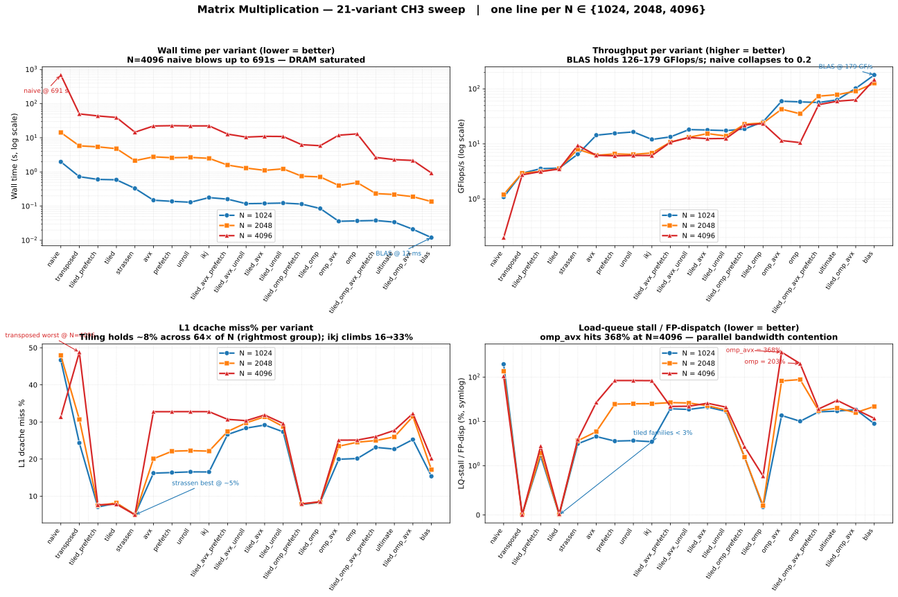

# Report — Executed Work Log

This file tracks everything actually run, tested, or completed.
Full phase details live in [`reports/phase1_dummytesting_dorado_kraken2.md`](reports/phase1_dummytesting_dorado_kraken2.md).

---

## Phase 1 — Dorado GPU Profiling

> Full run data, tables, and commands: [phase1_dummytesting_dorado_kraken2.md](reports/phase1_dummytesting_dorado_kraken2.md)

### Phase 1a — Dorado Fast Model (nsys)
- Compute-bound: `beam_search` 26%, GEMM 17%, LSTM 23% = **84.5% GPU time**
- Memory transfers large and regular (~1.28 MB/call) — not a bottleneck
- CPU blocks 98.4% of CUDA API time on `cudaStreamSynchronize` → GPU is the pacing unit
- **Cache verdict:** Signal-to-base cache saves <5% runtime — wrong target

[→ Full Phase 1a](reports/phase1_dummytesting_dorado_kraken2.md#phase-1a--dorado-fast-model-gpu-profiling-nsight-systems)

### Phase 1b — Dorado HAC Model (nsys, 2.69× slower than fast)
- `cutlass::LstmKernel` alone = **69.8% of all GPU time** (vs fast model's simpler LSTM at 23%)
- HtoD calls 14× more fragmented than fast (128K vs 9K) but still not bottleneck
- CPU sync time rises to 99.1% — HAC keeps GPU busier than fast

[→ Full Phase 1b](reports/phase1_dummytesting_dorado_kraken2.md#phase-1b--dorado-hac-model-gpu-profiling-nsight-systems)

### Phase 1c — Optimization Analysis
- CUTLASS already implements tiling, blocking, Tensor Cores internally — textbook opts already done
- Realistic targets: **INT8 quantization** (~2× on Tensor Cores), **beam search rewrite** (26% of fast GPU time)
- Larger `--batchsize` (128/256) is a free 10–30% gain

[→ Full Phase 1c](reports/phase1_dummytesting_dorado_kraken2.md#phase-1c--dorado-optimization-analysis)

### Phase 1d — CPU vs GPU (35× speedup)
- CPU bottleneck: tensor gather/index (5.7%), serial `cat_serial_kernel`, **~10% cycles in page faults**
- GPU wins via FP16 Tensor Cores + parallel LSTM; no allocation overhead
- `beam_search` is the consistent bottleneck on **both** CPU and GPU — will dominate as NN gets faster

[→ Full Phase 1d](reports/phase1_dummytesting_dorado_kraken2.md#phase-1d--cpu-vs-gpu-comparison-dorado-fast-model)

### Phase 1e — CPU vs GPU Scaling (200 / 400 / 600 MB)
- Both scale ~linearly; CPU ≈ 1.7 s/MB, GPU ≈ 0.055 s/MB
- Speedup widens 24×→31× with file size — GPU amortizes fixed startup cost over more reads

[→ Full Phase 1e](reports/phase1_dummytesting_dorado_kraken2.md#phase-1e--cpu-vs-gpu-scaling-across-file-sizes-dorado-fast)

### Phase 1f / 1g — Re-profiling Post Ubuntu Reinstall
- Fast (_15.pod5): 44.95 s, 30,275 reads — kernel distribution **identical** to Phase 1a ✓
- HAC (_15.pod5): 116.6 s, 30,275 reads — LstmKernel 70.0% **confirmed** ✓
- `LD_PRELOAD=/tmp/fake_tty.so` required under nsys on Ubuntu 26.04 to restore Dorado progress bar

[→ Full Phase 1f/1g](reports/phase1_dummytesting_dorado_kraken2.md#phase-1f--dorado-fast-model-re-profiling-post-ubuntu-reinstall)

---

## Phase 2a — Kraken2 CPU Profiling (gprof)

> Full run data, tables, and commands: [phase1_dummytesting_dorado_kraken2.md § Phase 2a](reports/phase1_dummytesting_dorado_kraken2.md#phase-2a--kraken2-classification--gprof-profiling)

- **`CompactHashTable::Get()` = 80.65% of all CPU time** — random k-mer lookups into 8 GB DB
- 8 GB DB >> 16 MB L3 → every lookup is effectively a DRAM access (~100 ns stall)
- 93% reads classified; 30,362 reads in 42.2 s = 43.2K reads/min
- Unlike Dorado, Kraken2 is **memory-bound** — a Hot-K-mer LRU cache directly targets the dominant bottleneck and could reduce runtime 40–60%

## Phase 2a (cont.) — Kraken2 perf Profiling & K-mer→Taxon Associativity Table

> Full details: [kraken2_perf_lru_cache.md](reports/kraken2_perf_lru_cache.md)

**Date:** 2026-05-29 — follow-up to Phase 2a gprof, using `perf stat -d -d` + TMA + mpstat.

- **BE-Bound 95.6%, IPC 0.16, Cache-Miss 24%** — pipeline stalled on DRAM ~94% of the time; only 3% of slots do real work
- Cache-Miss% is a 16-thread aggregate, not per-core
- **`-pg` flag costs ~18% CPU** (`_mcount` + `__mcount_internal` + `mcount@plt`) — removing it from `Makefile` is a free ~18% speedup
- `CompactHashTable::Get()` appears at only ~1% in perf record due to `-pg` sampling distortion — gprof's 80.65% is the correct figure
- **K-mer→Taxon associativity table:** 4-way set-associative, 512 KB per thread (8 MB total across 16 threads — fits in 16 MB L3); maps minimizer (64-bit) → taxon ID (32-bit); LRU keeps hot k-mers from common organisms resident; expected to drop Cache-Miss% from ~24% to ~10–15% and cut wall time 20–40%

[→ Full details](reports/kraken2_perf_lru_cache.md)

---

## Phase 2b — Matrix Multiplication 21-Variant CH3 Sweep (N=1024, N=2048, N=4096)

**Date:** 2026-05-28
**Workload:** Square C = A·B (doubles), 21 implementations spanning tiling / OpenMP / AVX2 / prefetch / unroll + OpenBLAS, transposed, and Strassen references.
**Tools:** `perf stat` (basic, AMD cache, 5-run stability, full diagnosis).
**Raw outputs:** `results/pfz_batch1/ch3_perf_stat_N{1024,2048,4096}/` — 84 perf_stat files per N.

Three detailed per-N reports live in `matrix_mul/`:

- [`report_n1024.md`](matrix_mul/report_n1024.md) — N=1024 (24 MB total, fits L1 row-wise; tiling has nothing to add)
- [`report_n2048.md`](matrix_mul/report_n2048.md) — N=2048 (96 MB total, 6× L3; DRAM traffic begins, OMP bandwidth contention starts)
- [`report_n4096.md`](matrix_mul/report_n4096.md) — N=4096 (384 MB total, 24× L3; naive takes 11.5 min, `omp_avx` LQ-stall = 368%)

### Visual Summary

*x-axis: 21 variants sorted slowest→fastest (left to right). One line per N value. Panels: (top-left) wall time log-scale, (top-right) GFlops/s log-scale, (bottom-left) L1 dcache miss%, (bottom-right) load-queue-stall / FP-dispatch (symlog). PNG version also available: [`matmul_summary.png`](matrix_mul/matmul_summary.png).*

Headline cross-N summary (best of 21 vs naive):

| N | naive | best hand-written | BLAS | naive→BLAS |
|---|---:|---:|---:|---:|
| 1024 | 1.982 s | `tiled_omp_avx` 0.021 s, 102 GFlops/s | 0.012 s, 179 GFlops/s | 165× |
| 2048 | 14.262 s | `tiled_omp_avx` 0.189 s, 91 GFlops/s | 0.136 s, 126 GFlops/s | 105× |
| 4096 | 691.171 s | `tiled_omp_avx` 2.173 s, 63 GFlops/s | 0.933 s, 147 GFlops/s | **741×** |

Key findings (across all N):
1. **Tiling's L1 miss% is N-independent at ~8%** across 64× of N scaling — exactly its design intent.
2. **But ikj's L1 miss% climbs from 16.5% → 33%** as N grows; tiled never beats ikj wall-clock on this hardware because tiling has 6× the instruction count.
3. **Naive's failure mode changes with N:** L3-latency-bound at N=1024 (LQ stall = 196.7%) → mixed at N=2048 (137%) → DRAM-bound at N=4096 (106%, IPC = 0.041).
4. **OMP develops a new failure mode at N=4096:** `matmul_omp_avx` LQ-stall/FP-disp = **368%** — parallel-amplified DRAM bandwidth contention exceeds even single-threaded naive.
5. **BLAS lead widens with N:** 1.75× → 1.39× → 2.33× over my best hand-written variant.
6. **Strassen finally shows O(N^2.807)** at N=4096 (6.81× per N-doubling vs ideal 8×), but absolute time still 15× slower than BLAS.

See per-N reports for full tables (CH3-A wall/IPC/GFlops, CH3-B cache, CH3-C stability, CH3-D LQ-stalls, CH3-E parallel efficiency — all with exact-precision numbers for all 21 variants).

---
