# matrix multiplication: benchmark report

matrix multiplication computes C = A x B via N^3 multiply-add operations. for each of the N rows of A, you walk all N columns of B, so every element of B gets touched N times total. the bottleneck is almost never the arithmetic itself. it's memory: if you traverse B in the wrong order, you cause a cache miss (the CPU has to fetch a new 64-byte block from a slower level of memory) on nearly every access. a bad access pattern means the CPU spends most of its time waiting, not computing.

WSL2 (Windows Subsystem for Linux 2) is a virtualised Linux environment running inside Windows via Hyper-V. wall-clock times on WSL2 are accurate. its IPC (instructions per cycle, a measure of how fully the CPU pipeline is occupied) is not accurate, because Hyper-V throttles the hardware cycle counter to about 7-23% of the real rate. Luna is a bare-metal Xeon server at IIT Delhi and gives accurate hardware readings.

---

## setup

| field | WSL2 | Luna |
|---|---|---|
| machine | AMD Ryzen 7 5800H, 8 cores | Intel Xeon Platinum 8468, dual-socket |
| L3 cache | 16 MB | 105 MB |
| RAM | 14 GB | 503 GB |
| OS | WSL2 kernel 6.6.87.2 | native Linux |
| compiler | GCC 15.1.0 with `-O3 -march=native -funroll-loops` | same |
| AVX2 variants | additionally `-mavx2 -mfma` | same |
| matrix dtype | `double` (64-bit float, 8 bytes/element) | same |
| threads | `OMP_NUM_THREADS=4` | same |
| sizes tested | N = 1024, 2048, 10000 | same |

**memory cost.** three N×N double matrices (A, B, C) total 3 × N^2 × 8 bytes. at N=1024 that is 24 MB, larger than the Ryzen's 16 MB L3. the Xeon's 105 MB L3 holds the N=1024 working set entirely. at N=2048 (96 MB) both machines start spilling to DRAM. at N=10000 (2.4 GB) all tests are fully DRAM-bound.

**variants tested (12 total):**

| label | what it does |
|---|---|
| `naive` | triple loop `ijk`, accesses B column-by-column |
| `ikj` | reordered loop `ikj`, B-row access sequential |
| `kij` | outer-k loop, A element held in a register |
| `transpose` | pre-transposes B so both A and Bt are read row-by-row |
| `tiled` | 64x64 cache blocking (sub-matrix that fits in L2, ~96 KB for three tiles) |
| `omp` | OpenMP 4-thread parallelism on basic `ikj` |
| `omp+tile` | OpenMP + 64x64 tiling combined |
| `unrolled` | 4x manual loop unrolling to expose ILP (instruction-level parallelism, running independent ops simultaneously) |
| `AVX2` | explicit AVX2 FMA (4-wide vector: processes 4 doubles per CPU instruction) |
| `auto-vec` | compiler auto-vectorisation with `-O3 -march=native` |
| `tile+AVX2` | tiling + AVX2 combined |
| `prefetch` | manual `__builtin_prefetch` call inserted per inner-loop iteration |

tile size: 64x64 was chosen because three tiles (A, B, C sub-blocks) = 3 × 64 × 64 × 8 = 96 KB, comfortably within the 2 MB L2 on both CPUs. a 32x32 tile variant was also tested and ran 13-20% slower (24 KB per tile, less L2 reuse per tile visit).

---

## execution time, WSL2

**what it means:** wall-clock time for the full computation. log scale is used because `naive` is 25-48x slower than the best variant, and a linear scale would make everything else invisible.

### N = 1024

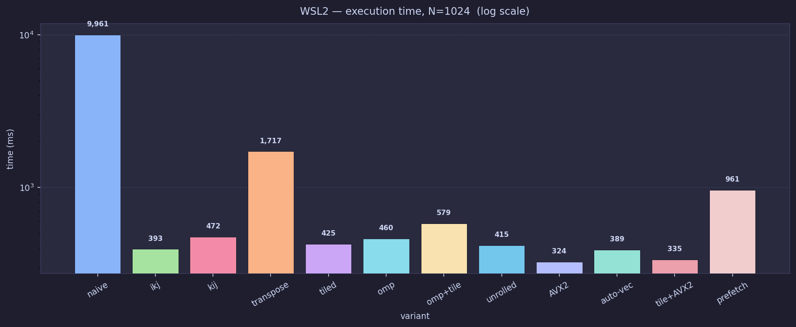

at N=1024 on WSL2, `AVX2` at 324 ms and `tile+AVX2` at 335 ms are nearly tied within 3.4%, a margin too narrow to declare a winner from a single run. `naive` costs 9,961 ms, a 30.7x gap from `AVX2`. on Luna (bare metal), `tile+AVX2` at 220 ms beats `AVX2` at 330 ms by 50%, the ranking is hardware-dependent at this size. `ikj` at 393 ms on WSL2 (334 ms on Luna) proves that a single loop reorder gives a 25x speedup on WSL2 / 17x on Luna with no other changes.

`prefetch` at 961 ms is the worst non-naive result. the hardware prefetcher already handles sequential B-row reads automatically. adding `__builtin_prefetch` per inner iteration generates 7.5x more instructions than `ikj` at N=1024 (5,976M vs 802M), with no memory access benefit. the slowdown is 2.4x vs `ikj` at this size. (Kraken2 is a DNA sequence classifier whose `Get()` function does irregular hash-table lookups, the opposite access pattern, which is where prefetch does help. that is a separate measurement.)

### N = 2048

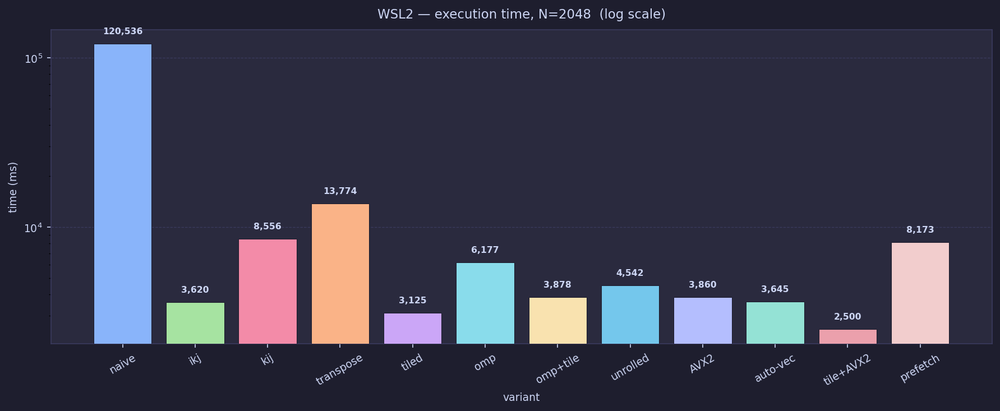

at N=2048, `tile+AVX2` takes the lead at 2,500 ms. `tiled` (no AVX2) at 3,125 ms now beats plain `AVX2` at 3,860 ms. with a 96 MB working set, cache-friendly access (tiling) contributes more than compute throughput (AVX2 vectors). `naive` reaches 120,536 ms, 48.2x slower than `tile+AVX2`.

### N = 10000 (naive skipped)

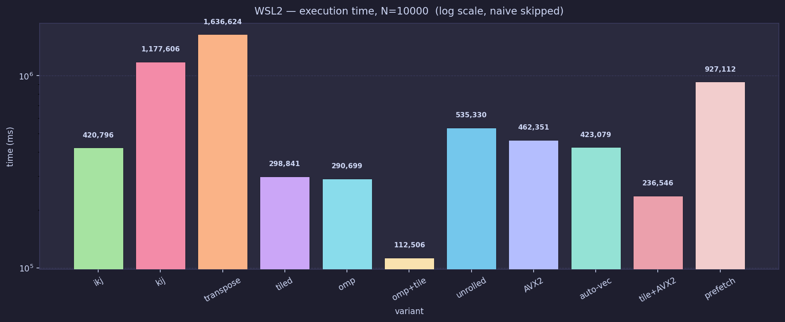

at N=10000, `omp+tile` dominates on WSL2 at 112,506 ms, 2.1x faster than `tile+AVX2` at 236,546 ms. this is the first size where OpenMP helps: the 2.4 GB working set gives each thread its own independent DRAM stream instead of all threads competing for the same cache lines. `naive` was skipped, its O(N^3) scaling from N=2048 projects to about 4 hours.

---

## execution time, Luna (bare metal)

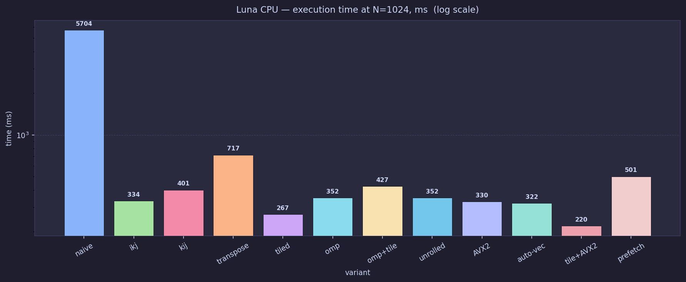

Luna confirms the N=1024 ranking: `tile+AVX2` fastest at 220 ms, `naive` at 5,703 ms (25.9x slower). absolute times are faster than WSL2 because the Xeon sustains higher clock speed, but the relative ordering of cache-sensitive variants is the same.

---

## the platform flip at N=10000

this is the most important finding across both platforms. at N=10000, the winner on WSL2 and the winner on Luna are different variants.

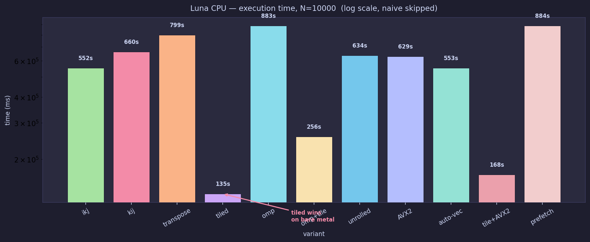

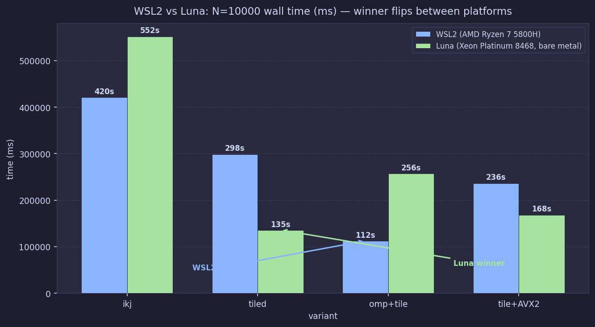

on Luna at N=10000: `tiled` (no AVX2) wins at 135,663 ms. `tile+AVX2` is second at 168,350 ms. `omp+tile` is the **slowest** of the tiled variants at 256,721 ms.

on WSL2 at N=10000: `omp+tile` wins at 112,506 ms. `tiled` is third at 298,841 ms.

| variant | WSL2 ms | Luna ms | WSL2 rank | Luna rank |
|---|---|---|---|---|
| `tiled` | 298,841 | **135,663** | 3rd | **1st** |
| `tile+AVX2` | 236,546 | 168,350 | 2nd | 2nd |
| `omp+tile` | **112,506** | 256,721 | **1st** | 3rd |
| `ikj` | 420,796 | 552,098 | 4th | 4th |

two things drive this flip. first, `tiled` without AVX2 has fewer instructions (838B vs 1,501B for `tile+AVX2` at N=10000) even though `tile+AVX2` has higher IPC (3.2 vs 2.2). the instruction count advantage wins. second, Luna's 4-thread `omp+tile` runs at only 52.5% parallel efficiency (256 s of task-clock on 4 cores = 64 s real time, not 112 s, so NUMA effects are compounding). WSL2's simpler memory topology makes OpenMP more effective at this size.

the conclusion "omp+tile wins at N=10000" is WSL2-specific. on bare metal at this scale, single-threaded tiling beats multi-threaded tiling.

Luna N=10000 pipeline stall percentages confirm the story:

| variant | stall % at N=10000 (Luna) | vs stall % at N=1024 |
|---|---|---|
| `tiled` | 13.5% | 29.0% at N=1024 (fewer stalls at scale) |
| `tile+AVX2` | **8.3%** | 13.5% at N=1024 (tiles increasingly compute-bound) |
| `omp+tile` | 34.1% | 37.3% at N=1024 (thread contention at scale) |
| `ikj` | 70.4% | 44.6% at N=1024 (DRAM-bound at large N) |

`tile+AVX2` stall rate drops from 13.5% at N=1024 to 8.3% at N=10000, tiles still fit in L2 and the variant becomes more compute-bound as N grows. `ikj` stall rises to 70.4% at N=10000 because the 2.4 GB working set sends every LLC miss to DRAM. `omp+tile` stays high at 34.1% because the 4 threads contend for DRAM bandwidth on the dual-socket Xeon.

---

## IPC: instructions per cycle (Luna only)

**what it means:** IPC measures how busy the CPU's execution pipeline (the chain of stages that processes instructions, like an assembly line) is. a CPU can theoretically retire 4-5 instructions per cycle. low IPC means the pipeline is frozen waiting for data. high IPC means it is doing productive work each cycle.

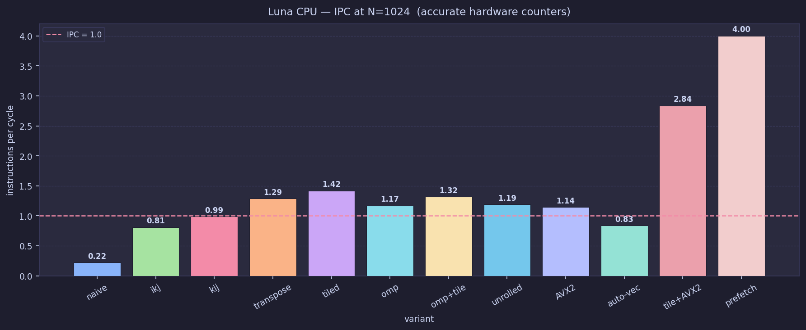

`naive` has IPC = 0.22 at N=1024. the stall counter (measured separately) shows 83% of all cycles are frozen waiting for memory. `ikj` jumps to IPC = 0.81 purely from loop reorder. `tile+AVX2` reaches 2.84, the highest among non-prefetch variants, because tiles stay in L2 and AVX2 issues 4-wide vector ops that occupy multiple execution units per cycle.

`prefetch` has IPC = 4.0, the highest. this looks like a win. it is not. the high IPC comes from efficiently executing 5.976 billion instructions, 7.5x more than `ikj` at N=1024, most of which are prefetch micro-ops issuing ahead of actual compute. the IPC is high because the pipeline is never idle, but the total instruction count is enormous. wall time = instructions / (IPC x clock frequency). 7.5x more instructions, partially offset by higher IPC, still means a slower result.

### IPC across all three sizes

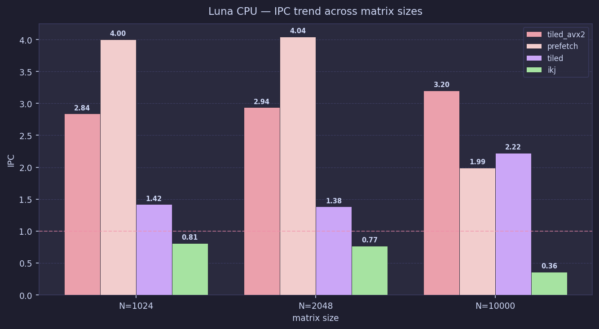

`tile+AVX2` IPC rises from 2.84 to 2.94 to 3.20 as N grows from 1024 to 2048 to 10000. tiles keep fitting in L2 regardless of total matrix size, so compute stays the bottleneck. `prefetch` IPC collapses from 4.00 at N=1024 to 1.99 at N=10000. at N=10000 the working set is 2.4 GB, the prefetch distance is insufficient, LLC miss rate blows up to 68%, and the pipeline stalls despite the prefetch instructions. `ikj` IPC falls from 0.81 to 0.36 at N=10000 as it becomes fully DRAM-bound (LLC miss rate 92.3%).

---

## cache miss rates (Luna N=1024)

**what it means:** the CPU loads data in 64-byte blocks called cache lines. an L1 miss means the requested data was not in the fastest cache (4-cycle access) and had to be fetched from L2 or deeper. an LLC miss (last-level cache miss, meaning an L3 miss on Xeon at ~40 cycle access) means it went all the way to DRAM. both rates are expressed as a percentage of total load requests.

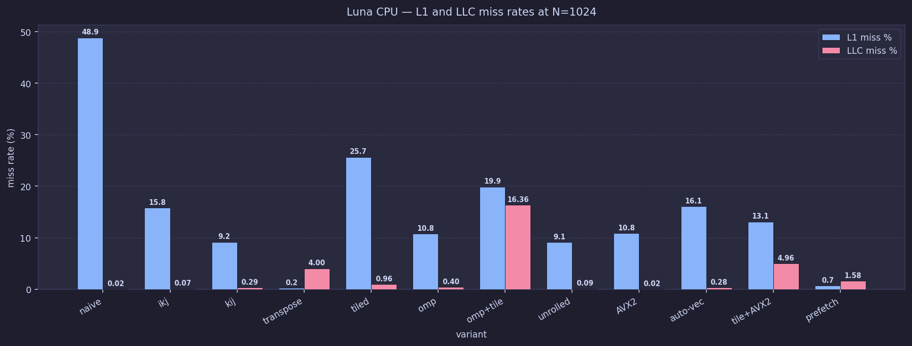

`naive` has 48.9% L1 miss rate at N=1024. nearly every other access misses L1 because `naive` reads B in column order, in the `ijk` loop, the inner loop increments `j` but the middle loop reuses the same column positions across k-iterations, and each column element is 8 KB apart in memory (N x 8 bytes). the hardware prefetcher cannot predict this jumping pattern.

`transpose` achieves 0.23% L1 miss rate (lowest), because after pre-transposing B, both A and Bt are read row-by-row sequentially. but its LLC miss rate is 4.0% because the O(N^2) transpose pass itself evicts working data from L3 during setup, and the extra computation adds time.

`tile+AVX2` has 13.1% L1 miss and 4.97% LLC miss. not the lowest individual miss rate but the right combination for overall speed. adding AVX2 to `tiled` (25.7% L1 miss) halves the L1 miss rate because wider vector loads change how much data is pulled per instruction.

`prefetch` has 0.65% L1 miss, near zero, because the prefetch instructions pre-load data into cache before it is needed. but the total instruction count (5,976M vs `tile+AVX2`'s 1,757M) dominates.

---

## stalled cycles (Luna N=1024)

**what it means:** stall % is the fraction of total CPU cycles where the pipeline assembly line is frozen because a needed data item has not arrived from cache or memory yet. 83% stall means the CPU is idle 5 out of every 6 cycles.

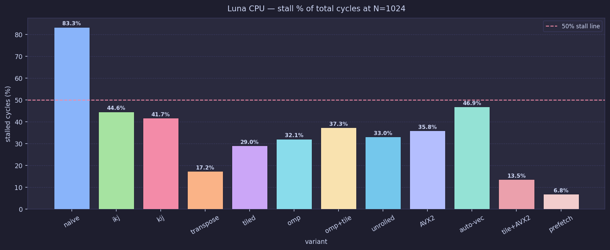

`naive` stalls 83.3% of the time. `tile+AVX2` stalls only 13.5%. that 70-point gap is the difference between a memory-bound and a compute-bound program. `prefetch` achieves the lowest stall at 6.8%, because the cache pre-loads reduce pipeline waits. but all that freed pipeline time is spent issuing prefetch micro-ops instead of FMA compute.

`auto-vec` stalls 46.9% despite using the same vectorisation strategy as `AVX2` (330 ms vs 321 ms on Luna at N=1024, effectively the same time). the compiler vectorises but does not tile, so it still processes large memory regions between loop iterations.

---

## TMA: top-down microarchitecture analysis (Luna)

**what it means:** TMA (top-down microarchitecture analysis) tells you what the CPU's pipeline was doing when it wasn't retiring useful instructions. think of it like a doctor's report: "you lost X% of your capacity to memory waits, Y% to compute bottlenecks." "memory bound" counts cycles lost to any memory wait. "L3 bound" drills down further: of the memory-bound fraction, how much was specifically L3 cache latency. "core bound" means the compute units themselves are the limit. "DRAM bound" means waiting on main memory. because these metrics are sub-classifications of each other (L3-bound is measured as a fraction of memory-bound time), the numbers in the chart are not independent percentages that sum to 100%.

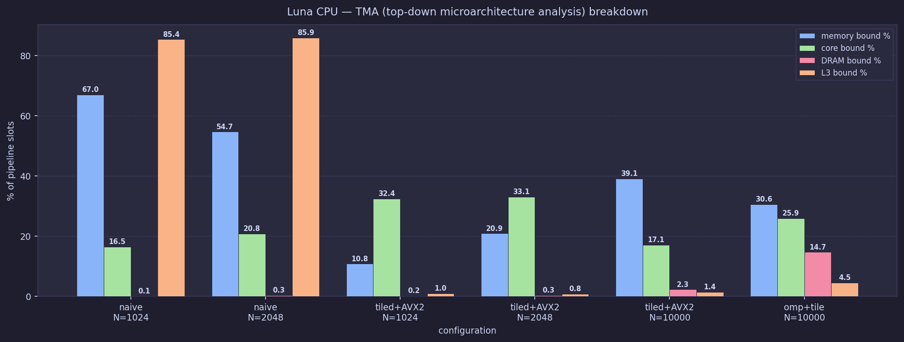

`naive` at N=1024: 85.4% of memory-bound cycles are specifically L3-bound. the cache data exists in L3 on the Xeon (24 MB working set < 105 MB L3), but each access still takes ~40 cycles to service from L3 because the column-stride access pattern prevents the prefetcher from pre-loading. at N=2048 this holds at 85.9% because the access pattern is identical and more of the working set (96 MB) starts exceeding the 105 MB L3.

`tile+AVX2` at N=1024: L3-bound drops to 1.0% of memory-bound time, and the profile becomes 32.4% core-bound. tiles stay in L2 so L3 is rarely visited. the bottleneck shifts to compute throughput, which is the right problem to solve with AVX2.

at N=10000: `tile+AVX2` goes to 39.1% memory-bound with 2.3% DRAM-bound, the 2.4 GB working set now forces DRAM traffic even with tiling. `omp+tile` at N=10000 is 14.7% DRAM-bound, confirming multiple thread streams are hitting DRAM simultaneously.

---

## GPU performance (L40S, N=10000)

**precision note:** all CPU benchmarks use `double` (FP64, 64-bit float, 52 mantissa bits). the GPU kernels below use FP32 (single precision, 23 mantissa bits) or TF32 (10 mantissa bits). these are not numerically equivalent computations. a fair precision-matched comparison would use `cublasDgemm` (FP64), which was not run in this study. the speedup numbers below are an upper bound on what a precision-equivalent GPU kernel would achieve. the L40S FP64 peak (~22 TFLOPS) is about 4x lower than its FP32 peak (~91 TFLOPS).

**what GFLOPS means:** giga floating-point operations per second. higher is faster.

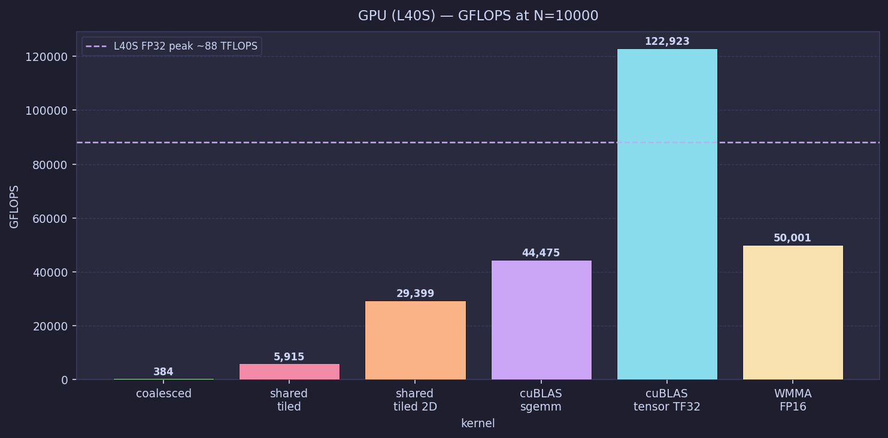

| kernel | precision | time (ms) | GFLOPS | vs CPU best (WSL2) |
|---|---|---|---|---|
| `coalesced` | FP32 | 5,209 | 384 | 22x |
| `shared tiled` | FP32 | 338 | 5,915 | 333x |
| `shared tiled 2D` | FP32 | 68 | 29,399 | 1,654x |
| `cuBLAS sgemm` | FP32 | 45 | 44,475 | 2,500x |
| `WMMA FP16` | FP16 | 40 | 50,001 | 2,813x |
| `cuBLAS tensor TF32` | TF32 | **16.3** | **122,923** | **6,900x** |

`cuBLAS tensor TF32` finishes in 16.3 ms vs the WSL2 CPU best of 112,506 ms, a 6,900x speedup at lower precision. it achieves 122,923 GFLOPS, which is approximately 68% of the L40S TF32 tensor-core dense peak (~181 TFLOPS), a strong result.

`coalesced` GPU at 5,209 ms is 22x faster than the CPU best, but 320x slower than `cuBLAS tensor TF32` on the same GPU. the coalesced kernel uses 1D thread blocks, which causes poor occupancy (fraction of GPU thread blocks running in parallel at once), the register allocation per thread limits how many thread blocks the GPU can schedule simultaneously. most of the GPU's execution units sit idle.

the lesson: a naive GPU port of a CPU algorithm does not automatically win. kernel quality determines whether you use the hardware.

---

## scaling behaviour

**what it means:** an O(N^3) algorithm should show exactly 8x slowdown when N doubles. sub-8x scaling means the variant is getting proportionally more efficient at larger sizes, usually because overhead (thread synchronisation, tile setup) is amortised. super-linear (above 8x) means the access pattern degrades worse as N grows.

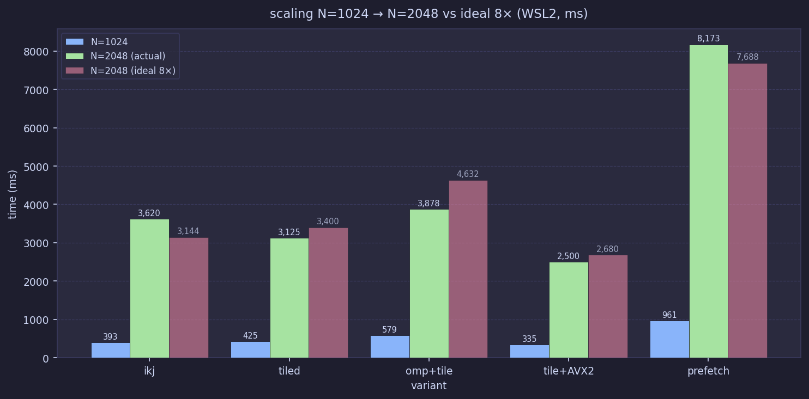

`tiled` and `tile+AVX2` both scale at 7.4-7.5x, slightly sub-linear. their WSL2 L2 miss rate stays at 0.7% (N=1024) and 0.9% (N=2048), near-constant because tile size is fixed at 64x64 and tiles always fit in L2 regardless of total matrix size.

`omp+tile` scales at 6.7x because at N=2048 the larger dataset starts giving each thread independent DRAM streams.

`kij` degrades at 18.1x, super-linear. in kij order, the outer loop iterates over k and on each k-iteration reads the entire B[k][:] row while updating all of C. the B matrix is 8 MB at N=1024 and fits in the Ryzen's 16 MB L3, so B rows warm up after the first k-pass and are cache-resident on re-access. at N=2048, B grows to 32 MB, larger than the 16 MB L3. each k-iteration now evicts the previous k's B row before it can be reused. the WSL2 L3 miss rate measurement confirms this: `kij` L3 miss rate doubles from 2.2% at N=1024 to 4.3% at N=2048, while `ikj` miss rate actually improves (6.0% to 3.5%) over the same size increase. that doubling of miss rate, compounding over N^3 operations, explains the super-linear timing growth.

`naive` L3 cache miss count grows 17.2x when N doubles (expected 8x), confirming the access pattern degrades super-linearly.

---

## what i learned

- **loop order is the cheapest fix.** `ikj` over `ijk` gives 25x speedup on WSL2 (9,961 ms to 393 ms at N=1024) or 17x on Luna bare metal (5,704 ms to 334 ms). the gap differs because WSL2's virtualised memory subsystem amplifies the penalty for bad access patterns. the hardware prefetcher handles sequential row access for free. column-stride access defeats every cache level.

- **tiling dominates at mid-N and sub-linearly scales.** `tile+AVX2` scales at 7.5x from N=1024 to N=2048 vs theoretical 8x. WSL2 L2 miss rate stays at 0.7-0.9% across both sizes because 64x64 tiles always fit in L2. a 32x32 tile variant was tested and ran 13-20% slower (less reuse per tile visit).

- **the platform flips at N=10000.** on WSL2, `omp+tile` wins at 112,506 ms. on Luna bare metal, plain `tiled` (no AVX2, no OpenMP) wins at 135,663 ms, with `omp+tile` the slowest of the three at 256,721 ms. OpenMP's 52.5% parallel efficiency at this size means NUMA contention and thread overhead eat the gains on the Xeon. do not assume the WSL2 winner is the hardware winner.

- **`naive` degrades super-linearly.** L3 cache miss count grows 17.2x when N doubles (expected 8x). at N=2048, WSL2 L2 miss rate reaches 43.9%. at N=10000 on Luna, LLC miss rate for `ikj` is 92.3%, essentially every LLC request goes to DRAM.

- **software prefetch hurts sequential access.** `prefetch_ikj` is 2.4x slower than `ikj` at N=1024 (961 ms vs 393 ms) and 2.2x slower at N=10000 (927,112 ms vs 420,796 ms) on WSL2. at N=1024 it issues 7.5x more instructions than `ikj` (5,976M vs 802M). at N=10000 the ratio grows to 9.2x. the hardware prefetcher handles sequential access perfectly. `__builtin_prefetch` is useful for irregular access like hash-table probing, not matrix rows.

- **GPU wins by up to 6,900x, but only with the right kernel and precision.** `cuBLAS tensor TF32` at N=10000 finishes in 16.3 ms (122,923 GFLOPS, ~68% of L40S TF32 tensor-core peak). the CPU comparison used double precision; GPU used TF32 (fewer bits). the speedup is an upper bound on what a fair FP64-to-FP64 comparison would give. the `coalesced` GPU kernel at 5,209 ms is 22x faster than the CPU best but 320x slower than `cuBLAS tensor TF32`. kernel algorithm quality matters as much on GPU as it does on CPU.
