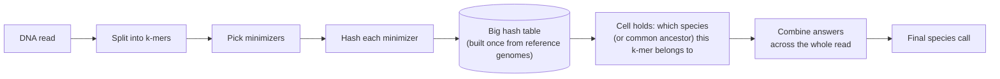

# Making Kraken2 Faster and Smaller — Project Plan

Written 2026-08-18, for anyone outside this project who needs the full picture with no prior context — every term gets defined before it's used, nothing assumed.

## The problem, in one sentence

You have a DNA sample from a patient or an environmental swab, potentially containing dozens of species of bacteria and viruses. You want to know, for every single read the sequencer produced, which species it came from — fast enough and cheap enough in memory to run on real hospital or field hardware, not just a supercomputer. That's what this whole project is about improving.

## What Kraken2 actually does

Kraken2 is the existing, widely-used tool this project builds on. Here's how it classifies a read:

1. It chops every DNA read into overlapping short fragments called **k-mers** — a fixed-length string of DNA letters, typically 31 characters long. A 150-character read produces well over 100 overlapping k-mers.
2. For efficiency, it doesn't look up every single k-mer — it picks one representative k-mer per small window, called a **minimizer**, and only looks that one up.
3. Each minimizer gets converted into a number (a **hash**) and used to look up an entry in one giant table sitting in memory — the **hash table**. This table was built once, ahead of time, from a reference database of known genomes (bacteria, viruses, etc.) — every k-mer found in every reference genome got a slot.
4. Each slot in that table (a **cell**) stores which part of the tree of life — which species, genus, or broader group — that k-mer came from. If a k-mer only ever appears in one species, the cell says so exactly. If it appears in several related species, the cell stores their nearest common branch on the tree (the **lowest common ancestor**, or LCA) — the most specific answer that's still true for all of them.
5. Kraken2 does this for every minimizer in the read, then combines the answers across the whole read to decide, overall, which species the read most likely came from.

**Why the hash table is the bottleneck.** That table is huge — tens to hundreds of gigabytes for a comprehensive reference database — and every single minimizer lookup means jumping to a essentially-random location in it. Modern CPUs are very fast at computing, but comparatively slow at fetching data from a location in memory they haven't touched recently — so a classification run spends most of its time waiting on these lookups, not computing. Two ways to attack that: make the table itself smaller (so more of it fits in fast memory), or catch repeat lookups before they ever reach the table. This project attacks both, plus tries to make the lookups themselves cheaper.

## What "Patch 4" is (context you'll hear referenced constantly)

Before this project's two current thesis pieces existed, earlier work on this project (with our supervisor, Prof. Kolin Paul — referred to as "sir" throughout this project) identified and tested seven candidate speed optimizations for Kraken2, numbered Patch 1 through Patch 4 (three more were designed but never built). **Patch 4 is the one this whole project's Thesis 1 builds on**, so it needs its own clear explanation:

**Patch 4 is a small, fast lookup cache that sits in front of the giant hash table**, one per CPU thread. It's a **direct-mapped cache**: 16,384 slots, each thread gets its own private copy, and each one is small enough (256 kilobytes) to fit entirely inside a CPU's L2 cache — a small, extremely fast pool of on-chip memory, much faster than reaching out to the giant table sitting in ordinary RAM. Every time a thread looks up a minimizer, it checks this small cache first; only on a miss does it pay the expensive cost of reaching into the giant table.

This works because of a simple measured fact: the same k-mer gets looked up again and again within real sequencing data — measured at a **90.7% reuse rate** in this project's own profiling. A small cache catching most of those repeats avoids most of the expensive big-table lookups.

**"Direct-mapped" is the key limitation Thesis 1 fixes.** In a direct-mapped cache, every k-mer maps to exactly *one* possible slot — no choice, no flexibility. If two different, both-currently-useful k-mers happen to map to the same slot, one evicts the other immediately, even if there was room elsewhere in the cache. This is a well-known weakness borrowed from CPU hardware-cache design, where the fix is also well-known: a **set-associative** cache, where each k-mer can land in any of several (say, 4) candidate slots, so two colliding k-mers don't have to fight over the same single spot.

**Current real-world status, for credibility:** Patch 4 was actually applied to Kraken2's source code and benchmarked on 2026-08-03. The result is real but modest, and it has a specific weakness: the benefit shrinks as thread count grows (each thread's slice of the workload gets less repetitive as more threads split the work, so there's less to catch) and grows with database size. That thread-count-dependent weakness is exactly what Thesis 1's "hardware-aware sizing" piece is designed to fix.

## Thesis 1 — Adaptive K-mer Cache

**What our supervisor asked for** (three things, no specific method attached to any of them):
1. Upgrade Patch 4's cache from direct-mapped to **4-way set-associative** (the fix described above).
2. Make the cache size itself **aware of the actual hardware it's running on** — different machines have different amounts of fast on-chip cache memory; a cache sized for one machine wastes memory or underperforms on another.
3. Give the cache a **smart eviction policy driven by biology** — instead of a generic rule, one that understands that real sequencing data is skewed (some k-mers are far more common than others, and that pattern depends on which species are actually in the sample).

**What we've added — the specific mechanisms, all our own design work, found through today's literature research:**

- **[OUR ADD-ON] The eviction algorithm itself.** Sir asked for "biology-dependent adaptive eviction" without specifying how. We found that the exact same design problem — "what to keep in a small fast cache when the important things aren't just the most recent ones" — has been solved independently, in different words, by four completely unrelated fields of computer science: caching for large language model inference, caching for a different kind of large-scale ML system called Mixture-of-Experts, caching for recommendation-engine lookup tables, and general database indexing research. None of those four fields cite each other, yet they converge on the same answer: track a *decayed* history of how important each item has been (not just whether it was used recently), and permanently protect a small set of universally important items rather than letting them get evicted just because something newer showed up. We're combining these into the eviction policy: track decayed importance per k-mer, and permanently protect the handful of k-mers that show up constantly across almost every sample (highly conserved genetic regions), the way the busiest items in those four other systems get protected.
- **[OUR ADD-ON] The sizing algorithm.** Sir asked for hardware awareness. We found a systems-research method (originally built for choosing how much fast memory to give a database) for actually *picking* the right cache size: instead of guessing a fraction of the available fast memory, simulate several candidate sizes against real recorded data-access patterns and pick the cheapest one that hits your performance target.
- **[OUR ADD-ON, this session] Organism-blocked predictive partitioning — a new idea, not yet fully vetted.** This project targets a small, fixed panel of species (the ESKAPE pathogens — six clinically important, hard-to-treat bacteria this project's reference database is built around, not a general open-ended set). Because the panel is small and fixed, we can give each species its own dedicated slice of the cache, sized unevenly by how common each species actually is in real samples — rather than one shared pool every k-mer from every species competes for equally. On top of that, track a short rolling window of the last several k-mer lookups within the current read: real reads are compositionally consistent (if the last 20 k-mers came from species A, the rest of the read almost certainly does too), so that window can predict which species' cache slice to protect *before* enough evidence has piled up to justify it reactively. This idea is a direct translation of a trick from a competing tool called Kun-peng (explained next), applied to a completely different part of the system.

## Where the Kun-peng idea came from, and why it needed translating rather than copying

**Kun-peng is a real, actively maintained, peer-reviewed competing tool** (Rust, published March 2026) that reimplements Kraken2's algorithm with one clever trick: instead of loading its entire giant hash table into memory before it can classify anything (which is what Kraken2 normally does), it slices the table into sequential ~4-gigabyte blocks stored on disk, and loads only the block a given lookup actually needs, on demand. That trick cuts memory use dramatically — up to 24x less memory to build the database, up to 473x less memory to run a classification — without shrinking the database itself; the file on disk is exactly the same size, Kun-peng just avoids holding all of it in memory at once.

That trick operates at a completely different level of the machine than either of our thesis pieces — it's about RAM and disk, gigabyte-scale, not about the CPU's on-chip cache, kilobyte/megabyte-scale, which is what Thesis 1 targets. So we couldn't just adopt Kun-peng's trick directly. What we *could* do is take the underlying idea — "don't treat the whole structure as one flat pool; divide it into meaningful blocks, and decide which blocks deserve to be resident right now" — and translate it down to the CPU-cache scale, using "one block per species" instead of "one block per 4 gigabytes of disk." That's exactly the organism-blocked partitioning idea described above. Same principle, entirely different implementation, because it has to operate at a completely different scale.

## Thesis 2 — Cell-Width Reduction + Double Hashing

**Background this thesis extends:** earlier project work already shrank each cell in Kraken2's hash table from 32 bits down to 24, then 16 bits — fewer bits per entry means more entries fit in the same amount of memory, i.e. a smaller database. That earlier work also worked out and published the mathematical relationship between how narrow you make a cell and how often two unrelated k-mers accidentally collide into the same cell (a **false positive** — the classifier reports a species that isn't actually there).

**What our supervisor asked for** (three specific future-work items from that earlier published report, again with the "what" specified but not the "how" beyond the basic concept):
1. Merge a caching layer into this thesis, tying it to Thesis 1's cache work.
2. Replace Kraken2's current collision-handling method (**linear probing** — when two k-mers collide into the same cell, just check the very next cell, then the next, until you find an open one) with **double hashing** (use a second, independent calculation to decide how far to jump ahead on a collision, instead of always checking the immediately next cell — this spreads collisions out more evenly and shrinks the false-positive problem).
3. Design a **6-bit-per-organism bitmask cell** — for this project's small fixed 6-species panel, instead of storing a species/ancestor ID in each cell, store one yes/no bit per species: "did this k-mer come from species 1? species 2?" and so on. When two k-mers collide here, instead of one answer overwriting the other and destroying it completely, the two answers get combined (bit-OR'd) — the true answer survives, you just pick up one extra, incorrect "maybe" bit, a much gentler kind of mistake than Kraken2's normal all-or-nothing collision.

**What we've added:**

- **[OUR ADD-ON] Combining double hashing with an extra placement trick.** Once you've built the two independent calculations double hashing needs, you can reuse them for something extra: instead of only using them to decide "where to jump next after a collision," use them to generate 2-4 *candidate* slots for a k-mer up front, and place it in whichever candidate is currently emptiest when the database is built. This is a well-established idea in computer science (called "power-of-d-choices") that we're combining with double hashing specifically because it's nearly free — same two calculations, just used differently — and it has real, deployed precedent in other production systems.
- **[OUR ADD-ON] The actual math for the bitmask cell's mistake rate.** Sir's report named the bitmask cell as something to build, but nobody — not this project, not anyone in the published literature we searched — had worked out the formula for how often it produces that gentler "extra maybe bit" mistake. We found the right mathematical toolkit to derive it (borrowed from a technique called Count-Min Sketch, originally built for a completely different counting problem, adapted here because both problems share the same shape: something gets combined into a shared slot instead of overwriting it).

## Checking these ideas aren't already someone else's published work

Before finalizing any of the above, we did close, careful reads of the four tools most likely to have already done this — the same rigor as a plagiarism/prior-art check:

| Competing tool | What it does | Does it threaten our plan? |
|---|---|---|
| **Kun-peng** | Loads Kraken2's table in on-demand blocks, cutting RAM use | No — different scale of the machine entirely (RAM/disk, not CPU cache) |
| **kache-hash** | A hash table engineered for cache-friendly *streaming* access (like counting k-mers as you read a genome) | No — but it's the closest real overlap. It bakes cache-friendliness into a fixed, unchanging table layout; ours is a separate, small structure that adapts live and actively decides what to keep vs. throw away. Different mechanism, same general neighborhood — worth explaining clearly, not just citing |
| **Chimera / TAXICF** | Uses a different filter structure (cuckoo filters) to genuinely shrink a taxonomic database on disk | **Partially yes** — it really does shrink the database, using a totally different method, for large databases (hundreds of thousands of species). Our "smaller database" framing needs to lean on the *specific mechanism* (narrower cells, double hashing, bitmask cell, for a small fixed panel) rather than claim to be the only way to shrink a database |
| **Taxor** | Uses XOR filters, each species gets its own separate storage | No — it deliberately never lets different species share a storage slot, so it can't have the "gentle collision" problem our bitmask cell is specifically designed to have and handle well |

## A possible third piece of work, separate from what sir asked for

Sir's own report already flagged that Thesis 2's collision-handling work and Thesis 1's cache work were meant to eventually merge. There's a genuine research question hiding in that merge that neither thesis answers on its own: **do these pieces help each other, or fight each other, when run together?** For example — making cells narrower (Thesis 2) increases how often two different k-mers collide, which could make the cache (Thesis 1) less trustworthy about what it's holding onto, since more of what it caches might now be a collision-corrupted answer. Nobody has measured whether combining all these pieces produces a bigger win than the sum of the parts, or whether they partially cancel each other out. This isn't something either thesis currently answers — it would mean actually building both pieces together and measuring the interaction, not just each piece alone. Flagging this as a real option, not a decided plan — worth raising as a question rather than presenting as settled work.

## Bottom line

Two thesis directions were assigned at a high level: an adaptive cache, and a smaller/better-hashed database. Everything about *how* each of those actually gets built — the specific eviction algorithm, the specific sizing method, the specific hashing combination, the specific false-positive math, and the new species-blocked cache-partitioning idea — is this project's own design work, checked carefully against the closest four competing tools to make sure none of it has already been done elsewhere.
