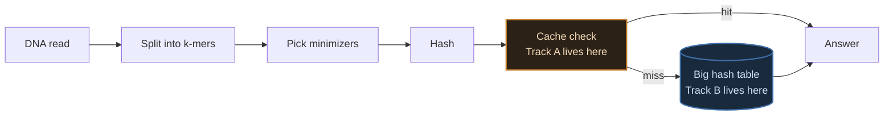
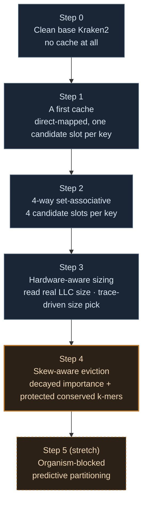
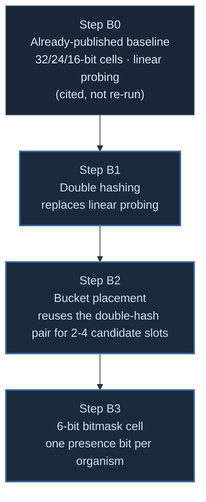

# Week 4 Plan — Building Both Theses From Scratch

Every piece of this gets built fresh, against real base Kraken2, one change at a time, benchmarked before the next change goes in. By the end of the week you should have a number for every single piece of both theses, not one combined "it's faster now" figure per thesis.

> [!NOTE]
> Two tracks, run independently: **Track A** builds the adaptive k-mer cache (Thesis 1) from a clean base — nothing exists yet, everything gets measured fresh. **Track B** picks up Thesis 2 where the already-published cell-width work left off, and builds the *unbuilt* pieces (double hashing, bucket placement, the bitmask cell) the same way — the 32/24/16-bit cell-width numbers themselves are already real and published, so those aren't being re-run for no reason.

## Where each track sits in the system



Track A changes what happens before the big table is ever touched. Track B changes the table itself — how big each cell is, how collisions get resolved, and what a cell actually stores.

## Track A — Thesis 1, the build order



Each arrow is one commit, one benchmark run, one number. If step 3 makes things worse, that's immediately visible and attributable — it can't hide inside a combined result.

## Track A — per-step detail

| Step | Change | What it isolates | Where the design comes from |
|---|---|---|---|
| 0 | Nothing — clean `kraken2-src`, unmodified | The true zero point | — |
| 1 | Thread-local direct-mapped cache, one candidate slot per k-mer | Does *any* cache help, and by how much | A first, simplest working version |
| 2 | Same cache, 4 candidate slots per k-mer instead of 1 | Does fixing the one-slot collision weakness help further | Sir's Thesis 1 target #1 |
| 3 | Cache size read from real hardware at startup, picked via trace-driven simulation against candidate sizes | Does matching the cache to the actual machine help beyond a fixed guess | Sir's Thesis 1 target #2, method from Bandana |
| 4 | Eviction policy: decayed importance per k-mer, permanent protection for conserved k-mers | Does a smart eviction rule beat whatever step 3 was doing by default | Sir's Thesis 1 target #3, grounded in 4 converging literatures (see `week3_thesis_plan_presentation.md`) |
| 5 | Per-organism cache partitions + read-local prediction window | Does the new idea add anything on top of step 4 | This project's own addition, translated from Kun-peng |

> [!IMPORTANT]
> Steps 0-4 map exactly onto sir's three assigned Thesis 1 targets, split so each one gets its own number. Step 5 is the only one that isn't something he asked for — keep it clearly separated in the results, not folded into "Thesis 1's number."

## Track B — Thesis 2, the build order



| Step | Change | What it isolates | Where the design comes from |
|---|---|---|---|
| B0 | Nothing new — cite the existing 32/24/16-bit, linear-probing numbers | The real starting point this track builds from | Already-published cell-width work |
| B1 | Linear probing replaced with double hashing, same cell width as B0's working point | Does spreading collisions instead of clumping them reduce the false-positive rate at a given load factor | Sir's Thesis 2 target #2 |
| B2 | Reuse the same double-hash pair to generate 2-4 candidate slots, bucketed 4-way, greedy-packed at build time | Does build-time placement add anything on top of double hashing alone | Our own addition — not asked for |
| B3 | Cell changed to a 6-bit-per-organism presence bitmask, collisions OR instead of overwrite | Does the gentler collision model actually produce fewer *wrong* classifications, not just fewer *overwritten* ones | Sir's Thesis 2 target #3, plus our own derived false-positive formula, validated against the measured collision rate here |

> [!IMPORTANT]
> B1-B3 map onto sir's three Thesis 2 targets in the same order he named them. B2 is the one piece that isn't something he asked for — same rule as Track A's step 5, keep it visibly separate in the results.

## Action plan — how each step actually gets run

Same discipline as every hands-on session on this project: one command at a time, explained before it runs, result logged before moving to the next. Nothing gets batched.

**Before step 0 — confirm the ground is clean**
```bash
$ ssh student@luna.cse.iitd.ac.in
$ cd ~/tools/kraken2-src && git status   # confirm no leftover patch is already applied
```

**Step 0 — the baseline, no code touched yet**
```bash
$ perf stat -e cache-misses,cache-references,LLC-loads,LLC-load-misses,instructions,cycles \
  numactl --cpunodebind=0 --membind=0 \
  kraken2 --db ~/AccuracyDrift/databases/<DB> \
  --threads 32 \
  --output /dev/null --report /dev/null \
  /home/student/results/basecalling/reads_hac.fastq
```
Same command this project has used for every prior measurement — keeps step 0 directly comparable to earlier baseline numbers, not a fresh unrelated one.

**Track A steps 1-5 and Track B steps 1-3 — the repeating loop, once per step**
1. Implement the one change for this step, against the clean (or previous-step) source — nothing else touched.
2. `make -s clean && make -s -j 96` — rebuild.
3. Run the exact same profiling command as step 0, same database, same thread count.
4. Log the result next to the previous step's number.
5. Commit and push before starting the next step.

## What Wednesday should walk away with

Two tables — six rows for Track A (steps 0-5), four rows for Track B (B0 cited, B1-B3 freshly measured) — each with a real measured number underneath it, not a projection. That's the difference this week is for: previously, wall-time numbers in the project's own docs turned out to be *projected* from earlier profiling estimates, never actually measured end to end. This time every row gets run for real before it's written down.
