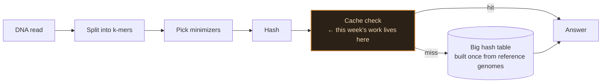
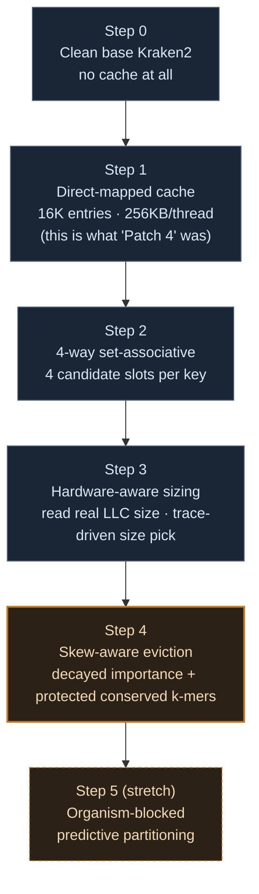

# Week 4 Plan — Rebuilding the Cache From Scratch

Nobody remembers exactly how or when Patch 4 got built the first time, and that's a problem for a thesis that needs every number traceable to one specific change. So week 4 throws it out and rebuilds it as a clean ablation: one change at a time, against real base Kraken2, benchmarked before moving to the next step. By the end of the week you should have a number for every single piece of Thesis 1, not one combined "it's faster now" figure.

> [!NOTE]
> Scope: this plan rebuilds the **caching side** (Patch 4 → Thesis 1) from a clean base. The cell-width/double-hashing side (Thesis 2) is separate, already-published work from earlier sessions and isn't being redone here — flag if that assumption is wrong before starting.

## Where this sits in the system



Every step this week changes what happens inside that one highlighted box. Nothing else in the pipeline moves.

## The build order — a clean ablation, not a big-bang rewrite



Each arrow is one commit, one benchmark run, one number. If step 3 makes things worse, that's immediately visible and attributable — it can't hide inside a combined result the way it could last time.

## Per-step detail

| Step | Change | What it isolates | Where the design comes from |
|---|---|---|---|
| 0 | Nothing — clean `kraken2-src`, unmodified | The true zero point | — |
| 1 | Thread-local direct-mapped cache, one candidate slot per k-mer | Does *any* cache help, and by how much | Rebuild of the original Patch 4 concept |
| 2 | Same cache, 4 candidate slots per k-mer instead of 1 | Does fixing the one-slot collision weakness help further | Sir's Thesis 1 target #1 |
| 3 | Cache size read from real hardware at startup, picked via trace-driven simulation against candidate sizes | Does matching the cache to the actual machine help beyond a fixed guess | Sir's Thesis 1 target #2, method from Bandana |
| 4 | Eviction policy: decayed importance per k-mer, permanent protection for conserved k-mers | Does a smart eviction rule beat whatever step 3 was doing by default | Sir's Thesis 1 target #3, grounded in 4 converging literatures (see `week3_thesis_plan_presentation.md`) |
| 5 | Per-organism cache partitions + read-local prediction window | Does the new idea add anything on top of step 4 | This project's own addition, translated from Kun-peng |

> [!IMPORTANT]
> Steps 0-4 map exactly onto sir's three assigned Thesis 1 targets, split so each one gets its own number. Step 5 is the only one that isn't something he asked for — keep it clearly separated in the results, not folded into "Thesis 1's number."

## Action plan — how each step actually gets run

Same discipline as every hands-on session on this project: one command at a time, explained before it runs, result logged before moving to the next. Nothing gets batched.

**Before step 0 — confirm the ground is clean**
```bash
$ ssh student@luna.cse.iitd.ac.in
$ cd ~/tools/kraken2-src && git status   # confirm no leftover patch is already applied
```

**Step 0 — the baseline, no code touched yet**
```bash
$ perf stat -e cache-misses,cache-references,LLC-loads,LLC-load-misses,instructions,cycles \
  numactl --cpunodebind=0 --membind=0 \
  kraken2 --db ~/AccuracyDrift/databases/<DB> \
  --threads 32 \
  --output /dev/null --report /dev/null \
  /home/student/results/basecalling/reads_hac.fastq
```
Same command this project has used for every prior measurement — keeps step 0 directly comparable to earlier baseline numbers, not a fresh unrelated one.

**Steps 1-5 — the repeating loop, once per step**
1. Implement the one change for this step, against the clean (or previous-step) source — nothing else touched.
2. `make -s clean && make -s -j 96` — rebuild.
3. Run the exact same profiling command as step 0, same database, same thread count.
4. Log the result next to the previous step's number.
5. Commit and push before starting the next step.

## What Wednesday should walk away with

A table with six rows — step 0 through step 5 — each with a real measured number underneath it, not a projection. That's the difference this week is for: last time, the wall-time numbers in the project's own docs turned out to be *projected* from earlier profiling estimates, never actually measured end to end. This time every row gets run for real before it's written down.
